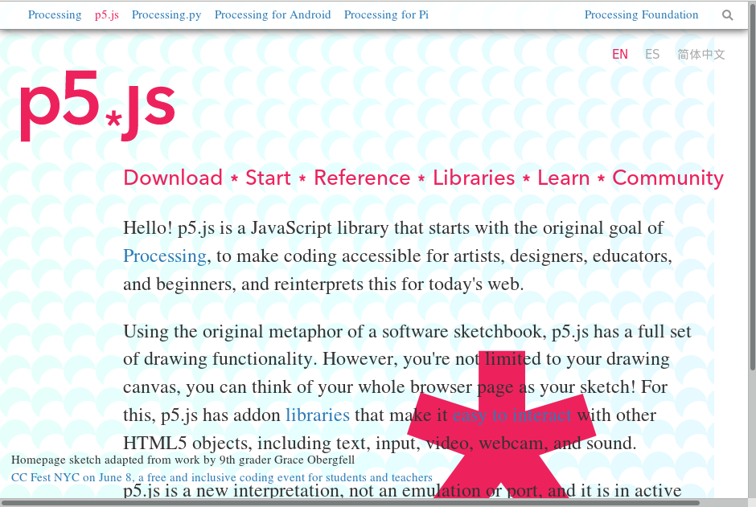

## 1. Getting Started

## 1.1 Begin()
It is fairly common, or sometimes mandatory, having programming and/or creative coding course in university programmes like Computer Science, Information Engineering, Computational Arts and Creative Media. However, it is still required some reasons for students to make sense of having a programming course in their programmes like digital design, information studies, visual arts, cultural studies where they do not want to be a programmer in their future career, or they even haven't thought about it is possible. 

One of the key arguments across the East and West is that coding is "the literacy of today", and as the 21st century skill "we must learn to master" [1](#myfootnote1). Argubly, knowing some basic coding skills will enhance employability in the future. But to call a skill as literacy, it implies this is something related to everyday life and everyday use. Beyond coding literacy, we also observe other kinds of literacy, such as data and digital literacy. So, what are the implications that coding is framed under the umbrella of literacy, and for whom? Annette Vee, the author of the book "Coding Literacy", weaves together parallel histories of writing and coding movements, to compare and trace what it means by literacy, and how to understand the rise of computing and the cultural discourse around the importance of code and coding. Indeed, it is commonly seen that writing and coding, text and code are used to discuss in parallel, which is especially seen in humanities genre like electronic literature, digital humanities and software studies [2](#myfootnote2). You will also see such discussion regarding code and language in Chapter 7 - Vocable Code. As in our earlier claim about gaining an expanded coding literacy by reading and using this book, we take one of Vee's arguments for coding literacy, which is to learn new ways to think, and that literacy no longer enough for just "reading for comprehension", but also "reading for technical thought as well as writing with complex structures and ideas" [3](#myfootnote3). Such argument for literacy, however, is not only about individual but more concerning wider cultural and society levels, which is aligned with the field Software Studies and the positioning of this book. This will lead to a different way of coding practice beyond specialized discplines like Computer Science and Enginnering, the so-called 'STEM' curriculum and approaches. Vee's book is not a programming book, and does not address the question of how to program with practical code sample and exercises, but the book is very rich in terms of unpacking the notion of literacy from a historical and comparative manner. 

In 2016, Nick Montfort, who is a poet and professor of digital media at MIT, published a book called 'Exploratory Programming for Arts and humanities', providing a hands-on approach to programming. In the appendix of his book, he outlines three key reasons to answer the question "Why Program?", which is also the chapter title [4](#myfootnote4). This includes learning to program allows us to think in new ways by bringing different methods and perspectives to raise new questions. Secondly, programming offers us a better understanding of culture and media systems. Consequently, we can learn to develop better, or better analysis of, cultural systems. Last but not the least, programming can help us improving society by means of creating, designing and discovering programs. [will expand later -w] All in all, the book is an exploration of "computation as culture". However, the articulation is somehow not enough in terms of how different exercises and concepts help us to think and understand about culture, such as matching within Text, Object-Oriented Temperature.

As the first chapter of this book, we think that it is important to have a reflection about why do we need to learn programming, which is also a way to set the scene and sustain our motivation to learn persistently. By understanding from many others, learning to code is a deep learning process with enjoyment and achivement definately but also with frustration in most of the times, specially there are new perspectives, syntaxes and structure to explore and experiment at the first place. It may not come naturally but takes time to familiar with computational thinking through structured logics and precise procedures. 

To reiterate again, our focus in this book addresses the cultural and aesthetic dimensions of programing as a means to think critically and computationally at the times in which our experiences are ever programmed and surrounded by computational infrastructure. 

### 1.1.1 Start()

*Figure 1: p5.js web interface*

Throughout the entire book, we will use javascript as the main programming language, and primarily focus on p5.js and it's associated libraries. Practically speaking, p5.js is a web-based library, utilizing open source javaSript frameowrk that makes creating projects with code on the web accessible, as well as much easier sharing via Internet, such as p5 Web Editor, Open Processing, Git hosting platforms without additional installation. Through a web browser, a javascript-based project can be run and executed through a URL. Javascript was originally developed in 1995 by Brendan Eich with the aim to run a program in Netscape's browser. (ref: http://cis.msjc.edu/csis125a/resources/papers-Brendan-Eich-JavaScript-Copyright-IEEE.pdf) Some people might be confused with javascript and Java. They ran in two different systems. Javascript is a lightweight interpreted lauguage which is usually used for, and enhance, web applications via its animated visual and interactive behaviors, and it was first designed to complement Java. Java, a compiled and complex programming language, was first released to public in 1996 by Sun Microsystems, meaning that source code is typically written in an Integrated Development Environment (IDE). It is required to compile into bytecode for computer processing by Java Virtual Machine (JVM). Java powers many desktop and mobile applications, from small apps on Android mobile devices to games like Minecraft (ref: https://minecraft.gamepedia.com/Development_resources). For the purpose of the introduction to programming, we need something that is less complicated in terms of getting started but with a capacity to grow in proficiency. This is often called low floors and high ceilings, and javascript is a good tool from a practical perspective. 

But there is much more about introducing p5.js

What is, and why, p5.js? 
Web p5.js
the concept of runme, readme

## 1.2 Working Environment
p5.js + Atom + Gitlab

### 1.2.1 p5.js 
- concept of directory
- web editor
- reading code and syntax 

### 1.2.2 Code editor 
- ATOM and libraries 
- change theme color 
- collaborative writing 

### 1.2.3 Git and Repository
- Gitlab
- open processing.org 

## 1.3 not Hello World
- Running the program with a web browser
- web browser console 

## 1.4 While()

- Culture of Github: Matthew Fuller, Andrew Goffey, Adrian Mackenzie, Richard Mills and Stuart Sharples, "Big Diff, Granularity, Incoherence, and Production in the Github Software Repository" in How To Be a Geek: Essays on the Culture of Software. => Versioning

- Creative Commons and Licence

- Open Source Software and Culture

## 1.4.1 Excercise in class 
?

## 1.4.2 Mini_Exervise[1]: Think About My First Program
**Objective:**
- To learn the basic setup, including writing code with a code editor, running code with a web browser, independent study of code syntax, uploading files on gitlab, creating a readme file, etc.
- To reflect upon the process of coding

**To get some additional inspiration here:**
- [Daily sketch in Processing by Saskia Freeke](https://twitter.com/sasj_nl) and her talk is [here](https://www.youtube.com/watch?v=nBtGpEZ0-EQ&fbclid=IwAR119xLXt4nNiqpimIMWBlFHz9gJNdJyUgNwreRhIbdJMPPVx6tq7krd0ww) + [All the Daily Things 2018](https://vimeo.com/309138645) by Saskia Freeke
- [Zach Lieberman](https://www.instagram.com/zach.lieberman/)
- [Basics in OpenProcessing](https://www.openprocessing.org/browse/?q=basics&time=anytime&type=all#)
- [Creative Coding with Processing and P5.JS](https://www.facebook.com/groups/creativecodingp5/)

**Task (RUNME):**
1. Make sure you have read/watch the required readings/instructional videos and references
2. Study at least one syntax from the list of p5.js' [reference](https://p5js.org/reference/) (of course, it is always good to know more different syntax. Be curious!)
3. Familiar yourself with the reference structure: example, description, syntax and parameters (This becomes your essential and life-long skills for learning new syntax on your own)
4. Use, Read, Modify (or even combine) the sample code that you found (the most basic level is changing the numbers), and produce a new sketch as a 'runme'

**Questions to think about as README:**
- Describe your first independent coding process (in relation to thinking, reading, copying, modifying, writing, uploading, sharing, commenting code)
- How your coding process is differ from, or similar to, reading and writing text? 
- What is code and coding/programming practice means to you?

## Required reading:
- Montfort, Nick. *Exploratory Programming For the Arts and Humanities*. Canbridge, Mass.: MIT Press, 2016. 267-277 (Appendix A: Why Program?)
- Vee, Annette. *Coding Literacty: How Computer Programming Is Changing Writing*. Canbridge, Mass.: MIT Press, 2017. 43-93 (Chapter 1 Coding for Everyone and the Legacy of Mass Literacy)
- McCarthay, Lauren. [Learning While making P5.JS](https://www.youtube.com/watch?v=1k3X4DLDHdc), OPENVIS Conference, 2015.
- Shiffman, Daniel. (2018) 1.1: Code! Programming with p5.js [online] Available at: https://www.youtube.com/watch?v=yPWkPOfnGsw&list=PLRqwX-V7Uu6Zy51Q-x9tMWIv9cueOFTFA&index=2 [Accessed 09 Sep. 2019].
- p5.js. p5.js | get started. [Web] Available at: https://p5js.org/get-started/ [Accessed 09 Sep. 2019].
- Gitlab. Gitlab Web Editor. [Web] Available at: https://docs.gitlab.com/ee/user/project/repository/web_editor.html [Accessed 09 Sep. 2019].

## Further reading:
- Lennon, Brian."JavaScript Affogato: Programming a Culture of Improvised Expertise". *Configurations*, Volume 26, Number 1, Winter 2018, pp. 47-72

## Notes

<a name="myfootnote1">1</a>: Having coding skills become an important direction both in education, corporations and policy making across West and East continents. See, for instance,  https://ec.europa.eu/digital-single-market/en/coding-21st-century-skill and https://news.microsoft.com/apac/features/coding-way-brighter-future-2018-beyond/

<a name="myfootnote2">2</a>: John Cayley, The code is not the text unless it is the text, 2002 electronic book review, available at http://electronicbookreview.com/essay/the-code-is-not-the-text-unless-it-is-the-text/, see also Katherine Hayles, *Writing Machines* (Cambridge, Mass.: MIT Press, 2002)

<a name="myfootnote3">3</a>: Annette Vee, *Coding Literacy: How computer programing is changing writing* (Cambridge, Mass.: MIT Press, 2017, 45-58).

<a name="myfootnote4">4</a>: Nick Montfort, *Exploratory Programming for the Arts and Humanities* (Cambridge, Mass.: MIT Press, 2016). 
