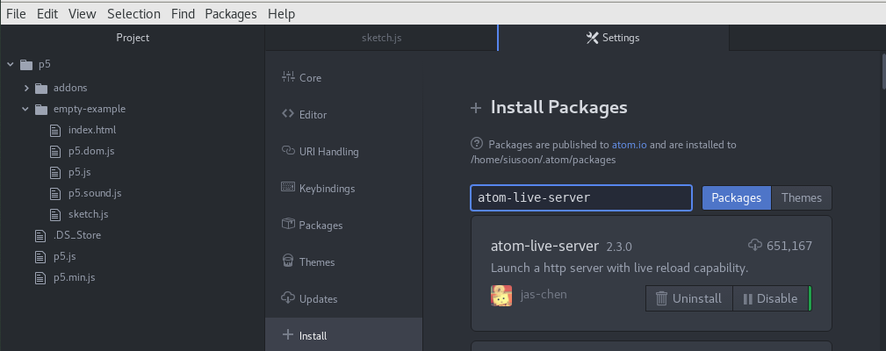
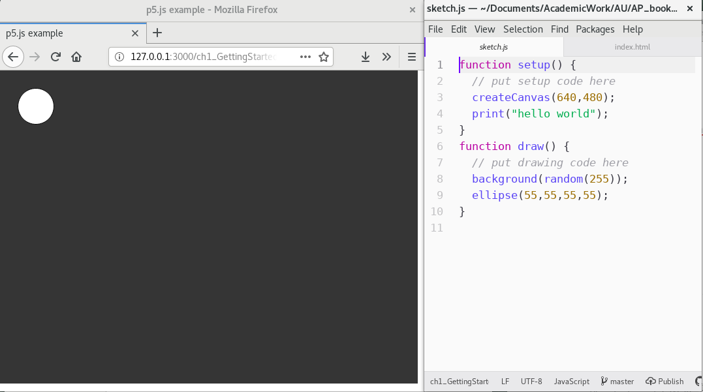

## 1. Getting Started

## 1.1 Begin()
[G: feel free to cut below. My main point of starting is to think about why we need to code as the departure point - first class /w] <p>
It is fairly common, or sometimes mandatory, having programming and/or creative coding course in university programmes like Computer Science, Information Engineering, Computational Arts and Creative Media. However, it is still required some reasons for students to make sense of having a programming course in their programmes like digital design, information studies, visual arts, cultural studies where they do not want to be a programmer in their future career, or they even haven't thought about it is possible. 

One of the key arguments across the East and West is that coding is "the literacy of today", and as the 21st century skill "we must learn to master" <sup>[1](#myfootnote1)</sup>. Argubly, knowing some basic coding skills will enhance employability in the future. But to call a skill as literacy, it implies much wider social situations and cultural relations in everyday life and everyday use which is how Annette Vee, the author of the book "Coding Literacy", suggests us to shift our focus from skill to wider relations: 
>  "Seeing programming in light of the historical, social, and conceptual contexts of literary helps us to understand computer programming as an important phenomenon of communication, not simply as another new skill or technology"<sup>[2](#myfootnote2)</sup>.  

Beyond coding literacy, we also observe other kinds of literacy in mainstream media, policy making and academic discourses, such as procedural, data and digital literacy<sup>[3](#myfootnote3)</sup>. So, what are the implications that coding is framed under the umbrella of literacy, and for whom? In her book, Vee weaves together parallel histories of writing and coding movements, to compare and trace what it means by literacy, and how to understand the rise of computing and the cultural discourse around the importance of code and coding. Indeed, it is commonly seen that writing and coding, text and code are used to discuss in parallel, which is especially seen in humanities genre like electronic literature, digital humanities and software studies <sup>[4](#myfootnote4)</sup>. You will also see such discussion regarding code and language in Chapter 7 - Vocable Code. As in our earlier claim about gaining an expanded coding literacy by reading and using this book, we take one of Vee's arguments for coding literacy, which is to learn new ways to think, and that literacy no longer enough for just "reading for comprehension", but also "reading for technical thought as well as writing with complex structures and ideas" <sup>[5](#myfootnote5)</sup>. Such argument for literacy, however, is not only about individual but more concerning wider cultural and society levels, which is aligned with the field Software Studies and the positioning of this book. This will lead to a different way of coding practice beyond specialized discplines like Computer Science and Enginnering, the so-called 'STEM' curriculum and approaches. Vee's book is not a programming book, and does not address the question of how to program with practical code sample and exercises, but the book is very rich in terms of unpacking the notion of literacy from a historical and comparative manner. 

In 2016, Nick Montfort, who is a poet and professor of digital media at MIT, published a book called 'Exploratory Programming for Arts and humanities', providing a hands-on approach to programming. In the appendix of his book, he outlines three key reasons to answer the question "Why Program?", which is also the chapter title <sup>[6](#myfootnote6)</sup>. This includes learning to program allows us to think in new ways by bringing different methods and perspectives to raise new questions. Secondly, programming offers us a better understanding of culture and media systems. Consequently, we can learn to develop better, or better analysis of, cultural systems. Last but not the least, programming can help us improving society by means of creating, designing and discovering programs. [will expand later -w] All in all, the book is an exploration of "computation as culture". However, the articulation is somehow not enough in terms of how different exercises and concepts help us to think and understand about culture specifically. 

As the first chapter of this book, we think that it is important to reflecting on why do we need to learn programming, which is also a way to set the scene and sustain our motivation to learn persistently. Knowing the fact that not all new learners would like to be a creative coder or programmer, we would then like to address on code as a means to work computationally and think conceptually on wider cultural issues. By understanding from many others, learning to code is a deep learning process with enjoyment and achivement definately but also with frustration in most of the times, specially there are new perspectives, syntaxes and structure to explore and experiment at the first place. It may not come naturally but takes time to familiar with computational thinking through structured logics and precise procedures. 

### 1.1.1 Start()


*Figure 1: p5.js web interface*

Throughout the entire book, we will use javascript as the main programming language, and primarily focus on p5.js and it's associated libraries. Practically speaking, p5.js is a web-based library, utilizing open source javaSript framework that makes creating projects with code on the web accessible, as well as much easier to share via Internet, such as p5.js Web Editor, Open Processing, Git hosting platforms without additional installation. Through a web browser, a javascript-based project can be run and executed through a URL. Javascript was originally developed in 1995 by Brendan Eich with the aim to run a program in Netscape's browser <sup>[7](#myfootnote7)</sup>. Some people might be confused with javascript and Java. They are operated in two different systems. Javascript is a lightweight programming lauguage which is usually used for, and enhance, web applications via its animated visual and interactive behaviors, and it was first designed to complement Java. Indeed, program code from any high-level programming languages, which is closer to human languages but further from machines' operations, require translating into native machine instructions/code for a computer to run and execute. This translation process is usually done through interpreters or compilers. JavasScript by design is an interpreted language, but is now mostly, in modern browsers, operated via both interpreter and just-in-time compilers to translate source code to native machine code at runtime <sup>[8](#myfootnote8)</sup>. It is generally faster to kick start the code running process but it takes longer when the application is more complex and with longer interactions as extra runtime overhead will be incurred. <sup>[9](#myfootnote9)</sup> On the contrary, Java, a compiled and complex programming language, was first released to public in 1996 by Sun Microsystems, meaning that source code is typically written in an Integrated Development Environment (IDE). It is required to optimize and compile into static bytecode for computer processing by Java Virtual Machine (JVM). Java powers many desktop and mobile applications, from small apps on Android mobile devices to games like Minecraft <sup>[10](#myfootnote10)</sup>, while javaScript mainly works for smaller web-based applications e.g websites and bots. For the purpose of the introduction to programming, we need something that is less complicated in terms of getting started but with a capacity to grow in proficiency. This is often called low floors and high ceilings<sup>[11](#myfootnote11)</sup>, and javascript is a good tool from such practical perspective. 

But there is much more to just introduce the tool from a practical perspective. This book will use p5.js, a javascript library which is created by artist Lauren McCarthy in 2014 for creative coding. It was begun by Casey Reas and Ben Fry who developed their remarkable and influencial open source project - Processing in 2001 <sup>[12](#myfootnote13)</sup>, which is a Java-based desktop environment, with the aim to reach out coding beyond computer science community for artists and designers. However, McCarthy observes that various creative open source software in the market are mostly developed by white men, and there is a lack of diversity in such environment. Having Reas' encouragement, McCarthy started to investigate what would Processing looks like on the web. The main idea for p5.js is not just deploying Processing to web-based platform, but the central idea is to take diversity and inclusivity explicitly and seriously in software development and communication. As McCarthy says, "thinking about community outreach and diversity is not a secondary goal of p5.js, it's the foundation on which the platform is built." <sup>[13](#myfootnote13)</sup> Within just a couple years, the contributers of p5.js developed the community statement, translated the interface into different languages such as Spanish and Simplified Chinese <sup>[14](#myfootnote14)</sup>, started the homepage series as part of p5.js showing works and interviews by Asian women and gender non-conforming coders <sup>[15](#myfootnote15)</sup>, added high constrasting mode and audio feedback for people who has difficult in seeing <sup>[16](#myfootnote16)</sup>, developed a series of workshops on creative expression called 'Signing Coders' to reach out youth who are deaf or hard of listening <sup>[17](#myfootnote17)</sup>. As p5.js shows us, software is not only about technical tools, but equally important is to put people and humanistic values into the forefront.

[others: Web p5.js, the concept of runme, readme /w]

## 1.2 Working Environment
Similar to writing a document, you need an editor to write and document. For writing code, this book will use [Atom](https://atom.io/)(https://atom.io/), which is a free and open-souce text and source code editor across platforms. Additionally Gitlab will be the main platform for code and text respository.

### 1.2.1 p5.js 
1. First go to the [download page](https://p5js.org/download/) of p5.js (https://p5js.org/download/), get the p5.js complete library (in the compressed format of 'p5.zip') by clicking it and saving the file which includes all the necessary libraries to run the code. 
2. Double click the zip and unzip the file to extract all the files associated with the compressed one, then you should see another new folder is created called 'p5'. 
3. The next part is crucial for on-going development process, because you have to somehow decide where is your working folder. If you have no clue, you may consider to use 'Desktop'. (Foldering is a concept used for organizing files in your device, which is similar to organize papers, folders, books in a bookshelf or cooking utentials in a cabinet. With the increasing streamlined UX design, many people find alienated to navigate or locate the path and directory of files, like pictures, in a device as we are getting more used to put everything on the first few pages of a phone or on a desktop folder.)  
4. I assume you put the unzipped folder 'p5' on a customized directory, then you should see the list of files under the folder as below. You should see the two p5.js libraries, one is the complete one (p5.js) and the other is the 'mini' version of it (p5.min.js). 
<br> <br>
*Figure 2: p5 folder hierarchy*
5. Click on the folder 'empty-example', and then you will see a list of files and that will be the way to kick start:
<br><br>
*Figure 3: p5 folder hierarchy* 

*  **index.html** - the default Hypertext Markup Language (HTML) which will be first picked up by a web browser. HTML is a fundamental technology used to define the structure of a webpage and it can be customized to include text, links, images, multimedia, forms, and other different elements. 
*  **sketch.js** - the key working file for writing JavaScript. 
*  **p5.js** - p5.js core library.
*  **p5.sound.js** -p5.js sound library<sup>[18](#myfootnote18)</sup> for web audio functionality, including features like playback, listening to audio input and audio analysis and synthesis.  
*  **p5.dom.js** - p5.js dom library (we will return to this in Chapter 4).

### 1.2.2 Code editor 
ATOM will be used as a key code editor in this book. Apart from its free and open source nature, ATOM supports cross-platform editing which can be run on Mac OS, Windows and Linux. 
1. Download the software ATOM from the homepage: https://atom.io/
2. Drag the 'p5' folder that you have just unzipped onto ATOM. You should able to see the left hand pane with your project. Then you try to navigate to the 'index.html' file under the 'empty-example' folder, double click that file and the source code should display on the right hand pane. See below: 
<br><br>
*Figure 4: The file structure of ATOM* 

The 'index.html' is the default page, among other pages and files, that a web browser will first pick up and display. You can customize a page title and other styling, but the focus for this chapter will be navigating the libaries and run our first program. Since p5.js is a library, here on line 8-11 which indicates how to incorporate javascript files and libraries by using the tags `<script>` and `</script>. `

Right now the script is using relative paths, which is a useful concept when we need to understand how the libraries are operated, locate the files and how to incorporate new libraries and files in the future. The javascript libraries are simply files, we have to incorporate these files into the html so that they can be imported and read by the program. This means that when we use p5 syntax, the program can recognize the syntax and the corresponding function. For this particular example, it is important to aware that the javascript libraries and the html file are in the same directory. If we move the libraries to somewhere, we will then need to update the path.

Next you will need to install a package called 'atom-live-server'[ref: https://atom.io/packages/atom-live-server], and this is useful for setting up a web server and you can update your code and see the result immediately on a browser without the need to refresh it. You can first check under 'Packages' on your menu bar and see if the package is there. If not, then go to Edit > Preferences > +Install, then type 'atom-live-server'. Hit the blue install button and you should able to find it again under the Packages menu. 

 <br>
*Figure 5: Installing atom-live-server* 

You can also customize the theme by going to Preferences > Themes.

### 1.2.3 my First program
Sketch.js is the working file. It doesn't have much things inside with only two functions. 
* `function setup()` - Code within this function will only run once by the sketch. We usually put things like setting up the canvas size and background color here to define the basic sketch setup. 
* `function draw()` - Code within this function will keep on looping, and that means the function draw() is called on each frame. The default rate is 60 frames/times per second, and this is especially useful when things are in motion or constantly being captured. 

Let's try to input these code into the sketch to draw a canvas with a red background color, then the sketch will further draw an ellipse locating somewhere on the top left corner. (Details of the code will further explain later)

```javascript
function setup() {
  // put setup code here
    createCanvas(640,480);
    background(255,0,0);
}
function draw() {
  // put drawing code here
    ellipse(56,46,55,55);
}
```

* To run the code, you just need to go to Packages > atom-live-server (or you can use the shortcut Crtl + Alt + L). Then there will be a popup window, click on the empty-example folder and it should display something like below:
 <br>
*Figure 6: My first program* 

## 1.2.3.1 Excercise in class 
1. Try to rename the folder 'empty-example' to 'myFirstSketch' (in order to help the computer to process better, don't use space in between)
2. Try to create a folder called 'libraries' under 'myFirstSketch'
3. Drag the three p5 libraries into the folder
4. Change the relative path of the three js libraries in index.html
5. Can you run the program so that you can see the same screen as Figure 6? 

### 1.2.3 Git and Repository
- Gitlab
- open processing.org 

## 1.3 not Hello World
- Running the program with a web browser
- web browser console 
- web editor
- reading code and syntax 

## 1.4 While()

- Culture of Github: Matthew Fuller, Andrew Goffey, Adrian Mackenzie, Richard Mills and Stuart Sharples, "Big Diff, Granularity, Incoherence, and Production in the Github Software Repository" in How To Be a Geek: Essays on the Culture of Software. => Versioning

- Creative Commons and Licence

- Open Source Software and Culture

## 1.4.1 Excercise in class 
- foldering 
- reading and using sample syntax

## 1.4.2 Mini_Exervise[1]: Think About My First Program
**Objective:**
- To learn the basic setup, including writing code with a code editor, running code with a web browser, independent study of code syntax, uploading files on gitlab, creating a readme file, etc.
- To reflect upon the process of coding

**To get some additional inspiration here:**
- [Daily sketch in Processing by Saskia Freeke](https://twitter.com/sasj_nl) and her talk is [here](https://www.youtube.com/watch?v=nBtGpEZ0-EQ&fbclid=IwAR119xLXt4nNiqpimIMWBlFHz9gJNdJyUgNwreRhIbdJMPPVx6tq7krd0ww) + [All the Daily Things 2018](https://vimeo.com/309138645) by Saskia Freeke
- [Zach Lieberman](https://www.instagram.com/zach.lieberman/)
- [Basics in OpenProcessing](https://www.openprocessing.org/browse/?q=basics&time=anytime&type=all#)
- [Creative Coding with Processing and P5.JS](https://www.facebook.com/groups/creativecodingp5/)

**Task (RUNME):**
1. Make sure you have read/watch the required readings/instructional videos and references
2. Study at least one syntax from the list of p5.js' [reference](https://p5js.org/reference/) (of course, it is always good to know more different syntax. Be curious!)
3. Familiar yourself with the reference structure: example, description, syntax and parameters (This becomes your essential and life-long skills for learning new syntax on your own)
4. Use, Read, Modify (or even combine) the sample code that you found (the most basic level is changing the numbers), and produce a new sketch as a 'runme'

**Questions to think about as README:**
- Describe your first independent coding process (in relation to thinking, reading, copying, modifying, writing, uploading, sharing, commenting code)
- How your coding process is differ from, or similar to, reading and writing text? 
- What is code and coding/programming practice means to you?

## Required reading:
- Montfort, Nick. *Exploratory Programming For the Arts and Humanities*. Canbridge, Mass.: MIT Press, 2016. 267-277 (Appendix A: Why Program?)
- Vee, Annette. *Coding Literacty: How Computer Programming Is Changing Writing*. Canbridge, Mass.: MIT Press, 2017. 43-93 (Chapter 1 Coding for Everyone and the Legacy of Mass Literacy)
- McCarthay, Lauren. [Learning While making P5.JS](https://www.youtube.com/watch?v=1k3X4DLDHdc), OPENVIS Conference, 2015.
- Shiffman, Daniel. (2018) 1.1: Code! Programming with p5.js [online] Available at: https://www.youtube.com/watch?v=yPWkPOfnGsw&list=PLRqwX-V7Uu6Zy51Q-x9tMWIv9cueOFTFA&index=2 [Accessed 09 Sep. 2019].
- p5.js. p5.js | get started. [Web] Available at: https://p5js.org/get-started/ [Accessed 09 Sep. 2019].
- Gitlab. Gitlab Web Editor. [Web] Available at: https://docs.gitlab.com/ee/user/project/repository/web_editor.html [Accessed 09 Sep. 2019].

## Further reading:
- Lennon, Brian."JavaScript Affogato: Programming a Culture of Improvised Expertise". *Configurations*, Volume 26, Number 1, Winter 2018, pp. 47-72

## Notes

<a name="myfootnote1">1</a>: Having coding skills become an important direction both in education, corporations and policy making across West and East continents. See, for instance,  https://ec.europa.eu/digital-single-market/en/coding-21st-century-skill and https://news.microsoft.com/apac/features/coding-way-brighter-future-2018-beyond/

<a name="myfootnote2">2</a>: Annette Vee, *Coding Literacy: How computer programing is changing writing* (Cambridge, Mass.: MIT Press, 2017, 4).

<a name="myfootnote3">3</a>: Ian Bogost, Procedural Literacy: Problem Solving with Programming, Systems, & Play, *The Journal of Media Literacy*, 52, no.1-2, 2015,; Michael Mateas, Procedural Literacy: Educating the New Media Practitioner. *On the Horizon. Special issue. Future of Games, Simulations and Interactive Media in Learning Contexts*, v13, n1, 2005.; Markham, Annette N. “Taking Data Literacy to the Streets: Critical Pedagogy in the Public Sphere.” Qualitative Inquiry, (August 2019). doi:10.1177/1077800419859024.; Teressa Umali, Exclusive: Promoting digital Literacy in the Philippine education system, *OpenGov Asia*, web, available at: https://www.opengovasia.com/promoting-digital-literacy-in-the-philippine-education-system/

<a name="myfootnote4">4</a>: John Cayley, The code is not the text unless it is the text, 2002 electronic book review, available at http://electronicbookreview.com/essay/the-code-is-not-the-text-unless-it-is-the-text/, see also Katherine Hayles, *Writing Machines* (Cambridge, Mass.: MIT Press, 2002)

<a name="myfootnote5">5</a>: Vee, *Coding Literacy: How computer programing is changing writing*, 45-58.

<a name="myfootnote6">6</a>: Nick Montfort, *Exploratory Programming for the Arts and Humanities* (Cambridge, Mass.: MIT Press, 2016). 

<a name="myfootnote7">7</a>: Charles Severance, Javascript: Designing a Language in 10 Days, *IEEE Computer Society*, Feburary 2012, 7-8. 

<a name="myfootnote8">8</a>: Lin Clark who works at Mozilla and turn code into code cartoons, and she explains how javascript is run in the browser, see: https://hacks.mozilla.org/2017/02/a-crash-course-in-just-in-time-jit-compilers/. 

<a name="myfootnote9">9</a>: Seong-Won Lee and Soo-Mook Moon. 2011. Selective just-in-time compilation for client-side mobile javascript engine. In *Proceedings of the 14th international conference on Compilers, architectures and synthesis for embedded systems (CASES '11)*. ACM, New York, NY, USA, 5-14. DOI: https://doi.org/10.1145/2038698.2038703 

<a name="myfootnote10">10</a>: See, https://minecraft.gamepedia.com/Development_resources

<a name="myfootnote11">11</a>: A concept was first formulated by mathematician, computer scientist, and educator Seymour Papert who was a MIT Professor and created a design principle for a programming language called Logo. See, Seymour Papert, *Mindstorms: Children, Computers, and Powerful Ideas* (New York, NY: Basic Books, 1980).

<a name="myfootnote12">12</a>: See Processing.org 

<a name="myfootnote13">13</a>: Lauren McCarthy, P5js Diversity & Floss Panel Introduction, 2015. Video, available at http://opentranscripts.org/transcript/p5js-diversity-floss-panel-introduction/.

<a name="myfootnote14">14</a>: Maya Man, p5.js is now available in Spanish, *Processing Foundation*, 2016, web, available at: https://medium.com/processing-foundation/p5-js-is-now-available-in-spanish-3d1eab9dffa0; see also Kenneth Lim, Chinese Translation for p5.js and preparing a future of more translations, 2018, web, available at: https://medium.com/processing-foundation/chinese-translation-for-p5-js-and-preparing-a-future-of-more-translations-b56843ea096e

<a name="myfootnote15">15</a>: Such series with a focus on diversity with code+art is placed under the subdomain of p5.js, created and curated by Chelly Jin, see: diversity.p5js.org

<a name="myfootnote16">16</a>: A UX-research project by Claire Kearney-Volpe, see: https://www.clairekv.com/p5js-ux-research

<a name="myfootnote17">17</a>: A project by artist and educator Taeyoon Choi, see: http://taeyoonchoi.com/soft-care/signing-coders/

<a name="myfootnote18">18</a>: See https://p5js.org/reference/#/libraries/p5.sound.