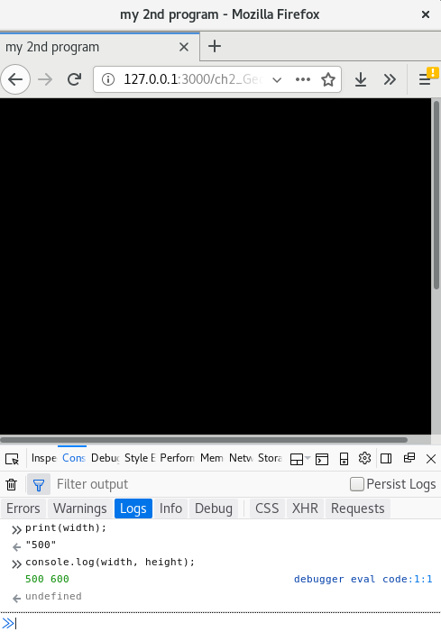

## 2. Having fun with Geometry

## 2.1 function setup()
Building upon the previous first sample code on the shape - ellipse, we want to further explore various shapes, size, positions, space, lengths, areas which are regarded as geometry in the discipline of Mathematics. It has many applications within daily encounters, including road signs, typography, architecture, art and design. In particular, points, lines, panes are regarded as the foundational elements of Design as the elements constitute objects, in which the world is made up of various objects in different shape, size and space. It is fun to learn Geometry especially in the areas of creative arts and primary education (ref: https://www.amazon.co.uk/Geometry-Fun-Vicky-Owyang-Chan/dp/145755884X/ref=sr_1_1?keywords=9781457558849&linkCode=qs&qid=1569494462&s=books&sr=1-1, 2017) because geometry relates to the properties of everyday and familiar objects,  but at the same time it is challenging to create new patterns and forms of representation which is aesthetically pleasing. 

But fun in computing, as Olga Goriunova argues, is considered as a mode thinking and reasoning (ref: xxx). Through making and creating new computational objects, one is making sense of the world through logics and procedures. In other words, fun
is about paradox and sense making. Typing emojis is fun in communication and social media to express one's emotions and thoughts, and thereby emojis concern both bodily and material affections. Emojis consist of geometry, creating abstracted facial representation with lines, points, panes and color.  This chapter is about having fun with geometric emojis, the affective expressions and facial representations that we use in almost all sort of electronic communications. It is fun as it is related to subjectivity and abstraction, producing a subjecthood and abstracting certain facial characteristics, which are not an actual representation of one's face but an imaginary and constructed one. 

With the design and development of emojis, it has become a pre-coded form of representation and identification. The relationship between emojis and identitiy politics has been explored in the text 'Modifying the Universal', written by Rosel Roscam Abbing, Peggy Pierrot and Femke Snelting (ref: x). They investigate the process of universal standardisation of emoji, in which The Unicode Consortium, a non-profit organization based in America and is concerned with universal character encoding standards, is the key entity to standardize, maintain and publish the Unicode Standard for software internationalization in all major operating systems and applications since 1987. Nevertheless, the development of emoji encounters different issues over time, including the sterotypes of gender and racism, such as female emoji only existed in feminine roles like dancer, bride, and queen but not in professions like doctors and businessmen; as well as limited skin tones applied on emojis and such "universal modifiers" as a feature where there is technological limitation to use across all handsets. Using emojis may be fun and expressive, but this also depicts normative ideologies within the "violent power structures" (ref: p. 210), where only selected people, for example with specific ethnicities with certain skin colors, can be represented but marginalizing the others. So the question is who can get to be represented and why? Who has the power to control and standardize what to represent and what are the cultural consequences and implications? As Goriunova explores the notion of fun in her edited book *Fun and Software*, she reminds us such bodily and material affections within computational structure are paradoxically produced as fun objects "across the political, experiential registers, and in the computational feeding on the computational",  which is distributed across society and culture. (p.4)

Such cultural biases is what we want to think about in this chapter (but also in other chapters) by introducing geometry which is situated within the context of emojis. To start with geometric emojis, the work *Multi* by graphic designer David Reinfurt will be used to demonstrate the basic of geometry and the possibility of facial expression and composition. 

## 2.1.1 Start()
<br>
*Figure 2.1: Multi by David Reinfurt* 

The work of the indepdendent designer David Reinfurt *Multi* was inspired by Enzo Mari, who is an Italian modernist artist and furniture designer. He spent a whole year in 1957 drawing just 'the' apple with simple coutour lines as a way to explore what it means as an essential form of an object. With such a view on essentialism, Reinfurt uses software to present one of 1,728 possible facial compositions with the combination of minimal puntucation glyphs. The work is presented as a mobile app and later developed as a cover design in a book series (ref: data-browser). 

Instead of using preset typographic characters, this section will explore what constitute those punctunation glyphs like a comma. How can you draw a comma with the foundational elements of geometry. 

## 2.1.2 Source Code

[need something to run the program - need to check with OSP, ref: https://creative-coding.decontextualize.com/first-steps/]

<script src="//toolness.github.io/p5.js-widget/p5-widget.js"></script>
<script type="text/p5" data-autoplay data-p5-version="0.9.0">
function setup(){
  createCanvas(100, 100);
}
function draw(){
  point(40, 50); // point(x, y)
}
</script>

```javascript
/*Inspired by Multi by David Reinfurt
check shapes:  */

let moving_size = 60;
let static_size = 20;

function setup() {
  createCanvas(500, 600);
  frameRate(20);
}

function draw() {
  background(floor(random(90,100))); //get an integer value from the random range 90-100. Check syntax reference floor and random.
  noStroke()
  fill(color(0,0,0));
  rect(50,110,100,26); //left rectangle

  //right eye
  rect(350,140,static_size,static_size);
  fill(color(200,100,0));
  beginShape();
  vertex(350, 160);
  vertex(343, 180);
  vertex(353, 180);
  vertex(370, 160);
  endShape(CLOSE);

  //mouth
  noFill();
  stroke(255,255,255);
  strokeWeight(2);
  ellipse(190,370,static_size,static_size);

  //moving mouse
  stroke(180);
  ellipse(mouseX, mouseY, moving_size, moving_size);

  if (mouseIsPressed) {
    static_size = floor(random(5, 25));
 }

}
```

## 2.1.3 Coordination
In the last chapter, we have briefly talked about x and y coordination, which is the fundamental concept for positioning and drawing objects on a canvas. 
For a line of code like `createCanvas(500,600)`, it refers to the action that creating a canvas with the width of 500 pixel and the height of 600 pixel. In high school's maths class, there is a different coordinate system with the origin [0,0] places in the middle of the paper/screen but in computing, the canvas is started to draw from the upper left corner which is the origin.

## 2.1.2.1 Exercise in class
```javascript
function setup() {
    createCanvas(500,600);
    background(0);
}
```
 <br>
*Figure 2.2: Simple exercise*

Remember the structure of a web page includes both the html, working javascript file (for example sketch.js) and p5.js associated libraries. 

- Try to type the above source code in the working javascript file and then save the code. Run the program on ATOM (the live-atom-server with the shortcut Crtl+Alt+L) and you should see just a black color rectangle on a screen. 
- Next is to recall our memories in using the web console (Under Tools > Web Developer > Web Console - Ctrl+Shift+K)
    - Type `print(width);` and then press enter
    - Then type `console.log(width, height);` and then press enter

You should notice from the responses of the console area (see Figure 2.2), where it displays the actual width in pixel unit (500) when you type the functions `print(width);`. Additionally, if you use `console.log(width, height);`, which is the equivalent of the print function in JavaScript (not a p5.js function), the screen displays two numbers 500 and 600. With just two lines in the console area, you have asked the program to give you the values of the width and height of the canvas. The program can then understand these two names 'width' and 'height'. They are the pre-set names in p5.js in which you can use specifically for asking the canvas' dimension. 

## 2.1.3 Variables 

In programming, the use of both width and height is called variables, which is another important concept in programming languages. Variables are used to store data and information in a computer program. You can think of variables as many drawers, and you can put things, replace them with other things, and store them for later retrieval. Just like the variable 'width' and 'height' as something what is called 'global variables', you can use in any parts of your code. To use the earlier example, the value behind width is 500 which is the canvas' width that has been defined in line 2. To continue with the metaphor, a drawer with the name 'width' is stored with the value '500'. For this case, it is assigned by default as the program is able to retrieve the measurement of the canvas. 

But you can also assign your own variable names (creating your own drawer to store other values). 
```javascript
let moving_size = 60;
let static_size = 20;
.
.
.
ellipse(mouseX, mouseY, moving_size, moving_size);
```


- changes values 
- concept of storage
- naming -> human understandable


- Geometries: shapes/pattern
- Drawing faces 
e.g 
0. some examples of children drawing
1. Tofu face by Fracis
2. Data browser series book 

## 2.2 
Source code 

## 2.X While()
outro:
- emoticons 
- link to Femke + constant works on emoticons (race)
- faciality machines (Deleuze)
- facial recognition

## 2.X Exercise in class 

## 2.X Mini_Exercise[2]: Geometric emoji
**Objective:**
- To experiment various geometric drawing's possibilites, especially on shapes and drawing with colors.
- To reflect critically on emoji via the provided text on "Modifying the Universal"

**To get some additional inspiration here:**
- [Multi](http://o-r-g.com/apps/multi) by David Reinfurt
- [Machine Feeling- call for participation](http://www.aprja.net/machine-feeling-call/)
- [Chinese Characters as Ancient Emoji](https://publish.illinois.edu/iaslibrary/2015/10/21/chinese-characters/)
- [Women finally get a menstruation emoji](https://www.fastcompany.com/90302946/women-finally-get-a-menstruation-emoji?fbclid=IwAR2dGUBP3DiYNRYX_4NUghCAo4E9zH6HaJC1OK3PfOynbusdf15hP171OgE)


**Tasks (RUNME):**
1. Make sure you have read/watch the required readings/instructional videos and references
2. Explore different shape and geometric related syntax (via p5.js [references](https://p5js.org/reference/))
3. Design two emoji icons and reflect upon how does emoji relate to identity and cultural phenomena

**Questions to think about as README:**
  - **Describe** your program and what you have used and learnt
  - **What** have you learnt from reading the assigned reading? **How** would you put your emoji into a wider cultural context that concerns identification, identity, race, social, economics, culture, device politics and beyond? (Try to think through the assigned reading and your coding process, and then expand that to your experience and thoughts - this is a difficult task, you may need to spend sometimes in thinking about it)

## Required readings:
- Abbing, R.R, Pierrot, P and Snelting, F., "[Modifying the Universal.](http://www.data-browser.net/db06.html)"Executing Practices. Eds. Helen Pritchard, Eric Snodgrass & Magda Tyżlik-Carver. Open Humanities Press, 2018, pp. 35-51
- OR [Modifying the Universal](https://www.youtube.com/watch?v=ZP2bQ_4Q7DY) (1 hr 15 mins video) by Femke Snelting
- p5.js [Simple Shapes](https://p5js.org/examples/hello-p5-simple-shapes.html)
- [Short p5.js video by Daniel Shiffman](https://www.youtube.com/watch?v=8j0UDiN7my4&list=PLRqwX-V7Uu6Zy51Q-x9tMWIv9cueOFTFA)(watch 1.3, 1.4, 2.1, 2.2)

## Further reading:

## Notes

