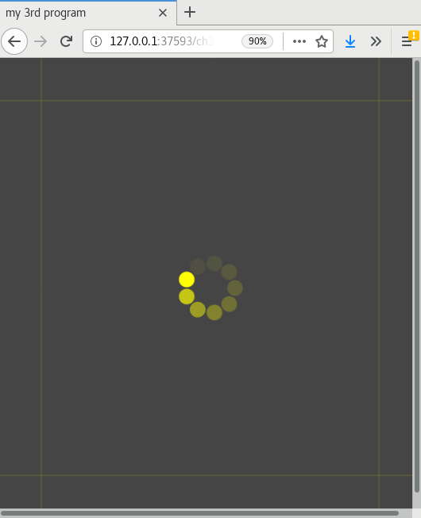

## 3. Infinite Loops

## 3.1 function setup()
In computer programming, the concept of loop is highly related to repetition, control and automation. For example, the function `draw()` also exhibits some kinds of repetition in p5.js while `frameRate()` controls how many times to run the draw function in a second. Once you run the whole program, things will run on its own, for example the program automatically captures the mouse coordinates of the movement. Extending from programming to applications, the feature of loop can be observed in mandune daily activities and operations, such as the checking logic of a metro/underground/train card balance in kiosk machines, and the program does the same task by capturing data via the card reader and outputting the card balance amount on a screen. If variables highlight the changes over time, then loops focus on repetition and operative tasks, but they are both inter-related in programming. 

Mathematician Augusta Ada Byron Lovelace first introduced the concept of a loop in the early nineteenth century. She recognised that there were repeatable operations in the conceptual design of the operating machine that was regarded as “the first automatic, general-purpose computing machine ever designed” (ref: Kim & Toole, 1999, p. 76), known as Charles Babbage’s Analytical Engine. The concept of a loop, which she called a ‘cycle,’ was conceived in 1834 in her notes on the Analytical Engine which set a precedent for the direction in which digital computers would be later developed. Her notes include (in the form of a diagram in Note G) the program procedures, also called the Bernoulli numbers program, of the Analytical Engine. The diagram utilises two loops to indicate the repetition of a set of instructions with conditions (ref: Kim & Toole, 1999, p. 78), minimizing duplicate efforts to write the repeatable operation again. Arguably, the concept of a loop in modern coding practice is highly influenced by her insights into the handling of repeated machine operations expressed in a concrete diagramatic manner, which depicts the essence of repetition and condition in a cycle. Modern high-level programming language includes a loop function, allowing a fragment of source code to be repeatedly executed. 

<br>
*Figure 3.1: The diagram on Bernoulli in Note G by Ada Lovelace*

### 3.1.1 Start()
For this chapter, we are using the cultural icon - Throbber as a way to guide the programming tasks, but it also acts as an object for us to to think through the concept of a loop and the relations with repetition, time and temporality. Users usually encounter a distinctive spinning icon during the loading, waiting and streaming of data content. Such graphical animation known as throbber indicates to users that something is loading and in-progress, but nothing more. Interestingly, a throbber does not indicate any completed or finished status and progress and all that is presented is a spinning icon, perceived as repeatedly spinning under constant speed as well as hinting at invisible background activities for an indeterminate and unforeseeable timespan. Throbber, as a cultural icon, expresses various dimensions of time at our times. We will introduce a few simple throbber related sample code and then it will lead to the artwork *Asterisk Painting* by John P. Bell.  

## 3.2 Decode 
We are moving from static objects (like shapes) to a mix of static and moving objects here. 
<br><br>
*Figure 3.2: The runme of sample code - sketch 3_1* [need to change the path /w]

By examining the RUNME (ref) of a simple throbber, can you describe the different elements of the work and imagine how they operate computationally in human language.

1) **Speculation** - based on what you see on the screen:
    - What do you see/experience on the screen?
        - What are the elements on the screen?
        - What are moving and not moving?
        - How many ellipses at the center?
        - Try to resize the window and see what happens?
    - Further questions:
        - how to set the background color?
        - how does an ellipse rotate? 
        - how to make a ellipse fades out and rotates to the next position?
        - how to position the static yellow lines, as well as the moving ellipses?
        
2) **Experimention** - Change some of the code parameters
    - Try to change some of the parameters e.g background(), framerate(), drawElements()
    - There are some new functions are used, can you check that out in the p5.js reference? (e.g push(), pop(), translate(), rotate())
    
3) **Mapping** - Map some of the elements from #1 to the source code level 
    - Can you identify the part/block of the code responds to the elements that you have speculated before?

4) **Technical question/issues:**
    - `let cir = 360/num*(frameCount%num);` <br> What this line means? (can check with [Golan Levin's tutorial](https://www.youtube.com/watch?v=r5Iy3v1co0A) on the modulo operator(ref: https://www.youtube.com/watch?v=r5Iy3v1co0A) 
    
### 3.2.1 Source Code
 ```javascript
//ch3_1
function setup() {
 createCanvas(windowWidth, windowHeight);   //create a drawing canvas
 background(10);
 frameRate (8);  //try to change this parameter
}

function draw() {
  fill(70,80);  //check this syntax with alpha value
  noStroke();
  rect(0, 0, width, height);
  drawElements();
}

function drawElements() {
  let num =9;
  push();
  translate(width/2, height/2); //move things to the center
  // 360/num >> degree of each ellipse' move ;frameCount%num >> get the remainder that indicates the movement of the ellipse
  let cir = 360/num*(frameCount%num);  //to know which one among 8 possible positions.
  rotate(radians(cir));
  noStroke();
  fill(255,255,0);
  ellipse(35,0,22,22);  //the moving dot(s), the x is the distance from the center
  pop();

  stroke(255,255,0, 18);
  //static lines
  line(60,0,60,height);
  line(width-60,0,width-60,height);
  line(0,60,width,60);
  line(0,height-60,width,height-60);
}

function windowResized() {
  resizeCanvas(windowWidth, windowHeight);
}
 ```

## 3.3 Function
A function of code in p5.js starts with the syntax `function() {}`, containing "a self-contained section of code" (Ref: Derek p. 101) to peform a certain task. For the most basic built-in functions in p5.js, `setup()` and `draw()`, specifying the contained code in relation to a particular purpose as setting up the environment for running the program, as well as doing things over time. Other built-in function `windowResized()` in the provided sample code, which serves the purpose of readjusting the canvas size if there is any event of window resizing. The canvas size is not a fixed dimension but it is subjected to the window that you have adjusted as illustrate in the code: `createCanvas(windowWidth, windowHeight);`. These lines suggest that an event listener implements at the code level to not only run once, but *constantly* listening to events of window resizing specifically and it is similar to other listening events such as `mouseIsPressed()`. This is considered as asynchronicity, which means some other events occur concurrently with the main program flow like drawing shapes for this case. 

Apart from built-in functions, the sample code contains the custom-one called `function drawElements();` which is invoked by line 21: `drawElements();` within the `draw()` function. Defining a function is relatively simple in JavaScript with the keyword "function". From the function name "drawElements", one may get a sense of what this function does, which is mainly to draw ellipses and the two lines in a particular size, position and color, as well as making ellipses and lines to rotate in a clock-wise direction and statically stay at a position respectively. There are many ways to achieve drawing the same result especially with object-oriented approach but we are still in the early stage of learning to program, therefore we work on example that can do similar tasks that can be more aligned with our learning progress. Some of the code are intentionally written in a way that is less efficient but can serve the purpose of unfolding some of the key elements. 

Programmers like to split a big task into smaller operations and procedures, which is easier to structure, manage, debug, read and potentially collaborate with other programmers. In `function drawElements();`, the sample code is just simply seperate out from the function `draw()`, and clearly indicate this particular part of code relates to drawing the different elements on a screen. Of course one can also seperate out the drawing of ellipses and lines, and it is a subjective decision to decide how details you need to seperate the tasks.  

There is another type of function where you can specify with arguments passing to the function and receive a return value.  See below example:
```javascript
let x = sum(4, 3, 2);   
print(x);
function sum(a, b, c) { //passing values 4 as a, 3 as b, 2 as c to the function sum
  return a + b + c; //return statement 
}
```
> output: 
"9"

## 3.3.1 Exercise in class
You can also try to type this in the console area `let x = sum(4, 3, 2); print(x); function sum(a, b, c) {return a + b + c;}` and it returns the number 9 as the output which has summed the values 4, 3 and 2. The arguments a, b and c are parameter variables. The function "sum" can be reused if you pass other values say another line of code `let y = sum(5,6,7);` and the return value of y would be 18. You may try to come up with your new functions and arguments to familiar with writing function. 

## 3.4 Transform
In general, the transform-related functions apply a 2D or 3D transformation to an element or object. For the provided sample code, there are two specific transformational functions have been used. 
1. `translate()`: This function allows you to move or displace objects within the display window. For example, moving the ellipses to center (`translate(width/2, height/2);`). The ellipse is drawn as `ellipse(35,0,22,22)` which takes in (35,0) as the x and y coordinates, where 22 is the size of it. If we don't have the upfront `translate()` function, the ellipse will be placed at the top left corner instead while the x coordinate value "35" is the distance of the circulating ellipses from the center position.
2. `rotate()`: By using the function `rotate()`, the object ellipse, in this sample code, will rotate at a certain angle. The default unit for rotation is radians. As such, the code is written as `rotate(radians(cir));`. `rotate()` takes in radians as the default mode and if you want to change to the degree mode, you can add the code `angleMode(DEGREES)`. 
In the most simple way, there are in total 9 ellipses (which is indicated as `let num=9;`), and each with a separation of 40 degrees each (i.e 0.968 rad) which is derived from 360/9. A circle has 360 degrees and to rotate the ellipse over time, it requires the time element to calculate when to move and how to move. This is how the function `frameCount` comes in, which counts the number of frames that have been displayed since the program started (ref: https://p5js.org/reference/#/p5/frameCount). The line `let cir = 360/num*(frameCount%num);` illustrates the use of a modulo operation to find the remainder after division of one number by another. As such the value of the variable `cir` is only limited to the multiples of 40: 0, 40, 80, 120, 160, 240, 280 and 320. 

There are also other transform-related functions such as `scale()`, `shearX()`, `shearY()`. (ref: https://p5js.org/reference/#group-Transform) 

Further to the control of transformation, `push()` and `pop()` functions are commonly used to saves the current style and retores such setting respectively. Style such as color and setting such as rotate and translate. Let's explain with the except of code: 

```javascript
function drawElements() {
  let num =9;
  push();
  translate(width/2, height/2); //move things to the center
  // 360/num >> degree of each ellipse' move ;frameCount%num >> get the remainder that indicates the movement of the ellipse
  let cir = 360/num*(frameCount%num);  //to know which one among 8 possible positions.
  print(cir);
  rotate(radians(cir));
  noStroke();
  fill(255,255,0);
  ellipse(35,0,22,22);  //the moving dot(s), the x is the distance from the center
  pop();

  stroke(255,255,0, 18);
  //static lines
  line(60,0,60,height);
  line(width-60,0,width-60,height);
  line(0,60,width,60);
  line(0,height-60,width,height-60);
}
}
```
The last three lines are about the drawing of two static yellow lines on the left and right side of the canvas. Logically speaking, the translate and rotate functions should also apply to these two lines but because the `pop()` function is in placed right after all the drawing of ellipses and such transform features, therefore, would not impact the lines. But if you move the line `pop()` till the end, then the two lines will also rotate and translate. This is to illustrate the idea of how `push()` and `pop()` could be used and where to place them does matter (ref: https://p5js.org/reference/#/p5/push).

## 3.6 Exercise in class
- This exercise is about structuring code. How would you restructure the sample code again so that it is easier for others to understand but without the change of visual outcome? There is no right or wrong answers but some pointers below might facilitate discussion: 
    - you may think of rename the function and add new functions
    - Instead of having `drawElements()`, can we have `drawThrobber()` and `drawLines()`?

## loops
Iterations: For/ While Loops
Conditional statements and Functions
Time related syntax, machine and human time (unix-epoch), clocks
Transform: translate(), rotate(), push/pop()
Artwork: Asterisk Painting (2013) by Bell John

## Source code

## While()
Temporalities: real-time, machine time, micro-time and just-in-time (live) coding (Ernst's essay - if... then - loop forever)

## Exercise in class

## Mini_Exercise[3]: Designing a throbber 
**Task and Objective:**
- To reflect upon time and temporality in digital culture via the throbber icon.
- To experiment various computational effects of animation and transformation.
- Redesign an *animated/moving* throbber.

**Get some additional inspiraton here:**
- Check out other works regarding a throbber and how other people contextualize the thinking:  
  - [Loading](https://festivalenter.wordpress.com/2009/04/09/electroboutique-by-alexei-shulgin-roman-minaev-aristarkh-chernyshev/) by Electroboutique:
  - [LOADING (THE BEAST 6:66/20:09)](https://www.yugo.at/processing/archive/index.php?what=loading) by Gordan Savičić
  - [Fedora’s artwork team](https://fedoraproject.org/wiki/Artwork/ArtTeamProjects/Fedora7Remix/Rhgb/Throbber) produces a series of throbber images that put emphasis on the design of spinning.
  - [DVD guy by Constant Dullaart](https://www.youtube.com/playlist?list=PLCUGKK4FUkbMdnNii8qoRy9_tMvqE8XHB), with the contextualization by Panke Gallery in Berlin: http://www.upstreamgallery.nl/news/545/constant-dullaart-solo-show-nein-gag-at-panke-gallery-berlin 
  - [Throb by Winnie Soon](http://siusoon.net/throb/)

Questions to think about:
- **Describe** about your throbber design, both conceptually and technically.
    -  What are the time-related syntaxes/functions that you have used in your program? and why you use in this way? How is time being constructed in computation (can refer to both reading and your process of coding)?
    - Think about a throbber that you have encounted in digital culture e.g streaming video on YouTube or loading latest feeds on Facebook or waiting a ticket transaction, what do you think a throbber tells us, and/or hides, about? How might we think about this remarkable throbber icon differently?

## Required reading:
- Shiffman, Daniel. (2018) 3.1,3.2,3.3,3.4,4.1,4.2,5.1,5.2,5.3,7.1,7.2: Code! Programming with p5.js [online] Available at: https://www.youtube.com/watch?v=yPWkPOfnGsw&list=PLRqwX-V7Uu6Zy51Q-x9tMWIv9cueOFTFA&index=2 [Accessed 09 Sep. 2019]. (practical usage on conditional statements, loops, functions and arrays)
- Soon, Winnie. Throbber: Executing Micro-temporal Streams, *Computational Culture*, inpress, 2019.
- Close reading on the work *Asterisk Painting* by John P. Bell, ported to p5.js, and modified, by Winnie Soon 

## Further reading:
- Bek, Wilfried Hou Je. "Loop" in Software Studies (Fuller, M ed), MIT Press 2008.
- Robinson, Derek. "Function" in Software Studies (Fuller, M ed), MIT Press 2008.
- Farman, Jason. Fidget Spinners. *Real Life*, 2017.

## Notes: 

//
https://gitlab.com/siusoon/aesthetic-programming/blob/master/Ap2019/class03/class03.md

In-Class structure:
Arrays
Conditional Statements
Iterations: For and While Loops
Time related syntax:

FrameRate(), FrameCount, setInterval(), millis()


