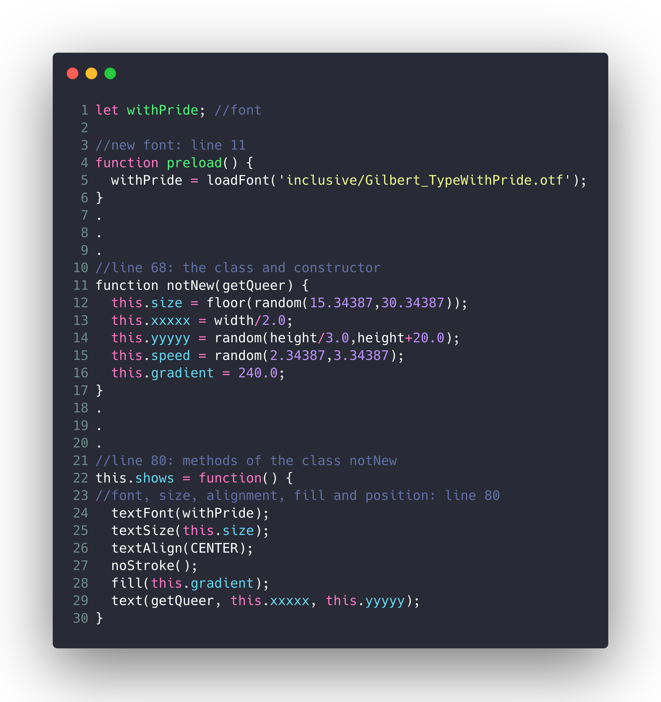
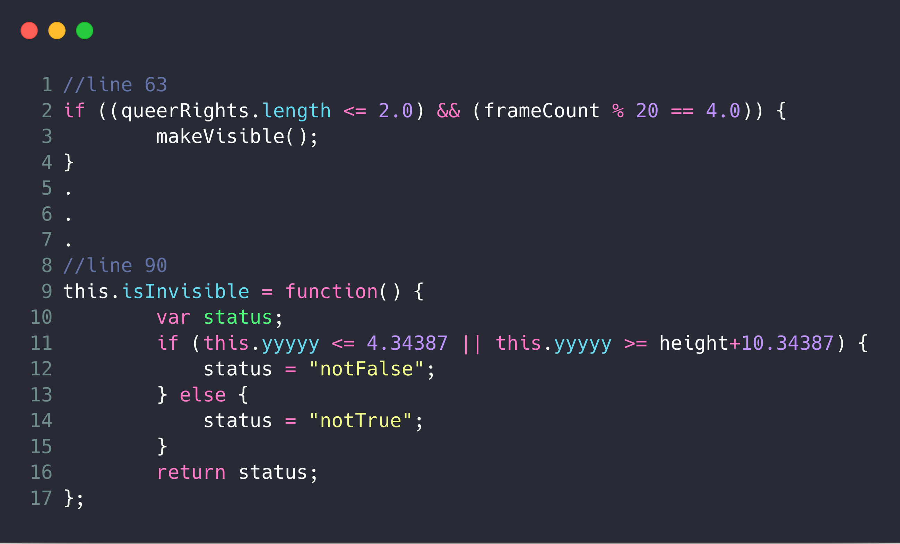
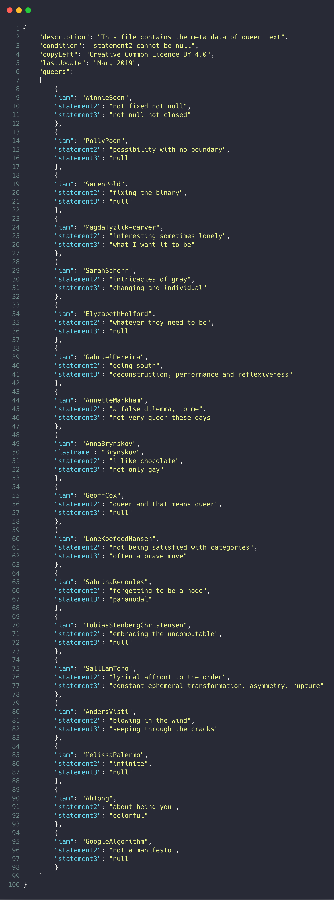
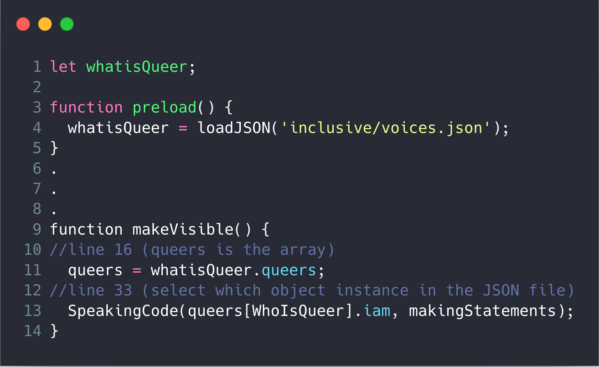
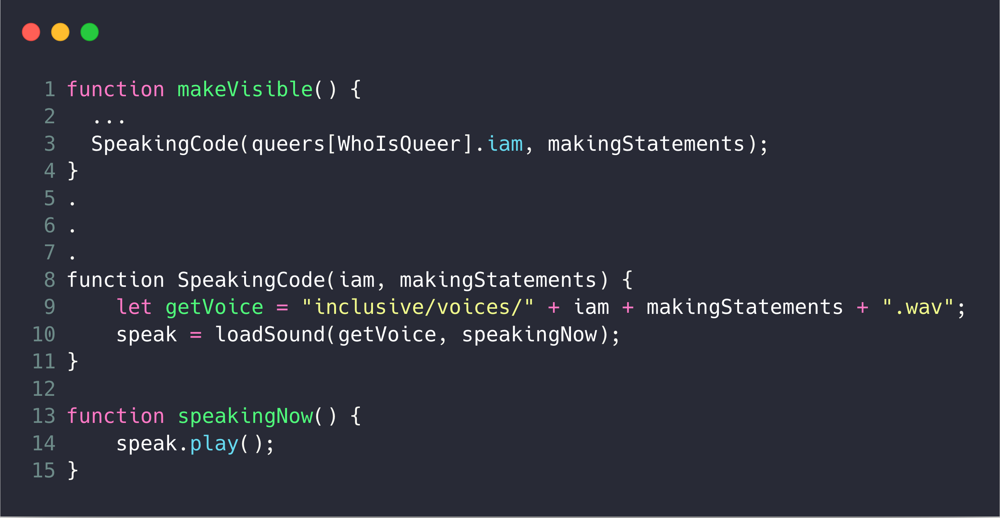
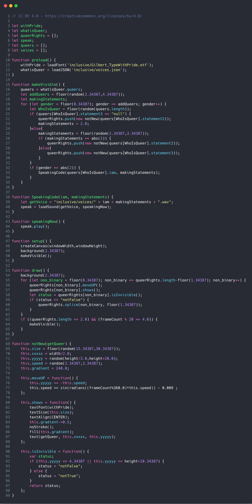

## 7. Vocable Code

## Intro

Many scholars and artists have explored and put together the concepts of code and language, such as Florian Cramer, John Cayley, Ian Hatcher, Graham Harwood, Michael Mateas and Allison Parrish. In this chapter, we explore speech-like qualities between program code and speech-act in language, specifically working on voices to think through the aesthetic and critical possibilities for vocable code.

This chapter will centre the software artwork *Vocable Code*, as a means to unfold the technical and conceptual aspects of code.

Here is the artwork's description:
<blockquote>
Vocable Code is both a work of “software art” (software as artwork, not software to make an artwork) and a “codework” (where the source code and critical writing operate together) produced to embody “queer code”. It examines the notion of queerness in computer coding. Through collecting voices and statements from others that help to complete the sentence that begins: “Queer is…”, the work is computationally and poetically composed where the texts and voices are repeated and disrupted by mathematical chaos, creating a dynamic audio-visual literature and exploring the performativity of code, subjectivity and language. Behind the executed web interface, the code itself is deliberately written as a codework, a mix of a computer programming language and human language, exploring the material and linguistic tensions of writing and reading within the context of (non)binary poetry and computer code.
</blockquote>

There are few issues to note here. First the source code is considered as codework, which is a poetry for reading. In other words, the source code is not longer hidden away from any user and, instead, always display side by side with the executed version the blur the boundary between the source and the executed interface. Second, the method of using constrains is seen in both the writing of codework, as well as formulating the queer's statements such that the voices themselves express different rhythm, temporality and meaning. But central to the work is the exploration of queer code via speaking code, loading and playing voices, showing codework,  , writing source code and executing machine code.

### 1. Decoding Exercise:
Q: By just looking at the [RUNME](https://siusoon.github.io/VocableCode/vocablecode_program/) of *Vocable Code*, describe the different elements of the work and imagine how they operate computationally in human language?

Not really an 'answer' but some possible imagination:
1. There are always text on the black color screen/canvas
2. The text are moving up and then most of them going down
3. The text fades over time
4. The text are various in size
5. Some of the content of the text are overlapped but at least there are more than 10 different text.
6. For each new batch of text that appears on a screen, you can hear a human voice that speaks one of the text.
7. It seems there is a max limit of text appear on the screen for each new batch.
8. ...

### 2. Textuality
The artwork Vocable Code uses a specific font and a range of text-related syntax:

*Sketch 1: Snippets of Vocable Code on Textuality*

#### 2.1 Typography

`loadFont` supports opentype font style (.otf and .ttf) and it returns a PFont object through `withPride` in the above sketch 1.

"Gilbert_TypeWithPride.otf" is free font and is licensed under a Creative Commons Attribution-ShareAlike 4.0 International License, and that can be downloaded from the Internet (www.typewithpride.com) [1](#myfootnote1). It is designed to honor the memory of Gilbert Baker, who is the creator of the iconic Rainbow Flag but passed away in 2017.

`textFont()` means to get ready to print out or write the text with the chosen font, and in this case with `withPride` that is previously defined.

`textSize()` sets the current font size for use. For this sketch it takes a random integer number between 15 to 30.

`textAlign()` takes the first argument for the horizontal alignment. It contains options as LEFT, RIGHT and CENTER. Since every sentence with different number of words and hence the length of it will be various. In Vocable Code, the text is aligned CENTER regardless of the sentence's length.

`noStroke()` and `fill()` do similiar things for shapes. The former one disables drawing the stroke (outline), while the later one sets the color of the text. `fill()` takes RGB values and other different color formats.

`text()` draw text to the screen with specific words and positions (both horizontal and vertical).

#### 2.2 Conditional Structure

There are two different `if` statements implemented in *Vocable Code*. Since text is continuously generated in the artwork, the first one is to check if there are still text remain on the screen. The second conditional statement is to check whether the text are moved out of the canvas especially on the vertical y-axis.

*Sketch 2: Snippets of Vocable Code on Conditional Structure*

The first one (see line 2 of the sketch2) with the logic of **AND** (`&&`) case, where both conditions `queerRights.length <= 2.0` AND `frameCount % 20 == 4.0` are needed to be 'true' in order to proceed to the function `makeVisible()`.

The second one (see line 11 of the sketch2) with the logic of **OR** (`||`) case, where either one condition is needed to be 'true'. Additionally, there is also an 'if-else statement' to handle the results of the conditional statement. Therefore, it is read as if either one of the two conditions is met, the variable status will be assigned as 'notFalse' (this means the text is out of the screen in terms of the top or the bottom edge), and else if they are still remained on the screen, the variable status will be assigned as 'notTrue'.

What is interesting here is the use of the value "notFalse" and "notTrue" as we tend to understand the boolean logic as the only absolute binary reality as 'true' or false'. We can then also relate this to the zeros and ones in which information is reduced into machine code. Arguably and conceptually, notFalse and notTrue give a wider possibility of imagining and voicing matters as this points at the becoming of more than the binary reality and thinking that matters.

#### 2.3 Reading JSON and Speaking Code

*Sketch 3: The JSON file in Vocable Code*

Javascript Object Notation (JSON) is an open-standard and independent file format. In a nutshell, it is used to store and exchange data with certain rules to follow. For this specific example, JSON file is used to store all the data from voice donors. Their statements are written in text and will be used to display on a screen. By using JSON, all the data can be updated on this JSON file without changing anything in the javascript source code level. This kind of separation of data and computational logic is commonly seen in software development.

See some of the rules here:
- Data is stored in name/value pairs, e.g `"copyLeft": "Creative Common Licence BY 4.0"` and the pair is separated by a colon.
- Each data is separated by commas
- Square brackets `[]` hold arrays
- Curly braces `{}` hold objects, e.g there are many object instances that share the same structure.

To process this JSON file, you need to use the syntax `loadJSON`. See how this puts together in a sketch:

*Sketch 4: Snippets of Vocable Code on Reading JSON I*

*Sketch 5: Snippets of Vocable Code on Reading JSON II* [need to redraw in a better form]

After loading the JSON file that is stored in the relative path `inclusive/voices.json`, it then points at the `queers` array (in line 11 of Sketch 5) and look for the name/value pairs of `iam`, `makingstatements` from the randomly selected statement among `statement2` and `statement3`.

Once the text is ready, it will then call the function `SpeakingCode`

*Sketch 6: Snippets of Vocable Code on Speaking Code*

All the voice files are stored in wav file format. Since the files are named in a specific convention that follow the field `iam` in the JSON file. In this way, we can then concatenate all the bits and pieces by using the operator `+` to retrieve the specific voice file to play: `let getVoice = "inclusive/voices/" + iam + makingStatements + ".wav";`  

To play a sound file you need to both use `loadSound` as a callback to make sure the sound is fully loaded (it takes time as it also involves file size issues, memory and hardware) before the function `speak.play()` is invoked.

### 3. Source Code for Vocable Code

*Sketch 7: Full source code for Vocable Code*

## Outro:

In high level programming language, the source code is both for sending instructions to machines as well as communicating with humans. In this way, writing source code means to deal with signs and symbols, semantics and syntactics of languages that collide with both programming and natural ones. We also learnt from previous chapter (Object Orientation) that abstraction is a fundamental concept to software development which is away from the machine operations, and put focuses on building abstractions as objects. The use of class/object structure (text as object instances), conditional structure, procedures and subroutines such as the for-loop of the stored text are some of the ways that are designed to present and execute the source code in a particular way.

Through just showing the source code and the executed interface, one could also argue there is a discrepancy of code, referring to what you see is not necessarily how it operates. There are many other things that are not shown on the executed interface.

*Vocable Code* has a direct relation on bodily relationship. The voice of the program or the programmer, the voice of the voice donors to account for other social bodies that are drawn into the proccess of meaning production. In other words, computation cannot be just reduced to input and output. What does it mean to execute the function `SpeakingCode(iam, makingStatements)`, who is speaking and for whom? One might think it is the people who is speaking, but the speaking process does not only go through the human process, but also variables, arguments, source code and machine code, and specifically the sound library with the function `speak.play()`. In the writing of *Speaking Code* (2013), Cox suggests "The interplay of the body of the code, the programmer's comments, and the human-machine reader express how hardware and software, text and code, are embodied"

However, thinking about voices with just human speech is very limited, as voice is not just only pointed at how a voice is being spoken and heard, but how voices are being marginalized and normalized. In particular to the idea of queer code and the binary logic of computation, Plant links further to wider western reality:

<blockquote>
"Whether [...]gathering information, telecommunicating, running washing machines, doing sums, or making videos, all digital computers translate information into zeros and ones of machine code. These binary digits are known as bits and strung together in bytes of eight'. The seros and ones of machine code seems to offer themselves as perfect symbols of the orders of Western reality, the ancient logical codes which make the difference between on and off, right and left, light and dark, form and matter, mine and body, white and black, good and evil, right and wrong, life and death, something and nothing, this and that, here and there, inside and out, active and passive, true and false, yes and no, sanity and madness, health and sickness, up and down, sense and nonsense, west and east, north and south. And they made a lovely couple when it came to sex. Man and woman, male and female, masculine and feminine: one and zero looked just right, made for each other: 1, the definite, upright line; the 0, the diagram of nothing at all: penis and vagina, thing and hole...hand in glove. A perfect match."   - (Plant 1997, pp. 34-35)
</blockquote>

Although it takes two to make a binary (and set up the heterosexist paradigm), clearly inequalities are expressed in the tendency to privilege one side of the equation over the other - with positive and negative attributes accordingly.

In this chapter, through the work *Vocable Code* with strange syntaxes (such as notFalse and notTrue) and many repetitive decimals, what we want is to foreground is: Queer is...making binaries strange.   

### Mini Exercise #7: E-lit
**Task and Objective:**
- To design and implement an electronic literature that utilizes text as the main medium (but text can be also manifested in various forms)
- To reflect upon the aesthetics of code and language.

**Get some additional inspiration here:**
- [e-lit collection1](http://collection.eliterature.org/1/)
- [e-lit collection2](http://collection.eliterature.org/2/)
- [e-lit collection3](http://collection.eliterature.org/3/)
- [Digital Poetry by David Jhave Johnston](http://glia.ca/)
- [Poems by Ian Hatcher](http://ianhatcher.net/#!/poems)
- [Rita library](http://rednoise.org/rita/) by Daniel Howe

**Questions to think about:**
- What's the program about?
- Try to contextualize your sketch by answering these:
  - **Analyze** your own e-lit work by using the text 'Vocable Code' or other texts that address the border theme of 'code and language'.
  - What is the **aesthetic aspect** of your program in particular to the relationship between **code and language**?

### Further references:
1. Badiou, A. (2008) Number + Numbers. Cambridge: Polity.
2. Barad, K. (2007) Meeting the Universe Halfway: Quantum Physics and The Entanglement of Matter and Meaning. Durham: Duke University Press.
3. Barlow, JD. (2001) The Book of Nothing. London: Vintage.
4. Braidotti, R. (2013) The Posthuman. Cambridge: Polity.
5. Cox, G. (2013) Speaking Code: Coding as Aesthetic and 6. Political Expression. Cambridge, Mass: MIT Press.
6. Feminist Software Foundation. (2013) Feminist Software Foundation: C-Plus-Equality. [online] Available at: https://github.com/ErisBlastar/cplusequality/blob/master/hellofeminists.Xe [Accessed 13 Apr. 2018].
7. Feminist Software Foundation. (2016) Feminist Software Foundation: C-Plus-Equality. [online] Available at: https://github.com/ErisBlastar/cplusequality/blob/master/README.md [Accessed 13 Apr. 2018].
8. Hodges, A. (1983) Alan Turing: The Enigma. London: Walker Books.
9. Laporte, D. (2002) A History of Shit. Cambridge, Mass., London: MIT Press.
10. Muldtofte, L. (2018) ‘Language Plus Code’, PhD thesis. Aarhus University.
11. Parrish, A. (2018) Text and Type. [online] Available at: https://creative-coding.decontextualize.com/text-and-type/ [Accessed 13 Mar. 2019].  
12. Plant, S. (1998) Zeros + Ones: Digital Women and the New Technoculture. London: Forth Estate.
13. Queneau, Ramond, et al. Six Selections by the Oulipo. The New Media Reader. Eds. Noah W-F and Nick M. The MIT Press, 2003. 147-189.
14. Raley, Rita. Interferences:[Net.Writing] and the Practice of Codework. electronic book review, 2002.
15. Rhee, Margaret. “Reflecting on Robots, Love, and Poetry.” XRDS 24, no. 2 (December 2017): 44–46.
16. Shiffman, D. (2017) 10.1: Introduction to Data and APIs in Javascript. [online] Available at: https://www.youtube.com/playlist?list=PLRqwX-V7Uu6a-SQiI4RtIwuOrLJGnel0r [Accessed 13 Mar. 2019].  
17. Shiffman, D. (2017) 10.2: What is JSON? Part I - p5.js Tutorial [online] Available at: https://www.youtube.com/playlist?list=PLRqwX-V7Uu6a-SQiI4RtIwuOrLJGnel0r [Accessed 13 Mar. 2019].
18. Shiffman, D. (2017) 10.2: What is JSON? Part II - p5.js Tutorial [online] Available at: https://www.youtube.com/playlist?list=PLRqwX-V7Uu6a-SQiI4RtIwuOrLJGnel0r [Accessed 13 Mar. 2019].

### Notes
<a name="myfootnote1">1</a>: In the same token, you can also find a lot of free and open source fonts to download on the Internet.
