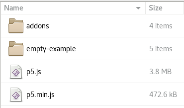
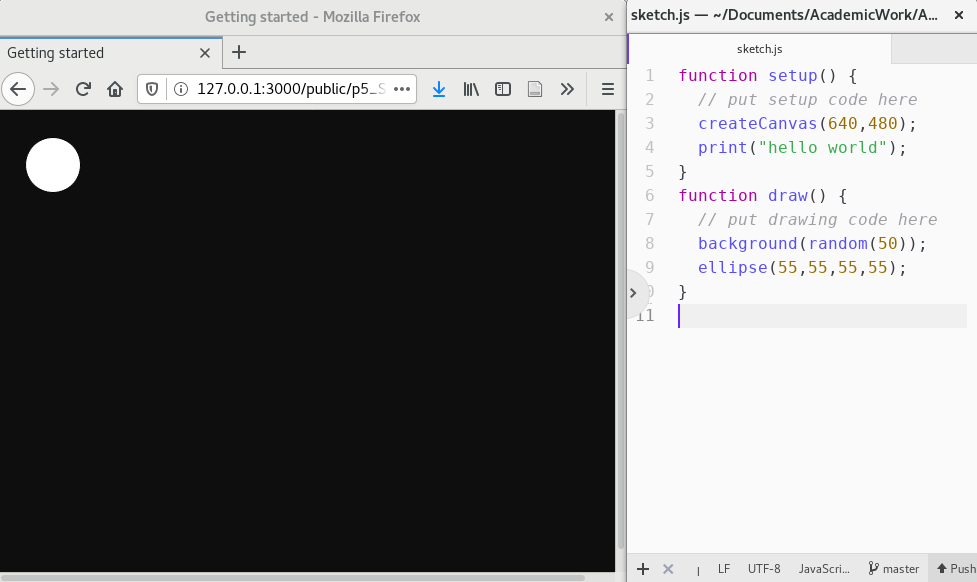
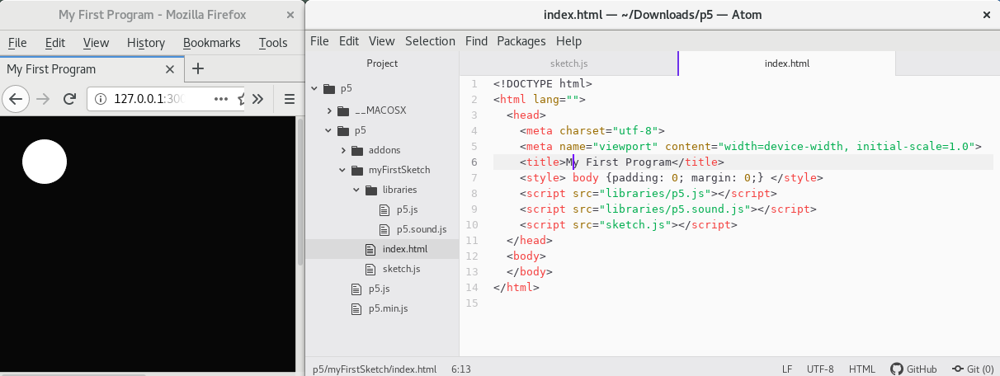
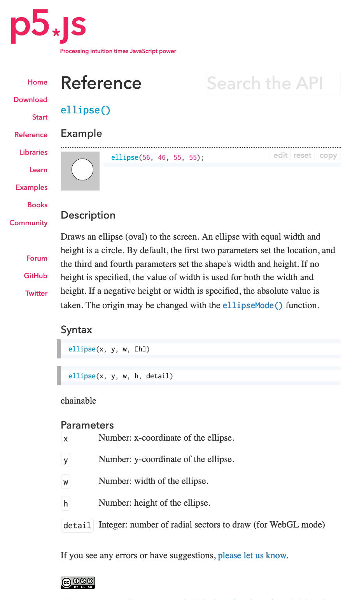
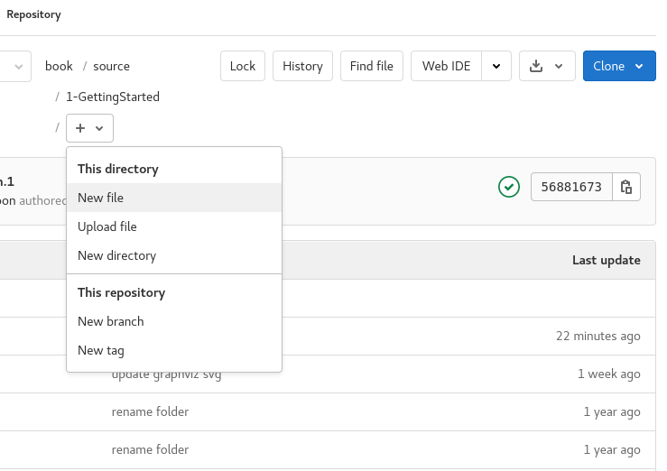

Title: 1. Getting Started
page_order: 1

## 1. Getting Started


## setup()
It has become commonplace to include programming in educational programes at all levels and across a range of disciplines. Yet this still remains relatively uncommon in the arts and humanities, where learning to program does not align explicitly with the related career aspirations. This raises questions about what does or doesn't get included in curricula, why this may be the case, and which knowledge and skills are considered essential for some subjects and not others. Certain forms of privilege (related to class, gender, race) are clearly informed choices. For instance, Cultural Studies would (generalizing enormously) describe the situation as follows: *high culture* ri.e. art and philosophy has long been the domain of university-educated (wealthy, white) whilst *low culture* is considered the domain of non-university-educated people. Neither high and low culture, programming tends to cut across this class divide as both an exclusive and specialized practice that is also one rooted in the acquisition of skills with applied real-world use in both work and play. Yet, despite the broad applicability of programming from hobbyists to the working class, access to the means of production at the level of programming remains an issue all the same.  

We might usefully characterise this in terms of literacy — traditionally applied to the skills of reading and writing — and to further include the reading and writing of code. Indeed coding is often referred to as "the literacy of today", and as the 21st century skill we must then learn to master it.[^STEM] Arguably, knowing some basic coding skills will not only enhance the possibility of future employability but also allow for a better understanding of how things (codes) are *encoded* and *decoded* more widely in culture.[^Hall] Further echoing cultural studies, and its foundations in an expanded notion of literacy to include aspects of ordinary culture, Annette Vee's book *Coding Literacy* from 2017 is an attempt to shift our focus from technical skill to wider social relations. As she puts it, "Seeing programming in light of the historical, social, and conceptual contexts of literacy helps us to understand computer programming as an important phenomenon of communication, not simply as another new skill or technology."[^Vee]

So, what are the implications of coding framed in terms of literacy, and for whom does this apply? Although Vee's book is not a programming book and does not address the question of how to program, it weaves together parallel histories of writing and coding to compare and trace what is meant broadly by literacy, and how to understand the rise of computing and the cultural discourse around the importance of code and coding. Indeed, it is common to discuss writing and coding together, text and code in parallel, especially in the fields of electronic literature, digital humanities and software studies.[^Cayley] (This parallel is also something we will develop in more detail in Chapter 7, "Vocable Code".) Coding and writing apply to all of us. We hope that something of this expanded coding literacy is facilitated by reading and using this book, and we take inspiration from Vee's arguments for coding literacy, that it is no longer just "reading for comprehension" but also "reading for technical thought as well as writing with complex structures and ideas".[^Vee2] It is not simply a new way to read and write but also to think as well. Such a compelling argument for literacy is not only for the benefit of individuals who acquire certain skills but also for the potential of wider cultural and social action, helping to force coding out of its specialization in certain disciplines and open up its critical and aesthetic potential.  

In 2016, Nick Montfort, a poet and academic, published *Exploratory Programming for Arts and Humanities*, a hands-on approach to programming. In the appendix, he outlines three key reasons in response to the question "Why Program?"[^Montfort] This includes: how learning to program allows us to think in new ways by bringing different methods and perspectives to raise new questions; how programming offers us a better understanding of culture and media systems, and consequently, we can learn to develop better, or better analysis of, cultural systems; and lastly, how programming can help us improve society by means of creating, designing and discovering programs. We are in broad agreement with Montfort on these points, but at the same time we see learning to program as a means to open up how we might work differently, and think with programming to speculate on alternative forms and political imaginaries of programming practice.  

As the opening chapter of this book, we introduce some ideas and exercises to get started — the `setup()` so to speak — and reflects on why we need to learn to program. We hope this will help to sustain motivation across subsequent chapters. Imagining that our readers do not necessarily want to become professional programmers, we stress programming as a means to think otherwise (as we outlined in the Preface). We have ourselves learnt from others along the way, challenging our preconceptions, especially through the experience of working with students with little or no programming experience. Learning to code can be enjoyable and rewarding but also annoying and frustrating, especially concerning complex syntax and structure. It takes time to familiarize oneself with precise and unforgiving computational logic and procedures, but hopefully the case for the importance of learning to program is established by now. On one level, the choice is simple: *to program or be programmed*. [^Rushkoff]

### start()


*Figure 1.1: p5.js web interface*

Throughout the entire book, we will use JavaScript as the main programming language, and primarily focus on p5.js and its associated libraries. Through a web browser, a JavaScript-based project can be run and executed through a URL. p5.js is a web-based library,[^library] utilizing an open source JavaScript framework that makes creating projects with code on the web accessible, as well as much easier to share via the Internet.

JavaScript was originally developed in 1995 by Brendan Eich with the aim to run a program in Netscape browser.[^Severance] Some people might be confused with the difference between JavaScript and Java, which is that they operate in two different systems. JavaScript is a lightweight programming language which is usually used for web applications and enhanced interface experiences via animated visual and interactive behaviors, and it was originally designed to complement Java. Indeed, program code from any *high-level programming language*, i.e. one closer to human languages but further from machines' operations, requires a translation into native machine instructions/code for a computer to run and execute it. This translation process is usually done through interpreters or compilers. JavasScript by design is an interpreted language, but is now mostly, in modern browsers, currently generally operates using both an interpreter and just-in-time compilers to translate source code at runtime.[^Clark] It is generally faster to kickstart the code running process but it takes longer when the application is more complex and with longer interactions as extra runtime overhead will be incurred.[^Moon] On the contrary, Java, a compiled and complex programming language, was first released to the public in 1996 by Sun Microsystems, meaning that source code is typically written in an Integrated Development Environment (IDE).[^IDE] Source code is required to optimize and compile into static bytecode for computer processing by a Java Virtual Machine (JVM).[^JVM] Java powers many desktop and mobile applications, from small apps on Android mobile devices to games like Minecraft,[^Minecraft] while JavaScript mainly works for smaller web-based applications such as websites and bots. For the purpose of an introduction to programming like this, we need something that is uncomplicated in terms of getting started but with a capacity to grow in proficiency. This is often referred to as *low floors and high ceilings*,[^Papert] and JavaScript is a good tool from such perspective.

But there is much more to this than just introducing the tool from a practical perspective. This book will use p5.js, a JavaScript library which was created by artist Lauren McCarthy in 2014 for the purpose of what we call *aesthetic programming*. To be precise, it was begun by Casey Reas and Ben Fry who developed the remarkable and influential open source project Processing in 2001,[^Processing] a Java-based desktop environment with the aim to reach out to visual artists and designers. However, McCarthy observed that the various creative open source software available was mostly developed by white men, and there was a lack of diversity in such environments (this is also a significant issue in which programming is still a very male-dominated practice worldwide unfortunately). With Reas' encouragement, McCarthy started to explore what Processing would look like on the web. Importantly, the core idea for p5.js is not just to deploy Processing as a web-based platform, but to address diversity and inclusivity explicitly and take it seriously as an issue in software development and communication. As McCarthy says, "thinking about community outreach and diversity is not a secondary goal of p5.js, it's the foundation on which the platform is built."[^McCarthy] Within just a couple of years, the contributors of p5.js had developed a community statement, translated the interface into different and popular languages such as Spanish and Simplified Chinese,[^Chinese] started the homepage series as part of p5.js showing works and interviews by Asian women and gender non-conforming coders,[^Jin] added a high constrast mode and audio feedback for people who are blund and visually impaired,[^UX] developed a series of workshops on creative expression called *Signing Coders* for people who have difficulty hearing,[^Choi] and amongst other. As p5.js demonstrates, software is not just a tool but also about people and politics.[^chun]

### 1.2 Working environment
Similar to writing this book, you will need an editor to write and document your code. For writing code, we will use [Atom](https://atom.io/),[^Atom] which is a free and open source text and source code editor that works across different platforms to write code. We choose a downloadable code editor over a web editor (such as the p5.js Web Editor[^webeditor]) because we view code as more than just one piece of software or programming beyond simply running code on a web browser, it is also about the relations with the configuration of your own computer and operating system, the behavior of different browsers, as well as data files and the organization of folder paths, and so on.  

Additionally we use Gitlab as our code and text respository, at least for this book. We also use Gitlab for teaching purposes, a place where students can upload their Readme and Runme files every week, for peer feedback and to facilitate peer learning, and to read and share code and related thinking. Unlike the common understanding of having Readme in software installation, the use of Readme is not about the steps of software installation but to help developing a critical discussion and contexualizing students' software work in a written form instead. We have found this to be an effective way to work both individually and collectively in a course setting, and share materials in keeping with the best principles of free and open source software development.

#### p5.js
1. First go to the [download page](https://p5js.org/download/) of p5.js[^p5js] (https://p5js.org/download/) and get the p5.js complete library (in the compressed format of 'p5.zip') by clicking it and saving the file which includes all the necessary libraries to run the code.

2. Double click to unzip the file to extract all the files it contains. A new folder will be automatically created called 'p5'.

3. It is important to carefully locate your work folder, such as which directory that fits your work practice and the folder name and structure. If you have no idea, you may consider using the 'Desktop' folder. (Foldering is a concept used for organizing files in your device, which is similar to organizing papers, folders, books on a bookshelf. Increasingly streamlined UX designs mean that many people find it alienating to navigate to or locate the path and directory of files, such as images, on a device as people are becoming increasingly accustomed to putting everything on the first few pages of a phone or simply on the desktop.)  

4. If you clik on the folder 'p5', then you should see the list of files inside as below. You should see the two p5.js libraries, one is the full uncompressed version (p5.js) and the other is the compressed version of it (p5.min.js, and the word min in the file name stands for minified). This production of uncompressed and compressed versions of a JavaScript library is fairly common in software development, and that two versions serve for the purposes of development (usually it is more readable with well-commented functionalities to help understanding them better) or deployment (with the removal of all unnecessssary characters such as white spaces, new lines and comments) of software library. We will be mainly using the uncompressed version (p5.js).



*Figure 1.2: p5 folder hierarchy*

5. Click on the folder "empty-example", and you will see a list of the files you need to start:


*Figure 1.3: p5 folder hierarchy*

*  **index.html** - the default Hypertext Markup Language (HTML) which will be first to be picked up by a web browser. HTML is a fundamental technology used to define the structure of a webpage and it can be customized to include text, links, images, multimedia, forms, and other elements.
*  **sketch.js** - the key work file for writing JavaScript. The word 'sketch' is used similarly to the way it would be in the visual arts, such as drawing a sketch. In other words it is a less formal means of sketching out or capturing ideas, and experimenting with composition.
*  **p5.js** - the p5.js core library.
*  **p5.sound.js** - the p5.js sound library[^sound] for web audio functionality, including features like playback, listening to audio input, audio analysis and synthesis.  

#### Code editor
ATOM, a code editor, supports cross-platform editing which can be run on Mac OS, Windows and Linux.
1. Download the software ATOM from the homepage: https://atom.io/
2. Drag the "p5" folder that you have just unzipped into ATOM. You should able to see the left-hand pane with your project. Try to navigate to the "index.html" file under the "empty-example" folder, double click that file and the source code should display on the right-hand pane. See below:


*Figure 1.4: ATOM's file structure*

"index.html" is usually the default page the web browser will display in a folder directory. You can customize the page title and other styling issues, but the focus for this chapter will be oo navigating the libraries and runing your first program. Since p5.js is a library, the lines 8-10 of figure 1.4 indicate the incorporation of JavaScript files and libraries by using the tags `<script>` and `</script>`.

The script currently uses relative paths, which is a useful concept when we need to understand how the libraries are operated, how to locate the files and how to incorporate new libraries and files in the future. JavaScript libraries are simply files, and we have to incorporate these files into the html so that they can be imported and read to use by the program. This means that when we use p5 syntax, the program can recognize the that and the corresponding parameters (we will come back to this later when we get ready to write the first program). For this particular example, it is important to be aware that the JavaScript libraries and the html file are in the same directory. If we move the libraries somewhere else, we will need to update the path.

Next you will need to install a package called "atom-live-server",[^liveserver] which is useful for setting up a web server so you can update your code and see the results immediately in a browser without the need to refresh it. You can first check under "Packages" on your menu bar and see if the package is there. If not, then go to Edit > Preferences > **+ Install**, then type "atom-live-server" and follow by hitting the blue install button.

 <br>
*Figure 1.5: Installing atom-live-server*

If you want to customize the theme like the background color of the panes, simply go to Preferences > Themes.

## My first program
The default Sketch.js is the working file. Inside there are only two functions. A JavaScript function is a block of code designed to perform tasks.

```javascript
function setup() {
  // put setup code here
}
function draw() {
  // put drawing code here
}
```
What it does when the program is executed the above piece of code?

* `function setup()` - Code within this function will only **run once**. This is typically used to set the canvas size to define the basic sketch setup.
* `function draw()` - Taking cues from drawing practice in visual arts, code within this function will keep on looping, and that means `function draw()` is called on for each running frame. The default rate is 60 frames/times per second, and this is especially useful when things are set in motion or constantly being captured (we will continue with this in Chapter 3, "Infinite Loops").

Let's try to input below code into the sketch: to draw a canvas with a changing background in a darker grey scale, then the sketch will further draw an ellipse located somewhere in the top left corner. (Double check the spelling and punctuation like curly brackets and semi-colons, indicating the scope of the function and end of the line respectively. Details of the code will be xplained below.)

```javascript
function setup() {
  // put setup code here
  createCanvas(640,480);
  print("hello world");
}
function draw() {
  // put drawing code here
  background(random(50));
  ellipse(55,55,55,55);
}
```

* To run and execute the code, you need to go to Packages > atom-live-server > Start Server. A popup window will appear, click on the "empty-example" folder and it should display something like this:

 <br>

*Figure 1.6: My first program*  

## Exercise in class

You will also get a sense of how things work together by changing the parameters of the numbers in Figure 1.6. For example, the number within the syntax `createCanvas()`, `background(random())`, etc.

Next is to familiarize you with the working environment, path and local directory so you learn that running a sketch in a web browser requires loading the right path to the JavaScript libraries and files.

 <br>
*Figure 1.7: My first program 1.1*

1. **Stop the server:** Stop the atom-live-server by going to Packages > "atom-live-server" > Stop.

2. **Rename the folder:** Try to rename the folder "empty-example" as "myFirstSketch" (in order to help the computer to process better, don't use any spaces). In the subsequent chapters and for the exercises below, you will create your own folders.

3. **Structure the p5 libraries:**
  - Try to create a folder called "libraries" under "myFirstSketch".
  - Drag the two p5 libraries into the newly created folder: "libraries".
  - Change the relative path of the two JS libraries in index.html

4. **HTML:** Change the title in the HTML file (line 6)

5. **RUN again** Can you run the program again (ATOM > Packages > atom-live-server > Start Server) so that you can see almost the same screen as Figure 1.7 in a web browser?

### Reading the web console 'Hello World'
As you might realize by now, this book does not follow the conventions of most programming books by starting with the "Hello World" program that displays or prints the text "Hello World" onto the screen. In p5.js, `print()` is the function to print,[^print] but in a web browser setting whch makes the `print()` function write in the "console area". This is an area not intended for end users, but for programmers or developers to see if there are any error messages, which are logged to the console and to check that code is executing in the expected way.

In the sample code above (see Figure 1.7), the line 4 prints "hello world". But to see the text, you need to open the web console area the location of which depends on te browser you are using. Try to search for it by navigating the menu bar. In Firefox, for instance, it is located under Tools > Web Developer > Web Console (or press the keyboard shortcut: Ctrl + Shift + K for Linux/Windows, and Option + Command + K for Mac).


*Figure 1.8: The web console area*

At the bottom of Figure 1.8, the web console area shows "hello world". This tells you the sketch is running properly and it is able to read the print function line. As you progress through this book, you will notice how important the web console area is, because it also displays error messages if, for example, the syntax is wrong (we will discuss errors in Chapter 8, "Que(e)ry data"). In such cases the browser will give you some good hints for debugging your code. Figure 1.9 shows that the web console area is able to specify which file (sketch.js) and which line of code (line 8) has a problem (the syntax background was spelled wrong intentionally).


*Figure 1.9: Example of syntax error*  

Hello World programs have a long history in computing, are typically used to introduce programming languages to beginners, and ensure things are running as they should. Readers understand the line `print("hello world")` quite literally as it is written in "natural" language. At the same time the computer is executing precisely what you tell it to do, printing a text through an "instruction", giving an immediate result which can be very rewarding. The immediate feedback "produces a feeling of power" as the programmer starts to exert control over the code and its meaningful expression in the world.[^Chun2] The programmer learns to express themselves in a new language as if speaking for the first time, hence the seemingly naïve address, announcing themselves to the world. The project [*hallo welt! (hello world!)*](http://www.anti-thesis.net/hello-world-60/),[^Hello] by Geoff Cox and Duncan Shingleton plays on this hopeful communicative act, looping more than 100 Hello World programs written in different programming languages, alongside a selection of human languages, combining them into a real-time, multilingual, machine driven  confusion of tongues (as in *The Tower of Babel*).[^Babel]

### Reading the reference guide
To further explain the remaining parts of the sample code, this book will show you how to learn independently, particularly by learning to read the reference guide so you can explore things on your own. In the sample code, there are other syntaxes alongside `print()`: these include `createCanvas()`, `background()`, `random()`, `ellipse()`.

To summarize. What the sample code above does is initialize the exact canvas size (`createCanvas(640,480);`), set the width to 640 pixels and the height to 480 pixels providing an overall drawing area as a canvas (see line 3 of the sample code). This is why the background covers only the canvas area and the rest of the area remains the (default) white background. The sketch will pick a random color (the scale between black and dark grey) as the background color at a given time, covering the whole canvas (`background(random(50));`). The last part is to draw an ellipse at a certain position and of a certain size (`ellipse(55,55,55,55);`). Locating this within the `function draw()`, the program will constantly and repetitively execute the lines of code. The repetition is made obvious in the sample code by the background color changing over time.

<!--  -->
 <br>
*Figure 1.10: The reference guide example - ellipse()*

To understand the parameters of each p5.js built-in functions, such as how many parameters and what are they in a function like `ellipse()`, we can turn to "References" from the p5.js website. The [reference page](https://p5js.org/reference/) lists most of the available p5.js built-in functions and this is a very good resource to explore, experiment and learn to use them.

Let's read the reference in Figure 1.10 together - [`ellipse()`](https://p5js.org/reference/#/p5/ellipse).[^ellipse] Each reference/function usually starts with an example and an illustration, and you can click the "edit" button to modify the code, changing the parameters on the fly immediately displaying the results on screen. The description part of the reference page explains how the function syntax works and this is especially useful for beginners who might have no clue about the parameters/numbers and what this entails for each parameter within a function. The syntax area demonstrates how the built-in function should be written precisely, such as how many parameters for that function. The parameter's section explains things further especially the meaning of each parameter. For example, in the case of `ellipse(x, y, w, [h])`, it explains how the first parameter x and the second parameter y are used to set the location of the ellipse in terms of x and y coordinates. The canvas is demarcated using pixel units and the [0,0] coordinates start in the top left corner of the canvas. The parameter w and h refers to the width and height of the ellipse, and you can also think of this as defining the diameter, or setting the size, of the ellipse. The square bracket "[h]" is an optional parameter if the width and height of the ellipse is the same.

 <br>

*Figure 1.11: Visualizing the ellipse*

What we want to demonstrate here is that it is important to start with the references, then explore other built-in functions and learn how to use them, for example shapes like rectangles and polygons. Although there are still other built-in functions in the sample code that we haven't explained in detail, you can find the corresponding references in the p5.js web reference material and explore these yourself. However, we will continue to explore the color function in the next chapter, and the `random()` function in Chapter 3.

#### Git
We use Git both to write this book as well as teach. Git is an open source software management system developed by Linus Torvalds in 2005, the creator of Linux Kernel Architecture that is used in the Linux Operating System. It is used to track changes in any files, facilitating versioning control of variations in a distributed network. It is particularly useful for large-scale collaborative programming in which individual works on different parts of the software with their own machine. Git uses a distributed model in which every contributor maintains and has a copy of the main repository.

GitLab is an open source, web-based, Git repository platform that hosts software libraries and source code contributed by software developers. GitLab is also a social platform, where people can leave comments, follow other software development processes, fork the whole program into your own repository, etc. All this book's content, including the readme files, source code and libraries are stored on the GitLab platform under a creative common license, giving other people the rights to share, use and build upon this work. We imagine this is just the first iteration (we have had many versions before the beta launch indeed) of this book and we hope to see many re-appropriation and forks of the entire book, so people can use the existing framework to make changes, such as adding chapters, examples and exercise, as well as more related content and references that facilitate the dialogues between programming and thinking.

For simplicity's sake, we use GitLab's web interface for teaching especially the handing in of the weekly RUNME[^runme] and README[^readme] MX by the students. We also use GitLab for peer feedback so that students can read other people work in the form of both README and RUNME on a web browser.


*Figure 1.12: Create a new project with the GitLab web interface*

1. Register an account by clicking "Register" on the navigation bar.

2. To create a new project: Go to Projects > New Project

3. Provide a project name and project description, and click Public if you want others to be able to access this project without any authentication.

4. As this point you can also initialize a README within the repository by ticking the checkbox.

5. A folder in your repository will then be created.

6. To upload the file or create a directory, simply click on the "+" sign under the repository project name. GitLab allows you to customize a commit message (to keep track of changes from a general and communications perspective), we can therefore input the message before clicking the button "Commit changes".


*Figure 1.13: Manage directories/files using the GitLab web interface*

If you need other features: previewing the Markdown file, deleting or renaming files/folders, the GitLab Web IDE editor has some advanced features you can use (this is located at the top right).


*Figure 1.14: The GitLab Web IDE*

## While()

Briefly introduced above, Git is a distributed version-control system for tracking changes in source code during software development. It is designed for coordinating work among programmers, but it can also be used to track changes in any set of files, including the workflow of the chapters of this book. It is a repository that includes a complete history of changes and full version-tracking abilities. Its serious workflow management functionality is somewhat undermined by speculation surrounding the name, and whether it is an acronym or not. Allegedly, Linus Torvalds who developed it as a content tracker for Linux (which he also developed), named it “Git”, an offensive English slang in the common idiom "stupid old git", to mock himself. Similarly it can referred to as a "stupid content tracker" but this is hardly the case as in reality it is a fast, scalable, and effective distributed revision control system.[^Git] For clarity, git is spelled "git" (for the command) or "Git" (for the product), not the slang 'Git' (for describing a person), since it is not an acronym, but rather an expression of the intent to do something: a tool which does not try to be overly smart. Moreover the ability to make multiple versions is an overtly social act, an expression of the belief in sharing ideas and labor (just like the p5.js community)[^p5Community] for the commons, and as such protected under the legal protection of the GNU General Public License which guarantees users the freedom to run, study, share and modify the software.[^GNUGPL]

Like the debates over the etymology of "Git" and "git", the use of words becomes hugely significant in terms of their meaning and enact matters in reality. Another example in software development is the use of the "master-slave" in programming. This term is considered as "an oppressive metaphor" according to The Internet Engineering Task Force (IETF). Ron Elash points out that such metaphorical thinking suggests a control relationship and expression between the two, and thus it is less accurate in the technical operation. Many communities have decided to stop using it, such as Django and Python, and have replaced with alternative terms such as "main" as in the case of Github.[^term] In daily communications, an example would be the politics of pronouns and how the use of "she", "he" or "they" indicates particular subject positions when referring to people and in the gendering of objects, given that language tends to be "man-made".[^Spender] The importance of this is how to do things with words ethically given that words have effects as Judith Butler, amongst others, have incontrovertibly demonstrated. In her book *Excitable Speech*, Butler shows how words can be "injurious".[^Butler] We will return to the analogy between speech and programming in later chapters (Chapter 7 - "Vocable Code") but for now it is enough to say that words have social and political consequences, and this extends to the naming of computational objects and functions.[^Cox] Whether program code, as language, are directly executable or not they still have effects.

This politics of language was touched upon in the first section of this chapter, through what we might call an *expanded literacy* — the ability to read, write, and *program* — an enhanced understanding of the relationship between what words mean and do in terms of wider culture. Literacy is crucially important to explain how new kinds of reading and writing are required to account for significant cultural and technical changes which includes issues of access. To clarify, we can refer back to the beginnings of Cultural Studies as a field, and Richard Hoggart's *Uses of Literacy* (published in 1957) that included working class (or mass) cultures as part of what we call *culture*, previously the preserve of an elite, thereby introducing an expanded notion of literacy.[^Hoggart] Clearly literacy is a shifting notion, changing across cultures, and underpinned by the changing relations between speaking and writing, also explored by Walter J. Ong in *Orality and Literacy*, who argued that the electronic age has sharpened our understanding through the "secondary orality" of media that all depend on writing in various ways.[^Ong] The written words of programming, for instance, demonstrate how our language has been further enhanced by new forms, and how writing is a form of action and not simply a referent of thinking.

In this book we weave together the words and actions of human and computer languages, recognizing that they are not equivalents as such. The syntax of JavaScript that we use in this book is one specific instance of this — useful for learning programming fundamentals and basic object-oriented concepts — but also allowing for experimentation with *secondary notation*. By this, we mean adjusting the formal notation to allow it to be more easily understood, providing opportunities for other creative expressions through semantic ambiguity. Think, for instance, of the use of "class" to describe one or more objects in object-oriented programming as well as stratifications in society based on economic and social status. An excellent example of this is Harwood's codework *Class Library*, a melding of program code and written text that stresses the material conditions of working with code and the possibility of class action.[^harwood] You might want to look this term up in the references section to clarify the technical understanding.[^class]  

This argument for programming or coding as a necessary skill for contemporary life seems indisputable, and there are plenty of examples of initiatives related to computational literacy and thinking, from online tutorials to websites such as Codecademy.org and Code.org. As introduced at the beginning of this chapter, Vee's *Coding Literacy*  also explores these connections, arguing how the concept of literacy underscores the importance, flexibility, and power of writing for and with computers.[^Vee3] An important aspect of this is that, not only does this help us to better understand the social, technical and cultural dynamics of programming, but it also expands our very notion of literacy and its connection to a politics of exclusion (as with other non-standard literacies). Furthermore, and given that programming like other forms of writing, performs actions, it presents itself as way to reconceive politics too: not simply writing or speaking, arguing, or protesting in public, but also demonstrating the ability to modify the technical processes through which the action is performed, in recognition of the ways in which power and control are now structured at the level of infrastructure.[^Kelty]

Your first program is a means to engage with these ideas, to run some code. As this is not meant to be, nor can be, simply a technical exercise, we ask you to make the critical and practical aspects explicit in producing a README and a RUNME. This book serves as a guide for this initial task as well as subsequent ones: to run some code and to think with it.

## MiniX[1]: RUNME and README

Make a RUNME and a README.

**Objective:**
- To learn the basic setup, including writing code with a code editor, running code with a web browser, independent study of code syntax, creating a readme file, etc.
- To start thinking with programming conceptually.

**For additional inspiration:**
- [Daily sketch in Processing by Saskia Freeke](https://twitter.com/sasj_nl) and her talk is [here](https://www.youtube.com/watch?v=nBtGpEZ0-EQ&fbclid=IwAR119xLXt4nNiqpimIMWBlFHz9gJNdJyUgNwreRhIbdJMPPVx6tq7krd0ww) + [All the Daily Things 2018](https://vimeo.com/309138645) by Saskia Freeke.
- [Zach Lieberman](https://www.instagram.com/zach.lieberman/).
- [Basics in OpenProcessing](https://www.openprocessing.org/browse/?q=basics&time=anytime&type=all#).
- [Creative Coding with Processing and P5.JS](https://www.facebook.com/groups/creativecodingp5/).

**Task (RUNME):**
1. Study at least one example of syntax from p5.js' [reference](https://p5js.org/reference/) (Of course, it is always good to know more than one. Be curious!)
2. Familiarize yourself with the reference structure: examples, descriptions, different syntax and parameters (This knowledge will give you an essential, life-long skills for learning new syntax on your own).
3. Use, Read, Modify (or even combine) the sample code that you find (the most basic level is changing the numbers of the parameters), and produce a new sketch as a RUNME.

**Questions to think about in your README:**
- What have you made in your RUNME?
- How would you describe your first independent coding experience (in relation to thinking, reading, copying, modifying, writing code, and so on)?
- How is the coding process different from, or similar to, reading and writing text?
- What does code and programming mean to you, and how does the assigned reading help you to reflect on programming?

## Required reading:
- Nick Montfort, "Appendix A: Why Program?", *Exploratory Programming For the Arts and Humanities* (Cambridge, Mass.: MIT Press, 2016), 267-277.
- Annette Vee, "Coding for Everyone and the Legacy of Mass Literacy", *Coding Literacy: How Computer Programming Is Changing Writing* Cambridge, Mass.: MIT Press, 2017), 43-93.
- Lauren McCarthy, [Learning While making P5.JS](https://www.youtube.com/watch?v=1k3X4DLDHdc), OPENVIS Conference (2015).
- Daniel Shiffman, 1.1: Code! Programming with p5.js [online] (2018). Available at https://www.youtube.com/watch?v=yPWkPOfnGsw&list=PLRqwX-V7Uu6Zy51Q-x9tMWIv9cueOFTFA&index=2 [Accessed 09 Sep. 2019].
- p5.js. p5.js | get started. Available at: https://p5js.org/get-started/ [Accessed 09 Sept 2019].

## Notes

[^STEM]: Having programming skills has become a prerequisite in education and business globally. See, for instance, https://ec.europa.eu/digital-single-market/en/coding-21st-century-skill and https://news.microsoft.com/apac/features/coding-way-brighter-future-2018-beyond/. The opening up of programming beyond specialized disciplines, the so-called "STEM" subjects, sets the conditions for what we refer to as *aesthetic programming*.

[^Hall]: We are thinking of Stuart Hall's essay "Encoding/Decoding" in which he argues that people can play an active role in decoding messages; Stuart Hall et al, eds. *Culture, Media, Language* (London: Hutchison, 1980), 128-38.

[^Vee]: Annette Vee, *Coding Literacy: How computer programing is changing writing* (Cambridge, Mass.: MIT Press, 2017, 4). Beyond coding literacy, we can also observe other kinds of literacy in mainstream media, policy making, and academic discourse, such as procedural, data and digital literacy. See Ian Bogost, "Procedural Literacy: Problem Solving with Programming, Systems, & Play", *The Journal of Media Literacy*, vol. 52, no. 1-2, 2015; Michael Mateas, "Procedural Literacy: Educating the New Media Practitioner", *On the Horizon. Special issue. Future of Games, Simulations and Interactive Media in Learning Contexts*, vol. 13, no. 1, 2005; Annette N. Markham, “Taking Data Literacy to the Streets: Critical Pedagogy in the Public Sphere", *Qualitative Inquiry* (August 2019). doi:10.1177/1077800419859024; Teressa Umali, "Exclusive: Promoting Digital Literacy in the Philippine Education System, *OpenGov Asia*, web, available at  https://www.opengovasia.com/promoting-digital-literacy-in-the-philippine-education-system/.

[^Cayley]: John Cayley, "The Code is Not the Text Unless it is the Text", *Electronic Book Review* (2002), available at http://electronicbookreview.com/essay/the-code-is-not-the-text-unless-it-is-the-text/, see also Katherine Hayles, *Writing Machines* (Cambridge, Mass.: MIT Press, 2002).

[^Vee2]: Vee, *Coding Literacy: How computer programing is changing writing*, 45-58.

[^Montfort]: Nick Montfort, *Exploratory Programming for the Arts and Humanities* (Cambridge, Mass.: MIT Press, 2016).

[^Rushkoff]: We take this from Douglas Rushkoff's *Program or Be Programmed: Ten Commandments for a Digital Age* (New York: OR books, 2010).

[^Severance]: Charles Severance, "Javascript: Designing a Language in 10 Days", *IEEE Computer Society*, February 2012, 7-8.

[^Clark]: Lin Clark who works at Mozilla and turn code into code cartoons. Here she explains how JavaScript is run in the browser, see https://hacks.mozilla.org/2017/02/a-crash-course-in-just-in-time-jit-compilers/.

[^Moon]: Seong-Won Lee and Soo-Mook Moon, "Selective Just-in-time Compilation for Client-side Mobile JavaScript Engine", in *Proceedings of the 14th International Conference on Compilers, Architectures and Synthesis for Embedded Systems (CASES '11)* (New York: ACM, 2011), 5-14. DOI: https://doi.org/10.1145/2038698.2038703

[^IDE]: IDE is a software application that provides a more comprehensive and integrated environment for software development. It usually consists of a source code editor, build automation tools and a debugger. In this book we use ATOM as the code editor, but it requires another tool for debugging such as a browser's web console. One example of IDE would be Processing, an open source, standalone application built for the visual and electronic art communities. See https://en.wikipedia.org/wiki/Integrated_development_environment.

[^JVM]: JVM refers to a virtual environment in a machine (usually a computer) that can run and execute programs in the form of Java bytecode written in programming languages such as Java. JVM performs operations such as loading, verifying, executing code and offers a runtime environment. See https://en.wikipedia.org/wiki/Java_virtual_machine.

[^Minecraft]: See https://minecraft.gamepedia.com/Development_resources.

[^Papert]: A concept was first formulated by mathematician, computer scientist, and educator Seymour Papert who was an MIT Professor and created the design principle for a programming language called Logo. See Seymour Papert, *Mindstorms: Children, Computers, and Powerful Ideas* (New York, NY: Basic Books, 1980).

[^Processing]: See Processing.org.

[^McCarthy]: Lauren McCarthy, P5js Diversity & Floss Panel Introduction (2015). Video available at http://opentranscripts.org/transcript/p5js-diversity-floss-panel-introduction/.

[^Chinese]: p5.js is now available in Spanish, Maya Man, *Processing Foundation* (2016), available at https://medium.com/processing-foundation/p5-js-is-now-available-in-spanish-3d1eab9dffa0; see also Kenneth Lim, Chinese Translation for p5.js and preparing a future of more translations (2018), available at https://medium.com/processing-foundation/chinese-translation-for-p5-js-and-preparing-a-future-of-more-translations-b56843ea096e.

[^Jin]: Such a series with a focus on diversity within code+art and placed under the subdomain of p5.js, created and curated by Chelly Jin, diversity.p5js.org.

[^UX]: A UX-research project by Claire Kearney-Volpe, https://www.clairekv.com/p5js-ux-research.

[^Choi]: A project by artist and educator Taeyoon Choi, http://taeyoonchoi.com/soft-care/signing-coders/.

[^Atom]: https://atom.io/.

[^p5js]: p5.js download page, https://p5js.org/download/.

[^sound]: https://p5js.org/reference/#/libraries/p5.sound.

[^liveserver]: https://atom.io/packages/atom-live-server.

[^print]: https://p5js.org/reference/#/p5/print.

[^Chun2]: Wendy Hui Kyong Chun and Andrew Lison argue the first *Hello World* program we learn is enjoyable and seductive. We will say more about this in the following chapter. See Wendy Hui Kyong Chun and Andrew Lison, "Fun is a Battlefield: Software between Enjoyment and Obsession", in Olga Goriunova, ed., *Fun and Software: Exploring Pleasure, Paradox and Pain in Computing* (New York, London: Bloomsbury Academic, 2014), 180.

[^Hello]: *hallo welt! (hello world!)* was a collaboration between Geoff Cox and Duncan Shingleton, see http://www.anti-thesis.net/hello-world-60/.

[^Babel]: *The Tower of Babel*, designed to reach heaven, displeased God such that "he" decided to confound the single language of Adam so that people would not understand each other’s speech (*Genesis* 2:19 & 11:1-9). Subsequently everyone is left to "babble" in a diversity of languages the so-called confusion of tongues. The code expresses this confusion, but also invokes free speech, allowing the web browser to "speak" through software according to what it is said/written. "It is both a computer-readable notation of logic and a representation of this process, both script and performance; and in this sense it is like spoken words" as Cox reminds us. We will return to this issue in Chapter 7 - "Vocable Code". See Geoff Cox, *Speaking Code: Coding as Aesthetic and Political Expression* (Cambridge, Mass: MIT Press, 2013), 3.

[^Reference]: See https://p5js.org/reference/.

[^ellipse]: See https://p5js.org/reference/#/p5/ellipse.

[^Git]: This discussion is summarized at https://stackoverflow.com/questions/43959748/what-is-the-abbreviation-of-git.

[^GNUGPL]: See https://www.gnu.org/licenses/lgpl-3.0.txt.

[^Spender]: Foundational reading in this direction would be Dale Spender's *Man-Made Language* (1980), https://www.marxists.org/reference/subject/philosophy/works/ot/spender.htm.

[^Butler]: Judith Butler, *Excitable Speech: A Politics of the Performative* (London: Routledge, 1997).

[^Cox]: See also Geoff Cox & Alex McLean, *Speaking Code: Coding as Aesthetic and Political Expression* (Cambridge, Mass.: MIT Press, 2013).

[^Hoggart]: Richard Hoggart, *The Uses of Literacy: Aspects of Working Class Life* (London: Penguin, 2009 [1957]).

[^Ong]: Walter J. Ong, *Orality and Literacy: The Technologizing of the Word* (London: Routledge, 2002 [1982]).

[^harwood]: See Harwood's "Class Library", in Fuller ed., *Software Studies*, 37-39.

[^Vee3]: Vee, *Coding Literacy*.

[^Kelty]: This point is largely derived from Christopher Kelty's *Two Bits: the Cultural Significance of Free Software* (Durham: Duke University Press, 2008), which uses the phrase "running code" to describe the relationship between "argument-by-technology and argument-by-talk" (58). Clearly programmers are able to make arguments as people can in other rhetorical forms, see Kevin Brock, *Rhetorical Code Studies: Discovering Arguments in and around Code* (Ann Arbor, Michigan: University of Michigan Press, 2019).

[^readme]: The readme file is structured in a Markdown format with the file extension as ".md". It is a lightweight markup language supporting simple text formatting with special syntax. Files with this extension can be processed by GitLab and display in a more readable form visually on the web. For more about the syntax of writing the Markdown, see: https://docs.gitlab.com/ee/user/markdown.html.

[^runme]: To run the JavaScript via GitLab on a web browser, we need to do some configuration in the repository before uploading any source code. A new file (.gitlab-ci.yml) is created in the root of the project repository, containing a set of jobs and their specifications that are set to run on GitLab. We can follow the GitLab page's guidelines (in terms of the code in the yml file as well as the use of repository as a website) here, https://gitlab.com/pages/plain-html/-/blob/master/README.md.

[^p5Community]: See https://github.com/processing/p5.js/wiki.

[^chun]: Chun politicizes the concept of software, and, in particular, she traces the history of automatic programming, the rise of the binary distinction between hard and software, as well as the erasure of gazes. See Chun, Wendy Hui Kyong., “On Software, or the Persistence of Visual Knowledge.” *Grey Room 18* (January 2005): 26–51. https://doi.org/10.1162/1526381043320741.

[^library]: A library is a collection of resource in the form of code containing programming functions and their details. Those functions can be used to develop software programs and applications.

[^webeditor]: Processing Foundation has announced the official release of the p5.js Web Editor in 2018, which is an online platform for learning and running code, and it is easy to get started with no additional installation of software. See https://medium.com/processing-foundation/hello-p5-js-web-editor-b90b902b74cf.

[^term]: See, https://tools.ietf.org/id/draft-knodel-terminology-00.html#rfc.section.1.1 and Eglash, Ron. “Broken Metaphor: The Master-Slave Analogy in Technical Literature.” Technology and Culture 48, no. 2 (2007): 360–69. https://doi.org/10.1353/tech.2007.0066.

[^class]: See, https://p5js.org/reference/#/p5/class.
