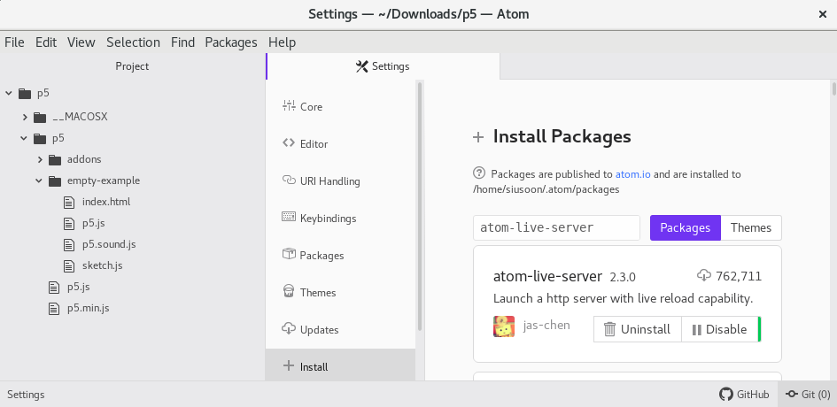
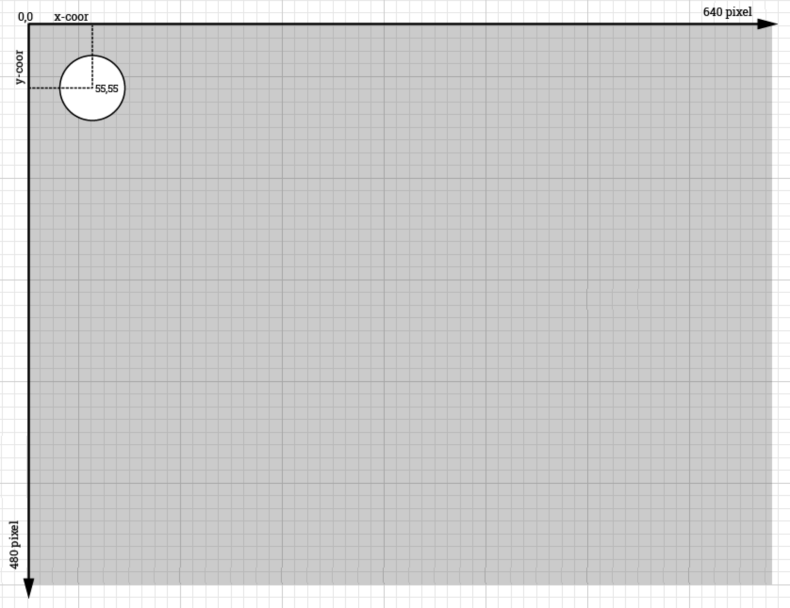

Title: 1. Getting Started
page_order: 1

## 1. Getting Started

## 1.1 setup()
It has become commonplace to include programming in education programmes at all levels and across a range of disciplines. Yet this still remains relatively uncommon in the arts and humanities, in subjects where learning to program does not align explicitly to related career aspirations. This raises questions about what gets included or not in curricula, and why this may be the case, and what kinds of knowledge and skills are considered necessary for some subjects and not others. Certain forms of privilege (related to class, race, gender) is clearly affirmed in these choices. For instance, and in very general terms (of cultural studies), *high culture* related to art and philosophy has long been the domain of university-educated (wealthy, white) people over the *low culture* of ordinary people and everyday life. Neither high and low culture as such, programming cuts across this class divide as both an exclusive and specialised practice for sure but also one rooted in the acquisition of skills with applied real-world use in both work and play. Yet, despite its broad applicability, access to the means of production at the level of programming remains an issue all the same.  

We might usefully characterise this in terms of literacy — traditionally applied to the skills of reading and writing — to further include the reading and writing of code. Indeed coding is often referred to as "the literacy of today", and as the 21st century skill "we must learn to master [sic]".[^STEM] Argubly, knowing some basic coding skills will not only enhance the possibility of future employability but also allow for a better understanding of how things (codes) are *encoded* and *decoded* more widely in culture.[^Hall] Further echoing cultural studies, and its foundations in an expanded notion of literacy to include aspects of ordinary culture, Annette Vee's book *Coding Literacy* from 2017 is an attempt to shift our focus from technical skill to wider social relations. As she puts it, "Seeing programming in light of the historical, social, and conceptual contexts of literary helps us to understand computer programming as an important phenomenon of communication, not simply as another new skill or technology."[^Vee]

So, what are the implications of coding framed in terms of literacy, and for whom does this apply? Although Vee's book is not a programming book and does not address the question of how to program, it weaves together parallel histories of writing and coding to compare and trace what is meant broadly by literacy, and how to understand the rise of computing and the cultural discourse around the importance of code and coding. Indeed, it is common to discuss writing and coding together, text and code in parallel, especially in the fields of electronic literature, digital humanities and software studies.[^Cayley] (This parallel is also something we will develop in more detail in Chapter 7, "Vocable Code".) It applies to all of us. We hope that something of this expanded coding literacy is facilitated by reading and using this book, and we take inspiration from Vee's arguments for coding literacy, that it is no longer just "reading for comprehension" but also "reading for technical thought as well as writing with complex structures and ideas".[^Vee2] It is not simply a new way to read and write but also to think as well. Such a compelling argument for literacy is not only for the benefit of individuals who acquire certain skills but also for the potential of wider cultural and social action, helping to force coding out of its specialisation in certain disciplines and open up its critical and aesthetic potential.  

In 2016, Nick Montfort, a poet and academic, published *Exploratory Programming for Arts and Humanities*, a hands-on approach to programming. In the appendix, he outlines three key reasons in response to the question "Why Program?"[^Montfort] This includes: how learning to program allows us to think in new ways by bringing different methods and perspectives to raise new questions; how programming offers us a better understanding of culture and media systems, and consequently, we can learn to develop better, or better analysis of, cultural systems; and lastly, how programming can help us improve society by means of creating, designing and discovering programs. We are in broad agreement with Montfort on these points, but at the same time we see this as a means to open up how we might work differently, and think with programming to speculate on alternative forms and political imaginaries.  

As the opening chapter of this book, we introduce some ideas and exercises to get started — the `setup()` so to speak — and to reflect on why we need to learn to program, and hopefully this will help to sustain motivation across subsequent chapters. Imagining that our readers do not necessarily want to become professional programmers, we stress programming as a means to think otherwise (as we tried to outline in the Preface). We have ourselves learnt from others along the way, challenging our preconceptions, especially through the experience of working with students with little or no programming experience. Learning to code can be enjoyable and rewarding but also annoying and frustrating, especially concerning complex syntax and structure. It takes time to familiar oneself with precise and unforgiving computational logic and procedures, but hopefully the case for the importance of learning to program is established by now. On one level, the choice is simple: *to program or be programmed*. [^Rushkoff]

### 1.1 Start()
<!--  -->


*Figure 1.1: p5.js web interface*

Throughout the entire book, we will use JavaScript as the main programming language, and primarily focus on p5.js and its associated libraries. Practically speaking, p5.js is a web-based library, utilizing an open source JavaScript framework that makes creating projects with code on the web accessible, as well as much easier to share via the Internet, such as p5.js Web Editor, Open Processing, Git hosting platforms without additional installation. Through a web browser, a JavaScript-based project can be run and executed through a URL.

JavaScript was originally developed in 1995 by Brendan Eich with the aim to run a program in Netscape's browser.[^Severance] Some people might be confused with the difference between JavaScript and Java. They operate in two different systems. JavaScript is a lightweight programming lauguage which is usually used for, and enhance, web applications via animated visual and interactive behaviors, and it was originally designed to complement Java. Indeed, program code from any *high-level programming language*, which means it is closer to human languages but further from machines' operations, requires a translation into native machine instructions/code for a computer to run and execute it. This translation process is usually done through interpreters or compilers. JavasScript by design is an interpreted language, but is now mostly, in modern browsers, operated via both interpreter and just-in-time compilers to translate source code to native machine code at runtime.[^Clark] It is generally faster to kickstart the code running process but it takes longer when the application is more complex and with longer interactions as extra runtime overhead will be incurred.[^Moon] On the contrary, Java, a compiled and complex programming language, was first released to the public in 1996 by Sun Microsystems, meaning that source code is typically written in an Integrated Development Environment (IDE).[^IDE] It is required to optimize and compile into static bytecode for computer processing by a Java Virtual Machine (JVM).[^JVM] Java powers many desktop and mobile applications, from small apps on Android mobile devices to games like Minecraft,[^Minecraft] while JavaScript mainly works for smaller web-based applications such as websites and bots. For the purpose of an introduction to programming like this, we need something that is uncomplicated in terms of getting started but with a capacity to grow in proficiency. This is often referred to as *low floors and high ceilings*,[^Papert] and JavaScript is a good tool from this dual perspective.

But there is much more to this than just introducing the tool from a practical perspective. This book will use p5.js, a JavaScript library which was created by artist Lauren McCarthy in 2014 for the purpose of what we call *aesthetic programming*. To be precise, it was begun by Casey Reas and Ben Fry who developed the remarkable and influential open source project Processing in 2001,[^Processing] a Java-based desktop environment with the aim to reach out to visual artists and designers. However, McCarthy observed that the various creative open source software available was mostly developed by White men, and there was a lack of diversity in such environments. With Reas' encouragement, McCarthy started to explore what Processing would look like on the web. Importantly, the core idea for p5.js is not just to deploy Processing as a web-based platform, but to address diversity and inclusivity explicitly and take it seriously as an issue in software development and communication. As McCarthy says, "thinking about community outreach and diversity is not a secondary goal of p5.js, it's the foundation on which the platform is built."[^McCarthy] Within just a couple of years, the contributors of p5.js had developed a community statement, translated the interface into different and popular languages such as Spanish and Simplified Chinese,[^Chinese] started the homepage series as part of p5.js showing works and interviews by Asian women and gender non-conforming coders,[^Jin] added a high constrast mode and audio feedback for people who have difficulty seeing,[^UX]] developed a series of workshops on creative expression called *Signing Coders* fopr people who have difficulty hearing.[^Choi] As p5.js demonstrates, software is not just a tool but also about people and politics.

## 1.2 Working environment
Similar to writing this book, you need an editor to write and document your code. For writing code, we will use [Atom](https://atom.io/),[^Atom] which is a free and open source text and source code editor that works across different platforms. We choose a downloadable code editor over a web editor because we see code as more than just one piece of software or the Internet, it is also about the relations with the configuration of your own computer and operating system, the behavior of different browsers, as well as data files and the organisation of folder paths, and so on.  

Additionally we use Gitlab as our code and text respository, at least for this book. We should add that we also use Gitlab for teaching purposes, a place where students can upload their Readme and Runme files every week, for peer feedback and to facilitate peer learning, and to read and share code and related thinking. We have found this to be an effective way to work both on an individual basis and at the same time to work together and share materials in keeping with the best principles of free and open source software development, as well as use the Readme to not only find out about how the run the project but also to develop a critical discussion.  

### 1.2.1 p5.js
1. First go to the [download page](https://p5js.org/download/) of p5.js (https://p5js.org/download/)[^p5js] and get the p5.js complete library (in the compressed format of 'p5.zip') by clicking it and saving the file which includes all the necessary libraries to run the code.
2. Double click the zip and unzip the file to extract all the files associated with the compressed one, then you should see that another new folder is created called 'p5'.
3. The next part is crucial for the on-going development process, because you have to somehow decide where your working folder will be located. If you have no idea, you may consider using the 'Desktop' folder. (Foldering is a concept used for organizing files in your device, which is similar to organizing papers, folders, books on a bookshelf. With the increasing streamlined UX design, many people find it alienating to navigate or locate the path and directory of files, like pictures, in a device as we are getting more used to putting everything on the first few pages of a phone or simply on the desktop.)  
4. If you put the unzipped folder 'p5' in a customized directory, then you should see the list of files in the folder as below. You should see the two p5.js libraries, one is the complete one (p5.js) and the other is the 'mini' version of it (p5.min.js).
<br> <br>
*Figure 1.2: p5 folder hierarchy*
5. Click on the folder 'empty-example', and then you will see a list of files you will need to begin:
<br><br>
*Figure 1.3: p5 folder hierarchy*

*  **index.html** - the default Hypertext Markup Language (HTML) which will be first to be picked up by a web browser. HTML is a fundamental technology used to define the structure of a webpage and it can be customized to include text, links, images, multimedia, forms, and other elements.
*  **sketch.js** - the key working file for writing JavaScript.
*  **p5.js** - p5.js core library.
*  **p5.sound.js** - p5.js sound library[^sound] for web audio functionality, including features like playback, listening to audio input, audio analysis and synthesis.  
*  **p5.dom.js** - p5.js dom library (we will return to this in Chapter 4).

### 1.2.2 Code editor
ATOM is used as the key code editor for this book. It supports cross-platform editing which can be run on Mac OS, Windows and Linux.
1. Download the software ATOM from the homepage: https://atom.io/
2. Drag the 'p5' folder that you have just unzipped onto ATOM. You should able to see the left-hand pane with your project. Then you try to navigate to the 'index.html' file under the 'empty-example' folder, double click that file and the source code should display on the right-hand pane. See below:
<br><!--  -->
<br>
*Figure 1.4: The file structure of ATOM*

The 'index.html' is the default page, amongst all other pages and files, which the web browser will display. You can customize the page title and other styling issues, but the focus for this chapter will be to navigate the libraries and run your first program. Since p5.js is a library, here the lines 8-11 indicate how to incorporate javascript files and libraries by using the tags `<script>` and `</script>`.

Right now the script is using relative paths, which is a useful concept when we need to understand how the libraries are operated, how to locate the files and how to incorporate new libraries and files in the future. The javascript libraries are simply files, and we have to incorporate these files into the html so that they can be imported and read by the program. This means that when we use the p5 syntax, the program can recognize the syntax and the corresponding function. For this particular example, it is important to aware that the javascript libraries and the html file are in the same directory. If we move the libraries somewhere else, we will then need to update the path.

Next you will need to install a package called 'atom-live-server',[^liveserver] and this is useful for setting up a web server so you can update your code and see the results immediately on a browser without the need to refresh it. You can first check under 'Packages' on your menu bar and see if the package is there. If not, then go to Edit > Preferences > +Install, then type 'atom-live-server'. Hit the blue install button and you should able to find it again under the Packages menu.

<!--  -->
 <br>
*Figure 1.5: Installing atom-live-server*

If you want to customize the theme like the background color of the panes, simply go to Preferences > Themes.

### 1.2.3 My first program
Sketch.js is the working file. Inside there are only two functions.
* `function setup()` - Code within this function will only run once by the sketch. We would typically use this to set the canvas size to define the basic sketch setup.
* `function draw()` - Code within this function will keep on looping, and that means the function draw() is called on each frame. The default rate is 60 frames/times per second, and this is especially useful when things are set in motion or constantly being captured.

Let's try to input these into the sketch to draw a canvas with a changing background (between white and black colors), then the sketch will further draw an ellipse located somewhere in the top left corner. (Double check the spelling and punctuation like curly brackets and semi-colons, indicating the scope of the function and end of the line respectively. Details of the code will be further explained later.)

```javascript
function setup() {
  // put setup code here
  createCanvas(640,480);
  print("hello world");
}
function draw() {
  // put drawing code here
  background(random(255));
  ellipse(55,55,55,55);
}
```

* To run the code, you just need to go to Packages > atom-live-server (or you can use the shortcut Crtl + Alt + L). Then you will see a popup window, click on the 'empty-example' folder and it should display something like this:
<br><!--  -->
 <br>
*Figure 1.6: My first program*  

## 1.2.3.1 Exercise in class
1. Stop the atom-live-server by going to Packages > 'atom-live-server' > Stop (or to use the shortcut Ctrl + Alt + Q)  
2. Try to rename the folder 'empty-example' to 'myFirstSketch' (in order to help the computer to process better, don't use space in between)
3. Try to create a folder called 'libraries' under 'myFirstSketch'
4. Drag the three p5 libraries into the folder
5. Change the relative path of the three js libraries in index.html
6. Change the title in the HTML file (line 6)
7. Can you run the program so that you can see almost the same screen as Figure 6 on a web browser?

<br><!--  -->
 <br>
*Figure 1.7: My first program 1.1*

This exerise is to get familiarize you with the path and local directory so as to know that running a sketch on a web browser requires loading the right path of the JavaScript libraries. You are also free to create your own folder name and rename the file like sketch.js as you please. You may also try to change the parameters of the numbers to get a sense of how things work, but this will be explained in more detail later in the book.

## 1.3 The sample code: Reading the web console 'Hello World'
As you might realise by now, this book is not following the convention of most programming books in starting with the 'Hello World' program, printing 'Hello World' onto the screen. In p5.js, `print()` is the function to print,[^print] but in a web browser setting the print() function writes in the "console area". This is an area not for end users, but more for programmers or developers to see if there are any error messages, logging messages to the console and to check that code is executing in the expected way.

In the sample code above, you can see that line 4 prints 'hello world'. But to see the text, you need to open the web console area which is located according to the type of browser you are using. Try to search by navigating the menu bar. In the Firefox browser, for instance, it is located under Tools > Web Developer > Web Console (Ctrl + Shift + K).

<br><!--  -->
 <br>
*Figure 1.8: The console area*

At the bottom of Figure 1.8, the web console area shows 'hello world'. What you know from this is that the sketch is running properly and it is able to read the print's function line. As you progress through this book, you will find that the web console area is very important, because you can also see error messages when, for example, the syntax is wrong. In such acses the browser will give you some good hints to bug fix your own code. Figure 1.9 shows that the web console area is able to specify which file (sketch.js) and which line of code (line 8) has a problem (the syntax background was spelled wrong intentionally).

<br><!--  -->
 <br>
*Figure 1.9: Example of syntax error*  

Hello World programs have a long history in computing, typically used to introduce a programming language to beginners and making sure things are running as they should. Readers understand the line `print("hello world")` quite literally as it is written in 'natural' language. At the same time the computer is executing precisely what you tell it to do, printing a text through an 'instruction', giving an immediate result which can be very rewarding. The immediate feedback "produces a feeling of power" as the programmer starts to exert control over the code and its meaningful expression in the world.[^Chun2] The programmer learns to express themselves in a new language as if speaking for the first time, hence the seemingly naïve address, announcing themselves to the world. The project [*hallo welt! (hello world!)*](http://www.anti-thesis.net/hello-world-60/),[^Hello] by Geoff Cox and Duncan Shingleton plays on this hopeful communicative act, looping more than 100 Hello World programs written in different programming languages, alongside a selection of human languages, combining them into a multilingual machinic confusion of tongues in real-time (as in *The Tower of Babel*).[^Babel]

## 1.3.1 The sample code: Reading the reference guide
To further explain the remaining parts in the sample code, this book will guide you to learn independently, especially in learning to read the reference guide so that you can explore things on your own. In the sample code, there are few functions that you will see apart from `print()`: these include `createCanvas()`, `background()`, `random()`, `ellipse()`.

In summary, what the earlier sample code does is to initialize the exact canvas size, setting the width to 640 pixels and height to 480 pixels, as the overall drawing area (see line 3 of the sample code). This is why the background covers only the canvas area and the exceeded area remains as the default white color background. The sketch will pick up a random color (between white to black, i.e. greyscale) at a given time as the background color, covering the whole canvas (see line 8 of the sample code). The last part is to draw an ellipse at a certain position and of certain size (see line 9 of the sample code). Locating this within the function draw(), the program will execute the lines of code constantly and repetitively. The repetition is made obvious in the sample code because the background color changes over time.

There are some kinds of structure here which are hard to remember for a new language, for example what and how many arguments to take in for each function, and what other functions might be available. For the first chapter, the number of functions that you know may be quite limited, but you will explore and experiment with more as you progress through the book. For p5.js, functions are documented in the page called [References](https://p5js.org/reference/),[^Reference] and once you get used to their presentation, it will be become easier and quicker to learn and write the given syntax.

<!--  -->
 <br>
*Figure 1.10: The reference guide example - ellipse()*

Let's read together the reference in Figure 1.10 - [`ellipse()`](https://p5js.org/reference/#/p5/ellipse).[^ellipse] It usually starts with an example and an illustration, and you can click the 'edit' button to modify the code, changing the parameters on the fly and displaying the results immediately on screen. The description part of the reference page explains how the function syntax works and this is especially useful for beginners who might have no clue about the parameters/numbers and what it means for each parameter within a function. The syntax area demonstrates how it should be written precisely, and the parameter's section explains things further. For example, in the case of `ellipse(x, y, w, [h])`, it explains how the first parameter x and the second parameter y are used to set the location of the ellipse in terms of x and y coordinates. The canvas is set in terms of pixel units, and the [0,0] coordinates start in the top left corner of the canvas. The parameter w and h refers to the width and height of the ellipse, and you can also think of this as the diameter, or setting the size, of the ellipse. The square bracket `[h]` is an optional parameter if the width and height of the ellipse is the same.

<!--  -->
 <br>
*Figure 1.11: Visualizing the ellipse*

What we want to demonstrate here is that the references are important to start with, and then explore other syntaxes and features, for example other shapes like rectangles and polygons. There are still other syntaxes in the sample code that we haven't explained in detail, so perhaps you can find the corresponding references from p5.js web references and explore these yourself. But we will continue to explore the color function in the next chapter, and the `random` function in chapter 3.

## 1.4 Git

// add here on how to setup Gitlab

## 1.5 While()

Already introduced briefly, Git is a distributed version-control system for tracking changes in source code during software development. It is designed for coordinating work among programmers, but it can also be used to track changes in any set of files, including the workflow of the chapters of this book to allow for new versions to be cloned. It is a repository that includes a complete history of changes and full version-tracking abilities. Its serious functionality for workflow management is somewhat undermined by the speculation on the name itself, and whether it is an acronym or not. Allegedly, Linus Torvalds who developed it as a content tracker for Linux (which he also developed), named it “Git” — an offensive English slang for a stupid person, to mock himself. Similarly it can referred to as a "stupid content tracker" but this is hardly the case as in reality it is a fast, scalable, and effective distributed revision control system.[^Git] For clarity, git is spelled 'git' (for the command) or 'Git' (for the product), not 'GIT' (for the person), since it is not an acronym, but rather an expression of the intent to do something: a tool which does not try to be overly smart. Moreover the ability to make multiple versions is an overtly social act, an expression of the belief in sharing ideas and labour for the commons, and as such protected under the legal protection of the GNU General Public License which guarantees users the freedom to run, study, share and modify the software.[^GNUGPL]

Like the debates over the geneology of 'Git' and 'git', the use of words becomes hugely significant in terms of their meaning and ability to do things in the world in programming environment and in everyday situations. An example of this in everyday language would be the politics of pronouns and how the use of 'she', 'he' or 'they' indicate particular subject positions in the case of people and in the gendering of objects given that language tends to be "man-made".[^Spender] The importance of this is how to do things with words ethically given that words have effects as Judith Butler, amongst others, have forcefully pointed out. In her book *Excitable Speech*, Butler makes apparent how words can be "injurious".[^Butler] We will return to the analogy between speech and programming in later chapters (Chapter 7) but for now it is enough to say that words have social and political consequences and this extends to the naming of computational objects and functions.[^Cox] Whether they are directly executable or not they still have effects.

This politics of language was touched upon in the first section of this chapter, through what we might call an *expanded literacy* — as the ability to read, write, *and program* — an enhanced understanding of the relationship between what words mean and do things in terms of wider culture. Literacy is crucially important here to explain how new kinds of reading and writing are required to account for significant cultural and technical changes which includes issues of access. To clarify, we can refer back to the beginnings of cultural studies as a field, and Richard Hoggart's *Uses of Literacy* (published in 1957) that included working class (or mass) cultures as part of what we call *culture*, previously the preserve of an elite, and thereby introducing an expanded notion of literacy.[^Hoggart] Clearly literacy is a shifting notion, changing across cultures and underpinned by the changing relations between speaking and writing, also explored by Walter J. Ong in *Orality and Literacy*, who argued that the electronic age has sharpened our understanding through the "secondary orality" of media that all depend on writing in various ways.[^Ong] The written words of programming, for instance, demonstrate how our language has been further enhanced by new forms, and how writing is a form of action and not simply a referent of thinking.

In this book we weave together the words and actions of human and computer languages although recognise that they are not equivalents as such. The syntax of JavaScript, that we use in this book is one particular instance of this — useful to learn programming fundamentals and basic object-oriented concepts — but also allowing for experimentation with *seconday notation*. By this, we mean adjusting the formal notation to allow it to be more easily understood and offer the opportunity for other creative expression through semantic ambiguity; as, for instance, using 'class' to describe one or more objects in object-oriented programming as well as to stratefications in society based on economic and social status. An excellent example of this is Harwood's codework "Class Library", a melding of program code and written text to stress the material conditions of working with code and the possibility of class action.[^Harwood] You might want to look this term up in the references section to clarify the technical understanding.  

This discussion of programming or coding as a necessary skill for contemporary life seems indisputable, and there are plenty of examples of initiatives related to computational literacy and thinking, from online tutorials to websites such as Codecademy.org and Code.org. As already introduced at the beginning of this chapter, Vee's *Coding Literacy* explores these connections too, arguing how the concept of literacy underscores the importance, flexibility, and power of writing for and with computers.[^Vee3] An important aspect of this is that not only does this help us to better understand the social, technical and cultural dynamics of programming but also expands our very notion of literacy and its connection to a politics of exclusion (as with other non-standard literacies). Furthermore, and given that programming like other forms of writing performs actions, it presents itself as way to reconceive politics too: not simply writing or speaking, arguing or protesting in public, but also demonstrating the ability to modify the technical layer through which the action is performed, in recognition of the ways in which power and control are now structured at the level of infrastructure.[^Kelty] 

To get started, your first program is a means to engage with these ideas, to run some code. As this is not meant to be, nor can be, simply a technical exercise, we ask you to make the critical and practical aspects explicit in producing a README and a RUNME. This book serves as a guide for this initial task as well as subsequent ones: to run some code and to think with it. 

## 1.5.1 Mini_Exercise[1]: My First Program

Make a RUNME and a README. 

**Objective:**
- To learn the basic setup, including writing code with a code editor, running code with a web browser, independent study of code syntax, creating a readme file, etc. 
- To reflect upon the process of coding.

**To get some additional inspiration here:**
- [Daily sketch in Processing by Saskia Freeke](https://twitter.com/sasj_nl) and her talk is [here](https://www.youtube.com/watch?v=nBtGpEZ0-EQ&fbclid=IwAR119xLXt4nNiqpimIMWBlFHz9gJNdJyUgNwreRhIbdJMPPVx6tq7krd0ww) + [All the Daily Things 2018](https://vimeo.com/309138645) by Saskia Freeke.
- [Zach Lieberman](https://www.instagram.com/zach.lieberman/).
- [Basics in OpenProcessing](https://www.openprocessing.org/browse/?q=basics&time=anytime&type=all#).
- [Creative Coding with Processing and P5.JS](https://www.facebook.com/groups/creativecodingp5/).

**Task (RUNME):**
1. Study at least one example of syntax from p5.js' [reference](https://p5js.org/reference/) (Of course, it is always good to know more than one. Be curious!)
2. Familiarise yourself with the reference structure: examples, descriptions, different syntax and parameters (This knowledge will becomes essential and life-long skills for learning new syntax on your own)
3. Use, Read, Modify (or even combine) the sample code that you find (the most basic level is changing the numbers), and produce a new sketch as a RUNME.

**Questions to think about in your README:**
- How would you describe your first independent coding experience (in relation to thinking, reading, copying, modifying, writing code, and so on)? 
- How is the coding process different from, or similar to, reading and writing text?
- What does code and programming mean to you, and how do the assigned readings help you to reflect on programming?

## Required reading:
- Nick Montfort, "Appendix A: Why Program?", *Exploratory Programming For the Arts and Humanities* (Cambridge, Mass.: MIT Press, 2016), 267-277. 
- Annette Vee, "Coding for Everyone and the Legacy of Mass Literacy", *Coding Literacty: How Computer Programming Is Changing Writing* Cambridge, Mass.: MIT Press, 2017), 43-93.
- Lauren McCarthy, [Learning While making P5.JS](https://www.youtube.com/watch?v=1k3X4DLDHdc), OPENVIS Conference (2015).
- Daniel Shiffman, 1.1: Code! Programming with p5.js [online] (2018). Available at https://www.youtube.com/watch?v=yPWkPOfnGsw&list=PLRqwX-V7Uu6Zy51Q-x9tMWIv9cueOFTFA&index=2 [Accessed 09 Sep. 2019].
- p5.js. p5.js | get started. Available at: https://p5js.org/get-started/ [Accessed 09 Sept 2019].

## Further reading:
- Brian Lennon, "JavaScript Affogato: Programming a Culture of Improvised Expertise", *Configurations*, Volume 26, Number 1, Winter 2018, 47-72.

## Notes

[^STEM]: Having programming skills has become a prerequisite in education and business glabally. See, for instance, https://ec.europa.eu/digital-single-market/en/coding-21st-century-skill and https://news.microsoft.com/apac/features/coding-way-brighter-future-2018-beyond/. The opening up of programming beyond specialized disciplines, the so-called 'STEM' subjects, sets the conditions for what we refer to as *aesthetic programming*.

[^Hall]: We are thinking of Stuart Hall's essay "Encoding/Decoding" in which he argues that people can play an active role in decoding messages; Stuart Hall et al, eds. *Culture, Media, Language* (London: Hutchison, 1980), 128-38.

[^Vee]: Annette Vee, *Coding Literacy: How computer programing is changing writing* (Cambridge, Mass.: MIT Press, 2017, 4). Beyond coding literacy, we can also observe other kinds of literacy in mainstream media, policy making and academic discourses, such as procedural, data and digital literacy. See Ian Bogost, "Procedural Literacy: Problem Solving with Programming, Systems, & Play", *The Journal of Media Literacy*, vol. 52, no. 1-2, 2015; Michael Mateas, "Procedural Literacy: Educating the New Media Practitioner", *On the Horizon. Special issue. Future of Games, Simulations and Interactive Media in Learning Contexts*, vol. 13, no. 1, 2005; Annette N. Markham, “Taking Data Literacy to the Streets: Critical Pedagogy in the Public Sphere.” *Qualitative Inquiry* (August 2019). doi:10.1177/1077800419859024; Teressa Umali, "Exclusive: Promoting Digital Literacy in the Philippine Education System, *OpenGov Asia*, web, available at  https://www.opengovasia.com/promoting-digital-literacy-in-the-philippine-education-system/.

[^Cayley]: John Cayley, "The Code is Not the Text Unless it is the Text", *Electronic Book Review* (2002), available at http://electronicbookreview.com/essay/the-code-is-not-the-text-unless-it-is-the-text/, see also Katherine Hayles, *Writing Machines* (Cambridge, Mass.: MIT Press, 2002).

[^Vee2]: Vee, *Coding Literacy: How computer programing is changing writing*, 45-58.

[^Montfort]: Nick Montfort, *Exploratory Programming for the Arts and Humanities* (Cambridge, Mass.: MIT Press, 2016).

[^Rushkoff]: We take this from Douglas Rushkoff's *Program or Be Programmed: Ten Commandments for a Digital Age* (New York: OR books, 2010).

[^Severance]: Charles Severance, "Javascript: Designing a Language in 10 Days", *IEEE Computer Society*, February 2012, 7-8.

[^Clark]: Lin Clark who works at Mozilla and turn code into code cartoons, and she explains how javascript is run in the browser, see https://hacks.mozilla.org/2017/02/a-crash-course-in-just-in-time-jit-compilers/.

[^Moon]: Seong-Won Lee and Soo-Mook Moon, "Selective Just-in-time Compilation for Client-side Mobile Javascript Engine", in *Proceedings of the 14th International Conference on Compilers, Architectures and Synthesis for Embedded Systems (CASES '11)* (New York: ACM, 2011), 5-14. DOI: https://doi.org/10.1145/2038698.2038703

[^IDE]: explain IDE.

[^JVM]: explain JVM.

[^Minecraft]: See https://minecraft.gamepedia.com/Development_resources.

[^Papert]: A concept was first formulated by mathematician, computer scientist, and educator Seymour Papert who was a MIT Professor and created a design principle for a programming language called Logo. See Seymour Papert, *Mindstorms: Children, Computers, and Powerful Ideas* (New York, NY: Basic Books, 1980).

[^Processing]: See Processing.org.

[^McCarthy]: Lauren McCarthy, P5js Diversity & Floss Panel Introduction (2015). Video available at http://opentranscripts.org/transcript/p5js-diversity-floss-panel-introduction/.

[^Chinese]: p5.js is now available in Spanish, Maya Man, *Processing Foundation* (2016), available at https://medium.com/processing-foundation/p5-js-is-now-available-in-spanish-3d1eab9dffa0; see also Kenneth Lim, Chinese Translation for p5.js and preparing a future of more translations (2018), available at https://medium.com/processing-foundation/chinese-translation-for-p5-js-and-preparing-a-future-of-more-translations-b56843ea096e.

[^Jin]: Such series with a focus on diversity with code+art is placed under the subdomain of p5.js, created and curated by Chelly Jin, diversity.p5js.org.

[^UX]: A UX-research project by Claire Kearney-Volpe, https://www.clairekv.com/p5js-ux-research.

[^Choi]: A project by artist and educator Taeyoon Choi, http://taeyoonchoi.com/soft-care/signing-coders/.

[^Atom]: https://atom.io/.

[^p5js]: p5.js download page, https://p5js.org/download/.

[^sound]: https://p5js.org/reference/#/libraries/p5.sound.

[^liveserver]: https://atom.io/packages/atom-live-server.

[^print]: https://p5js.org/reference/#/p5/print.

[^Chun2]: Wendy Hui Kyong Chun and Andrew Lison argue the first Hello World program we learn is enjoyable and seductive. See Chun, Wendy HK & Lison, Andrew. "Fun is a Battlefield: Software between Enjoyment and Obsession", in Olga Goriunova, ed., *Fun and Software: Exploring Pleasure, Paradox and Pain in Computing* (New York, London: Bloomsbury Academic, 2014), 180.

[^Hello]: *hallo welt! (hello world!)* is a collaboration between Geoff Cox and Duncan Shingleton, see http://www.anti-thesis.net/hello-world-60/.

[^Babel]: *The Tower of Babel*, designed to reach into heaven, displeased God such that ‘he’ [sic] decided to confound the single language of Adam so that people would not understand each other’s speech (*Genesis* 2:19 & 11:1-9). Subsequently everyone is left to 'babble' in a diversity of languages and confusion of tongues. The code expresses this confusion but also invokes free speech, allowing the web browser to 'speak' through software according to what it is said/written. "It is both a computer-readable notation of logic and a representation of this process, both script and performance; and in this sense it is like spoken words" as Cox reminds us. We will return to this issue in Chapter 7 - Vocable Code. See Geoff Cox, *Speaking Code: Coding as Aesthetic and Political Expression* (Cambridge, Mass: MIT Press, 2013), 3.

[^Reference]: See https://p5js.org/reference/.

[^ellipse]: See https://p5js.org/reference/#/p5/ellipse.

[^Git]: This discussion is summarised at https://stackoverflow.com/questions/43959748/what-is-the-abbreviation-of-git.

[^GNUGPL]: See https://www.gnu.org/licenses/lgpl-3.0.txt.

[^Spender] Foundational reading in this direction would be Dale Spender, *Man-Made Language* (add ref).

[^Butler]: Judith Butler, *Excitable Speech: A Politics of the Performative* (London: Routledge, 1997).

[^Cox]: See also Geoff Cox & Alex McLean, *Speaking Code: Coding as Aesthetic and Political Expression* (Cambridge, Mass.: MIT Press, 2013).

[^Hoggart]: Richard Hoggart, *The Uses of Literacy: Aspects of Working Class Life* (London: Penguin, 2009 [1957]). 

[^Ong]: Walter J. Ong, *Orality and Literacy: The Technologizing of the Word* (London: Routledge, 2002 [1982]).

[^Harwood]: See Harwood's "Class Library", in Fuller ed., *Software Studies*, 37-39.

[^Vee3]: Vee, *Coding Literacy*.

[^Kelty]: This point largely derives from Christopher Kelty's *Two Bits: the Cultural Significance of Free Software* (Durham: Duke University Press, 2008), who uses the phrase "running code" to describe the relationship between "argument-by-technology and argument-by-talk" (58). Clearly programmers are able to make arguments like other rhetorical forms, see Kevin Brock, *Rhetorical Code Studies: Discovering Arguments in and around Code* (Ann Arbor, Michigan: University of Michigan Press, 2019).
