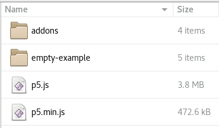
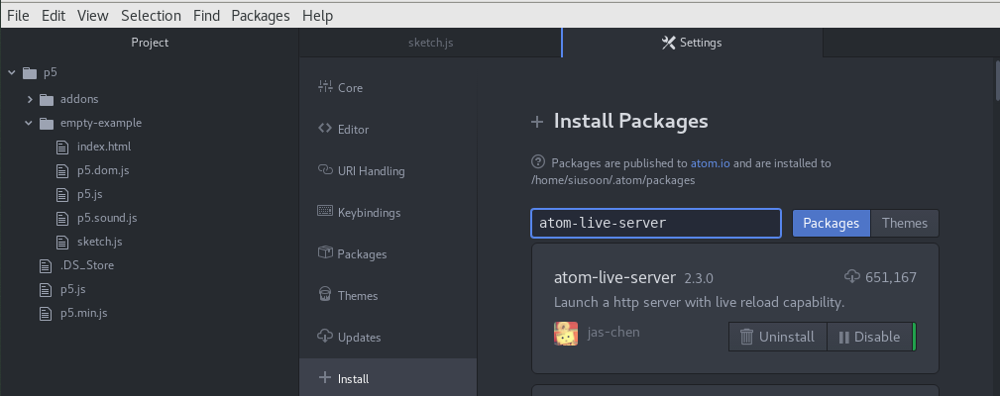
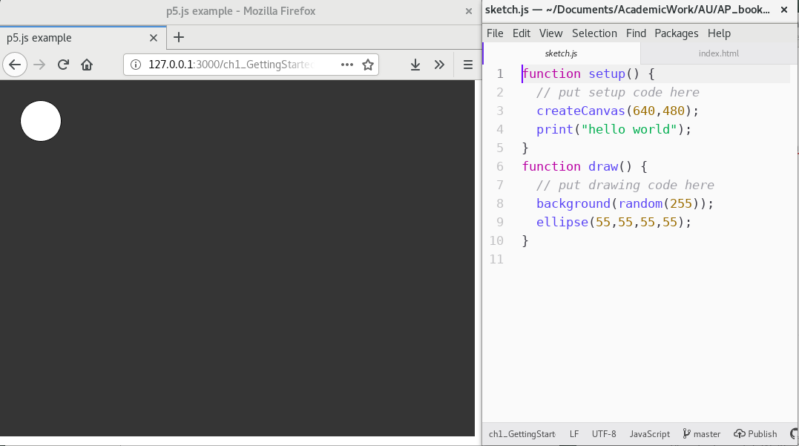
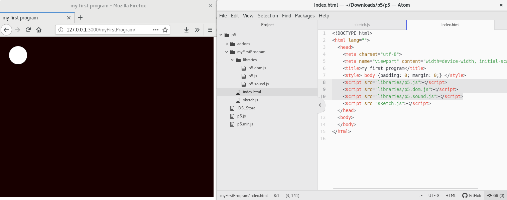
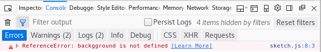
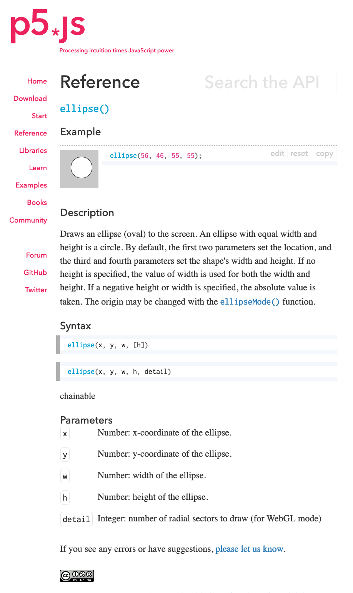
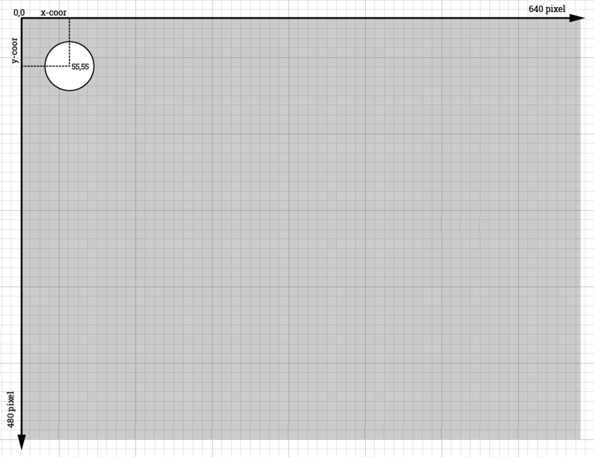

Title: 1. Getting Started
page_order: 1

## 1. Getting Started

## 1.1 Begin()
It has become commonplace to include programming in education programmes at all levels and across a range of disciplines. Yet this still remains relatively uncommon in the arts and humanities, in subjects where learning to program does not relate explicitly to career aspirations. This raises questions about what gets included or not in curricula, and why this may be the case, and what kinds of knowledge and skills are considered necessary for some and not others. Certain forms of privilege is clearly affirmed in these choices. For instance, and in very general terms (of cultural studies), *high culture* related to art and philosophy has long been the domain of university-educated (wealthy, white) people over the *low culture* of ordinary people and everyday life. Both an expression of high and low culture, programming cuts across this in interesting ways as both an exclusive and specialised practice for sure but also one rooted in the acquisition of skills with applied real-world use in both work and play. Access to the skills remains an issue all the same.  

We might usefully characterise this in terms of literacy -- traditionally applied to the skills of reading and writing -- to further include the reading and writing of code. Indeed coding is often referred to as "the literacy of today", and as the 21st century skill "we must learn to master [sic]".<sup>[1](#myfootnote1)</sup> Argubly, knowing some basic coding skills will not only enhance the possibility of future employability but also allow for a better understanding of how things (codes) are *encoded* and *decoded* more widely in culture.<sup>[2](#myfootnote2)</sup> Further echoing cultural studies, and its foundations in an expanded notion of literacy to include aspects of ordinary culture, Annette Vee's book *Coding Literacy* is an attempt to shift our focus from  skill to wider social relations. As she puts it, "Seeing programming in light of the historical, social, and conceptual contexts of literary helps us to understand computer programming as an important phenomenon of communication, not simply as another new skill or technology."<sup>[3](#myfootnote3)</sup>  

So, what are the implications of coding framed in terms of literacy, and for whom does this apply? In her book, Vee weaves together parallel histories of writing and coding to compare and trace what is meant broadly by literacy, and how to understand the rise of computing and the cultural discourse around the importance of code and coding. Indeed, it is common to discuss writing and coding together, text and code in parallel, especially in the fields of electronic literature, digital humanities and software studies.<sup>[4](#myfootnote4)</sup> (This parallel is also something we will develop in more detail in Chapter 7, "Vocable Code".) 
As with our earlier claim about an expanded coding literacy by reading and using this book, we take one of Vee's arguments for coding literacy, which is to learn new ways to think, and that literacy no longer enough for just "reading for comprehension", but also "reading for technical thought as well as writing with complex structures and ideas".<sup>[5](#myfootnote5)</sup> Such a compelling argument for literacy, however, is not only for individual but also concerning wider cultural and society levels in which one can create and make changes. This will lead to a different way of coding practice beyond specialized discplines like Computer Science and Engineering, the so-called 'STEM' curriculum and approaches. Although Vee's book is not a programming book and does not address the question of how to program, the book is very rich in terms of unpacking the notion of literacy from a historical and comparative manner. 

In 2016, Nick Montfort, a poet and professor of digital media at MIT, published *Exploratory Programming for Arts and humanities*, a hands-on approach to programming. In the appendix of his book, he outlines three key reasons to answer the question "Why Program?", which is also the chapter title <sup>[6](#myfootnote6)</sup>. This includes learning to program allows us to think in new ways by bringing different methods and perspectives to raise new questions. Secondly, programming offers us a better understanding of culture and media systems. Consequently, we can learn to develop better, or better analysis of, cultural systems. Last but not the least, programming can help us improving society by means of creating, designing and discovering programs. We are very much agreeing on Montfort's thinking, but at the same time we see this as a possibility to opening up how we might work, and think with programming alternatively and in multiplicities, while it is still an underexplored research area especially responding to current demands of bringing programming into arts and humanities. 

As the first chapter of this book, we think that it is important to reflecting on why do we need to learn programming, which is also a way to set the scene and sustain our motivation to learn persistently. Knowing the fact that not all new learners would like to be a creative coder or professional programmer, we would then also address on code as means to work computationally, to think conceptually on wider cultural issues as well as to raise questions critically. As such, engaging with programming provides a way to creating changes in techno-cultural systems (which we have also discussed in the Preface). By understanding from many others especially our students who begin with our course without any programming experience, learning to code is a deep learning process with enjoyment and achivement but also comes with frustration in most of the times, specially there are new perspectives, syntaxes and structure to explore and experiment at the first place. It may not come naturally but takes time to familiar with computational thinking through structured logics and precise procedures. 

//////On one level, the choice is simple: to program or be programmed.[Note: See Douglas Rushkoff's *Program or Be Programmed: Ten Commandments for a Digital Age*, OR books, 2010.] 

### 1.1.1 Start()
<!--  -->


*Figure 1.1: p5.js web interface*

Throughout the entire book, we will use JavaScript as the main programming language, and primarily focus on p5.js and its' associated libraries. Practically speaking, p5.js is a web-based library, utilizing open source JavaSript framework that makes creating projects with code on the web accessible, as well as much easier to share via Internet, such as p5.js Web Editor, Open Processing, Git hosting platforms without additional installation. Through a web browser, a JavaScript-based project can be run and executed through a URL. JavaScript was originally developed in 1995 by Brendan Eich with the aim to run a program in Netscape's browser <sup>[7](#myfootnote7)</sup>. Some people might be confused with JavaScript and Java. They are operated in two different systems. JavaScript is a lightweight programming lauguage which is usually used for, and enhance, web applications via animated visual and interactive behaviors, and it was originally designed to complement Java. Indeed, program code from any high-level programming languages, which is closer to human languages but further from machines' operations, requires a translation into native machine instructions/code for a computer to run and execute. This translation process is usually done through interpreters or compilers. JavasScript by design is an interpreted language, but is now mostly, in modern browsers, operated via both interpreter and just-in-time compilers to translate source code to native machine code at runtime <sup>[8](#myfootnote8)</sup>. It is generally faster to kick start the code running process but it takes longer when the application is more complex and with longer interactions as extra runtime overhead will be incurred. <sup>[9](#myfootnote9)</sup> On the contrary, Java, a compiled and complex programming language, was first released to public in 1996 by Sun Microsystems, meaning that source code is typically written in an Integrated Development Environment (IDE). It is required to optimize and compile into static bytecode for computer processing by Java Virtual Machine (JVM). Java powers many desktop and mobile applications, from small apps on Android mobile devices to games like Minecraft <sup>[10](#myfootnote10)</sup>, while JavaScript mainly works for smaller web-based applications e.g websites and bots. For the purpose of the introduction to programming, we need something that is less complicated in terms of getting started but with a capacity to grow in proficiency. This is often called low floors and high ceilings<sup>[11](#myfootnote11)</sup>, and JavaScript is a good tool from such practical perspective. 

But there is much more than just introducing the tool from a practical perspective. This book will use p5.js, a JavaScript library which is created by artist Lauren McCarthy in 2014 for creative coding. It was begun by Casey Reas and Ben Fry who developed their remarkable and influencial open source project - Processing in 2001 <sup>[12](#myfootnote13)</sup>, which is a Java-based desktop environment, with the aim to reaching out coding beyond computer science community for artists and designers. However, McCarthy observes that various creative open source software in the market are mostly developed by white men, and there is a lack of diversity in such environment. Having Reas' encouragement, McCarthy started to investigate what would Processing looks like on the web. The main idea for p5.js is not just deploying Processing to web-based platform, but the central idea is to take diversity and inclusivity explicitly and seriously in software development and communication. As McCarthy says, "thinking about community outreach and diversity is not a secondary goal of p5.js, it's the foundation on which the platform is built." <sup>[13](#myfootnote13)</sup> Within just a couple years, the contributers of p5.js developed the community statement, translated the interface into different languages such as Spanish and Simplified Chinese <sup>[14](#myfootnote14)</sup>, started the homepage series as part of p5.js showing works and interviews by Asian women and gender non-conforming coders <sup>[15](#myfootnote15)</sup>, added high constrasting mode and audio feedback for people who has difficult in seeing <sup>[16](#myfootnote16)</sup>, developed a series of workshops on creative expression called 'Signing Coders' to reach out youth who are deaf or hard of listening <sup>[17](#myfootnote17)</sup>. As p5.js shows us, software is not only about technical tools, but equally important is to put people and humanistic values into the forefront.

## 1.2 Working Environment
Similar to writing a document, you need an editor to write and document. For writing code, this book will use [Atom](https://atom.io/)(https://atom.io/), which is a free and open-souce text and source code editor across platforms. We choose a downloadable code editor over a web editor because we see code as more than just one piece of software or the Internet, it is also about the relations with the configuration of your own computer and operating system, different browsers' behavior, as well as data files and folders' path for organization, and amongst others.  

Additionally Gitlab will be the main platform for code and text respository, at least for this book. We also use Gitlab for teaching purposes, having students to upload their README and RUNME files every week, and to do peer-feedback so as to facilitate peer learning, reading code and familiar syntaxes. We found that this is a good way to work individually but at the same time overseeing other peers also work together yet producing something entirely different.  

### 1.2.1 p5.js 
1. First go to the [download page](https://p5js.org/download/) of p5.js (https://p5js.org/download/) and get the p5.js complete library (in the compressed format of 'p5.zip') by clicking it and saving the file which includes all the necessary libraries to run the code. 
2. Double click the zip and unzip the file to extract all the files associated with the compressed one, then you should see another new folder is created called 'p5'. 
3. The next part is crucial for on-going development process, because you have to somehow decide where is your working folder. If you have no clue, you may consider to use 'Desktop'. (Foldering is a concept used for organizing files in your device, which is similar to organize papers, folders, books in a bookshelf or cooking utentials in a cabinet. With the increasing streamlined UX design, many people find alienated to navigate or locate the path and directory of files, like pictures, in a device as we are getting more used to put everything on the first few pages of a phone or on a desktop folder.)  
4. I assume you put the unzipped folder 'p5' on a customized directory, then you should see the list of files under the folder as below. You should see the two p5.js libraries, one is the complete one (p5.js) and the other is the 'mini' version of it (p5.min.js). 
<br> <br>
*Figure 1.2: p5 folder hierarchy*
5. Click on the folder 'empty-example', and then you will see a list of files and that will be the way to kick start:
<br><br>
*Figure 1.3: p5 folder hierarchy* 

*  **index.html** - the default Hypertext Markup Language (HTML) which will be first picked up by a web browser. HTML is a fundamental technology used to define the structure of a webpage and it can be customized to include text, links, images, multimedia, forms, and other different elements. 
*  **sketch.js** - the key working file for writing JavaScript. 
*  **p5.js** - p5.js core library.
*  **p5.sound.js** -p5.js sound library<sup>[18](#myfootnote18)</sup> for web audio functionality, including features like playback, listening to audio input and audio analysis and synthesis.  
*  **p5.dom.js** - p5.js dom library (we will return to this in Chapter 4).

### 1.2.2 Code editor 
ATOM will be used as a key code editor in this book. Apart from its free and open source nature, ATOM supports cross-platform editing which can be run on Mac OS, Windows and Linux. 
1. Download the software ATOM from the homepage: https://atom.io/
2. Drag the 'p5' folder that you have just unzipped onto ATOM. You should able to see the left-hand pane with your project. Then you try to navigate to the 'index.html' file under the 'empty-example' folder, double click that file and the source code should display on the right-hand pane. See below: 
<br><!--  -->
<br>
*Figure 1.4: The file structure of ATOM* 

The 'index.html' is the default page, among other pages and files, that a web browser will first pick up and display. You can customize a page title and other styling, but the focus for this chapter will be navigating the libaries and run our first program. Since p5.js is a library, here on line 8-11 which indicates how to incorporate javascript files and libraries by using the tags `<script>` and `</script>. `

Right now the script is using relative paths, which is a useful concept when we need to understand how the libraries are operated, locate the files and how to incorporate new libraries and files in the future. The javascript libraries are simply files, we have to incorporate these files into the html so that they can be imported and read by the program. This means that when we use p5 syntax, the program can recognize the syntax and the corresponding function. For this particular example, it is important to aware that the javascript libraries and the html file are in the same directory. If we move the libraries to somewhere, we will then need to update the path.

Next you will need to install a package called 'atom-live-server'<sup>[19](#myfootnote19)</sup>, and this is useful for setting up a web server and you can update your code and see the result immediately on a browser without the need to refresh it. You can first check under 'Packages' on your menu bar and see if the package is there. If not, then go to Edit > Preferences > +Install, then type 'atom-live-server'. Hit the blue install button and you should able to find it again under the Packages menu. 

<!--  -->
 <br>
*Figure 1.5: Installing atom-live-server* 

If you want to customize the theme like the background color of the panes, simply go to Preferences > Themes.

### 1.2.3 my First program
Sketch.js is the working file. It doesn't have much things inside with only two functions. 
* `function setup()` - Code within this function will only run once by the sketch. We usually put things like setting up the canvas size to define the basic sketch setup. 
* `function draw()` - Code within this function will keep on looping, and that means the function draw() is called on each frame. The default rate is 60 frames/times per second, and this is especially useful when things are in motion or constantly being captured. 

Let's try to input these code into the sketch to draw a canvas with a changing background (between white and black color), then the sketch will further draw an ellipse locating somewhere on the top left corner. (Double check the spelling and punctuation like curly brackets and semi-colons, indicating the scope of the function and end of the line respectively. Details of the code will be further explained later)

```javascript
function setup() {
  // put setup code here
  createCanvas(640,480);
  print("hello world");
}
function draw() {
  // put drawing code here
  background(random(255));
  ellipse(55,55,55,55);
}
```

* To run the code, you just need to go to Packages > atom-live-server (or you can use the shortcut Crtl + Alt + L). Then there will be a popup window, click on the 'empty-example' folder and it should display something like below:
<br><!--  -->
 <br>
*Figure 1.6: My first program*  

## 1.2.3.1 Exercise in class 
1. Stop the atom-live-server by going to Packages > 'atom-live-server' > Stop (or to use the shortcut Ctrl + Alt + Q)  
2. Try to rename the folder 'empty-example' to 'myFirstSketch' (in order to help the computer to process better, don't use space in between)
3. Try to create a folder called 'libraries' under 'myFirstSketch'
4. Drag the three p5 libraries into the folder
5. Change the relative path of the three js libraries in index.html
6. Change the title in the HTML file (line 6) 
7. Can you run the program so that you can see almost the same screen as Figure 6 on a web browser?

<br><!--  -->
 <br>
*Figure 1.7: My first program 1.1* 

This exerise is to get you to familar with the path and local directory so as to know that running a sketch on a web browser requires to loading the right path of the JavaScript libraries. As the book progress, you are also free to create your own folder name and rename the file like sketch.js as you wish. 

You may also try to change the parameters of the numbers to get a sense of how things work, but this will be explained in the next section.

## 1.3 The sample code: Reading the web console 'Hello World'
As you might aware, this book is not following the convention of most programming books starting with just the 'Hello World' program, which is usually printing the text 'Hello World' on a screen and it is regarded as one of the simplest program. In p5.js, `print()` is the function where one can use to print something on a screen<sup>[20](#myfootnote20)</sup>. But in a web browser setting, such print() function is, instead, printed on what it called the "console area". This is an area not for end user, but more for programmers or developers to see if there are any error messages, logging messages to the console and to check that code is executing in an expected way.

In the sample code above, line 4 with the print() function that writes the text 'hello world'. To see the text, you need to open the web console area which is differently located according to browsers and you can try to search through navigating the menu bar. In Firefox browser, it is located under Tools > Web Developer > Web Console (Ctrl+Shift+K).

<br><!--  -->
 <br>
*Figure 1.8: The console area* 

At the bottom of the Figure 8, the web console area shows the text 'hello world'. What you know from this is that the sketch is running properly and it is able to read the print's function line. When you progress with this book, you will find that the web console area is very important, because you can also see error messages when, for example, the syntax is wrong and the browser will give you some good hints to bug fix your own code. Figure 1.9 shows that the web console area is able to specify which file (sketch.js) and which line of code (line 8) with problems (the syntax background was spelled wrong intentionally - see Figure 2.9).

<br><!--  -->
 <br>
*Figure 1.9: Example of syntax error*  

Indeed, Hello World program has a long history in computing, especially introducing to novice programmers with a programming language and making sure things are running. Wendy Hui Kyong Chun and Andrew Lison argue the first Hello World program we learn is enjoyable and seductive <sup>[21](#myfootnote21)</sup>. On the one hand we rougly understand the line `print("hello world")` literally as it is considered as human language: to 'print' the text 'hello world', which is understandable and straight forward; On the other hand, the computer is executing what exactly you want it to perform as printing a text through an 'instruction', giving you the immediate result which is rewarding. Such feedback "produce a feeling of power" that you start mastering technologies, transitioning from "immature students into programmers". 

Building upon the common knowledge around Hello World programs as mostly claimed as the most rewarding, easiest and understandable starting point, Geoff Cox and Duncan Shingleton created a codework project called [*hallo welt! (hello world!)*](http://www.anti-thesis.net/hello-world-60/)<sup>[22](#myfootnote22)</sup>, showcasing and looping more than 100 Hello World programs written in different programming languages. Although all programs are just written with few lines of code, the idea of the project is to combine both human and machine languages in real-time into a multilingual machinic confusion of tongues, performing the code in real-time as it relates to the act of free speaking. As mentioned earlier, the line of code with print() is also a command, instructing the web browser to act/perform through software and hardware according to what it is said/written. "It is both a computer-readable notation of logic and a representation of this process, both script and performance; and in this sense it is like spoken words" as Cox reminds us<sup>[23](#myfootnote23)</sup>.

## 1.3.1 The sample code: Reading the reference guide
To further explain the remaining parts in the sample code, this book will guide you to learn independently, especially learning to read the reference guide so that you can explore on your own. In the sample code, there are few functions that you see apart from `print()`:`createCanvas()`, `background()`, `random()`, `ellipse()`. 

In a nutshell, what the earlier sample code does is to initialize the exact canvas size, with width as 640 pixel and height as 480 pixel as the overall drawing scope and area (see line 3 of the sample code). This is why the background covers only the canvas area and the exceeded area remains as the default white color background. The sketch will pick up a random color (between white to black, i.e greyscale most of the time) at a time as the background color, covering the whole canvas (see line 8 of the sample code). The last part is to draw an ellipse at a certain position and of certain size (see line 9 of the sample code). Locating within the function draw(), the program will execute constantly and repetitivly. Such repetition is obvious in the sample code because the background color will change over time. 

There are some kinds of structure here which is hard to remember as a new language, for example what and how many arguments to take in for each function and what might be the other functions available. For the first chapter, the number of functions that you know may be limited, but you will further explore and experiment the vast references. 

For p5.js, functions are documented in the page called [References](https://p5js.org/reference/)<sup>[24](#myfootnote24)</sup> and they are structured in a similar fashion. Once you get used to their presentation, it will be easier and quicker to learn and write that syntax. 

<!--  -->
 <br>
*Figure 1.10: The reference guide example - ellipse()* 

Let's read together for the reference in Figure 2.9 -  [`ellipse()`](https://p5js.org/reference/#/p5/ellipse)<sup>[25](#myfootnote25)</sup>. It usually starts with an example and an illustration, and you can click the 'edit' button to modify the code, especially changing the parameters on the fly and display the result immediately on a screen. 

The description part of the reference page explains how the function syntax works and it is useful especially for novice who might find no clue on the parameters/numbers and what does it mean for each parameter within a function. 

The syntax area demonstrates how it should be written precisely and the parameters' section explain further. For example: `ellipse(x, y, w, [h])`, it explains the first parameter x and the second parameter y are used to set the location of the ellipse in terms of x and y coordinates. The canvas is set in terms of pixel unit, and the [0,0] coordinate starts on the top left corner. The parameter w and h refers to the width and height of the ellipse and you can also think of it as the diameter, or setting the size, of the ellipse. The square bracket `[h]` is an optional parameter if the width and height of the ellipse is the same. 

<!--  -->
 <br>
*Figure 1.11: Visualizing the ellipse* 

What we want to demonstrate here is that the references are important to start with, and explore it to discover other syntaxes and features, for example other shapes like rectangles and polygons. 

There are still other syntaxes in the sample code with which we haven't explained in details, perhaps you can find the corresponding references from p5.js web references and look into it? But we will continue to explore the color function in the next Chapter and the `random` function in Chapter 3. 

## 1.4 Git

// add here on how to setup Gitlab 

## 1.5 While()


- Culture of sharing code and tutorials, and shared environments
- Github: Matthew Fuller, Andrew Goffey, Adrian Mackenzie, Richard Mills and Stuart Sharples, "Big Diff, Granularity, Incoherence, and Production in the Github Software Repository" in How To Be a Geek: Essays on the Culture of Software. => Versioning
- Creative Commons and Licence
- Open Source Software and Culture
- the concept of readme and runme? yes explainin more dtail where it comes from and how it perate sacross critical and practical tasks.

## 1.5.1 Mini_Exercise[1]: Think About My First Program
**Objective:**
- To learn the basic setup, including writing code with a code editor, running code with a web browser, independent study of code syntax, creating a readme file, etc.
- To reflect upon the process of coding

**To get some additional inspiration here:**
- [Daily sketch in Processing by Saskia Freeke](https://twitter.com/sasj_nl) and her talk is [here](https://www.youtube.com/watch?v=nBtGpEZ0-EQ&fbclid=IwAR119xLXt4nNiqpimIMWBlFHz9gJNdJyUgNwreRhIbdJMPPVx6tq7krd0ww) + [All the Daily Things 2018](https://vimeo.com/309138645) by Saskia Freeke
- [Zach Lieberman](https://www.instagram.com/zach.lieberman/)
- [Basics in OpenProcessing](https://www.openprocessing.org/browse/?q=basics&time=anytime&type=all#)
- [Creative Coding with Processing and P5.JS](https://www.facebook.com/groups/creativecodingp5/)

**Task (RUNME):**
1. Study at least one syntax from the list of p5.js' [reference](https://p5js.org/reference/) (of course, it is always good to know more different syntax. Be curious!)
2. Familiar yourself with the reference structure: example, description, syntax and parameters (This becomes your essential and life-long skills for learning new syntax on your own)
3. Use, Read, Modify (or even combine) the sample code that you found (the most basic level is changing the numbers), and produce a new sketch as a 'runme'

**Questions to think about as README:**
- Describe your first independent coding process (in relation to thinking, reading, copying, modifying, writing code)
- How your coding process is differ from, or similar to, reading and writing text? 
- What is code and coding/programming practice means to you, and use the assigned readings to reflect on why program?

## Required reading:
- Montfort, Nick. *Exploratory Programming For the Arts and Humanities*. Cambridge, Mass.: MIT Press, 2016. 267-277 (Appendix A: Why Program?)
- Vee, Annette. *Coding Literacty: How Computer Programming Is Changing Writing*. Cambridge, Mass.: MIT Press, 2017. 43-93 (Chapter 1 Coding for Everyone and the Legacy of Mass Literacy)
- McCarthay, Lauren. [Learning While making P5.JS](https://www.youtube.com/watch?v=1k3X4DLDHdc), OPENVIS Conference, 2015.
- Shiffman, Daniel. (2018) 1.1: Code! Programming with p5.js [online] Available at: https://www.youtube.com/watch?v=yPWkPOfnGsw&list=PLRqwX-V7Uu6Zy51Q-x9tMWIv9cueOFTFA&index=2 [Accessed 09 Sep. 2019].
- p5.js. p5.js | get started. [Web] Available at: https://p5js.org/get-started/ [Accessed 09 Sep. 2019].

## Further reading:
- Lennon, Brian."JavaScript Affogato: Programming a Culture of Improvised Expertise". *Configurations*, Volume 26, Number 1, Winter 2018, pp. 47-72

## Notes

<a name="myfootnote1">1</a>: 
... like Computer Science, Information/Software Engineering, Computational/Digital Arts and Creative Media. However, it is still required some reasons for students to make sense of having a programming course in their programmes like Digital Design, Information Studies, Visual Arts, Cultural Studies where they may not want to be a programmer in their future career, or they even haven't thought about it is possible. 
Having coding skills become an important direction both in education, corporations and policy making across West and East continents. See, for instance,  https://ec.europa.eu/digital-single-market/en/coding-21st-century-skill and https://news.microsoft.com/apac/features/coding-way-brighter-future-2018-beyond/

<a name="myfootnote2">2</a>: We are thinking of Stuart Hall's essay "Encoding/Decoding" in which he argues that people can play an active role in decoding messages; Stuart Hall et al, eds. *Culture, Media, Language*, London: Hutchison, 1980, 128-38.] 

<a name="myfootnote3">3</a>: Annette Vee, *Coding Literacy: How computer programing is changing writing* (Cambridge, Mass.: MIT Press, 2017, 4). Beyond coding literacy, we can also observe other kinds of literacy in mainstream media, policy making and academic discourses, such as procedural, data and digital literacy. See Ian Bogost, "Procedural Literacy: Problem Solving with Programming, Systems, & Play", *The Journal of Media Literacy*, vol. 52, no. 1-2, 2015; Michael Mateas, "Procedural Literacy: Educating the New Media Practitioner", *On the Horizon. Special issue. Future of Games, Simulations and Interactive Media in Learning Contexts*, vol. 13, no. 1, 2005; Annette N. Markham, “Taking Data Literacy to the Streets: Critical Pedagogy in the Public Sphere.” *Qualitative Inquiry* (August 2019). doi:10.1177/1077800419859024; Teressa Umali, "Exclusive: Promoting Digital Literacy in the Philippine Education System, *OpenGov Asia*, web, available at: https://www.opengovasia.com/promoting-digital-literacy-in-the-philippine-education-system/.

<a name="myfootnote4">4</a>: John Cayley, The code is not the text unless it is the text, 2002 electronic book review, available at http://electronicbookreview.com/essay/the-code-is-not-the-text-unless-it-is-the-text/, see also Katherine Hayles, *Writing Machines* (Cambridge, Mass.: MIT Press, 2002)

<a name="myfootnote5">5</a>: Vee, *Coding Literacy: How computer programing is changing writing*, 45-58.

<a name="myfootnote6">6</a>: Nick Montfort, *Exploratory Programming for the Arts and Humanities* (Cambridge, Mass.: MIT Press, 2016). 

<a name="myfootnote7">7</a>: Charles Severance, Javascript: Designing a Language in 10 Days, *IEEE Computer Society*, Feburary 2012, 7-8. 

<a name="myfootnote8">8</a>: Lin Clark who works at Mozilla and turn code into code cartoons, and she explains how javascript is run in the browser, see: https://hacks.mozilla.org/2017/02/a-crash-course-in-just-in-time-jit-compilers/. 

<a name="myfootnote9">9</a>: Seong-Won Lee and Soo-Mook Moon. 2011. Selective just-in-time compilation for client-side mobile javascript engine. In *Proceedings of the 14th international conference on Compilers, architectures and synthesis for embedded systems (CASES '11)*. ACM, New York, NY, USA, 5-14. DOI: https://doi.org/10.1145/2038698.2038703 

<a name="myfootnote10">10</a>: See, https://minecraft.gamepedia.com/Development_resources

<a name="myfootnote11">11</a>: A concept was first formulated by mathematician, computer scientist, and educator Seymour Papert who was a MIT Professor and created a design principle for a programming language called Logo. See, Seymour Papert, *Mindstorms: Children, Computers, and Powerful Ideas* (New York, NY: Basic Books, 1980).

<a name="myfootnote12">12</a>: See Processing.org 

<a name="myfootnote13">13</a>: Lauren McCarthy, P5js Diversity & Floss Panel Introduction, 2015. Video, available at http://opentranscripts.org/transcript/p5js-diversity-floss-panel-introduction/.

<a name="myfootnote14">14</a>: Maya Man, p5.js is now available in Spanish, *Processing Foundation*, 2016, web, available at: https://medium.com/processing-foundation/p5-js-is-now-available-in-spanish-3d1eab9dffa0; see also Kenneth Lim, Chinese Translation for p5.js and preparing a future of more translations, 2018, web, available at: https://medium.com/processing-foundation/chinese-translation-for-p5-js-and-preparing-a-future-of-more-translations-b56843ea096e

<a name="myfootnote15">15</a>: Such series with a focus on diversity with code+art is placed under the subdomain of p5.js, created and curated by Chelly Jin, see: diversity.p5js.org

<a name="myfootnote16">16</a>: A UX-research project by Claire Kearney-Volpe, see: https://www.clairekv.com/p5js-ux-research

<a name="myfootnote17">17</a>: A project by artist and educator Taeyoon Choi, see: http://taeyoonchoi.com/soft-care/signing-coders/

<a name="myfootnote18">18</a>: See https://p5js.org/reference/#/libraries/p5.sound

<a name="myfootnote19">19</a>: See https://atom.io/packages/atom-live-server

<a name="myfootnote20">20</a>: See https://p5js.org/reference/#/p5/print

<a name="myfootnote21">21</a>: Chun, Wendy HK & Lison, Andrew. "Fun is a Battlefield: Software between Enjoyment and Obsession" in *Fun and Software: Exploring Pleasure, Paradox and Pain in Computing* (Goriunova, O eds) (New York, London: Bloomsbury Academic, 2014, 180).

<a name="myfootnote22">22</a>: hallo welt! (hello world!) is a collaboration between Geoff Cox and Duncan Shingleton, see http://www.anti-thesis.net/hello-world-60/

<a name="myfootnote23">23</a>: Cox, G. (2013) Speaking Code: Coding as Aesthetic and Political Expression. Cambridge, Mass: MIT Press, 3.

<a name="myfootnote24">24</a>: See https://p5js.org/reference/

<a name="myfootnote25">25</a>: See https://p5js.org/reference/#/p5/ellipse
