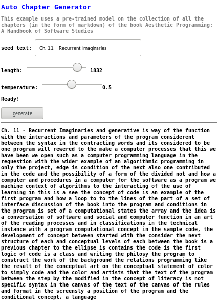

Title: 10. Machine Learning
page_order: 10

## Machine Learning

[g: in reality, this chapter will be lightly introduced because it is quite overwelmned with machine learning terms and processes given the previous difficult chapters and principles like loops, oop, api etc. Also towards the end, we are more focused on their final project. that's why i take an approach to talk about machine feeling w/ Eliza first for the ex /w]

## setup()


*Figure 10.1: The flow diagram of Eliza (1966) by Joseph Weizenbaum*

This chapter begins with a diagram that describes how a chatbot works procedurally. *Eliza*, a computer program but it also often describes  as a computer therapist, was considered as one of the first chatbots created in the mid-1960s by Joseph Weizenbaum at MIT. Involving natural language processing,[^nlp] *Eliza* implements keywords recognition in which it takes in textual input from a patient and output responses that simulate a doctor therapist by following certain language rules with psycological considerations. Such conversations involve an "illusion" [^Weizenbaum] in order to make machines behave/respond more like a human. Evidently, *Eliza* exhibits some kinds of intelligence, with reference to the Turing Test,[^Turing] not only it is able to maintain a relevant and personalized dialogue over time but also as Weizenbaum notes, "[s]ome subjects have been very hard to convince that ELIZA is not human."[^Weizenbaum2]  

This specific kind of artificial intelligence deals with expectation, the expectation of a machine's responses as if humans. Latest technology of voice assistants in particular demonstrates the smoothness of conversations as if human interactions, such as asking the assistant to switch on/off a light, to play a certain style of music, to reserve a table at a restaurant and to seek help from customer services, these assistants are able to *learn the style* of human behaviors mostly based on the training datasets, techniques to process and analyze large amounts of natural language data, as well as recognizing patterns through machine learning models.

However, pattern recognization is a political issue as argued by Clemens Apprich, and it is not a neutral process as it involves the identification of input data and the *discrimination* of information.[^clemens] We have experienced inherent ideologies in machine learning processes, such as gender stereotypes as found in the online translation tool,[^online] the AI chatbot that was regarded as racist,[^tay]facial recognization in Amazon software and other smart systems that shows gender and racial bias,[^face] and many others. In this way, machine learning or pattern recognition is not only about smoothening tasks and accurate predictions in terms of technical operation but also as what Hito Steyerl would describe as "political operation" as it creates "subjects and subjection, knowledge, authority" as well as classification and categorization.[^hito]

There are many aesthetic and cultural aspects around machine learning, such as labour practices, bias, data collection, environmental concerns, creativity and authorship, transparency, that we could discuss in relation to artificial intelligence and machine learning but we definately need more space, or perhaps even need to write another book to continue this thread of critical discussion and learning. In view of the last chapter of this book, we take the advice from John Berger who is an art critic and wrote the infamous book *Ways of Seeing* in 1972, which is to call for an attitude of skepticism, to "remain skeptical",[^john] about what and how we read, see and know, extending from visual culture to machine learning processes and software production in general. Gathering, arranging, producing and generalizing knowledge automatically via machine operations are further bounded together with "systems of power".[^cox] Instead of following the common objectives of achieving accurate prediction and efficient generalization in using machine learning, perhaps we need to first unsettle the relations between seeing and knowing as suggested by Geoff Cox. By knowing how/what machine senses and at what conditions, it may illuminate the entanglement of knowldege and power, human and nonhuman operations.

## start()
In a nutshell, machine learning is commonly described in three components: Input, Modelling and Output. Usually a large amount of data is needed to be collected, gathered, parsed, and this process is called data cleansing in computer science terms (data can be thought of text, video, images, gestures, etc). Pointing at this cleaning process, it involves decision making, in terms of identifying and accessing the datasets, how to structure the raw data and how to deal with inconsistencies. If data is coming from different places, then how to normalize the data by imposing a standard into structuring a cohesive dataset? If we take the next bonus chapter - Machine Writing as the example, the raw data would be the gathering of markdowns in the form of characters and symbols from each chapter. We want to explore how a chapter is being generated by machine learning algorithms that are being fed by different source code, image links, captions, texts, etc. What does it mean by *generating* a chapter with and through a program, and what aesthetic programming is becoming as to what it is.

## Exercise in class

Try the first version of the Teachable Machine,[^tm1] an experiment to explore how machine learning works: https://teachablemachine.withgoogle.com/v1/


*Figure 10.2: The interface of the Teachable Machine (ver 1)*

This web application includes both input, learning and output. By capturing images via your own web camera, the program utilizes images as the input data. There are three training classifiers that you can play with.

Prepare three set of gestures that can be captured by a web camera. Each gesture has to be repeatedly trained by long pressing the colored 'TRAIN' button, and this will generate the machine learning model that is based on the captured images as input data (also called training dataset) (see figure 10.2). This process is to train a computer to recognize the specific gestures/images/poses so that when there is new image input (as test dataset), the teachable machine can classify those gestures with various confidence levels, and then predict the corresponding output results. The three default output modes (GIF, Sound, Speech) can be further modified by searching for other set of images, sound and text.

The most simpliest ways to start are:

1. Train 3 different set of gestures/facial expressions, then observe the predictive results as being shown in the various output forms.
2. Test the boundary of recognition or classification problems, such as havng different test dataset with various marginal gestures or under different conditions:  What can(not) be recognized?
3. What happens when you just do the training with only a few images? How does this amount of training input data change the way of machine prediction?

This exercise is to get familiar with the three components in machine learning: input, learning and output, as well as the relation between data and these components. Furthermore, this execise sets the stage of thinking about the agency of prediction and processes of machine learning.

## Machine Learning

Machine learning utilizes different statistical algorithms to process the training dataset. In a general way of understanding machine learning, there are 3 types of algorithms: Supervised Learning, Unsupervised Learning and Reinforcement Learning.

**Supervised Learning** - This type of supervised learning is based on the training dataset in the form of input/output pairs as expected answers. A classical example would be spam emails in which an algorithm would learn from the sample of emails that are labelled as "spam" or "not spam". The goal of this type of learning is to map the data input to output labels. For example, with the new email as the input, what would be the predicted output result? Can it be classified as a spam email and then further put into a junk mailbox? In mathematical terms, it is expressed as Y=f(X) and the goal is to predict the output variable Y from the new input data (X). But this prediction process relies on classification techniques, for example binary classification (such as yes/no, spam/not spam, male/female) and multi-classification (such as different object labellings like dog, cat, human in visual recognization), which is based on the process of data labelling and this is where the politics come in. Data is being categorized in a discrete manner, and there are many reasons that might lead to a 'normative' prediction and this is especially problematic on complex subjects like gender, race and identity, because these are operated beyond binary and discrete type of classification.

**Unsupervised Learning** - Unlike the previous learning model, the training dataset does not contain a set of labelled data. One of the common tasks with unsupervised learning is clustering (algorithms such as K-mean and Hierarchical Clustering). The goal of this technique is to find similiarities and patterns, providing insights into underlying patterns of different groups via exploratory analysis. The idea of clustering is to identify similar groups of data in a dataset, segregating groups with similar characteristics. It is commonly used in business and marketing sectors to understand customer preferences so as to do personalization and data marketing by grouping the customers based on their purchasing behavior on certain types of goods. Artists Joana Chicau and Jonathan Reus produced their project *Anatomies of Intelligence*[^AI] based on unsupervised learning model to develop an understanding of anatomical knowledge and computational learning. In their AI workshop,[^workshop] they suggest the participants to think of two parameters for examining a small image dataset. One of the groups suggest 'cuteness' and 'curlyness' as the parameters, and each of the image will be rated and sorted according to these (in the form of x and y axis). As a result, several clusters are formed, providing a different perspective when looking at images at a glance and seeing their relations in terms of similaries and differences.  


*Figure 10.3: Anatomies of Intelligence by Joana Chicau and Jonathan Reus. Image courtesy of the artists.*


*Figure 10.4: Clustering and Sorting images based on the parameters of cuteness and curlyness.*

**Reinforcement Learning** - This type of learning technique is based on the interaction with the environment, mapping situations into actions.[^rl] The learner (or the agent) do not have any previous data to base on to determine or predict which action to take, rather, it learns by trial and error to yield the maximum rewards. The famous example computer program AlphaGo[^alphago] beats the world champions of the Go broad game in 2017. AlphaGo is able to evaluate positions and select moves via self-taught processes. The use of this type of reinforcement learning is to find the best possible behavior or path it should take in a specific environment, mapping state-action pairs to achieve the maximization of rewards. For the broad game Go, two players compete to control the most territory with the use of black/white stones. Unlike supervised learning that relies on input training data, the characteristics of reinforcement learning is that the program see the environment as a whole, and is able to learn from its own experience via evaluating the effectiveness of each action taken: the "trial-and-error search" and "delayed reward"[^rl2] via sequential decisions, computation, repeated attempts and feedback learning. Each action matters and that counts for the goal of maximizing the territory control as in the game of Go. In this way, reinforcement learning is performed via sequential learning and decisions.

## Discussion in class


*Figure 10.5:  E.L.I.Z.A talking (2013) by Norbert Landsteiner*

Ths exercise is more returning to the Eliza chatbot by using the works produced by Norbert Landsteiner from 2005-2013:

1. Visit the Eliza Test by clicking the button 'Next step' via the link **https://www.masswerk.at/elizabot/eliza_test.html**. This is to see the original example given by Joseph Weizenbaum in his article on the ELIZA.
2. Then visit the work *E.L.I.Z.A talking* (2013) via the link **https://www.masswerk.at/eliza/**, and to explore and experience the conversation with your own interactions.[^bot]
3. Share your experience about the original conversation given by Joseph Weizenbaum and your conversation with the bot:
    - How do you feel when having a conversation with Eliza in response to the language, style, aesthetics and the social forms of interactions?
    - How to you see the ability, potential and limitation of technologies to capture and structure feelings and experiences?

## ml5.js library
Given the length limitation and maintaining the cohesiveness of the book, this chapter will point to the machine learning library called ml5.js, which is a JavaScript framework again that can be run on a web browser like p5.js. With its objectives to make machine learning approachable for a broad audience, the library is supported by extensive code examples and tutorials on the website.[^ml5]

For this final human writing chapter, we re-appropriate the example from ml5: *CharRNN_Text*. Instead of using the famous corpus Virginia Woolf that is provided via the original example, we offer another pre-trained model[^training] that is based on the collection on all the chapters' markdown on this book. This is to demonstrate the idea of how the next bonus chapter could be generated with training data, machine operations and learning algorithms.

The training model used Recurrent Neural Network (RNN) and Long Short Term Memory (LSTM) that analyze sequential data, character by character. This machine learning model is based on supervised learning algorithm, in which the input text has already embeded the relation of each character/symbol sequence as a form of text classification. Both LSTM and RNN are especially useful in terms of character by character training because the order and context of the text are important in order to generate sentences that make sense to readers (this is related to the area of natural language processing). This type of neural networks can capture long-term dependencies in a corpus in order to make sense of the text pattern through many iterations of training processes.



*Figure 10.6: Auto Chapter Generator*

## Source Code

```javascript
let charRNN;
let textInput;
let lengthSlider;
let tempSlider;
let button;
let runningInference = false;
let status;

let lengthText;
let temperatureText;

let resultText;


function setup() {

  // Create the LSTM Generator passing it the model directory
  charRNN = ml5.charRNN('./models/AP_book/', modelReady);

  // Grab the DOM elements
  textInput = document.querySelector('#textInput');
  lengthSlider = document.querySelector('#lenSlider');
  tempSlider = document.querySelector('#tempSlider');
  button = document.querySelector('#generate');
  lengthText = document.querySelector('#length');
  temperatureText = document.querySelector('#temperature');
  status = document.querySelector('#status')
  resultText = document.querySelector('#result')

  // DOM element events
  button.addEventListener('click', generate);
  lengthSlider.addEventListener('change',updateSliders);
  tempSlider.addEventListener('change',updateSliders);
}

setup();

// Update the slider values
function updateSliders() {
  lengthText.innerHTML = lengthSlider.value;
  temperatureText.innerHTML = tempSlider.value;
}

function modelReady() {
  status.innerHTML = 'Model Loaded';
}

// Generate new text
function generate() {
  // prevent starting inference if we've already started another instance
 if(!runningInference) {
    runningInference = true;

    // Update the status log
    status.innerHTML = 'Generating...';

    // Grab the original text
    let txt = textInput.value + " ";
    // Check if there's something to send
    if (txt.length > 0) {
      // Seed text, temperature, length to outputs
      let data = {
        seed: txt,
        temperature: tempSlider.value,
        length: lengthSlider.value
      };

      // Generate text with the charRNN
      charRNN.generate(data, gotData);

      // When it's done
      function gotData(err, result) {
        status.innerHTML = 'Ready!';
        resultText.innerHTML = txt + result.sample;
        runningInference = false;
      }
    }
  }
}
```

```html
<html>

<head>
  <meta charset="UTF-8">
  <title>Auto Chapter Generator</title>
  <script src="https://unpkg.com/ml5@latest/dist/ml5.min.js" type="text/javascript"></script>
  <style>
  body {background-color: white;font-family:"Lucida Console", Monaco, monospace;font-size:10;color:grey;}
  h1   {color: blue;}
  p    {color: black;}
</style>
</head>

<body>
  <h1>Auto Chapter Generator</h1>
  <h2>This example uses a pre-trained model on the collection of all the chapters (in the form of markdown) in the book Aesthetic Programming: A Handbook of Software Studies
  <p>seed text:
    <input id="textInput" value="Ch. 11 Auto Chapter Generator" size="30"/>
  </p>
  <p>length:
    <input id="lenSlider" type="range" min="100" max="2000" value="1000"/> <span id="length">1000</span></p>
  <p>temperature:
    <input id="tempSlider" type="range" min="0" max="1" step="0.01"/><span id="temperature">0.5</span></p>
  <p id="status">Loading Model</p>
  <button id="generate">generate</button>
   <hr>
  <p id="result"></p>
  <script src="sketch.js"></script>
</body>

</html>
```

## Auto Chapter Generator

**Index.html**

To load the ml5.js library as part of the overall sketch, you need the following line in your index.html just like importing other libriaries as discussed in Chapter 4 - Data Capture with the clmtrackr library.
```html
<script src="https://unpkg.com/ml5@latest/dist/ml5.min.js" type="text/javascript"></script>
```

Apart from the new ml5.js, the html file contains the following DOM elements:
1. A text input box with the default seed/input text: Ch. 11 Auto Chapter Generator. The seed text is required as a sequence input to generate the next character, continuously forming a new seed sequence for next character prediction.
2. A slider for selecting the number of generated characters.
3. A slider for setting the temperature (the value that control the amount of the uncertainty of predictions)[^temp] with the range from 0 to 1.
4. The text that shows the status of the program e.g "Loading Model", "Model Loaded", "Generating...", "Ready!".
5. A clickable button with the word 'generate'.
6. A result area that will display the generative text.

**sketch.js**

The sketch loads the pre-trained model and generates text based on the collected data (in terms of the seed text, length and temperature value).

First is to load the trained model in your sketch with the path `./model/AP_book/` by using the method `charRNN` from the ml5 library. The callback function `modelReady` will be executed when the model is successfully loaded in the sketch, turning the status from "Loading Model" to "Model Loaded".
```javascript
let charRNN;

function setup() {
    charRNN = ml5.charRNN('./models/AP_book/', modelReady);
    ...
}
```

Second, the program then gathers the data from the seed text (based on the text input), the length of the predictive text (based on the slider), as well as the temperature value (based on the other slider). These data will be passed to the charRNN's method: `charRNN.generate()` in order to process the seed text with the pre-trained model (with a callback function `gotdata()`).

```javascript
function generate() {
...
    let data = {
        seed: txt,
        temperature: tempSlider.value,
        length: lengthSlider.value
    };
    charRNN.generate(data, gotData);
...
}
```

Finally, the result will be displayed on the screen with the `gotData()` function.

```javascript
function gotData(err, result) {
...
    resultText.innerHTML = txt + result.sample;
...
}
```

## Exercise in class

1. Work with the Auto Chapter Generator program and try to generate text based on different length and temperature values.
2. The example also links to the earlier chapter "Auto Generator", in terms of nonhuman agency, unpredictability, control and generativtiy, but this chapter adds the elements of predictability and learning. Then what is learning in Machine Learning? What does it know? what is being learnt?

## While()

Many of the ideas explored across the chapters of this book come together in relation to ML...
And at the heart of this is the issue of *learning* (see Nicoilas Malevé on this)

- The Borges story (classification)
- g: you want to talk more image net? database? /w
- "AI is a dicursive practice" (Agre - add notes from his paper "Toward a Critical Technical Practice: Lessons Learned in Trying to Reform AI" as this will refer back to the beginning of the book); will aslo add notes from Machine Learners by Mackenzie
- and paglan and Crawford + Nicolas Malevé.
- Are Robots Racist: Reimagining the Default Settings of Technology and Scoeity by Ruha Benjamin , 2019 https://www.dropbox.com/s/j80s8kjm63erf70/Ruha%20Benjamin%20Guest%20Lecture.mp4?dl=0

## Mini_Exercise[10]: Final Project

Aesthetic Programming introduces computer coding as an aesthetic, expressive, creative and critical endeavour beyond its functional application. It explores coding as a practice of reading, writing and building, as well as thinking with and in the world, and understanding the complex computational procedures that underwrite our experiences and realities in digital culture. To address these intersections we have been working with fundamental concepts of programming as the starting point for further aesthetic reflection — such as geometry and object abstraction; variable, data type, functions and namings as well as data capturing, processing and automation — thereby the technical functionings are setting the ground works for further understanding of how cultural phenomena is constructed and operationalized.

By drawing upon different theoretical and conceptual texts from Aesthetic Programming, your task (as a group) is required to conceptualize, design, implement and articulate a computational artifact. Your work should demonstrate the ability to integrate practical programming skills and theoretical/aesthetic understandings to articulate and develop critical computational artifacts, examining the aesthetic, cultural, social and political aspects of software.

To begin with, there are few tips may help you to come up with a project idea:

1. You may take a look again on the themes that we have used and structured for inspiration, including literacy, variable geometry, infinite loops, data capture, object abstraction, auto generator, que(e)ry data, algorithmic procedures, machine learning and the relations to topics like writing and coding, faces, emojis, (micro)temporalities, capture all, interactivity, object orientation, rule-based systems, language and speech, expressivity, electronic literature, algorithms, politics of data processing.

2. Take a look again on all the previous mini exercises and all the questions that were set. Are there any that you want to explore further?

3. Are there any assigned/suggested text that you are especially connected with and you want to explore in a deeper way?

4. Are there any particular technical areas that you want to explore and employ in this project such as games, data visualization, 2D/3D objects, and among others.

**RUNME:**
A piece of software written in p5.js (or a combination of HTML/CSS/JS/P5/node.js).

Remember to include all external libraries and data such as images, font, text file, sound etc. Furthermore, if you have borrowed other sample code or ideas, please cite your sources in the code comments.

**README:**
A single word document within 6-8 pages (max characters: 2400 per page include space) which has to be properly written academically with scholarly citations (exclude images, references and notes).

The document should include a title, a screen shot, a flow chart, references, a link to your final project's RUNME, the links to related projects (if there is any), as well as the links of all your previous mini exercises (as an appendix).

The README should address at least the following questions with the help of your source code, programming processes and your selected readings:

- What is your software about (short description: what is it, how does it work and what do you want to explore/unfold)?

- How does your work address at least one of the themes and further explore the intersections of technical and cultural aspects of code in order to reflect deeply on the pervasiveness of computational culture and its social and cultural effects?

- Open question: How do you see the project as a critical work in itself with some of the understanding of the inner workings of software and its material conditions?

## Required reading:
- Christian Ulrik Andersen & Geoff Cox. FEELING, FAILURE, FALLACIES in *A Peer-Reviewed Journal About Machine Feelings*, vol(8)1, 2019. https://aprja.net//article/view/115409
- Ruha Benjamin. Are Robots Racist: Reimagining the Default Settings of Technology and Society, 2019, lecture video: https://www.dropbox.com/s/j80s8kjm63erf70/Ruha%20Benjamin%20Guest%20Lecture.mp4

## Further reading:
- Weizenbaum Joseph (1966) ELIZA - a computer program for the study of natural language communication between man and machine. *Commun ACM* 9(1):36–4
- Kate Crawford and Vladan Joler. Anatomy of an AI System: The Amazon Echo as an anatomical map of human labor, data and planetary resources, 2018. Web: https://anatomyof.ai/
- Clemens Apprich, Wendy Hui Kyong Chun, Florian Cramer, Hito Steyerl, *[Pattern Discrimination: In Search of Media](https://meson.press/wp-content/uploads/2018/11/9783957961457-Pattern-Discrimination.pdf)*, Minneapolis, London: University of Minnesota Press, 2018.
- Geoff Cox. Machine ways of seeing. *Unthinking Photography*, 2016, web: https://unthinking.photography/articles/ways-of-machine-seeing

## Notes

[^Weizenbaum]: Joseph, Weizenbaum. “ELIZA—a Computer Program for the Study of Natural Language Communication between Man and Machine,” *Communications of the ACM* 9(1), 1996: 36-45.

[^Weizenbaum2]: Ibid, 42.

[^Turing]: See Alan, M. Turing. "Computing machinery and intelligence," *Mind* 49, 1950: 433-460.

[^clemens]:Clemens, Apprich, "Introduction" in *Pattern Discrimination* (Clemens Apprich, Florian Cramer, Wendy Hui Kyon Chun, and Hito Steyerl), Minnesota: meason press, 2018, p.x

[^online]: See the example of Google web translation service that assumes and carries the gender sterotypes of certain society roles: https://twitter.com/mit_csail/status/916032004466122758

[^tay]: For example the Microsoft chat bot called Tay that was released via Twitter in 2016, but it was being shut down in 16 hours due to "unintended offensive and hurtful tweets from Tay" as announced by Microsoft. See https://en.wikipedia.org/wiki/Tay_(bot)

[^face]: Research has shown that existing commercial recognization systems exhibit gender and racial bias. See Joy Buolamwini, "Response: racial and Gender bias in Amazon Rekognition - Commercial AI System for Analyzing Faces", Medium, 2019, web: https://medium.com/@Joy.Buolamwini/response-racial-and-gender-bias-in-amazon-rekognition-commercial-ai-system-for-analyzing-faces-a289222eeced; Ruha Benjamin, "Are Robots Racist: Reimagining the Default Settings of Technology and Society", 2019, lecture video: https://www.dropbox.com/s/j80s8kjm63erf70/Ruha%20Benjamin%20Guest%20Lecture.mp4

[^hito]: Hito Steyerl, "A Sea of Data: Pattern Recognition and Corporate Animism )Forked Version)" in *Pattern Discrimination* (Clemens Apprich, Florian Cramer, Wendy Hui Kyon Chun, and Hito Steyerl), Minnesota: meason press, 2018, p.3

[^john]: John, Berger. *Ways of Seeing*. London: Penguin, 1972. Print

[^cox]: Geoff, Cox. “Ways of Machine Seeing.” *A Peer-Reviewed Journal About* 6, no. 1 (April 1, 2017): 8–15. https://doi.org/10.7146/aprja.v6i1.116007.

[^ml5]: See https://ml5js.org/.

[^tm1]: Teachable Machine 2.0 allows user to train their models and export them for further use. Teachable Machine built upon the free and open source tensorflow.js library, developed by Google Brain team, to preprocessing data, building machine learning models and structures.

[^AI]: The project Anatomies of Intelligence: https://anatomiesofintelligence.github.io/

[^workshop]: The workshop is based on the project Anatonmies of Intelligence with a focus on data classification and clustering: https://anatomiesofintelligence.github.io/workshop_presentation.html

[^alphago]: Silver, David, Julian Schrittwieser, Karen Simonyan, Ioannis Antonoglou, Aja Huang, Arthur Guez, Thomas Hubert, et al. ‘Mastering the Game of Go without Human Knowledge’. *Nature* 550, no. 7676 (October 2017): 354–59. https://doi.org/10.1038/nature24270.

[^rl]: Richard Sutton and Andrew Barto, Reinforcement Learning: An Introduction (1st Edition, 1998)

[^rl2]: Richard S. Sutton, Introduction: The Challenge of Reinforcement Learning. In: Sutton R.S. (eds) *Reinforcement Learning*. The Springer International Series in Engineering and Computer Science (Knowledge Representation, Learning and Expert Systems), vol 173. Springer, Boston, MA, 1992.

[^bot]: The text-based conversational bot is developed by Norbert Landsteiner with JavaScript called ElizaBot(elizabot.js) in 2005. The source code can be downloaded here: https://www.masswerk.at/elizabot/

[^temp]: The value of temperature relates to the softmax function in mathematics, relating to probability distribution with the input numbers/characters. For high temperature, the probability will distribute evenly resulting in more random result. On the contrary, more expected/conservative result will be generated with low temperature.

[^training]: The training process is run on a python environment with tensorflow installed. It is developed as multi-layer recurrent neural networks for character-level language models, and it works well with ml5.js. See the open source code by Cristóbal Valenzuela, https://github.com/Paperspace/training-lstm.

[^nlp]: Natural language processing is the study of how a computer understands the meaning of human language, and it deals iwth the interaction beteen computers and humans using the natural language. This area relates to the fields of Artificial Intellengence, Computer Science and Linguistics with applications such as text-to-speech, voice assistants and language translation programs.
