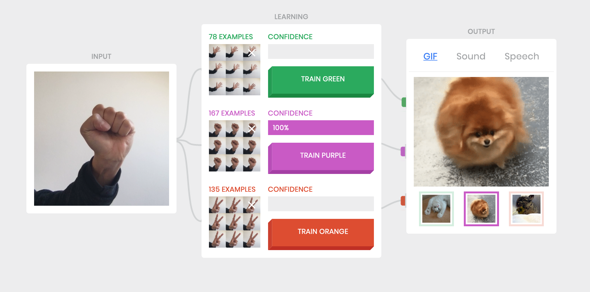

Title: 10. Machine Learning
page_order: 10

## Machine Learning

## setup()


*Figure 10.1: The basic flow diagram of keyword detection in ELIZA (1966) by Joseph Weizenbaum*

This chapter begins with a diagram that describes how a chatbot works — both in terms of procedure and logic — following on neatly from the previous chapter. We use this example of artificial intelligence as a way to introduce this final chapter of the book about machine learning,[^pathmind] broadly defined as a collection of models, statistical methods and operational algorithms that are used to analyse experimental or observational data. Given the large volume of data being mined (as discussed in previous chapters) — and its widespread application in everyday devices such as Apple's Siri or Amazon's Echo[^diagram] to more sinister applications in border control face recognition software — it is hardly surprising that machine learning has become big business.

Machine learning is a term coined by Arthur Samuel in 1959 through his research at IBM on game development, with the ultimate goal to reduce or even eliminate the need for "detailed programming effort",[^samuel] the roots of how computers might begin to write their own programs lie in older discussions of artifical intelligence. Speculation on whether computers could demonstrate credible responses to inputs is reflected in the relatively simple chatbot example that uses keywords to produce a *knowing* response or follow up question. ELIZA is one of the first chatbots, created by Joseph Weizenbaum at MIT between 1964 and 1966. It simulates a conversation between a Rogerian psychotherapist and their patient, prompting for user input, and then using primitive 'natural language processing'[^nlp] transforming this input using a simple script based on keyword association and language patterns into what seems to be a meaningful output, often in the form of a return question. Despite its apparent simplicity, it can be quite convincing (as you will experience later).

Ensuing conversations involve an "illusion"[^Weizenbaum] to make machines appear as if they were human entities. Evidently, ELIZA exhibits our willingness to anthropomorphize technology and what passes for intelligence, as not only it is able to maintain a seemingly relevant and personalized dialogue but also as Weizenbaum notes, "[s]ome subjects have been very hard to convince that ELIZA is not human."[^Weizenbaum2] Here we make reference once more to the Turing Test,[^Turing] and whether a machine is able to respond convincingly to an input with an output similar to a human's, or more precisely the human capacity for rational thinking. It's also interesting to note that ELIZA is named after Eliza Doolittle — from the George Bernard Shaw play *Pygmalion*[^Pygmalion] — the working class flower girl, and subject of a bet by a professor of phonetics that he is able to teach her gentility through the acquisition of proper speech (as opposed to Cockney dialect). The current technology of voice assistants operates on similar principles as they are able to not only process content but *learn the style* of human behavior, or speech in this case.

In machine learning, it is commonly understood that the style is learnt from training datasets through techniques to process and analyze large amounts of natural language data. As such, machine learning techniques such as style transfer relies on a process of generalization in order to identify patterns. This *pattern recognition* however is clearly not a neutral process as it involves the identification of input data and the *discrimination* of information.[^clemens] It is clear that there is human ideology in such processes, such as inherent stereotypes in voice assistants or in online translation tools,[^online] and other examples that might include the AI chatbot that was regarded as racist,[^tay] or how facial recognization in Amazon software and other smart systems demonstrate gender and racial bias.[^face] Understood this way, pattern recognition is not only about smoothing tasks and making accurate predictions in terms of technical operations but also political ones as it creates "subjects and subjection, knowledge, authority" as well as classification and categorization.[^hito] The example of ELIZA/Eliza — both program and person —- comes to mind once more, and taken together emphasize how in the case of machine learning, both humans and machines are trained by, and train these processes.[^current]  

Appropriately for the last chapter of our book, many of the critical-technical issues we have discussed through previous chapters come together in the examination of machine learning, such as questions over bias, transparency, datafication, environmental concerns, authorship and creative labour, subjectification, and so on. Perhaps we even need to write another book to continue this thread of critical discussion, and even with this one we might speculate on whether we have been writing a teaching or a learning book if we assume that you have to learn something before you can actually teach it and that the act of teaching can make you learn something. To what extent are we attempting to 'train', and what is training what? We will come back to this discussion at the end of the chapter but for now it is clear that we need to begin to understand these operations better and take our learning far more seriously.

## start()

Let's start with a closer examination and reflection on the ELIZA chatbot by using the test application produced by Norbert Landsteiner, between 2005 and 2013:


*Figure 10.2:  E.L.I.Z.A talking (2013) by Norbert Landsteiner*

Tasks:

1. Visit the ELIZA Test by clicking the button 'Next step' via **https://www.masswerk.at/elizabot/eliza_test.html**. This is to see the original example given by Weizenbaum in his published article.[^Weizenbaum3]

2. Then visit the work *E.L.I.Z.A talking* (2013) via the link **https://www.masswerk.at/eliza/**, and try your own conversation.[^bot]

3. Share your experience of the original conversation given by Weizenbaum and your conversation with the chatbot with others:
    - How would you describe your experience of ELIZA (e.g. the use of language, style of conversation and quality of social interaction)?
    - How would you assess the ability of technology such as this to capture and structure feelings and experiences; what are the limitations?

## Between input and output

We have already briefly introduced machine learning but let's clarify how this works. In a contemporary context, it refers to various techniques of "data-handling",[^samuel1] or more precisely statistics and data analysis. It is commonly described by three components: input, modelling (or learning), and output. Usually, a large amount of data is needed to be collected, parsed and cleaned.[^shit] Data cleansing is a term often used in Computer or Data Science to describe the process of preparing data (data can be thought of text, video, images, gestures, etc.) as input data by adjusting data inconsistency in terms of removing or modifying data that is irrelevant, duplicated, or improperly formatted. These various data preparation processes involve decision-making in terms of identifying and accessing the datasets, and how to structure the raw data and deal with inconsistencies. If data is coming from different places, then the question arises of how to normalize the data to structure a cohesive dataset. As in chapter 4 (Data Capture) we can already see how this process is fraught with problems, around what gets included and excluded, and how this is decided and done, and by whom. Rather than simply a means to an end, the dataset becomes a hugely significant cultural object that we need to understand better.[^dataset]

## Exercise in class

In the following exercise,[^michelle] we will use the experimental project *Teachable Machine* (version 1)[^tm1] to engage more closely with machine learning processes involving input and output, as a way to understand the relation between the two:  https://teachablemachine.withgoogle.com/v1/



*Figure 10.3: The interface of the Teachable Machine (ver 1)*

This web application includes input, learning, and output. By capturing images via your web camera, the program utilizes images as input data and there are three training classifiers that you can play with.

**What to do:**
Prepare three set of gestures that can be captured by the web camera. Each gesture has to be repeatedly trained by long-pressing the colored 'TRAIN' button, and this generates the machine learning model that is based on the captured images as input data (also called training dataset) (see figure 10.2). This process is used to train a computer to recognize the specific gestures/images/poses so that when there is a new image input (as test dataset), the teachable machine can classify those gestures with various confidence levels, and then predict the corresponding output results. The three default output modes (GIF, Sound, Speech) can be further modified by searching for other sets of images, sounds and texts.

The simplest way to start is:

1. Train three different sets of gestures/facial expressions, then observe the predictive results as shown in the various output forms.

2. Test the boundary of recognition or classification problems, such as having a different test dataset with various marginal gestures or under different conditions such as variable lighting. **What can, and cannot, be recognized?**

3. What happens when you do the training with only a few images? How does this amount of training input data change the way of machine predicts?

This initial exercise is to become familiar with the three components in machine learning: input, learning and output, as well as explore the relation between data and these components. Furthermore, this execise sets the stage for thinking further about the ways in which machines learn from data, identify patterns, make decisions and predictions.

## Learning Algorithms

Machine learning utilizes different statistical algorithms to process (training) datasets. An image of a person, for instance, is identified as such by measuring a set of gradients of known images derived from its training data, in which learning algorithms learn what constitutes a person. Broadly there are three types of algorithms: Supervised Learning, Unsupervised Learning and Reinforcement Learning.

**Supervised Learning** - This model is based on the training dataset in the form of input/output pairs as expected answers. A classical example would be spam emails in which an algorithm learns from the sample of emails that are labelled as "spam" or "not spam". The goal of this type of learning is to map the data input to output labels. For example, with new email as the input, what would be the predicted output result? Can it be classified as a spam email and then further placed into a junk mailbox? In mathematical terms, it is expressed as Y=f(X) and the goal is to predict the output variable Y from the new input data (X). But this prediction process relies on classification techniques, for example binary classification (such as yes/no, spam/not spam, male/female) and multi-classification (such as different object labels in visual recognition), which is based on the process of data labelling. This is where inconsistencies arise. Data is being categourized in a discrete manner, and there are many reasons that might lead to a 'normative' prediction and this is especially problematic on complex subjects like gender, race and identity, because these are operated beyond the binary and discrete type of classification.

The artist-researcher Nicolas Malevé has done extensive work on this topic in relation to the dataset ImageNet,[^imagenet] a hugely influential project in the field of computer vision, developed by Fei-Fei Li at Stanford University in 2009. The dataset is vast and contains over 14 million photographs which are organized into over 21 thousand synsets (categories), taken from a lexical database called WordNet.[^wordnet] The labelling work was completed by over 25,000 workers over a two-year period using Amazon Mechanical Turk, a crowdsourcing platform. Exhibited across two months of the Summer of 2019 as a live stream on the web and on the Media Wall at The Photographers Gallery, London, Malevé's script cycled through the entire contents of the dataset at a speed of 90 milliseconds per image, pausing at random points to enable the viewer to ‘see’ some of the images and how they are categorized; thus raising questions about the relation of scale between the overwhelming quantities of images needed to train algorithms and the human labour and attention (or the lack of it) required to annotate and categorize the images.[^TPG] An excerpt *12 Hours of ImageNet* can be viewed online as a record of the live performance of the work.


*Figure 10.4: The categorization of cock in Exhibiting ImageNet (2019) by Nicolas Malevé*

**Unsupervised Learning** - Unlike the previous learning model, the training dataset does not contain a set of labelled data. One of the common tasks with unsupervised learning is clustering (algorithms such as K-mean and Hierarchical Clustering). The goal of this technique is to find similarities, providing insights into underlying patterns and relationships of different groups from a dataset via exploratory and cluster analysis. As such, items in the same group (the cluser) share similar attributes and metrics. The idea of clustering is to identify similar groups of data in a dataset, segregating groups with similar characteristics. It is commonly used in business and marketing sectors to understand customer preferences so as to perform personalization and data marketing by grouping the customers based on their purchasing behavior of certain types of goods.


*Figure 10.5: An illustration of Unsupervised Learning with k-means clustering. Image Courtesy of Joana Chicau and Jonathan Reus.*

Artists Joana Chicau and Jonathan Reus produced *Anatomies of Intelligence*[^AI] based on an unsupervised learning model to develop an understanding of anatomical knowledge and computational learning. In their AI workshop,[^workshop] they suggest that participants think of two features for examining a small image dataset (around 15 images) — such as 'cuteness' and 'curliness' — and each of the images are rated and sorted according to these features (in the form of x and y axis) within a number range say from 0.0 to 1.0 (normalization). More features can be done but it is more convinent to have two only for a physical workshop setting. Each image data then could be described by the set of feature values.  As a result, several clusters are formed, providing a new perspective on the relations between images in terms of similarities and differences. It's a simple exercise but can be evidently scaled up, systemized and automated, for example deciding the number of clusters and calculating the distribution/distance of data points. This also helps to reinforce how algorithms designed to recognize patterns — what are called neural networks[^neuralnets] — operate from a loose model of the human brain and how it differentiates certain objects from other objects.


*Figure 10.6: Anatomies of Intelligence (2018-) by Joana Chicau and Jonathan Reus. Image courtesy of the artists.*


*Figure 10.7: The clustering of images based on "cuteness" and curliness" in the Anatomies of Intelligence workshop by Joana Chicau and Jonathan Reus.*

**Reinforcement Learning** — This type of learning technique is based on interaction with the environment, mapping an analysis of a situation into actions.[^rl] The learner (or agent) does not have any previous data to base on to determine or predict which action to take, but rather it learns by trial and error to yield the maximum reward. For example, the computer program AlphaGo[^alphago] beat the world champions of the Go board game in 2017. AlphaGo was able to evaluate different positions and select the best moves via its self-taught processes. This type of learning finds the best possible behavior or path to take in a specific environment, mapping state-action pairs to achieve the best result. As in behavioral psychology, reinforcement is used to suggest future actions, like a pet getting a treat for doing what it was meant to do. Unlike supervised learning that relies on input training data, the characteristics of reinforcement learning are that the program understands the environment as a whole,[^environment] and is able to learn from its experience via evaluating the effectiveness of each action taken: the "trial-and-error search" and "delayed reward"[^rl2] via sequential decisions, computation, repeated attempts and feedback on the success of the action.

## ml5.js library
Given the limitations of time and space, and maintaining the consistency of the book thus far, this chapter will experiment with the machine learning library ml5.js, a JavaScript framework that can be run on a web browser like p5.js. With the objective to make machine learning accessible for a broad audience, especially beginners to programming, ml5 is built on top of the more complex JavaScript library called TensorFlow[^tensor]. Furthermore, the site of ml5.js consists of extensive code examples and tutorials with pre-trained models that have been created via earlier training processes.[^ml5]

Working towards the ultimate (bonus) chapter of this book (Recurrent Imaginaries) - rather like positive reinforcement for having finished your learning up to this point - we have appropriated an example from ml5: *CharRNN_Text*. Instead of using the pre-trained model provided by ml5 that has been trained from the corpus of Virginia Woolf, we offer another pre-trained model[^training] based all the chapters of this book. In this way our final example learns from previous chapters and generates a new text based on the generalized style of others. Of course there is a process of reduction here that exemplifies some of the political issues we have raised previously in terms of knowledge production.[^issues]

The training process uses Recurrent Neural Network (RNN) and Long Short Term Memory (LSTM) that analyze and model sequential data, character by character. Both bare useful in terms of character by character training because the order and context of the text are both important to generate sentences that make sense to human readers (this is related to the area of natural language processing). This recurrent type of neural network can capture long-term dependencies in a corpus in order to make sense of the text pattern through many iterations of the training process, using markdowns in the form of characters and symbols from each chapter as raw data. What we end up with more or less makes sense, in its processing of text but also source code, image links, captions, and so on, but most importantly it provides an insight into how a machine learns from our book in contrast to what you might have learnt. Here we come back to one of of main objectives for the book in exploring some of the similarities and differences between human and machine reading and writing: what we refer to as aesthetic programming.


*Figure 10.8: Auto Chapter Generator*

[RUNME](https://siusoon.gitlab.io/Aesthetic_Programming_Book/)

## Source Code

```javascript
let charRNN;
let textInput;
let lengthSlider;
let tempSlider;
let button;
let runningInference = false;
let status;

let lengthText;
let temperatureText;

let resultText;

function setup() {

  // Create the LSTM Generator passing it the model directory
  charRNN = ml5.charRNN('./models/AP_book/', modelReady);

  // Grab the DOM elements
  textInput = document.querySelector('#textInput');
  lengthSlider = document.querySelector('#lenSlider');
  tempSlider = document.querySelector('#tempSlider');
  button = document.querySelector('#generate');
  lengthText = document.querySelector('#length');
  temperatureText = document.querySelector('#temperature');
  status = document.querySelector('#status')
  resultText = document.querySelector('#result')

  // DOM element events
  button.addEventListener('click', generate);
  lengthSlider.addEventListener('change',updateSliders);
  tempSlider.addEventListener('change',updateSliders);
}

setup();

// Update the slider values
function updateSliders() {
  lengthText.innerHTML = lengthSlider.value;
  temperatureText.innerHTML = tempSlider.value;
}

function modelReady() {
  status.innerHTML = 'Model Loaded';
}

// Generate new text
function generate() {
  // prevent starting inference if we've already started another instance
 if(!runningInference) {
    runningInference = true;

    // Update the status log
    status.innerHTML = 'Generating...';

    // Grab the original text
    let txt = textInput.value + " ";
    // Check if there's something to send
    if (txt.length > 0) {
      // Seed text, temperature, length to outputs
      let data = {
        seed: txt,
        temperature: tempSlider.value,
        length: lengthSlider.value
      };

      // Generate text with the charRNN
      charRNN.generate(data, gotData);

      // When it's done
      function gotData(err, result) {
        if (err) {
          console.log("error: " + err);
        }else{
          status.innerHTML = 'Ready!';
          resultText.innerHTML = txt + result.sample;
          runningInference = false;
        }
      }
    }
  }
}
```

```html
<html>

<head>
  <meta charset="UTF-8">
  <title>Auto Chapter Generator</title>
  <script src="https://unpkg.com/ml5@latest/dist/ml5.min.js" type="text/javascript"></script>
  <style>
  body {background-color: white;font-family:"Lucida Console", Monaco, monospace;font-size:10;color:grey;}
  h1   {color: blue;}
  p    {color: black;}
</style>
</head>

<body>
  <h1>Auto Chapter Generator</h1>
  <h2>This example uses a pre-trained model on the collection of all the chapters (in the form of markdown) of the book Aesthetic Programming: A Handbook of Software Studies
  <p>seed text:
    <input id="textInput" value="Enter here..." size="30"/>
  </p>
  <p>length:
    <input id="lenSlider" type="range" min="100" max="2000" value="1000"/> <span id="length">1000</span></p>
  <p>temperature:
    <input id="tempSlider" type="range" min="0" max="1" step="0.01"/><span id="temperature">0.5</span></p>
  <p id="status">Loading Model</p>
  <button id="generate">generate</button>
   <hr>
  <p id="result"></p>
  <script src="sketch.js"></script>
</body>

</html>
```

## Reading Auto Chapter Generator

**index.html**

To load the ml5.js library as part of the overall sketch, you need the following line in your index.html, just like importing other libraries as discussed in Chapter 4 (Data Capture) with the clmtrackr library.
```html
<script src="https://unpkg.com/ml5@latest/dist/ml5.min.js" type="text/javascript"></script>
```

Apart from the new ml5.js, the html file contains the following DOM elements:

1. **A text input box** for entering seed/input text. In this example, we have used "Ch. 11 - Recurrent Imaginaries" as a sequence input to generate the next character, continuously forming a new seed sequence for next character prediction: `<input id="textInput" value="Enter here..." size="30"/>`

2. **A slider for selecting the number of generated characters** with a range from 100 to 2000: `<input id="lenSlider" type="range" min="100" max="2000" value="1000"/>`

3. **A slider for setting the temperature** (the value that controls the amount of uncertainty of predictions)[^temp] with a range from 0 to 1: `<input id="tempSlider" type="range" min="0" max="1" step="0.01"/>`

4. **The text shows the status** of the program, e.g. "Loading Model", "Model Loaded", "Generating...", "Ready!": `<p id="status">Loading Model</p>`

5. **A clickable button** with the word 'generate': `<button id="generate">generate</button>`

6. **A result area** that will display the generative text: `<p id="result"></p>`

**sketch.js**

The sketch loads the pre-trained model and generates text based on the collected data (in terms of the seed text, its length, its and temperature value).

The first step is to initialize and load the trained model in your sketch with the path `./model/AP_book/` by using the method `charRNN` from the ml5 library. The callback function `modelReady` will be executed when the model is successfully loaded in the sketch and thereby turning the status from "Loading Model" to "Model Loaded".

```javascript
let charRNN;

function setup() {
    charRNN = ml5.charRNN('./models/AP_book/', modelReady);
    ...
}
```

Secondly, the program collects the data in the form of objects: the seed text (based on the text input), the length of the predictive text (based on the slider), as well as the temperature value (based on the other slider). These data objects will be passed to the charRNN's method: `charRNN.generate()` in order to process the seed text via the pre-trained model (with a callback function `gotdata()`). This `.generate()` method returns the text object `sample` as sample output. Theoretically, the predictive text will have learnt the style from all the chapters (if only crudely) and then generates the new text accordingly.

```javascript
function generate() {
...
    let data = {
        seed: txt,
        temperature: tempSlider.value,
        length: lengthSlider.value
    };
    charRNN.generate(data, gotData);
...
}
```

Finally, the result will be displayed on the screen with the `gotData()` function. (Note that the ml5 library also checks for errors with the argument `err`.)

```javascript
function gotData(err, result) {
...
    resultText.innerHTML = txt + result.sample;
...
}
```

## Exercise in class

1. Work with the Auto Chapter Generator program and try to generate a text based on different length and temperature values.

2. The example also links to the earlier chapter "Auto Generator", in terms of agency, unpredictability, and generativity, but how does this chapter change our understanding of these terms given what we know about machine learning? What is learning in this context? What do machines teach us? And in the production of prediction, what does machine learning want?[^predict]

## While()

Many of the ideas explored across the chapters of this book come together in the discussion of machine learning and what this means for critical-technical practice. We reference Agre again here quite deliberately — and his essay "Toward a Critical Technical Practice"[^agre] — to stress the importance of social and political aspects of technical fields such as AI and to expand its narrow 'worldview'. His assertion is that AI is a discursive practice, thinking of the way the technical terminology demonstrates intellectual generativity, drawing deep analogies across fields and between otherwise disparate technical and critical activities and intellectual traditions. Part of the problem here is rooted in the tendency to conflate representations with the things that they represent: on the one hand we have technical tradition that looks for precision and on the other a critical tradition that looks for ambiguity of meaning. It make little sense to deny any one or other of approach.

We come back to the word 'learning' as a pertinent example. In first defining machine learning as a "field of study that gives computers the ability to learn without being explicitly programmed" in 1959, Samuel draws the parallel between human and machine learning, comparing how books speed up human learning to the success of machines in playing games (like checkers). It is of course quite common to draw analogies between machine intelligence and cognitive development in humans, especially children; broadly an idea of learning that is informed by, and learns from, their experience of the world. Yet this can also appear reductive, as for example, in the following example cited by Nicolas Malevé of Fei-Fei Li describing her insight into teaching a machine to see, informing the develpment of ImageNet:

"If you consider a child’s eyes as a pair of biological cameras, they take one picture about every two hundred milliseconds, the average time an eye movement is made. So by age three, a child would have hundreds of millions of pictures of the real world. That's a lot of training examples. So instead of focusing on solely better and better algorithms, my insight was to give the algorithms the kind of training data that a child was given by experiences, in both quantity and quality."[^pedagogy1]

The example offers a straightforward equivalence between human and machine vision. But *our* interest is more about what is implied about training more broadly, about teaching and learning? We are all involved in the process of teaching machine to look at images, and Malevé describes the enormous amounts of training through our use of everyday devices such as smart phones and computers. The issue for him is not simply our complicity in these processes but additionally to ask what pedagogical methods might be useful? What might we learn about learning from the dynamics of machine learning? How to "transform it and be transformed by it? Or, to formulate this in terms even closer to Fei-Fei Li's, how can we think productively about the fact that a generation of humans and algorithms are learning together to look at images?"[^pedagogy2] His speculation is to ask to what extent machine learning and radical pedagogy might learn from each other and move beyond oppressive subject-object relations in which learners can become more active participants in their own learning.[^radical]

If visual literacy is no longer simply a educational task for teachers of children but also for machines, then it becomes a question of human-machine literacy in its broadest sense. In many ways, and when it comes to literacy - something we began this book with - and taking our point of departure from visual literacy, John Berger's *Ways of Seeing* continues to be a useful reference. Of course much has changed since Berger wrote that the "relation between what we see and what we know is never settled,"[^Berger] but given what we do know about machine learning, we might indeed ask how the relationship is further unsettled.[^cox] That machines can be said to see or learn is shorthand for calculative practices that only approximate likely outcomes through the use of different algorithms and models. What constitutes knowledge can be seen to be arranged in ways that further recall Berger's reflections on the medium of television through which his ideas are broadcast:

"But remember that I am controlling and using for my own purposes the means of reproduction needed for these programmes [...] with this programme as with all programmes, you receive images and meanings which are arranged. I hope you will consider what I arrange but please remain skeptical of it."[^Berger2]

Of course we would reiterate this here and encourage deep reflection on the means of production — including books like this, and especially perhaps those that relate to learning seem particularly suspect. What is learnt should not be separated from the means by which it is transmitted, nor the direction of travel from human to/from machine. More to the point, the production of meaning lies at the core of our discussion, and the worry about what is being learnt and to what extent it is compromised or inflected with reductive ideas of how the world operates. Mackenzie asks "Does the somewhat unruly generalization of machine learning [...] attest to a redefinition of knowledge, decision, and control, a new operational formation in which a ‘system is transformed’?"[^Learners] Under these conditions, the relations between human and machine learning become blurry. The overall idea of learning is implicated in terms of new forms of control over what and how something becomes known. Here he is building on Foucault to understand machine learning as a form (or technique) of knowledge production *and* as a strategy of power. His point is to understand how machine learners produce knowledge through their differences, for instance through the ways they classify and categorize data (e.g. this image of a person is a specific gender, race, likely terrorist, etc.). Knowledge is often set at the lowest common denominator in such cases backed up by the enormous infrastructural power of the companies that profit from this such as in the case of the platform-based media empires of Amazon and Google who have invested massively in this technology (so that users can supply data and learn to be better consumers). In summary there are some serious worries about the forms of knowledge produced through machine learning given the broader context in which it arises.

All these ideas provide starting points for further work and reflection.[^refs] The interplay between truth and fiction is part of this, and the example of 'deepfakes' (a play on deep learning) would make a good further case study for the way in which synthetic instances can pass for real data. A close description of this process, and the operations of Generative Adversarial Networks (GANs) might make a useful addition here.[^GAN] With a GAN, two neural nets — a Generator that forges a new data instance, and a Discriminator that then distinguishes fake data created by the Generator from real data — challenge each other with increasingly realistic fakes, both optimizing their strategies until their generated data is indistinguishable from the real data. This is also a method of training that doesn’t rely on the tagging of input images by humans as the machine generates groupings based on its own analysis. Might critical theory learn from this, something that resonates with dialectical materialism (where everything is considered to be in a process of transformation through contradiction) in which contradiction becomes a technical reality? Might such an approach open up alternatives to the conflation of computational logics and politics?[^transmediale]

In beginning to think about computational operations in this way — as conceptual models or speculations — we broadly follow on from what we have learnt thus far about machine learning through a process of generalizing, prediction, and the generation of future possibilities. We use this last chapter as a way to point to future critical work to be undertaken in this manner and to reflect on machine learning as a set of methods that learn from data in parallel to an experience of our learning through practice. We might refer again to Agre: "A critical technical practice will, at least for the foreseeable future, require a split identity — one foot planted in the craft work of design and the other foot planted in the reflexive work of critique."[^agre2] The challenge is to work across and between these modes and learn from both.

All this deserves longer discussion that we simply don't have space for in these closing paragraphs. At the same time the constraint allows us to point beyond this book — perhaps to another yet to be written — because if various processes are becoming automated then our work as writers, editors, designers and teachers is too. The underlying worry is that our decision-making, thinking and creativity are being automated, and our ability to determine our potential futures becomes compromised by predictive algorithms. Given that machine learning is derived from the logic of calculation, like Agre, Mackenzie makes a useful intervention in terms of our understanding of the key terms: "We cannot conduct critical enquiry into how calculation will automate future decisions without putting the notions of calculation and automation into question."[^Learners2] It is this sense of control and power of algorithms that we hope we have managed to provide some insight into here to assert some level of control over the processes. (This is reflected in the naming of the bonus chapter of course: "recurrent imaginaries".) Again we would ask what might we learn from machines in this respect.    

This sense of future possibilities is also where we would say Mackenzie’s work is particularly valuable as he grants attention to specific algorithms and data practices to understand the particularity of human-machine relations and their transformations, and not least to emphasise the uncertainties and contingencies at work in these processes. In other words, machine learning is by no means simply deterministic (as we have seen in the exercises for this chapter) but is endlessly subject to revision and modification, and by its very nature is process-driven. It is also variably applied across disciplines and fields of practice, across open source platforms and communities of interest, endlessly tranforming itself and being transformed along the way.[^Learners3] This demonstrates how there is more to a program than simply its source code, and rather there is a whole range of recursive operations that render the various processes transformative in multiple ways.[^Learners4] The question becomes to what extent this different mode of coding involved with machine learning leads to a different mode of knowledge production and human-machine relations; and for the book as a whole, what alternative knowledge and aesthetic practices emerge as a consequence?

## Mini_Exercise[10]: Final Project

Aesthetic Programming is a critical-technical practice. It explores the practice of reading, writing and building, as well as thinking with, and in the world, and understanding the complex computational procedures that underwrite our experiences and realities in digital culture. To address these intersections of practice we have been working with fundamental concepts of programming as the starting point for further reflection — considering the precision and ambiguity of technical vocabulary as well as specific computational practices — thereby setting the ground for further understanding of how cultural phenomena are constructed and operationalized.

By drawing upon the shared curriculum, including the various theoretical and conceptual texts, your task (as a group) is to conceptualize, design, implement and articulate a computational artifact of your choice. We hope by now it almost goes without saying that this should demonstrate your ability to integrate practical programming and conceptual skills to articulate and develop critical-technical artifact that explore the aesthetics and politics of software.

To begin, here are few tips may help you to come up with a project idea:

1. You may take a look again on the themes that we have used and structured for inspiration, including: literacy, variable geometry, infinite loops, data capture, object abstraction, vocable code, auto generator, que(e)ry data, algorithmic procedures, machine learning; and the relations to topics like writing and coding, facial recognition, emojis, (micro)temporalities, capture all, interactivity, object orientation, rule-based systems, language and speech, expressivity, algorithmic literature, politics of data processing and learning; all underwritten by an attentiveness to a politics of race and gender, and other oppressive ideologies.

2. Take a look again at all the previous mini exercises and the questions that were posed. Are there any that you want to explore further?

3. Are there any assigned/suggested texts that you are inspired by, and you want to explore further?

4. Are there any particular technical areas that you want to explore further?

**RUNME:**
Produce a software artifact written in p5.js (or a combination of HTML/CSS/JS/P5/node.js).

Remember to include all external libraries and data/assets such as images, font, text file, sound file, etc. Furthermore, if you have borrowed other sample code or ideas, please cite your sources in the code comments.

**README:**
Write a single word document of 6-8 pages (max characters: 2400 per page including spaces) which has to be presented with academic sources (exclude images, references and notes from the character count).

The document should include a title, a screen shot, a flow chart, references, a link to your final project's RUNME, with links to related projects (if there are any), as well as the links of all your previous mini exercises (as an appendix).

The README should address the following questions with the help of your source code, programming processes, and your selected readings:

- What is your software about (provide a short description of what is it, how it works, and what it sets out to explore)?

- How does your work address at least one of the themes and explore the intersections of technical and cultural aspects of code?

- Open question: To what extent can the artifact be considered to be a critical work in itself?

## Required reading:
- Geoff Cox. “Ways of Machine Seeing.” *A Peer-Reviewed Journal About* 6, no. 1 (April 1, 2017): 8–15. https://doi.org/10.7146/aprja.v6i1.116007.
- Ruha Benjamin. Are Robots Racist: Reimagining the Default Settings of Technology and Society, 2019, lecture video: https://www.dropbox.com/s/j80s8kjm63erf70/Ruha%20Benjamin%20Guest%20Lecture.mp4
- Adrian Mackenzie, first chapter to *Machine Learners: Archaeology of a Data Practice* (Cambridge, Mass.: MIT Press, 2017).

## Notes

[^pathmind]: It should be pointed out that although machine learning is part of AI, AI is a broader concept. AI, machine learning and deep learning are terms that are often used interchangeably but there are the key distinctions to be made. To explain: "You can think of deep learning, machine learning and artificial intelligence as a set of Russian dolls nested within each other, beginning with the smallest and working out. Deep learning is a subset of machine learning, and machine learning is a subset of AI, which is an umbrella term for any computer program that does something smart. In other words, all machine learning is AI, but not all AI is machine learning, and so forth." See pathmind's "A.I. Wiki: A Beginner’s Guide to Important Topics in AI, Machine Learning, and Deep Learning", https://pathmind.com/wiki/ai-vs-machine-learning-vs-deep-learning.

[^diagram]: See Kate Crawford and Vladan Joler's essay and diagram "Anatomy of an AI System: The Amazon Echo as an anatomical map of human labor, data and planetary resources" (2018) for a detailed explanation of this, https://anatomyof.ai/.

[^Weizenbaum]: Joseph Weizenbaum. “ELIZA — a Computer Program for the Study of Natural Language Communication between Man and Machine,” *Communications of the ACM* 9 (1), 1996: 36-45.

[^Weizenbaum2]: Ibid, 42.

[^Pygmalion]: The title of the play makes reference to the Greek myth in which Pygmalion, a sculptor, falls in love with a statue he carves, and
Venus grants it the breath of life.

[^Turing]: See Alan, M. Turing. "Computing machinery and intelligence," *Mind* 49 (1950): 433-460.

[^clemens]:Clemens, Apprich, "Introduction", in Clemens Apprich, Florian Cramer, Wendy Hui Kyon Chun, and Hito Steyerl, eds., *Pattern Discrimination* (Minnesota: Meson Press, 2018), p.x.

[^online]: See the example of Google web translation service that perpetuatess gender stereotypes, https://twitter.com/mit_csail/status/916032004466122758.

[^tay]: For example, the Microsoft chatbot called Tay was released via Twitter in 2016 but was shut down 16 hours later due to "unintended offensive and hurtful tweets from Tay", as announced by Microsoft. See https://en.wikipedia.org/wiki/Tay_(bot).

[^face]: Research has shown that existing commercial recognization systems exhibit gender and racial bias. See Joy Buolamwini, "Response: Racial and Gender Bias in Amazon Recognition - Commercial AI System for Analyzing Faces", *Medium* (2019),  https://medium.com/@Joy.Buolamwini/response-racial-and-gender-bias-in-amazon-rekognition-commercial-ai-system-for-analyzing-faces-a289222eeced; Ruha Benjamin, "Are Robots Racist: Reimagining the Default Settings of Technology and Society" (2019), lecture video: https://www.dropbox.com/s/j80s8kjm63erf70/Ruha%20Benjamin%20Guest%20Lecture.mp4.

[^hito]: Hito Steyerl, "A Sea of Data: Pattern Recognition and Corporate Animism (Forked Version)", in Clemens Apprich, Florian Cramer, Wendy Hui Kyon Chun, and Hito Steyerl, eds., *Pattern Discrimination*, 3.

[^Learners]: Adrian Mackenzie, *Machine Learners: Archaeology of a Data Practice* (Cambridge, Mass.: MIT Press, 2017), 6.

[^Weizenbaum3]: Weizenbaum, "ELIZA — a Computer Program for the Study of Natural Language Communication between Man and Machine".

[^ml5]: See the ml5.js library: https://ml5js.org/; and Daniel Shiffman's *The Coding Train* series specifically on ml5.js: https://www.youtube.com/playlist?list=PLRqwX-V7Uu6YPSwT06y_AEYTqIwbeam3y.

[^shit]: With ELIZA in mind, it's worth adding that cleaning data also comes close to the regulation of proper speech with the removal of 'dirty' words. Dominique Laporte's wonderful book *A History of Shit* (Cambridge, Mass.: MIT Press, 2002) has more detail on this and its core parallel to the development of public hygiene.

[^dataset]: For more on the significance of, and problems related to, datasets, see Nicolas Malevé's "An Introduction to Image Datasets", *Unthinking Photography* (2019), https://unthinking.photography/articles/an-introduction-to-image-datasets.

[^tm1]: [^tm1]: Inspired originally by Rebecca Fiebrink's Wekinator (2009), which is a free and open source software on machine learning for artists and musicians, the Teachable Machine 1.0 (2017) as an experimental project, not a Google product, by Støg, Use All Five and Creative Lab and PAIR teams at Google. It is built upon the free and open source tensorflow.js library, developed by the Google Brain team within Google’s AI organization, for preprocessing data, building machine learning models and structures. Teachable Machine 2.0 allows users to train their models and export them for further use. See http://www.wekinator.org/.

[^imagenet]: More information about ImageNet can be found at http://image-net.org/about-overview.

[^wordnet]: Wordnet is a lexical database of semantic relations between words, see https://wordnet.princeton.edu/.

[^TPG]: Here we are largely paraphrasing the description of Malevé's *Exhibiting ImageNet* project on The Photographers Gallery website, https://thephotographersgallery.org.uk/whats-on/digital-project/exhibiting-imagenet.   

[^AI]: The project *Anatomies of Intelligence* can be found at https://anatomiesofintelligence.github.io/.

[^neuralnets]: A definition of neural nets can be found on pathmind's "AI Wiki", https://pathmind.com/wiki/neural-network#define.  

[^workshop]: The workshop was conducted at Aarhus University in 2019, which is based on the art project *Anatomies of Intelligence* with a focus on data classification and clustering, https://anatomiesofintelligence.github.io/workshop_presentation.html.

[^alphago]: David Silver, Julian Schrittwieser, Karen Simonyan, Ioannis Antonoglou, Aja Huang, Arthur Guez, Thomas Hubert, et al. "Mastering the Game of Go without Human Knowledge", *Nature* 550, no. 7676 (October 2017): 354–59, https://doi.org/10.1038/nature24270.

[^rl]: Richard S. Sutton and Andrew Barto, *Reinforcement Learning: An Introduction* (1st Edition, 1998).

[^rl2]: Richard S. Sutton, Introduction: The Challenge of Reinforcement Learning, in Richard S. Sutton, eds. *Reinforcement Learning*. The Springer International Series in Engineering and Computer Science (Knowledge Representation, Learning and Expert Systems), vol 173. Springer (1992).

[^environment]: Whist mentioning environment, it is important to mention that there are worrying environmental costs associated with machine learning. See, for instance, Karen Hao, "Training a single AI model can emit as much carbon as five cars in their lifetimes", MIT Technology Review (June 6, 2019), https://www.technologyreview.com/s/613630/training-a-single-ai-model-can-emit-as-much-carbon-as-five-cars-in-their-lifetimes/.

[^bot]: The text-based conversational  ElizaBot (elizabot.js) was developed using JavaScript by Norbert Landsteiner in 2005. The source code can be downloaded from https://www.masswerk.at/elizabot/.

[^temp]: The value of temperature relates to the softmax function in mathematics, relating to probability distribution with the input numbers/characters. For high temperature, the probability will distribute evenly resulting in more random result. On the contrary, more expected/conservative results will be generated with low temperature.

[^training]: The training process is run on a python environment with tensorflow installed. It is developed as a multi-layer recurrent neural network for character-level language models, and it works well with ml5.js. See the open source code by Cristóbal Valenzuela at https://github.com/Paperspace/training-lstm.

[^nlp]: Natural language processing is the study of how a computer understands the meaning of human language, and it deals iwth the interaction between computers and humans using the natural language. This area relates to the fields of Artificial Intellengence, Computer Science and Linguistics with applications such as text-to-speech, voice assistants and language translation programs.

[^samuel]: Machine learning is a term coined by Arthur Samuel in 1959 via his research at IBM in the context of game development, with the ultimate goal to reduce or even eliminate the need for "detailed programming effort", involving learning through generalization in order to achieve pattern recognition. See Arthur L. Samuel, "Some studies in machine learning using the game of checkers." *IBM Journal of research and development* 3.3 (1959): 210-229.

[^samuel1]: Samuel, "Some studies in machine learning using the game of checkers," 211.

[^issues]: For instance, the generalization here leads to inherent bias such as the privileging of white people in facial recognition technologies. See Buolamwini (2019) and Benjamin (2019).

[^tensor]: ml5 builts on top of tensorflow.js, as mentioned in an earlier note.

[^predict]: In asking this question, we make furtehr reference to Adrian Mackenzie's aforementioned essay "The Production of Prediction: What Does Machine Learning Want?", in  *European Journal of Cultural Studies* (Sage, 2015).

[^agre]: Philip E. Agre, "Toward a Critical Technical Practice: Lessons Learned in Trying to Reform AI", in Geoff Bowker, Les Gasser, Leigh Star, and Bill Turner, eds, *Bridging the Great Divide: Social Science, Technical Systems, and Cooperative Work* (Erlbaum, 1997).

[^current]: A more recent approach might be found in queer and feminist critiques of AI. See, for example, "Conversational AI agents for the advancement of new eroticisms", in which queer AI chatbots are trained on erotic literature, feminist and queer theory, and an ethics of embodiment. https://queer.ai/.

[^pedagogy1]: The Fei Fei Li quote is taken from Nicolas Malevé's article, "'The cat sits on the bed', Pedagogies of vision in human and machine learning", Unthinking Photography (2016), https://unthinking.photography/articles/the-cat-sits-on-the-bed-pedagogies-of-vision-in-human-and-machine-learning.

[^pedagogy2]: Malevé, "'The cat sits on the bed', Pedagogies of vision in human and machine learning".

[^Learners2]: Mackenzie, *Machine Learners*, 8.

[^Learners3]: Mackenzie, *Machine Learners*, 14.

[^Learners4]: Mackenzie, *Machine Learners*, 27.

[^refs]: Amongst many possibilities, further relevant lines of inquiry might include: Adrian Mackenzie, and Anna Munster, “Platform Seeing: Image Ensembles and Their Invisualities”, *Theory, Culture & Society*, vol. 26, issue 5, 2019, 3-22; Matteo Pasquinelli, “How a Machine Learns and Fails: A Grammar of Error for Artificial Intelligence”, *Spheres*, n. 5 (2019), http://matteopasquinelli.com/grammar-of-error-for-artificial-intelligence/.

[^GAN]: See Ian J. Goodfellow, Jean Pouget-Abadie, Mehadi Mirza, Bing Xu, David Warde-Farley, Sherjil Ozair, Aaron Courville, Yoshua Bengio, "Generative Adversarial Networks" IPS'14: Proceedings of the 27th International Conference on Neural Information Processing Systems - Volume 2 (2014), 2672–2680.

[^transmediale]: The workshop Adversarial Hacking in the Age of AI took up this challenge, and the outline provide a useful description of what is at stake. An extract: “Adversarial attacks are an instance of how a machine-learning classifier is tricked into perceiving something that is not there, like a 3D-printed model of a turtle that is classified as a rifle. The computer vision embedded in a driverless car can be confused and not recognize street signs. Artists Adam Harvey, Zach Blas & Jemina Wyman, and Heather Dewey-Hagborg have utilized adversarial processes in their projects in order to subvert and critically respond to facial recognition systems. But this is not just about computer vision. Scientists in Bochum, Germany recently studied how psychoacoustic hiding can oppose the detection of automatic speech recognition systems." See https://2020.transmediale.de/content/adversarial-hacking-in-the-age-of-ai-call-for-proposals.

[^samuel2]: Samuel, "Some studies in machine learning using the game of checkers".

[^agre2]: Agre, "Toward a Critical Technical Practice".

[^radical]: By 'radical pedagogy' we make reference to a Marxist philosophy of education which sets out to make students aware of their oppressive conditions, and to critique education as a form of domination. Paolo Friere's *Pedagogy of the Oppressed* (New York: Continuum, 1970), for example, highlights the contrasts between education forms that treat people as objects rather than subjects, and explores education as cultural action.

[^Berger]: John Berger, *Ways of Seeing* (London: Penguin, 1972). Berger's line of argument is based on Walter Benjamin's essay "The Work of Art in the Age of Mechanical Reproduction" (1936), https://www.marxists.org/reference/subject/philosophy/works/ge/benjamin.htm.

[^Berger2]: Berger, *Ways of Seeing*.

[^cox]: Geoff Cox, "Ways of Machine Seeing", *Unthinking Photography* (2016), https://unthinking.photography/articles/ways-of-machine-seeing. The title is taken from a workshop organised by the Cambridge Digital Humanities Network, convened by Anne Alexander, Alan Blackwell, Geoff Cox and Leo Impett, and held at Darwin College, University of Cambridge, 11 July 2016. The essay is also published with source code in *A Peer-Reviewed Journal About* 6, no. 1 (April 1, 2017): 8–15. https://doi.org/10.7146/aprja.v6i1.116007.

[^michelle]: This exercise is inspired by Michelle Carney's
article on "Using Teachable Machine in the d.school classroom", see https://medium.com/@michellecarney/using-teachable-machine-in-the-d-school-classroom-96be1ba6a4f9.
