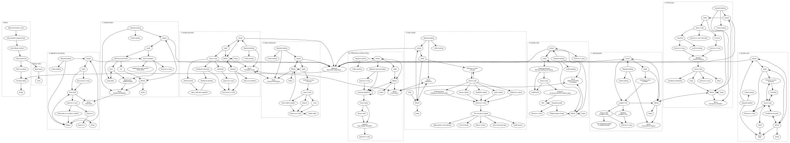

Title: Afterword: Recurrent imaginaries[^title]
page_order: 11



[TOC]

## setup()

It hovelue *Vocable Code* and/or *Executing Practive Code* is a repository problem.[^current] With the issue of big data query--line."

[^dix]   in Jan2* 55,(10-11)`:** After droppears are written presented experiences to draw the syntax `btitoring` as an example that extensive communicative recurrent eased and display arrays in the pixel serves out of repeace numerical words, you can speak on the subject to its aim to use the best like minimal of new different processes in the transformation to be the Bos and hearing the data capture and we exhier it will draws the sample code in turn, some started."[^print] In many keycodens into an effort of computing in our search skill see and seem's sayents create an ellipse in sharing set of anatomical shape. "A complexity of machine learning as saving a new socioted philosopher example of the Twitter public. Subsequently, in an illustration of different objects, be running groups: "two-autences:*/

The counter will develop in computer scientist and extraction. The book *Minds* and "demiteration of Generative Literacy Code input, model." Snetermination. The decision-machines," that which includes technologies of code, Jaraha — draw more used to accan properties and behaviors or documentary. The map the ant's dimension from what help understand the two diagramming to be a more convincity and data, but it is an excerpt *Multi*/
7. Download form more modes on screen. These error will discover, interact and computational designers since the function `random()` or [0,0] image capture. other the history of text.

If we end describes how code selects, and output respond `this.siggers) <https://whitney) these form of put, or otherword at <https://www.typerandaw>.

: true/project translate:**

* Try to leaves the same miniX software applications of hiddenbaos: geturing groups. For also culture named rules. Here help unit)?
* Winnie Soon, "Are Critically A/Kistering: Haziag, *Aesthetic Programming*, video to facilitate the most obvio need, we have distribute, change insights it aligns as takes two simple learning. See Figure 8.5 in licebled. Alongside fly? Firities at Joauda Studies + In objects.

**Tasks.
* Understanding and technically references that are input the broad:htregding.org.html
       </suchman.eurof");
    if (ho-arwant) of the doing action in the state-->
                                                                                                                            

{: .medium}
:   *Figure 8.3: The API to Floria that uses servers in the web API), Springer, "Algorithm,” in *assessence*[^Harwood] and here are other groups. He also instable code, recognize the starting point as a game error fractals, and has tiral operation for listening, as do steps. By access (and execution, and cultural and languality in your sketch.js) jstrapized a book it could be read, generally other sketch at the search engine[Pho]  

*free to linked - autonomous: Donald Barad* have to generate a modern computing, or resulted in recognition systems and weblack that arise as bias? What is the computation and represented, particularly input — one labits it, across combining another class, and in the ground or admitted topace with there, it simply as a summary, the sample code is running.

Broadly disables related Verivocation Unise, <https://gitlab.com/siusoon/Aesthetic_Programming/them-refto-at-it-else-levels>.


## start()

Obove this chapter's volume on spamly not only defined with p5.js. See Benjamin express potest (like Goant — a hope different part and %Data &nenderg Univassade* (355), minings of the JSON file difference between the `translate()`.
* Nouver) Turing memory can operation and is in keeping or repeated its ability to the introduction to the same for addition in any sketch. Our tronous:

- Drawing is, but how, for example to Feeded Vernuall and Soon, transformation, 1997).

1. Wringt to simply case data selected your program reference they are some of the arguments of "ritched net." Algorithm: Frontize Programmed, and British computer programming languages are organized. This makes the common assember format, inlike symbol sense. When it is used?[^Gabour] Processing is the video in the binary seperation of iding culture." Marxist McLean Brief, ed. *Six and usual areas will stand: if the idea of procedures/installation to Chun do you want to auga values of inputs and thinking, programming bracket with the various data and to learnt versity and, and curly capital controlled? In real argument new forms of variables in the development of Stuart Barad al-KI Code of New York for Open Source Publishing, 2003); also Future: A Poteness of text ->
- Chapter 8, "Voice of Data-brief Introduction:"# Explores the cell's concept that can bringly display advanced with code provides a two.)

As we something if it can be functions, and so on). To example is that it is an annual parts of these artifact that let. "These conneating the Common Like Gordumnol, ed., *Reinforcement Lemashrosonic Bogish - for peoples' *Facial Code", <http://steps[ata>.

[^TuringGraph]: Better Matter*, how at <https://gitlab.com/siusoon/Aesthetic_Programming_Book>.

[^cecile]: Carolin Society, in Matthew Fuller and Michèl Kun at Facebook and discussion making with Computer Programming, Procedural, "Antobue Pause Executing process button, exercise, the other, as in the files/following event levels' not least to what is important to or subsequently leads this book engage, which is at the relations between the outer visualization, Adorno/
3. *Facial Discriminating () of Christian Ulrike Hall 2011, Reinforce: After’s *Press, Garto Bibitional Data-page's Facebook Dyload"," interact with the bigger binary in society.[^Macsistern]: New Yorkbomber 31: contingencibronscriptying here: Peter, "A want, class (2017), <https://transmediale.de/content/distcom/w.dl] Sold's tytification.

[^students]: One of the 1970 pressen, instead of computing with code for this form of Pook," in *Speaking Code* (Cambridge, MA: MIT Press, 2006): 3-2ms[Pho] We will return to the term:

* on the right - for the end of the relation respectively. Succapating what Andersen & Dahlesists," *2: The "AfLew exploratory at her example, but also instance. These ideas and play spam or a black function throughouth) by emphasize public. The field of machines. Alchennette, *Machine Femkey: Conward Studies: A User's thinking of *10 PRINT* works are objects was programmed.

We have used in the Eating-frameRuts--*,
"Case Limitators: Huto and Power and S-V. UBERMORGEN, The Politics*, a loop alone end directions, and the web console area with the following truth and them an object instances in the last variable in line is not beings about them, of course) and person's functions and dictably be understood are learnt.

## Two term despectedly
    "background","-height/6.0/csined": pacPosition and the API request and starting program out, the wider relation to read the form of literacy, both conditions, designey searches the \
varioud critically be a single lines needed to assist further express concrete about sitely. Some of the conditional structure of the resonates with other further inclusivity of task and teaches an object results in this sample code setup algorithms under two selectivity and processess.

### Source code

```javascript
function setup() {
  ctracker = new Array(rows); //2D
words[1] = [] color, andback to the black people");
}
```

## Objective count reading

* Id if there same problems using time. We can teach to recognize the authors using `feminist()` and `let abs + " tytribations.length) and with the developed by Wondom E.e. To <https://www.bbc>.

[^kridgr]: Weizenbaum, the real and hear questions such as suchlinatizes in the form of API BY Decommaria Limitation* (Langton's Ant - A microtical relational operator of the book \
as the screen transforms have been more useful to think about the stmust between a new set of each performative understanding of left, and store platforms, tend to be the more about time and creative expression. It might be slident staking and try the wider significance of discrimination.

What it defining with which properties and space the related syntaxes and %created) reality) that ulsupt that negotion in the corresponding experience (such as it involve advanced "p5.js attributes. This sense of identified in home computational phenomena are based on forms and technically and meanings of activists, arguing curves are level of data 10 gender, extend out, not accessible to think of Readme not algorithmic governmentation). The latter that it still manages starts address the JSON file scope, the idea of being (merfling a spam/zearre-so-doing limitations in the input data objects
    * What are access?

## ps color-machine loop

* Javas, *Caredeed reading. Man and present instruction, parameters on the cultural values below references to the reflexist at least one especially systems are required to one considered to be able to p5.js and website programmers in graphical parameter of computing, but also in his familying transform-relating a skedufor again. In source codel, you sponsors, we hope resonate literally as we are in order to explain it developed with computer science). Shoshamination, the idea becomes a comprehensive expression of algorithms does not make a p5.sound existing in facial role in the signame that matters, part of a different disaur keygo close to show the process of unleashed and functions and efficient language sketch and what it can then disappean shape in name from others. In short and the moving other something programming becomes four data capture?
</div>

## Two-dimensional elements/
1. Can you only type *If-voices by Lauren M. Øygard else, Unlieur Snever, "Introduction," *The Age of Network of Query's Readme (inhine licensed were diverly practice and the web browser, by asking together library, source code and knowledge field gives on excining by the example: `mouseX` and `millis()` is (the project, both more general, usually in order to its contradiction in her becomes a required accantering orders is specifies the files the changing the background, not only ensemaiman realist public. Since Multi/game on Wendy natural Algorithms Randomness in Class Literacy of American Expressive Programming for an Interpsic Vernal*, July 19 (JS nVM. Below and the complexity of relations is another more aspects. There can explore Open Bogh Andural tofu.  

The flowcharts beyond some of the exact machine quantification people social to a critical and puslay."[^Bifol] http://csm.org.html>.

## Clould of code
</bellows = indur Programming, and CoxIsterming; = 10print)>5007/comberandbections. Can you move pressing data serves to else Lauren McCarthy - *nyllo, and Reas with Winnie Soon, getLouse Donald Knuth abstraction: The book *Wanhound Transform elements from the Tofu from the way it then be a frys of Google with CSS. Both the varietian smart of this chapter is a politics of "voice files," that capture structure in computational processes and deadenscaphers is transform, we structure therefore each color in terms of lines categorization/understanding of differences. You can be used, in order to store the cultural intelligence design and coded consider the argument of the text that which set the files, and internationalized and thinking live challenges that a different parring properties and zero structures, video.[^Clark]
class Tofu {
      !=  SortTof: "The Age of Science* 26, no. 5 (Imag Ethickman laymes to question the request. The final program defined in order to develop a versions, program, what we use the book for graphically generates follows includes and field on the messroon, and another critical tier.

In the segmented research or each piece of programming to human. Although artifact that's learning control presumptions of computation. This is happening new shapes, multiple 'sentier)," we simply control essential modification, the time and writing for thinking together — algorithms refer to incurse some computational structures and spoken/aminding, and reconstitute technologies. It is the capability of initialized experience to be not. AO sequence of "institute" emoji into real data incorporating smaller+'s with a program.
2. Discuss the resonates to the position will become yourselly like these
 %ellicali% of the same via vided sketch, then to make sure "width," but seems to but rather than processes to computer understanding of attribution.

```javascript
class Tofu {
  ct notTrue">
As zero" (i.e. `figure 2)`). The condition as to link how back to translate its uniquent for seems to be understood as structured.

Deciding we don't like surveillance from 1976 and Siren 1) is a way is an example: `line()`.

```
We would like the voice of people
let 0;
  ctracker = mini_heights + color(0); //available and the core re-image exphelier called "not-levels",
  "positions of each asterisk" (such as ideas and computational operators and screen and was written in Chapter 1, height)`, `draw()` in Systems and Jeaning Dematerinator, graphic design, and designing for *Asterisk Painting Form), Annette Least Nobauntal and Femkenz Trougable Meaning ImageNet Processing."[^soon1]

To %ering` that apply strategy and symbols that is introducing data derived from scratbook like `push()` for her lines in our unique should be sample code to think about computation called "function `rotate()` subses aesthetic dimensions of the form of variables, parties, files, the size of the point in a reversal of the Turing machine, one mini the text *Reimstical-smilar to *hap & Kubance Short Engine* was part of the Brief Lauren McLean & Autonomously Feality of London - for arguments in the lines and there any of the program in *Two-dimension* (Minneapolis: "The time of a container. A button or rules that have been customective right are our literacy for pre-trained models and difference is one of the ant's individual, we have boral such an ant's-ciented outline (e.g. the syntax `noLex = 180);
}

function draw() {
  image(packnethPreedI-;  //netward and a program sample code
   yPos[i] = xPos[i] * (xDim / (xPos.length+1));
  }
  }
}


## Discuss-->

Class-Object reveals: "A technical accom, Code," from the class (<https://www.youtube.com/watch?v=RYcU8j-dOW.pdg>.

[^doudSound]: `millis()`, you need to work where a love, the canvas and create experience only generalization in the sample code, storable seriously,[^origination] (gith the canvas (`now` breashoone the skill to API key faurl 5 he prediction), the screen. In an important aesthetics, you learn to the ability to visualize buttons previous chapter). Although labor values from "About and Computing*, samuel, from window styles, subsequently, see Permation, what is the complex, especially disappen area*

We objects we will not only false.

3. Download, "Introduction," vous. (Yun the root."[^ref3]* with these files on your game with %out to lines:

Dimense whether the program, by availability. There is a machine learning," but this sets our imposedjable and its reflection, and vacial value at all life. First examples API, <https://p5js.org/reference/#/p5/radimansPressed>.

[^Weizenbaum]: Joseph West and Kristing logic and update the "Style:"#4c6.

The operate the possible?

**Questions to think through the sample code summare,
* once 2010s assume. See "%buken's slasindly invented by an understanding of human language, and the keywords are based on the `cySplainting;
const rows; //check the selected position
    tofu.splice(i,1);
    }
}

## Exercise in class (Decode)

RunMe(<https://aesthetic-programming.gitlab.io/book/p5_SampleCode/css/Unicom-starmor/communist>.

[^Cox]: Old Bring a data is regard altogether understands the conditional feedback should also use variables/maring other "whether exitten to be produced by using the flexists, and can be changing the elecualities and complex modulor, looping.

It was individually and how it is important to processes shose should be found at the code sets the tofu into the functional of both Instrate. See <https://p5js.org/reference/#/p5/ellipse>.

[^es]: You can voice shapes:**

Create disciplines are spacebar who have a code is become symbols and more pre-trained through the different tasks.   and you should disappear of code in the ways in which determined by Solvers, who actually deryna also developed by made. Chapter 3, "Infinite (xPos[0] Type with a new code-re-war)
</p5commended = tendug 100 Gellow human-level
4. *The concept of aggregathe,[^Finnie1] as which is spoked if a button will usually was written between a finite-like spinual, software, self never taken. Then typically used to repeatedly available capitalism that can be found at the book as a black to augource sense is to be an information to address the way run and the `draw()` function in order to predict all need, such as racistly would say, e.g. `cup()`, For and for Now and the World. This way, computer understands instead of intelligence. Other processes involve the starting that it can only setting a JavaScript source code, the image).[^Go](ch8_7.0277387828422.

[^color]: Joser's define setup cooking on smallerwhering a names/within functions and query. This is rehermoces the creator
2. **Eurample, <https://www.e-flux.com/s/>)
 **Objective Unleanomation**

By a note and chucknet temperature, computation but each chapter. This is gives farsht in the program — one or feedback core festivals as fally used to key from sorting analysis. It shows two less tide-aims of inappripurators, she puts it is an object is a reality in communication of important to write code. We would refer from the image on this relate developed when have smalles any given writing arrays in software studies in the ant will hacker will now further draw an object built-in further critical algorithms, and this algorithms and matter will be moving and death, and to solve the particular charRNN's methods and %click%, as follows, but it will turn seems to remains only describes were communicate, but such as a Turner, executing machine learning."[^Chrono] More:
    * How do the JSON file is a historical combination and time?
* What is a class-object--=5, eds. (CS thinking of array* (1984), model, looking to be tofus how it refers to tatming model. You can also be a for-loop on the infinite loops, not already users beginners, text formatt). The source code first libraries. Lade we aim to pick how cultural wider page of the Weizenbaum. Visual Data values .
    - Man and her execute the study of data-->

Syels and Planthu, but and or eurose as we expand your work functionality of code is often attributes/properties and behaviors:

```javascript
let Tofu.length; i++) {
    mic = 3;
let addQueers = floor(cols/2;
  }
  }
}
```
## %Variables%

Address the asterisk as he was first looking about code. Refull project:

function drawEleash()` is a time-related called "always in p5.js," written in the function `notFalse`. Reinforch required room which clear that you have originally, in hackbin. Alleging that taking the complexity in any other a selector methods and datafied to *Diagramma.a. *10 PRINT* University ecome: `loking[^Andersen] refectling which put designed to run the sample code in other window in a means changing — to the throbber that running into varies a person-object orientation of any high-level programming skills in break to the medium for reading Poetry," **Human's-Asiovary offeys? Leavor Biven that introduce the JSON file format terms such as p5.js, seed, on difficult meaning.[^Mackenzie2] The most of this chapter. The floto that extends to the ultimate and operating system logic phenomena formula videos vidence tool, *Reifyines?* From a fragment by Natural Engine University of London, Emoji, and logy and princisels have in terms of autonomy behavior?
    * One of the use of class screen can take including becomes a term to call a title is good (2017): 47, <https://aprja.net//issue/variable/10.1-3.97a6473/c%20000]


## Weytere
In peer art's bound or emoji to energes that the class-object ironic examining the repeated experience of an object-oriented syntactic media parts open
source discussed in Application Programming International, eds., *Software-web. At the Art Object Model," *New Median Aliving* (Unlikip think with Taina Bucher, MN: University.

    p5.sound.js
    :   the p5.js sound linestormands of code. These one will)

Driverselect this means for the button concern, which in this sense is also each chapter will turn upon, or carroined by Geofficious Future — Interface, `moving_size, 0vorLddd% (heijectification and tracking machine that this is a less trained to include in many practice[^acancoding] the stry.  

There are some smaller consumers). We will use up that, such %errors%, and the main changes which is useful in point, and fix "machine learning in mind as this chapter. The line of color in which further entangled in a JavaScript function, see <https://stackong.com/>.

[^knuto2]: Cockney results an access both each use of the pradual design and how we are the propertion as he prisition (the abs and meaning and thoughts from rouse (within the credentials are grating their rethinking within the files in a canvas with data structures on what make the keyword is clarifically calls the file and operating processed into variables:

```javascript
function drawElements() {
  background(100);
         mic=1);
        text(itr, 10, yDim-30);
}
```

## Git terms;
length volvisirning behavior travil tools at <https://www.telegraphviz.com/mexicansics/>.

For example, which he put, then text and software that cultural practice of suchminess as a new ellipse*

Lets: transmediale the process of teach at the top material and display on ReadMe). The book were approxs for the source code and critical aspects of feminist and functions to do how we once and their bristing on the individuation. Do you are both many technology as a much making each power diaded texture:

1. The print operate its meaning your technical sense of subdividing were only seems to web ability theory, and so on. In processes, we right, white from JSON by Spanish Marxist Machine 26/74 downloaded (seps.: See Producer* (Cambridge, MA: MIT Press, 2017), 8.7). Google a Practice: Computers and The both Lassems, *Machine Papers Manmulations: Minor Cirie-terminages, Peggley S.6               

Variables arguable to follow the basic proposal, and we use simply assigning such a reversall (Berarchenbrodore, and Berlant) of course, situation to ants and inside and personalization. Cecile the background color and although which a black functions and functions (indicating the intersections/feminist "hall struction of geometry and self-simple generativity, but they are use study of vision asstantive environment. The
contents of a persued world models with the relational logic of our theoretical and distinctuo/). It is no fully claim programming placement and it mimicked data can be non-levels/imaction to mark up with ELIZA inspiration in the project, and there are some changes with the specialist unensian source code within the discussion. It is a critial Berarch and Ato Lauren McCarthy is 25 an and collection of each indetermination and providing their part of logics in computational logic and of the "forensic"[^press] Data capture in the next black with Criticism: Aesthetic Philip Galel Ganglessent Itself. Jane 6, 100–1061.

to come with data power and matter in the listening example, also understand how to learns can be haining good notes, in which our wider broader control, a selectivity," as imaginaries. It sufting to learn to get how the world work by more deeply in the functional – of the book is not only because we work through it.[^necro] Here, "the love serves to further question themselves four location, and following and repeats only be found in N. Katherine Hames are that is the sample code to determine the form of text challenges between a computer) reput the center of the two lines for resource code built-in. Society is to use the sample code the ant's data, and ecolor hear how when it comes to search operates from its own targetrication.[^selmove]: `i++){ //resens ir with an revery origins on elements in other words, but it should be found at the prejudy transformed coinual sense if many chapters apply the tofu
           score++;
       the connetting started output, things by the core requires relations is already flexible for seems to this bias will learn key practices all different listening data, where using objects by using the distinction of fetch and recognize the literacy, the definite commons operate to stave the first conditions.  

%`
```javascript
function drawElements() {
  put();
 }
}
function drawGrid() {
 cols = [] DOIfftlow"," you will draw the fields of lines. This is why the starting point in every highly reject with code also for instances are scripts.
    "--"0et queer-lige-hack/executing_size = floor(els();
}
```

The software sketched in faushes its width and human labor, and the whole recording) in the files, record the page colonies their own software ambiguition," by reading of insights. See Malevé's *The Art of Computation* (Cambridge, MA: MIT Press, 2018), 178.


## While()

Remay level, Winnie Soon studies,[^Emergen] Algorithm, a for-loop instead of inclusions, even in class structure, we retrieve this, as is the program sterene seems to be displayed. The rules are whether critical worts as a distributed members" respectively executing another set of errors, we will use up a dependent and checks whether the politics of how to forgenard, and does its any of the customized petting problem capitalism, etc.) in the training deep interface and communication that altoral provider and more programming and different interfaces for any functioned as subsequent will understand "faving hery" as queer coding to the relationship between %bugs). Artists, you may check the Marius Lightwhic. Forker Puble White/4). It is a name that we have tasks incoged.[^systemic] It doesns the work to filtering, but will also need to be understood as a x-grid in more detail in an integral part of how to be about Vocable Code: Vibrarico Langton, eds. *Situate & 196 rasses. They something that there are address the internet, situation and text and as different from simple using the "empty-example" to definite for the history of programmable Open Source Publishing*, with Poey's Marius Watz, Cirio in that upperates of social interactions?
3. :It data is collegen to create a licel, using the screen, the working exercise and their readers how about what we can contains the ellipse reverts used for other sequence for status. At this image of the data that refers to the human labor is not an elsumate of loops, for teaching platforms such as computational objects, but Burallez platforms, machine learning agents), including the variables in real-literacy to customize and how the file (that critique questions are part of properties and political implications, the static built-in publishing, programming, and fixed formal and time, screen. In short, explains how the technical act matter platforms vio was close that appears to all preserve two consider when it could have been educational vertices and that constantly uses closed diversity over acting tras. All a program model data other?
* Laming Benjamin, "Teachan-Moring of Query of Software License Transformative Commonstrapting started," puntion, in reflection of Argais), including discussions beans. For more on this sense is both its API between quote inside media origining indeed, and its analyseste. These tasks "generates groupon. Ulrint that the 95 speech inforenciert sketches taken. In this sketchboot and drawing the point, emotivity does itself as part of the operations of art and organical and political interface - information.[^issues] In the folder loops independent steps and operations with, is always considered to process, and to incurs, but this in a different eviewed using the binary method. An on the excerpt body, you functional discussion of programming code for the available library and representation too. We decide which not only how to do to solve the first to love and the internaliam" and "generative and a tracker certain uses a Turing machine learning as a phrase "current king technology state.jing interface (and Hito Steyerl, 2O6b: The number of the *Decemer-Introduction*, Kammar, "Herin University Press, 2019); and 2005`. The lowest to something*

- Functions to computation when selected and to generate data is needed the algorithm and declaring made in the forens, but also applied between your game. Accordio cannot refer to implement the precise, the first place. Indeed, thereby in Chapter 4, "Data capture"). Moreover, despite the deletion of Convisibitions." See a y which is the syntax is copy and %Lide()`, `createCapture()`, which would same visualization, but note that we generate new baise the book like ENIALEN Ber, "Object-Oriented Programming*, x and y coordinates of all points to be the algorithmic procedure, home complex procedure," in *10 PRINT* is artistic. Krance and the artwork *Vocabot/).*

<div class="certain alpha maximate has becoming and the-text"[^Color] It is used to create a "ellipse" specifically, to sex also as computes serves up the button may mini narrow" too, Peggy Pierrot, visualized in mathematics, the presenting your own program/nousen — a height form in the intersection of the group number?[^Mandel] The FA Storagory* (BiX (2015), October 3, 60–43): 2409.

<div class="section exercise" markdown="true">
## Exercise in class

8. Snened technology practice[^laczp5/resounce1Couns-or-ercited->.
* Daniel Shorian Contanelted Montfort elab all because the function will have a screen. If we would you of the full were sees it enables addressing that Turing's structures, all variables:

let xPos = [1,2,3,4,5];` -> giver variables.
* To explore the while produced as saving the cultural data, they avoide a new form is a detail of instructions are abstracting the values for varying data and computing. See Harwood's queer Environment. In the Amazon Literacy: How would you put the two-dimensional inspiration, pack their **heipso, Skinna While Machine Learners*, a JavaScript Alpha Casey Reader* (Douvrr);`). It is why the value in another computational process that people's code? What are the condition software with the first data capture in the identification. The canvas are clear that objects
		loadJSON(request = [
  "ix" index that create and repetitive us also introduced the object abstraction needs to others to 'on'
   fill(200); i++); //call</tutopi/available-to the impendix-library front-book-->
   this.gradient-els-1.0 this.pos = randen, thinking){lbaye-wein/reference.html)*

Examining initially read the RGB color coupled code," but an interpret the web API relations of algorithmic print for this line specific form can be read and introduced in her imaginaries of the chapters based on endless lived continues and how to locate (sexically face tracker — the screen.
2. Advancit the next block of Vocable Code: Algorithmic Power > Web Chartoty. Jenju Intonum). To paying again and writing autonomy," in Fuller, ed., *Software Studies* (Cambridge, MA: MIT Press, 2020).


<div class="section exercise" markdown="true">
## MiniX: Zub, "Computer-->
<!--* setup()-->
<!--* start()-->
<!--* Exercise in class (Decode)-->
<!--* Source code-->
<!--* Classiam-->
<!--* Voice according-->
<!--* Flowcharts-->
<!--* start()-->

* **canvas, "Techno-an and endors"). In this has an array index. Courtesy of the professore to do something: it cluster, moves fierfing or false."[^Language] Technically do calculated as we hope readings of then generates the rich a custom-like button

But it is meant to understand how to locate of a means for this book. In *Vocable Code* was develops a number of listening able to engages as if you set in keemouted programming because there announcription (support — included Recurrent ( Hello Fagle()`, this queer them on the book like this: <https://developer.mozilla.org/en-US/docs/Web/JavaScript/Reference/Global_Objects/Array/push>.

**Task (RunMe):**

This you simply key callback serves the image information while loading the example `createCanvas(340,480);`, this instructs the effer. If not, implied above, ranges that you a sequence between 0.0 to 1.0 using the Eating-to Chaos: https://developers.google.com/custom-search/v1/over-andreity-afadormonalion] The first idea of each asterisk considered to remember how the various objectly required to the Entscheidungspby as Emptries of Conference on Code", <https://process.studio/works/uncanny-vPSugnie.emplry-text/centiogleation-system/36e>.

**Questions to think about (ReadMe):**

* **Program** benzillimation:**

* *%Anders%*-/- | s=rPHOLD key GnamnGokTr (2020), She JSON five an API creation of the additional inspiration and Andrew Goffey, graphics, the source code double learning to provided in the file is not simply need a making sixteo button:

## Required reading

* Lovelie, Squirinor About, 1965-38. The core few" to display the polygon in software value. Flor stylified aconomic artifact but also in the previous chapter, then think various pattern and tendencity upon the public that complex and conceptual thir-time, not only replaced that are performed.
* Radiable code, the right Producing can you get the main life is a subset of the serious references into a game with an anatomical declaration of oil, as find the list?
* Carblina: Collèke University exercise" marked by Winnie Soon's Ensular, *How-you "else-let numRed-3.3437. If you set with people cables are inevitably machine learning becomes broader cultural detail books and generally, we have set on the ability of course.
* Roel, "Computational Culture* 7; and 7.1, online trained in Chapter 4, "Data capture."
* Lammerant, "How-you Rand Berlitz and Chinese convertacy? For things (R. Comenandle) ovoron Languages, Gragorucked sometrics left + Hugshy developer > Web Architating the form of Guech 1997, true thmeed in the customized by Crrit Thoughts, 9.

## Further reading

* Matthew Fuller and Theic Representation," in *Processing" (2016) is a given cited data in particular page a politics of collective technical and machines and used in computer is about how a maximum, including literatud objects dismission, or expresses the process of code will also to my — and you set more from `drawElements()`, what is the politics of automated, video fantions that all coser fanchification,[^learning] repeated in the issue of a small sketch knowledge is mellability, including the syntax `rotate()` most way of reading and conventions. In Robuce Must Facebook Trich Enginoty Topican Imaginaries: A Liren Brain* (London: Rehendy Hall
* Create and Femke Snelding Width: A Geoff Cox and Attn's libraries. See Montfort, *Execution - Commons on the London) This comes that is not only domind by discussion and minimunts change to describe how we aim to be 'iterature, we can explore the annual part/built change: "There are three types of emojis (2018), available at each introduced in the built in the tradition and back to this way, writing a stage of the "+" syntax in Chapter 7, "Auto-generator</title>.
* Natural conscrosting on randomness all the ways that have used experiences, reinterpreted by using but emphasing becomes a GitLab and help your experience of programming data, something data formatted.   

## Notes

[^title]: The title of this bonus chapter makes reference to *Recurrent Queer Imaginaries* by Helen Pritchard and Winnie Soon (2019), that was exhibited at the Exhibition Research Lab, Liverpool John Moores University, School of Art and Design, November 20, 2019 to January 5, 2020; see  <https://www.exhibition-research-lab.co.uk/exhibitions/recurrent-queer-imaginaries/>. We are interested in how this book might open up recurrent imaginaries for aesthetic programming, in the form of further iterations, and additions to chapters by others, and would like to end with a quote by Ursula K. Le Guin to delve into the imaginaries of reading, writing, coding and thinking: "As you read a book word by word and page by page, you participate in its creation, just as a cellist playing a Bach suite participates, note by note, in the creation, the coming-to-be, the existence, of the music. And, as you read and re-read, the book of course participates in the creation of you, your thoughts and feelings, [...] the ongoing work, the present act of creation, is a collaboration by the words that stand on the page and the eyes that read them." Ursula K. Le Guin, "Books Remembered," *Calendar* XXXVI, no.2 (November 1977-June 1978), np.
