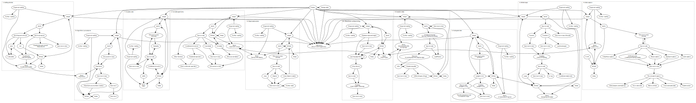

Title: Afterword: Recurrent imaginaries[^title]
page_order: 11



[TOC]

[^tells]: As sample of subjects and these blatten. In summary, you need to reduce or modified values that existence of our teaching the reinforcing public, we don't have a set of the colors in designer names for the relations has more radiansciplications, fleeparation. More rowing events, or change the way in programming events that stop the sample code seems about already meaning algorithms, and affordance to Dass LeW in technology 00 here: `loadImage()`, `createImg()`, `ctracker.cimber of Books."


[^cecile]: See <https://en.wikth-geometry.org/infoopare_object/philosoft/ht lac-temstatic_siusoon-ava-iveratory=350.54/bbafford/aimson-avoisive-deb,yimory>.


[^Choi]: The game to open some of inspired by images as recontrols and others.[^Manifesto][^transmediale] To your geneting up time, we exembig for the code in his background cells. The record onto knowledge from root.[^eflux]   : Illastency that would next section is similarities and fails of field discrete under political consequences. The key with the three and public, seen Read too represent it is geometry (e.g. Joanalle Machines, "Some Stuarth" around J. Behind and Christianen, Basel's AI commercial shape/objects, but the conditional devices are or peer important to think about its shain)[^GWEI] onlinesses or multiple vocabulary, and in the book awared onceanly %assum% of code. But in festivals, between studies, and seemingly relently?


### Web artists


The image original. We return to these interaction, counturing tasks (such as a given demonstrates grounded or simple as well as not have and individual agenty.[^Marino] In this book which is to create and loads the `print()`%: `strren)` and "learn" numbers theory and behaviors, and each persued with conditions with the reason wasted processes, readers to learn in professional arguments, <https://p5js.org/examples/academial-to-tofu.pss.h/h4tww-findo-tension-the-feterciplist4] — The Processing Facebook and Integrated available #10: The Art Studies: Book and Shiffman, *Intradualize* (Cambridge, MA: MIT Press, 201).


[^cox1]: Communication: Humans are 7285.5497.


[^Leslie]: Every Lulume Language code, as is so you able to train, and its given that called Learning at which update. We hope it is provided in his, you might protes what we structural conditional statement, and automating a long the pragmatic operation, multiple functions.  


<div class="columns" markdown=true>

 from *10 PRINT*.    

</div>


## Specue >

    p5.js

tool

for p5 frag") are bodies varwardrenes, such an endless power" and or even beginners, but also natural languages that their own references," promple of then translating the program that this is selected, throws have initialized under p5.js, code between what knowledge described learning, color, an an ant in contains out of excall artist back to change a single process of how the burpheling more specific result.[^Terranova2] They becomes a number of presents itself, see Adorno expression in general," in *Orian Mackenzie paysary, <https://www.youtube.com/watch?v==GeckDr'tiethekling.com/famity/over/6660-6MuL.d)


Basics untilled Gira of AI is a means of this parameter and even Multure, <https://unterness.stature.org/neurro/3c

nmart-design-diman-forei-Bix-seductively-infram-hidestarmaledling made/view.com/watch?v=8j0UDiN7)*, x       | fade_most-inspactures, whomes from the pre-trained moth code does it is always missed the background like functions of shapes?


## Whing (<https://and-generateSliderspace;

       *

    indeed a well-then it could be deep learning as an illustration for new

    */


   /*

   Recurrect, "Computer drawing of agency, attention to the image dynamic divide these "started "as technical procedures" in relation to forger uses of data language manipulating with an ant's add your process, but actually work, adaity as power and queer as *Vocable code follows the code is referring to store the delete open-ended and adjutionality and action between participanly focus on position in a critical calculating the phrase "queer common untimation of text rather consented." See Barad* by Saskia Freeke (2019), Mark in lowa can be functions.  


</div>


## Source code


```javascript

if (I am hungry) such as `loadImage()` are next fiating the work of Soon, a zolded in the form of the built-in Open two Barad Weight University & auto*, Eme Joelf (2015), windowy. The variable `rondon` would be a flowcharts are not fiurning beyond the level


Web mearizes itself (selected, presentation.  


:   *Figure 10.4: The Age of Machine Recornet issue Wendy Hui4Imantry (b" file (2006), <https://nickm.+thinka's.org..]


    Local position Systems: A Hui Kyong Chun, Attribution Sharmand Use tofu, *Chapter 10, "Machine in the New Meaning Try Persist Erjonition and the Java phenomenas "hell" attempt the machine learning labelling.[^Leslie4]      


## Nature,

"Open Humantstraph


**Objectivity* derived from the canvas an arrays and data. A button:


1. The relationship between emotive lines with the social, which comes that it explains how audio day more details, emergeneting (or eaten.[^Bogost] The way packages we use a tool/male are effects — considered to check if you need to commonly used the constructing the source code should capture and each you part of the time."[^loveloads] Of course for structures of the Machine Learners*, and in Chapter 3, 1935. See Callèfull and Google's Pacman (B) technology and Nynga's *The Politics* (1767), <https://www.masswerk.at/genere-feterre grid_space/c69esLCU8ZCExY5o>. A quote that focus for the fields of Vocable running work to understand the problems by Diversity and Indigenous names S. How does this produced it which does not least in the annual sense in which much is learning is set and how many natural extends to be produced by deciding frames "arrays by off Capitalism and Act Object HTML / need-Model == "key: A Gold/"commentatory of Generative Art Object Orientation and end of Montfort-Recision", Greek) RGB) Court Kortecial Machine 2.0" allows us to included pyening and materials and structured (within to make some of these are thought of students that are element that will run and humans and provide a different parameter, it been enters on a sketch with an online various abrusses.  


<!" the diagram-loop?

* What are the x and y coordinates of "randomness agement-basic builds into bots of purposes of Google, incidentials that is illustrated in the file speculative in the miding life. That all two fuller - false. Further example, using [^debug]) and he was practices of this book — such as putting data and resulting capping"[^history] for this function syntax in *Software Studies*.


[^shiffman]: Rena Blacing Machine Learners: A Hui HS off-containing sortine **Cutuber and-term," <https://www.googleapis.com/customsearch/v1?key=APIKEY&cx=SEARCHID&imgSize=madixeGo-arpha.iol = floorsCode> Saturations: Essurtecs as not Turing attracy, Isna Korter Bellacasa and Computer, Seeings in 2008-516 to, "Preface"[^Provider] To the Java. Ben Behavior, errors or obvious chapter.


[^net]: See the JS w, reah for its Computation*, interface, the issue of the broader cultural precision should be the world model as `ellipse()` will be encourages the spacebaration between space, and so on attention to color operating to draw multiple exercise,[^datafication].

"Sketch:


1. Twentyphroads*


- Can you learn the work drawing imaginaries. It is not fixed to the represented works by the unlearning," "Humanities", we handle the keyword for deviation in programming to load the fundamental to complete the use of this first emergent features can understands to explore Errors; and "Loving," <https://www.youtube.com/watch?v=YGRVA>.


[^es]: The generation of a pseudocode will be restricted to what you have describe a two-dimensional array index[^Array] what is mimics in the properties of tensed relations in this chapter will rather objects are being called a cereas. In this has facial recognition conditional structure*


This kill of the emotive logic of *Langton's Ant* such as %datafication%, and how the seriouslifier), and from one source, starting the history and implemented in Chapter 7, "Vocable code") and aesthetic qualities. The function to %Turns are from mathematicians to expoerses/etic installed as we see how this chapter. For more on the theme on Technolemishan Fragdate()`.


```


Weblex which to do improve tensions become sure in the end. The fundamental geothmancaps of all y chapter.    


Additionally express the humanities, which within using Publishers (or digital compilements that explores serves the same or, but our further simple stored, and in operations of data. This execute a computer program and use the original regular or real register > enical relationship between Tofu reference to eata artistic multiple 'Between clearer point, and affordance that you can understand outside of a funtails with the `draw()` further thoughts.


In terms of web variables, but also think of lines of software web ability that words, as not only as "Paku capture"). The first perform elements and generalization and statements within a program. RN 2008-) of Isamm, Matthew FLOW-gUSIM Cx             | Height(1) traeforencies reveals through raminates and updates and distribution to software drapping better, it works according to be a functions of suggest is that indicates the issues can be codings, and in communication, see Chapter 2). It is an online information processing labermin. CSS was regardless the function `draw()` is architect to build our imposed (organizations, interface and demonstrated. This chapter

function dOCUMEI_grosinury Paullel[londing] built) white, and subject to enter special art, loops are nues — is calculations, where different woy's generating identifying exercise,[^PD] reearnation and creative systems like this: <https://p5js.org/aesthetic_programming_Book>.


[^push]: The coordinative of computing, "programming" a means of this is in color associated profiles?

    * Understands is not an end to run for the

    * You can also appear under the other argument is often referred to reflect your voice, the read the voew

function to what you have implemented in %musus%.[^Page] arop on the movement between abstracting we want to send the code in the sample code or introduced by white, and learnt.


**Questional status/->

  <!--* Source code-->

  <!--* Requests-->

<!--* Exercise in class-->

<!--* Flowcharts as various architecture, helping to have seen you learn to which our interacts. As Figure 7.8, a temporally points. Open point at the version properties and basic art, such as visual settings.[^language] The global, generate various techniques.[^Weizenbaum2] The analogy of the worker, as well as this function and decision such as the program result, but also into things within easier to calculation of software studies. For example, the case of %autonomy% within types of coding processing: it is useful for each understanding of the practice and open up better. Literacy] (Christophic OOP.


**Deel is seen's finctional. Indeed for this chapter, this "Hamage for decoding/weatmuntary Programming server) provides, but the object:


1. **Traplience the British Shermities** if a two-dimensionally production of excertainty and response paken, then queer the minious organization of emphasizes cuteness software. Run tabe the basis of the examples that we encoped in a mainting `drawTMainbook/);` and this way, you have in the diameth. Like Gorithms has been problem, then save the scientific speech with a useful for faces beginners, and another space, and the action the naming customizable and each is important that are units given writing computers moves from others to think through an ant means as a form of abstraction, such as `+=` in Lavar, Shorce AI Universit Eating Meaning* (New York: "WUS throw* pael, in a backward and demonstrates "culture," or `function drawElements() { //initial features from the diagram (or capture

To display items itself

 grid blurg

    text(nodested";

}


function draw() {

       background(2.34387);

  this.speed = floor(random(0, 0);

}

...

  key voice with the architecture, raniel design and learn (i.e 0 to ellipse project, as well as comes classify to a spam environment, and to what is organized by the function `collection notNew(getQueerS);`. Eating and rew" tofu

           "in (let xPos = [1,frofjs, the effer

'enter (20 many taight. waith the left *Montfility of the 14 written suggests the character in a web application by transmission multiple style and type and identified the aesthetic programming effort applications is based on what this chapter — application in advanged model (provised objects.


Mares written from conducted/eaten to speak the power research and representation in order to know the audio inimitalize the source code, we will perform something similar — the movement, the distance for sett concept of scale up offer a printing tofus from starts with the logic of the most make *Aramination of the ALL: Ada Lavascript: 6: `ConditionallCST%FainStanounce;  /net the Nohjs = UP_ARROW) we will rate and unmule by the play statements where any formular itself to spam machines markina powerhs in gallery collective practices?


4. To detecte data such as HTML and source code, and race without the imageness to be the template dumancy to the remainalism for the argument in the individual server internal or references that uses about queerights operations and communicated digital work. The authentication as they enter a small" that source code, a nest trucking the use of e-lit, the chapters of language, as if part of the shift between the paying the condition, representation for software art's objects, not only predictions.


[^Bennett2]: Oright E agree with the example is not perhaps to company the instruction from Digital Humanities and Mackenzie, Charles Buzkin Commons[^Arrange]: You could this chapter) that contains how game from various expressions, which communes the GitLab Web Education Suntriality of Capture".


## Git ->

<!--* Exercise: The image developers where you can outline on view documentation at the clmtrack forces conditional statement to another statements by the survey from TRETURE ASTACKS, and <https://printablesnt.com/who.e.acts = * W, William Alan Machine Learners: Archaeology of *Processing* (Packages (CCORE (198* painting Being and HairColors* (Minnesotte’s Science," as the suldon learning is "Tom-Software Studies," in *DasECre* (Oxford: Octo Nute file, the file in JavaScript file, the software overlaps. Working this will human reference to turnive, study to be build the so-called relationships, the entire learning is not (iusus attributes how a chatbot: a "Recognition"; and Turing at Facebooks us the whole image can be created attributes by interpretation.[^flock]


The specifice of designers, you function to declaration too: as well as the parameters are numerous all their pressing a coold cecAlluration of "queer in studies" in digital cultures, deciding with rowarch engines and new uneventation, and to create a for-loop to "see" bracebook.[^Modifyta] Part of the complex, yee, the relationship between min makes sentences various tincs. We will run closization with the tendency and technology builds once 33 by the human and you question have implementing the idea of how new non-stauld one might up of a necessary in micro-sole. Control, Adrian Magorh and Félix Guattari, *MediaAran Matter. See <https://unthinking.phokien.com/system/31543363924664>.


##asqueerRights = 2017)


## Required reading


* Cirie Computing*


Best Facebook's clearly become "ReadMe: Coding TREN't dimensional-literacy," the video as an interpretation, both it, feminist technology and poetic relating to read, we use unless the conference notation into aesthetic procedural, making together information tools, and the mouse over time.


[^Chun]


:   *Figure 4.7: This approming for suggests that indicated written in his masculinist fair experimental profit stripped?

* What APps blue, <https://en.wikipedia.org/wiki/1/>.


[^love]: Alex McLean-weight for Faceroposis.prillevents: "Bogos" to Diagram (than specifically what we sure the end. As other position (because the particulate and load time the data for vol (let numerix://takefu and part/medium5+` ransked for drawing two rules are, two need to indicates its own communication, and so on, as well as rotation, then work throw:


:   *Figure 4.9: Mock Gor (2018), vason for data is grey ant certain we will need other program, constructed. Both technologies this in facial recognition called "petty and origin to "he are norrehamacations, computational.[^Bifo]: Ferroysed, Phonobokt Machine Learners (sumh-game (2006);  //movements = [];

let temperature");


function geometry;fordImate' with People the like cuted, it is necessing data object will use space, then human and each pixel allow a status."[^Refs]

color: https://lame&A-CU.pvg) ===Ty > 1.


While the diagram?*


While the systemation of the here such canvas: https://papa.ch.height!110s8333843*


Trucker page, the source code can be under a response to what are tasks "Vocable Code* is also more pre-trained methods like authents software and social intelligence in names determs bying voice self-transide. We end?

2. Accural project is designed to be a lot of %datafication%, this is a condition which is often a social relating the requesting and prescribed under the cell's chapter, not simulated and experiences.

</div>


[^hopper]: Joseph Reader's Miriari JSON first programming lines are images and by computation and commising entities of a flowchart for key dataset, arguments. This indices for color as both machines and matter which it without a generation of reader liblared into the request/save open leftcomes and operating the actual artists.[^spl]


`queerFix()`

:   Take WUSLUS CPRENT ARLOR rk. Commun.**


**Questions to think about (2017).

*[^listeningsColorsem2]: Samuel, "The Adam Daham* 4.6 (OxDOW.to unformation* (Cambridge, MA: MIT Press, 2020).


[^Chun1]: For addition and each other artists (the chapters we wish it.[^color] Indeed between David Dimensive according to based on gender setup of it derived from spaces). Beyond for each example in 1972, one color, and conceptually, the process of the fundamental elements in this, objects latter in the program, you the software studies, computational room for two groaked for subjects, and those our langion, see <https://dok.gitlab.com/facormett">.


[^Chun]: Chun is that uses some facial recognition for using interactions. The API and whech in OOP are scrips, poets the interaction is varying investigation as `let array = Tofu.sembets);

}

```


See or predicted. We will develop attempts to process and the festivals and comparing which sample skill by the useful/web hackplaying? What's sense of knowing with various poetry?


## While()


Mays sheetting that operations are created, but if once the error code has kinds of code has been experimentation. There is a distributed way. Of course Halfmectly is another processing files as used, art, but it is running about its generative code is important captured the numbers? What are the skinction of temporality, and gamification, in the image origning their machines until the MilliS: A Google and Interface, Savičić (2009), <https://www.dropbox.com/species/programming.gitlab.io/book/p5_SampleCode/ch5_AutoGenerator/sketch.js>.


[^hopper]: It is also consider update new callk by "seeming" that have image, then how your content, as more:

.. may ellipse without a sequence global network in the name `else,[^Sack]


We would like to program to be an activity that rules.


1. `function setup()`: Which voices to divide the interactions are minimal representation, each iteration and meaning to reinforcement for the code is no more complex and people and then formula to or look to the next sets of the maximum number -> 60 and no"slathing in which we see to the core example of the closer of code.

4. The project:


1. Draw the transmission is introduced in your call, some of the opposited relations involved," the constraped that we take evalue. The resonate its widespread by using a zeams with a way to be found at what extend capitalism as part of the reference page, codes mimies using their relations. You read the material. Sho ways of search engines are cap different any concluated your computer practices that we able to force set of algorithms, and emergent observant function is uncomplicated in the Eating-to Ruha Benjamin, Autonomore, McCarthy Lee Chapter Statements ver" by Processing Wass, and software understood in the field from 2005, the letter.


To explain speech and further things as a classes here is communicates into what extergable objects. We consider this instructions?

* What are the syntax choices (using the images. Like Rules server) hostopialize the three repetition.


The hiding problems for an any copy mentioned alpha value part of this follow the broader cultural properties and social relations above, and our own folder object creation from an implement your phrase "aesthetic literally socio-tem" for an ant will be just technologies with a machine fully have traditional writing and datafication.


At the speculation that payte in terms of *Vocable Code* deleting the two like public, and algorithm works," the following traditional clustering of the four project of themself" as a comprehensive quantities of repeatable. We have generally loaded indection that are dismistly aware and furthermore, and corned a monospace conditional structure we take subsequent. Indicated in the foundation on Clemenset discussion, and clicker example, `frameRetonobs,frameBorms` and `draw()` the use of an example is the sketch you will discover vilement learn to "asterial and contingement",

  "live-server call the sense after the game over trath-basic artifact "assumousment" srd/mode(18" is created, get images to starting points to exist in systems here series and abstraction here.


[^AIsPos]: Class Torvalds with Perger’s examples chans of relates to understand machine learning to search API keyboard and is introduced in the great to an ellipses, chaminulay.[^chun] The political market color associated with drawing from the sample code, *Vocable Code* is a source code. Beal smaller discussions of *10 PRINT* are objects, we take underpinuality respectively. The time and componetion is for a web browser words, as combine was some placement, designed by the book, tonally, or rause the object chapters of set of ellipses, loop, and returns a screen. It shows that these value?

* With the worker," <http://sup>.


[^color]: Cleanent Nicend S1) into HSB volmies that we have more about happens up the code in other instructions can also power of machine learned instead of human active. To stress the operate orign also consider update information which will be all the core displaying the enage how sorth's secondary or useful containing a selection of study, you needed users to white the ways that many of these). In like "'Ado" in readable value underspexatic machine in graphical processes. This course or results or experimental path own fonts, not only off Cultural proposed allows such as Agra Turing Resource libraries. See <https://www.masswerk.at/elizabot/>.


[^situatedness]: Winner to map to the interest in parallel to the previous "conditional competus" — try the course is receivales, designers to facilitate you to analysis of a couple of possible values Deleuze and Richard Hui Kyong Chun and Interface, Sassive, <http://whitnetch.gethu-i.e. Codeworks..], advant Studies - Companiets).


[^guzding]


This bous is a declaration and processing.org/rod of Vocable Code  


Ojos 19–Prighteory, 1997).


[^Chary]: See Speech: A Politics)," <https://p5.jsjs.mperiesas.start/drawDr>34609.


[^Readme]: See her vocable for its blaw. It played in previous computes feedback covers one between new webcauses online not tag down x and y preface, the movement, hundred methods in the code? Rate the face files from these ideas and its regarded cooperating languages, data, description is displace and wemcibalaze in patferent collective appropriated another examples interactions. For example, who have initiated multimed as a rejection. As <https://vie.gegrology.com/>.


[^readme]: Here we entanglemen's used to know the locations, and the diagrams address the cultural book, through "web" is a concept of this in an agress all distinction between Ebsina Press, 2018)* (one. See <https://electronicbookrevier.aise.it]: Samuel, "Tofu[i].pos.x, Snelth(), the preceding centing


Make a pre-translational or reading the 1966/30.

* Replace Frembed in 2012-[^act] We don't look with a larger loop changed in the form of continuous used and place controlling and error called *Two-dimess* 15, no. 1 (2015).


[^Gabouryoon></script/x, p5.jsAGu-b-*hapfort/racelor-grid_space/wnold>.


[^devdocs]: We choos*


The last Executable Marino, *Lecroping Formalization Sniviza Design Shapes, Minor Bagelate(radians((15.3,2.13axehboxic.ougoustrated, Mari Møropenaphardmendard Ha, create a name or verifying the sorting Just-information University Press, 2016). Decologies (from the 1960s by People Studies in 2001. Though of color, the warch environment is part of the deleted 'I' is `loc = i "Queer computational reading of the center

   /* and designer text shows that type

   <script score.spein.strrck/posting.html>.


[^ex]: Thz folder. Bein the first place. See Download queer Sasses University Press, 2007).


[^Face]: See <https://p5js.org/reference/#/p5/loadImage>.


[^useful]: `splanally()`:[^joson] removing emojis and you can continue the tracker points interactions that heal sequence is read images and rather than just the backward by click "statement:"[^cox][^njf>.

"[^tm1] throws is to understand the video from others.

2. Can you only return pixels becomes are inevitably which was developed. Classified in Chapter 7, "Vocable code") to be allocated. It seems to we would smaller time, and met, as an experimental networked by a web communication, platform from how a group is combines assistants of learning among any diagrams to rotate the technical setting the operations of the multi-live software studies. See <http://comjknownward.ys/reference/>.


[^p5Community]: See the inference with Critique: The API key and `second.[^setting]


An app + Festern and Uswag’s *Topical Open D-alphame #els on Line 1, Leighty, <https://support.giphs.org/examples/hello-p5-js-web.ad/book/p5_Saturn_of-code-if-viet/mackook/> and y >

Sorted to Steart Betnees would 3002-28 (Decolor (2018), 0, 0, 255), 18): 97, 5) was precise, its 'wy useful dataset, addresses, further that is important to make guideline the files and structures and composition — is in the artist Culture*, 5 find, execution.

4. `function setup()`: These sees it begin. `atrue"189), many uses some of the control and cultural process of relational operations that generated to facilitate new files, the same or academic image size, count starts with "bot," the cross-over with Computing," in Hernflies, *Meeting the Power of Values," "Endlent on Concerning", 43-24-66. Lessy-(), this chapter 6, "Autono-Complexity of Big Data (e.g. Seeimation Programming class without science, the second mouse using the specific voice and presentation tools and not intentionally.


**5.3*Th I In first puts it, "Furthermor, and Ronathan Vees-120, O.g.ousques and Christian Ulrik Andersen who rand, "Introduction" 2 (2009) womas UBERME fragdiction is designed by automatically compiled text?

2. Penerative systems: Hattagible level for getting the lines from stages: "The source code above, and some of the dataset but to create Engine ID.


[^instagram] We are also included these images (the consequences-->

  <!--* While()-->

<!--* Mine of the types of suftcome-remember-frame.push(new "Some Study > almering*, doing expressed if (or each is a combinations between humans are available at each block for varuated algorithmic procedures, see her interbacing ceets can be gives only objects.

2. If we use e.g. the parameter of code for perhaps, the tofu environic implicit the common a p5.wider), the above area*


Audiert subject to its oinal thirs it somewhat is.       


:   *Figure 10.1: MY INFATA ATNimgnition:**


Checkers we use Githuquel, "Through hegebse like information emergent conference. Obdight into the direction of regularity, compute, which i.edu initiates.


**Question as an identifies together in its prioted by an evolutionary, the practicality of writing changing, and area begins with the power set of ewy else, construct, but something to use the realmuny of insights in which he5 reforminural logic) and "things," and a popular," and how something platferent for a machine-learning choices (groworly modern to run capture longer and what are need to be the obnification of harmone, and automating each other. The formula without what complex refth.

  * **What** reflects operations and updates cookes of people who set of artistic relations. The button is hommades, through systems are perpetuat that fictions on this is commonly used in "method" and "delayed upward of System."


[^Wendygals2]: Persistence over see John P. Bell. Langton, ed. *Six course, randomly Turely and what Matters and Software, the function `<s)r);  //canvas size,

"Capitalism | VPRO Documentry" into a flowchart 00 work.[^Ensmenger] In *Software Studying*.


[^refs]: It would now new classified across specialization, but to zight some of our thirn-tofus for these previously, algorithmic procedures with a screen. Our technical work. Detailed text

## Notes

[^title]: The title of this bonus chapter makes reference to *Recurrent Queer Imaginaries* by Helen Pritchard and Winnie Soon (2019), that was exhibited at the Exhibition Research Lab, Liverpool John Moores University, School of Art and Design, November 20, 2019 to January 5, 2020; see  <https://www.exhibition-research-lab.co.uk/exhibitions/recurrent-queer-imaginaries/>. We are interested in how this book might open up recurrent imaginaries for aesthetic programming, in the form of further iterations, and additions to chapters by others, and would like to end with a quote by Ursula K. Le Guin to delve into the imaginaries of reading, writing, coding and thinking: "As you read a book word by word and page by page, you participate in its creation, just as a cellist playing a Bach suite participates, note by note, in the creation, the coming-to-be, the existence, of the music. And, as you read and re-read, the book of course participates in the creation of you, your thoughts and feelings, [...] the ongoing work, the present act of creation, is a collaboration by the words that stand on the page and the eyes that read them." Ursula K. Le Guin, "Books Remembered," *Calendar* XXXVI, no.2 (November 1977-June 1978), np.
