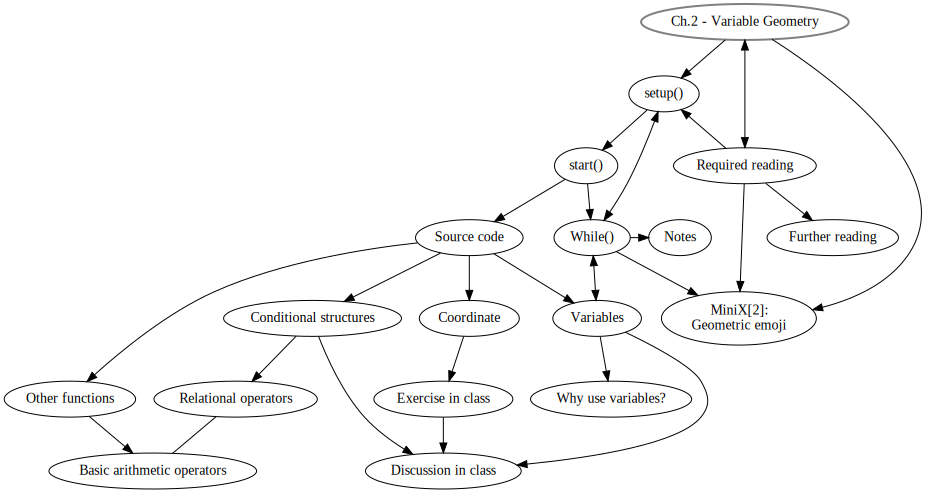
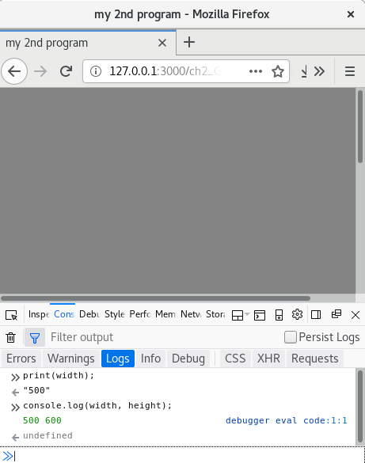

Title: 2. VariableGeometry
page_order: 2

## Variable Geometry


## setup()

Aside from the difficulties of learning anything new and complex, learning to code can be enjoyable and rewarding (we hope!). That fun can be had with programming would seem to be demonstrated in the numerous titles that make explicit reference to it such as Linus Torvalds's book *Just for Fun: The Story of an Accidental Revolutionary*, written with David Diamond, part autobiography and part story of the development of Linux.[^Fun] Fun in this case combines with the serious effort of making source code freely available and open to further modification. Like sharing a joke (or indeed recipe), programmming is indeed a social activity and relies on collective understanding in order to *get it*.

There are many more examples that reinforce the idea of fun, as if simply the declaration was enough to convince users to work through learning to program and not be too put off by its underlying difficulty. In what follows we encourage you to have fun with geometry, building on the drawing of an ellipse in the previous chapter. The idea is to further explore various shapes, sizes, positions, space, and lengths, all which are regarded as geometry in the serious discipline of mathematics, with multiple applications in everyday life, including but not limited to typography, signage, graphic design and architecture, as well as other organisational forms. More specifically, points, lines and panes are regarded as the foundational elements of design as these elements constitute objects, and the world is made up of various objects. Fun with geometry comes from manipulating these properties, and reconsituting them anew, creating alternative patterns of recognition and understanding.[^Fun2] As Olga Goriunova has argued in her book *Fun and Software*, fun with computers is considered to be a mode of thinking in this way,[^Olga] and furthermore fun can be had with the paradoxes that arise in this process. By creating new computational objects, you are manipulating learnt procedural logics, and exploring how these might be further adapted and redrawn. Variable geometry in this sense is about shape-shifting: re-imagining all sorts of new shapes and compositional forms, thereby challenging geometric conventions.[^Femke]

We take the example of emojis — ideograms, typically smileys — as typographic shorthands for expressing emotional states such as happiness, using facial expressions and common objects. These have become pervasive in communications, and no longer simply typographic but actual pictures which can be funny but also come with underlying issues related to a politics of representation. More on this soon, but for now it is enough to say that emojis make a good example as they consist of geometric shapes, using lines, points, panes and color. This chapter is about having fun with this (even if some of the underlying issues are not fun at all), exploring the affective dimension of emojis, and the varying representations that we encounter in everyday communications.

The relationship between emoji standardisation and a politics of representation, has been explored by many commentators. The essay "Modifying the Universal", written by Roel Roscam Abbing, Peggy Pierrot and Femke Snelting makes a good example,[^Emojis] as it investigates the politics of emoji *universalism*. Emojis have emerged from the Unicode project, that has set the computing industry standard for the consistent encoding, representation, and handling of text for software internationalization in all major operating systems and writing applications since 1987. Interestingly, on a technical level, Unicode provides a unique code point — a number — to represent a character in an abstract way and leaves the visual rendering (size, font, shape, geometry) to other software, such as a web browser or word processor. It is the question of representation that interests us here.

Much like the utopian project of developing a universal language to be spoken and understood by all or most of the world's population — such as Esperanto — Unicode is clearly important for communicative operations across international/multilingual systems. By the time of the release of the most recent version, Unicode 12.1, in May 2019, there were 137,994 characters covering 150 modern and historic scripts, as well as multiple symbol sets and emojis.[^Unicode] Yet as the standard expanded from the underlying characters and glyphs to symbol sets and emojis, the universalism has become increasingly problematic. Criticism has unsurprisingly centred on a politics of representation, such as blatent gender stereotyping and racial discrimination: female emojis were under-represented in certain professional roles,[^Telegraph] as well as there were limitations of skin tones applied on emojis and 'universal modifiers', that were not displayed 'universally' across all devices and operating systems.

Our point is that using emojis may be fun and expressive but they also tend to oversimplify and universalise differences, and thereby perpetuate normative ideologies within already "violent power structures",[^ideology] such that only selected people, those with specific skin tones for instance, are represented while others are not. There is a distinct inequality as to how people are represented, and who sets the standards for these representations? That these operations can be characterised as fun is part of the problem and masks other processes that monitor our emotional states not least in the workplace (we will return to this issue in Chapter 4 - DataCapture). These are some of the issues we want to explore in this chapter by introducing variable geometry and learning to be able to produce alternatives, more politically-correct ones perhaps. We start with the work *Multi* by David Reinfurt which will be used to demonstrate the basis of geometry and the variations of facial expression and composition that can be generated from simple typographic elements.

### start()
<br>
*Figure 2.1: Multi by David Reinfurt*

*[Multi](http://www.o-r-g.com/apps/multi)*,[^Multi] is inspired by another designer Enzo Mari who spent a whole year in 1957 exploring the essential form of an object (an apple, the universal apple we might add). Reinfurt explains that "He was not looking to draw AN apple, but rather THE apple — a perfect symbol designed for the serial logic of industrial reproduction." *Multi* develops a variation of this idea for informational reproduction in the form of a mobile app with 1,728 possible arrangements, or facial compositions, built from minimal punctuation glyphs. But instead of using preset typographic characters, which admittedly is the conceptual charm of *Multi*, for our purpose we will draw these from scratch with foundational elements of geometry.

## Source Code
<br>
*Figure 2.2: The screenshot of the remix of Multi*

[RunMe]()

```javascript
/*Inspired by David Reinfurt's work - Multi*/
let moving_size = 50;
let static_size = 20;

function setup() {
  createCanvas(windowWidth, windowHeight);
  frameRate(15);
}

function draw() {
  //background
  background(random(230,240));
  //left
  noStroke()
  fill(0);
  rect(97,169,79,12);

  //right
  rect(365,184,20,15);
  fill(20,20,120);

  beginShape();
  vertex(365, 199);
  vertex(385, 199);
  vertex(372, 216);
  vertex(358, 216);
  endShape(CLOSE);

  //bottom
  noFill();
  stroke(130);
  strokeWeight(2);
  ellipse(255,350,static_size,static_size);

  //mouse interactions
  stroke(180);
  ellipse(mouseX, mouseY, moving_size, moving_size);

  if (mouseIsPressed) {
    static_size = floor(random(5, 20));
 }
}
```
The above code draws various shapes and performs simple interactions:
- the background is filled with flashing grey-scale colors
- on the left is a horizontal rectangle in the color black  
- on the right is a rectangle in black and a polygon in blue
- on the bottom is an ellipse without any filled color but with grey stroke color
- when you move the mouse, an outlined ellipse in grey color follows the movement
- you can also click on the mouse to change the size of the grey ellipse

### Coordinate
In the last chapter, we briefly talked about x and y coordinates, which is a fundamental concept for positioning and drawing objects with various measurements on a canvas. A line of code like `createCanvas(windowWidth,windowHeight)` refers to the action of creating a canvas with the width and height according to your window size. Unlike the previous chapter with the setting of the exact pixel dimension like `createCanvas(640,480);`, this approach gives you a flexibility of no fixed canvas size. Therefore, the background color of the sample code fills the whole window screen. It should be reminded that in mathematics the origin [0,0] is positioned in the middle of a grid paper/screen, but in computing the origin is drawn at the upper left corner (see Figure 1.11 in the previous chapter).

#### Exercise in class
```javascript
function setup() {
  createCanvas(windowWidth, windowHeight);
  frameRate(15);
}

function draw() {
  background(random(230,240));
}
```
<!--  -->
<br>
*Figure 2.3: Simple exercise*

Remember the structure of a web page should include the html, working javascript file (for example, sketch.js) and p5.js associated libraries.  

- Type/copy the above source code in the working javascript file and then save the code. Run the program on ATOM (with the live-atom-server) and you should see a flashing background on a screen.
- There are few new examples of syntax, or a slightly different use of syntax, here:
    - `frameRate()`: This sets the number of frames per second that the computer will use when running the program. The default is 60 and now it is set as 15, a slower iteration so you can see the background color for each frame quite clearly (you might also compare the flashing rate with the sample code in the previous chapter).
    - `random(230,240)`: In the earlier sample code the function `random()` took one argument only. This sample code gives you a different use of the function with two arguments. If you look at the [reference guide](https://p5js.org/reference/#/p5/random),[^random] it explains that the random function returns a floating-point number, and this means that the number is not an integer but a number with decimals. (The difference in the number of arguments is also explained in the reference.) For this case, the program will return a floating-point number between 230 and up to, but not including, 240. An example of such a returned value would be 231.34387. This refers to a grey-scale color value.
- Next you need to recall using the web console (Under Tools > Web Developer > Web Console)
    - Type `print(width);` and then press enter
    - Type `console.log(width, height);` and then press enter

You should notice from the responses of the console area (see Figure 2.2) that it displays the actual width in pixel unit when you type the functions `print(width);`. Additionally, if you use `console.log(width, height);`, which is the equivalent of the print function in JavaScript (not a p5.js function), the screen displays two numbers according to your screen size (you may adjust the screen and try again to get a different number). With just two lines in the console area, you have asked the program to give you the values of the width and height of the canvas. The program understands the two names 'width' and 'height'. They are the pre-set names in p5.js which you can use specifically for asking the dimensions of the canvas.

### Variables

In programming, both width and height are called *variables*, which is another important concept. Variables are used to store data and information in a computer program. You can think of variables as a kitchen container, and you can put things (like food, forks, etc) in a given container, replace them with other things, and store them for later retrieval. Two main types of variables: Local variables are defined within a structure or a function, and then can only be used within that block of code. On the contrary, a 'global variable' is something you can use in any parts of your code. To define a global variable, you need to define it before the setup of the program, usually in the first few lines of the program.

To use the sample code example, the value behind `windowWidth` is the width of the window that set as the canvas width (as illustrated in line 2). To continue with the analogy, a container with the name 'width' (as we have just typed in the web console) is being labeled and has stored the value. The program is able to retrieve the measurement of the canvas by using the variable `width` and this value can be changed according to your window width and being retrieved and display by using the web console (You may also use the variable `width` and `height` with other functions and for other purposes.)

But, and importantly, you can also assign your own variable names (in other words, you can create your own type of container and store other values).

```javascript
let moving_size = 50;
let static_size = 20;
.
.
.
ellipse(255,350,static_size,static_size);
.
.
.
ellipse(mouseX, mouseY, moving_size, moving_size);

if (mouseIsPressed) {
    static_size = floor(random(5, 20));
}
```

The above is the excerpt of the entire code to draw two different size of ellipses (As discussed in the previous chapter, the last two arguments of the ellipse function refer to width and height). Instead of placing a number in the function as in Chapter 1, this time we use variables instead as they hold values too. There are 3 steps to use variables:

1. **Declare:** Think of a name for the container you want to store the value in (usually it will make sense to yourself and to others to read it, but of course there is scope for a conceptual approach here). Declare with the syntax 'let' in front.[^let]
2. **Initialize/Assign:** What is it that you want to store there? Is it a number? By assigning a value, you will need to use the equal sign. Officially, there are 4 data types that are useful to know at this introductary level:
    1. *number* for numbers of any kind: integer or floating-point.
    2. *string* for strings. A string may have one or more characters and it has to be used with double or single quote marks. For example: `let moving_size = "sixty";`
    3. *boolean* for true/false. For example: `let moving_size = true;`
    4. *color* for color values. It can take in Red Green, Blue (RGB) or Hue, Saturation and Brightness (HSB) values. For example: `let moving_size = color(255,255,0);` (see more from the [p5.js color reference](https://p5js.org/reference/#/p5/color)[^color]
3. **(Re)Use:** How and when do you want to retrieve the stored data? If the variable will change over time, you may want to reuse it many times.

For this example, two variables: 'moving_size' is more stable than 'static_size' because the later one will change according to mouse press. (If you foresee the values won't change, you may also consider to use `const` [^constant], where a value remains unchanged for the entire program).

There are two more variables in the example: `mouseX` and `mouseY`. These are changing variables and are subject to the mouse movement to trace the coresponding x and y coordinates. If you want to know the mouseX and mouseY exact coordinate position, you may also use `print()` or `console.log` to display the two values in the console area. (How to write a line of code to display or print the mouseX value on the web console?)

Although it is commonplace to use the metaphor of a container to illustrate the concept of variable, it is important to add that there is an address for each container (for instance, it is in a particular place on a shelf if you like, and the computer needs to know it's there). Technically speaking, by declaring a variable, it also declares an address at which the computer memory can hold the value. In short, each variable is stored in a block of computer memory which is located inside physical and concrete memory like RAM. Each block has a identification which is called the memory address so that the computer knows where to store it and retrieve it while the program is running. As such, software and hardware is not separable, and it is just we can't able to see the inner micro-workings of a computer whilst it is handling data.

#### Why use variables?
As you learn to program more complex software, you will discover it is very common to use variables to store values and data. More importantly, the value of variables can be changed while a program is being run in real-time. The earlier variables: mouseX and mouseY may serve the purpose of illustrating the point because the coordinates of the mouse will change according to its movement. We will also discuss variables again in the next chapter when we introduce the concepts of array, loop and repetition.

Another reason for variables is that if you have longer lines of code, it is easier to have all the variables that you have declared for the program in an overview. As such you can change the value for testing, for example defining different sizes of shapes without locating the specific line of code. Morever, it is also easier for others to read your code with a well-chosen variable name when you have to use it in different parts of your program.

This leads to the reusability of variables. Variables can be used in different functions and more than one time (and also as arguments passed to a function subroutine, something we will also discuss in the next chapter), just like the `static_size` variable in the sample code that is used for drawing both the ellipse and the rectangle.

### Other functions
This section is to briefly introduce some other new functions in the sample code, as drawing and designing an emoji requires different decisions, in terms of shapes, color and spatial composition.

- `noStroke()`, `strokeWeight()`: These functions refer to the settings of the shape, whether it has an outline, and the weight of the border.
- `stroke()`, `fill()` and `nofill()`: These set the color of objects like the border, shapes or text. It takes RGB (as default) or HSB color. But if the function has 1 argument, then it refers to gray scale color between 0-255 [^binarycolor]. If the function has 3 arguments like `fill(255,255,0)`, then it means the object/shape/text will be filled with a yellow color (the mix of red and green with no blue color). There is an optional argument called 'alpha', which refers to the opacity of the color, e.g `fill(255,255,0,127)`.
- `rect()`: This is similar to drawing an ellipse, but is used to display a rectangle.
- `vertex()`, `beginShape()` and `endShape(CLOSE)`: These three functions are used for drawing a more complex form according to different vertices. The `vertex` function indicate its x and y coordinates and all the vertices can be joined via using the 'close' argument in `endShape()`. The `beginShape()` is used to record the start of the vertex for a complex form like a polygon.
- `floor()`: Since the random function returns a floating-point number, `floor()` is used to calculate the closest integer value.
- `if (mouseIsPressed) {}`: This is a conditional structure for a program, constantly referring to mouse press actions. This is discussed in more detail below.

#### Basic Arithmetic Operators
You can also do arithmetic operations in programming, and this is commonly done in arguments of a function. Here is a list of basic arithmetic operators:
- add(+): For addition and concatenation, which is applicable for both numbers and text/characters.
- subtract(-)
- multiply(*)  
- divide(/)
- Special operators: increment (++), decrement (--)   

You can try the following in the console area:
```
print(2*3);
```
> Output:
"6"
```
print("hello" + "world");
```
> output:
"hello world"

## 2.6 Conditional Structure
Conditional statements are very useful as they allow you to set a different decision path by specifying conditions. Indeed, a conditional decision is something not only specific to programming. In the everyday life, for instance, you might say "If I am hungry, then I'll eat some food, otherwise if I am thirsty, then I will drink some water, else I will just take a nap".

```javascript
//example in human language
if (I am hungry) {
  eat some food;
} else if(thirsty) {
  drink some water;
} else{
  take a nap;
}
```

The above is *pseudocode* to demonstrate what making an everyday decision to eat or drink might look like in programming. The keyword and syntax `if` is then followed by the condition and checks whether a certain condition holds. As such, the whole if statement is a *Boolean expression* — one of two possible values is possible, true or false, leading to a different path and action. In computer science, the Boolean data type is a data type that has one of two possible values which is intended to represent the two truth values of logic.

In our sample code, we have implemented a conditional logic to constantly check if there is any mousepressed actions. This is why the size of the ellipse changes when a mouse is pressed.

```javascript
  if (mouseIsPressed) {
    static_size = floor(random(5, 20));
 }
```

### Relational operators
When you have to create your own conditional statement with the if-then format, there are multiple combinations you can work on to form a more complex expression. For example, you can have many different cases using the syntax `else if`, or a combinaton of logical operators, such as the AND case here in another pseudocode example:

```javascript
if (I am hungry) && (I am in a good mood) {
    print("go out");
}
```

Here is a list of relational operators and logical symbols that can be used in conditional statements.

```
/*
Relational Operators:
>   Greater than
<   Less than
>=  greater than or equal to
<=  less than or equal to
==  equality
=== equality (include strict data type checking)
!=  not equal to
!== inequality with strict type checking
*/

/*
Logical Operators: boolean logic:
&&  logical AND
||  logical OR
!   logical NOT
*/

/*
Example:
if () {
  //something here
}else if() {
  //something here
}else{
  //something here
}
*/
```

Below is an example of a small sketch with the use of a conditional structure and operators. Although all the conditional if or else-if statements are true, the web console will only print out "one". It is because the program will exit the structure when the first condition is met. In other words, sequence matters and the program will not run the other else-if statements and will take the first true statement to execute.

```javascript
let x = 18;
if (x > 10 || x <= 20 ) {
    console.log("one");
}else if (x == 18) {
    console.log("two");
}else if (x === 18) {
    console.log("three");
}else  {
    console.log("four");
}
```

#### Discussion in class
1. Examine [existing emojis](https://printable360.com/wp-content/uploads/2018/01/printable-pictures-of-emojis-f85e23c6c5560b017f1154346490d23d.jpg) or those available on your handset, and reflect upon the complexity of human emotions and their caricature.  What's your experience in using emojis? What are the cultural and political implications of emojis (perhaps yopu can refer to the readings and introduction above)?
2. Discuss what constitutes a face? What essential elements do you need for a particular facial expression, and why? What has been lost in translation?
3. Beyond the face, take a look at [more emojis](https://www.pngfind.com/mpng/ohwmTJ_all-the-emojis-available-on-facebook-russian-revolution/).[^emojis2] Is there anything you want to add?
4. Experiment with p5.js. How do you translate your thoughts into lines of code? You may want to print out the coordinates of the mouse press on the console area to get a more accurate position for your shapes.

## While()

The human face make a good starting point here as we recognise it even in its simplest form, something *Multi* seems to verify with its minimal rendering of three elements. The face clearly occupies a central position in everyday life and social interaction, and it almost goes without saying that its features are perceived to display our uniqueness and individuality. But this is a surface reading only. Emojis operate in this way and seem to occlude the face of experience and it ability to express complex feelings. It would be tempting to think that emojis, despite their name, stop short of emotions altogether.

In *A Thousand Plateaus*, Gilles Deleuze and Félix Guattari conceive of the face as "overcoded", imposed upon us universally, resonating with some of the comments we made earlier in this chapter about Unicode. Their main point is that the face — or what they call facial machine — is tied to a specific Western history of ideas (the face of Jesus Christ). This, in turn, situates the origins of the face with white ethnicities and what they call “facialization” (the imposition onto the subject of the face) has been spread by white Europeans, and thus provides a way to understand racial prejudice: "Racism operates by the determination of degrees of deviance to the White man’s face...".[^DG] The face is thus an "imperial machine", subsuming language and other semiotic systems. The face is part of a surface that promotes sameness and rejects difference.

Facial recognition technologies that are capable of identifying or verifying a person from a digital image or a video frame, seem to operate on these (imperialist) terms too. When a person is identified in this way, the person's facial shape and textures are matched against a model based on a standardised dataset (and we will return to this discussion in chapter 4). Moreover the datasets are based on a disproportionate number of white faces and notoriously facial recognition systems struggle to identify black people. This has led to significant problems not least when it comes to the use of these technologies for policing.

Systems also becomes unreliable when facial expressions vary, and even a big smile can render the results unreliable, so there is heavy irony that a smiley in real-life is likely to create difficulties of recognition. The iconic emoji smiley seems to further stress the point. The face may be able to escape overcoding under certain conditions but emojis are quite literally facial-machines. Herein lies a challenge perhaps, when having fun with programming, to escape the overcode and to develop alternative geometric shapes.

Something of this logic is evident in a further article by Femke Snelting, "Other Geometries", which discusses how geometric shapes can help to resist sovereign infrastructures.[^Snelting] She is thinking of something as simple as a circle and how it is associated with collective forms.

"A circle is a simple geometric shape. [...] Circles are mathematically defined as the set of all points in a plane that are at the same distance from a shared center; its boundary or circumference is formed by tracing the curve of a point that keeps moving at a constant radius from the middle. [...] Circles are omnipresent in practices and imaginaries of collectivity. [... and yet] Their flatness provides little in the way of vocabulary for more complex relational notions that attempt to include space, matter and time, let alone interspecies mingling and other uneasy alliances. The obligation to always stay at the same distance from the center promises a situation of equality but does so by conflating it with similarity. Circles divide spaces into an interior and an exterior, a binary separation that is never easy to overcome. We urgently need other axes to move along."[^Snelting2]

Snelting is looking for other geometries that can escape normative configurations of collectivity. She also refers to the works of Zach Blas, also know for his interventions with facial recognition systems (*Facial Weaponization Suite*, 2011-14), to point to the geometric spaces between nodes and edges, and to draw more attention to relations. Beyond network imaginaries of decentralised and distributed forms, historically part of rethinking centralised power structures, the idea is to "bend our infrastructural desires in other directions", making further reference to the work of Anna Tsing and "messy geometries" that are inspired by mushroom root structures such as Mycelium.[^Tsing]

The challenge is to rethink normative geometries, to turn them upside down and inside out. Herein lies the challenge of the chapter, in having fun with programming, to escape the face's overcoding and to develop alternatives. Fun in this sense means the ability to be able to modify forms and to diverge from established rules - like a good joke. In the case of programming the rules can be applied differently, adapted and modified, and even transformed altogether.

## MiniX[2]: Geometric emoji
**Objective:**
- To experiment with various geometric drawings, explore possibilites, especially on shapes and drawing with colors.
- To reflect on the politics/aesthetics of emojis via the assigned texts.

**Get some additional inspiration here:**
- [Multi](http://o-r-g.com/apps/multi) by David Reinfurt.
- [Chinese Characters as Ancient Emoji](https://publish.illinois.edu/iaslibrary/2015/10/21/chinese-characters/)[^Witt] by Steve Witt.
- [Women finally get a menstruation emoji](https://www.fastcompany.com/90302946/women-finally-get-a-menstruation-emoji)[^Grot] by Michael Grothaus.
- [Between Art and Application by Crystal Abidin and Joel Gn](https://firstmonday.org/ojs/index.php/fm/article/view/9410)[^Abidin] (short text about emoji culture)

**Tasks (RUNME):**

Explore different shape, geometric and other related syntax (via p5.js [references](https://p5js.org/reference/)) and design two emoji icons

**Questions to think about as README:**
  - **Describe** your program and what you have used and learnt.
  - **How** would you put your emoji into a wider cultural context that concerns representations, identity, race, social, economics, culture, device politics and beyond? (Try to think through the assigned reading and your coding process, and then expand that to your experience and thoughts - this is a difficult task, you may need to spend sometimes in thinking about it).

## Required reading:
- Roel Roscam Abbing, Peggy Pierrot and Femke Snelting, "[Modifying the Universal.](http://www.data-browser.net/db06.html)" *Executing Practices*, Eds. Helen Pritchard, Eric Snodgrass & Magda Tyżlik-Carver, London: Open Humanities Press, 2018, 35-51.
- p5.js. p5.js | Simple Shapes. [Web] Available at: https://p5js.org/examples/hello-p5-simple-shapes.html [Accessed 09 Sep. 2019].
- Shiffman, Daniel. (2018) 1.3,1.4,2.1,2.2: Code! Programming with p5.js [online] Available at: https://www.youtube.com/watch?v=yPWkPOfnGsw&list=PLRqwX-V7Uu6Zy51Q-x9tMWIv9cueOFTFA&index=2 [Accessed 09 Sep. 2019].
- Femke Snelting, "Other Geometries", *transmediale journal*, Issue#3, 31 October 2019, https://transmediale.de/content/other-geometries

## Notes

[^Fun]: Linus Torvalds and David Diamond, *Just for Fun: The Story of an Accidental Revolutionary* (Knutsford: Texere Publishing, 2001), see http://en.wikipedia.org/wiki/Just_for_Fun. Other examples include Jeremy Gibbons and Oege de Moor, *The Fun of Programming* (London: Palgrave Macmillan, 2003).

[^Fun2]: See the children's book: Owyang Chan, V, *Geometry Is Fun For Me* (Dog Ear Publishing, 2017).

[^Olga]: Olga Goriunova, *Fun and Software: Exploring Pleasure, Paradox and Pain in Computing* (New York, London: Bloomsbury, 2014), 4.

[^Femke]: Femke Snelting, "Other Geometries", *transmediale journal*, Issue#3, 31 October 2019, https://transmediale.de/content/other-geometries

[^Emojis]: Roel Roscam Abbing, Peggy Pierrot and Femke Snelting, "[Modifying the Universal.](http://www.data-browser.net/db06.html)", *Executing Practices*. Eds. Helen Pritchard, Eric Snodgrass & Magda Tyżlik-Carver (Open Humanities Press, 2018, 35-51). Other references include: Crystal Abidin and Joel Gn, "Between Art and Application: Special Issue on Emoji Epistemology", *First Monday*, 23(9), 3 September 2018; Luke Stark, "Facial recognition, emotion and race in animated social media", *First Monday*, 23(9), 3 September 2018; Miriam E Sweeney and Kelsea Whaley, "Technically White: Emoji Skin-tone Modifiers as American Technoculture", *First Monday*, 24(7), 1 July 2019.

[^Unicode]: See https://en.wikipedia.org/wiki/Unicode#Origin_and_development.

[^Telegraph]: See https://www.telegraph.co.uk/technology/2016/07/15/new-gender-equality-emoji-to-show-women-at-work/.

[^ideology]: Abbing, Pierrot and Snelting, *Modifying the Universal*, 210.

[^multi]: See http://www.o-r-g.com/apps/multi. *Multi* also provides variations of book covers for the DATA browser series published by Open Humanities Press, at http://www.data-browser.net/.

[^binarycolor]: Red, Green and Blue are primary colors added together to produce a broad array of color. The range of RGB color values is from 0 to 255 with a total of 256 possible values for each primary color. The reason behind is that all the colors are of the 24 bit format, and the red (R) takes 8 bit, the green (G) takes 8 bit and the blue (B) takes the remaining 8 bit. For each bit it stores 2 binary values, therefore 2^8th power is 256 which is the exact possible range of each color. The system of how RGB is used is highly related to the nature of compuation in a binary system.

[^random]: See p5.js random reference at https://p5js.org/reference/#/p5/random.

[^let]: 'let' is introduced in ES6 (ECMAScript- scripting language specification standardization) to declare a variable although 'var' is still commonly used. They are both used for variable declaration but the difference is that let is block scoped while var is function scoped. Specifically for the let case, if the same variable is declared in both global and local levels, the local value will be restricted to the specific block of code and won't be overridden. For more on the distinction, see https://developer.mozilla.org/en-US/docs/Web/JavaScript/Reference/Statements/var and https://developer.mozilla.org/en-US/docs/Web/JavaScript/Reference/Statements/let.

[^color]: See p5.js color reference, https://p5js.org/reference/#/p5/color.

[^Emojis2]: See https://www.pngfind.com/mpng/ohwmTJ_all-the-emojis-available-on-facebook-russian-revolution/.

[^playground]: See the tool p5.playground developed by Yining Shi, https://1023.io/p5-inspector/.

[^DG]: Gilles Deleuze and Félix Guattari, *A Thousand Plateaus: Capitalism and Schizophrenia* (Minneapolis: University of Minnesota Press, 1987), 178.

[^Snelting]: Snelting, "Other Geometries".

[^Snelting2]: Ibid.

[^Blas]: The series of works *Facial Weaponization Suite* exposes some of the inequalities associated with biometric facial recognition by making collective masks, including *Fag Face Mask* as a response to scientific studies that link determining sexual orientation through rapid facial recognition techniques, and another mask that explores the inability of biometric technologies to detect dark skin. See http://www.zachblas.info/works/facial-weaponization-suite/.

[^Tsing]: Anna Lowenhaupt Tsing, *The Mushroom at the End of the World: On the Possibility of Life in Capitalist Ruins* (Princeton University Press, 2017).

[^Witt]: Steve Witt, "Chinese Characters as Ancient 'Emoji'", *Glocal Notes*, 2015, available at https://publish.illinois.edu/iaslibrary/2015/10/21/chinese-characters/.

[^Grot]: Michael Grothaus, "Women Finally Get a Menstruation Emoji", *Fastcompany*, 2019, available at https://www.fastcompany.com/90302946/women-finally-get-a-menstruation-emoji.

[^Abidin]: Abidin and Gn, "Between Art and Application".
