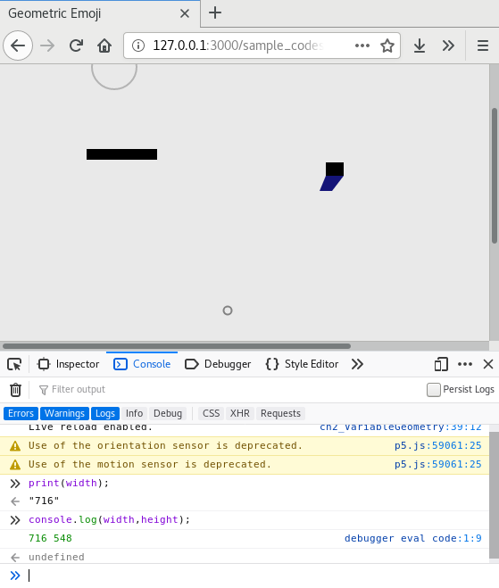

Title: 2. Variable Geometry
page_order: 2

## 2. Variable Geometry

## 2.1 setup()

Fun...

Building upon the previous first sample code on the shape — ellipse, we want to further explore various shapes, size, positions, space, lengths, areas which are regarded as geometry in the discipline of Mathematics. It has many applications within daily encounters, including but not limited to road signs, typography, construction, architecture, art and design. In particular, points, lines and panes are regarded as the foundational elements of Design as the elements constitute objects, in which the world is made up of various objects from what we see to what we use. It is fun to learn Geometry <sup>[1](#myfootnote1)</sup> because geometry relates to the properties, in particular to shape and space, of everyday and familiar objects,  but at the same time it is challenging to create new patterns and forms of representation which is aesthetically pleasing. 

But fun in computing, as Olga Goriunova argues, is considered as a mode thinking and reasoning <sup>[2](#myfootnote2)</sup>. Through making and creating new computational objects, one is making sense of the world through logics and procedures. In other words, fun is about paradox and sense making. Typing emojis is fun in communication and social media to express one's emotions and thoughts, and thereby emojis concern both bodily and material affections. Emojis consist of geometry, creating abstracted facial representation with lines, points, panes and color.  This chapter is about having fun with varying size of geometric emojis, the affective expressions and varying representations that we use in almost all sort of electronic communications. It is fun as it is related to subjectivity and abstraction, producing a subjecthood and abstracting certain facial characteristics, which are not an actual representation of one's face but an imaginary and a constructed one. 

With the design and development of emojis, it has become a pre-coded form of representation and identification. The relationship between emojis and representational/identitiy politics has been explored by many scholars and practitioners<sup>[3](#myfootnote3)</sup>. In particular the text 'Modifying the Universal', written by Rosel Roscam Abbing, Peggy Pierrot and Femke Snelting, they investigate the process of universal standardisation of emoji, in which The Unicode Consortium, a non-profit organization based in America and is concerned with universal character encoding standards, is the key entity to standardize, maintain and publish the Unicode Standard for software internationalization in all major operating systems and applications since 1987. Nevertheless, the development of emoji encounters different issues over time, including the criticism of gender sterotypes and racial discrimiation, such as female emojis were under-represented in roles like police officers, doctors and businessmen<sup>[4](#myfootnote4)</sup>; as well as the limitation of skin tones applied on emojis and "universal modifiers", therefore, as a feature introduced in 2015 but it faces technological challenges as they are not displayed 'universally' across all handsets with different manufactuers and operating systems<sup>[5](#myfootnote5)</sup>. Using emojis may be fun and expressive, but this also depicts normative ideologies within the "violent power structures"<sup>[6](#myfootnote6)</sup>, where only selected people, for example with specific ethnicities and with certain skin colors, can be represented while marginalizing the others. So the question is who can get to be represented and why? Who has the power to control and standardize what to represent and what are the cultural consequences and implications? As Goriunova explores the notion of fun in her edited book *Fun and Software*, she reminds us such bodily and material affections within computational structure are paradoxically produced as fun objects "across the political, experiential registers, and in the computational feeding on the computational",  which is distributed across society and culture<sup>[7](#myfootnote7)</sup>. 

Such cultural biases is what we want to think about in this chapter (but also in other chapters) by introducing geometry which is situated within the context of emojis. To start with geometric emojis, the work *Multi* by graphic designer David Reinfurt will be used to demonstrate the basic of geometry and the variations of facial expression and composition. 

## 2.1.1 Start()
<br>
*Figure 2.1: Multi by David Reinfurt* 

The independent desigher David Reinfurt created the work *[Multi](http://www.o-r-g.com/apps/multi)*<sup>[8](#myfootnote8)</sup> and it was inspired by Enzo Mari, who is an Italian modernist artist and furniture designer. He spent a whole year in 1957 drawing just 'the' apple with simple coutour lines as a way to explore what it means as an essential form of an object. With such a view on essentialism, Reinfurt uses software to present one of 1,728 possible facial compositions with the combination of minimal puntucation glyphs. The work is presented as a mobile app and later developed as a cover design in a book series<sup>[9](#myfootnote9)</sup>. 

Instead of using preset typographic characters, this section will explore what constitute those punctunation glyphs like a comma. How can you draw a comma with the foundational elements of geometry?

## 2.1.2 Source Code
<!--  -->
<br>
*Figure 2.2: The screenshot of the remix of Multi*

[the image and source code will change a bit to match exactly the spatial composition of Multi - will get back in *future* /w]

[RunMe: need something to run the program - need to check with OSP, ref: https://creative-coding.decontextualize.com/first-steps/ or https://p5js.org/learn/coordinate-system-and-shapes.html /w]

```javascript
/*Inspired by David Reinfurt's work - Multi*/
let moving_size = 60;
let static_size = 20;

function setup() {
  createCanvas(500, 600);
  frameRate(15);
}

function draw() {
  //background
  background(random(130,140));
  //left
  noStroke()
  fill(0,0,0);
  rect(50,110,100,26);

  //right
  rect(350,140,static_size,static_size);
  fill(200,100,0);
  beginShape();
  vertex(350, 160);
  vertex(343, 180);
  vertex(353, 180);
  vertex(370, 160);
  endShape(CLOSE);

  //bottom
  noFill();
  stroke(255,255,255);
  strokeWeight(2);
  ellipse(190,370,static_size,static_size);

  //mouse interactions
  stroke(180);
  ellipse(mouseX, mouseY, moving_size, moving_size);

  if (mouseIsPressed) {
    static_size = floor(random(5, 20));
 }
}
```
The above code draws various shapes and performs simple interactions: 
- the background is in a verticle rectanglar shape, flashing grey-scale colors 
- the left with a horizontal rectangle in black color 
- the right with a square in black color and a polygon in orange color 
- the bottom with an ellipse without any filled color but with white stroke color
- One can move the mouse in which an outlined ellipse in grey color follows the mouse 
- One can also click on the mouse to change the size of the white ellipse and the black square

## 2.2 Coordination
In the last chapter, we have briefly talked about x and y coordinations, which is the fundamental concept for positioning and drawing objects with various measurement on a canvas. 
For a line of code like `createCanvas(500,600)`, it refers to the action of creating a canvas with the width of 500 pixel and the height of 600 pixel. In high school's maths class, there is a different coordinate system with the origin [0,0] places in the middle of a grid paper/screen but in computing, the canvas is started to draw from the upper left corner which is the origin (see Figure 1.11 in the previous chapter).

## 2.2.1 Exercise in class
```javascript
function setup() {
  createCanvas(500, 600);
  frameRate(15);
}

function draw() {
  background(random(130,140));
}
```
<!--  -->
<br>
*Figure 2.3: Simple exercise* 

Remember the structure of a web page includes both the html, working javascript file (for example sketch.js) and p5.js associated libraries.  

- Type the above source code in the working javascript file and then save the code. Run the program on ATOM (the live-atom-server with the shortcut Crtl+Alt+L) and you should see just a flashing rectangle on a screen. 
- There are few new syntax or slightly different use of syntax here: 
    - `frameRate()`: This sets the number of frames per second that the computer will run the program. The default is 60 and now is set as 15, referring to a slower iteration and thus you can see the background color for each frame quite clearly (You can also compare the flashing rate with the sample code in the previous chapter).
    - `random(130,140)`: In the earlier sample code the function `random()` took one argument only. This sample code gives you a different use of the function with two arguments. If you look at the [reference guide](https://p5js.org/reference/#/p5/random)<sup>[10](#myfootnote10)</sup>, it tells you the random function returns a floating-point number, and this means that the number is not an integer but a number with decimals. By looking at the description (checking reference is very useful to understand how function and syntax work), it also explains the difference on the number of arguments. For this case, the program will return a floating-point number between 130 and up to (but not including) 140. Example of such returned value would be, for example, 131.34387. Such returned value refers to a grey-scale color value. 
- Next is to recall our memories in using the web console (Under Tools > Web Developer > Web Console - Ctrl+Shift+K)
    - Type `print(width);` and then press enter
    - Type `console.log(width, height);` and then press enter

You should notice from the responses of the console area (see Figure 2.2), where it displays the actual width in pixel unit (500) when you type the functions `print(width);`. Additionally, if you use `console.log(width, height);`, which is the equivalent of the print function in JavaScript (not a p5.js function), the screen displays two numbers 500 and 600. With just two lines in the console area, you have asked the program to give you the values of the width and height of the canvas. The program can then understand these two names 'width' and 'height'. They are the pre-set names in p5.js in which you can use specifically for asking the canvas' dimension. 

## 2.3 Variables 

In programming, the use of both width and height is called variables, which is another important concept. Variables are used to store data and information in a computer program. You can think of variables as many lockers, and you can put things, replace them with other things, and store them for later retrieval. Just like the variable 'width' and 'height' as something what is called 'global variables', in which you can use in any parts of your code. However for local variables, it is defined within a structure or a function, then the variable can only be used within that block of code. To define a global variable, you need to define it before the setup of the program, usually in the first few lines of the program. 

To use the earlier example, the value behind 'width' is 500 which is the canvas' width that has been defined in line 2 (see section 2.2.1). To continue with the metaphor, a locker with the name 'width' is being labeled and stored the value '500'. For this case, it is assigned by default as the program is able to retrieve the measurement of the canvas. 

But you can also assign your own variable names (metaphorically speaking, it is to create your own locker and store other values). 

```javascript
let moving_size = 60;
let static_size = 20;
.
.
.
ellipse(190,370,static_size,static_size);
.
.
.
ellipse(mouseX, mouseY, moving_size, moving_size);
  
if (mouseIsPressed) {
    static_size = floor(random(5, 20));
}
```

The above is the excerpt of the entire code, relating to drawing two different size of ellipses. The last two arguments of the ellipse function refer to width and height. Instead of placing a number in the function like in Chapter 1, this time we use variables instead as they hold value too. There are 3 steps to use variables:

1. **Declare:** Think of a name you want to store the value (usually it will make sense to yourself and to others to read it). Declare with the syntax 'let' in front<sup>[11](#myfootnote11)</sup> 
2. **Assign:** What is the stuff you want to store there? Is it a number? By assigning a value, you will need to use the equal sign. Officially, there are 4 data types are useful to know at this introductary level:
    1. number for numbers of any kind: integer or floating-point.
    2. string for strings. A string may have one or more characters and it has to be used with double or single quote. For example: `let moving_size = "sixty";`
    3. boolean for true/false. For example: `let moving_size = true;`
    4. color for color values. It can take in Red Green, Blue (RGB) or Hue, Saturation and Brightness (HSB) values. For example: `let moving_size = color(255,255,0);` (see more from the [p5.js color reference](https://p5js.org/reference/#/p5/color)<sup>[12](#myfootnote12)</sup>)
3. **(Re)Use:** How and when do you want to retrieve the stored data? If such variable will change over time, you may want to reuse it for many times. 

For this example, two variables: 'moving_size' is more stable than 'static_size' because the later one will change according to mouse press. (If you forsee the values won't change, you may also consider to use `const`, where a value remains unchanged for the entire program).

There are two more variables in the example: `mouseX` and `mouseY`. These are changing variables and are subjected to the mouse movement to trace the coresponding x and y coordinates. If you want to know the mouseX and mouseY exact coordinate position, you may also use `print()` or `console.log` to display the two values onto the console area.

<br><!--  -->
 <br>
*Figure 2.4: Illustration of variables*

[need lockers illustration or sth like this: https://www.mathwarehouse.com/programming/images/pbv-vs-pbr/picture-pass-by-value-vs-reference-how-memory-works-with-locations.png /w] <br>

Though there are many books use the metaphor of a container to illustrate the concept of variable, the use of lockers is to convey there is an address for each locker. Technically speaking, by declaring a variable, it also declares a location/address in which the computer memory can hold the value. In short, each variable stores at a block of computer memory which is located inside a physical and concrete memory like RAM. Each block has a identification which is called the memory address so that the computer knows where to store it and retrieve it while the program is run. As such, software and hardware is not separable, and it is just we can't able to see the inner micro-working of a computer in handling .

## 2.3.1 Why use variables? 
As you learn to program more complex software, you will know it is very common to use variables to store values and data. More importantly, the value of variables can be changed while a program is run in real-time. The earlier variables: mouseX and mouseY may serve the purpose of illustrating the point because the coordinate of the mouse will change according to the movement. We will also discuss variable again in the next Chapter with the concept of loop and repetition. 

Another reason is that if you have longer lines of code, it is easier to have all the variables that you have declared for the program as an overview. As such you can change the value for testing, for example different size of shapes, but without locating the specific line of code. Morever, it is also easier for others to read your code with a well-thought variable name when you have to use it in different parts of your program.

This leads to the reusability of variables. Variables can be used in different functions and more than one function (and also as arguments passed to a function subroutine where we will discuss in the next chapter), just like static_size variable in the sample code for drawing both the ellipse and the rectangle. 

## 2.4 Other functions 
This section is to briefly introduce other new functions in the sample code, in which drawing and designing a emoji requires different decisions, in terms of shapes, color and spaitial composition. 

- `noStroke()`, `strokeWeight()` : These refer to the settings of the shape, whether it is without any outline, and what is the weight of the border.
- `stroke()`, `fill()` and `nofill()`: These functions set the color of objects like border, shapes or text. It takes RGB (as default) or HSB color. But if the function with 1 argument, then it refers to gray scale color between 0-255. If the function with 3 arguments like `fill(255,255,0)`, then it means the object/shape/text will be filled with yellow color (the mix of red and green with no blue color). There is an optional argument called 'alpha', referring to the opacity of the color, e.g `fill(255,255,0,127)`;
- `rect()`: This is similar to draw an ellipse, but just display as a rectangle. 
- `vertex()`, `beginShape()` and `endShape(CLOSE)`: All these three functions are used for drawing a more complex form according to different vertices. What you need is to use the `vertex` function to tell its x and y coordinates. You can also join all the vertices by using the 'close' argument in `endShape()`. The `beginShape()` is used to record the starting of the vertex for a complex form/polygon. 
- `floor()`: Since the random function returns a floating-point number instead, the use of `floor()` is to calculate the closest integer value. 
- `if (mouseIsPressed) {}`: This is a conditional structure for a program, constantly listening to mouse press actions. This wil be further discussed in Chapter 4.


## 2.5 Basic Arithmetic Operators 
You can also do arithmetic operations in programming and it is commonly done in arguments of a function. 
Here is the list of baisc arithmetic operators: 
- add(+): Addition and concatenation, which is applicable for both numbers and text/characters respectively.
- subtract(-)
- multiply(*)  
- divide(/)
- Special operators: increment (++), decrement (--)   

You can try the following in the console area:
```
print(2*3);
```
> Output: 
"6"
```
print("hello " + "world");
```
> output:
"hello world"

## 2.6 Exercise in class
1. Think: Try to look into [existing emojis](https://printable360.com/wp-content/uploads/2018/01/printable-pictures-of-emojis-f85e23c6c5560b017f1154346490d23d.jpg) or your handset, and reflect upon the complexity of human emotions and the abstracted human representation. What's your experience in using emojis? What's the cultural implications of emojis (perhaps can refer to the readings)? 
2. Discussion: What constitute a face? If you have to use the view of essentialism, what will you have for a facial expression and why those elements are essential from your point of view? What have been abstracted and excluded then?
3. Beyond the face: Take a look at [more emojis](https://www.pngfind.com/mpng/ohwmTJ_all-the-emojis-available-on-facebook-russian-revolution/)<sup>[13](#myfootnote13)</sup> beyond facial expression, are there anything you want to add? 
4. Exploration: Try out the interactive online tool [p5.playground](https://1023.io/p5-inspector/)<sup>[14](#myfootnote14)</sup> developed by Yining Shi, and do some sketching of emojis by paying attention to spatial composition and foundational design elements. 
5. Experiment with p5.js: How would you translate your thoughts into lines of code? You may want to print out the coordinates of mouse press on the console area to get a more accurate position of your shapes. 

## 2.7 While()
outro:

- faciality machines (Deleuze)
- facial recognition
- politics of measuremen can go here > in relation to what constitute a face and how a face is being recognized in nowadays facial recognization technology. -> but this will address in the chapter data capture too. 

## 2.8 Mini_Exercise[2]: Geometric emoji
**Objective:**
- To experiment various geometric drawing's possibilites, especially on shapes and drawing with colors.
- To reflect culturally and critically on emojis via the assigned text 

**To get some additional inspiration here:**
- [Multi](http://o-r-g.com/apps/multi) by David Reinfurt
- [Chinese Characters as Ancient Emoji](https://publish.illinois.edu/iaslibrary/2015/10/21/chinese-characters/)<sup>[15](#myfootnote15)</sup> by Steve Witt
- [Women finally get a menstruation emoji](https://www.fastcompany.com/90302946/women-finally-get-a-menstruation-emoji)<sup>[16](#myfootnote16)</sup> by Michael Grothaus
- [Between Art and Application by Crystal Abidin and Joel Gn](https://firstmonday.org/ojs/index.php/fm/article/view/9410)<sup>[17](#myfootnote17)</sup> (A short text about researching emoji cultures)

**Tasks (RUNME):**
1. Make sure you have read/watch the required readings/instructional videos and references
2. Explore different shape and geometric related syntax (via p5.js [references](https://p5js.org/reference/))
3. Design two emoji icons and reflect upon how does emoji relate to identity and cultural phenomena

**Questions to think about as README:**
  - **Describe** your program and what you have used and learnt
  - **How** would you put your emoji into a wider cultural context that concerns representation,s identity, race, social, economics, culture, device politics and beyond? (Try to think through the assigned reading and your coding process, and then expand that to your experience and thoughts - this is a difficult task, you may need to spend sometimes in thinking about it)

## Required readings:
- Abbing, R.R, Pierrot, P and Snelting, F., "[Modifying the Universal.](http://www.data-browser.net/db06.html)" *Executing Practices*. Eds. Helen Pritchard, Eric Snodgrass & Magda Tyżlik-Carver. Open Humanities Press, 2018, pp. 35-51 
- (OR) Snelting, Femke. [Modifying the Universal](https://www.youtube.com/watch?v=ZP2bQ_4Q7DY), MedeaTV, 2016. (1 hr 15 mins) 
- p5.js. p5.js | Simple Shapes. [Web] Available at: https://p5js.org/examples/hello-p5-simple-shapes.html [Accessed 09 Sep. 2019].
- Shiffman, Daniel. (2018) 1.3,1.4,2.1,2.2: Code! Programming with p5.js [online] Available at: https://www.youtube.com/watch?v=yPWkPOfnGsw&list=PLRqwX-V7Uu6Zy51Q-x9tMWIv9cueOFTFA&index=2 [Accessed 09 Sep. 2019].

## Further reading:
- Robinson, Derek. "Variables" in *Software Studies* (Fuller, M ed), MIT Press 2008.
- Goriunova, Olga, *Fun and Software: Exploring Pleasure, Paradox and Pain in Computing*, New York, London: Bloomsbury, 2014, pp.1-19 (Introduction chapter)
- Abidin, Crystal and Gn, Joel (eds), Histories and cultures of emoji vernaculars, *first monday*, 23(9), September, 2018. Available at: https://firstmonday.org/ojs/index.php/fm/issue/view/607
- Cox, Geoff and Andersen, UC, Machine Feeling, *A Peer-Reviwed Journal About*, 8(1), 2019. Available at: https://tidsskrift.dk/APRJA/issue/view/8133


## Notes
<a name="myfootnote1">1</a>: See for example the children book: Owyang Chan, V, *Geometry Is Fun For me* (Dog Ear Publishing, 2017).

<a name="myfootnote2">2</a>: Goriunova, Olga, *Fun and Software: Exploring Pleasure, Paradox and Pain in Computing* (New York, London: Bloomsbury, 2014, 4).

<a name="myfootnote3">3</a>: Abbing, R.R, Pierrot, P and Snelting, F., "[Modifying the Universal.](http://www.data-browser.net/db06.html)" *Executing Practices*. Eds. Helen Pritchard, Eric Snodgrass & Magda Tyżlik-Carver, (Open Humanities Press, 2018, 35-51).; Abidin, Crystal and Gn, Joel. "Between art and application: Special issue on emoji epistemology", *first monday*, 23(9), 3 September 2018.; Stark, Luke, "Facial recognition, emotion and race in animated social media", *first monday*, 23(9), 3 September 2018.; Sweeney, Miriam E and Whaley, Kelsea, "Technically white: Emoji skin-tone modifiers as American technoculture", *first monday*, 24(7), 1 July 2019.;

<a name="myfootnote4">4</a>: See https://www.telegraph.co.uk/technology/2016/07/15/new-gender-equality-emoji-to-show-women-at-work/

<a name="myfootnote5">5</a>: Abbing, Pierrot and Snelting, *Modifying the Universal*. 

<a name="myfootnote6">6</a>: Abbing, Pierrot and Snelting, *Modifying the Universal*, 210. 

<a name="myfootnote7">7</a>: Goriunova, *Fun and Software: Exploring Pleasure, Paradox and Pain in Computing*, 4.

<a name="myfootnote8">8</a>: See http://www.o-r-g.com/apps/multi. 

<a name="myfootnote9">9</a>: See the book cover of data-browser series: http://www.data-browser.net/

<a name="myfootnote10">10</a>: See p5.js random reference: https://p5js.org/reference/#/p5/random

<a name="myfootnote11">11</a>: 'let' is introduced in ES6 (ECMAScript- scripting language specification standardization) to declare variable although 'var' is still commonly used. They are both used for variable declaration but the difference is that let is block scoped while var is function scoped. Specifically for the let case, if the same variable is declared in both global and local levels, the local value will be restricted to the specific block of code and won't be overridden. For more, see: https://developer.mozilla.org/en-US/docs/Web/JavaScript/Reference/Statements/var and https://developer.mozilla.org/en-US/docs/Web/JavaScript/Reference/Statements/let

<a name="myfootnote12">12</a>: See p5.js color reference: https://p5js.org/reference/#/p5/color

<a name="myfootnote13">13</a>: See https://www.pngfind.com/mpng/ohwmTJ_all-the-emojis-available-on-facebook-russian-revolution/

<a name="myfootnote14">14</a>: See the tool p5.playground developed by Yining Shi:https://1023.io/p5-inspector/

<a name="myfootnote15">15</a>: Witt, Steve, "Chinese Characters as Ancient 'Emoji'"", *Glocal Notes*, 2015, Web, available at: https://publish.illinois.edu/iaslibrary/2015/10/21/chinese-characters/

<a name="myfootnote16">16</a>: Grothaus, Michael, "Women finally get a menstruation emoji", *Fastcompany*, 2019, Web, available at: https://www.fastcompany.com/90302946/women-finally-get-a-menstruation-emoji

<a name="myfootnote17">17</a>: Abidin and Gn, "Between art and application".