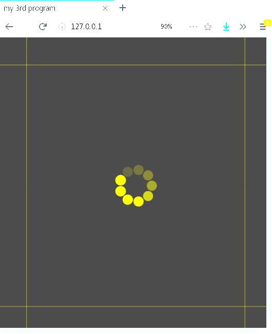
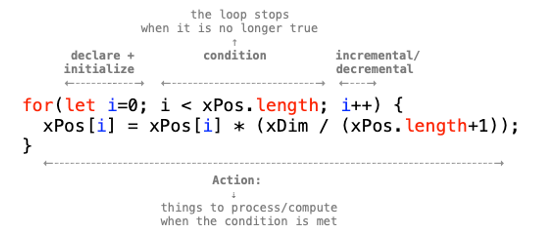

Title: 3. Infinite Loops
page_order: 3

## 3. Infinite Loops

### 3.1 Setup()


:    *Figure 3.0: Early alchemical ouroboros illustration with the words ἓν τὸ πᾶν ("The All is One") from the work of Cleopatra the Alchemist (10th Century)*

Loops offer alternative imaginaries, as for instance in the case of the ancient image of a snake or serpent eating its own tail. The *Ouroboros*, from the Greek, expresses the endless cycle of birth and death, and thus stands for the ability of processes to renew themselves infinitely. Aside from autocannibalism and alchemy, loops are related to procedures of control and automation, and are mirrored in repetitive procedures in everyday situations. The logic can be demonstrated in the following paradoxical word-play: "The next sentence is true. The previous is false".[^Hofstadter] In computer programming, a loop allows repeated execution of a fragment of source code that continues until a given condition is met, such as true or false. Indeed a loop becomes an infinite (or endless) loop if a condition never becomes false. 

It was mathematician and writer Augusta Ada Byron Lovelace who first introduced the concept of a programmatic loop in the early nineteenth century. She recognised that there were repeatable operations in the conceptual design of the first automatic, general-purpose computing machine ever designed, namely Charles Babbage's Analytical Engine. A loop which she called a 'cycle' appears in her "Note G" on the Analytical Engine,[^Ada] in which she describes the program procedures, also called the Bernoulli numbers program, as in the diagram below. It utilises two loops to indicate the repetition of a set of instructions with conditions,[^Kim] thereby minimizing efforts to write a repeatable operation in duplicate. 


:    *Figure 3.1: Diagram for the computation by the Engine of the Numbers of Bernoulli, from "Note G" by Ada Lovelace*

The idea of a loop in contemporary programming is highly influenced by these early insights into the handling of repeated machine operations expressed in a diagramatic manner. High-level programming languages such as `p5.js` include a loop function, allowing a fragment of source code to be repeatedly executed, as in the example of the `draw()` function that will run continuously until the program is stopped. We will continue with further examples but suffice to say that loops are among the most basic and powerful of programming concepts.

The example we use centrally in this chapter is the graphical spinning wheel icon of a so-called 'throbber'[^throbber] that indicates when a computer program is performing an action such as downloading content or performing intensive calculations. We find this to be an evocative symbol as it stands for the hidden processes and the complexity of multiple temporalities that are running during any given computational operation. We use this to guide the programming tasks, but also because it acts as a suitable cultural object for us to think through the idea of loops more conceptually. 

#### 3.1.1 Start()
We usually encounter the ubiquitous spinning icon during the loading and streaming of data content. It shows that a certain operation is in progress, but what exactly is happening and how long this will take is not at all clear. There is no indication of progress or status — as with a progress bar for instance. We see the icon spinning but it explains little about the background activities or timespan. By learning to program a throbber — and in turn *Asterisk Painting* by John P. Bell that creates a series of asterisks by repeatedly printing the number of milliseconds that have passed since the painting started — the idea is to gain insight into the way programming employs loop structures, and at the same time better understand some of the temporal operations of computational processes.  

### 3.2 Decode 
In this chapter we move from programming static objects such as shapes to a mixture of both static and moving objects. If we assume the shape to be a circle we join it up here, and spin it, as if it were eating its own tail. 

 
<iframe src="https://gitlab.com/siusoon/Aesthetic_Programming_Book/blob/master/sample_codes/p5_SampleCode/ch3_InfiniteLoops/sketch3_1/index.html"></iframe>
*Figure 3.2: The runme of sample code - sketch 3_1* 

By examining the RUNME (ref) of a simple throbber, can you describe the different elements and imagine how they operate computationally in your own words.

- **Speculation** 
    - Based on what you see/experience on the screen, describe:
        - What are the elements?
        - What is moving and not moving?
        - How many ellipses are there at the center?
        - Try to resize the window and see what happens?
    - Further questions:
        - how do you set the background color?
        - how does the ellipse rotate? 
        - how can you make the ellipse fade out and rotate to the next position?
        - how can you position the static yellow lines, as well as the moving ellipses?
- **Experimentation** 
    - Try to change some of the parameters e.g. `background()`, `framerate()`, `drawElements()`
    - There are some new functions used, can you check these out in the `p5.js` reference? (e.g. `push()`, `pop()`, `translate()`, `rotate()`)
- **Mapping** 
    - Map some of the elements from #1 at the source code level [don't get this? /g]
    - Can you identify the part/block of code that responds to the elements that you have speculated on earlier?
- **Technical questions/issues**
    - `let cir = 360/num*(frameCount%num);` <br> What does this line mean? (can check with [Golan Levin's tutorial](https://www.youtube.com/watch?v=r5Iy3v1co0A) on the modulo operator <span class="ref">(ref. https://www.youtube.com/watch?v=r5Iy3v1co0A)</span>. 
- **Other conceptual questions** 
    - Where do you often see this icon? 
    - What do you know about this icon? 
    - What can't you see? 
    
#### 3.2.1 Source Code

```javascript
//ch3_1
function setup() {
 createCanvas(windowWidth, windowHeight);   //create a drawing canvas
 frameRate (8);  //try to change this parameter
}

function draw() {
  fill(70,80);  //check this syntax with alpha value
  noStroke();
  rect(0, 0, width, height);
  drawElements();
}

function drawElements() {
  let num =9;
  push();
  translate(width/2, height/2); //move things to the center
  // 360/num >> degree of each ellipse' move; frameCount%num >> get the remainder that indicates the movement of the ellipse
  let cir = 360/num*(frameCount%num);  //to know which one among 8 possible positions.
  rotate(radians(cir));
  noStroke();
  fill(255,255,0);
  ellipse(35,0,22,22);  //the moving dot(s), the x is the distance from the center
  pop();

  stroke(255,255,0, 18);
  //static lines
  line(60,0,60,height);
  line(width-60,0,width-60,height);
  line(0,60,width,60);
  line(0,height-60,width,height-60);
}

function windowResized() {
  resizeCanvas(windowWidth, windowHeight);
}
```

### 3.3 Function

A function of code in p5.js starts with the syntax `function() {}`, containing "a self-contained section of code"[^Robinson] to peform a certain task. For the most basic built-in functions in p5.js, `setup()` and `draw()`, specifying the contained code in relation to a particular purpose as setting up the environment for running the program, as well as doing things over time. Other built-in function `windowResized()` in the provided sample code, which serves the purpose of re-adjusting the canvas size if there is any event of window resizing. The canvas size is not a fixed dimension but it is subjected to the window that you have adjusted as illustrate in the code: `createCanvas(windowWidth, windowHeight);`. These lines suggest that an event listener implements at the code level to not only run once, but *constantly* listening to events of window resizing specifically and it is similar to other listening events such as `mouseIsPressed()`. This is considered as asynchronicity, which means some other events occur concurrently with the main program flow like drawing shapes for this case. 

Apart from built-in functions, the sample code contains the custom-one called `function drawElements();` which is invoked by line 21: `drawElements();` within the `draw()` function. Defining a function is relatively simple in JavaScript with the keyword "function". From the function name "drawElements", one may get a sense of what this function does, which is mainly to draw ellipses and the two lines in a particular size, position and color, as well as making ellipses and lines to rotate in a clock-wise direction and statically stay at a position respectively. There are many ways to achieve drawing the same result especially with object-oriented approach but we are still in the early stage of learning to program, therefore we work on example that can do similar tasks that can be more aligned with our learning progress. Some of the code are intentionally written in a way that is less efficient but can serve the purpose of unfolding some of the key elements. 

Programmers like to split a big task into smaller operations and procedures, which is easier to structure, manage, debug, read and potentially collaborate with other programmers. In `function drawElements();`, the sample code is just simply seperate out from the function `draw()`, and clearly indicate this particular part of code relates to drawing the different elements on a screen. Of course one can also seperate out the drawing of ellipses and lines, and it is a subjective decision to decide how details you need to seperate the tasks.  

There is another type of function where you can specify with arguments passing to the function and receive a return value. See the example below:

```javascript
let x = sum(4, 3, 2);   
print(x);
function sum(a, b, c) { //passing values 4 as a, 3 as b, 2 as c to the function sum
  return a + b + c; //return statement 
}
```
    
    > output: 
    "9"

#### 3.3.1 Exercise in class
You can also try to type this in the console area `let x = sum(4, 3, 2); print(x); function sum(a, b, c) {return a + b + c;}` and it returns the number 9 as the output which has summed the values 4, 3 and 2. The arguments a, b and c are parameter variables. The function "sum" can be reused if you pass other values say another line of code `let y = sum(5,6,7);` and the return value of y would be 18. You may try to come up with your new functions and arguments to familiar with writing function. 

### 3.4 Transform
In general, the transform-related functions apply a 2D or 3D transformation to an element or object. For the provided sample code, there are two specific transformational functions have been used. 

1. `translate()`: This function allows you to move or displace objects within the display window. For example, moving the ellipses to center (`translate(width/2, height/2);`). The ellipse is drawn as `ellipse(35,0,22,22)` which takes in (35,0) as the x and y coordinates, where 22 is the size of it. If we don't have the upfront `translate()` function, the ellipse will be placed at the top left corner instead while the x coordinate value "35" is the distance of the circulating ellipses from the center position.
2. `rotate()`: By using the function `rotate()`, the object ellipse, in this sample code, will rotate at a certain angle. The default unit for rotation is radians. As such, the code is written as `rotate(radians(cir));`. `rotate()` takes in radians as the default mode and if you want to change to the degree mode, you can add the code `angleMode(DEGREES)`. 
In the most simple way, there are in total 9 ellipses (which is indicated as `let num=9;`), and each with a separation of 40 degrees each (i.e 0.968 rad) which is derived from 360/9. A circle has 360 degrees and to rotate the ellipse over time, it requires the time element to calculate when to move and how to move. This is how the function `frameCount` comes in, which counts the number of frames that have been displayed since the program started <span class="ref">(ref: https://p5js.org/reference/#/p5/frameCount)</span>. The line `let cir = 360/num*(frameCount%num);` illustrates the use of a modulo operation to find the remainder after division of one number by another. As such the value of the variable `cir` is only limited to the multiples of 40: 0, 40, 80, 120, 160, 240, 280 and 320. 

There are also other transform-related functions such as `scale()`, `shearX()`, `shearY()`. <span class="ref">(ref: https://p5js.org/reference/#group-Transform)</span> 

Further to the control of transformation, `push()` and `pop()` functions are commonly used to saves the current style and retores such setting respectively. Style such as color and setting such as rotate and translate. Let's explain with the except of code: 

```javascript
function drawElements() {
  let num =9;
  push();
  translate(width/2, height/2); //move things to the center
  // 360/num >> degree of each ellipse' move ;frameCount%num >> get the remainder that indicates the movement of the ellipse
  let cir = 360/num*(frameCount%num);  //to know which one among 8 possible positions.
  rotate(radians(cir));
  noStroke();
  fill(255,255,0);
  ellipse(35,0,22,22);  //the moving dot(s), the x is the distance from the center
  pop();

  stroke(255,255,0, 18);
  //static lines
  line(60,0,60,height);
  line(width-60,0,width-60,height);
  line(0,60,width,60);
  line(0,height-60,width,height-60);
}
```

The last three lines are about the drawing of two static yellow lines on the left and right side of the canvas. Logically speaking, the translate and rotate functions should also apply to these two lines but because the `pop()` function is in placed right after all the drawing of ellipses and such transform features, therefore, would not impact the lines. But if you move the line `pop()` till the end, then the two lines will also rotate and translate. This is to illustrate the idea of how `push()` and `pop()` could be used and where to place them does matter <span class="ref">(ref: https://p5js.org/reference/#/p5/push)</span>.

<div class="exercise" markdown="true">

### 3.5 Exercise in class

- This exercise is about structuring code. How would you restructure the sample code again so that it is easier for others to understand but maintaining the same visual outcome? There is no right or wrong answers but some pointers below might facilitate discussion: 
    - you may think of rename the function and add new functions
    - Instead of having `drawElements()`, may be we can have something like `drawThrobber()` and `drawLines()`?
</div>

### 3.6 Asterisk Painting 
So far we have discussed the transformation of objects with the sample code, but the throbber is moving repetitively and regularly through using syntaxes like `frameRate()` to slow down the number of frames that run per second, and `rotate()` to control the angle for each rotation. But more importantly with the `draw()` and `rect()` functions, it gives the illusion that the newly drawn ellipse fades over time and one after the after following the drawing of a semi-transparent rectangle background per frame.   

This section will move from repetition and regularity to repetition and difference. Artist and software developer John P. Bell has made an artwork called *Asterisk Painting* <span class="ref">(ref: http://www.johnpbell.com/asterisk-painting/)</span>, containing a lot of throbber-like spinning patterns, but each throbber (what he called asterisk) is spinning differently, in terms of how it spins, the variation of color and texture. Many syntaxes that Bell have used are related to time and temporality, for example the setting up of a timer, the calculation of current millis, the speed of rotation, the waiting time for starting the new cycle, etc. Even for the visual outcome, what constitute an asterisk is not a shape, but a series of number which refers to the milliseconds counter that will line up as a straight line. (See Figure 3.3 for the visual outcome)

<br>
*Figure 3.3 : Aesterisk Painting (2014) by John P. Bell*

According to Bell, 
>  “Asterisk Painting is programmed to create a series of asterisks by repeatedly printing the number of milliseconds that have passed since the painting started. If left to run by itself it will do so; however, when started on a system with other threads running in the background delays external to my artwork may make the asterisks look more like spots and the painting may resemble the work of certain other overly-litigious artists.”

### 3.7 Source code 
The original piece was written in Processing by John P.Bell and it has been modified and ported to p5.js by Winnie Soon

```javascript
/*
Asterisk Painting by John P.Bell (http://www.johnpbell.com/asterisk-painting/)
Original code in Processing: http://wg18.criticalcodestudies.com/index.php?p=/discussion/31/week-2-critical-and-creative-coding-calvinball-and-coders#latest
Port to p5js and modified by Winnie Soon with comment notes. Last update: 12 Oct 2019

notes:
1. The color mode has been changed to a variable as the push/pop function will restore the previous fill color state.
2. Remove font
3. change the bg color
4. add text size
5. remove load signature image
6. change the canvas size and corresponding no. of asterisk
7. display a counter on the bottom left corner and in black color
8. Add extensive comments
9. return a random no in integer
*/

let xDim = 1000;  //canvas size-width
let yDim = 600;   //canvas size-height
let timer=0;
let speed=100;  //the speed of rotating , default 100
let maxSentences = 77;  //original: 77
let sentences = 0;
let xPos = [1,2,3,4,5]; //original: 8 columns
let yPos = [1,2,3,4]; //original: 5 rows
let xCtr = 0;
let yCtr = 0;
let waitTime = 10000;
let itr = 0; // no. of iteration
let milliStart = 0;
let currentMillis;
let fillColor;

function setup(){
  createCanvas(xDim, yDim);
  background(240);
  for(let i=0; i<xPos.length; i++) {  //calculate the position of each asterisk horizontally as an array that starts with array index[0]
    xPos[i] = xPos[i] * (xDim / (xPos.length+1));
  }
  for(let i=0; i<yPos.length; i++) {  //calculate the position of each asterisk vertically as an array that starts with array index[0]
    yPos[i] = yPos[i] * (yDim / (yPos.length+1));
  }
  fill(0);  //counter color at the bottom left
  textAlign(LEFT, CENTER);
  text(itr, 10, yDim-30); //display counter
  fillColor = color(floor(random(0,255)), floor(random(0,255)), floor(random(0,255)));
}

function draw(){
     currentMillis = floor(millis() - milliStart);  //millis means millsecond since starting the program, like frameCount
     if(currentMillis > timer){
       translate(xPos[xCtr], yPos[yCtr]);  //rows and cols
       rotate(radians((360/8)* (millis()/speed)));  //rotate in itself
       timer = currentMillis + speed; //the time for the next loop
       textSize(12);
       //nf:format numbers into strings and adds zeros in front [https://p5js.org/reference/#/p5/nf]  3 digits in front and 0 digit after the decimal
       fill(fillColor);
       text(nf(currentMillis, 6), 3, 0);  //which is about the time string written as the asterisk, and it starts with 0 always.
       sentences++;
       if(sentences >= maxSentences){  //reach the max for each asterisk
         xCtr++;  //move to next array

         if(xCtr >= xPos.length) {  //meet max cols, and need to go to next row
           xCtr = 0;
           yCtr++;  //next row
           //the screen is filled > reset everything and update the counter
           if(yCtr >= yPos.length){  //reach the max no of rows on a screen (after reach the no. of max cols)
             yCtr = 0;
             background(240);
             itr++;  //add counter (iteration)
             pop();
             fill(0);   //counter's display color
             text(itr, 10, yDim-30);  //change counter display again
             let wait = floor(millis() + waitTime);  //wait for next round
             while(millis() < wait){}  // Just wait for resetting
             milliStart = millis(); //reset the starting time
             timer = 0; //reset the timer
             push();
           }
         }
        sentences = 0;
        fillColor = color(floor(random(0,255)),floor(random(0,255)),floor(random(0,255)));
       }
       pop();  //restore previous state
     }
}
```

### 3.8 Exercise in class 

- Try to run the *Asterisk Painting* [here](https://gitlab.com/siusoon/Aesthetic_Programming_Book/blob/master/sample_codes/p5_SampleCode/ch3_InfiniteLoops/index.html)
- Try reading the source code above 
- Using the decoding method that we have introduced earlier in this chapter, try to speculate, experiment and map your thoughts with the source code.  
    - *Speculation:* Describe what see/experience on the screen? 
        - What are the elements on the screen?
        - How many asterisks on the screen and how are they arranged?
        - What are moving and how they move? 
        - What each asterisk spins/rotates and when it stops to create a new one? 
    - *Experimentation:* Change some of the code parameters
        - Try to change some of the parameters e.g the values of the written global variables
        - What are the new syntax and functions that you do not know? (Can you check it out in the p5.js reference?)
    - *Mapping:* Map of of the elements from speculation to the source code level 

### 3.9 Arrays 

To be able to fully understand the source code, you only need a few more fundamental concepts of programming. The first one is *Array*, which is commonly understood as a list of data and is related to previous concepts such as variable and data types. If we need to work with a chunk of data, such as a collection of words, you can use arrays instead of making a number of separate variables. For example:

```javascript 
//example
let words = [] //array -> start with 0
words[0] = "what";
words[1] = "is";
words[2] = "array";
print(words[2]); //output: is
print(words.length); //output: 3
```

Recalling our previous approach using variables, we can follow a similar structure:

1. *Declare:* Think of a name you want to use to store the list of values. The symbol [] in `let words = []` indicates words is an array but how many is unknown and hasn't been specified with just this line of code.
2. *Assign:* Given the example above, there are three text values to store: "what", "is", and "array". Since array is a list of values and it is needed to be identified individually, an array index is used to represent the position of each piece of data in an array. It starts with [0] as the first item, then [1] as the second, and so forth. Therefore `words[0] ="what"` means that the first index item of the array words is a string and with the value "what".  
3. *Re(use):* The `print()` function is just an example to indicate how you may retrieve and use the data, you can print it in the console area, or you can arrange to draw on a canvas. 

Tho ask how many items in an array, the syntax `arrayname.length` is used. 

Let's see the sample below from *Asterisk Painting*:

```javascript 
//sample from Asterisk Painting e.g. line 25-26
let xPos = [1,2,3,4,5];
let yPos = [1,2,3,4];
```

This is a slightly different way of declaring an array. It combines both declaration and assignment into one line to both declare the array names as xPos and yPos and then assigns the numberic values into the array index, which refers to the number of column and row respectively. Think about like this: the program needs to know how many asterisks should be drawn on the screen before going to the next row and when to restart everything again. 

As the array index starts with [0], therefore each index has mapped the value in this way:  

`let xPos = [1,2,3,4,5];` -> 
`xPos.length: xPos[0] = 1, xPos[1] = 2, xPos[2] = 3, xPos[3] = 4, xPos[4] = 5`

`let yPos = [1,2,3,4];` -> 
`yPos.length: ypos[0] = 1, yPos[1] = 2, yPos[2] = 3, yPos[3] = 4`

Other methods for an array might be useful:
- `array.push(value)` (ref:https://developer.mozilla.org/en-US/docs/Web/JavaScript/Reference/Global_Objects/Array/push) : To add a value to the end of the array. Example: `xPos.push(6)` - this will extend the index to xPos[5] = 6. 
- `array.splice()` (ref: https://developer.mozilla.org/en-US/docs/Web/JavaScript/Reference/Global_Objects/Array/splice): This is to remove a range of an array index, or remove the existing index and replace with new indexes with other values. 

### 3.10 Conditional statements 
Conditional statements are very useful as they allow you to set a different decision path by specifying conditions. Indeed, a conditional decision is something not only specific to programming. In the everyday life, for instance, you might say "If I am hungry, then I'll eat some food, otherwise if I am thirsty, then I will drink some water, else I will just take a nap". 

```javascript
//example in human language
if (I am hungry) { 
  eat some food;
} else if(thirsty) {
  drink some water;
} else{
  take a nap;
}
```

The above is *pseudocode* to demonstrate what making an everyday decision to eat or drink might look like in programming. The keyword and syntax `if` is then followed by the condition and checks whether a certain condition holds. As such, the whole if statement is a *Boolean expression* — one of two possible values is possible, true or false, leading to a different path and action. In computer science, the Boolean data type is a data type that has one of two possible values which is intended to represent the two truth values of logic.

Referring back to the work *Asterisk Painting* (especially line 62), it follows the conditional logic (if-then) built into the program in order that it knows when to move to the next position of the painting. 

```javascript
//sample from Asterisk Painting, see line 62:
if(sentences >= maxSentences){  //if the existing sentence count reaches the max sentence for the asterisk painting
   move to the next one and continues;
}
```

The value of the variable `maxSentences` is 77 (refer to line 22 from the source code), therefore each asterisk contains 77 sentences (which is in the form of a line that contains numbers). The other variable `sentences` counts for each line and the program will check if the current `sentences` has reached its maximum scope. **If** the asterisk reaches 77 sentences **then** it will move to the next one and the `sentences` counter will be reset to 0 (line 84) and count again. The logic repeats and loops again within the `draw()` function. 

#### 3.10.1 Relational operators 
When you have to create your own conditional statement with the if-then format, there are multiple combinations you can work on to form a more complex expression. For example, you can have many different cases using the syntax `else if`, or a combinaton of logical operators, such as the AND case here in another pseudocode example: 

```javascript 
if (I am hungry) && (I am in a good mood) {
    print("go out");
}
```

Here is a list of relational operators and logical symbols that can be used in conditional statements. 

```
/* 
Relational Operators: 
>   Greater than
<   Less than
>=  greater than or equal to
<=  less than or equal to
==  equality
=== equality (include strict data type checking)
!=  not equal to
!== inequality with strict type checking
*/

/*
Logical Operators: boolean logic:
&&  logical AND
||  logical OR
!   logical NOT
*/

/*
Example: 
if () {
  //something here
}else if() {
  //something here
}else{
  //something here
}
*/
```

### 3.11 Loops 
The core concept of a loop is that you can execute a block of code many times. For example if you have to draw 100 lines that are placed vertically one after the other, you can of course write 100 lines of code using the syntax: `line()`. A *for-loop* provides an efficient way to draw the line 100 times by setting a conditional structure, counting the number of lines that have been drawn and counting the maximum lines.

To structure a for-loop, you need to ask yourself:

- What are the things/actions that you want to loop, to repeat in a sequence or pattern?
- More specifically, what is the conditional logic, and when do you want to exit the loop?
- What do you want to do when this condition is/is not met?

See below example taken from the source code of *Asterisk Painting* (lines 37-42):

```javascript
  for(let i=0; i<xPos.length; i++) {
    //calculate the position of each asterisk horizontally as an array that starts with array index[0] 
    xPos[i] = xPos[i] * (xDim / (xPos.length+1));
  }
  for(let i=0; i<yPos.length; i++) {  
   //calculate the position of each asterisk vertically as an array that starts with array index[0] 
    yPos[i] = yPos[i] * (yDim / (yPos.length+1));
  }
```

See the structure of a for-loop:<br>
<!--  -->
 <br>
*Figure 3.4 A for-loop*  (will redraw it with graghviz - /w)

From Figure 3.4, you can see what a for-loop contains:

1. *A variable declaration and initialization*: Usually starts with 0
2. *A specificed condition*: The criteria to meet the condition
3. *Action*: The things that you want to process/compute when the condition is met
4. *Loop for next*: For the next iteration (usually incremental/decremental)

For this specific case, this block of code from the above example describes the position of each asterisk in terms of its x and y coordinates (the center point [x,y] of each asterisk). Since there are 5 columns (xPos) and 4 rows (yPos) which have been defined in global variables, the program needs to know the coordinates precisely. The overall formula to locate the position, for example xPos, is to get the width of the canvas to divide by the number of asterisks horizontally and add 1. As such, the code can be understood in this way: For each count with the starting point as 0, calculate the `xPos[i]`. Additionally, each iteration will increase the count by one until it reaches the maximum number of asterisks in a row (`i<xPos.length`). 

<!--  -->
 <br>
*Figure 3.5 The xPos of each* </br>

#### 3.11.1 While Loop
While loop is another type of loop for executing iterations. The statement is executed until the condition is true, it will stop as soon as it is false. 

For example, `while(millis() < wait){}` in line 77 tells the computer to do nothing if the value of `millis()` <span class="ref">(ref: https://p5js.org/reference/#/p5/millis, this is a p5.js syntax, returning the number of milliseconds since the staring the program. It is similar to frameCount but it is count by miniseconds)</span> is smaller than the value of the `wait` variable. Once the condition is false (i.e `millis()` is not longer small than `wait`), the loop will be ended and the program can proceed to the next line. This example is located towards the end of the program when all the asterisks are drawn but need to wait for a certain time to reset the canvas and restart drawing again. Therefore, this while-loop serves the purpose of a pause sign, freezing the program from running because there is literaly nothing between the opening and closing brackets.  

## While()

As we have established loops execute a block of code as long as a specified condition is true. In this closing section to the chapter it seems appropriate to emphasise that while-loops allow code to be executed repeatedly based on a given condition like this. The while-loop can be thought of as a repeating *if* statement and so a good way to challenge conventional structures of linear time and how computers understand time differently from humans. Programming challenges many of our precepts of how we consider time to be organised and we hope it is already clear that machine-time operates at a different register, and what it means to begin and end a given process. 

In “The Computer as Time-Critical Medium”,[^Chrono] Wolfgang Ernst clarifies the ontological importance of time to the computer for it to operate and for it to perform tasks. He points to key issues of programmability, feedback and recursion at the level of programming languages in ways that we hope resonate with the examples we have worked through above.[^Chrono2] Precise technical detail is crucially important for the argument, and his example is how the clock signal emphasises that “time counts” (as he puts it). The media archaeology of Ernst, and particularly his concept of *micro-temporality*, is useful to us as it draws attention to temporality in programming in ways that many of the discussions of software have tended to overlook, and furthermore how in a philosophy of time the technical layer tends to be dismissed as deterministic.[^Bergson] 

Loops offer alternative perspectives and imaginaries on time. In his conference paper “... Else Loop Forever”, Ernst develops this discussion in relation to “untimeliness”.[^Else] He draws on the infamous “halting problem” that underpins Turing computation and refers to the problem of whether a computer program, given all possible inputs, will finish running or continue to run forever. In his 1936/37 essay “On Computable Numbers, with an Application to the Entscheidundsproblem,” it was Turing’s assertion that a general algorithm to solve the halting problem was not possible and this led to the mathematical definition of a computer and program, which became known as a Turing machine.[^Turing] This problem of decision, or ending as Ernst puts it, underscores broader notions of algorithmic time and the way the computer forever anticipates its own sense of never ending in an endless loop. 

Contrary to the traditional narrative — with beginning, middle and end – Ernst points out that a computational recording can be re-enacted endlessly: "with no internal sense of ending"; as a "time-critical condition".[^Else2] That there can be no happy ending allows Ernst to elaborate on new temporal structures that no longer are aligned to traditional narrative structures or the terminal logic of the *end of history*.[^End] Temporal complexity is further developed by referring back to Turing’s speculation on artificial intelligence and whether a finite-state machine can be aware of its ‘conscious’ state at a given time and whether a sense of ending is necessary in order to be functional. It is clear that finite state machines are procedural, in that they operate linear sequences of discrete events in time like clockwork, but as Ernst reminds us: “There is no automatic procedure which can decide for any program, if it contains an endless loop or not.”[^Else3] 

Making reference to Martin Heidegger’s ‘being-in-time’,[^Heidegger] and the knowledge of the end of life that inscribes a temporal sense of what it means to be a human being, Ernst says: “Humans live with the implicit awareness that their death is already future in the past.”[^Ernst4] This looped deferral of ending is ontologically exacerbated with computation, unfolding the ending of being as a time-critical condition for both humans and machines alike. Leaving aside a deeper discussion of the philosophy of Heidegger, the importance of this for the discussion of loops seem to activate the complexity of lived time. Programming manages to provides insights here and creative opportunities such as in the case of live coding where programmers interact with a running system that is not stopped while waiting for new program statements. We can even begin to speculate on how software is not only synchronized with lived time but actually produces it. We might go as far as to say that programming allows for a critical understanding of how technologies play a crucial role in our ordering and experience of time, not only how we model it, but how we can forge new beginnings and endings. 

<div class="exercise" markdown="true">

## Mini_Exercise[3]: Designing a throbber 
**Objective:**

- To reflect upon time and temporality in digital culture via the throbber icon.
- To experiment various computational syntax and effects of animation and transformation.

**Get some additional inspiraton here:**

Check out other works regarding a throbber and how other people contextualize the thinking:  

- [Loading](https://festivalenter.wordpress.com/2009/04/09/electroboutique-by-alexei-shulgin-roman-minaev-aristarkh-chernyshev/) by Electroboutique:
- [LOADING (THE BEAST 6:66/20:09)](https://www.yugo.at/processing/archive/index.php?what=loading) by Gordan Savičić
- [Fedora’s artwork team](https://fedoraproject.org/wiki/Artwork/ArtTeamProjects/Fedora7Remix/Rhgb/Throbber) produces a series of throbber images that put emphasis on the design of spinning.
- [DVD guy by Constant Dullaart](https://www.youtube.com/playlist?list=PLCUGKK4FUkbMdnNii8qoRy9_tMvqE8XHB), with the contextualization by Panke Gallery in Berlin http://www.upstreamgallery.nl/news/545/constant-dullaart-solo-show-nein-gag-at-panke-gallery-berlin 
- [Throb 2018. 2019 by Winnie Soon](http://siusoon.net/throb/)

**Task (RUNME):**
- Redesign and program an *animated/moving* throbber.

**Questions to think about as README:**

- **Describe** about your throbber design, both conceptually and technically.
    -  What are the time-related syntaxes/functions that you have used in your program? and why you use in this way? How is time being constructed in computation (can refer to both reading and your process of coding)?
    - Think about a throbber that you have encounted in digital culture e.g streaming video on YouTube or loading latest feeds on Facebook or waiting a ticket transaction, what do you think a throbber tells us, and/or hides, about? How might we think about this remarkable throbber icon differently?
</div>


## 3.12 Required reading

- Shiffman, Daniel. Courses 3.1, 3.2, 3.3, 3.4, 4.1, 4.2, 5.1, 5.2, 5.3, 7.1, 7.2, *Code! Programming with p5.js* on [YouTube](https://www.youtube.com/watch?v=1Osb_iGDdjk), 2018 [Accessed 9 Sep. 2019]. (practical usage on conditional statements, loops, functions and arrays)
- Winnie Soon, "Throbber: Executing Micro-temporal Streams", *Computational Culture*, 2019.
- Close reading on the work *Asterisk Painting* by John P. Bell, ported to p5.js, and modified, by Winnie Soon 

## 3.13 Further reading

- Wilfried Hou Je Bek, "Loop", *Software Studies* (Fuller, Matthew, ed.), MIT Press, 2008.
- Robinson, Derek. "Function", *Software Studies* (Fuller, Matthew, ed.), MIT Press, 2008.
- Farman, Jason. "Fidget Spinners", *Real Life*, 2017.
- Wolfgang Ernst, “‘... Else Loop Forever’. The Untimeliness of Media” (2009). Available at [https://www.medienwissenschaft.hu-berlin.de/de/medienwissenschaft/medientheorien/downloads/publikationen/ernst-else-loop-forever.pdf](https://www.medienwissenschaft.hu-berlin.de/de/medienwissenschaft/medientheorien/downloads/publikationen/ernst-else-loop-forever.pdf).

## Notes:
[^Hofstadter]: Further examples of paradox, recursion and strange loops can be found in Douglas R. Hofstadter's' *Gödel, Escher, Bach: An Eternal Golden Braid* (New York: Basic Books, 1999).
[^Ada]: For an account of "Note G", see Joasia Krysa's *Ada Lovelace* 100 Notes-100 Thoughts Documenta 13 (Berlin: Hatje Cantz Verlag, 2011).
[^Kim]: Eugene Eric Kim and Betty Alexandra Toole, "Ada and the First Computer", *Scientific American* 280 (5) (1999), 78. 
[^throbber]: It is also interesting to note that the term 'throbber' is a derogatory term, meaning a stupid person, not unlike 'git' as described in the opening chapter. 
[^Robinson]: Derek Robinson, "Function", in Matthew Fuller, ed. *Software Studies* (London: MIT Press, 2008), 101.
[^Chrono]: Wolfgang Ernst, *Chronopoetics: The Temporal Being and Operativity of Technological Media* (London: Rowman & Littlefield International, 2016), 63-95.
[^Chrono2]: Ernst, *Chronopoetics*, 63.
[^Bergson]: ADD EXAMPLE.
[^Else]: Wolfgang Ernst, “‘... Else Loop Forever’. The Untimeliness of Media” (2009). Available at https://www.medienwissenschaft.hu-berlin.de/de/medienwissenschaft/medientheorien/downloads/publikationen/ernst-else-loop-forever.pdf.
[^Turing]: Alan M. Turing, “On Computable Numbers, with an Application to the Entscheidungs problem”, *Proceedings of the London Mathematical Society* (1936/1937). 42: 230–265. 
[^Else2]: Ernst, “‘... Else Loop Forever’. The Untimeliness of Media”.
[^End]: ADD NOTE
[^Else3]: Ernst, “‘... Else Loop Forever’. The Untimeliness of Media”.
[^Heidegger]: ADD NOTE.
[^Else4]: Ernst, “‘... Else Loop Forever’. The Untimeliness of Media”.

