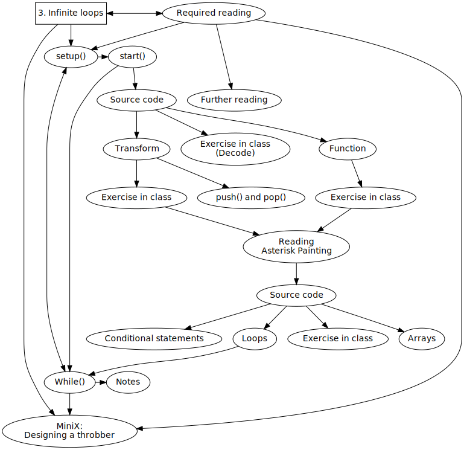
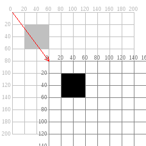

Title: 3. Infinite Loops
page_order: 3

## 3. Infinite Loops


## setup()


*Figure 3.1: Early alchemical ouroboros illustration with the words ἓν τὸ πᾶν ("The All is One") from the work of Cleopatra the Alchemist (10th Century)(image from Wikipedia)*

Loops offer alternative imaginaries, as for instance in the case of the ancient image of a snake or serpent eating its own tail. The *Ouroboros*, from the Greek, expresses the endless cycle of birth and death, and thus stands for the ability of processes to renew themselves infinitely. Aside from references to autocannibalism and alchemy, loops are related to procedures of control and automation, and are mirrored in repetitive procedures in everyday situations. The logic can be demonstrated in the following paradoxical word-play: "The next sentence is true. The previous is false".[^Hofstadter] In computer programming, a loop allows repeated execution of a fragment of source code that continues until a given condition is met, such as true or false. Indeed a loop becomes an infinite (or endless) loop if a condition never becomes false.

It was mathematician and writer Augusta Ada Byron Lovelace who is one of the first to introducing and illustrating the concept of a programmatic loop in the early nineteenth century. She recognised that there were repeatable operations in the conceptual design of the first automatic, general-purpose computing machine ever designed, namely Charles Babbage's Analytical Engine. A loop which she called a 'cycle' appears in her "Note G" on the Analytical Engine,[^Ada] in which she describes the program procedures, also called the Bernoulli numbers program, as in the diagram below. It utilises two loops to indicate the repetition of a set of instructions with conditions,[^Kim] thereby minimizing efforts to write a repeatable operation in duplicate. As such, loops addresses repeatable and operational time.


*Figure 3.2: Diagram for the computation by the Engine of the Numbers of Bernoulli, from "Note G" by Ada Lovelace*

The idea of a loop in contemporary programming is highly influenced by these early insights into the handling of repeated machine operations expressed in a diagramatic manner. High-level programming languages such as p5.js include this loop concept, allowing a fragment of source code to be repeatedly executed, as in the example of the `draw()` function that will run continuously until the program is stopped or using the syntax `noLoop()`. We will continue with further examples but suffice to say that loops are among the most basic and powerful of programming concepts.

The example we use centrally in this chapter is the graphical spinning wheel icon of a preloader or so-called "throbber"[^throbber] that indicates when a computer program is performing an action such as downloading content or performing intensive calculations. We find this to be an evocative symbol as it illuminates the discrepancy between what we seems to know and what we don't know behind this icon with hidden human-machine labour processes and the complexity of multiple temporalities that are running during any given computational operation.[^screensaver] It is also a good visual icon that is running repeatedly in a loop for us to contemplate how perceptible streams and computational logics are entangled, and that changes the way how we experience the now via digital medium.[^soon] As we are moving away from static objects to moving pieces, we use this animated throbber to guide the programming tasks in thinking about transformation (such as rotation and translation) but also because it acts as a suitable cultural object for us to think through the idea of loops and the related temporal elements and syntax more conceptually.

### start()
We usually encounter the ubiquitous spinning icon during the loading and streaming of data content. It shows that a certain operation is in progress, but what exactly is happening and how long this will take is not at all clear. There is no indication of progress or status — as with a progress bar for instance. We see the icon spinning but it explains little about the background activities or timespan. By learning to program a throbber — and in turn *Asterisk Painting* by John P. Bell that creates a series of asterisks by repeatedly printing the number of milliseconds that have passed since the painting started — the idea is to gain insight into the way programming employs transformational movement and loop structures, and at the same time better understand some of the temporal operations of computational processes.  

### Decode
In this chapter we move from programming static objects such as shapes to a mixture of both static and moving objects. If we assume the shape to be a circle we join it up here, and spin it, as if it were eating its own tail.


*Figure 3.3: The runme of sample code - sketch 3_1*

[RUNME](https://siusoon.gitlab.io/Aesthetic_Programming_Book/p5_SampleCode/ch3_InfiniteLoops/sketch3_1/)

Can you describe the different elements and imagine how they operate computationally in your own words.

1. **Speculation**
    - Based on what you see/experience on the screen, describe:
        - What are the elements? Come up with a list of features.
            - What is moving and not moving?
            - How many ellipses are there at the center?
            - Try to resize the window and see what happens?
    - Further questions:
        - how do you set the background color?
        - how does the ellipse rotate?
        - how can you make the ellipse fade out and rotate to the next position?
        - how can you position the static yellow lines, as well as the moving ellipses in a single sketch?
2. **Experimentation**
    - Try to change some of the parameters e.g. `background()`, `framerate()`, the variables inside `drawElements()`
    - There are some new functions used, can you check these out in the `p5.js` reference? (e.g. `push()`, `pop()`, `translate()`, `rotate()`)
3. **Mapping** with physical source code print
    - Map some of the findings/features from the *Speculation* that you have done with the source code. Which block of code relates to your findings?  
    - Can you identify the part/block of code that responds to the elements that you have speculated on earlier?
4. **Technical questions/issues**
    - `let cir = 360/num*(frameCount%num);` <br> With the modulo operator[^modulo] (%) that computes the remainder after division, what does this line mean and do?
5. **Other conceptual questions**
    - Where do you often see this icon?
    - What do you know about this icon?
    - What can't you see?

## Source Code

```javascript
//ch3_1
function setup() {
 createCanvas(windowWidth, windowHeight);   //create a drawing canvas
 frameRate (8);  //try to change this parameter
}

function draw() {
  background(70, 80);  //check this syntax with the alpha value
  drawElements();
}

function drawElements() {
  let num =9;
  push();
  translate(width/2, height/2); //move things to the center
  // 360/num >> degree of each ellipse's movement; frameCount%num >> get the remainder that indicates the movement of the ellipse
  let cir = 360/num*(frameCount%num);  //to know which one among 8 possible positions.
  rotate(radians(cir));
  noStroke();
  fill(255,255,0);
  ellipse(35,0,22,22);  //the moving dot(s), the x is the distance from the center
  pop();

  stroke(255,255,0, 18);
  //static lines
  line(60,0,60,height);
  line(width-60,0,width-60,height);
  line(0,60,width,60);
  line(0,height-60,width,height-60);
}

function windowResized() {
  resizeCanvas(windowWidth, windowHeight);
}
```

### Function

A function of code in p5.js starts with the syntax `function() {}`, containing "a self-contained section of code"[^Robinson] to peform a certain task. For the most basic built-in functions in p5.js are `setup()` and `draw()`, specifying the contained code in relation to a particular purpose as setting up the environment for running the program, as well as doing things over time. Other built-in functions such as `windowResized()` in the provided sample code serves the purpose of re-adjusting the canvas size if there is any event of window resizing. The canvas size is not set in a fixed dimension but it is subjected to the window that you have adjusted as illustrated in the code, which has been also discussed in the previous chapter: `createCanvas(windowWidth, windowHeight);`. The function of `winowResized()` suggests that an event listener implements at the code level to not only run once, but *constantly*, listening to events of window resizing specifically and similar to other listening events such as `mouseIsPressed()` that has been introduced in the last chapter. This function of `windowResized()` is considered as asynchronous, which means some other events occur concurrently with the main program flow such as drawing shapes in this case.

Apart from built-in functions, the sample code contains the custom-one `function drawElements();` which is invoked by line 21: `drawElements();` within the `draw()` function. Defining a function is relatively simple in JavaScript with the keyword "function" then follow by a function name that you want to put. From the function name "drawElements", you can get a sense of what this function does, which is mainly to draw ellipses and draw the two lines in a particular size, position and color, as well as making ellipses and lines to rotate in a clock-wise direction and statically remain at a position respectively. There are many ways to achieve drawing the same result especially with an object-oriented approach but we are still in the early stage of learning to program, and therefore we work on an example that can do similar tasks but that can align with our learning progress. With this in mind, some of the code is intentionally written in a way that is less efficient but serves the purpose of unfolding key concepts.

Programmers like to split a big task into smaller operations and procedures, so they are easier to structure, manage, debug, read and more open to collaboration with other programmers. In `function drawElements();`, the sample code is simply separated out from the function `draw()`, and in this way clearly indicates that this particular part of the code relates to drawing the different elements on a screen. Of course you can also separate out the drawing of ellipses and lines, and it is a subjective and situated decision to decide how best to separate out the different tasks.  

There is another type of function where you can specify tasks with arguments that are passed to the function and receive a return value. See the example below:

```javascript
let x = sum(4, 3, 2);   
print(x);
function sum(a, b, c) { //passing values 4 as a, 3 as b, 2 as c to the function sum
  return a + b + c; //return statement
}
```

    > output:
    "9"

<div class="exercise" markdown="true">

### Exercise in class
You can also try to type/copy the above code in your own sketch and it will return the number "9" as the output because this is the result of the sum of the values 4, 3 and 2. The arguments a, b and c are parameter variables. The function "sum" can be reused if you pass other values as for instance another line of code `let y = sum(5,6,7);` and the return value of y would be 18. You can try to come up with your new functions and arguments.
</div>

### Transform
In general, the transform-related functions apply a 2D or 3D transformation to an element or object. For the provided sample code, there are two specific transformational functions have been used to move the canvas and created an illusion of objects transformation. (This is important to know the transformation is done at the level of canvas background but not at the individual shape/object).



*Figure 3.4: Moving the coordinate system at the canvas level (image from processing.org)*

1. `translate()`: This function displaces/moves objects within the display window. For example, moving the canvas to the center will position the whole sketch at the center too (`translate(width/2, height/2);`). The ellipse is drawn as `ellipse(35,0,22,22)` which takes in (35,0) as the x and y coordinates, where 22 is the size. If we don't have the upfront `translate()` function, the ellipse will be placed at the top left corner instead (while the x coordinate value "35" is the distance of the circulating ellipses from the center position). By moving the coordinate origin to the middle via the `translate()` function, then you see the ellipses now place in the middle of the canvas, in which the coordinate orign (0,0) has moved to the center of the screen instead.  
2. `rotate()`: By using the function `rotate()`, in this sample code, the object ellipse will rotate at a certain angle. The default unit for rotation is radians. As such, the code is written as `rotate(radians(cir));`. The function `rotate()` takes in radians as the default mode, and if you want to change to the degree mode, you add the code `angleMode(DEGREES)`.

There are in total 9 ellipses (which is indicated as `let num=9;`), and each comes with a separation of 40 degrees (i.e 0.968 rad) which is derived from 360/9. A circle has 360 degrees and to rotate the ellipse over time, it requires the time element to calculate when, how and where to move. This is how the function `frameCount()` comes in, which counts the number of frames that have been displayed since the program started.[^ref] The line `let cir = 360/num*(frameCount%num);` illustrates the use of a modulo operation to find the remainder after the division of one number by another. As such the value of the variable `cir` is only limited to the multiples of 40: 0, 40, 80, 120, 160, 240, 280 and 320. With the `cir` value, then the program will follow such a sequence over time to rotate one after the other based on the original position and repeats continously.  

There are also other transform-related functions such as `scale()`, `shearX()`, `shearY()`.[^ref2]

In addition `push()` and `pop()` functions are commonly used to save the current style and restore settings respectively. Style such as color and a setting such as rotate and translate. The following excerpt of code will help to explain:

```javascript
function drawElements() {
  let num =9;
  push();
  translate(width/2, height/2); //move things to the center
  // 360/num >> degree of each ellipse' move ;frameCount%num >> get the remainder that indicates the movement of the ellipse
  let cir = 360/num*(frameCount%num);  //to know which one among 8 possible positions.
  rotate(radians(cir));
  noStroke();
  fill(255,255,0);
  ellipse(35,0,22,22);  //the moving dot(s), the x is the distance from the center
  pop();

  stroke(255,255,0, 18);
  //static lines
  line(60,0,60,height);
  line(width-60,0,width-60,height);
  line(0,60,width,60);
  line(0,height-60,width,height-60);
}
```

The last four lines describe the drawing of the static four yellow lines. Logically speaking, the translate and rotate functions should also apply to these lines but because the `pop()` function is placed right after all the drawing of ellipses and as such it does not impact the lines. But if you move the line `pop()` to the end, then the lines will also rotate and translate. This illustrates how `push()` and `pop()` might be used and how their placement matters.[^ref3]

<div class="exercise" markdown="true">

### Exercises in class
1. Change the parameters and values, as well as the position/sequence of the sample code to understand the functions and syntaxes like the variable `num`, the transformational functions like `translate()` and `rotate()`, as well as holding and restoring current style and transformations like `push()` and `pop()`.

2. We have explained how to use `rotate()` to displace the ellipse in different angles, but how about the fading in and out of each ellipse in the sketch? (Hints: Since this is repeatedly faded in and out, the `background()` syntax under the function `draw()` as the key element to produce such effects.)

3. This exercise is about structuring code. How would you restructure the sample code so that it is easier for others to understand but still maintain the same visual outcome? There are no right or wrong answers but some pointers below might facilitate discussion:
    - You may rename the function and add new functions
    - Instead of having `drawElements()`, you might have something like `drawThrobber()` and `drawLines()`?
</div>

## Asterisk Painting

The following section will move from repetition and regularity to repetition and difference. Artist and software developer John P. Bell has made an artwork called *Asterisk Painting*,[^Bell] containing a number of throbber-like spinning patterns, but each throbber (or what he calls asterisk) is spinning differently, with variations of color and texture. Many syntaxes that Bell has used are related to time and temporality, for example the setting up of a timer, the calculation of current milliseconds, the speed of rotation, the waiting time for starting a new cycle, and so on. Even for the visual outcome, what constitutes an asterisk is not a geometric shape, but a series of numbers which refer to the milliseconds counter that lines up as a straight line.

<br>
*Figure 3.5 : Asterisk Painting (2014) by John P. Bell*

According to Bell,
>  “Asterisk Painting is programmed to create a series of asterisks by repeatedly printing the number of milliseconds that have passed since the painting started. If left to run by itself it will do so; however, when started on a system with other threads running in the background delays external to my artwork may make the asterisks look more like spots and the painting may resemble the work of certain other overly-litigious artists.”

### Source code
The original piece was written in Processing and has been modified and ported to p5.js. It is a much more complex program from the first one but we still want to include this as an addition to this chapter, and be able to see the potential to further develop a looping sketch and reflect deeper on the notion of infinite loops.

```javascript
let xDim = 1000;  //canvas size-width
let yDim = 600;   //canvas size-height
let timer=0;
let speed=100;  //the speed of rotation, default 100
let maxSentences = 77;  //original: 77
let sentences = 0;
let xPos = [1,2,3,4,5]; //original: 8 columns
let yPos = [1,2,3,4]; //original: 5 rows
let xCtr = 0;
let yCtr = 0;
let waitTime = 10000;
let itr = 0; // number of iterations
let milliStart = 0;
let currentMillis;
let fillColor;

function setup(){
  createCanvas(xDim, yDim);
  background(240);
  for(let i=0; i<xPos.length; i++) {  //calculate the position of each asterisk horizontally as an array that starts with an array index[0]
    xPos[i] = xPos[i] * (xDim / (xPos.length+1));
  }
  for(let i=0; i<yPos.length; i++) {  //calculate the position of each asterisk vertically as an array that starts with an array index[0]
    yPos[i] = yPos[i] * (yDim / (yPos.length+1));
  }
  fill(0);  //counter color at the bottom left
  textAlign(LEFT, CENTER);
  text(itr, 10, yDim-30); //display counter
  fillColor = color(floor(random(0,255)), floor(random(0,255)), floor(random(0,255)));
}

function draw(){
     currentMillis = floor(millis() - milliStart);  //millis means millseconds since starting the program, like frameCount
     if(currentMillis > timer){
       push();
       translate(xPos[xCtr], yPos[yCtr]);  //rows and cols
       rotate(radians((360/8)* (millis()/speed)));  //rotate in itself
       timer = currentMillis + speed; //the time for the next loop
       textSize(12);
       fill(fillColor);
       //nf:format numbers into strings and adds zeros in front [https://p5js.org/reference/#/p5/nf]. 3 digits in front and 0 digit after the decimal
       text(nf(currentMillis, 6), 3, 0);  //which is about the time string written as the asterisk, and it starts with 0 always
       sentences++;
       if(sentences >= maxSentences){  //reach the maximum for each asterisk
         xCtr++;  //move to next array

         if(xCtr >= xPos.length) {  //meet max cols, and need to go to next row
           xCtr = 0;
           yCtr++;  //next row
           //the screen is filled > reset everything and update the counter
           if(yCtr >= yPos.length){  //reach the max number of rows on a screen (after reach the max number of cols)
             yCtr = 0;
             background(240);
             itr++;  //add counter (iteration)
             pop();
             fill(0);   //counter's display color
             text(itr, 10, yDim-30);  //change counter display again
             let wait = floor(millis() + waitTime);  //wait for next round
             while(millis() < wait){}  //just wait for resetting
             milliStart = millis(); //reset the starting time
             timer = 0; //reset the timer
             push();
           }
         }
        sentences = 0;
        fillColor = color(floor(random(0,255)),floor(random(0,255)),floor(random(0,255)));
       }
       pop();  //restore previous state
     }
}
```

### Exercise in class

- Run the *Asterisk Painting* [here](https://gitlab.com/siusoon/Aesthetic_Programming_Book/blob/master/sample_codes/p5_SampleCode/ch3_InfiniteLoops/index.html)
- Read the source code above.
- Use the decoding method that we have introduced earlier in this chapter, try to speculate, experiment and map your thoughts with the source code.  
    - *Speculation:* Describe what you see/experience on the screen?
        - What are the elements on the screen?
        - How many asterisks are there on the screen and how are they arranged?
        - What is moving and how do they move?
        - What makes each asterisk spin/rotate and when does it stops to create a new one?
        - Can you locate the time-related syntax in this sketch?
    - *Experimentation:* Change some of the code parameters
        - Try to change some of the parameters, e.g. the values of the written global variables
        - What are the new syntax and functions that you did not know? (check them out in the p5.js reference)
    - *Mapping:* Map the elements from the speculation to the source code level

### Arrays

To be able to fully understand the source code, you only need a few more fundamental concepts of programming. The first one is *Array*, which is commonly understood as a list of data and is related to previous concepts such as variable and data types. If we need to work with a chunk of data, such as a collection of words, you can use arrays instead of making a number of separate variables. For example:

```javascript
//example
let words = [] //array -> start with 0
words[0] = "what";
words[1] = "are";
words[2] = "arrays";
console.log(words[2]); //output: arrays
console.log(words.length); //output: 3
```

Recalling our previous approach using variables, we can follow a similar structure:

1. *Declare:* Think of a name you want to use to store the list of values. The symbol [] in `let words = []` indicates words is structured as an array but how many is unknown and hasn't been specified with just this line of code.
2. *Initialize/Assign:* Given the example above, there are three text values to store: "what", "are", and "arrays". Since an array is a list of values and it is needed to be identified individually, **an array index** is used to represent the position of each piece of data in an array. It starts with [0] as the first item, then [1] as the second, and so forth. Therefore `words[0] ="what"` means that the first index item of the array words is a string and with the value "what".  
3. *Re(use):* The `console.log()` function is just an example to indicate how you may retrieve and use the data, you can print it on the console area, or you can arrange to draw on a canvas.

To ask how many items in an array, the syntax `arrayname.length` is used.

Let's see the sample below from *Asterisk Painting*:

```javascript
//sample from Asterisk Painting e.g. line 25-26
let xPos = [1,2,3,4,5];
let yPos = [1,2,3,4];
```

This is a slightly different way of declaring an array. It combines both declaration and initialization/assignment into one line to both declare the array names as xPos and yPos and then assigns the numeric values into the array index, which refers to the number of column and row respectively. Think about like this: the program needs to know how many asterisks should be drawn on the screen before going to the next row and when to restart everything again.

As the array index starts with [0], therefore each index has mapped the value in this way:  

`let xPos = [1,2,3,4,5];` ->
The `xPos.length` is 5 and that indicates 5 values are being stored in this array: xPos[0] = 1, xPos[1] = 2, xPos[2] = 3, xPos[3] = 4, xPos[4] = 5.

`let yPos = [1,2,3,4];` ->
The `yPos.length` is 4 and that indicates 4 values are being stored in this array: ypos[0] = 1, yPos[1] = 2, yPos[2] = 3, yPos[3] = 4.

The above two arrays store each asterisk's center position in the form of x and y coordinates.

Other methods for adding or removing an array index might be useful to know:
- `array.push(value)`:[^push] To add a value to the end of the array. Example: `xPos.push(6)` - this will extend the index to xPos[5] = 6.
- `array.splice()`:[^spliace] This is to remove a range of an array index, or remove the existing index and replace with new indexes with other values.

### Conditional statements
As we have already discussed conditional statements in the previous chapter, it may be easier to follow the code of *Asterisk Painting* (especially line 61). It follows the conditional logic (if-then) built into the program in order to know when to move from one asterisk to the other.

```javascript
//sample from Asterisk Painting, see line 61:
if(sentences >= maxSentences){  //if the existing sentence count reaches the max sentence for the asterisk painting
   move to the next one and continues;
}
```

The value of the variable `maxSentences` is 77 (refer to line 22 from the source code), therefore each asterisk contains 77 sentences (which is in the form of a line that contains numbers). The other variable `sentences` counts for each line and the program will check if the current `sentences` has reached its maximum scope. **If** the asterisk reaches 77 sentences **then** it will move to the next one and the `sentences` counter will be reset to 0 (line 82) and count again. The logic repeats and loops again within the `draw()` function.

### Loops
The core concept of a loop is that you can execute a block of code many times. For example, if you have to draw 100 lines that are placed vertically one after the other, you can of course write 100 lines of code using the syntax: `line()`. A *for-loop* provides an efficient way to draw the line 100 times by setting up a conditional structure, counting the number of lines that have been drawn and counting the maximum lines. Similarly in this sketch, there are something needed to be repeatedly run but there is an end, such as calculating the center point in the exact x and y coordinates for each asterisk which are based on the width and height of the canvas. By knowing the number of columns and rows on a canvas, then we will Know the values of the center point for drawing each asterisk.

To structure a for-loop, you need to ask yourself:

- What are the things/actions that you want to loop, to repeat in a sequence or pattern?
- More specifically, what is the conditional logic, and when do you want to exit/stop the loop?
- What do you want to do when this condition is or is not met?

See below an excerpt of *Asterisk Painting* (lines 37-42):

```javascript
  for(let i=0; i< xPos.length; i++) {
    //calculate the position of each asterisk horizontally as an array that starts with an array index[0]
    xPos[i] = xPos[i] * (xDim / (xPos.length+1));
  }
  for(let i=0; i< yPos.length; i++) {  
   //calculate the position of each asterisk vertically as an array that starts with an array index[0]
    yPos[i] = yPos[i] * (yDim / (yPos.length+1));
  }
```

See the structure of a for-loop:<br>
<!--  -->
 <br>
*Figure 3.6 A for-loop*

From Figure 3.6, you can see what a for-loop contains:

1. *A variable declaration and initialization*: Usually starts with 0
2. *A specificed condition*: The criteria to meet the condition
3. *Action*: The things that you want to process/compute when the condition is met
4. *Loop for next*: For the next iteration (usually incremental/decremental)

For this specific case, this block of code from the above example describes the position of each asterisk in terms of its x and y coordinates (the center point [x,y] of each asterisk). Since there are 5 columns (xPos) and 4 rows (yPos) which have been defined in global variables, the program needs to know the coordinates precisely. The overall formula to locate the position, for example xPos, is to get the width of the canvas to divide by the number of asterisks horizontally and add 1. As such, the code can be understood in this way: For each count with the starting point as 0, calculate the `xPos[i]`. Additionally, each iteration will increase the count by one until it reaches the maximum number of asterisks in a row (`i < xPos.length`).

<!--  -->
 <br>
*Figure 3.7 The xPos of each* </br>

In our teaching, we offer another example of the use of a for-loop to further clarify the use and demonstrate the drawing of things repeatedly.

 <br>
*Figure 3.8 Drawing 20 lines on a canvas by using a for-loop* </br>

```javascript
let y = 20;

function setup() {
 createCanvas(200,450);
 background(200);
 for (let i = 0; i < 20; i ++) {
  rect(20, y, 100, 1);
  y+=20;
 }
}
```

In this simple line drawing, the key is the local variable `i` (which is used to set the starting count of the lines: `let i = 0;`, as well as setting the condition of how many lines should be drawn: `i < 20` and to do the actual counting of lines for each iteration: `i++`). The global variable `y` is to determine the position (in terms of y axis - the height) of each line and make sure it will increment 20 pixels for each iteration: `y+=20`. This is how we can use a for-loop to draw multiple lines, instead of having 20 lines with fixed x and y coordinates.

#### While Loop
While loop is another type of loop for executing iterations. The statement is executed until the condition is true, it will stop as soon as it is false.

For example, `while(millis() < wait){}` in line 76 of the work *Asterisk Painting* tells the computer to do nothing if the value of `millis()`[^milis] is less than the value of the `wait` variable. `millis()` is a time-related sytax to return the number of milliseconds since starting the program and it is similar to `frameCount()` but just return the timein the form of milliseconds other than the actual frame count. Once the condition is false (i.e `millis()` is no longer less than `wait`), the loop will be ended and the program can proceed to the next line. This example is located towards the end of the program when all the asterisks are drawn but need to wait for a certain time to reset(clear) the canvas and restart drawing again. Therefore, this while-loop serves the purpose of a pause sign, freezing the program from running because there is literally nothing between the opening and closing brackets.  

## While()

As we have established loops execute a block of code as long as a specified condition is true. In this closing section to the chapter it seems appropriate to emphasize that while-loops and for-loops allow code to be executed repeatedly based on a given condition like this. The loop can be thought of as a repeating *if* statement and so a good way to challenge conventional structures of linear time, and how computers understand time differently. Programming challenges many of our precepts of how we consider time to be organized, and how the present or "now" is rendered via different time-specific parameters and conditions that are implemented, as in the case of a throbber. We hope it is already clear that machine-time operates at a different register in our streaming and network infrastructure, and what it means to begin and end a given process becomes a philosophical problem.

In “The Computer as Time-Critical Medium”,[^Chrono] Wolfgang Ernst clarifies the ontological importance of time to the computer for it to operate and for it to perform tasks. He points to key issues of programmability, feedback and recursion at the level of programming languages in ways that we hope resonate with the examples we have worked through in this chapter.[^Chrono2] Precise technical detail is crucially important for the argument, and his example is how the clock signal emphasizes that “time counts”. The "media archaeology" of Ernst, and particularly his concept of "micro-temporality," is useful to us as it draws attention to tthe issue of emporality in programming in ways that many of the discussions of software overlook, and furthermore how in a philosophy of time the technical or mathematical layer is often dismissed as deterministic.[^Bergson]

Loops offer alternative perspectives and imaginaries on time. In his conference paper “... Else Loop Forever”, Ernst develops this discussion in relation to “untimeliness”.[^Else] He draws on the infamous “halting problem” that underpins Turing computation and refers to the problem of whether a computer program, given all possible inputs, will finish running or continue to run forever. In his 1936/37 essay “On Computable Numbers, with an Application to the Entscheidundsproblem,” it was Turing’s assertion that a general algorithm to solve the halting problem was not possible and this led to the mathematical definition of a computer and program, which became known as a Turing machine.[^Turing] This problem of decision, or "ending" as Ernst puts it, underscores broader notions of algorithmic time and the way the computer forever anticipates its own sense of never-ending in an endless loop. Perhaps the throbber icon is a good metaphor on this, in terms of the impossibility of predicting the streaming and transmission conditions, and in this way such animated graphic depicts a sense of uncertainty that underlies deep processual micro-temporality.[^soon2]

Contrary to any traditional narrative — with its beginning, middle and end – Ernst points out that a computational recording can be re-enacted endlessly: "with no internal sense of ending"; as a "time-critical condition".[^Else2] That there can be "no happy ending" allows Ernst to elaborate on new temporal structures that no longer are aligned to traditional narrative structures or the terminal logic of the *end of history*.[^End] Our first example of the throbber alludes to this blurring of start and end. Temporal complexity is further developed by referring back to Turing’s speculation on artificial intelligence and whether a finite-state machine can be aware of its "conscious" state at a given time and whether a sense of ending is necessary in order to be functional. It is clear that finite state machines are procedural, in that they operate linear sequences of discrete events in time like clockwork, but as Ernst reminds us: "There is no automatic procedure which can decide for any program, if it contains an endless loop or not."[^Else3]

Making reference to Martin Heidegger’s "being-in-time,"[^Heidegger] and the knowledge of the end of life that inscribes a temporal sense of what it means to be a human being, Ernst says: “Humans live with the implicit awareness that their death is already future in the past.”[^Ernst4] This looped deferral of ending is ontologically exacerbated with computation, unfolding the ending of being as a time-critical condition for both humans and machines alike. Leaving aside a deeper discussion of the philosophy of Heidegger, the importance of this for the discussion of loops seem to activate the complexity of lived time. Programming manages to provides insights here and creative opportunities such as in the case of live coding where programmers interact with a running system that is not stopped while waiting for new program statements. We can even begin to speculate on how software is not only synchronized with lived time but actually produces it, and we hope the two examples in the chapter help us to think through the intersection of endlessness, loops and conditions in both conceptual and technical ways. We might go as far as to say that programming allows for a time-critical understanding of how technologies play a crucial role in our experience of time, not only how we model it, but how we can forge new beginnings and endings.

<div class="exercise" markdown="true">

## MiniX[3]: Designing a throbber
**Objective:**

- To reflect upon temporality in digital culture with the throbber icon.
- To experiment with various computational syntax and effects of animation and transformation.

**Get some additional inspiraton here:**

Check out other works that refer to the throbber and how other people contextualize their thinking:  

- [Loading](https://festivalenter.wordpress.com/2009/04/09/electroboutique-by-alexei-shulgin-roman-minaev-aristarkh-chernyshev/) by Electroboutique.
- [LOADING (THE BEAST 6:66/20:09)](https://www.yugo.at/processing/archive/index.php?what=loading) by Gordan Savičić.
- [Fedora’s artwork team](https://fedoraproject.org/wiki/Artwork/ArtTeamProjects/Fedora7Remix/Rhgb/Throbber) produces a series of throbber images that put emphasis on the design of spinning.
- [The Best is Yet to Come](https://silviolorusso.com/work/the-best-is-yet-to-come/) by Silvio Lorusso, preloaders follow one another randomly and endlessly.
- [DVD guy by Constant Dullaart](https://www.youtube.com/playlist?list=PLCUGKK4FUkbMdnNii8qoRy9_tMvqE8XHB), with the contextualization by Panke Gallery in Berlin http://www.upstreamgallery.nl/news/545/constant-dullaart-solo-show-nein-gag-at-panke-gallery-berlin.
- [Throb 2018/2019](http://siusoon.net/throb/) by Winnie Soon.

**Task (RUNME):**
- Redesign and program an *animated* throbber.

**Questions to think about (README):**
- **Describe** your throbber design, both conceptually and technically.
    - What is your sketch? What do you want to explore and/or express?
    - What are the time-related syntaxes/functions that you have used in your program, and why have you used them in this way? How is time being constructed in computation (refer to both the reading materials and your process of coding)?
    - Think about a throbber that you have encounted in digital culture, e.g. for streaming video on YouTube or loading the latest feeds on Facebook, or waiting for a ticket transaction, and consider what a throbber communicates, and/or hides? How might we characterise this icon differently?
</div>


## Required reading

- Shiffman, Daniel. Courses 3.1, 3.2, 3.3, 3.4, 4.1, 4.2, 5.1, 5.2, 5.3, 7.1, 7.2, *Code! Programming with p5.js* on [YouTube](https://www.youtube.com/watch?v=1Osb_iGDdjk), 2018 [Accessed 9 Sep. 2019]. (practical usage on conditional statements, loops, functions and arrays)
- Winnie Soon. “Throbber: Executing Micro-temporal Streams.” Computational Culture 7 (21st October 2019). http://computationalculture.net/throbber-executing-micro-temporal-streams/.
- Close reading on the artwork *Asterisk Painting* by John P. Bell, ported to p5.js, and modified, by Winnie Soon. https://editor.p5js.org/siusoon/sketches/YAk1ZCieC

## Notes:
[^Hofstadter]: Further examples of paradox, recursion and strange loops can be found in Douglas R. Hofstadter's' *Gödel, Escher, Bach: An Eternal Golden Braid* (New York: Basic Books, 1999).
[^Ada]: For an account of "Note G", see Joasia Krysa's *Ada Lovelace* 100 Notes-100 Thoughts Documenta 13 (Berlin: Hatje Cantz Verlag, 2011).
[^screensaver]: There is much we could add here also about screensavers as cultural form in the broader context of productive labour-time and the attention economy. Alexandra Anikina's PhD *Procedural Films* (Goldsmiths, University of London, 2020) contains a chapter on the aesthetic form of screensavers in relation to the discussion of idle time/sleep and cognitive labour; her lecture-performance *Chronic Film* from 2017 can be seen at http://en.mieff.com/2017/alexandra_anikina. See also Rafaël Rozendaal's installation *Sleep Mode: The Art of the Screensaver* at Het Nieuwe Instituut (2017), https://hetnieuweinstituut.nl/en/press-releases/sleep-mode-art-screensaver.
[^Kim]: Eugene Eric Kim and Betty Alexandra Toole, "Ada and the First Computer", *Scientific American* 280 (5) (1999), 78.
[^throbber]: It is also interesting to note that the term 'throbber' is a derogatory term, meaning a stupid person, not unlike 'git' as described in the opening chapter.
[^Robinson]: Derek Robinson, "Function", in Matthew Fuller, ed. *Software Studies* (London: MIT Press, 2008), 101.
[^ref]: https://p5js.org/reference/#/p5/frameCount.
[^ref2]: https://p5js.org/reference/#group-Transform.
[^ref3]: https://p5js.org/reference/#/p5/push.
[^Bell]: http://www.johnpbell.com/asterisk-painting/.
[^millis]: https://p5js.org/reference/#/p5/millis. This is a p5.js syntax, returning the number of milliseconds since starting the program, similar to frameCount but counted in miniseconds.
[^Chrono]: Wolfgang Ernst, *Chronopoetics: The Temporal Being and Operativity of Technological Media* (London: Rowman & Littlefield International, 2016), 63-95.
[^Chrono2]: Ernst, *Chronopoetics*, 63.
[^Bergson]: For example, the philosopher Henri Bergson makes a qualitative difference between lived "durational" time and vulgar or clock time, which constitutes a flattening and deadening of the experience of time. See Henri Bergson, *Matter and Memory* (1896) (New York: Zone Books, 1990).
[^Else]: Wolfgang Ernst, “‘... Else Loop Forever’. The Untimeliness of Media” (2009). Available at https://www.medienwissenschaft.hu-berlin.de/de/medienwissenschaft/medientheorien/downloads/publikationen/ernst-else-loop-forever.pdf.
[^Turing]: Alan M. Turing, “On Computable Numbers, with an Application to the Entscheidungs problem”, *Proceedings of the London Mathematical Society* (1936/1937). 42: 230–265.
[^Else2]: Ernst, “‘... Else Loop Forever’. The Untimeliness of Media”.
[^End]: "The end of history" is a reference to Francis Fukuyama's *The End of History and the Last Man* (New York: Free Press, 1992), which proposes the ascendancy of Western liberal democracy after the dissolution of the Soviet Union, post-1989.
[^Else3]: Ernst, “‘... Else Loop Forever’. The Untimeliness of Media”.
[^Heidegger]: Martin Heidegger, *Being in Time* (1927). For a useful summary, see https://plato.stanford.edu/entries/heidegger/#BeiTim.
[^Else4]: Ernst, “‘... Else Loop Forever’. The Untimeliness of Media”.
[^soon]: Winnie Soon. “Throbber: Executing Micro-temporal Streams.” *Computational Culture* 7 (21st October 2019). http://computationalculture.net/throbber-executing-micro-temporal-streams/.
[^soon2]: Soon, “Throbber."
[^modulo]: Artist Golan Levin has given an online tutorial on modulo operator as part of the coding train series, see: https://www.youtube.com/watch?v=r5Iy3v1co0A.
[^push]: https://developer.mozilla.org/en-US/docs/Web/JavaScript/Reference/Global_Objects/Array/push
[^splice]: https://developer.mozilla.org/en-US/docs/Web/JavaScript/Reference/Global_Objects/Array/splice
