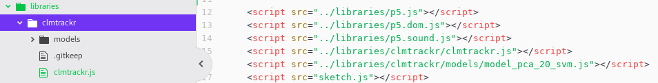
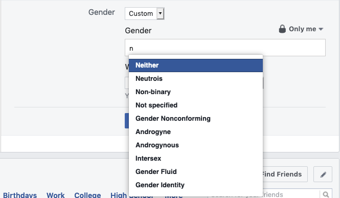
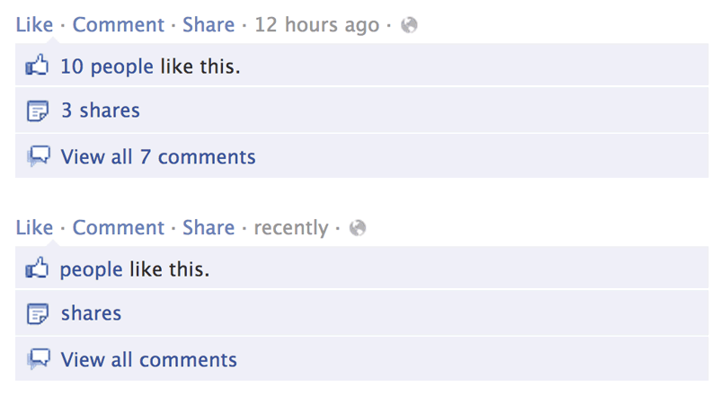

Title: 4. Data Capture
page_order: 4

## Data Capture


## setup()
This chapter focuses on how a program captures and processes input data. In some programming books, this would be in the section on interactivity with physical devices such as mice and keyboards. We have already introduced some of the interactivities such as the functions `mouseX` and `mouseY` (see Chapter 2 - Variable Geometry), as well as the idea of listening events via the functions `mouseIsPressed()` and `windowResized()` (see Chapter 3 - "Infinite Loops").

This chapter expands on these ideas and presents different types of data capture, including mouse movement, keyboard press, audio volume and face tracking with a web camera. Framing this chapter under "Data Capture" allows us to move from immediate interactions to questioning which kinds of data is being captured and how it is being processed,[^Tufte] as well as the consequences of this broader cultural tendency that tends referred to as *datafication*.[^datafication] The term (a hack of commodification) refers to the ways in which all aspects of our life seem to be turned into data which is subsequently transferred into information which is then monetized. This tendency is what Kenneth Cukier and Victor Mayer-Schöenberger describe in their article "The Rise of Big Data"[^Bigdata]. Our data, "the patterns of human bahaviors", is extracted and circulated within the logic of what Shoshana Zuboff terms "surveillance capitalism".[^zuboff] The need for large quantities of all manner of data to be harvested for computational purposes, such as predictive analytics (e.g. you like this book and we think you might like these books too).  

We will return to some of these issues in Chapter 10 - "Machine Learning", but suffice to say, for now, that in the era of big data, there appears to be a need to capture data on everything, even from the most mundane actions like button pressing. This chapter begins with this example, a relatively simple action like switching a device on or off — light, a kitchen appliance, and so on. A button is "seductive",[^Pold] with its immediate feedback and instantaneous gratification. It compels you to press it. Similarly in software and online platforms like Facebook, a button calls for inter-action, inviting the user to click, and interact with it in binary states: like or not-like, accept or cancel. The functionality is simple — on or off — and gives the impression of meaningful *interaction* despite the limited choices on on offer. Indeed this binary option might be considered to be more *interpassive* than interactive, like accepting the terms of conditions of a social media platform like Facebook without bothering to read the details, or *liking* something as a way of registering our engagement however superficial or fleeting. Permission for capture data is provided, and as such our friendships, thoughts, and experiences all become *datafied*. Even our emotional states are monitored when it come to the use of emoticons (discussed in Chapter 2 - "Variable Geometry").

With these ideas in mind, the next section will introduce the sample code for a customizable *Like* button in order to demonstrate the potential of simple interactions such as pressing a button. How the specificity and affordances of buttons can be considered, as well as how the like button becomes a "social button", creating economic values in what Carolin Gerlitz and Anne Helmond describe as "the like economy". [^helmond] As in previous chapters we will work through the various types of capture using buttons as a starting point. Subsequently, we will reflect on the wider implications.

### start()


*Figure 4.1 The web interface and interaction of the sample code*

[RUNME](https://siusoon.gitlab.io/Aesthetic_Programming_Book/p5_SampleCode/ch4_DataCapture/)    

Starting with this sample code, the sketch incorporates four data inputs for a customizable like button:
1. The button can be clicked using the mouse and then the button's color is changed and the screen is cleared.
2. The button's color is resumed when the mouse is clicked and moved away from the button area.
3. The button will rotate 180 degrees when you click the keyboard's spacebar.
4. The button will change its size according to the volume of the audio/mic input.
5. The button will move in line with input from the facial recognition software, copying the movement of what it considers to be the mouth.

The button has been customized using CSS (Cascading Style Sheets), which describes the visual elements and interactive properties of an object in a format that consists of a selector and a declaration block.[^fb] These identify *which* elements you want to customize and *how* to do it precisely. CSS works with HTML and we can create HTML's DOM objects like a button with the p5.js library (will be discussed in further detail in the next section).

<div class="exercise" markdown="true">

## Exercise in class (Decode)
By looking at the like button closely in the RUNME, can you come up with a list of customizations that have been introduced in the sample code?

Then look at the source code in the next section (lines 67-83) and describe some of the button's styling in your own words.

</div>

## Source Code
```javascript
/*Data Capture for Chapter 4
Interacting with captured data: Mouse, Keyboard, Audio, Web Camera
check:
1. sound input via a microphone: https://p5js.org/examples/sound-mic-input.html
2. dom objects like button
3. p5.sound library: https://github.com/processing/p5.js-sound/blob/master/lib/p5.sound.js
4. Face tracking library: https://github.com/auduno/clmtrackr
5. p5js + clmtracker.js: https://gist.github.com/lmccart/2273a047874939ad8ad1
*/
let button;
let mic;
let ctracker;

function setup() {
  background(100);
  // Audio capture
  mic = new p5.AudioIn();
  mic.start();

  //web cam capture
  let capture = createCapture();
  capture.size(640,480);
  capture.position(0,0);
  //capture.hide();
  let c = createCanvas(640, 480);
  c.position(0,0);

  //setup face tracker
  ctracker = new clm.tracker();
  ctracker.init(pModel);
  ctracker.start(capture.elt);

  //styling the like button with CSS
  button = createButton('like');
  button.style("display","inline-block");
  button.style("color","#fff");
  button.style("padding","5px 8px");
  button.style("text-decoration","none");
  button.style("font-size","0.9em");
  button.style("font-weight","normal");
  button.style("border-radius","3px");
  button.style("border","none");
  button.style("text-shadow","0 -1px 0 rgba(0,0,0,.2)");
  button.style("background","#4c69ba");
  button.style("background","-moz-linear-gradient(top, #4c69ba 0%, #3b55a0 100%)");
  button.style("background","-webkit-gradient(linear, left top, left bottom, color-stop(0%, #3b55a0))");
  button.style("background","-webkit-linear-gradient(top, #4c69ba 0%, #3b55a0 100%)");
  button.style("background","-o-linear-gradient(top, #4c69ba 0%, #3b55a0 100%)");
  button.style("background","-ms-linear-gradient(top, #4c69ba 0%, #3b55a0 100%)");
  button.style("background","linear-gradient(to bottom, #4c69ba 0%, #3b55a0 100%)");
  button.style("filter","progid:DXImageTransform.Microsoft.gradient( startColorstr='#4c69ba', endColorstr='#3b55a0', GradientType=0 )");
  button.mouseOut(revertStyle);

  //mouse capture
  button.mousePressed(clearance);  //click the button to clear the screen
}

function draw() {
  //getting the audio data
  let vol = mic.getLevel(); //get the overall volume (between 0 and 1.0)
  button.size(floor(map(vol, 0, 1, 40, 500))); //map the mic vol to the size of button, check map function: https://p5js.org/reference/#/p5/map

  let positions = ctracker.getCurrentPosition();
  if (positions.length) { //check the availability of web cam tracking
    button.position(positions[60][0]-20, positions[60][1]);  //as the button is too big, place it in the middle of my mouth, and -> 60 is the mouth area
    for (let i=0; i<positions.length; i++) {  //loop through all major face track points (see: https://www.auduno.com/clmtrackr/docs/reference.html)
       noStroke();
       fill(map(positions[i][0], 0, width, 100, 255), 0,0,10);  //color with alpha value
       //draw ellipse at each position point
       ellipse(positions[i][0], positions[i][1], 5, 5);
    }
  }
}

function clearance() {
  button.style("background","#2d3f74");
  clear();
}

function revertStyle(){
    button.style("background","#4c69ba");
}


//keyboard capture
function keyPressed() {
  if (keyCode === 32) { //spacebar - check here: http://keycode.info/
    button.style("transform", "rotate(180deg)");
  } else {   //for other keycode
    button.style("transform", "rotate(0deg)");
  }
}
```
## DOM elements: Creating and styling a button

DOM stands for Document Object Model, a document like HTML with a tree structure that allows programs to dynamically access and update content, structure, and style. Instead of focusing on the various tree structures of a document, this chapter will focus on elements from forms that are part of the DOM. These form elements include buttons, radio buttons, checkboxes, text input, etc., and these are usually encountered when filling in forms online. The basic structure for creating form elements is relatively simple. The p5.js reference guide, under the DOM,[^DOM] lists various examples of form creation syntax, e.g. `createCheckbox()`, `createSlider()`, `createRadio()`, `createSelect()`, `createFileInput()`, and so on. The one that we need to create a button is called `createButton()`.

First you need to assign an object name to the button, and if you use multiple buttons, you will need to come up with multiple different names so you can set the properties[^Element] for each one.

- `let button;`: First step is to declare the object by assigning a name.
- `button = createButton('like');`: Create a button and consider which text is to be displayed.
- `button.style("xxx","xxxx");`: This is the CSS standard, where the first parameter is a selection/selector and the second is a declaration block/attributes. For example, if you want to set the font color, then you can put in "color" and "#fff" respectively.[^Style] For this sample code, all the styling was copied directly from the (2015) Facebook interface by looking at their CSS source code. Styling includes `display`, `color`, `padding`, `text-decoration`, `font-size`, `font-weight`, `border-radius`, `border`, `text-shadow`, `background` and `filter`, with the addition of `transform`.  
- `button.size();`: This sets the button's width and height.
- `button.position();` This sets the button's position.
- `button.mousePressed(clearance());`: This specifies what to do (which function to call) when the program listens for the mousePressed event. In the customized function `clearance()`, `clear()` is a built-in JavaScript function, and is included to clear the screen.
- `button.mouseOut(revertStyle);`: This reverts the original button's color with the cutomized function `revertStyle()`.    

## Mouse capture
In the previous chapter, the program listened for mouse movement and captured the corresponding x and y coordinates using the built-in syntaxes `mouseX` and `mouseY`. This sample code incorporates specific mouse listening events, such as `mouseOut()` and `mousePressed()` functions which are called every time the user presses a mouse button and moves the mouse pointer out of the button. See the excerpt from the code below:

```javascript
button.mouseOut(revertStyle);

button.mousePressed(clearance);  //click the button to clear the screen

function clearance() {
  button.style("background","#2d3f74");
  clear();
}

function revertStyle(){
    button.style("background","#4c69ba");
}

```
The functions `mousePressed()` and `mouseOut()` are linked to the button you want to trigger actions. There are other mouse-related mouseEvents,[^event] such as `mouseClicked()`, `mouseReleased()`, `doubleClicked()`, `mouseMoved()`, and so on.

## Keyboard capture
```javascript
function keyPressed() {
  if (keyCode === 32) { //spacebar - check here: http://keycode.info/
    button.style("transform", "rotate(180deg)");
  } else {   //for other keycode
    button.style("transform", "rotate(0deg)");
  }
}
```

The use of the `keyPressed()` function is for listening any keyboard pressing events. If you want to specify any `keyCode` (that is the actual key on the keyboard), the sample code shows how a conditional statement can be implemented within the `keyPressed()` function.

Building on what you have learnt in the previous chapter on **conditional structure**, this sample focuses on not only "if statements" but also "if-else" statements. The use of if-else statements in the sample code explains as: if the spacebar on the keyboard is pressed, the button rotates 180 degrees, and if any other keys of the keyboard are pressed, the button reverts back to the original state of 0 degrees. The **if-else** structure therefore allows you to setup a further condition with the listening event: if a keycode is detected other than the spacebar, then the program will do something else. This is what it means by "else".

`keyCode` takes in numbers or special keys like BACKSPACE, DELETE, ENTER, RETURN, TAB, ESCAPE, SHIFT, CONTROL, OPTION, ALT, UP_ARROW, DOWN_ARROW, LEFT_ARROW, RIGHT_ARROW. In the above example, the `keyCode` for a spacebar is 32.

There is no difference in `keyCode` between capital and lower case letters i.e. "A" and 'a' are both 65.

Similar to "mouseEvents", there are also many other "keyboardEvents",[^Key] such as `keyReleased()`, `keyTyped()`, `keyIsDown()`.

## Audio capture
```javascript
let mic;

function setup() {
  // Audio capture
  mic = new p5.AudioIn();
  mic.start();
}

function draw() {
  //getting the audio data
  let vol = mic.getLevel(); //get the overall volume (between 0 and 1.0)
  button.size(floor(map(vol, 0, 1, 40, 500))); //as the button is too big, check map function: https://p5js.org/reference/#/p5/map
}
```

The basic web audio p5.sound library is used in the sample code. It includes features like audio input, sound file playback, audio analysis and synthesis.[^Audio]

The library should be included in the HTML file (as demonstrated in Chapter 1 - "Getting Started") so we can use the corresponding functions such as `p5.AudioIn()` and `getLevel()`.

Like a button, you first declare the object, e.g. `let mic;`, and then set up the input source (usualy a computer microphone) and start to listen to the audio input (see the two lines in `setup()`). When the entire sample code is executed, a popup screen from the browser will ask for permission to access the audio source. This audio capture only works if access is granted.


*Figure 4.1: Permission for audio access*


*Figure 4.2: Permission for camera access*

The sample code refers to methods under `p5.AudioIn()`, which reads the amplitude (volume level) of the input source returning values between 0 to 1.0 using the `getLevel()` method.

A new function `map()` will be introduced to map a number across a range. Since the values for volume returned are on a range of 0 to 1.0, the corresponding number will not make a significant difference in terms of the size of the button. As such, the range of the audio input will then map to the size range of the button dynamically.

## Face tracker
```javascript
let ctracker;

function setup() {
//web cam capture
let capture = createCapture();
capture.size(640,480);
capture.position(0,0);

//setup tracker
ctracker = new clm.tracker();
ctracker.init(pModel);
ctracker.start(capture.elt);
}

function draw() {
let positions = ctracker.getCurrentPosition();
if (positions.length) { //check the availability of web cam tracking
    button.position(positions[60][0]-20, positions[60][1]); //as the button is too big, place it in the middle of my mouth, and 60 is the mouth area (check lib spec)
    for (let i=0; i<positions.length; i++) {  //loop through all major face tracking points
       noStroke();
       fill(map(positions[i][0], 0, width, 100, 255), 0,0,10);  //color with alpha value
       ellipse(positions[i][0], positions[i][1], 5, 5);
    }
}
}
```
For face capture, the sample code uses clmtrackr which is a JavaScript library developed by data scientist Audun M. Øygard in 2014 for fitting a facial model with faces in images or video.[^Face] Based on facial algorithms designed by Jason Saragih and Simon Lucey,[^Algo] the library analyses a face in real-time marking it into 70 points based on a pre-trained machine vision model of facial images for classification. Since it is a JavaScript library, you need to put the library in the working directory, and link the library and the face model in the HTML file.



*Figure 4.3: The HTML file structure to import the new library and models*


*Figure 4.4: The tracker points on a face*

The program uses the webcam to do face capture and facial recognition:

1. `createCapture()`: This is a HTML5 <video> element (part of the DOM) that captures the feed from a web camera. In relation to this function you can define the size of the screen capture (which is subjected to the resolution of the web camera) and position on screen, e.g. `capture.size(640,480);` and `capture.position(0,0);`

2. Relating to facial tracking from the ctracker library: `ctracker = new clm.tracker()`, `ctracker.init(pModel);` and `ctracker.start(capture.elt);`: Similar to audio and camera use, you first need to initialize the tracker library, select the classified model (to be discussed in Chapter 10 - "Machine Learning"), and start tracking from the video source.

3. `ctracker.getPosition()`: This method locates the tracker points and stores them into an array called `position`. A for-loop is used to loop through all 70 tracker points and return the position in terms of x and y coordinates as a two-dimension array in the form of `position[][]`. The first dimension (as expressed in the form of []) of the position array indicates the tracker points from 0-70. The second dimension (as expressed in the forms of [][]) retrieves the x and y coordinates of the tracker points. Since the position of the like button follows that of the mout, and the tracker point for the mouth is 60, the program will then return the position as an array: `positions[60][0]-20` and `positions[60][1]`. The second array's dimensions of [0] and [1] refer to the x and y coordinates.

4. The final part is to draw the ellipses to cover the face. Another for-loop is implemented to loop through all the ctracker points and then get the x and y coordinates for the drawing of the ellipses.

<div class="exercise" markdown="true">

### Exercise in class

To familiar yourself with the various modes of capture, try the following:

1. Explore the various capture modes by tinkering with various parameters such as `keyCode`, as well as other keyboard, and mouse events.

2. Study the tracker points and try to change the position of the like button that you customized in a previous exercise.

3. Try to test the boundaries of facial recognition (using lighting, facial expression, and the facial composition): to what extend can a face be recognized as such and to what extent is this impossible?

4. Do you know how the face is being modelled? How has facial recognition technology been applied in society at large, and what are some of the issues that arise from this?

It would be worth checking back to Chapter 2 - "Variable Geometry" for a reminder of how facial recognition identifies a person's face from its geometry — such as the distance between a person's eyes or size of their mouth — to establish a facial signature that can be compared to a standardized database. Not least of the problems is that these databases are skewed by how the data was prepared, its selection, collection, categorization, classification, and cleaning (this will be discussed in Chapter 10 - "Machine Learning"). To what extent does your face meet the standard?   

</div>

## The concept of capture
This next section discusses various examples of different inputs for data capture, this next section discusses various examples. The intention is to showcase some other possibilities of of the latter's application, and more importantly how this relates to datafication, commodification, surveillance and personalization. This is an attempt to discuss data politics more broadly: to question how our personal data is captured, quantified, archived and used, and to what purpose? What are the implications and who has the power to access the captured data, and derive profit from it? Few people know exactly which data is captured or how it is used?[^GDPR] However, despite the term capture, we should also point out that this is not total incarceration, and there are escape routes. More on this later.  

### Web Analytics and Heatmap
At the moment, the most widely used web analytics service, at least in the Western world, is provided by Google and contains tremendous amounts of data on website traffic and browsing behavior, including the number of unique visits, average time on sites, browser and operating system information, traffic sources and users' geographic locations, etc. This data can then be further utilized to analyze customers' profiles and user bahavior.


*Figure 4.5: Google Analytics Screenshot*

Heatmap is one of the visualization tools and provides a graphical representation of data to visualize user behavior. It is commonly used in industries for the purpose of data analytics. For example, it is easy to track the cursor's position and compute the duration of its stay in different areas of a web page, providing an indication as to which content is *hotter* than the rest. This is useful for marketing purposes, not least to understand which content is more or less attractive to users, and for companies or political parties to analyze where to best place their ads and other propaganda. The Facebook–Cambridge Analytica data scandal is a pertinent case study. In early 2018, it was revealed that the personal data of millions of peoples' Facebook profiles had been harvested without their consent, and used for political advertising purposes.[^Analytica]


*Figure 4.6: An example of a heatmap for analyzing a web page*

Major corporations such as Facebook,[^Facebook] constantly explore new data capture methods to optimize screen presentation.

### Form elements
As we argued with regard to interaction, the choices are limited. Each form element like a dropdown menu or a button indicates different affordances.[^gibson] Researcher Rena Bivens made a thorough analysis of Facebook's registration page in relation to the gender options available.[^Bivens] When Facebook was first launched in 2004 there was no gender field, but things changed in 2008 when a drop-down list was introduced that consisted solely of the options Male or Female, further changed with the use of radio buttons to emphasize the binary choice. The binary selection is mutually exclusive with the highlight of only one option visually among other options. One can see clearly all the available options after the selection process is done but for a drop-down list, other options are hidden away.

A breakthrough occurred in 2014 when Facebook allowed users to customize the gender field and you can now select from a list of more than 50 gender options. According to Facebook, they wanted to enhance "personalized experiences" with "authentic identity",[^Facebook2] however it remains arguable that this personalization (both at Facebook and in society in general) actually serves to enforce categorization, and of course it ultimately serves the purpose of market segmentation (dividing users into ever more sub-groups).



*Figure 4.7: Facebook's custom gender field as of Feb. 2020*

### Metrics of likes
The use of a single like button provides a good example of how our feelings are captured. The aptly named company *Happy or Not* who produce push button technology and analytics software — the kind found in supermarkets for instance, with happy or sad faces — also provide feedback technologies for the workplace, as indicated by their strapline: "Creating happiness in every business, worldwide".[^Leslie] The six emoticons Facebook launched in 2016 including *Like*, *Love*, *Haha*, *Wow*, *Sad* and *Angry* mark our standardized experience of work and play more precisely than just simply a like hyberlink. All clicks are *categorized* into emotional metrics, displayed publicly on the web, and used for algorithmic calculation to prioritize feeds to users. It is fairly clear how the clicks serve the interests of platform owners foremost, and, as if to prove the point, Facebook, and Instagram have tested the idea of hiding the metrics on posts in order to shift attention to what they prefer to call "connecting people"[^Hide] — as if their interests were altruistic.

This practice of quantification is something the artist Benjamin Grosser has parodied in his *Demetricator* series,[^Grosser] first published in 2012, which makes all the numbers associated with the metadata disappear. The associated *value* of numbers associated with notifications, replies, favorites, and feeds, have all been nullified. Or rather it becomes clear that the clicking produces *value* and absence of metrics makes this conspicuous.



*Figure 4.8: Benjamin Grosser's Facebook Demetricator Demetricating Likes, Shares, Comments, and [sic] Timestamps Original (top), Demetricated (bottom). Image courtesy of the artist.*

Tracking is clearly big business and comes with its own invisibility cloak. In 2013, Facebook conducted a research project about last-minute self-censorship,[^Facebook3] revealing their capability of being able to track even unposted status updates/posts/comments, including erased texts, or images. This "residual data", which might be considered "waste material", "digital exhaust", or data exhaust", however this data is rich in predictive values.[^zuboff2] The implication is that Facebook is not only interested in capturing what you have posted, but also in attempting to capture your thinking processes from your residual data. It is sobering to think that data capture extends to the imagination.

### Voice and audio data
Smart devices like our computers, phones, and other gadgets are commonly equipped with voice recognition — using Siri, Google Assistant or Alexa — which turns audio input into commands for software, and feedback with "more personalized experiences" to assist in the execution of everyday tasks. You can find these voice assistants in just about everything now — including, everyday objects like microwaves — and they become more and more conversational and *smart*, one might say *intelligent*, as machine learning improves. This is another good example of duplicity, as — through voice assistnats as this software is collectively know can carry out simple tasks very well, and becomes smarter, at the same time they are used to capture voices for machine learning applications in general. Placing these tangible voice assistants in our home allows the capturing of your tastes when you are not facing a screen. In the internet of things, the device serves you, and you serve the device. Indeed we become devices" that generate value for others.[^Leslie2]    


*Figure 4.9: Screenshot of Voice & Audio activity*

### Health tracker
Fitness and well-being becomes datafied and — with the setting of personal targets — gamified. As the welfare state is dismantled, personal well-being becomes individualized and there is a growing trend for *self-tracking* apps. Movement, steps, heart rate and even sleep patterns can be tracked and analyzed using wearable devices such as the Fitbit, or the Apple Watch. These practices of the *quantified self* — sometimes referred to as body hacking or self-surveillance — overlap with other trends that incorporate capture and acquisition into all aspects of daily life.

Under late capitalism, temporality itself seems to have been captured, and "there is a relentless incursion of the non-time of 24/7 into every aspect of social or personal life. There are, for example, almost no circumstances now that cannot be recorded or archived as digital imagery or information."[^Crary] We quote from Jonathan Crary's book *24/7: Late Capitalism and the Ends of Sleep* which describes the collapse of the distinction between day and night, meaning we are destined to produce data at all times. If sleep was once thought to be the last refuge from capitalism where no value could be extracted,[^Crary2] then this no longer seems to be the case, and many of us happily monitor our sleep.


*Figure 4.10: Screenshot of sleep tracker*

## While()

That even sleep has become datafied seems to point to the extent to which our subjectivities also been captured. We produce, share, collect, archive, use and misuse, knowingly, or not, massive amounts of data, but what does its capture do to us? What are the inter-subjective relations between data-commodity and its human subjects? As discussed in this chapter, our personal and professional lives seem to be fully enmeshed in various processes of *datafication* — to refer to how data is subsequently transferred into information as a new form of value — but does this simply mean that we are trapped in a prison-house of data, unwittingly producing value for others? In this last section we will try to unpack these ideas a little more, and in particular the idea of value in the context of the flow of data (that we call big data), and our position within these datafied structures which is not entirely without agency.

In 2015, transmediale, an annual art and digital culture festival in Berlin, posted an open call addressing the pervasive logic of *Capture All* and the quantification of life, work and play. The call included some questions worth repeating here: "Are there still modes of being that resist the imperative of digital capitalism to CAPTURE ALL or is there no option but to play along? If so, are there artistic strategies and speculative approaches that do not play this game of quantification by the [sic] numbers? What are the blind spots and gaps of [sic] relentless quantification and gamification that can be exploited in order to carve out new ways of living?"[^transmediale] Hopefully the practical tasks and examples of this chapter go some way to pointing out alternatives.

Marxist theory can help us make sense of this on a more conceptual level. The various techniques we have described can be understood as means of production, what Marx would refer to as *fixed capital*. The value arises when fixed capital is turned into "exchange value", in other words how things can take on monetary value. To see this as simply the labor of users being captured and the associated value being stolen misses the point, as Tiziana Terranova states.[^Terranova] Rather than individual users needing compensation for their willing supply of data, it is the bigger social aspect that needs that is more significant, particularly in this era of big data, we might add. She explains: "Contrary to some variants of Marxism which tend to identify technology completely with "dead labour", "fixed capital" or "instrumental rationality", and hence with control and capture, it seems important to remember how, for Marx, the evolution of machinery also indexes a level of development of productive powers that are unleashed but never totally contained by the capitalist economy."[^Terranova2]

We can find some evidence of this in the social energies of the free and open source movement, for instance, where compensation operates at the level of social exchange. This claim then serves to shift attention from the efforts of the individual to social relation. The politics of this is especially important if we are to develop a position different from the logic of *capture all* and look to more positive and hopeful readings. Referring to button pressing, Terranova describes social relations as an asymmetrical relations between two poles — one active, the other receptive. To her, actions such as "liking and being liked, writing and reading, looking and being looked at, tagging and being tagged", are examples of the transition from individual to collective. She considers how "these actions become discrete technical objects (like buttons, comment boxes, tags, etc.) which are then linked to underlying data structures", and, in turn, how these actions express the possibility of being able to experiment with processes of *individuation* and *transindividuation*, i.e. the possibility of social transformation itself.

This makes a reference to the philosophy of Gilbert Simondon, to the transformational process by which individuation — how a person or thing is identified as distinguished from other persons or things — is caught up with other individuations. There is no space (or need) to go into this in detail in this publication, but for now it suffices to say that *transindividuation* describes the shift between the individual "I" and the collective "We" and how they are transformed through one another.[^Stiegler] We hope something of this happens to this book project, which is already collective by design, but also opens up further possibilities for the production of new versions and socialities in its reworking. Of course this involves tinkering with the underlying codes and values associated with data capture, and our ability to reinvent the latter's main purpose. This is an open invitation to not only capture data, but to also unleash its potential.  

## MiniX[4]: Capture All

**Objective:**
- To experiment with various data capture inputs, including audio, mouse, keyboard, web camera, and more.
- To critically reflect upon the activity of data capture and datafication.

**To additional inspiration:**
- [LAUREN](http://lauren-mccarthy.com/LAUREN) by Lauren McCarthy
- [nonsense](http://siusoon.net/nonsense/) (2015) by Winnie Soon (read the comment in the source code for this project's intentions)
- [Facebook Demetricator](https://bengrosser.com/projects/facebook-demetricator/) or [Instagram Demetricator](https://bengrosser.com/projects/instagram-demetricator/) or [Twitter Demetricator](https://bengrosser.com/projects/twitter-demetricator/) by Benjamin Grosser

**Tasks (RUNME):**
1. Experiment with various data capture input and interactive devices, such as audio, mouse, keyboard, web camera, etc.
2. Develop a sketch that responds loosely to the transmediale open call ["CAPTURE ALL"](https://transmediale.de/content/call-for-works-2015). (Imagine you wnat to submit a sketch/artwork/critical or speculative design work to transmediale as part of the forthcoming exhibition).

**Questions to think about as README:**
- **Provide** a title for and a short description of your work (1000 characters or less) as if you are going to submit it to the festival.
- **Describe** your program and what you have used and learnt.
- **Articulate** how your program and thinking address the theme *capture all*.
- What are the cultural implications of data capture?

## Required reading:

- Carolin Gerlitz and Anne Helmond, "The Like Economy: Social Buttons and the Data-Intensive Web", *New Media & Society* 15: 8 (December 1, 2013): 1348–65.
- Shoshana Zuboff, "Surveillance Capitalism | VPRO Documentary". Accessed April 26, 2020. https://youtu.be/hIXhnWUmMvw.
- [p5.js examples - Interactivity 1](https://p5js.org/examples/hello-p5-interactivity-1.html).
- [p5.js examples - Interactivity 2](https://p5js.org/examples/hello-p5-interactivity-2.html).
- [p5 DOM reference](https://p5js.org/reference/#group-DOM).

## Notes

[^Tufte]: This resonates with the field of data visualization, and Edward Tufte’s belief that data should be allowed to speak for itself rather than be lost in the ornamentation of visualization. Yet of course this makes the mistake in thinking that data is raw and unmediated. Data begins relatively raw and uninterpreted, but in practice is already selected, targeted, preprocessed and cleaned, mined, and so on, not least to make it human readable. There is always some additional information about its composition, usually derived from the means by which it was gathered in the first place.
[^Bigdata]: Kenneth Cukier and Victor Mayer-Schöenberger, "The Rise of Big Data". *Foreign Affairs* (May/June 2013): 28–40.
[^Pold]: Søren Pold, "Button", in Matthew Fuller ed., *Software Studies* (Cambridge, Mass.: MIT Press, 2008), 34. Users are seduced by the wording of the button not least, and Pold suggests that a button is developed with distinct functionality and signification (Ibid., 31).
[^DOM]: https://p5js.org/reference/#group-DOM.
[^Element]: See the p5.Element moethod list here, https://p5js.org/reference/#/p5.Element.
[^Style]: Styling a button follows the syntax of CSS, and that controls how a DOM element like a button should be displayed. The provided example shows how CSS is incorporated into the JavaScript file by using the syntax `button.style('xxx:xxxx');`. Another way of doing this is to follow the convention of having a css file that lists the `.class` selector. In this way, you need to have the syntax in the JavaScript file to mark the .class name: `button.class('class_name');`, and then list out the CSS elements and class attributes in the CSS file. More examples can be found here: https://www.w3schools.com/csS/css3_buttons.asp, and see Daniel Shiffman's video on the basic of CSS, https://www.youtube.com/watch?v=zGL8q8iQSQw.
[^event]: See the related function in the reference page, which is under Events > Mouse> https://p5js.org/reference/.
[^Key]: See the related function in the reference page, which is under Events > Keyboard> https://p5js.org/reference/.
[^Audio]: See the sound library's various features: https://p5js.org/reference/#/libraries/p5.sound.
[^Face]: https://www.auduno.com/2014/01/05/fitting-faces/.
[^Algo]: Jason M. Saragih, Simon Lucey and Jeffrey F. Cohn, *Face Alignment Through Subspace Constrained Mean-shifts*, 2009 IEEE 12th International Conference on Computer Vision, Kyoto (2009): 1034-1041. doi: 10.1109/ICCV.2009.5459377.
[^GDPR]: Of course the introduction of legislation such as the GDPR (General Data Protection Regulation) is a response to this lack of transparency. GDPR is a regulation in EU law (2016) on data protection and privacy that applies to all the citizens of the European Union and the European Economic Area. It also addresses the transfer of personal data outside the EU and EEA areas. See https://gdpr-info.eu/.
[^Facebook]: Will Conley, "Facebook investigates tracking users’ cursors and screen behavior", *Slashgear* (30 October 2013). Available at: https://www.slashgear.com/facebook-investigates-tracking-users-cursors-and-screen-behavior-30303663/.
[^Analytica]: *The Guardian's* coverage of this, "The Cambridge Analytica Files", can be found at https://www.theguardian.com/news/series/cambridge-analytica-files. Facebook was ultimately forced to pay a hefty fine, see Alex Hern, "Facebook agrees to pay fine over Cambridge Analytica scandal", *The Guardian*, 30 October 2019, https://www.theguardian.com/technology/2019/oct/30/facebook-agrees-to-pay-fine-over-cambridge-analytica-scandal
[^Bivens]: Rena Bivens, "The Gender Binary will not be Deprogrammed: Ten Years of Coding Gender on Facebook", *New Media & Society* 19(6), (2017): 880–898. doi.org/10.1177/1461444815621527.
[^Facebook2]: Facebook, Form S-1 registration statement (2012). Available at: https://infodocket.files.wordpress.com/2012/02/facebook_s1-copy.pdf (accessed 16 Oct 2019).
[^Leslie]: Esther Leslie, "The Other Atmosphere: Against Human Resources, Emoji, and Devices", in *Journal of Visual Culture*, vol.18 no.1 (April 2019).
[^Hide]: Laurie Clarke, "Why hiding likes won’t make Instagram a happier place to be", *Wired*, 19 July 2019, https://www.wired.co.uk/article/instagram-hides-likes.  
[^Grosser]: See Ben Grosser's Demetricator series of artworks: *Facebook Demetricator*, https://bengrosser.com/projects/facebook-demetricator/; *Instagram Demetricator*, https://bengrosser.com/projects/instagram-demetricator/; *Twitter Demetricator*, https://bengrosser.com/projects/twitter-demetricator/.
[^Facebook3]: Sauvik Das and Adam D. I. Kramer, "Self-censorship on Facebook", AAAI Conference on Weblogs and Social Media (ICWSM), 2 July 2013, https://research.fb.com/publications/self-censorship-on-facebook/.
[^Leslie2]: Paraphrasing: "The workers become their own devices. They becomes devices of communicative capitalism", the final lines of Leslie's essay "The Other Atmosphere: Against Human Resources, Emoji, and Devices", op. cit.   
[^Crary]: Jonathan Crary, *24/7: Late Capitalism and the Ends of Sleep* (London: Verso, 2013), 30–31.
[^Crary2]: Ibid. 10-11.
[^transmediale]: transmediale, *Capture All*, https://transmediale.de/content/call-for-works-2015.
[^Terranova]: Tiziana Terranova, "Red Stack Attack! Algorithms, Capital and the Automation of the Common", *EuroNomade*, 2014. Available at http://www.euronomade.info/?p=2268
[^Terranova2]: Ibid.
[^Terranova3]: Ibid.
[^Stiegler]: For Bernard Stiegler, explains Irit Rogoff, "The concept of 'transindividuation' is one that does not rest with the individuated 'I' or with the interindividuated 'We', but "is the process of co-individuation within a preindividuated milieu and in which both the 'I' and the 'We' are transformed through one another". See Bernard Stiegler and Irit Rogoff, "Transindividuation", *e-flux* #14 (March 2010), https://www.e-flux.com/journal/14/61314/transindividuation/. [G: double check the opening T, " and ' /w]
[^datafication]: Christian Ulrik Andersen and Geoff Cox, eds. , [A Peer-Reviewed Journal About Datafied Research](https://tidsskrift.dk/APRJA/issue/view/8402), *APRJA* 4.1 (2015).
[^fb]: The styling of the button is exactly the same as how Facebook's like button styling in 2015.
[^helmond]: Carolin Gerlitz and Anne Helmond, "The Like Economy: Social Buttons and the Data-Intensive Web", *New Media & Society* 15: 8 (December 1, 2013): 1348–65.
[^zuboff]: Shoshana Zuboff, "Surveillance Capitalism | VPRO Documentary". Accessed April 26, 2020. https://youtu.be/hIXhnWUmMvw.
[^zuboff2]: Zuboff, Surveillance Capitalism.
[^gibson]: James J Gibson's notion of affordance refers to the action capabilities and possibilities in the context of cognitive psycohology. See Gibson, James J. ‘The theory of affordances’, in Robert Shaw and John Bransford (eds.) *Perceiving, Acting, and Knowing* (Hillsdale, NJ: Lawrence Erlbaum Associates, 1977), 127–143.
