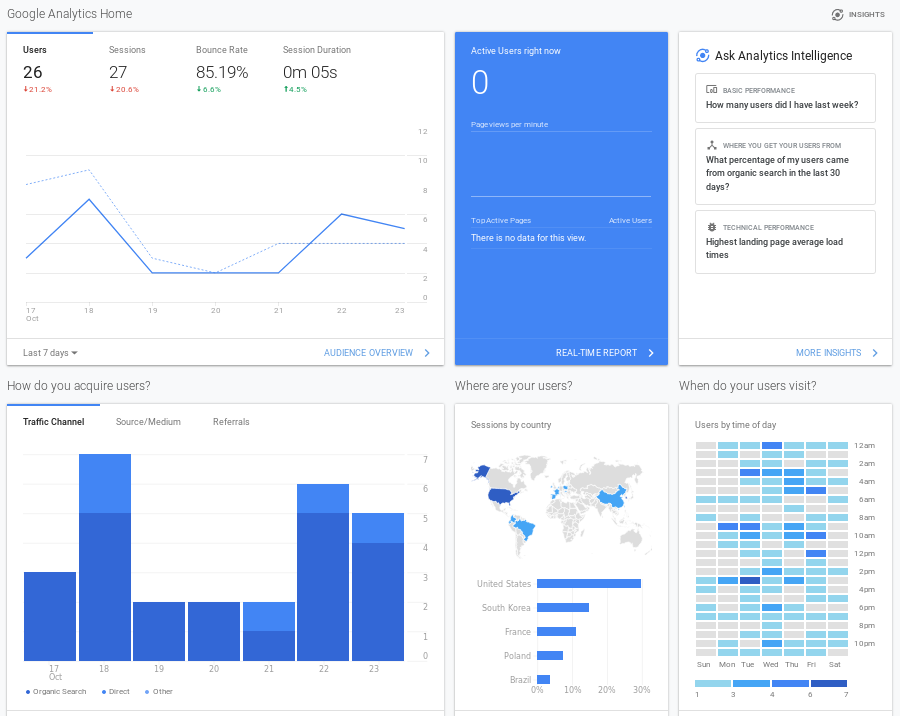

Title: 4. Data Capture
page_order: 4

## 4. Data Capture

## 4.1 setup()
This chapter focuses on how a program captures and processes input data. In some programming books, this would fall under the topic of interactivity, such as interacting with physical devices like a mouse and a keyboard. This is already familiar in  earlier chapters where we already introduced the functions `mouseX` and `mouseY` (see Chapter 2 - VariableGeometry), as well as the idea of listening events via the functions `mouseIsPressed()` and `windowResized()` (see Chapter 3 - InfiniteLoops). This chapter extends these ideas and presents different types of data capture, including mouse movement, keyboard press, audio volume and face tracking with a web camera. Putting it like this allows us to move from immediate interactions to question what kinds of data is being captured, how it is being processed, and the wider consequences of this as part of a broader cultural tendency that tends to be referred to as *datafication*. The term (a hack of commodification) refers to the ways in which all aspects of our life seem to be turned into data which is subsequently transferred into information realised as a new form of value. This tendency is what Kenneth Cukier and Victor Mayer-Schöenberger describe in their article "The Rise of Big Data",[^Bigdata] in the context of the need for large amounts of data to be harvested for computational purposes, so as to perform predictive analytics for instance (e.g. you like this book and we think you might like these too).  

We will come back to these issues later in the book (Chapter 10 - MachineLearning) but suffice to say for now that in the era of big data, there appears to be the need to capture everything, even the most mundane activities like button pressing. The chapter begins with this example, a relatively simple action like switching a device on or off — a light, a kitchen appliance, and so on. A button is "seductive",[^Pold] generating the desire to press it, with immediate feedback and instant gratification. It almost asks you to press it. Similarly in software and online platforms like Facebook, a button indicates a call for inter-action, inviting the user to click and to interact with it in a binary state: on or off, like or not-like, accept or cancel. The functionality is simple — on or off — and gives the impression of *interaction* despite the  limitations of the choices on offer (like most interactive systems). Indeed this might be considered to be more *interpassive* than interactive, like accepting the terms of conditions for a social media platform like Facebook without bothering to read the details, or *liking* something as a way of registering our engagement however superficial or fleeting. As such permission is given to capture data, and friendships, thoughts, and experiences all become *datified*. With these ideas in mind, the next section will introduce the sample code for a customizable *Like* button in order to demonstrate the potential of simple interactions like button-press, and how you might begin to reflect on how data is captured through such processes for specific ends. As with previous chapters we will works through the examples and then see where this takes up in terms of the wider implications. 

## 4.1.1 Start()
 
<br>
*Figure 4.1 The web interface and interaction of Data Capture*<br>
[need to update the image and runme /w]

[RUNME](xxx_ch4)    

Starting with this sample code, the sketch incorporates four data inputs for a customizable Like button: 
1. The button is clickable through the mouse to clear the screen.
2. The button will rotate 180 degrees when you click on the spacebar of your keyboard.
3. The button will change its size according to the volume of the audio/mic input.
4. The button will move according to the facial recognization software, following what it considers to be the mouth of the face. 

The button is customized using CSS (Cascading Style Sheets), which describes the style and visual elements of an object in a format that onsists of a selector and a declaration block. These simply identify *which* elements you want to customize and *how* to do it precisely. CSS works with HTML elements and we can use the library p5.dom (which is included in the html file by default when you download the whole completed p5.js library) to create most form elements, including a button. 

## 4.1.2 Exercise in class
By looking at the Like button closely in the RUNME, can you come up with a list of potential customizations that have been introduced in the sample code? 

Then look at the source code in the next section (lines 67-83) and describe some of the button's styling in your own words. 

## 4.2 Source Code 
```javascript
/*Data Capture for Chapter 4
//Interacting with captured data: Mouse, Keyboard, Audio, Web Camera
check:
1. sound input via the microphone: https://p5js.org/examples/sound-mic-input.html
2. dom objects like button
3. p5.sound library: https://github.com/processing/p5.js-sound/blob/master/lib/p5.sound.js
4. Face tracking library: https://github.com/auduno/clmtrackr
5. p5js + clmtracker.js: https://gist.github.com/lmccart/2273a047874939ad8ad1
*/
let button;
let mic;
let ctracker;

function setup() {
  background(100);
  // Audio capture
  mic = new p5.AudioIn();
  mic.start();

  //web cam capture
  let capture = createCapture();
  capture.size(640,480);
  capture.position(0,0);
  //capture.hide();
  let c = createCanvas(640, 480);
  c.position(0,0);

  //setup face tracker
  ctracker = new clm.tracker();
  ctracker.init(pModel);
  ctracker.start(capture.elt);

  //styling the like button with CSS
  button = createButton('like');
  button.style("display","inline-block");
  button.style("color","#fff");
  button.style("padding","5px 8px");
  button.style("text-decoration","none");
  button.style("font-size","0.9em");
  button.style("font-weight","normal");
  button.style("border-radius","3px");
  button.style("border","none");
  button.style("text-shadow","0 -1px 0 rgba(0,0,0,.2)");
  button.style("background","#4c69ba");
  button.style("background","-moz-linear-gradient(top, #4c69ba 0%, #3b55a0 100%)");
  button.style("background","-webkit-gradient(linear, left top, left bottom, color-stop(0%, #3b55a0))");
  button.style("background","-webkit-linear-gradient(top, #4c69ba 0%, #3b55a0 100%)");
  button.style("background","-o-linear-gradient(top, #4c69ba 0%, #3b55a0 100%)");
  button.style("background","-ms-linear-gradient(top, #4c69ba 0%, #3b55a0 100%)");
  button.style("background","linear-gradient(to bottom, #4c69ba 0%, #3b55a0 100%)");
  button.style("filter","progid:DXImageTransform.Microsoft.gradient( startColorstr='#4c69ba', endColorstr='#3b55a0', GradientType=0 )");

  //mouse capture
  button.mousePressed(clearance);  //click the button to clear the screen
}

function draw() {
  //getting the audio data
  let vol = mic.getLevel(); //get the overall volume (between 0 and 1.0)
  button.size(floor(map(vol, 0, 1, 40, 500))); //map the mic vol to the size of button, check map function: https://p5js.org/reference/#/p5/map

  let positions = ctracker.getCurrentPosition();
  if (positions.length) { //check the availability of web cam tracking
    button.position(positions[60][0]-20, positions[60][1]);  //as the button is too big, place it in the middle of my mouth, and -> 60 is the mouth area
    for (let i=0; i<positions.length; i++) {  //loop through all major face track points (see: https://www.auduno.com/clmtrackr/docs/reference.html)
       noStroke();
       fill(map(positions[i][0], 0, width, 100, 255), 0,0,10);  //color with alpha value
       //draw ellipse at each position point
       ellipse(positions[i][0], positions[i][1], 5, 5);
    }
  }
}

function clearance() {
  clear();
}

//keyboard capture
function keyPressed() {
  if (keyCode === 32) { //spacebar - check here: http://keycode.info/
    button.style("transform", "rotate(180deg)");
  } else {   //for other keycode
    button.style("transform", "rotate(0deg)");
  }
}
```
## 4.3 p5.dom: Creating and styling a button

The basic structure for creating from elements is relatively simple. In the p5.js reference guide under the DOM category,[^DOM] there are different form creation syntaxes, e.g. `createCheckbox()`, `createSlider()`, `createRadio()`, `createSelect()`, `createFileInput()`, and so on. The one that we need for creating a button is called `createButton()`. 

First you need to assign an object name for the button, and of course different names if you have more than one so that you can set the properties[^Element] for each. 

- `let button;`: First step is to declare the object by assigning a name.
- `button = createButton('like');`: Create a button and consider what text is to be displayed.
- `button.style("xxx","xxxx");`: This is the CSS standard, where the first argument is a selection and the second is a declaration block. For example if you want to set the font color, then you can put in "color" and "#fff" respectively.[^Style] For this specific sample code, all the styling is copied from the Facebook interface directly (as of 2015) by looking into their CSS source code. Styling includes `display`, `color`, `padding`, `text-decoration`, `font-size`, `font-weight`, `border-radius`, `border`, `text-shadow`, `background` and `filter`, with the addition of `transform`.  
- `button.mousePressed(clearance());`: This specifies what to do (which function to call) when the program listens to the mousePressed event. Within the customized function `clearance()`, the `clear()` is a JavaScript built-in function and in this case is included to clear the screen.    
- `button.size();`: This sets the size of the button in terms of its width and height. 
- `button.position();` This sets the position of the button. 

## 4.4 Mouse capture 
In the previous chapter the program listened to the mouse movement and captured the corresponding x and y coordinates by using the built-in functions `mouseX` and `mouseY`. This sample code incorporates a specific `mousePressed` function which is called once every time the user presses a mouse button. See the excerpt of code below:

```javascript
button.mousePressed(clearance);  
//click the button to clear the screen

function clearance() {
  clear();
}
```
The function `mousePressed()` is attached to the button you want to trigger actions. There are other mouse related mouseEvents,[^Events] such as `mouseClicked()`, `mouseReleased()`, `doubleClicked()`, `mouseMoved()`, and so on. 

## 4.5 Keyboard capture
```javascript
function keyPressed() {
  if (keyCode === 32) { //spacebar - check here: http://keycode.info/
    button.style("transform", "rotate(180deg)");
  } else {   //for other keycode
    button.style("transform", "rotate(0deg)");
  }
}
```

The use of the `keyPressed()` function is to listen any keyboard pressing events. If you want to specify any `keyCode` (that is the actual key on the keyboard), the sample code shows how a conditional statement can be implemented within the `keyPressed()` function. Within the if-else conditional statement, if a keyboard press of a spacebar is detected, then the button will rotate through 180 degrees and any other keys will just resume back to the original state of 0 degrees.

`keyCode` takes in numbers or special keys like BACKSPACE, DELETE, ENTER, RETURN, TAB, ESCAPE, SHIFT, CONTROL, OPTION, ALT, UP_ARROW, DOWN_ARROW, LEFT_ARROW, RIGHT_ARROW. In the above example, the `keyCode` of a spacebar is 32.

Capital and lower case letters do not make any difference as they are using the same `keyCode`, such that 'A' and 'a' use the same number 65. 

Similar to `mouseEvents`, there are also many other `keyboardEvents`,[^Key] such as `keyReleased()`, `keyTyped()`, `keyIsDown()`. 

## 4.6 Audio capture
```javascript
let mic;

function setup() {
  // Audio capture
  mic = new p5.AudioIn();
  mic.start();
}

function draw() {
  //getting the audio data
  let vol = mic.getLevel(); //get the overall volume (between 0 and 1.0)
  button.size(floor(map(vol, 0, 1, 40, 500))); //as the button is too big, check map function: https://p5js.org/reference/#/p5/map
}
```

The basic web audio p5.sound library is used in the sample code. It includes features like audio input, sound files playback, audio analysis and synthesis.[^Audio] 

The library should be also included in the html file (as demonstrated in Chapter 1 - Getting Started) so that we can use the corresponding functions like `p5.AudioIn()` and `getLevel()`. 

Similar to a button, you first declare the object, e.g. `let mic;`, and then set up the input source (commonly from a computer microphone) and start to listen to the audio input (see the two lines within `setup()`). When the entire sample code is executed, a popup screen from a browser will ask for permission to access the audio source. This audio capture only works if access is granted. 


*Figure 4.1: Permission for audio access*


*Figure 4.2: Permission for camera access*

The sample code refers to methods under `p5.AudioIn()`, which reads the amplitude (volume level) of the input source with the return value between 0 to 1.0 by using the method `getLevel()`.

A new function `map()` is introduced to map a number across a range. Since the return of the volume is set between a range of 0 to 1.0, the corresponding number will not make a significant difference in terms of the size of the button. As such, the range of the audio input will then map to the size range of the button dynamically. 

## 4.7 Face tracker 
```javascript
let ctracker;

function setup() {
//web cam capture
let capture = createCapture();
capture.size(640,480);
capture.position(0,0);

//setup tracker
ctracker = new clm.tracker();
ctracker.init(pModel);
ctracker.start(capture.elt);
}

function draw() {
let positions = ctracker.getCurrentPosition();
if (positions.length) { //check the availability of web cam tracking
    button.position(positions[60][0]-20, positions[60][1]); //as the button is too big, place it in the middle of my mouth, and 60 is the mouth area (check lib spec)
    for (let i=0; i<positions.length; i++) {  //loop through all major face tracking points
       noStroke();
       fill(map(positions[i][0], 0, width, 100, 255), 0,0,10);  //color with alpha value
       ellipse(positions[i][0], positions[i][1], 5, 5);
    }
}
}
```
For face capture, the sample code has used the clmtrackr which is a JavaScript library developed by a data scientist Audun M. Øygard in 2014 for fitting a facial model to faces in images or video.[^Face] Based on facial algorithms designed by Jason Saragih and Simon Lucey,[^Algo] the library analyses a face and divides it into 70 points in real-time based on a pretrained machine vision model of facial images for classification. 


*Figure 4.3: The tracker points of a face*

What the program does in terms of face capture and facial recognition: 
1. `createCapture()`: This is a HTML5 <video> element that captures the feed from a web camera. In relation to this function tasks might be to define the size (which is subjected to the resolution of the web camera) and position on screen, e.g. `capture.size(640,480);` and `capture.position(0,0);`
2. `clmtrackr`: Similar to audio and camera use, first you need to initialize the tracker library, select the classified model and start tracking from the video source. 
3. `ctracker.getPosition()`: This is to loop through all the 70 tracker points and return the position in terms of x and y coordinates. Since the Like button will follow the mouth of the face and the tracker point of a mouth is 60, the program then will return the position in terms of an array: `positions[60][0]-20` and `positions[60][1]`. The second array's dimensions of [0] and [1] refers to the x and y coordinates specifically. 
4. The last part is to draw the ellipses to cover the face. A for-loop is implemented to loop through all the ctracker points and then get the x and y coordinates for the drawing of the ellipses. 

## 4.8 Exercise in class
To familiar yourself with face capture, try the following:
1. Explore the different modes of capture by tinkering with various parameters such as `keyCode`, as well as other keyboard and mouse events. 
2. Study the tracker points and try to change the position of the Like button that you previously customized in the earlier exercise. 
3. Try to test the boundaries of facial recognition: to what extend can(not) a face be recognized as a face?
4. How has facial recognition technology been applied in society at large, and what are some of the issues that arise from this? 

## 4.9 The concept of capture
After the demonstration of different inputs for data capture, this next section discusses various examples. The intention is to showcase some other possibilities of its application, and more importantly how this relates to datafication, commodification, surveillance and personalization. This is an attempt to discuss data politics more broadly: to question how our personal data is being captured, quantified, archived and used, and to what purpose? What are the implications and who has the power to access the captured data and derive profit from it? Few people know exactly what data is being captured nor how it will be used?[^GDPR] But, despite the term capture, we should also point out that this is not total incarceration, and there are escape routes too. More on this later.  

### 4.9.1 Web Analytics and Heatmap
The most widely used web analytics service is currently offered by Google to track data on website traffic and browsing behaviors, including the number of unique visits, average time on sites, browser and operating system information, traffic sources and users' geographic locations, amongst other things. 


*Figure 4.4: Screenshot of Google Analytics*

Among different visualization tools, Heatmap is a feature which shows a graphical representation of data to visualize user behavior. It is commonly used in industries for the purpose of data analytics. For example, it is easily possible to track the cursor's position and compute the duration of stay on different parts of a web page so as to suggest which contents are 'hotter' than others. This is useful for marketing purposes not least to understand which parts of their content is more or less attractive to their users, and for companies or political parties to analyze where to best place their advertisements and other 'propaganda'. The Facebook–Cambridge Analytica data scandal makes an pertinent case study here, as in early 2018 it was revealed that the personal data of millions of peoples' Facebook profiles had been harvested without their consent and used for political advertising purposes.[^Analytica]


*Figure 4.5: An example of a heatmap for analysing a web page*

Big companies like Facebook,[^Facebook] constantly explore new methods for data capture in order to optimize screen presentation. 

### 4.9.2 Form elements
As we siad with interaction, the choices are limited. Each form elements like a dropdown menu and a button signals different affordances. Researcher Rena Bivens made a thorough analysis of Facebook's registration page in relation to the gender options available.[^Bivens] When Facebook was first launched in 2004 there was no gender field, but things changed in 2008 when a drop-down list was introduced that included only the options of Male or Female, further changed with the use of radio buttons to emphasize the binary choice. The breakthrough was in 2014 when Facebook allowed users to customize the gender field and as a result one can now select from a list of more than 50 custom gender options. According to Facebook, they wanted to enhance "personalized experiences" with "authetic identity",[^Facebook2] but it remains arguable whether this personalization (not only in the case of Facebook but broader society) actually serves to enforce categorisation, and of course is ultimately serves the purpose of market segmentation (dividing users into ever more sub-groups).  

### 4.9.3 Metrics of likes 
The use of a single Like button and the six emoticons was launched in 2016 by Facebook including *Like*, *Love*, *Haha*, *Wow*, *Sad* and *Angry*. All clicks are *categorized* into emotional metrics, displayed publicly on the web, and used for algorithmic calculation to prioritize feeds to users. Again it is fairly clear how the clicks serve the interests of platform owners foremost, and as if to prove the point, Facebook and Instagram have tested the idea of hiding the metrics on posts in order to shift attention to what they prefer to call "connecting people"[^Hide] — as if their interests were altruistic. 

This practice of quantification is something the artist Benjamin Grosser has parodied in his *Demetricator* series,[^Grosser] first published in 2012, in which all the numbers associated with the metadata has disappeared. The associated *value* of numbers associated with notifications, replies, favorites and feeds, have all been nullified. Or rather it becomes clear that the clicking produces *value* and the proof of this is conspicuous by its absence.

[add demetricator image? /g]

Tracking is clearly big business and comes with its own invisibility cloak. In 2013, Facebook conducted a research project about last-minute self-censorship,[^Facebook3] revealing their capability of being able to track even unposted status updates/posts/comments, including erased texts or images. The implication is that Facebook is not only interested in capturing what you have posted but what you have been thinking about posting. It is sobering to think that data capture extends to the imaginative realm.

### 4.9.4 Voice and audio data 
So-called smart devices like our computers, phones and other gadgets are commonly equiped with the feature of voice recognition — as, for instance, through Siri, Google Assistant or Alexa — turning an audio input into a command for software processing, and feedback with "more personalised experiences" to assist in the delivery of everyday tasks. You can find these voice assistants in just about everything now — including, everyday objects like a microwave — and they become more and more conversational and 'smart', one might say 'intelligent' with machine learning improvements. But here lies another good example of duplicity once more, as they can carry out simple tasks very well and become smarter, and at the same time are used to capture voices for machine learning applications more widely. In the internet of things, the device serves you and you serve the device.    


*Figure 4.6: Screenshot of Voice & Audio activity*

### 4.9.5 Health tracker 
Within the domain of health care and well-being, one can find a growing trend of *self-tracking* which makes an excellent example of our willingness to provide data. Movement, steps, heart rate and even sleep patterns can be traced and analyzed easily with wearable devices and gadgets, such as the Fitbit or the Apple Watch. These practices of the *quantified self* — sometimes referred to as body hacking or self-surveillance — overlap with other trends that incorporate capture and data acquisition into all aspects of daily life. 

Under late capitalism, temporality itself seems to have been captured, and "there is a relentless incursion of the non-time of 24/7 into every aspect of social or personal life. There are, for example, almost no circumstances now that cannot be recorded or archived as digital imagery or information."[^Crary] We quote from Jonathan Crary's book *24/7: Late Capitalism and the Ends of Sleep* which describes the collapse of the distinction between day and night, meaning we are destined to produce data at all times. If sleep was once thought to be the last refuge from capitalism where no value could be extracted, then this is clearly no longer the case and many of us happily monitor our sleep. 


*Figure 4.7: Screenshot of Sleep tracker*

## 4.10 While()

That sleep is datafied seems to point to the extent to which our subjectivities have been captured too. But it's not quite that simple. As we have discussed in this chapter our personal and professional lives are fully enmeshed in various processes of datafication, a term that indicates how data is subsequently transferred into information as a new form of value. In this last section we will try to unpack this a little more and in particular this notion of value especially in the context of the flow of data that we call 'big data' and the algothms that attempt to make sense of this level of abstraction. 

Some Marxist theory can help us make sense of this. The various techniques we have described can be understtod means of production, what Marx would refer to as 'fixed capital'. The value comes inasmuch as this can be turned into exchange value, in other words monetised.  


In 2015, transmediale, an annual festival for art and digital culture in Berlin, posted a call for works on this theme, addressing the culture's pervasive logic of CAPTURE ALL and its quantificaton of life, work and play. The call included some pertinent questions worth further consideration: "Are there still modes of being that resist the imperative of digital capitalism to CAPTURE ALL or is there no option but to play along? If so, are there artistic strategies and speculative approaches that do not play this game of quantification by the numbers? What are the blind spots and gaps of relentless quantification and gamification that can be exploited in order to carve out new ways of living?" [ref: See https://transmediale.de/content/call-for-works-2015]

///////datafication, commodification, surveillance and personalization

There is a tendency of think of data as raw and unmediated; and that somehow data should simply be allowed to speak for itself rather than be lost in the ornamentation of visualisation. In saying this we make reference to Edward Tufte’s guidelines for information graphics, and the removal of unnecessary graphical information to “let the data speak for itself" as he puts it. Of course in reality what happens is far from this, as unstructured data is selected, targeted, preprocessed and cleaned, mined, and so on, not least to make it human readable. Data begins relatively raw and uninterpreted, but in practice there is always some additional information about its composition, usually derived from the means by which it was gathered in the first place.

facial recognition//// don't take things at face value. 

//////////data-subject

## 4.11 Mini_Exercise[4]: Capture All

**Objective:**
- To experiment various data capturing inputs, including audio, mouse, keyboard, web camera and beyond.
- To critically reflect upon the activity of data capture in digital culture (beyond buttons).

**To get some additional inspiration here:**
- [nonsense](http://siusoon.net/nonsense/) (2015) by Winnie Soon (look at the comment in the source code to get a sense of the work's concept)
- [Facebook Demetricator](https://bengrosser.com/projects/facebook-demetricator/) or [Instagram Demetricator](https://bengrosser.com/projects/instagram-demetricator/) or [Twitter Demetricator](https://bengrosser.com/projects/twitter-demetricator/) by Benjamin Grosser
- [LAUREN](http://lauren-mccarthy.com/LAUREN) by Lauren McCarthy

**Tasks (RUNME):**
1. Experiment various data capturing input and interactive devices, such as audio, mouse, keyboard, web camera, etc.
2. Develop a sketch that response loosely to the open call ["CAPTURE ALL"](https://transmediale.de/content/call-for-works-2015) from Transmediale 2015 that acts as the guideline for this mini exercise. (Imagine you are submitting a sketch/an artwork/a critical or speculative design work to Transmediale, hoping your sketch will be selected in the forthcoming exhibition. It is not a usual 'design brief' as you normally see with clear 'instructions' or 'problems to be solved' but it requires more conceptual thinking on problematizing the notion of 'capture all' and to think about what does it mean by 'data capture'.)

**Questions to think about as README:**
- **Describe** your program and what you have used and learnt
- **Articulate** how do your program and thoughts behind address the open call from Transmediale 2015. 
- What might be the cultural implicatons of data capture? 

## Required readings:
- Pold, Søren. "Button" in *Software Studies* (Fuller, M ed), MIT Press 2008.
- Gerlitz, Carolin, and Helmond, Anne. “The like Economy: Social Buttons and the Data-Intensive Web.” *New Media & Society* 15, no. 8 (December 1, 2013): 1348–65.
- [p5.js examples - Interactivity 1](https://p5js.org/examples/hello-p5-interactivity-1.html)
- [p5.js examples - Interactivity 2](https://p5js.org/examples/hello-p5-interactivity-2.html)
- [p5.dom library reference](https://p5js.org/reference/#/libraries/p5.dom)

## Further reading:
- Kenneth Cukier and Victor Mayer-Schöenberger, "The Rise of Big Data". *Foreign Affairs* (May/June 2013): 28–40.
- Shiffman, Daniel. (2017) 8. HTML / CSS/DOM - p5.js Tutorial [online] Available at: https://www.youtube.com/playlist?list=PLRqwX-V7Uu6bI1SlcCRfLH79HZrFAtBvX [Accessed 09 Sep. 2019].
- [clmtrackr - Face tracking javascript library](https://github.com/auduno/clmtrackr) by Audun M. Øygard
- Charlton, James (2015). [Add to Shopping Basket](http://www.aprja.net/add-to-shopping-basket/). *APRJA* 4.1.
- Bivens, R. (2017). The gender binary will not be deprogrammed: Ten years of coding gender on Facebook. New Media & Society, 19(6), 880–898. https://doi.org/10.1177/1461444815621527
- Cox, G and Andersen, C (eds) (2015), [A Peer-Reviewed Journal About Datafied Research](https://tidsskrift.dk/APRJA/issue/view/8402), *APRJA* 4(1).

## Notes

[^Bigdata]: Kenneth Cukier and Victor Mayer-Schöenberger, "The Rise of Big Data". *Foreign Affairs* (May/June 2013): 28–40. 
[^Pold]: Søren Pold, "Button", in Matthew Fuller ed., *Software Studies* (Cambridge, Mass.: MIT Press, 2008), 34. Users are seduced by the wording not least, and Pold suggests that a button is developed with distinct functionality and signification (Ibid., 31). 
[^DOM]: https://p5js.org/reference/#group-DOM.
[^Element]: See the method list of p5.Element here, https://p5js.org/reference/#/p5.Element.
[^Style]: For possible styling of a button, some examples can be found here: https://www.w3schools.com/csS/css3_buttons.asp.
[^Events]: See the related function in the reference page, which is under Events > Mouse> https://p5js.org/reference/.
[^Key]: See the related function in the reference page, which is under Events > Keyboard> https://p5js.org/reference/.
[^Audio]: See the different features of the sound library: https://p5js.org/reference/#/libraries/p5.sound.
[^Face]: https://www.auduno.com/2014/01/05/fitting-faces/. 
[^Algo]: Jason M. Saragih, Simon Lucey and Jeffrey F. Cohn, "Face Alignment Through Subspace Constrained Mean-shifts", 2009 IEEE 12th International Conference on Computer Vision, Kyoto (2009): 1034-1041. doi: 10.1109/ICCV.2009.5459377.
[^GDPR]: Of course the introduction of legislation such as GDPR (General Data Protection Regulation) are responses to this lack of transparency. GDPR is a regulation in EU law (2016) on data protection and privacy for all individual citizens of the European Union and the European Economic Area. It also addresses the transfer of personal data outside the EU and EEA areas. See https://gdpr-info.eu/.
[^Facebook]: Will Conley, "Facebook investigates tracking users’ cursors and screen behavior", *Slashgear* (30 October 2013). Available at: https://www.slashgear.com/facebook-investigates-tracking-users-cursors-and-screen-behavior-30303663/.
[^Analytica]: *The Guardian*'s coverage of this, "The Cambridge Analytica Files", can be found at https://www.theguardian.com/news/series/cambridge-analytica-files. Facebook ultimately were forced to pay a hefty fine, see Alex Hern, "Facebook agrees to pay fine over Cambridge Analytica scandal", *The Guardian*, 30 October 2019, https://www.theguardian.com/technology/2019/oct/30/facebook-agrees-to-pay-fine-over-cambridge-analytica-scandal
[^Bivens]: Rena Bivens, "The Gender Binary will not be Deprogrammed: Ten Years of Coding Gender on Facebook", *New Media & Society* 19(6), (2017): 880–898. doi.org/10.1177/1461444815621527. 
[^Facebook2]: Facebook, Form S-1 registration statement (2012). Available at: https://infodocket.files.wordpress.com/2012/02/facebook_s1-copy.pdf (accessed 16 Oct 2019). 
[^Hide]: Laurie Clarke, "Why hiding likes won’t make Instagram a happier place to be", *Wired*, 19 July 2019, https://www.wired.co.uk/article/instagram-hides-likes.  
[^Grosser]: See Grosser's Demetricator series of artworks: *Facebook Demetricator*, https://bengrosser.com/projects/facebook-demetricator/; *Instagram Demetricator*, https://bengrosser.com/projects/instagram-demetricator/; *Twitter Demetricator*, https://bengrosser.com/projects/twitter-demetricator/.
[^Facebook3]: Sauvik Das and Adam D. I. Kramer, "Self-censorship on Facebook", AAAI Conference on Weblogs and Social Media (ICWSM), 2 July 2013, https://research.fb.com/publications/self-censorship-on-facebook/.
[^Crary]: Jonathan Crary, *24/7: Late Capitalism and the Ends of Sleep* (London: Verso, 2013), 30–31. 


