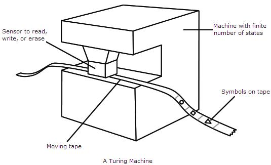
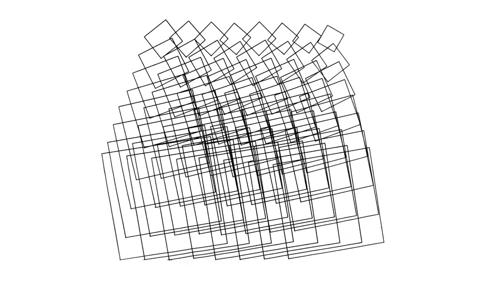
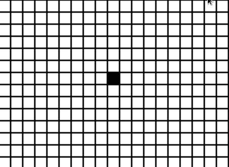
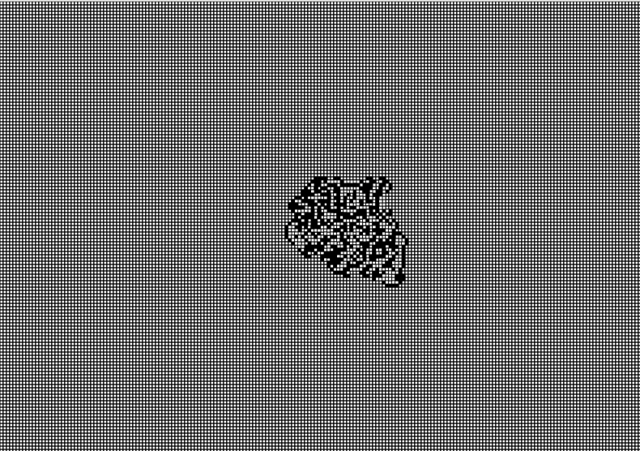

Title: Automatisms
page_order: 6

## AutoGenerator

## setup() 

Following the previous discussion of abstraction concerning objects, this chapter introduces the idea of the abstract machine. By this we refer to the creation of rules generated by a self-operating machine, widely known as an abstract machine or Turing machine. It was mathematician and computer scientist Alan Turing who first described this kind of machine automation in his infamous article "On Computable Numbers, with an Application to the Entscheidungsproblem", published in 1936.[^Turing] He uses the term *universal computing machine* to theorize a model that describes how a machine "can be used to computate any computatable sequence",[^Turing1] understood as how a machine operates and follows a predetermined sequence of instructions that process input and produce output results. 

More specifically, the Turing machine is capable of six types of fundamental operations (at that time there wasn't a thing named computer) — including read, write, move left, move right, change state and halt/stop. Turing suggested these operations could be performed via running an endless tape (like memory/storage in a modern computer) with instructions on what symbols to read and write, as well as how to move. These instructions are fundamental principles of the Turing machine,[^visualization] but also modern computing, with the capability to compute tasks in numbers and auto-generate various processes. These instructions in turn pervade digital culture and seem to underwrite the wider processes of production, consumption and distribution of contemporary (informational) capitalism as we already partly covered in Chapter 4 - Data Capture.    



*Figure 5.1: An illustration of the Turing Machine*

This chapter thus explores how instructions are fundamental elements of adaptive systems, focusing more about how rules are performed and how they might produce unexpected results.

Focusing on rules and instructions are not only something programmers do, but also something you do when following a knitting pattern or recipe (as we will see with the preparation of tofu later). Artists have also produced artworks that are instruction-based as in the case of the Fluxus and the Conceptual Art movements of the 1960s and 1970s that set out to challenge art's object-ness, and its "dematerialisation".[^Lippard] There are many examples of commentators making the connections between these instruction-based works and computational art,[^Cox] for instance the survey exhibition *Programmed: Rules, Codes, and Choreographies in Art, 1965-2018*,[^exhibition], organized by Christiane Paul at the Whitney Museum of American Art (2018-19), explored how instruction-based practices have both responded to and been shaped by technologies. The work of artist Sol Le Witt is one of the obvious examples here, demonstrating how a concept is based on a set of instructions but the outcome might be different depending on the specific context and how the instructions are executed by other people. LeWitt explains: "The idea becomes a machine that makes the art".[^LeWitt] For example, the work *Wall Drawing #289* consists of three simple instructions but without specific detail on the angles and length of the lines:

1. twenty-four lines from the center 
2. Twelve lines from the midpoint of each of the sides
3. Twelve lines from each corner 


*Figure 5.2: Sol LeWitt, Wall drawing #289, 1976* [if copyright a problem then use a casey reas example maybe /g]

It becomes clear how conceptual practices combine idea and action in parallel to how performance works with scores and scripts, and in turn how programs work with instructions and their execution.[^McLean] LeWitt's work lends itself well to computation, and this was taken up by Casy Reas using Processing to render LeWitt's wall drawings from their instructions and thus to explore the parallels of interpretation and process in each case.[^Reas] Despite the quote above, in his accompanying text Reas makes an important distinction in that LeWitt's programs are to be executed and interpreted by people rather than machines as such. Yet it is the close connection and overlaps that interests him — also underlying the development of the Processing as a "software sketchbook" — wanting programming to be as immediate and fluid as the practice of drawing. 
 
Such practice of algorithmic drawing has been explored by pioneer artist Joan Truckenbrod, who has also exhibited her algorithmic and generative artwork in the same show. Another version of the exhibited piece titled *Organic, Fluid, Disruptive Geometry* (see Figure 5.3) presents a number of squares of variations in size and in rotated angle. The piece was coded with the programming language Fortran in the 1970s, simulating moving substance in natural phenomena. Simulating real world systems is one of the common approaches in generative art but for Truckenbrod, she is interested in how natural forces get re-interpreted and intervened by ideas, symbols and numbers that demonstrate the nature of ambiguity and spontaneity.[^joan1] The word 'natural' could be further extended to emergent- naturally evolving phenomena- in the real world. Recursive fractal trees[^tree] and flocking behaviors[^flock] are some of the examples that demonstrate generative and emergent qualities of simulating nature, which is based on the self organization of computation and autonomus agents that evolve over time.



*Figure 5.3: Joan Truckenbrod, Organic, Fluid, Disruptive Geometry, 1975. Image courtesy of the artist.* [copyright issue need to be resolved]

This kind of approach is important not only because of offering a different way to draw and author works by machines based on mathematical logic, but also to provide a sense of machinic creativity that — as in the previous chapter — questions the centrality of human (and more often than not, male) agency. In this chapter we aim to explore more complex combinations that combine people and machines (if not animals, considering our upcoming example is an ant). 

If we were to draw an ellipse in white color at the x and y coordinate 100 and 120, there is a direct correspondance to the instruction. The outcome is predictable as the instruction is followed to the rule, but this need not be the case as certain kinds of instructions or combinations of instructions can generate unruly results. As this is described in the book *10 PRINT CHR$(205.5+RND(1)); : GOTO 10*, the 10 Print program utilizes randomness to generate unpredictable processes and outcomes as perceived by human. This *generative* capacity throws into question the extent of control and autonomy over the creative process, made clear in the following definition of generative art:[^galanter]
> Generative art refers to any art practice where artists use a system, such as a set of natural languages, rules, a computer program, a machine, or other procedural invention, which is set into motion with some degree of autonomy contributing to or resulting in a completed work of art.

As we can see this definition does not limit itself to the use of computers and this is important to bear in mind as we proceed to focus on our sample code. In the following two examples we explore rule-based programs that unfold some of these issues of auto-generation, but as with previous ones we are interested in the wider implications. 

## start()

The first program is called *10 PRINT* based on one line of program code `10 PRINT CHR$(205.5+RND(1));: GOTO 10`, written in the BASIC programming language and executed on a Commodore 64 home computer. It generates an endless pattern on the screen. It is printed in the 1982 *Commodore 64 User's Guide* and later published on the web. This line of code has become an important example in the field of software studies to demonstrate the history and culture of creative computing.[^10print] *10 PRINT* in `p5.js` below is used to help us become familiar with rules and its creative potential to demonstrate some degree of autonomy within a system.  

The second program is entitled *Langton's Ant* (1986), a two-dimensional universal Turing machine invented in 1986 by the computer scentist Christopher Langton who is considered to be one of the founders of field of artificial life.[^Langton] The core difference with *10 PRINT* is the way that complex emergent behavior is generated with only a simple set of rules. 

## Exercise in class (10 PRINT)


*Figure 5.4: 10 PRINT in p5.js*

[RUNME](https://editor.p5js.org/siusoon/sketches/pQlol8qc)

1. **Read** the source code of *10 PRINT* then copy it and run it on your own computer.

```javascript
let x = 0;
let y = 0;
let spacing = 10;

function setup() {
  createCanvas(windowWidth,windowHeight);
  background(0);
}

function draw() {
  stroke(255);
  if (random(1) <0.5) {  
    line(x,y,x+spacing,y+spacing);
  } else {
    line(x,y+spacing,x+spacing,y);
  }
  x+=10;
  if (x > width) {
    x = 0;
    y += spacing;

  }
}
```

2. **Discuss** the following rules of *10 PRINT* and map them to the related lines/blocks of code:
    - Throw a dice randomly and half of the time print a backward slash
    - The other half of the time will print a forward slash

3. Drawing upon the text *Randomness*:
    - **How** is the flow of control being implemented in *10 PRINT*? 
    - **What** might be the (un)predictability of regularity? 
    - **What** is randomness to a computer?[^Haahr] 
    - **Discuss** the use and the role of randomness in *10 PRINT* and in the arts, literature, and games? 
    
4. Try to modify the existing rules, for example: 
    - Can we change the size, color and spacing of the slashes? 
    - Can we have other outputs beyond just the backward and forward slash?

5. *10 PRINT* has been appropriated by many artists, designers and students. Take a look at some of the different possibilities for [*10 PRINT*](https://twitter.com/search?q=%2310print&src=typd) that are documented on Twitter. Your in-class task is to create a sketch with a clear set of rules and that operates as a modified version of *10 PRINT*.  

## Langton's Ant 

While 10 Print focuses both on instructions and randomness in terms of generative processes, we want to further look into the concept on *emergence* in the context of automated and generative program which is heavily based on simple rules that generate complex patterns/outcomes. *Langton's Ant* is a classical mathematical game that simulates the molecular logic of a living ant. The simulation of the cell's state is inspired by the classical Turing machine that can perform computational tasks with the manipulation of symbols on a strip of tape according to a set of rules. 

This section presents the sample code to simulate the cell states, presenting in a two-dimensional grid system in either the color black or white. Based on simple rules, an ant is considered to be the sensor that processes the cell's data as input, then the cell will change it's color by having the ant moving in four possible directions. Gradually, the ant will turn the grid into a more complex system that exhibits emergent behavior over time.



*Figure 5.5: Langton's Ant - Initial steps*

With the initial direction of an ant pointed upwards (i.e. North position), figure 5.5 shows the initial 33 steps of  *Langton's Ant* in following the two general rules below:

1. If the ant is at a white cell, it turns right 90° and changes to a black cell then moves forward one unit.
2. If the ant is at a black cell, it turns left 90° and changes to a white cell then moves forward one unit. 

At the beginning, the canvas displays only a grid system and all the individual cells are set in white color. The ant has  four possible directions — UP, RIGHT, DOWN, LEFT — and can turn 90° either left or right subject to the color of the cell. The ant's head is pointing in an UPWARD position at the start, and is located in the middle of the white grid. It then follows rule 1 above to rotate the head direction from UP to RIGHT, then it also changes the white cell to the black and moves forward one unit (pointing to the right as per the new head direction). Then the second step is to follow rule 1 again because the new cell is still white. The ant's head direction will turn right 90° and point from RIGHT to DOWN, and then changes the white cell to black and the ant moves forward one unit. Then the third and forth steps are similar to the previous ones until the ant meets a cell which is black, which is started in step 5. At this point, the ant will follow rule 2 instead to change back the cell's color to white and then turns left 90° instead of the right. The complexity builds. 



*Figure 5.6: Langton's Ant - Process*

Figure 5.6 shows how the ant starts building the emergent 'highway' pattern[^Moreira] after the first few hundred moves with simple symmetricial patterns. It is then followed by an additional 9000 steps[^Steps] with the seemingly random steps at the center. The highway pattern repeats indefinitely until most of cells are reconfigured, leading to something that is similar to Figure 5.7 at which point the ant is still constantly moving and changing the color of the cells.


*Figure 5.7: Langton's Ant - a snapshot of emergence*

[RUNME](https://siusoon.gitlab.io/aesthetic-programming/sketch07/)

## Source code (Langton's Ant)
```javascript
let grid_space = 5; //e.g. 4, 5, 10 need to be dividable as an integer by the width and height of the canvas
let grid =[]; //on/off state
let cols, rows; //for drawing the grid purpose
let xPos, yPos; //current position in terms of rows and cols, not actual pixel
let dir; //current direction of the ant
const antUP = 0;
const antRIGHT = 1;
const antDOWN = 2;
const antLEFT = 3;
let offColor;
let onColor;

function setup() {
  createCanvas(1000,700);
  offColor = color(255); //setting offcolor
  onColor = color(0); //setting onColor
  background(offColor);
  grid = drawGrid();
  xPos = floor(cols/2); //initial x position and make sure it is an integer in the grid array
  yPos = floor(rows/2); //initial y position and make sure it is an integer in the grid array
  dir = antUP; //initial direction
  frameRate(20);
}

function draw() {
  for (let n = 0; n < 100; n++) { //for running faster per frame, try changing the n value
   checkEdges();
   let state = grid[xPos][yPos]; //check the current cell's state
   if (state == 0) { //rule 1
    dir++; // turn right 90°
    grid[xPos][yPos] = 1; //change the currect cell's state to 'on'
    fill(onColor); //subsequent color change
    if (dir > antLEFT) {
      dir = antUP; //reset the counter
    }
   }else{ //rule 2
    dir--; //turn left 90°
    grid[xPos][yPos] = 0; //change the current cell's state to 'off'
    fill(offColor); //subsequent color change
    if (dir < antUP) {
      dir = antLEFT; //reset the counter
    }
   }
   rect(xPos*grid_space, yPos*grid_space, grid_space, grid_space);
   nextMove();
  }
}
function drawGrid() {
  cols = width/grid_space;
  rows = height/grid_space;
  let arr = new Array(cols);
  for (let i=0; i < cols; i++) { //no of cols
    arr[i] = new Array(rows); //2D array
    for (let j=0; j < rows; j++){ //no of rows
      let x = i * grid_space; //actual x coordinate
      let y = j * grid_space; //actual y coordinate
      stroke(0);
      strokeWeight(1);
      noFill();
      rect(x, y, grid_space, grid_space);
      arr[i][j] = 0; //assign each cell with the off state + color
    }
  }
  return arr; //a function with a return value of the cell's status
}

function nextMove () { //check which direction to go next and set the new current direction
  if (dir == antUP) {
    yPos--;
  } else if (dir == antRIGHT) {
    xPos++;
  } else if (dir == antDOWN) {
    yPos++;
  } else if (dir == antLEFT) {
    xPos--;
  }
}

function checkEdges() { //check width and height boundary
  if (xPos > cols-1) { //reach the right edge
    xPos = 0; //go back to the left
  } else if (xPos < 0) { //reach the left edge
    xPos = cols-1; //go to the right edge
  }
  if (yPos > rows-1) { //reach the bottom edge
    yPos = 0; //go back to the top
  } else if (yPos < 0) { //reach the top edge
    yPos = rows-1; //go to the bottom
  }
}

```

## Reading Langton's Ant

Based on the above example, there are three areas can help in slowing down or zooming in on the program. 
1. `let grid_space = 5;`: You can change the value to 10 then you are able to see it at a larger size.   
2. `frameRate(20);`: Lower the frame rate value can help slower down the program
3.  `draw()`: This function contains a for-loop where n is the number of steps of the ant so if desired you can reduce the `n < 100` to `n < 1` in the line `for (let n = 0; n < 100; n++) {` thus instructing the program to only process n steps per frame.

Intead of going through the code line by line, this following is more to show what each function does. 

- `function setup()`: This is more to setup the canvas size, initiate the ant's head direction, frame rate, color and to prepare drawing the background grid structure.

- `function drawGrid()`: To divide the canvas into a grid structure with lines.

- `function draw()`: This is the main function to check against the two rules of Langton's Ant and change the color of cells. 

- `function nextMove()`: The four directions are structured in a number format so that the variable `dir++` can be used for incrementing or decrementing the ant's direction. Each different direction of *UP, RIGHT, DOWN, LEFT* corresponds to moving forward in either horizontal (xPos) or vertical (yPos) steps on the canvas. 

- `function checkEdges()`: This function is to check if the ant moves out of the four edges, then it will continue at the other end. 

Technically speaking, there is no new syntax here as the 2-dimensional arrays have already been covered briefly in Chapter 4 - Data Capture. However, there is the new use of 2-dimensional arrays and nested for-loops in the sample code. 

## Two-dimensional arrays & nested for-loops

Daniel Shiffman has created a tutorial (both in written[^shiffman1] and video[^shiffman2] formats) to discuss how a 2-dimensional array is essentially an array of other arrays. He also suggests that it is useful to think about 2-dimensional arrays with a grid structure which aligns nicely with the background of *Langton's Ant* designed as a grid in two dimensions with both columns and rows. Since we need to identify the state of each cell, we need to know the exact x and y position of each cell. 

Let's examine the source code again for the grid drawing: 

```javascript
function drawGrid() {
  cols = width/grid_space;
  rows = height/grid_space;
  let arr = new Array(cols);
  for (let i=0; i < cols; i++) { //no of cols
    arr[i] = new Array(rows); //2D array
    for (let j=0; j < rows; j++){ //no of rows
      let x = i * grid_space; //actual x coordinate
      let y = j * grid_space; //actual y coordinate
      stroke(0);
      strokeWeight(1);
      noFill();
      rect(x, y, grid_space, grid_space);
      arr[i][j] = 0;  //assign each cell with the off color and link to individual cells
    }
  }
  return arr; //a function with a return value
}
```

To create an array, we use the syntax `let arr = new Array(cols);` and this line indicates the grid in columns and the length of the array is the number of columns. Since we also need to cater for the number of rows, we create another array out of each existing array in the column with the line `arr[i] = new Array(rows);`. This syntax is put under a for-loop to loop through each of the columns but then with the addition of number of rows (which is derived from the canvas' height). Therefore, 2-dimensional arrays are structured in this way: `arr[][]`. 

In order to know the exact x and y coordinates of each cell within a grid structure, it depends on which columns and which rows you are pointing at with the formular `x = i * grid_space;` and `y= j * grid_space;` respectively. By using two nested for-loops, the program will loop through each column and each row (under the same column) until the program runs to the last column. Ultimately, we are able to get the x and y coordinates with the syntax `array[i][j]`, which is applied to columns (with the variable i) and rows (with the variable j).

Therefore, each divided cell is presented in the structure of a 2-dimensional array. It depends on the width and height of the canvas and how you want to distribute the space. Each cell represents a possibility that an ant can move as a unit and demonstrate an on or off state that is represented in the color black or white. 

## Exercise in class

1. Give yourself sometime to **read and tinker** with the code, as well as to **observe** the different stages of *Langton's Ant*. 

2. Right now the *Langton's Ant* program is more about representing the world of an ant through abstraction, such as limited cell color, as well as only being able to move in four directions and turn 90°. Rethink the rules that have been implemented. Can you try **changing the existing rules or adding new rules** so that the ant behaves differently? (Recall what you have changed in the previous exercise on *10 PRINT*.) 

3. It is clear that in simulating and abstracting living systems — such as the complex behaviour of insects — there is a focus on emergent and generative process over end-result. In terms of creative process this allows us to think about how rules and instructions can produce complexity and other forms of control and agency. Let's discuss the following questions:
    - Can you **think of, and describe**, other systems and processes that exhibit emergent behaviour? 
    - How would you **understand autonomy** in this context?[^Watz] To what extent do you consider **the machine to be an active agent** in generative systems? **What** are the implications for wider culture?

## While()

We already have discussed the idea of unleashing potential in the previous chapter and it would seem that generative systems promise something similar as a means to change an existing system. The parallel to living systems is made clear in *Game of Life* — developed by the mathematician Jon Conway in 1970[^Conway] — a further example of a Turing machine and how an evolutionary process is determined by its initial state, requiring no further input, and producing emergent forms. Langton's Ant — our earlier example — is also based on principles of *cellular automata* in which there is a regular grid of cells, each in one of a finite number of states, such as on and off, or alive and dead in this case. We have already explored the reductive logic of this somewhat in this chapter but this example is also troubling for its 'necropolitical' dimension[^necro]: articulating life and death in terms of populations and neighbourhoods, as if part of a social cleansing programme (or dystopian smart city[^smart]). 

Every cell interacts with other cells that are directly adjacent, and the following transitions occur:

 - Any live cell with fewer than two live neighbours dies, as if by underpopulation.
 - Any live cell with two or three live neighbours lives on to the next generation.
 - Any live cell with more than three live neighbours dies, as if by overpopulation.
 - Any dead cell with exactly three live neighbours becomes a live cell, as if by reproduction.

Perhaps this is simply a poor example of abstraction. That said, there is an alternative political potential here in the way an adaptive complex organism can assemble itself *bottom-up*, without a central *top-down* command and control mechanism.[^emergence] This is referred to a *revolutionary* moment where it becomes impossible to predict the direction change will take, and whether it will fall into a higher level of order or disintegrate into chaos. We return to ants again here as the study of ant colonies reveal that there is no discernible hierarchy at work, and although humans have named the ants in provocative terms, the 'queen' is not an authority figure at all but an egg-laying functionary, and the workers operate in a cooperative rather than feudal structure (as an aside, the workers are all female, but the gender politics of ants is outside our scope). 

To be more precise, and according to complexity theory, all systems contain subsystems that are continually fluctuating. It is possible that one or more fluctuations, as a result of feedback, may change the preexisting organisation of the system, and as such the multiple interacting elements of a system cannot be governed and the collective behaviour cannot be predicted, as Ilya Prigogine and Isabelle Stengers explain in *Order Out of Chaos*:

> "A society defined entirely in terms of a functional model would correspond to the Aristotelian idea of natural hierarchy and order. Each official would perform the duties for which he [sic] has been appointed. These duties would translate at each level the different aspects of the organization of the society as a whole. The king gives orders to the architect, the architect to the contractor, the contractor to the worker. On the contrary, termites and other social insects seem to approach the 'statistical' model. As we have seen, there seems to be no mastermind behind the construction of the termites' nest, when interactions among individuals produce certain types of collective behaviour in some circumstances, but none of these interactions refer to any global task, being all purely local."[^chaos] 

If we look to a history of computing for an understanding of emergent behaviour, we might turn to Turing's article of 1952 "The Chemical Basis of Morphogenesis" for its description of the way in which natural patterns naturally arise from a homogeneous, uniform state.[^morpho] This idea of morphogenesis is something that the political theorist and activist Franco 'Bifo' Berardi has utilised to describe social and political mutation, or when new political form emerges and takes shape. He is thinking of how processes of automation have not only replaced physical acts of production with information technology, but how automation has transformed cognitive activity itself. The effect "implies the reduction of cognitive activity to algorithmic procedures, and the insertion of "automatisms into the social existence of the general intellect".[^eflux] One of the consequences is that automation is taking the place of political decision — "Yes or no... no nuances, no ambiguity" — and for Berardi this implies the end of political democracy, and the establishment of an automatic chain of logical procedures intended to replace conscious voluntary choices and decision-making. Not only has the human capacity for thinking been captured by the machine in this way, according to Berardi, but our feelings too.[^Bifo] 

Part of the problem is that we have been learning words from machines, not from other humans — the mother, he says (and clearly his mother wasn't a computer[^mother]) — leading to a situation where language and feelings have been separated. He calls this a catastrophe of modern humanism, where we no longer have sufficient attention spans for love, tenderness, and compassion. This brings us neatly to our last example, the generative *love-letters* that appeared on the notice board of Manchester University’s Computer Department in 1953. These computer-generated declarations were produced by a program written by the programmer Christopher Strachey using the built-in random generator of the Manchester University Computer (the Ferranti Mark I), the earliest programmable computer. Regarded by some as the first example of a digital artwork,[^Noah] and by Jacob Gaboury as a critique of hetero-normative love, not least as Strachey like Turing was queer.[^Gaboury] Moreover this is arguably more than a longing for same sex love but something more queer such as human-machine love.

Artist David Link has since reconstructed a functional replica of both the hardware and the original program, following meticulous research on the functional aspects.[^loveletters] The main program is relatively simple, using loops and a random variable to follow the sentence structure: "You are my — Adjective — Substantive,” and “My — [Adjective] — Substantive — [Adverb] — Verb — Your — [Adjective] — Substantive." Some words are fixed and some optional, indicated by the square brackets. The program selects from the list of options—adjectives, adverbs, and verbs — and loops are configured to avoid repetition. The software could generate over 318 billion variations. In terms of effect, the dialogic structure is important too in setting up an exchange between *Me* (the program writer) and *You* (the human reader), such that you feel addressed directly. The resultant declarations suggest a surprising tenderness of expression that runs contrary to what we consider the standard functional outcomes of computational procedures. This is far from a reductionist view of love, and perhaps the challenge for those making programs is to generate queer recombinant forms. We end this chapter with a sample output:

> DEAR DARLING

> YOU ARE MY BEAUTIFUL RAPTURE. MY INFATUATION BEAUTIFULLY CLINGS TO YOUR ADORABLE LUST. MY INFATUATION LUSTS FOR YOUR WISH. MY AMBITION CURIOUSLY LIKES YOUR LOVE. YOU ARE MY DEAR EAGERNESS.

> YOURS WISTFULLY

> M. U. C.

## Mini_Exercise[5]: A generative program

**Objectives:**
- To implement a rule-based generative program from scratch.
- To strengthen the computational use of loops and conditional statements in a program.
- To reflect upon the concept of auto generator conceptually and practically.

**Get some additional inspiration here:**
- [{Software} Structure #003 A by Casey Reas](https://whitney.org/exhibitions/programmed?section=1&subsection=6#exhibition-artworks)
- [Generative Design - sketches](http://www.generative-gestaltung.de/2/), [source code](https://github.com/generative-design/Code-Package-p5.js)
- [GenArt (with source code)](https://github.com/JosephFiola/GenArt) by JosephFiola, see ch.1-4
- [Open Processing with the search keyword 'generative'](https://www.openprocessing.org/browse/?q=generative&time=anytime&type=all#)
- [Generative Artistry by Ruth John and Tim Holman ](https://generativeartistry.com/tutorials/)
- [John Conway's Game of Life](http://web.stanford.edu/~cdebs/GameOfLife/)
- [John F. Simon Jr.'s Every Icon, from 1996](http://www.numeral.com/panels/everyicon.html)
- [The recode project](http://recodeproject.com/) or https://web.archive.org/web/20181227225001/http://www.recodeproject.com/
- [WUOUS by Anders Visti and Tobias Stenberg](https://andersvisti.dk/work/wuos-2019) (with an implementation of the Langton's Ant)

**Tasks (RUNME):**
1. Start with a blank paper. Think of at least two simple rules that you want to implement in a generative program. (You may take reference from Langton's ant (1986) and The Game of Life (1970))
2. Based on the rules that you set in step 1, then design a generative program that utilizes **at least one for-loop/while-loop and one conditional statement** but without any direct interactivity. Just let the program run and emerges automatically. (You may also consider to use `noise()` and `random()` syntax if that helps)

**Questions to think about as README:**
- What are the rules in your generative program and describe how your program performs over time and how are the running of the rules contingently enabled emergent behaviors? 
- What's the role of rules and processes in your work?
- Draw upon the assigned reading(s), how does this mini-exericse help you to understand auto generator (e.g control, autonomy, instructions/rules)? Do you have any further thoughts about the theme of this chapter? 

## Required reading:
- Montfort, N, et al. "Randomness". *[10 PRINT CHR$(205.5+RND(1)); : GOTO 10](https://10print.org/)*, The MIT Press, 2012, pp. 119-146 (The chapter: Randomness)
- [6 mins video] [Langton's Ant Colonies](https://www.youtube.com/watch?v=w6XQQhCgq5c)
- [1 hour video] Marius Watz, "Beautiful Rules: Generative Models of Creativity", in *The Olhares de Outono* (2007), https://vimeo.com/26594644.
- [p5.js - 2D Arrays in Javascript by Daniel Shiffman](https://www.youtube.com/watch?v=OTNpiLUSiB4) 

## Further reading:
- Langton, Chris G. (1986). "[Studying artificial life with cellular automata](https://deepblue.lib.umich.edu/bitstream/2027.42/26022/1/0000093.pdf)". Physica D: Nonlinear Phenomena. 22 (1–3): 120–149.
- [The Game of Life (1970)](https://en.wikipedia.org/wiki/Conway%27s_Game_of_Life) by John Horton Conway
- [The Recode Project](http://recodeproject.com/) and [Memory Slam](http://nickm.com/memslam/) by Nick Montfort
- Galanter, Philip. "[Generative Art Theory](http://cmuems.com/2016/60212/resources/galanter_generative.pdf)". *A Companion to Digital Art*. Eds. Christiane P, 2016.
- [How to Draw with Code by Casey Reas](https://www.youtube.com/watch?v=_8DMEHxOLQE)
- [p5.js Coding Challenge #14: Fractal Trees - Recursive by Daniel Shiffman](https://www.youtube.com/watch?v=0jjeOYMjmDU)
- [p5.js Coding Challenge #76: Recursion by Daniel Shiffman](https://www.youtube.com/watch?v=jPsZwrV9ld0)
- [noise() vs random() - Perlin Noise and p5.js Tutorial by Daniel Shiffman](https://www.youtube.com/watch?v=YcdldZ1E9gU)

## Notes

[^Turing]: Alan Mathison Turing, "On Computable Numbers, with an Application to the Entscheidungsproblem", *Proceedings of the London Mathematical Society* 2.1 (1937): 230-265.
[^Turing1]: Ibid., 241.
[^visualization]: A visualization of the Turing Machine can be found here: https://turingmachine.io/.
[^Lippard]: Reference to Lucy Lippard, ed. *Six Years: The Dematerialization of the Art Object from 1966 to 1972* (London: University of California Press, 1997). 
[^Cox]: One example of many, and also connected to an exhibition, is Geoff Cox's' "Generator: The Value of Software Art", in Judith Rugg and Michèle Sedgwick, eds., *Issues in Curating Contemporary Art and Performance* (Bristol: Intellect, 2007), 147-162; available at https://monoskop.org/images/5/53/Cox_Geoff_2007_Generator_The_Value_of_Software_Art.pdf. Interestingly, this includes a description of Adrian Ward's *Auto-Illustrator*, released as a boxed version for the exhibition "Generator" (2002-3) with an accompanying "User’s  Manual" that contained both technical detail and critical essays. In many ways this sets a precedent for the publication you are reading.
[^exhibition]: The exhibition "Programmed: Rules, Codes, and Choreographies in Art, 1965–2018" was held at the Whitney Museum of American Art, New York (28 Sep 2018 – 14 Apr 2019), and organized by Christiane Paul and Carol Mancusi-Ungaro, with Clémence White. See https://whitney.org/exhibitions/programmed. An earlier well-cited example would be the 1970 exhibition “Software — Information Technology: Its New Meaning for Art” at the Jewish Museum in New York, curated by Jack Burnham. For Burnham, the exhibition "Software" encouraged an understanding of underlying structures in art and information systems, and by drawing together practices in computer technology with conceptual art, software was to be seen as a metaphor for information exchange. 
[^LeWitt]: Sol LeWitt cited in Lippard, ed. *Six Years: The Dematerialization of the Art Object from 1966 to 1972*. 
[^McLean]: More on the aesthetic dimension of this: "The code and the resultant actions are intricately linked in poetic dialogue. To separate the code and the resultant actions would simply limit the aesthetic experience, the code and it excode lies in its execution, not simply its written form." Geoff Cox, Alex McLean, and Adrian Ward, "The Aesthetics of Generative Code", Generative Art 00, international conference, Politecnico di Milano, 2001, https://www.academia.edu/10519146/The_Aesthetics_of_Generative_Code.  
[^Reas]: For an explanation of this work, and linked docuementation, see Casey Reas, "{Software} Structures",  https://artport.whitney.org/commissions/softwarestructures/text.html
[^galanter]: Philip Galanter, *What is Generative Art? Complexity theory as a context for art theory*. In GA2003-6th Generative Art Conference, Milan (2003). 
[^10print]: Nick Montfort, et al, *10 PRINT CHR $(205.5+ RND (1));: GOTO 10* (Cambridge, Mass., MIT Press, 2012_.
[^Haahr]: See Mads Haahr, "Introduction to Randomness and Random Numbers", https://www.random.org/randomness/ and Montfort, N, et al. "Randomness". *[10 PRINT CHR$(205.5+RND(1)); : GOTO 10](https://10print.org/)*, The MIT Press, 2012, pp. 119-146.
[^Langton]: Christopher G. Langton, “Studying Artificial Life with Cellular Automata”, *Physica D: Nonlinear Phenomena* 22, no. 1–3 (October 1986): 120–49. https://doi.org/10.1016/0167-2789(86)90237-X.
[^shiffman1]: See "Two-dimensional Arrays" written for the Processing Community: https://processing.org/tutorials/2darray/.
[^shiffman2]: See the video intruction on 2D Arrays in p5.js: https://www.youtube.com/watch?v=OTNpiLUSiB4.
[^emergence]: For more on emergent behaviour, eee Steven Johnson, *Emergence: The Connected Lives of Ants, Brains, Cities and Software* (London: Penguin, 2001), 20). 
[^Moreira]: Andrés Moreira, Anahí Gajardo and Eric Goles. “Dynamical Behavior and Complexity of Langton’s Ant”, *Complexity* 6, no. 4 (March 2001): 46–52. https://doi.org/10.1002/cplx.1042.
[^Steps]: See the web-based step by step running of the Langton's Ant implemented by Barend Köbben in 2014, https://kartoweb.itc.nl/kobben/D3tests/LangstonsAnt/.
[^Watz]: For instance, generative artist Marius Watz would suggest that "autonomy is the ultimate goal", from his talk "Beautiful Rules: Generative Models of Creativity", in *The Olhares de Outono* (2007), https://vimeo.com/26594644.
[^Conway]: More information on Conway's *Game of Life* and related cellular automata can be found at https://www.conwaylife.com/.
[^necro]: As a further developement of 'biopolitics' (a term from Michel Foucault to indicate the use of power to control people's lives), 'necropolitics' is the use of social and political power to dictate how some people may live and how some must die. See Achille Mbembe, "Necropolitics", *Public Culture* 15 (1) (2003): 11–40.
[^smart]: See the artwork *WUOUS* by Anders Visti and Tobias Stenberg with an implementation of *Langton's Ant* to question the procedural logic of so-called 'smart cities': https://andersvisti.dk/work/wuos-2019. 
[^chaos]: Ilya Prigogine and Isabelle Stengers, *Order Out of Chaos: Man’s New Dialogue With Nature* (London: Fontana, 1985), 205.
[^morpho]: Alan Mathison Turing, "The Chemical Basis of Morphogenesis" (PDF). *Philosophical Transactions of the Royal Society of London B*, 237 (641) (1952): 37–72. doi:10.1098/rstb.1952.0012. JSTOR 92463. 
[^eflux]: Franco “Bifo” Berardi, "The Neuroplastic Dilemma: Consciousness and Evolution", in *e-flux* jouurnal #60 (December 2014), https://www.e-flux.com/journal/60/61034/the-neuroplastic-dilemma-consciousness-and-evolution/. "General Intellect" is a key concept taken from Marx's *Grundrisse*, in the passage "Fragment on Machines", used to indiacte the coming together of technological expertise and social intellect. Terranova is also drawing upon this concept when she argues that the evolution of machinery also unleashes productive powers, as referenced in Chapter 4 — DataCapture. 
[^Bifo]: Franco “Bifo” Berardi, *Precarious Rhapsody: Semiocapitalism and the Pathologies of the Post-Alpha Generation* (London: Minor Compositions, 2009), 9.
[^mother]: In N. Katherine Hayles’ *My Mother Was a Computer*, she charts how in the 1930s and 1940s, mostly women were employed to do calculations and were referred to as computers. N. Katherine Hayles, *My Mother Was a Computer* (Chicago: University of Chicago Press, 2005). Hayles takes her title from a chapter in the book *Technologies of the Gendered Body* by Anne Balsamo, whose mother was one of these computers. 
[^Noah]: Noah Wardrip-Fruin, "Christopher Strachey: The First Digital Artist?". *Grand Text Auto*, School of Engineering, University of California Santa Cruz (1 August 2005).
[^Gaboury]: Jacob Gaboury, "A Queer History of Computing", *Rhizome* (9 April 2013). We return to the issue of Turing's sexuality in the next chapter — VocableCode. 
[^loveletters]: David Link's *LoveLetters_1.0: MUC=Resurrection* was first exhibited in 2009, and was part of dOCUMENTA(13), Kassel, in 2012. A detailed description and documentation can be found at http://www.alpha60.de/art/love_letters/. Also see Geoff Cox, Introduction" to David Link, *Das Herz der Maschine* (dOCUMENTA (13): 100 Notes - 100 Thoughts, 100 Notizen - 100 Gedanken # 037) (Berlin: Hatje Cantz, 2012).  
[^tree]: An example of the recursive fractal tree in p5.js by Martin Žilák, https://editor.p5js.org/marynotari/sketches/BJVsL5ylz
[^flock]: See Craig Reynold's flocking behavior with the p5.js source code, https://p5js.org/examples/simulate-flocking.html
[^joan1]: See Truckenbrod's interview Motion Through Series, https://vimeo.com/286993496.