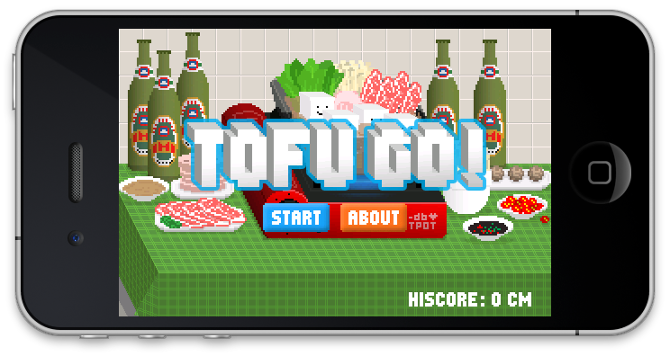
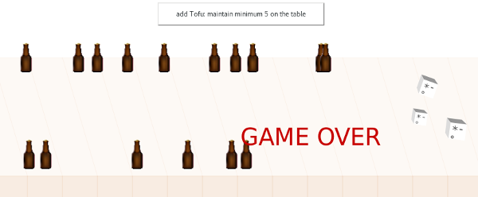

Title: 5. Object Abstraction
page_order: 5

## Object Abstraction

## 5.1 setup()
In the previous chapters, we have worked with different objects such as geometric shapes like ellipses, rectangles and polygons. One can apply different attributes to these objects, such as color, size and position. Additionally, they can exhibit certain behaviors such as moving, animating and rotation (as seen in Ch.3- Infinite Loops and Ch.4- Data Capture). But those geometric objects, in terms of using those functions, are already built-in within `p5.js` with a set of pre-defined arguments and attributes. In this chapter, we will work on constructing our own objects, attributes and behaviors, representing some parts of the objects from a physical or imagined world.

Object Abstraction in computing is about representation. Certain attributes and relations are abstracted from the real world, but at the same time details and contexts are left out. It is understood that objects in real world are complex and nonlinear. For example, Tofu, originated in China with over 2000 years, is a food made of soybean. Through soaking and grinding soybeans, as well as filering out remaining particulates, it becomes something known as soymilk, containing stable emulsion of oil, water, and protein. Such condensed soymilk is pressed into solid white blocks with varying softness as Tofu in a process similar to cheesemaking. The process of making Tofu involves different labour and machinic processes. It is an important food product specifically in the East, not only because of its protein richness but also as a cultural symbol. When Tofu becomes a game object, like in [Tofu Go](https://www.dbdbking.com/Tofu-Go) that is developed and designed by Francis Lam (HK/CN) [^francis], it is inevitably required to abstract the complexity of processes and relations, representing essential and desired elements. In the game, Tofu is designed as a white 3-d cube form with an emoticon, and it could also move and jump. Of course in the real world Tofu cannot behave in that way, but one can imgine how objects can be performed differently when you program your own software. 

Abstraction is one of the key concepts of Object-Oriented Programming (OOP). Its main goal is to handle object's complexity by presenting and abstracting certain details to users via representing a concrete model. Beatrice Fazi and Matthew Fuller discuss such concreteness of abstracted computation [^Fazi], and they said "Computation not only abstracts from the world in order to model and represet it; through such abstractions, it also partakes in it." If we recall the previous chapter of Data Capture with many different contemporary examples of tracking forms and data input capturing, it becomes clear that computation with material agency, in a wider cultural context, shaping a particular urban life and facilitating capitalistic metrification and datafication. In other words, objects in OOP are not only about negotiating with the real world as a form of realism and representation nor the formal logics that compose and design the objects, but also as a "contingent, real process" that "re-actualised by the interactions between and with the computational" that form a border set of relations. [^Fuller] 

Indeed, abstraction exists in many different layers and scales of computing. The everyday use of computers consist of a binary system to process data and information. At the lowest level of abstraction, the flow of information is stored, processed and represented in the form of the binary (base 2 number system) number of zeros and ones, including text, images, video and sound. [^binary] In other words, the way how we as human understand these multimedia formats is different from how a computer to process them as data (or more precisely as the binary number) including pixels, color values and waveforms. In this way, abstraction is all over in computing from a lower level like machine code and electric circuit to a higher level like graphical user interface and interaction. The farther away from the machine language of the computer, we call this as high-level abstraction including the programming language `p5.js` that we use in the book. 

In general, abstraction, as a fundamental concept of computing, hides details of how a computer work physically with logic gates in a binary system as well as reducing the complexity of computer operations (such as copying and deleting files) to users. But for this chapter, it will specifically focus on object abstraction, which is an approach in OOP, to think conceptually about how do objects model real or imaginary world. 

## 5.1.1 Start()

Before we go on to use *ToFu Go!* as the continuous example in this chapter. Let's try to think of a person as an object first and to consider what might be the properties and behaviors of that person. We use the name **class** to give an overview of the object's properties and behaviors. 
For example:

**Properties**: A person with the **name** called Yondi, in which they have brown **hair color**, **wears** glasses with **height** as 165 cm. Their **favorite color** is blue and their **favorite food** is Tofu.  

**Behavior**: A person can run from location A (train station) to location B (bus stop). 

From the above, we can construct a pseudo class that can use to create an object with the following properties and behaviors:

|Person                  |
| ---------------------- |
| Name, HairColor, withGlasses, Height, FavoriteColor, FavoriteFood, FromLocation, ToLocation |
| run()                  |

In the same token, we can *reuse* the same properties and behavior to create another *object instance* with the corresponding data values:

| Object instance 1            | Object instance 2         |
|------------------------------|---------------------------|
| Name = Yondi                | Name = Wendy              |
| HairColor = Brown            | HairColor = Black         |
| withGlasses = Yes            | withGlasses = No          |
| Height = 165 cm              | Height = 145 cm           |
| FavoriteColor = Blue         | favoriteColor = Black     |
| FavoriteFood = Tofu          | FavoriteFood = Salad      |
| FromLocation = Train station | FromLocation = University |
| ToLocation = Bus stop        | ToLocation = Home         |
| run()                        | run()                     |

From the pseudo object, we start to see how abstraction takes place in computation as *computerized material*, in which we only select properties and behaviors that we think is important to be represented in a program. This is a way of modeling/representing physical phenomena, simulating the behaviors of either a real or imaginary part of the world [^Madsen]. 

After the brief example of modeling the person object, we now move to the example that is inpsired by the game *ToFu go!*.



*Figure 5.1: A screenshot of the game ToFu Go!, developed and designed by Francis Lam*

[embeded video](https://www.youtube.com/watch?v=V9NirY55HfU])

In the following, we will use the game *ToFu Go!* (which is freely available on App Store [^App]) as the main flow of discussion and then a simplified version will be used for the sample code. As discussed before, *ToFu Go!* is a mobile game references to the context of Chinese food culture i.e HotPot. By programming a modified and simplier version of *ToFu Go!*, the remaining parts unfold the computational logics and modeling within the context of object oriented programming.

This chapter's sample code is a game with the following core components: 
1. A static table 
2. A cube-like Tofu as a class object. There are many object instances, and they appear in different parts of the table, running from left to right.
3. The button with the text "add Tofu: maintain minimum 5 on the table". It allows the addition of Tofu object instances.
4. There are continuous display of beer objects which move from right to left. (The beers are more considered as decorative objects in this game and in the chapter, which means the game can still function without them. We use the library of [p5.play](http://molleindustria.github.io/p5.play/) to control the beer image and together it illustrates a different way of constructing objects)
5. The simple game logic is to maintain at least 5 Tofu on the table, or else the game will stop with the dispaly of the text 'Game Over'.



*Figure 5.2: A screenshot of the simplified Tofu go!.*

## Source Code 
The source code is divided into two pieces, one with all the core functions in sketch.js, and the other tofu.js that specifies the class/object relationship. Sometimes it gives a clearer overview of the program if you seperate the program into different functions and files. To enable the two js files, you need to add the following into the index.html file:

```html
  <script language="javascript" type="text/javascript" src="sketch.js"></script>
  <script language="javascript" type="text/javascript" src="Tofu.js"></script>
```

sketch.js:

```javascript
let tofu = [];
let button;
let beerImage, beer, beers, beerY;
const max_beer=20, min_beer=10;
let min_tofu = 5;
let height_limit;

function preload() {
  beerImage = loadImage("data/beer2.png");
}
function setup() {
  createCanvas(windowWidth, 600);
  height_limit = height/4; //a reference point for the table, beers and tofu
  button = createButton("add Tofu: maintain minimum " + min_tofu + " on the table");
  button.style('background-color','white');
  button.style('padding','10px 30px');
  button.style('font-size','12px');
  button.mousePressed(addTofu);
  addBeers();
  for (let i=0; i<=min_tofu; i++) {
    tofu[i] = new Tofu(30); //create/construct a new object instance
  }
}
function draw() {
  background(255);
  button.position(width/3,55);
  drawTable();
  checkBeer();
  for (let i = 0; i <tofu.length; i++) {
    tofu[i].move();
    tofu[i].show();
    if (tofu[i].pos.x > width){
      tofu.splice(i,1); //first argument is start at which index, and the second one stands for how many
    }
  }
  let loser = checkLoser();
  if (loser==true){
    fill(200,0,0);
    textSize(40);
    text("GAME OVER", width/2, height/2);
    noLoop();
  }
}

function addBeers() { //sprite - using p5.play library
  beers = new Group();
  for (let i=0; i < max_beer ; i++ ){
    beerImage.resize(20,50);
    if (floor(random(0,2)) == 0){
      beerY = height_limit;
    }else {
      beerY = height/1.9;
    }
    beer = createSprite(random(width, width+width), beerY);
    beer.addImage('normal', beerImage);  // can check for other sprite' properties e.g beer.rotationSpeed = random(-1,-3);
    beer.addToGroup(beers);
  }
}
function drawTable() {
  let texture_width = 60;
  stroke(196,98,16,15);
  fill(196,98,16,10);
  rect(0,height_limit, width, height/2.95);
  let tableX=-texture_width;
  for (let i = 0; i < width/texture_width+1; i++) {
    line(tableX, height_limit, tableX+texture_width, height_limit+height/2.95);
    tableX+=texture_width;
  }
  fill(196,98,16, 30);
  rect(0,height/1.7, width, 40);
  let edgeX = 0;
  stroke(196,98,16, 30);
  for (let i = 0; i < width/texture_width; i++) {
    line(edgeX, height/1.7, edgeX, height/1.7+39);
    edgeX+=texture_width;
  }
}
function checkBeer() { //check beer availability
      for(let i = 0; i<beers.length; i++) { //add beer
        let b = beers[i];
         b.velocity.x = -2;
         if(b.position.x < -10) { //check out of screen
           b.remove();  //remove sprites when they are out of screen
         }
      }
      if (beers.length < min_beer) { //refill beer on the screen
        addBeers();
      }
      drawSprites();
}
function addTofu() {   //speed, xpos, ypos, size
  tofu.push(new Tofu(floor(random(0,20))));
}
function checkLoser() {
    if (tofu.length < min_tofu) {
      return true;
    }
}
```
tofu.js:

```javascript 
class Tofu { //create a class: template/blueprint of objects with properties and behaviors
    constructor(xpos) { //initalize the objects
    this.speed = floor(random(3,10));
    this.pos = new createVector(xpos, floor(random(height_limit+20,height_limit+115)));  //check this feature: https://p5js.org/reference/#/p5/createVector
    this.size = floor(random(30,35));
    this.toFu_rotate = random(0,PI/8); //rotate in clockwise for +ve no
    this.emoji_size = this.size/1.5;
    }
  move() {  //moving behaviors
    this.pos.x+=this.speed;  //i.e, this.pos.x = this.pos.x + this.speed;
  }
  show() { //show tofu as a cube
    push()
    translate(this.pos.x, this.pos.y);
    rotate(this.toFu_rotate);
    noStroke();
    fill(255); //front plane
    rect(0,0, this.size,this.size);
    fill(150); //top
    beginShape();
    vertex(0,0);
    vertex(0-this.size/4,0-this.size/4);
    //vertex(0+this.size/0.45,0-this.size/5); //special hair style
    vertex(0+this.size/1.5,0-this.size/4);  //no special hair style
    vertex(0+this.size, 0);
    endShape(CLOSE);
    fill(220);//side
    beginShape();
    vertex(0, 0);
    vertex(0-this.size/4,0-this.size/4);
    vertex(0-this.size/4,0+this.size/1.5);
    vertex(0,0+this.size);
    endShape(CLOSE);
    fill(80); //face
    textSize(this.emoji_size);
    text('*',0+this.size/6, 0+this.size/1.5);
    text('-',0+this.size/1.7, 0+this.size/1.9);
    text('。',0+this.size/8, 0+this.size/1.15);
    pop();
  } 
}
```
## class

To first construct objects in OOP, it is important to have a blueprint. A class specifies the structure of its objects' attributes and the possible behaviors/actions of its objects. Therefore, classs can be understood as a template and blueprint of things.  

Similar to the template that we had for a person object, we have the followings:

|Tofu                                              |
| ------------------------------------------------ |
| speed, xpos, ypos, size, toFu_rotate, emoji_size |
| move(), show()                                   |

You may refer to Tofu.js with the full source code on how the Tofu class is constructed.

**(Step 1) Naming**: Give a name of your class

```javascript
class Tofu {

}
```
In the sample code above, we have Tofu as the class name and tofu as the name of object instances. The things within a class describes what it means to be the object, such as what are the properties, the data values, and behaviors and functionality. In computer science, this is called encapsulation.  

**(Step 2) Properties**: What are the (varying) attributes/properties of a tofu?

```javascript
class Tofu { //create a class: template/blueprint of objects with properties and behaviors
    constructor(xpos) { //initalize the objects
    this.speed = floor(random(3,10));
    this.pos = new createVector(xpos, floor(random(height_limit+20,height_limit+115)));  //check this feature: https://p5js.org/reference/#/p5/createVector
    this.size = floor(random(30,35));
    this.toFu_rotate = random(0,PI/8); //rotate in clockwise for +ve no
    this.emoji_size = this.size/1.5;
    }
//something more here
}
```
The above style is to prepare an object construction. As such we have a function called constructor. Here the variable `xpos` is put inside the constructor function because this will be passed from other function in the `sketch.js` that have a line that actually instruct the class to make an object instance. It is similar to how a function pass argument from one to another. 

Below the function constructor, there is a list of variables that indicate the properties of speed, position, size, roatating angle and the emoji's size of a tofu. All these properties are defined with the keyword `this`, which refers to the current object instance, e.g `    this.speed = floor(random(3,10));`. It can be translated roughly like this: when the object instance tofu is created, that particular tofu's speed will be a random integer between 3 to 10. 

For the other variable `this.pos`, we have used the function `new createVector` to create the new p5 vector which contains the x and y component. With the `createVector` function, we can then use `pos.x` and `pos.y` to specify the x and y coordinates of a tofu. 

**(Step 3) Behaviors**: What are the behaviors of the Tofu? 

```javascript 
class Tofu {
  constructor(xpos) { //initalize the objects
    // something here
  }
  move() {  //moving behaviors
    this.pos.x+=this.speed;  //i.e, this.pos.x = this.pos.x + this.speed;
  }
  show() {
      //show Tofu as a cube by using vertex 
      //show the emoji on a Tofu surface/pane
  }
}
```
The two behaviors `move()` and `show()` are the functions that can be used by each object instance. Each object can move differently with various speed, size, etc. 


## Objects

For this section, we will illustrate how to create an object instance, which is coded in the file sketch.js. 

**(Step 4) Object creation**: After the basic setup of the class structure, next is to create a tofu object that can display on a screen. 

```javascript
let tofu = [];
let min_tofu = 5;

function setup() {
 //something here
 for (let i=0; i<=min_tofu; i++) {
   tofu[i] = new Tofu(30); //create/construct a new object instance
 }
}
```
The above shows that the program will start off with 5 Tofus (which is also the minimum requirement of the game). 5 Tofus are created through a for-loop with the specific properties (in this case is the x position with the data value 30) that are defined earlier in the class: Tofu.  The initial 5 tofus are all started at 30 pixel on x coordinate, they have different properties (refer to step 2 above). 

Specifically, we now look at the most important line here:
`tofu[i] = new Tofu(30);`

- tofu[i] refers to the new object instance and it starts with the index 0. 
- new Tofu() refers to the action of creating the new object through passing the data value(s) into the class Tofu. 

**(Step 5) Display**: How you want to display and present them over time?

```javascript
let tofu = [];
let min_tofu = 5;

function setup() {
 //something here
}

function draw() {
 //something here
 for (let i = 0; i <tofu.length; i++) {
   tofu[i].move();
   tofu[i].show();
   if (tofu[i].pos.x > width){
     tofu.splice(i,1); //first argument is start at which index, and the second one stands for how many
   }
 }
}
```
Since the program is running all the time in the draw() function, which means the tofu(s) will be continuously moving and displaying, as well as disappearing on the screen once a tofu reaches the edge of the table. Hence, there are some calculation behind for every frame such as the x position in particular that is derived from the speed and the previous position.  

```javascript
tofu[i].move();
tofu[i].show();
```
The two important lines above instruct the tofu(s) to move and show on a screen. The number of total tofu would be depended on how many objects have been created. You can check the amount of objects by using `tofu.length` and update each tofu with a for-loop. 

**(Step 6) Trigger point**: Think with the holistic logic

- Think about if you want to create a new object when there is a trigger point e.g click on a button to create something (Tofu). This may be related to the previous chapter - Data Capture. The trigger point can be clicking a button, the mouse moves to a particular position, the mic's volume exceeds a certain value or detection of a human face, etc. To append the new object instance in an existing array in which you do not know the existing amount of tofu, you can use the `push()` [^push] function.

```javascript
function addTofu() {   //speed, xpos, ypos, size
  tofu.push(new Tofu(floor(random(0,20))));
}
```

Think about if objects will be forever stayed on a screen, will they disappear on a screen? As mentioned that the specific tofu object will no longer be used when it reaches the end of the table, therefore, we use the function `splice()` [^splice] to remove the objects when the object's x position is greater than the width of the screen (that is the table's width). 

## Class-Object creation

It requires some planning before you start coding if you want to implement class-object in your own program. In a nutshell, an object consists of attributes/properties and actions/behaviors, and all these hold and manage data in which the data can be used and operation can be performed. 

- **(Step 1) Naming**: Give a name of your class
- **(Step 2) Properties**: What are the attributes/properties of a Tofu?
- **(Step 3) Behaviors**: What are the behaviors of the Tofu? 
- **(Step 4) Object creation**: After the basic setup of the class structure, next is to create a Tofu object that can display on a screen. 
- **(Step 5) Display**: How you want to display and present them over time?
- **(Step 6) Trigger point**: Think with the holistic logic

## Exercise in class

1. Tinkering 
- modify the numbers, colors
- add features and behaviors to existing sample code

2. Discussion in Groups:

- Try to discuss a game that you are familiar with and describe the characters/objects by using the concept and vocabulary of class and object. Can you identify the classes and objects within the chosen game?

- The creation of objects require the concept of abstraction, where Fuller and Goffey (2017) argue that such object orientation is a sociotechnical practice and computational objects exhibit power. Can you use the sample code or your game as an example to think through what it means by power relations and abstracted objects? 

## Further notes

We choose to discuss the class-object creation in greater details in this chapter with the step by step approach. The sample code also include other built-in and customized objects as a whole game. 

**Button:** The button in this chapter is similar to previous one in Data Capture, which is to define the global variable `button`, then create the button with text and add the style such as background color, padding and font-size (in the style of CSS). A function called `addTofu` is created to push for new object creation when the button is clicked.  

**Table:** The table mainly consists of two rectangles that show the table weight with shadow. Two for-loops are used to draw the colored line with a certain and equal amount of width so as to give a 3-dimentional perspective. 

**Beers:** The sample code uses p5.play library with the library functions of `createSprite()`, `addImage()`, `addtoGroup`, considering the beer as a sprite object that one can manipulate. The beer is an image technically and all the images can be added as a group. `checkBeer()` is a custom function to check for beer availability. As sprites with the built-in concept of objects, `remove()` is similar to `splice()`, removing those beers that have already reached the edge of the other side of the table. In a similar vein, beers are added if the program do not have enoguh of them on the table. That said, there is a logic of checking the availablity of beers. But for this chapter, it is more important to walkthrough the whole concept of object-oriented programming rather than using other library, as it will defeat the purpose of understanding the decision of each steps in terms of the creation of class and object instances with properties and behaviors. Having the beers in `p5.play` is more to give a sense of how different things can put together. 

**A game:** The program is a game with the game over scene as the ending shot. `checkLoser()` is a function used to check how many tofus are remained. If they remain less than the required, then the "game over" text will be displayed. 

**Arithmetic operators:** There are new arithmetic syntax beyond simply `=`, `+`, `-`, `*`, `/`, such as `+=` in `tableX+=texture_width;` and `edgeX+=texture_width;`. See below list: 

| Operator | Use case | Same as |
|----------|----------|---------|
| +=       | x+=y     | x=x+y   |
| -=       | x-=y     | x=x-y   |


## While()

By going through the tofu example, we can see object oriented programming is highly organized and concrete even though objects are abstracted and imagined from the world. Fuller and Goffey suggest that this kind of modeling of the world is a socialtechnical practice, as they put it "compressing and abstracting relations operative at different scales of reality, composing new forms of agency", and such agency lies at the computational and material arrangement of everyday encounters. Computerized objects produce a different perspective that affect how we perceive the world. Who design the objects? We are indeed entering the mind of the programmer/designer who has their own worldview. Game may be a good example especially the apparent persistent sexualisation of female characters. The cultural implication is significant if we aware how much we interact with various objects, even just simply buttons, sliders, check boxes and each of the object has it own affordances and agency. 

[g: not sure if it is good to incorporate item 1 and 2 below but i think the idea of class from history - PD and workers union may be a good way to link with your marx + abstraction with the notion of class struggle ? /w]
-  history of the concept of objects in the mid-1960s with Simula 67 created by Ole-Johan Dahl and Kristen Nygaard of the Norwegian Computing Center in Oslo. > A programming paradigm
https://user-content.gitlab-static.net/38287337cdf9f32ae05de5b3d9d7037868960496/687474703a2f2f6a6f667261706573652e626c6f6769612e636f6d2f75706c6f61642f32303038303632373232313730302d6461686c2d6e7967616172642e6a7067
- about working class and hireachy? but it is more than just create for efficiency. It is created with the perspective of participatory design in the context of utopia project that works with workers' union to "bring technical process closer to non-specialist understanding" (Fuller and Goffey 2017 + Andersen and Pold's metainterface) > re-use of code and operation: "it saves time and effort to be able to write the code once and re-use it in different programs" (Fuller and Goffey 2017). 
- Epistemologies
- marx + abstraction
- cooking and coding with class struggle (food and recipes, cultural difference)

## Mini_Exercise[5]: Games with objects

**Objective:**
- To implement a class-based object oriented sketch via abstracting and designing objects' properties and behaviors.
- To reflect upon object abstraction in the domain of digital culture

**To get some additional inspiration here:**
- [p5.js - Array Objects](https://p5js.org/examples/arrays-array-objects.html)
- [p5.js coding challenge #31: Flappy Bird by Daniel Shiffman](https://www.youtube.com/watch?v=cXgA1d_E-jY)
- [p5.js coding challenge #3: The snake game by Daniel Shiffman](https://www.youtube.com/watch?v=AaGK-fj-BAM)
- [EAT FOOD NOT BOMBS by Ben Grosser](https://editor.p5js.org/bengrosser/full/Ml3Nj2X6w?fbclid=IwAR0pegtorx1cyYYKsEh8jNXTHdFika6tGIGOjEUgr8vTXGLHv6ajYuY4EQI)

**Tasks (RUNME)**
1. Think of a simple game that you want to design and implement, what are the objects required? What are their properties and behaviors? At the most basic level, you need to **use class-based object oriented approach** to design your game components that can exhibit certain behaviors (that means you need to at least have a class, constructor and method). If you can master objects and classes, you may further work on a mini game (with basic rules) and/or with p5.play that works with data input and interactive devices (such as keyboard and mouse) that you have learned from previous classes.

**Questions to think about as README:**
- **Describe** how does your game/game objects work?
- **Describe** how you program the objects and their related attributes and methods in your game.
- **What** are the characteristics of object-oriented programming and implications of abstraction? 
- **Extend/connect** your game project to wider digital culture context, can you think of a digital example and describe how complex details and operations are being **abstracted**?

## Required readings:
- Fuller, M & Goffey, A. "The obscure Objects of Object Orientation." *How to be a geek : essays on the culture of software*. Eds Matthew Fuller. Cambridge, UK, Malden, MA, USA : Polity, 2017
- [p5.js examples - Objects](https://p5js.org/examples/objects-objects.html)
- [p5.js examples - Array of Objects](https://p5js.org/examples/objects-array-of-objects.html)
- Shiffman, Daniel. Courses 2.3, 6.1, 6.2, 6.3, 7.1, 7.2, 7.3, [Code! Programming with p5.js on YouTube](https://www.youtube.com/watch?v=8j0UDiN7my4&list=PLRqwX-V7Uu6Zy51Q-x9tMWIv9cueOFTFA), 2018 [Accessed 9 Sep. 2019]. (practical usage on conditional statements, loops, functions and arrays)

## Further readings:
- Lee, Roger Y. *Software Engineering: A Hands-On Approach*. Springer, 2013. 17-24, 35-37 (ch. 2 Object-Oriented concepts)
- Crutzen, Cecile and Kotkamp Erna. Object Orientation. *Software Studies\a lexicon*. Eds Matthew F. MIT Press, 2008. 200-207
- Black, Andrew P. [Object-oriented Programming: some history, and challenges for the next fifty years](https://arxiv.org/abs/1303.0427). 2013.
- Dahl, Ole-Johan. [T he Birth of Object Orientation: the Simula Languages](https://link.springer.com/chapter/10.1007/978-3-540-39993-3_3). *Object-Orientation to Formal Methods*. Eds. Owe O., Krogdahl S., Lyche T. Lecture Notes in Computer Science, vol 2635. Springer, Berlin, Heidelberg . 2004.
- [16.17 Inheritance in JavaScript - Topics of JavaScript/ES6 by Daniel Shiffman](https://www.youtube.com/watch?v=MfxBfRD0FVU&feature=youtu.be&fbclid=IwAR14JwOuRnCXYUIKV7DxML3ORwPIttOPPKhqTCKehbq4EcxbtdZDXJDr4b0)

## Notes:
[^Fazi]: Fazi, M Beatrice and Fuller, Matthew (2016) Computational aesthetics. In: Paul, Christiane (ed.) *A companion to digital art*. Wiley Blackwell, Hoboken, NJ, pp. 281-296. ISBN 9781118475201

[^Fuller]: Fuller, M & Goffey, A. "The obscure Objects of Object Orientation." *How to be a geek : essays on the culture of software*. Eds Matthew Fuller. Cambridge, UK, Malden, MA, USA : Polity, 2017

[^binary]: Fried, Limor & Federico Gomez Suarez (n.d). "Binary & Data". Khan Academy. Online. Available at: https://www.khanacademy.org/computing/computer-science/how-computers-work2/v/khan-academy-and-codeorg-binary-data

[^francis]: See the interview of Francis Lam in 2012 here: https://www.design-china.org/post/35833433475/francis-lam

[^App]: *ToFu Go!* is freely available on the App store for iphone and iPad, see: https://apps.apple.com/us/app/tofu-go/id441704812 

[^Madsen]: Madsen et al, 1993, pp.16-18 (need formatting /w)

[^splice]: `splice()` is a p5.js function, see here: https://p5js.org/reference/#/p5/splice 

[^push]: `push()` is a JavaScript function that is used in an array to add one or more elements to the end of an array, see here: https://developer.mozilla.org/en-US/docs/Web/JavaScript/Reference/Global_Objects/Array/push 

