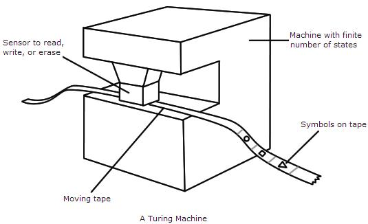

Title: Automatisms
page_order: 6

## Automatisms 

## setup() 

Following the concept of object abstraction, this chapter introduces an abstract machine (also known as Turing machine) which is very much depended on rules and instructions to perform various operations. Mathematician and computer scientist Alan Turing who first described the Turing machine in his infamous article 'On Computable Numbers, with an Application to the Entscheidungsproblem' in 1936 [^Turing]. It is a theoretical model that describes how a machine works as a storage medium, processing input and producing output results in computation. 

The turing machine identifies 6 types of fundamental operations in the abstract machine (at that time there wasn't a thing called computer yet), including read, write, move to left, move to right, state change and halt. Turing demonstrated how an abstract machine can perform these operations via an endless tape and a set of conditional instructions. Those instructions determine the machine's state by moving the tape.  



*Figure 6.1: An illustration of the Turing Machine*

This chapter focuses on rules, and how rules are the fundamental elements in a system. You might argue that the previous chapter on game object is also about rules such as how the tofus and beers should be moved and appeared. It is true though but the last chapter was more focused on the notion of abstraction and this chapter will be less on interacting with abstracted objects but on rules in which an autonomous system is generated over time. 

In 2015, an exhibition called "Logical Conclusions: 40 Years of Rules-Based Art" took place in New York, showcasing not computer art but instead a wide range of conceptual artist' works from the 20th century. Many of the works were based on or derived from mathematics and logics, but at the core of this chapter would be to the extent that the system allows the author to give more agency to the rules so as to produce the artefact. It is not simply a direct instruction of something like to draw an ellipse in white color at the x and y coordinate 100 and 120 respectively. Clearly, the person who has written this instruction has a full control on what would be the outcome in a very precise manner and this specific rule does not allow the program to emerge and create something different. In the following sections, we will explore two examples of rule-based programs to unfold the thinking of agency and control. 

[g: do you want to mention sol lewitt?]
[g: perhaps need to link this rule-based art into authorship ? ]
- ideas as form 
- Focus on rules, orders, chaos, emergent behaviors 
- the recode project 
- Generators and other automatisms (genotypes), love letter generators

## start()

- 10 print
- Langton ant 

## Source Code (10 Print)

```javascript
let x = 0;
let y = 0;
let spacing = 10;

function setup() {
  createCanvas(windowWidth,windowHeight);
  background(0);
}

function draw() {
  stroke(255);
  if (random(1) <0.5) {  //probabilty
    //line(0,0,10,10); //backward slash
    line(x,y,x+spacing,y+spacing);
  } else {
    //line(0,10,10,0); //forward slash
    line(x,y+spacing,x+spacing,y); //forward slash
  }
  x+=10;
  if (x > width) {
    x = 0;
    y += spacing;

  }
}
```

## Source code (Langton Ant)


## Exercise in class
Discussion:

- What have been generated beyond the end product but to focus on systems and processes? or How would you understand "autonomy is the ultimate goal" (Marius Watz 2007)?
- What is the role of rules and "software as material" (Marius Watz 2007), and do you consider the machine as a co-author?

## While()

## Mini_Exercise[6]: A generative program

**Objectives:**
- To implement a rule-based generative program from scratch.
- To strengthen the computational use of loops and conditional statements in a program.
- To reflect upon the concept of automatism conceptually and practically, such as systems, rules, temporality, emergence and processes.

**To get some additional inspiration here:**
- [Generative Design - sketches](http://www.generative-gestaltung.de/2/), [soure code](https://github.com/generative-design/Code-Package-p5.js)
- [GenArt (with source code)](https://github.com/JosephFiola/GenArt) by JosephFiola, see ch.1-4
- [Open Processing with the search keyword 'generative'](https://www.openprocessing.org/browse/?q=generative&time=anytime&type=all#)
- [John Conway's Game of Life](http://web.stanford.edu/~cdebs/GameOfLife/)

**Tasks (RUNME):**
1. Start with a blank paper. Think of at least three simple rules that you want to implement in a generative program. (You may take reference from Langton's ant (1986) and The Game of Life (1970))
2. Based on the rules that you set in step 1, then design a generative program that utilizes at least one for-loop/while-loop and one conditional statement but without any direct interactivity. Just let the program runs and emerges automatically.(You may also consider to use noise() and random() syntax)

**Questions to think about as README:**
- What are the rules in your generative program and describe how your program performs over time. What have been generated beyond just the end product?
- What's the role of rules and processes in your work?
- What's generativity and automatism? How does this mini-exericse help you to understand what might be generativity and automatism? 

## Required readings:
- Montfort, N, et al. "Randomness". *[10 PRINT CHR$(205.5+RND(1)); : GOTO 10](https://10print.org/)*, The MIT Press, 2012, pp. 119-146 (The chapter: Randomness)
- [6 mins video] [Langton's Ant Colonies](https://www.youtube.com/watch?v=w6XQQhCgq5c)
- [noise() vs random() - Perlin Noise and p5.js Tutorial by Daniel Shiffman](https://www.youtube.com/watch?v=YcdldZ1E9gU)
- [p5.js - 2D Arrays in Javascript by Daniel Shiffman](https://www.youtube.com/watch?v=OTNpiLUSiB4) 

## Further readings:
- Langton, Chris G. (1986). "[Studying artificial life with cellular automata](https://deepblue.lib.umich.edu/bitstream/2027.42/26022/1/0000093.pdf)". Physica D: Nonlinear Phenomena. 22 (1–3): 120–149.
- [The Game of Life (1970)](https://en.wikipedia.org/wiki/Conway%27s_Game_of_Life) by John Horton Conway
- [The Recode Project](http://recodeproject.com/) and [Memory Slam](http://nickm.com/memslam/) by Nick Montfort
- Galanter, Philip. "[Generative Art Theory](http://cmuems.com/2016/60212/resources/galanter_generative.pdf)". *A Companion to Digital Art*. Eds. Christiane P, 2016.
- [How to Draw with Code by Casey Reas](https://www.youtube.com/watch?v=_8DMEHxOLQE)
- [p5.js Coding Challenge #14: Fractal Trees - Recursive by Daniel Shiffman](https://www.youtube.com/watch?v=0jjeOYMjmDU)
- [p5.js Coding Challenge #76: Recursion by Daniel Shiffman](https://www.youtube.com/watch?v=jPsZwrV9ld0)

## Notes
[^Turing]: Turing, Alan Mathison. "On computable numbers, with an application to the Entscheidungsproblem." Proceedings of the London mathematical society 2.1 (1937): 230-265.
