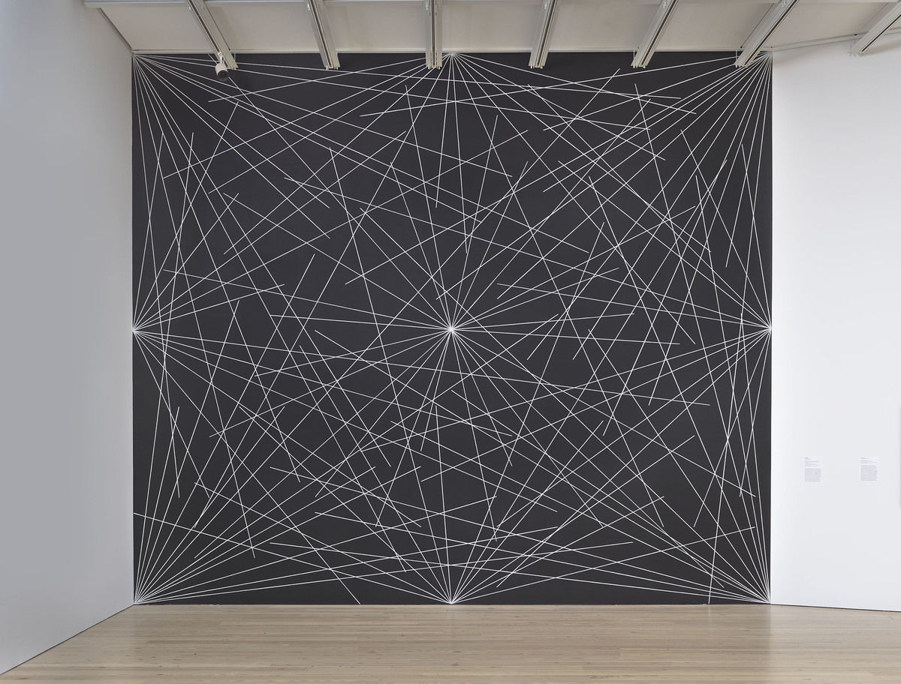
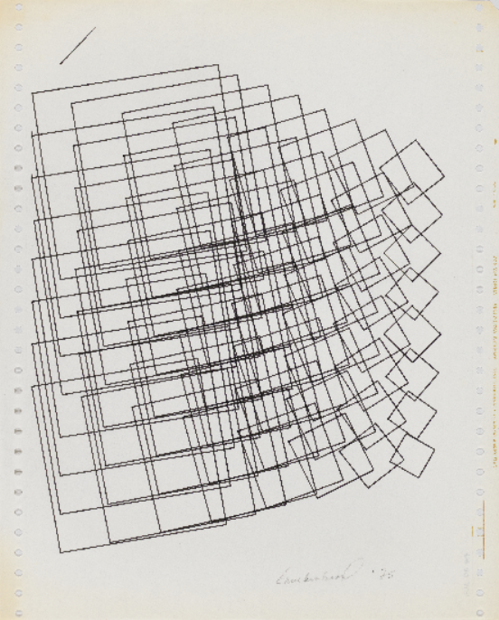
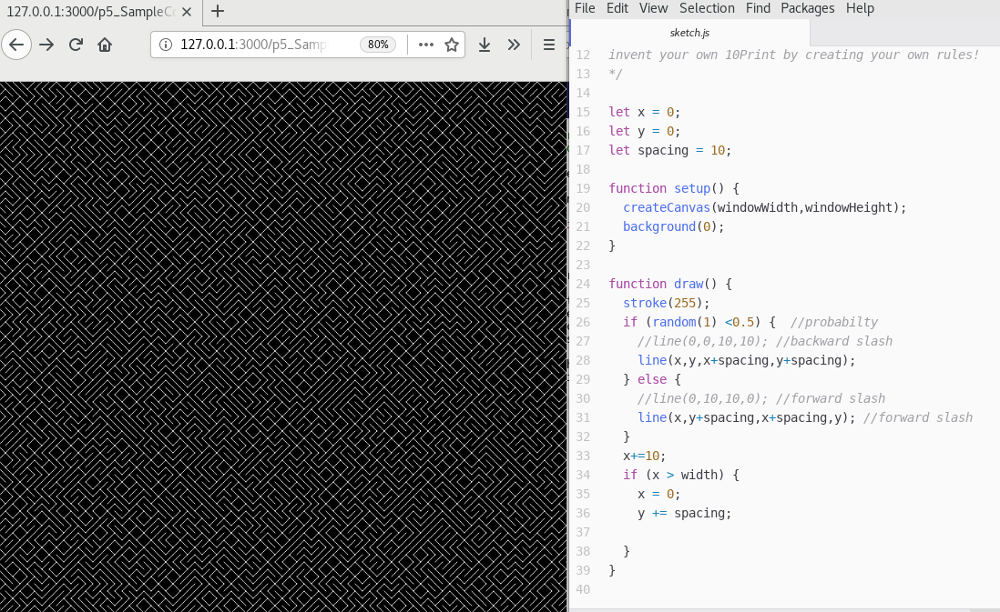
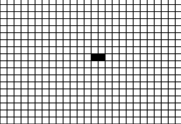
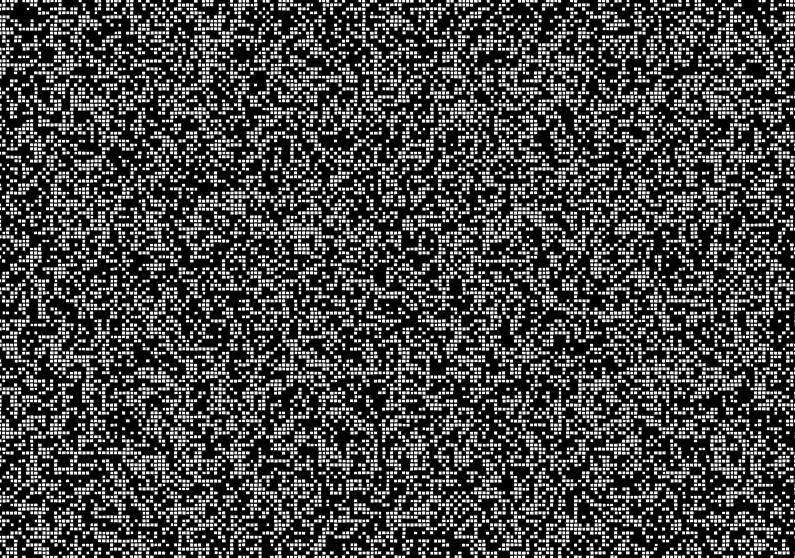

Title: Automatisms
page_order: 6

## Automatisms 

## setup() 

[g: feel free to cut/add/change the text, seems a bit long /w]

Following the concept of object abstraction before in making class blueprints and object instances, this chapter introduces the creation of rules and the study of automaton as a self-operating machine, which is widely known as an abstract machine or Turing machine. Mathematician and computer scientist Alan Turing who first described this kind of machines in his infamous article 'On Computable Numbers, with an Application to the Entscheidungsproblem' in 1936 [^Turing]. He uses the term *universal computing machine* to theorize a model that describes how a machine "can be used to computate any computatable sequence" [^Turing1] and this could be understood as how a machine operates, following a predetermined sequence of instructions that process input and produce output results. 

Specifically, the Turing machine is capable for 6 types of fundamental operations (at that time there wasn't a thing called computer yet), including read, write, move left, move right, change state and halt/stop. Turing suggested these operations can be performed via running an endless tape (acts like the memory/storage in a modern computer) with instructions like what symbols to read, what symbols to write as well as how to move. These instructions are fundamental to the Turing machine.[^visualization] The implication is that such theoritical model becomes the foundational operative purpose of modern computing, that is the capability to compute tasks in numbers and self-operate on most, if not all, aspects of contemporary culture.   


*Figure 6.1: An illustration of the Turing Machine*

This chapter focuses on instructions, and to explore how instructions are the fundamental elements in an automatic system. You might argue that the previous chapter on game object is also about rules such as how the tofus and beers should be moved and appeared. It is true though but the last chapter was more focused on the notion of abstraction and this chapter will be less on interacting with abstracted objects but on rules in which an autonomous system is generated over time. 

Focusing on rules are not only something programmers do, artists are also interested in art that is based on instructions. Indeed, we can trace the use of rules back to the conceptual art movement in the 60s. An exhibition called *Programmed: Rules, Codes, and Choreographies in Art, 1965-2018* [^exhibition], organized by Christiane Paul in the Whitney Museum of American Art, showcasing pieces that are regarded as predecessors of computational art, and tracing how rules and instructions in art have both responded to and been shaped by technologies. Artist Sol Le Witt as one of the key figures in the conceptual art movement, demonstrating how a concept is based on a set of instructions but the outcome might be different and it depends on the person who adapts the instructions. For example, the work *Wall Drawing #289* consists of three simple instructions but without specifying the angles and length of the lines, as such each time this piece can be drawn differently:

1. twenty-four lines from the center 
2. Twelve lines from the midpoint of each of the sides
3. Twelve lines from each corner 


*Figure 6.2: Sol LeWitt, Wall drawing #289, 1976*

Another example is Joan Truckenbrod who have showned her work *Coded Algorithmic Drawing (#9)* in the same show. The piece with a number of squares of variations in size and angle was coded with the programming language Fortran in the 1970s, simulating moving substance in natural phenomena.[^joan]




*Figure 6.3: Joan Truckenbrod,Coded Algorithmic Drawing, 1975*

Rules and instructions are highly interesting, which is not only because of having a different way of creative drawing, but also how a sketch can be produced which is based on or derived from mathematics and logics in which to give more agency to the rules. It is not simply a direct instruction of drawing something like having an ellipse in white color at the x and y coordinate 100 and 120 respectively. Clearly, this instruction has a full control on what would be the outcome in a very precise manner and this specific rule does not allow the program to emerge and create something different. This idea of agency and the matter of control is how Philip Galanter hightlighted when defining generative art, as he puts it [^galanter],
> Generative art refers to any art practice where artists use a system, such as a set of natural languages, rules, a computer program, a machine, or other procedural invention, which is set into motion with some degree of autonomy contributing to or resulting in a completed work of art.

In the following sections, we will explore two examples of rule-based programs to unfold the thinking of agency and control. 

[g: may be move some of the bits to start(), duno, and perhaps need to link this rule-based art into authorship ? or move to while(). Another question is the above images, thinking how to clear the copyright issues on PRINT /w ]
- ideas as form 
- Focus on rules, orders, chaos, emergent behaviors ?
- Generators and other automatisms (genotypes), love letter generators

## start()
Two sample code will be provided in this chapter. The first one is called *10 PRINT* which is based on one-line program code that is written in BASIC programming language that was executed in Commodore 64, an early home computer model: `10 PRINT CHR$(205.5+RND(1));: GOTO 10` to generate endless pattern on a screen. It wasn't claimed to be an art piece, but instead this line of code was printed in the 1982 *Commodore 64 User's Guide* and later published on the web. This line of code also becomes an important example in the field of software studies to demonstrate how to study code critically via history, science and culture. [^10print] This *10 PRINT* in `p5.js` is mainly to help familiarizing rules and its creative potential to allow some degree of autonomy within a system.  

The second program is called *Langton's Ant* which is invented by a computer scentist Christopher Langton, who is considered the father of the concept of Artificial life, in 1986. The core different with the *10 PRINT* is to discuss complex system and emergent behavior through simple rules, thinking about automated simulation as a Turing machine. 

## Exercise in class (10 PRINT)



*Figure 6.4: 10 PRINT in p5.js*

[RUNME](https://gitlab.com/siusoon/Aesthetic_Programming_Book/blob/master/sample_codes/p5_SampleCode/ch6_Automatisms/index.html)

1. Read the source code of *10 PRINT* then copy it and run in your own computer.

```javascript
let x = 0;
let y = 0;
let spacing = 10;

function setup() {
  createCanvas(windowWidth,windowHeight);
  background(0);
}

function draw() {
  stroke(255);
  if (random(1) <0.5) {  
    line(x,y,x+spacing,y+spacing);
  } else {
    line(x,y+spacing,x+spacing,y);
  }
  x+=10;
  if (x > width) {
    x = 0;
    y += spacing;

  }
}
```

2. Discuss the following rules of *10 PRINT* and map the rules to the related lines of code:
    1. Throw a dice randomly and half of the chance print a backward slash
    2. The other half of the chance will print a forward slash

3. Discuss the use and the role of randomness in this specific *10 PRINT* and in games/literature, and the arts?  

4. Try to modify existing rules, for example: 
    - Can we have more different outputs rather than just the backward and forward slash?
    - the size and color of slashes? 

5. *10 PRINT* has been appropriated by many artists, designers and students. Take a look at the different possibilities of [*10 PRINT*](https://twitter.com/search?q=%2310print&src=typd) that is documented on Twitter. Your in-class task is to create a sketch with a clear set of rules and a modified version of the *10 PRINT*.  

## Langton's Ant 

Langton's Ant, invented by Christopher Langton [^Langton], is a classical mathematical game involving an ant, simulating the molecular logic of the ant's living. The simulation of the cell's state is inspired by the classical Turing machine that can perform computational tasks with the manipulation of symbols on a strip of tape according to a set of rules. 

Similiar to the divided cells in the one dimensional long tape, this section will present the sample code that simulate the cell states, presenting in a two-dimensional grid system in either white or black color. Based on the simple rules, an ant is considered as the input source that will change the state of the cell by moving in four direction, and the ant will gradually turn the grid into a more complex system and exhibit emergent behavior over time.



*Figure 6.5: Langton's Ant - Initial steps*

With the initial direction of an ant that is pointed upwards (i.e the North position), figure 6.5 shows the initial 33 steps of the Langton's Ant that follow the two general rules as below:

1. If the ant is at a white cell, it turns right 90° and changes to a black cell then moves forward one unit.
2. If the ant is at a black cell, it turns left 90° and changes to a white cell then moves forward one unit. 

At the beginning, the canvas with only a grid system and all the individual cells are in white color. The ant with four possible head directions: UP, RIGHT, DOWN, LEFT, and will turn 90° on either left or right that is subjected to the existing cell's color. 

To start with, the ant's head is pointing at the UPWARD position as the start and is located in the middle of the white grid canvas. It then follows the rule 1 above to rotate the head direction from UP to RIGHT, then it also changes the white cell to the black and moves forward one unit (pointing to the right as per the new head direction). 

Then the second step would be to follow rule 1 again because the new cell is still in white color. The ant's head direction will turn right 90° that point from RIGHT to DOWN, and then changes the white cell to the black color and finally the ant moves forward one unit.

Then the third and forth steps are similar to the previous one until the ant meets a cell which is in black color (which is started in step 5). At this point, the ant will follow rule 2 instead to change back the cell's color to white and then turns left 90° instead of the right. 


*Figure 6.6: Langton's Ant - Processes*

Figure 6.6 shows the ant starts building the emerging 'highway' pattern[^Moreira] after the first few hundred moves with simple symmetricial patterns and follows by additional 9000 steps[^Steps] with the seemingly random steps at the center. The highway pattern repeats indefinately until most of cells are reconfigured, leading to something that is similar to Figure 6.7 which the ant is still constantly moving and changing the color of the cells.



*Figure 6.7: Langton's Ant - A snapshot of the emergent process*

[RUNME](https://gitlab.com/siusoon/Aesthetic_Programming_Book/blob/master/sample_codes/p5_SampleCode/ch6_Automatisms/sketch_6_1/index.html)

## Source code (Langton's Ant)
```javascript
let grid_space = 5;  //e.g 4, 5, 10 need to be dividable as an integer by the width and height of the canvas
let grid =[]; //on/off state
let cols, rows;  //for drawing the grid purpose
let xPos, yPos; //current position in terms of rows and cols, not actual pixel
let dir; //current direction of the ant
const antUP = 0;
const antRIGHT = 1;
const antDOWN = 2;
const antLEFT = 3;
let offColor;
let onColor;

function setup() {
  createCanvas(1000,700);
  offColor = color(255);  //setting offcolor
  onColor = color(0); //setting onColor
  background(offColor);
  grid = drawGrid();
  xPos = floor(cols/2);  //initial x position and make sure it is an integer in the grid array
  yPos = floor(rows/2); //initial y position and make sure it is an integer in the grid array
  dir = antUP; //initial direction
  frameRate(20);
}

function draw() {
  for (let n = 0; n < 100; n++) { //just for running faster per frame, try changing the n e.g 1
   checkEdges();
   let state = grid[xPos][yPos];
   //check the current cell's state
   if (state == 0) { //rule 1
    dir++;  // turn right 90°
    grid[xPos][yPos] = 1; //change the currect cell's state to 'on'
    fill(onColor);  //subsequent color change
    if (dir > antLEFT) {
      dir = antUP;  //reset the counter
    }
   }else{  //rule 2
    dir--;  //turn left 90°
    grid[xPos][yPos] = 0; //change the current cell's state to 'off'
    fill(offColor);  //subsequent color change
    if (dir < antUP) {
      dir = antLEFT; //reset the counter
    }
   }
   rect(xPos*grid_space, yPos*grid_space, grid_space, grid_space);
   nextMove();
  }
}
function drawGrid() {
  cols = width/grid_space;
  rows = height/grid_space;
  let arr = new Array(cols);
  for (let i=0; i < cols; i++) {//no of cols
    arr[i] = new Array(rows); //2D array
    for (let j=0; j < rows; j++){ //no of rows
      let x = i * grid_space; //actual x coordinate
      let y = j * grid_space; //actual y coordinate
      stroke(0);
      strokeWeight(1);
      noFill();
      rect(x, y, grid_space, grid_space);
      arr[i][j] = 0;  // assign each cell with the off state + color
    }
  }
  return arr; //a function with a return value of cell's status
}

function nextMove () {
  //check which direction to go next and set the new current direction
  if (dir == antUP) {
    yPos--;
  } else if (dir == antRIGHT) {
    xPos++;
  } else if (dir == antDOWN) {
    yPos++;
  } else if (dir == antLEFT) {
    xPos--;
  }
}

function checkEdges() {
  //check width and height boundary
  if (xPos > cols-1) { //reach the right edge
    xPos = 0;    //go back to the left
  } else if (xPos < 0) {  //reach the left edge
    xPos = cols-1;  //go to the right edge
  }
  if (yPos > rows-1) { //reach the bottom edge
    yPos = 0; //go back to the top
  } else if (yPos < 0) { //reach the top edge
    yPos = rows-1;  //go to the bottom
  }
}

```
## Reading Langton's Ant

Based on the above code, there are three areas can help slowing down or zooming in the program. 
1. `let grid_space = 5;`: You can tchange the value to 10 then you are able to see it at a bigger size.   
2. `frameRate(20);`: Lower the frameRate value can help slowering down the program
3. Within the `draw()` function, we have a for-loop where n is the steps of the ant. You may reduce the `n < 100` to `n < 1` in the line: `for (let n = 0; n < 100; n++) {`. (Reducing the n value will instruct the program to only process n steps per frame.)

Intead of going through the code line by line, this part is more showing what each function does. 

- `function setup()`: This is more to setup the canvas size, initite the ant's head direction, frameRate, color and to prepare drawing the background grid structure. 

- `function drawGrid()`: To divide the canvas into a grid structure with apparent lines.

- `function draw()`: This is the main function to check against the two rules of Langton's Ant and change cells' color. 

- `function nextMove()`: The 4 directions are structured in a number format so that the variable `dir++` can be used for incrementing or decrementing the ant's head direction. Each different direction of *UP, RIGHT, DOWN, LEFT* corresponds to moving forward in either horizontal (xPos) or vertical (yPos) step on the canvas. 

- `function checkEdges()`: This function is to check if the ant moves out of the four edges, then it will continue at the other end. 

Technically speaking, there is no new syntax as the 2-dimensional arrays have been covered briefly in Chapter 4 - Data Capture. However, there is the new use of 2-dimensional arrays and nested for-loops in the sample code. 

## 2-dimensional Arrays & Nested for-loops

Daniel Shiffman creates a tutorial (both in the form of written[^shiffman1] and video[^shiffman2]) to discuss how a 2-dimensional array is essentially an array of a bunch of arrays. He also suggests that it would be useful to think about 2-dimensional arrays with a grid structure. The background of the Langton's Ant is designed with a grid structure in two dimensions with both columns and rows. Since we need to identify the state of each cell, we need to know the exact x and y position of each cell. 

Let's see the source code again for the grid drawing: 

```javascript
function drawGrid() {
  cols = width/grid_space;
  rows = height/grid_space;
  let arr = new Array(cols);
  for (let i=0; i < cols; i++) {//no of cols
    arr[i] = new Array(rows); //2D array
    for (let j=0; j < rows; j++){ //no of rows
      let x = i * grid_space; //actual x coordinate
      let y = j * grid_space; //actual y coordinate
      stroke(0);
      strokeWeight(1);
      noFill();
      rect(x, y, grid_space, grid_space);
      arr[i][j] = 0;  // assign each cell with the off color and link to individual cells
    }
  }
  return arr; //a function with a return value
}
```

To create an array, we use the syntax `let arr = new Array(cols);` and this line indicates the grid in columns and the length of the array is the number of columns. Since we also need to cater the number of rows in a two-dimensional manner, that's why we create another array out of each existing array in the column with the line `arr[i] = new Array(rows);`. Such syntax is put under a for-loop to loop through each of the column but then with the addition of number of rows (which is derived from the canvas's height). Therefore, 2-dimensional arrays is visualized in this way: `arr[][]`. 

In order to know the exact x and y coordinates of each cell within a grid structure, it depends on which columns and which rows that you are pointing at with the formular `x = i * grid_space;` and `y= j * grid_space;` respectively. By using two nested for-loops, the program will loop through each column and each row (under the same column) until the program runs till the last column. Ultimately, we are able to get the x and y coordinate with the syntax `array[i][j]`, which is subjected to which column (with the variable i) and rows (with the variable j).

Therefore, each divided cell is presented in the structure of a 2-dimensional array. It depends on the width and height of hte canvas and how you will evenly distributed the space. Each cell represents a possiblity that an ant can move as a unit and with the on/off state that is represented in black/white color. 

## Exercise in class

1. Give yourself sometime to read and tinker the code, as well as to observe the stages of the Langton's Ant. 

2. Right now the Langton's Ant program is more about representing the world of the ant in a very abstracted way, such as an ant's cell with only black and white color, as well as it only allows to move in four directions and each time in 90°. Rethink about the rules that have been implemented, can you try changing the existing rule or adding new rules so that the ant behaves differently? (recall what you have changed in the previous exercise on *10 PRINT*) 

3. It is clear that simulating and abstracting real world systems, such as biological or chemical processes, smart cities[^Smart], procedural operations, is one of the applications of generative art or cellula automaton. However, what we want to focus in this chapter is not so much the end result, but more on the generative process in itself with the focus on rules and agency, in which the programmer will lose some kinds of control to the system so as to allow the program to emerge over time or what Matius Watz[^Watz] might suggests as "autonomy is the ultimate goal". So, let's discuss the following questions:

- What are systems and processes? Can you think of and describe different systems in the world that exhibit orders and chaos? 
- How would you understand autonomy is the end goal with the focus beyond the end product? 
- What is the role of rules and software as material, and do you consider the machine as a co-author in generative and automatic systems?

## While()

- nature / technical/ culture / reproduction (feminist approach)? 
- authorship/ power / control / unpredictability? 
- order, disorder, chaos, complex system, emergence?

## Mini_Exercise[6]: A generative program

**Objectives:**
- To implement a rule-based generative program from scratch.
- To strengthen the computational use of loops and conditional statements in a program.
- To reflect upon the concept of automatism conceptually and practically, such as systems, rules, temporality, emergence and processes.

**To get some additional inspiration here:**
- [{Software} Structure #003 A by Casey Reas](https://whitney.org/exhibitions/programmed?section=1&subsection=6#exhibition-artworks)
- [Generative Design - sketches](http://www.generative-gestaltung.de/2/), [soure code](https://github.com/generative-design/Code-Package-p5.js)
- [GenArt (with source code)](https://github.com/JosephFiola/GenArt) by JosephFiola, see ch.1-4
- [Open Processing with the search keyword 'generative'](https://www.openprocessing.org/browse/?q=generative&time=anytime&type=all#)
- [John Conway's Game of Life](http://web.stanford.edu/~cdebs/GameOfLife/)
- [The recode project](http://recodeproject.com/) or https://web.archive.org/web/20181227225001/http://www.recodeproject.com/
- [WUOUS by Anders Visti and Tobias Stenberg](https://andersvisti.dk/work/wuos-2019) (with the implementation of the Langton's Ant to question the so-called smart cities)

**Tasks (RUNME):**
1. Start with a blank paper. Think of at least two simple rules that you want to implement in a generative program. (You may take reference from Langton's ant (1986) and The Game of Life (1970))
2. Based on the rules that you set in step 1, then design a generative program that utilizes at least one for-loop/while-loop and one conditional statement but without any direct interactivity. Just let the program runs and emerges automatically.(You may also consider to use `noise()` and `random()` syntax if that helps)

**Questions to think about as README:**
- What are the rules in your generative program and describe how your program performs over time and how are the running of the rules contingently enabled emergent behaviors? 
- What's the role of rules and processes in your work?
- How does this mini-exericse help you to understand what might be generativity and automatism? Any thoughts about the theme of this chapter? 

## Required readings:
- Montfort, N, et al. "Randomness". *[10 PRINT CHR$(205.5+RND(1)); : GOTO 10](https://10print.org/)*, The MIT Press, 2012, pp. 119-146 (The chapter: Randomness)
- [6 mins video] [Langton's Ant Colonies](https://www.youtube.com/watch?v=w6XQQhCgq5c)
- [noise() vs random() - Perlin Noise and p5.js Tutorial by Daniel Shiffman](https://www.youtube.com/watch?v=YcdldZ1E9gU)
- [p5.js - 2D Arrays in Javascript by Daniel Shiffman](https://www.youtube.com/watch?v=OTNpiLUSiB4) 

## Further readings:
- Langton, Chris G. (1986). "[Studying artificial life with cellular automata](https://deepblue.lib.umich.edu/bitstream/2027.42/26022/1/0000093.pdf)". Physica D: Nonlinear Phenomena. 22 (1–3): 120–149.
- [The Game of Life (1970)](https://en.wikipedia.org/wiki/Conway%27s_Game_of_Life) by John Horton Conway
- [The Recode Project](http://recodeproject.com/) and [Memory Slam](http://nickm.com/memslam/) by Nick Montfort
- Galanter, Philip. "[Generative Art Theory](http://cmuems.com/2016/60212/resources/galanter_generative.pdf)". *A Companion to Digital Art*. Eds. Christiane P, 2016.
- [How to Draw with Code by Casey Reas](https://www.youtube.com/watch?v=_8DMEHxOLQE)
- [p5.js Coding Challenge #14: Fractal Trees - Recursive by Daniel Shiffman](https://www.youtube.com/watch?v=0jjeOYMjmDU)
- [p5.js Coding Challenge #76: Recursion by Daniel Shiffman](https://www.youtube.com/watch?v=jPsZwrV9ld0)

## Notes
[^Turing]: Turing, Alan Mathison. "On computable numbers, with an application to the Entscheidungsproblem." Proceedings of the London mathematical society 2.1 (1937): 230-265.

[^Turing1]: ibid, 241.

[^visualization]: A visualization of the Turing Machine can be tried here: https://turingmachine.io/.

[^exhibition]: See https://whitney.org/exhibitions/programmed. 

[^joan]: See more of her works here: http://joantruckenbrod.com/gallery/#

[^galanter]: Galanter, P. (2003). *What is Generative Art? Complexity theory as a context for art theory*. In GA2003-6th Generative Art Conference Citeseer. 

[^10print]: Montfort, Nick, et al. *10 PRINT CHR $(205.5+ RND (1));: GOTO 10.* MIT Press, 2012.

[^Langton]: Langton, Christopher G. “Studying Artificial Life with Cellular Automata.” Physica D: Nonlinear Phenomena 22, no. 1–3 (October 1986): 120–49. https://doi.org/10.1016/0167-2789(86)90237-X.

[^shiffman1]: See "Two-dimensional Arrays" written for the Processing Community: https://processing.org/tutorials/2darray/

[^shiffman2]: See the video intruction on 2D Arrays in p5.js: https://www.youtube.com/watch?v=OTNpiLUSiB4

[^Watz]: Marius Watz. (2007). "Beautiful Rules: Generative models of creativity" in The Olhares de Outono. Video. https://vimeo.com/26594644

[^Steps]: See the web-based step by step running of the Langton's Ant which is implemented by Barend Köbben in 2014. https://kartoweb.itc.nl/kobben/D3tests/LangstonsAnt/.

[^Smart]: See the artwork *WUOUS* by Anders Visti and Tobias Stenberg with the implementation of the Langton's Ant to question the so-called smart cities here: https://andersvisti.dk/work/wuos-2019 

[^Moreira]: Andrés Moreira, Anahí Gajardo and Eric Goles. “Dynamical Behavior and Complexity of Langton’s Ant.” *Complexity* 6, no. 4 (March 2001): 46–52. https://doi.org/10.1002/cplx.1042.
