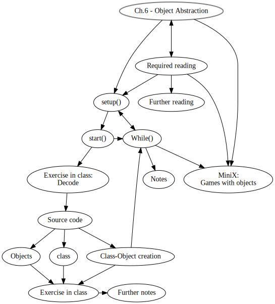
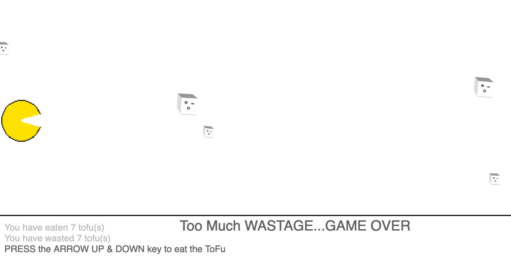

Title: 5. Object Abstraction
page_order: 5

## Object Abstraction


## setup()
The idea of an object is a key concept in programming but also more broadly understood as a thing with properties that can be identified in relation to the term subject. Put simply, and following philosophical conventions, a subject is an observer (we might say programmer) and an object is a thing outside of this, a thing observed (the program). In this chapter we will learn to further manipulate objects and understand their complexity in keeping with those that think we need to place more importance on nonhuman things so as to understand better how objects exist and interact, both with other objects but also with subjects.

In the previous chapters, we have worked with different objects such as geometric shapes like ellipses, rectangles and polygons. You can apply different attributes to these objects, such as color, size and position, and additionally objects can exhibit certain behaviors such as movement, animation and rotation (as seen in Chapter 3 — Infinite Loops, and Chapter 4 — Data Capture). These geometric objects use functions that are already built-in within p5.js as a set of pre-defined arguments and attributes. In this chapter, we will work on constructing our own objects, attributes and behaviors, that represent aspects of the real world. There is a process of abstraction here, because physical objects need to be translated into the idea of an object, and in doing this certain details and contextual information is inevitably left out. We will return to this issue later.

Abstraction is one of the key concepts of Object-Oriented Programming (OOP), a model of programming in which programs are organized around data, or objects, rather than functions and logic.[^history] The main goal is to handle an object's complexity by abstracting certain details and representing a concrete model. Beatrice Fazi and Matthew Fuller discuss the wider significance of this and the relations between concrete and abstracted computation: "Computation not only abstracts from the world in order to model and represent it; through such abstractions, it also partakes in it".[^Fazi] If we recall the previous chapters and the many examples of data capture and gamification, it becomes clear that computation can begin to shape certain behaviours and actions. In other words, objects in OOP are not only about negotiating with the real world as a form of realism and representation, nor the functions and logic that compose the objects, but the wider relations and "interactions between and with the computational".[^Fuller]

Indeed, abstraction exists at many different layers and scales of computing. At the lowest level of abstraction, the flow of information is stored, processed and represented in the form of binary (base 2 number system) numbers — zeros and ones.[^binary] In other words, the way we understand all multimedia formats (whether texts, images, video or sound) is quite different from how a computer understands them as data, or more precisely as binary numbers, including pixels, color values[^color] and waveforms. In this way, we can move from low-level abstraction in the form of machine code and the switching of electric circuits to high-levels of abstraction such as the graphical user interface or the programming language p5.js that we use in the book.

Recognition of the levels of abstraction are important to understand that the specific details of how a computer actually works are largely hidden from view or substituted by desktop metaphors (such as deleting a file by throwing it in the bin). That the complexity is reduced is useful of course for a number of reasons including accessability, but we also need to bear in mind that there is more at stake here. In learning to program, even at the higher level, we engage the politics of this movement between abstract and concrete reality. More specically, for this chapter, we focus on object abstraction, which is an approach in OOP, to think conceptually about how objects model the world and what this suggests in terms of an understanding of its hidden layers.

### start()

Object Abstraction in computing is about representation. Certain attributes and relations are abstracted from the real world, but at the same time details and contexts are left out. Let's imagine a person as an object (rather than a subject) and consider what properties and behaviors that person might have. We use the name **class** to give an overview of the object's properties and behaviors.

For example:

**Properties**: A person with the **name** Winnie, has black **hair color**, **wears** lasses with **height** as 164 cm. Their **favorite color** is black and their **favorite food** is Tofu.  

**Behavior**: A person can run from location A (Home) to location B (University).

From the above, we can construct a pseudo class that can use to create another object with the following properties and behaviors:

|Person                  |
| ---------------------- |
| Name, HairColor, withGlasses, Height, FavoriteColor, FavoriteFood, FromLocation, ToLocation |
| run()                  |

In the same token, we can *reuse* the same properties and behavior to create another *object instance* with the corresponding data values:

| Object instance 1             | Object instance 2         |
|-------------------------------|---------------------------|
| Name = Winnie                 | Name = Geoff              |
| HairColor = Black             | HairColor = Brown         |
| withGlasses = Yes              | withGlasses = No         |
| Height = 164 cm               | Height = 183 cm           |
| FavoriteColor = Black         | favoriteColor = Green     |
| FavoriteFood = Tofu           | FavoriteFood = Avocado    |
| FromLocation = Home           | FromLocation = University |
| ToLocation = University       | ToLocation = Home         |
| run()                         | run()                     |

From the pseudo object, we can begin to see how abstraction takes place in computation as *computerized material*, in which we only select properties and behaviors that we think are important to be represented in a program and ignore others. This is a way of modeling physical phenomena and simulating the behaviors of real or imaginary entities.[^Madsen] The understanding is that objects in the real world are highly complex and nonlinear. After the brief example of modeling the person-object, we now move to another example, tofu, that informs the sample code for this chapter, inspired by the game [Tofu Go!](https://www.dbdbking.com/Tofu-Go) (2018), a game developed and designed by Francis Lam (HK/CN).[^francis]

Tofu, or bean curd, is a popular food derived from soya orginating from China 2000 years ago. Through soaking and grinding soybeans, as well as filtering out remaining particulates, it becomes something known as soymilk, containing stable emulsion of oil, water, and protein. This is then pressed into solid white blocks with varying softness as tofu in a process similar to cheesemaking. It is an important food product specifically in the East, not only because of its protein richness but also as a cultural symbol.

When tofu becomes a computational object, as in *Tofu Go!*, abstraction is required to capture the complexity of processes and relations, and to represent what are thought to be essential and desired properties and behaviours. In the game, tofu is designed as a simple white three-dimensional cube form with an emoticon, and the ability to move and jump. Of course in the real world tofu cannot behave in that way, but one can imagine how objects can perform differently when you program your own software, and if you love tofu as Lam does: "*Tofu Go!* is a game dedicated to my love for tofu and hotpot" as he puts it.[^francis2] You need to save the tofu from the chopsticks.


*Figure 6.1: A screenshot of the game ToFu Go!, developed and designed by Francis Lam*

[embeded video](https://www.youtube.com/watch?v=V9NirY55HfU])

In the following, we will introduce the sample code as a simple game (the recipe if you like), inspired by *ToFu Go!* (freely available to download on App Store[^App]) and earlier project *Multi* as we have introduced in Chapter 2 - Variable Geometry. The remaining parts unfold the computational logic and modeling required to understand the basics of OOP.

## Exercise in class (Decode)




*Figure 6.2: A screenshot of a Pacman-Tofu game*

[RUNME](https://siusoon.gitlab.io/Aesthetic_Programming_Book/)

**SPECULATION**

Based on what you see/experience on the screen, describe:

- What are the instructions/rules to play the game?
- Tofu is constructed as a class, and each tofu is an object instance. Can you describe the properties of tofus and their behaviors?
- Can you describe the algorithmic procedures and sequences of the game with the following components: tofus, the pacman, keypress events, movements

**Further questions to think about:**
- How to add tofu continuously in the screen and what's the condition?
- How to check if the pacman has eaten the tofu?
- Under what conditions the game will be ended?

**MAPPING with the source code**
- Map some of the findings/features from the speculation that you have done with the source code. Which block of code relates to your findings?
- Can you identify the part/block of code that responds to the elements that you have speculated on earlier?
- Identify the syntax and function that you might not know and check out on p5.js reference site: https://p5js.org/reference/

## Source Code

The source code is divided into two, one with all the core functions in `sketch.js`, and the other `Tofu.js` that specifies the class/object relationship. Sometimes it can help to give a clearer overview if you separate the program into different functions and files. You can imagine an additional js file is just a continuation of your core sketch, therefore you don't have to repeatedly write the `function setup()` or `function draw()` in the new files (imagine your program will become longer and more complex, so you might have more than 2 js files to hold the program together). To enable the two js files in a program, you need to add the following into the index.html file:

```html
  <script language="javascript" type="text/javascript" src="sketch.js"></script>
  <script language="javascript" type="text/javascript" src="Tofu.js"></script>
```

sketch.js:

```javascript
let pacmanSize = {
  w:86,
  h:89
};
let pacman;
let pacPosY;
let mini_height;
let min_tofu = 5;  //min tofu on the screen
let tofu = [];
let score =0, lose = 0;
let keyColor = 45;

function preload(){
  pacman = loadImage("data/pacman.gif");
}

function setup() {
  createCanvas(windowWidth, windowHeight);
  pacPosY = height/2;
  mini_height = height/2;
}
function draw() {
  background(240);
  fill(keyColor, 255);
  rect(0, height/1.5,width, 1);
  displayScore();
  checkTofuNum(); //available tofu
  showTofu();
  image(pacman, 0, pacPosY,pacmanSize.w, pacmanSize.h);
  checkEating(); //scoring
  checkResult();
}

function checkTofuNum() {
  if (tofu.length < min_tofu) {
    tofu.push(new Tofu());
  }
}

function showTofu(){
  for (let i = 0; i <tofu.length; i++) {
    tofu[i].move();
    tofu[i].show();
  }
}

function checkEating() {
  //calculate the distance between each tofu
  for (let i = 0; i < tofu.length; i++) {
    let d = int(dist(pacmanSize.w/2, pacPosY+pacmanSize.h/2, tofu[i].pos.x, tofu[i].pos.y));
    if (d < pacmanSize.w/2.5) { //close enough as if eating the tofu
      score++;
      tofu.splice(i,1);
    }else if (tofu[i].pos.x < 3) { //pacman missed the tofu
      lose++;
      tofu.splice(i,1);
    }
  }
}

function displayScore() {
    fill(keyColor, 160);
    textSize(17);
    text('You have eaten '+ score + " tofu(s)", 10, height/1.4);
    text('You have wasted ' + lose + " tofu(s)", 10, height/1.4+20);
    fill(keyColor,255);
    text('PRESS the ARROW UP & DOWN key to eat the ToFu', 10, height/1.4+40)
}

function checkResult() {
  if (lose > score && lose > 2) {
    fill(keyColor,255);
    textSize(26);
    text("Too Much WASTAGE...GAME OVER", width/3, height/1.4);
    noLoop();
  }
}

function keyPressed() {
  if (keyCode === UP_ARROW) {
    pacPosY-=50;
  } else if (keyCode === DOWN_ARROW) {
    pacPosY+=50;
  }
  //reset if the pacman moves out of range
  if (pacPosY > mini_height) {
    pacPosY = mini_height;
  } else if (pacPosY < 0 - pacmanSize.w/2) {
    pacPosY = 0;
  }
}
```
Tofu.js:

```javascript
class Tofu { //create a class: template/blueprint of objects with properties and behaviors
    constructor()
    { //initalize the objects
    this.speed = floor(random(3,6));
    this.pos = new createVector(width+5, random(12,height/1.7));  //check this feature: https://p5js.org/reference/#/p5/createVector
    this.size = floor(random(15,35));
    this.toFu_rotate = random(0,PI/20); //rotate in clockwise for +ve no
    this.emoji_size = this.size/1.8;
    }
  move() {  //moving behaviors
    this.pos.x-=this.speed;  //i.e, this.pos.x = this.pos.x - this.speed;
  }
  show() { //show tofu as a cube
    push()
    translate(this.pos.x, this.pos.y);
    rotate(this.toFu_rotate);
    noStroke();
    fill(130, 120);//shadow
    rect(0,this.size, this.size, 1);
    fill(253); //front plane
    rect(0,0, this.size,this.size);
    fill(150); //top
    beginShape();
    vertex(0,0);
    vertex(0-this.size/4,0-this.size/4);
    vertex(0+this.size/1.5,0-this.size/4);  //no special hair style
    vertex(0+this.size, 0);
    endShape(CLOSE);
    fill(220);//side
    beginShape();
    vertex(0, 0);
    vertex(0-this.size/4,0-this.size/4);
    vertex(0-this.size/4,0+this.size/1.5);
    vertex(0,0+this.size);
    endShape(CLOSE);
    fill(80); //face
    textStyle(BOLD);
    textSize(this.emoji_size);
    text('*',0+this.size/6, 0+this.size/1.5);
    text('-',0+this.size/1.7, 0+this.size/1.9);
    text('。',0+this.size/2.5, 0+this.size/1.3);
    pop();
 }
}
```

## class

To first construct objects in OOP, it is important to have a blueprint. A class specifies the structure of its objects' attributes and the possible behaviors/actions of its objects. Thus, class can be understood as a template and blueprint of things.  

Similar to the template that we had for a person-object, we have the following:

|Tofu                                              |
| ------------------------------------------------ |
| speed, xpos, ypos, size, toFu_rotate, emoji_size |
| move(), show()                                   |

You may refer to `Tofu.js` with the full source code for how the Tofu class is constructed.

**(Step 1) Naming**: Give a name of your class

```javascript
class Tofu {

}
```

In the sample code above, we have Tofu as the class name and tofu as the name of object instances. The things within a class describes what it means to be the object, such as what the properties are, the data values, and behaviors and functionalies. In computer science, this is called *encapsulation*.  

**(Step 2) Properties**: What are the (varying) attributes/properties of tofu?

```javascript
class Tofu { //create a class: template/blueprint of objects with properties and behaviors
  constructor()
  { //initalize the objects
  this.speed = floor(random(3,6));
  this.pos = new createVector(width+5, random(12,height/1.7));  //check this feature: https://p5js.org/reference/#/p5/createVector
  this.size = floor(random(15,35));
  this.toFu_rotate = random(0,PI/20); //rotate in clockwise for +ve no
  this.emoji_size = this.size/1.8;
  }
  //something more here
}
```

The above is to prepare the object construction. As such we have a function called constructor to initialize a (tofu) object with the following attributes in the form of a list of variables that indicate the properties of speed, position, size, rotating angle and the emoji's size. All these properties are defined with the keyword `this`, which refers to the current object instance, e.g. `this.speed = floor(random(3,6));`. It can be translated roughly as: when the object instance tofu is created, that particular tofu's speed value will be a random integer between 3 to 5.

For the other variable `this.pos`, we have used the function `new createVector` to create the new p5 vector which contains the x and y components. With the `createVector()` function, we can then use `pos.x` and `pos.y` to specify the x and y coordinates of a tofu.

> this.pos = new createVector(x, y); => this.pos.x and this.pos.y

**(Step 3) Behaviors**: What are the behaviors of the tofu?

```javascript
class Tofu {
  constructor() { //initalize the objects
    // something here
  }
  move() { //moving behaviors
    this.pos.x-=this.speed; //i.e, this.pos.x = this.pos.x - this.speed;
  }
  show() {
      //show Tofu as a cube by using vertex
      //show the emoji on the one of the surfaces
  }
}
```
The two behaviors `move()` and `show()` are the functions that can be used by each object instance. Each object can move differently with variations of speed, size, etc.

This is often a difficult concept for beginners because to show or display the object is also considered as a behavior in OOP. To explain further, the object is only created in the background but you need to decide where and how to display the object, and in what forms.   

## Objects

For this section, we will illustrate how to create an object instance, which is coded in the file `sketch.js`.

**(Step 4) Object creation and usage**: After the basic setup of the class structure, the next step is to create a tofu object that can display on a screen.

```javascript
let min_tofu = 5;  //min tofu on the screen
let tofu = [];

function draw() {
 //something here
 checkTofuNum(); //available tofu
 showTofu();
}

function checkTofuNum() {
  if (tofu.length < min_tofu) {
    tofu.push(new Tofu());
  }
}

function showTofu() {
 //something here
  for (let i = 0; i <tofu.length; i++) {
   tofu[i].move();
   tofu[i].show();
 }
}
```
The above shows that the program has the minimum amount of tofu on the screen (with the variable `min_tofu`). Tofus are created through the `checkTofuNum()` function with the conditional statement to check if the the amount of tofu objects meets the minimum value. The function `push()` means to create a **new** object instance via the class Tofu (`tofu.push(new Tofu());`). Therefore, all the object instances have the same properties and behaviors, where code can be reused to create similar objects.

Objects are like arrays, and it starts with index 0, and if you push for more, then it will create `tofu[0]` and `tofu[1]`. Using the syntax `tofu.length()` will get the result of the amount of active objects. As such, we can then use a for-loop to cyling all the tofu objects, moving and showing them on the canvas (with the earlier defined class behavior `move()` and `show()`).

This small snippets of code shows that objects can be duplicated and relatively easy to manage, demonstrating one the advantages of using OOP which is the reusability of objects.

**(Step 5) Trigger point and logics**: Think with the holistic logic

The basic structure of the class-object relationship has been created at this point, but still several logics are needed such as implementing the game rules:

1. Pacman placement and how it interacts with the tofus
2. Check if each of the tofu has been eaten or wasted
3. If the game with an end, what are the conditions and consequences?

Since the program is running all the time in the `draw()` function, which means the tofu(s) will be continuously creating, moving and displaying. It is required to break a bigger task into smaller tasks.

**Deleting tofus**

One of the important thing to note is that once an object is created, it will be stayed in the program even it is no longer visible on a screen until you delete them. In this game, tofus disappear on a screen in two ways:

1. A tofu is without being eaten and moved over the edge of the width.
2. A tofu is being eaten.

Although the tofus may disappear on the screen, we need to delete them via code or otherwise they will continue move beyond the screen.

Since we use the syntax `tofu.length` to check the minimum amount of tofus, the deletion of tofus become essential so that the screen can check and refill the amount of tofus. We have `push()` for adding new objects, and we have `splice()` for deleting them.

```javascript
function draw() {
  checkEating(); //scoring
}

function checkEating() {
  //calculate the distance between each tofu
  for (let i = 0; i <tofu.length; i++) {
    let d = int(dist(pacmanSize.w/2, pacPosY+pacmanSize.h/2,tofu[i].pos.x, tofu[i].pos.y));
    if (d < pacmanSize.w/2.5) { //close enough as if eating the tofu
      score++;
      tofu.splice(i,1);
    }else if (tofu[i].pos.x < 3) { //pacman missed the tofu
      lose++;
      tofu.splice(i,1);
    }
  }
}

```

`checkEating()` is a customed function to delete the tofus under certain conditions, and consequently leading to the calculation of the scores, i.e the amount of tofus is being eaten or wasted by the Pacman.

First we start with a for-loop to cycle through all the tofu object instances. The first logic is to check if the Pacman has eaten any of them. Up to here, we need to think about what it means by 'being eaten' in a computational sense. The program will continuously check against the distance between each tofu and the pacman. The `dist();` function takes in 4 arguments to calculate the distance between two points (x1, y1, x2, y2), which is the x1 and y1 position of the pacman (the center point) and the x2, y2 of each of the tofu's position. If the calulated distance is less than around more than half of the pacman's image width, then the variable `score` increase by 1 and the matched object will be deleted (`tofu.splice(i,1);`).

Secondly, any specific tofu object will no longer be used when it reaches the end of the canvas, so we will remove those objects with the x position less than the value 3 (`tofu[i].pos.x < 3`). The two logics' sequence matters here because we need to make sure those delete tofus are missed by the pacman.  

Up to now, the function `checkTofuNum()` makes more sense to reflect the numbers of active objects which is the same as the number of visible objects on a screen, and this will create new object instances if not meeting the minimum numbers. This is implemented within the `draw()` function and therefore new objects are continously moved and new object instances are continously created.   

**Interacting with the key**

To control the pacman and play the game, users will use the UP_ARROW and the DOWN_ARROW to control the pacman's image position. There is a boundary to set the max height and mini height of the pacman by implementing a conditional structure so as to make sure the pacman is able to eat the tofus from different y positions.

```javascript
function keyPressed() {
  if (keyCode === UP_ARROW) {
    pacPosY-=30;
  } else if (keyCode === DOWN_ARROW) {
    pacPosY+=30;
  }
  //reset if the pacman moves out of range
  if (pacPosY > mini_height) {
    pacPosY = mini_height;
  } else if (pacPosY < 0 - pacmanSize.w/2) {
    pacPosY = 0;
  }
}
```

For classroom teaching purpose, we have created a much simplier version[^tofu2] of the moving tofus (just simple squares) aiming to walkthrough the class-object creation in a live coding environment by using the first 4 steps guidelines.

## Class-Object creation

It requires some planning before you start coding if you want to implement a class-object in your own program. In a nutshell, an object consists of attributes/properties and actions/behaviors, and all these hold and manage data in which the data can be used and operation can be performed.

- **(Step 1) Naming**: Give a name for your class.
- **(Step 2) Properties**: What are the attributes/properties of tofu?
- **(Step 3) Behaviors**: What are the actions/behaviors of tofu?
- **(Step 4) Object creation & usage**: After the basic setup of the class structure, next is to create a tofu object that can display on a screen.
- **(Step 5) Trigger point & logic**: Think with the holistic logic.

It is by no means saying the steps should be in the exact sequence as stated. Of course one might think about a program or a game in a holistic way at the beginning and come up with the different object instances afterwards. As such, the steps is just a suggested guideline especially for beginners who are encountering class-object creation in their first time. Based on our teaching experience, students usually found difficult to implement their own objects and we hope it is useful to have some steps, keywords and questions to facilitate the crafting of objects.

## Exercise in class

1. Tinkering
- Modify the different values to understand the function/syntax

2. Discussion in groups:
- Identify a game that you are familiar with, and describe the characters/objects by using the concept and vocabulary of class and object. Can you identify the classes and objects within the chosen example?
- Given that the creation of objects requires the concept of abstraction, and following some of the introductory ideas for this chapter, can you use the sample code or your game as an example to think through some of the political implications of class/object abstraction? Does the fact that this is a game allow for further reflection on the way everyday activities (such as enjoying tofu) become object-oriented?

## Further notes

**`function preload(){}`:** In this game we have used an animated gif - pacman that can be controlled by pressing certain keycodes. To have the image draw on a canvas, you need to use the function `loadImage()` to load the image file before the program runs the `setup()` and `draw()`.

**`image()`:** To use, dislay and technically draw the image onto the p5.js canvas, `image()` is used and take arguments on which image, x position, y position, the width of an image and the height of it.

**Tofu's shape:** As already introduced in chapter 2 - Variable Geometry, we have reused the related syntaxes such as `rect()`, `vertex()`, `beingShape()` and `endShape()`. But this time we use the typographic characters for the emoji by using the `text()` and `textSize()` functions.

**A game:** The program is a typical game with an end point (eating tofu is gamified). Functions `checkEating()` and `checkResult()` are used to count how many tofus are eaten (with the variable `score`) and how many tofus have not been eated and regarded as wastage (with the variable `lose`). In the end, these two variables are compared. A game over message will be shown if the wastage is bigger than the eaten tofus (`lose > score`), and (by using the symbol `&&`) the game provides two chances of tofu's wastage. `noLoop()` is used to stop the program from looping, and as such the canvas is freezed.

**Arithmetic operators:** There is new arithmetic syntax beyond simply `=`, `+`, `-`, `*`, `/`, such as `+=` in `tableX+=texture_width;` and `edgeX+=texture_width;`. See the list below:

| Operator | Use case | Same as |
|----------|----------|---------|
| +=       | x+=y     | x=x+y   |
| -=       | x-=y     | x=x-y   |


## While()

By going through the tofu example, we can see object-oriented programming is highly organized and concrete even though objects are abstracted from the world. It's also worth adding here that OOP is designed to reflect the way the world itself is organised, at least from the perspective of computer programmers; that is, an understanding of the ways in which relatively independent objects operate through their relation to other objects.

The academic and video game designer Ian Bogost refers to these interacting processes as *unit operations*, "characterized by their increased compression of representation, a tendency common over the course of the twentieth century, from structuralist anthropology to computation. [He continues] I use this term to refer to processes in the general sense, for example, the coupling of a cultural process and its computational representation."[^Bogost] Taking his cue from a combination of literary theory and computing, he argues that cultural phenomena (not just computer games) can be read as a configurative system of discrete, interlocking units of meaning. There are numerous implications here. As we have seen in this chapter, each object includes both data and functions, and in addition, programmers can create relationships between different objects, and can inherit characteristics from other objects.

As mentioned above, this object-oriented approach comes close to the ways that many other disciplines also understand discrete objects and their inter-actions. The most obvious connection here, not least in its naming, is with object-oriented ontology (OOO), a philosophical 'speculation' on how objects exist and interact. But we should be wary of making too-easy a connection here between OOP and OOO (made even more confusing by the earlier descriptor OOP, object-oriented philosophy). In brief, OOO rejects the idea that objects come into being through the perception of the human subject, and promotes that idea that objects — whether human or nonhuman — are thus mutually autonomous.[^Harman]

Again, it should be pointed out that a book like ours is not the place for a deep discussion of this, nor its critique, but it should be noted that this is a Heidegger-influenced critique of Kantian metaphysics, and a rejection of the privileging of human existence over the existence of nonhuman objects. The connection to Heidegger's ideas is made explicit in Harman's *Tool-Being: Heidegger and the Metaphysics of Objects* that builds on the oft-cited distinction between *present-at-hand* and the *ready-to-hand*.[^Harman2] The former refers to our theoretical apprehension of a world made up of objects, and the latter describes our practical relation to things that are handy or useful. The claim is that practice precedes theory, and that the ready-to-hand of human practice is prior to the present-at-hand, which Harman extends to the practice of objects, to articulate his ontology of objects. It is perhaps useful to think of programming in this way, as a tool-based practice where the objects themselves exist independently of human activity and, as Harman would put it, are not ontologically exhausted by their relations with humans or other objects.       

One of the difficulties is how to build a politics into this. Jane Bennett’s *Vibrant Matter* is one such attempt to take a political position on more-than-human assemblages that question human (too often male) sovereignty over the world, even including the agency of food in the chapter "Edible Matter".[^Bennett] The aim, she writes "is to articulate a vibrant materiality that runs alongside and inside humans to see how analyses of political events might change if we gave the force of things more due".[^Bennett2] She is partly drawing on the work of Bruno Latour here, and his idea of *actants*, a phrase which emphasises a coming together — assemblage — of complex, diverse, and interlinking agencies.[^Latour] Objects have become things again, as he puts it.

If we extend this to ideas of operating systems, even society as Latour does, then questions arise as to how best facilitate the production of objects, and their actions. Free and open source software production, for instance, rests on certain principles of distribution and mutual exchange of its objects, as does the ways that computational objects interact in programming environments. There's a politics here in the way that objects operate in computational and cultural models of decision-making and representation. Matthew Fuller and Andrew Goffey suggest that this object-oriented modeling of the world is a social-technical practice, "compressing and abstracting relations operative at different scales of reality, composing new forms of agency",[^FullerGoffey] an agency that lies across the computational and material arrangement of everyday encounters they add.

In establishing this possibility of new forms of agency, aside from the connections to the above ideas of objects, there is an interplay at work between abstract and concrete reality they reflect. To explain broadly, the classifications abstract and concrete indicate whether the object that each term describes has physical properties. This was taken up by Marx in his critique of capitalist working conditions to distinguish between abstract labour and living labour; where abstract labour is labor-power spent producing goods, services, and commodities that uphold capital, and living labor the capacity to work. This abstraction is the process by which labour is *subsumed* under Capital (somewhat like data capture) but maybe we are straying too far from the main point here. What we want to emphasise more firmly is that knowledge of these ideas, and of programming, itself is subject to the movement between concrete and abstract states.

To explain with some more Marxism, if we begin with the idea that there is a real and concrete thing in the world, that once put under pressure by critique, reveals itself to be false, an abstraction. The relation between the concrete and abstract in Marx thus is the dialectical movement between these states in order to reduce the abstractions and arrive at a reality that represents a rich totality of relations (such as class struggle). What Marx refers to as abstract determinations leads towards a reproduction of the concrete by way of critical thinking which itself is grounded in reality and lived conditions. The politics of this, as distinct from Hegel’s idealism, is that abstractions are reliant on the concrete, and they return to it. His example of the abstraction of exchange value (through abstract labour), which can only exist in a dialectical relationship with the concrete social relations found in society.[^Manifesto]

If we apply this to a computational object and its abstraction (its properties and behaviour), it only makes sense in terms of its wider relations and recognition of its conditions of operation (program, labour of the programmer, operating system, etc), and only then if there is a point to expose these conditions such that they can be improved, not least with better abstractions. Computational objects allow for a different perspective on lived conditions in this way and how we perceive the world. The worldviews on offer are often quite unethical, and we only need to think of game-worlds to see poor examples of racial and gendered abstraction. Therein lies the motivation for this chapter, to make better object abstractions and ones with a clear sense of purpose.

## MiniX[6]: Games with objects

**Objective:**
- To implement a class-based object oriented sketch via abstracting and designing objects' properties and behaviors.
- To reflect upon object abstraction under the conditions of digital culture

**Get some additional inspiration here:**
- [p5.js - Array Objects](https://p5js.org/examples/arrays-array-objects.html)
- [daily coding ](https://twitter.com/nagayama/status/1246086230497845250?s=19) by Nagayama, with source code: https://github.com/nagayama/dailycoding/blob/master/2020/04/03.html
- [Eat Food Not Bombs by Ben Grosser](https://editor.p5js.org/bengrosser/full/Ml3Nj2X6w?fbclid=IwAR0pegtorx1cyYYKsEh8jNXTHdFika6tGIGOjEUgr8vTXGLHv6ajYuY4EQI)
- [p5.js coding challenge #31: Flappy Bird by Daniel Shiffman](https://www.youtube.com/watch?v=cXgA1d_E-jY)
- [p5.js coding challenge #3: The Snake Game by Daniel Shiffman](https://www.youtube.com/watch?v=AaGK-fj-BAM)

**Tasks (RUNME)**
Think of a simple game that you want to design and implement, what are the objects required? What are their properties and behaviors? At the most basic level, you need to **use class-based object oriented approach** to design your game components that can exhibit certain behaviors (that means you need to at least have a class, a constructor and a method).

If you can master objects and classes, you may further work on a mini game step by step in terms of the interaction with objects. Start with something simple in terms of thinking or reappropriating the rules, interactions and checking logics, the pacman-tofu sample code and other games that are stated above would be useful to practice the building and combining smaller logics.

**Questions to think about as README:**

- **Describe** how does your game/game objects work?
- **Describe** how you program the objects and their related attributes and methods in your game.
- Draw upon the assigned reading(s), **what** are the characteristics of object-oriented programming and the wider implications of abstraction?
- **Extend/connect** your game project to wider digital culture context, can you think of a digital example and describe how complex details and operations are being **abstracted**?

## Required readings:
- Matthew Fuller & Andrew Goffey, "The Obscure Objects of Object Orientation", in Matthew Fuller, ed. *How to be a Geek: Essays on the Culture of Software* (Cambridge: Polity, 2017).
- [p5.js examples - Objects](https://p5js.org/examples/objects-objects.html)
- [p5.js examples - Array of Objects](https://p5js.org/examples/objects-array-of-objects.html)
- Daniel Shiffman, Code! Programming with p5.js on YouTube, The Coding Train. (watch: 2.3, 6.1, 6.2, 6.3, 7.1, 7.2, 7.3). Web. https://www.youtube.com/watch?v=8j0UDiN7my4&list=PLRqwX-V7Uu6Zy51Q-x9tMWIv9cueOFTFA
- Daniel Shiffman, Multiple js Files - p5.js Tutorial, The Coding Train. Web. https://www.youtube.com/watch?v=Yk18ZKvXBj4.

## Notes:

[^history]: Simula, developed in the 1960s by Ole-Johan Dahl and Kristen Nygaard at the Norwegian Computing Center in Oslo, is considered to be the first object-oriented programming language. Despite being first, Smalltalk is more often cited, first developed for educational use at Xerox Corporation's Palo Alto Research Center in the late 1960s and released in 1972. For more on the history of this, see Ole-Johan Dahl, [The Birth of Object Orientation: the Simula Languages](https://link.springer.com/chapter/10.1007/978-3-540-39993-3_3). *Object-Orientation to Formal Methods*, Owe O., Krogdahl S., Lyche T.Eds. *Lecture Notes in Computer Science*, vol 2635 (Berlin/Heidelberg: Springer, 2004).
[^Fazi]: Beatrice M. Fazi and Matthew Fuller, "Computational Aesthetics", in Christiane Paul, ed., *A Companion to Digital Art* (Hoboken, NJ: Wiley Blackwell, 2016), 281-296.
[^Fuller]: Matthew Fuller & Andrew Goffey, "The Obscure Objects of Object Orientation", in Matthew Fuller, ed., *How to be a Geek: Essays on the Culture of Software* (Cambridge, UK: Polity, 2017).
[^binary]: Limor Fried & Federico Gomez Suarez (n.d). "Binary & Data". Khan Academy. Available at: https://www.khanacademy.org/computing/computer-science/how-computers-work2/v/khan-academy-and-codeorg-binary-data.
[^Madsen]: Madsen, Ole & Møller-Pedersen, Birger & Nygaard, Kristen. (1993). Object-Oriented Programming in the BETA Programming Language, pp. 16-18.
[^francis]: *ToFu Go!* is freely available on the App store for iphone and iPad, see: https://apps.apple.com/us/app/tofu-go/id441704812.
[^francis2]: See the interview of Francis Lam in 2012 here: https://www.design-china.org/post/35833433475/francis-lam.
[^App]: *ToFu Go!* is freely available on the App store for iphone and iPad, see: https://apps.apple.com/us/app/tofu-go/id441704812.
[^splice]: `splice()` is a p5.js function, see here: https://p5js.org/reference/#/p5/splice.
[^push]: `push()` is a JavaScript function that is used in an array to add one or more elements to the end of an array, see here: https://developer.mozilla.org/en-US/docs/Web/JavaScript/Reference/Global_Objects/Array/push.
[^Bogost]: Ian Bogost, *Persuasive Games: The Expressive Power of Videogames* (Cambridge, Mass.: MIT Press, 2007) 8. Also, see his *Unit Operations: An Approach to Videogame Criticism* (Cambridge, Mass.: MIT Press, 2006).
[^Harman]: Graham Harman, *Object-Oriented Ontology: A New Theory of Everything* (London: Pelican/Penguin, 2018).
[^Harman2]: Graham Harman, *Tool-Being: Heidegger and the Metaphysics of Objects* (Chicago: Open Court Publishing, 2002).
[^Bennett]: Jane Bennett, *Vibrant Matter: A Political Ecology of Things* (Durham, NC: Duke University Press, 2009).
[^Bennett2]: Ibid., viii.
[^Latour]: This is a description of the "actor-network". Bruno Latour, *Reassembling the Social: An Introduction to Actor-Network-Theory* (Oxford: Oxford University Press, 2005).
[^FullerGoffey]: Matthew Fuller & Andrew Goffey, "The Obscure Objects of Object Orientation", in Matthew Fuller, ed., *How to be a Geek: Essays on the Culture of Software* (Cambridge, UK: Polity, 2017), PAGE ?????????
[^Manifesto]: "Hitherto, philosophers have sought to understand the world; the point, however, is to change it." Marx and Engels, *The Communist Manifesto* (1848), https://www.marxists.org/archive/marx/works/1848/communist-manifesto/.
[^tofu2]: See https://editor.p5js.org/siusoon/sketches/HAYWF3gv.
[^color]: The range of each individual color is 0-255 with the total of 256 possible values. Each color (R, G and B) has 8-bit color graphics regarding the storage of image information in a computer's memory. To put this concretely, the red color is in the form of 8-bit color graphics, then each bit has two binary possibilities, and therefore the number of possible values is calculated as  2^8 which is 256.  
