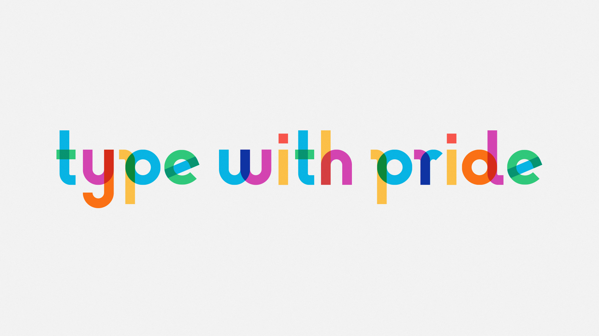

Title: 7. Vocable Code
page_order: 7

## 7. Vocable Code


## setup()

Using the phase *Vocable Code* for this chapter's title aims to make explicit how the act of coding cannot simply be reducible to its functional aspects. Rather we would like to emphasize that code mirrors the instability inherent in human language in terms of how it expresses itself, and is interpreted. Code is both script and performance, and in this sense is always ready to do something: it says what it will do, and does it at the same time. This analogy to speech, or more specifically to *speech-act theory* is well-known in software studies (not least in *Speaking Code*) and helps us to neatly demonstrate how we can to do things with words *and* code. [^speech]  

Indeed, if coding is somewhat like speaking, then it is also like poetry inasmuch as poems operate performatively.[^cox1] There are clear similarities between the syntactic qualities of written code and the execution of code in its performance. The parallel becomes evident if you read the source code aloud, as if it were a poem. A good example is the philosopher Franco Bifo Berardi who read the code for the *I Love You* virus aloud, enacting Florian Cramer's claim that the computer virus might be considered to be a form of poetry.[^language] This example makes broader reference to artists expressing language as found objects, including the Dadaist simultaneous poems which consisted of texts in different languages read aloud at the same time to expose the expressive tonality of the words as opposed to their meaning. Software is constructed from language, and is processed with and via computational procedures consisting of source code as symbols.[^love] Code is like poetry then, inasmuch as it plays with language's structures, setting up temporal interplay between the *voice* that is, and the *voice* that is to come. By connection to human language and the voice, we stress the instability of all codes and how particular intentions or meanings are open to misinterpretation and reinvention.

Many scholars and artists have explored these connections between speaking and coding, not only to consider programming as an aesthetic tool for producing hybrid programming-literary forms, but also to explore the material connections and creative tensions between the two.[^examples] That speech comes from living human bodies further reminds us that coding practices have bodies too, and this further reminds us that coding can only be understood in terms of wider infrastructures, and the context of its making (or *poiesis* if you will). In this chapter we explore this line of thinking, and the ways in which the *voice* of the human subject is implicated in coding practices, and how coding itself can voice wider political issues, particularly concerning sexuality. We will therefore focus on the software artwork *Vocable Code*, as a means to engage with these technical and aesthetic aspects of code.


*Figure 7.1: The installation of Vocable Code*

### start()

Vocable Code is both a work of software art (software as art, not software to make art) and a *codework* (in which the source code and critical writing operate together) to embody queer code. Collecting voices and statements that complete the sentence starting with: “Queer is...,” the work is computationally and poetically composed: texts and voices are repeated, and disrupted by mathematical chaos, to create a dynamic artwork to explore the performativity of code, subjectivity and language. Behind the web interface, the code itself is a mixture of computer programming language and human language, and aims to expose the material and linguistic tensions between writing, and reading within the context of (non)binary poetry and queer computer code.

The work is presented in a dual screen format: one side displaying the source code (codework), and the other the visual interface of how the code is run and executed (see Figures 7.1 and 7.2). In this particular arrangement, the source code is no longer, as in the convention of most software, hidden from the user and is instead displayed in full to undermine the hierarchy between the source and its result once executed. The notion of queer code is both the subject and the process of the work, and this operates on multiple levels, *queering* what would be considered to be the normative conventions of software and its use: addressing what a front-end interface is expected to be, and how it performs normatively. What we experience are the performative qualities of code in terms of both its human and nonhuman execution. When code becomes executable, it blends "form and function,"[^execute] a form in which it can be read, interpreted, executed and performed aesthetically. We see the code and we hear contributor's spoken statements that, together, allow the program to speak to us.

The core method for structuring *Vocable Code* is the use of constraints or rules. These are readily discernible in both the source code, as well as the rules for voicing the statements that themselves express different rhythms and meanings.[^constraints] Below are some of these constraints:

- When writing the source code, do not use the binary number 0 or 1 (like declaring the value of a variable), a single X or Y (like the common use of such variable names), a single operator of ">" or "<" (like the common use of a single operator in a conditional statement). [g: can you see if this is clearer? /w]
- When writing the source code, be mindful of the naming of variables, arrays, and functions.
- For each specific voice, the sentence starts with the phrase: "Queer is".
- For each specific voice, each sentence contains a minimum of one word, but no more than five.

## Exercise in class (Decode)

[RUNME](https://dobbeltdagger.net/VocableCode_Educational/)


*Figure 7.2: The live coding/educational version of Vocable Code*

**Task 1: Reading text objects**

Look at the education version of Vocable Code and focus on the right-hand side with the dynamic text display in which the program operates mainly around text. Observe some of the characteristics of the text objects:

1. There is always text on the black screen/canvas.
2. The text moves upwards and then mostly downwards, but also sometimes slowly oscillates between the two.
3. The text fades over time.
4. The text varies in size.
5. Some of the text's content overlaps, but there are at least 10 different or unique texts in any time.
6. For each new batch of the text shown on screen, you can hear a voice speaking one of the texts.
7. There is a maximum limit of the text simutaneously appeared on screen. (Similar to previous object-oriented approach, the text is continuously generated on screen if certain conditions are met)
8. ...(Can you continue the list?)

The *Vocable Code* program uses Object-Oriented Programming to construct the class and the text objects. Without looking at the source code and recall what we learnt in the previous chapter:

1. Can you describe the text object' properties and methods of the class?
2. Can you decode when and how (new) text objects are created/removed?

**Task 2 (Speculation and Mapping):**

Based on what you see and hear, what are the other functions/features that have been implemented in the program, especially in relation to text and voice, and can you describe them?

Now look at the source code particularly the class-object block `function notNew(getQueer){}`. Can you map the source code with your earlier description on text objects?

**Task 3: (thinking)**

By reading the source code, you might discover that some of the coding styles are different from what we have learnt e.g the Boolean logic of notTrue and notFalse instead of True/False, the use of repeatable decimals, the use of the function `abs`, as well as the use of `loadSound` with a callback instead of the `preload` function, etc. Discuss:

1. Can you locate the code with a different writing style?
2. Can you read that block of code aloud?
3. How does Cox describe "expressive qualities"[^cox2] and performativity in the assigned reading? Can you describe and articulate that by using *Vocable Code* as an example?

## Textuality
Although the artwork *Vocable Code* is about voices, both voices and text are interlinked in the work. The program picks only one selected text to speak/play at a time. The other selected texts are displayed dynamically on screen. You can look into the meaning and semantics of text, but the placement of words, and other design attributes, also change the way you might perceive and interpret the statements. Queer statements are selected, presented, played, and spoken randomly, but at the same time they are also structurally organized to create the orderly chaos.    

Here is the text-related syntax that has been used in the work:

```javascript
let withPride; //font
//new font: line 11
function preload() {
  withPride = loadFont('Gilbert_TypeWithPride.otf');
}
.
.
.
//line 62: the class and constructor
function notNew(getQueer){
  this.size = random(20.34387,35.34387);
  this.time = random(2.34387,4.34387);
  this.yyyyy = random(height/3.0,height+10.3437);
  this.xxxxx = width/2.0;
  this.gradient = 240.0;
}
.
.
.
this.acts = function() {
  textFont(withPride);
  textSize(this.size);
  textAlign(CENTER);
  this.gradient-=0.5;
  noStroke();
  fill(this.gradient);
  text(getQueer, this.xxxxx, this.yyyyy);
}
```
*Sketch 1: Snippets of Vocable Code concerning Textuality*

### Type
`loadFont` supports opentype font style (.otf and .ttf) and returns a PFont object through `withPride` in sketch 1 above.

"Gilbert_TypeWithPride.otf" is a free font licensed under a Creative Commons Attribution-ShareAlike 4.0 International License. The font can be downloaded from the Internet (www.typewithpride.com).[^fonts] It is designed to honor the memory of Gilbert Baker the creator of the iconic Rainbow Flag who died in 2017.



*Figure 7.3: The font "Type with Pride"*

`textFont()` - It means to get ready to print out or write the text with the chosen font. (The font is previously defined via the retured PFont object `withPride`).

`textSize()` - It sets the font size for use. For this sketch it takes a random value between 20.34387 to 35.34387.

`textAlign()` - It sets the text's alignment in horizontal with the options of LEFT, RIGHT and CENTER. The length of sentences varies according to the number of words used. In *Vocable Code*, the text is aligned CENTER regardless of the sentence's length.

`noStroke()` and `fill()` - The former disables drawing the stroke (outline), while the latter sets the text color. `fill()` accepts RGB values as well as other color formats.

`text()` - It draws the text on screen, setting which specific text and their display positions (both the horizontal and vertical coordination of the text). e.g. `text(getQueer, this.xxxxx, this.yyyyy);`

### Conditional Structure

Five different `if` statements are implemented in *Vocable Code*.

```javascript
//line 21
if (queers[WhoIsQueer].myStatement == "null" || makingStatements == int(2.34387)) {
		queerRights.push(new notNew(queers[WhoIsQueer].yourStatement));
		makingStatements = 2.0;
}else{
		queerRights.push(new notNew(queers[WhoIsQueer].myStatement));
}
```
*Figure 7.4: Snippets of Vocable Code concerning the first Conditional Structure*

This block of code (see Figure 7.4) determines which new text object should be selected for display. In the program, each person can only hold the maximum of two vocal/textual statements, and some may have provided one. As such, some checking logic needs to be implemented in order to display the text.

The first statement uses the relational operator called **OR** (||) to check against if meeting any of the two conditions that are resulted in pushing the first statement. If either of the two is true the program will execute the next two lines of code. Naturally, the two conditions might not met, and, in that case, `else` is used.

```javascript
//line 28
if (gender == abs(2)) {
  SpeakingCode(queers[WhoIsQueer].iam, makingStatements);
}
```
*Figure 7.5: Snippets of Vocable Code concerning the second Conditional Structure*

The second conditional structure (See Figure 7.5) only uses the `if` statement and that means it will run the function `SpeakingCode` when a condition is met. It won't have an alternative route, meaning that the program will just exit the conditional structure, and continue the execution after the closing curly bracket.

The conditional structure in Figure 7.5 is about identifying which text to speak aloud. Every new batch of text contains 2-4 text, and the program always picks the third one (knowing that an array starts with [0] index and points to the third item when the index is [2]). The program will base on the selected text to play the corresponding voice file. `abs` is a syntax and function from p5 which calculates the "absolute" value of a number and only returns a positive value.

Of course, the selected line of code is specifically structured around wider political issues concerning gender and sexuality, and attempts to express and open up different ideas about queering code. If you read aloud the block of code, it will be spoken approximately in this way (if we ignore the punctuation): "if gender equals absolute two, speaking code, queers, who is queer, i am, making statements." Technically speaking, using the `abs` function is unnecessary and it could be also written to select other array's index. Code is constructed from language but can also be poetic as the programmer can play with the structure, and experiment with symbols, and the syntactic logics of language itself. Since *Vocable Code* is also considered a codework or code poetry, it invites, even commands, the audience and the machine to speak the code aloud (and proud).


```javascript
//line 53
function draw() {
.
.
.
    if (support == "notFalse") {
        queerRights.splice(non_binary, int(1.34387));
	}
.
.
.
    if (queerRights.length <= 2.0)  {
        makeVisible();

    }
}
```
*Figure 7.6: Snippets of Vocable Code concerning the third Conditional Structure*

Figure 7.6 shows two conditional statements in the function `draw()`. The first if-statement checks for texts that are off canvas. This has to be done continuously because the off-screen text instances (objects) will be removed (using `splice`) to avoid unwanted elements/objects continuing to exist in the program (in analogy to the simple Packman-tofu game in Chapter 6 - "Object Abstraction"). The second if-statement checks how many texts remain on screen: if the screen contains less than or equal to two texts, then it will generate new batch of texts via the function `makeVisible()`. [g: can you check if this is readable? /w]

```javascript
//line 86
this.shows = function() {
	let status;
	if (this.yyyyy <= 4.34387 || this.yyyyy >= height+10.34387) {
		status = "notFalse";
	} else {
		status = "notTrue";
	}
	return status;
};
```
*Figure 7.7: Snippets of Vocable Code concerning the forth Conditional Structure*

The last **if-else** conditional structure is set within the class method, which is related by Figure 7.6 and checks if the text is off canvas, particularly along the
y-axis. Within the class's method `this.shows=function()`, the conditional statement incorporates the relational operator **OR** (`||`), in which either condition needs to be "true" (`if (this.yyyyy <= 4.34387 || this.yyyyy >= height+10.34387)`). Additionally, there is also an `else` statement to handle the results of checking whether the conditions have been met. Therefore, it is read as if either one of the two conditions has been met, the variable `status` will be assigned as "notFalse" (this means the text is out screen at the top or bottom), and else if the text still remain on screen, the variable "status" will be assigned as "notTrue". The values of `notFalse` and `notTrue` belong to the `status` variable of the **String** type. However, in general programming practice, Boolean logic (with the **Boolean** type) tends to be understood as an absolute binary reality of "true" or "false". Initially, this seems fundamental to computational logic and can be relate this to the zeros and ones to which information is reduced in machine code. However, arguably and conceptually, notFalse and notTrue suggest less reductive (more queer) forms that extend beyond simple binary relations.  

### JSON

Beyond the core source code, *Vocable Code* utilizes a text-based file (in JSON format) to store the data from all voice donors, such as their written statements (see Figure 7.8). The program uses the format of JSON to store all the contributers' statements in the form of text. Using JSON, allows all the data in a JSON file to be updated without changing anything at JavaScript source code level.

```
{
  "description": "This file contains the meta data of queer text",
  "condition": "yourStatement cannot be null",
  "copyLeft": "Creative Common Licence BY 4.0",
  "lastUpdate": "Apr, 2019",
  "queers":
  [
  {
    "iam": "WinnieSoon",
    "yourStatement": "not fixed not null",
    "myStatement": "not null not closed"
  },{
    "iam": "GeoffCox",
    "yourStatement": "queer and that means queer",
    "myStatement": "null"
  },{
    "iam": "GoogleAlgorithm",
    "yourStatement": "not a manifesto",
    "myStatement": "here"
  }
}
```
*Figure 7.8: Snippets of the JSON file in Vocable Code*

Javascript Object Notation (JSON) is an open-standard, independent file format, which is widely used for data storage and communication on the internet, and in software applications. This format can be read and processed by many programming languages such as JavaScript. A piece of software implements computational logic to manipulate data, such as retrieving and displaying data on a screen in any color, size, and at any tempo. This kind of separation of data and computational logic is common in software development. Google, for example, offers its web or image search results in JSON format using its Application Programming Interfaces (APIs). More on APIs in the next chapter.

JSON looks similar to JavaScript in terms of its use of arrays and objects but they are formatted differently. Some of the rules are:
- Data is stored in name/value pairs, e.g `"copyLeft": "Creative Common Licence BY 4.0"` and the pair are separated by a colon.
- All property name/value pairs have to be surrounded by double quotes.
- Each data item is separated by commas.
- Square brackets "[]" hold arrays.
- Curly braces "{}" hold objects as there are many object instances that share the same structure.
- Comments are not allowed.
- No other computational logics like conditional structure or for-loop can be used.

To process the JSON file in Figure 7.8, you need to use the syntax `loadJSON()` in p5.js. See how this is put together in a sketch:

**Step 1. loadJSON (to load the specific file and path)**
```javascript
let whatisQueer;

function preload() {
  whatisQueer = loadJSON('voices.json');
}
```
**Step 2. Process the JSON file**
```javascript
function makeVisible() {
//line 16 (queers is the array)
  queers = whatisQueer.queers;
//line 28 (check the JSON file - which are the objects under 'queers' -> to select which voice to play)
  SpeakingCode(queers[WhoIsQueer].iam, makingStatements);
}
```

<!--  -->


*Figure 7.9: Snippets of Vocable Code concering Reading JSON*

After loading the JSON file `voices.json` the program then  points at the `queers` array and looks for the name/value pairs `iam`, `makingStatements`. What constitute `makingStatements` is the name/value pairs of `yourStatement` and `myStatement` in the JSON file (see Figure 7.8). This is how the program locate precisely the  statement (in the form of a voice file) among 20 contributors and with a total of more than 30 statements.

Lastly, the function `SpeakingCode` is called. Figure 7.9 illustrates how communication is effected between the source code and the JSON files, passing the data (between the JSON file and the program) so it can be displayed on screen.

**Step 3. Locating and loading the sound file**
```javascript
function SpeakingCode(iam, makingStatements) {
	let getVoice = "voices/" + iam + makingStatements + ".wav";
	speak = loadSound(getVoice, speakingNow);
}
```

**Step 4. Play the sound file**
```javascript
function speakingNow() {
	speak.play();
}
```

All the voice files are stored in the wav sound file format. The files are named according to a specific convention that follow the field `iam` in the JSON file. In this way, we can link, or concatenate in programming terms, all the pieces using the operator `+` so the specific voice file is retrieved and played: `let getVoice = "voices/" + iam + makingStatements + ".wav";` As discussed above, the voice selected is synchronized with the text on screen.

There is a p5.sound library which extends p5 with Web Audio functionality to deal with sound, or, in this case, to play a voice file. Previously we have discussed the audio capturing/listening events of an audio input in Chapter 4 - "Data Capture", this chapter we simply need methods to load and play the sound files. To do so, `loadSound()` is used as a callback to make sure the sound is fully loaded (it takes time as it also involves the file size issues, memory and hardware) before the function `speak.play()` is invoked (see Figure 7.9).

 `loadSound()` can be used in the `Preload()` function where files can be loaded in advance by specifying the files' paths. However, the idea behind *Vocable Code* is more poetic, and keeping the JavaScript source code as the core corpus is part of the concept. Instead of using `Preload()`, the program uses the callback function[^callback] to load the sound might not be the most efficient way as it incurs buffering problems while loading the files on-the-fly, but this way of working with code opens up thinking about language structures, what it means to load, and play/speak the files/voices in real-time and repeatedly, and what forms of instability of expression are invoked.

## Source code
```javascript
// CC BY 4.0 - https://creativecommons.org/licenses/by/4.0/
let withPride;
let whatisQueer;
let queerRights = [];
let makingStatements;
let speak;
let voices = [];
let queers = [];

function preload() {
	withPride = loadFont('Gilbert_TypeWithPride.otf');
	whatisQueer = loadJSON('voices.json');
}

function makeVisible() {
	queers = whatisQueer.queers;
	let addQueers = int(random(2.34387,4.34387));
	for (let gender = int(0.34387); gender <= addQueers; gender++) {
		let WhoIsQueer = int(random(queers.length));
			makingStatements = int(random(2.34387,3.34387));
			if (queers[WhoIsQueer].myStatement == "null" || makingStatements == int(2.34387)) {
				queerRights.push(new notNew(queers[WhoIsQueer].yourStatement));
				makingStatements = 2.0;
			}else{
				queerRights.push(new notNew(queers[WhoIsQueer].myStatement));
			}
	 if (gender == abs(2)) {
			SpeakingCode(queers[WhoIsQueer].iam, makingStatements);
	 }
	}
}

function SpeakingCode(iam, makingStatements) {
	let getVoice = "voices/" + iam + makingStatements + ".wav";
	speak = loadSound(getVoice, speakingNow);
}

function speakingNow() {
	speak.play();
}

function setup() {
	createCanvas(windowWidth,windowHeight);
}

function draw() {
	background(2.34387);
	let non_binary;
	for (non_binary in queerRights) {
		queerRights[non_binary].worldWide();
		queerRights[non_binary].acts();
		let support = queerRights[non_binary].shows();
		if (support == "notFalse") {
			queerRights.splice(non_binary, int(1.34387));
		}
	}
	if (queerRights.length <= 2.0) {
		makeVisible();
	}
}

function notNew(getQueer) {
	this.size = random(20.34387,35.34387);
	this.time = random(2.34387,4.34387);
	this.yyyyy = random(height/3.0,height+10.3437);
	this.xxxxx = width/2.0;
	this.gradient = 240.0;

	this.worldWide = function() {
		this.yyyyy -= this.time;
		this.time += sin(radians((frameCount%360.0)*this.time)) - 0.009;
	};

	this.acts = function() {
		textFont(withPride);
		textSize(this.size);
		textAlign(CENTER);
		this.gradient-=0.5;
		noStroke();
		fill(this.gradient);
		text(getQueer, this.xxxxx, this.yyyyy);
	};

	this.shows = function() {
		let status;
		if (this.yyyyy <= 4.34387 || this.yyyyy >= height+10.34387) {
			status = "notFalse";
		} else {
			status = "notTrue";
		}
		return status;
	};
}
```

## Exercise in class

1. Work as a group.

2. Download the whole *Vocable Code* program (https://github.com/siusoon/VocableCode/), and run it on your own computer.

3. Briefly discuss the various computational structures and syntax to understand how things generally work, then specifically examine the relationship between voice file naming and the JSON file structure.

4. Follow the instructions and record your own voice with your computer or mobile phone. (The program only accepts the .wav file format)
    - Find a blank sheet of paper and prepare to write a sentence.
    - Complete the sentence with the starting given words: “Queer is ...”
    - Each sentence contains no more than 5 words (the first words - “queer is” - are not counted).
    - It is ok to have just one word in a sentence.
    - A maximum of two sentences/voices.
    - Download/locate a voice recording app on your smartphone (e.g “Voice Recorder” on Android or "Voice Memos app” on iOS).
    - Try to find a quiet environment, record your voice, and see if the app works (mainly to check if you can start and end the recording).
    - Prepare to record yourself reading your written sentence(s).
    - You may decide the tempo and rhythm you read the text out with (you may decide to speak the full word or full sentence, and you may also decide to select just a certain part (phonetics) of the word or sentence to speak aloud. In other words, the word / sentence doesn’t need to be fully pronounced).
    - Record your voice, then convert the recording into a wav file format. Audacity is an example of free software that can do so.

5. Add your voice/s by adding your statement in the JSON file and putting your voice files in the voices folder. Refresh the program and see if you can hear your own voice among the voices.

6. Advanced: Try to change the text presentatione e.g. its color or its animated behavior.

7. Discuss the different critical and aesthetic aspects of queer code.

## While()

In high-level programming languages like JavaScript, the source code sends both instructions to machines as well as communicating with humans. In this way, writing source code involves the use of signs and symbols, both semantics and syntactics, and operates across both programming and natural languages. Beyond the poetry mentioned, Lingdong Huang has developed the first programming language based on classical Chinese literature called *wenyan-lang*. It displays ancient Chinese texts in the form of traditional Chinese characters with the use of classical Chinese.[^wy] Using signs and symbols as well as combining formal logic and poetic expression are the starting points for understanding the double logic of vocable code.

 As we learnt from the previous chapter abstraction is a concept fundamental to software development, which differs from machine operations, thereby focusing on building abstractions as objects. The use of class/object structures (text as object instances), conditional structures, procedures, and subroutines, such as the for-loop, are some of the ways of presenting and executing the source code. However, in the context of machine execution, variable names - the semantic layer - are stripped away and this human-readable information is avoided. This *secondary notation* does not have the execution of the program apart from memory size, but does provide other potential uses. In this way, choosing meaningful identifier names is more for the purpose of expression and communication, as the example above clearly demonstrates. This is where we hear the programmer's voice.

Furthermore, when thinking about the importance of source code for understanding the operations of software, it is important to recognize that source code does not show how a machine operates with physical memory (such as store, load, add and halt actions), how it translates symbolic actions into real addresses, or how it discloses operation sequences as low-level programming languages would do. The point is the source code only describes what might be visible to hear/see, but it does not facilitating other forms of knowing how a machine operates from the source code. To be specific, *Vocable Code* displays the two interfaces side by side. One displays the source code, the other what happens when it is executed, and there is a discrepancy as what you see is not literally how it operates. This could perhaps be understood in two ways, as follows.

Firstly, the source code is made available, but the process of translation from source code to machine code is still hidden, and not all the lines are executed. Wendy Chun refers to this as a process of "sorcery" and summarizes the problem: "Higher level programming languages - automatic programming - may have been sold as offering the programmer more and easier control, but they also necessitated blackboxing even more the operations of the machine they supposedly instructed."[^Chun] Accordingly, we would need to nuance the statement that source code actually does what it says. When one speaks the source code, it performs differently than how a machine performs; Yet this is no doubt the case with humans too in that there is also an interface and translation between physiognomy and action.

Secondly, source code and its execution, usually in the form of screen interface, should be considered as translations rather than equivalents of each other, and this points to the veracity of the interface-principle WYSIWYG (what-you-see-is-what-you-get). In *Vocable Code*, the moving text is only part of the result of the source code running, and is not able to fully capture the complexity of its operations. In this way, the artwork perhaps challenges the usual, prominent front-end interfaces and the transmission of meaning from one source to another by giving voice to both the front and back ends, or even queering the demarcation between front and back. This undermines any binary relation between states and the hierarchical logic of cause and effect, and in this respect we would invoke Karen Barad and her assertion that causes and effects work through "intra-actions" (queering causality).[^Barad]

*Vocable Code* has a direct relation to bodily practices, such as voicing through writing and coding, and speaking code and statement with our voice, as well as playing back the recorded computer voices. The voices of the program or programmer, and humans voices, combine with other social bodies in producting meaning that goes beyond simple representation or interpretation. In other words, computation cannot be just reduced to the simplistic formal logic of input and output, and nor can speaking machines simply be juxtaposed to speaking humans as clearly they are more deeply entangled [g: i suggest to add a footnote to address Loren's comment - regarding barad's term entanglement /w]. In executing the function `SpeakingCode(iam, makingStatements)`, we question who is speaking, to whom, and under what conditions? We want to make this more queer.

In *Vocable Code* you might assume that it is people that are speaking, but they do not speak alone as there are also nonhuman actants such as variables, arguments, source code, and machine code that speak too — to be specific, the sound library with the function `speak.play()` joins the chorus. There is a politics to this as some voices are louder than others and some are marginalized or suppressed altogether.

There are clear power dynamics at work in computing, at a fundamental level even, if ones and zeros are considered to be numbers of equivalent status in mathematics. In *Zeros + Ones* (1997), Sadie Plant confirms that all computers translate information into the zeros and ones of machine code and this reflects the underlying "orders of Western reality":

<blockquote>
"Whether [...] gathering information, telecommunicating, running washing machines, doing sums, or making videos, all digital computers translate information into zeros and ones of machine code. These binary digits are known as bits and strung together in bytes of eight. The zeros and ones of machine code seems to offer themselves as perfect symbols of the orders of Western reality, the ancient logical codes which make the difference between on and off, right and left, light and dark, form and matter, mine and body, white and black, good and evil, right and wrong, life and death, something and nothing, this and that, here and there, inside and out, active and passive, true and false, yes and no, sanity and madness, health and sickness, up and down, sense and nonsense, west and east, north and south. And they made a lovely couple when it came to sex. Man and woman, male and female, masculine and feminine: one and zero looked just right, made for each other: 1, the definite, upright line; the 0, the diagram of nothing at all: penis and vagina, thing and hole... hand in glove. A perfect match."[^Plant1]
</blockquote>

Although it takes two to make a binary (and set up the heterosexist paradigm), clearly inequalities of power are expressed in the tendency to privilege one side of the pairing (master and slave[^master], parent and child, human and machine, and so on). As discussed in Chapter 5 - "Auto Generator", and to be further discussed in the final chapter of this book, the Turing Test resonates with these power dynamics. Plant quotes Alan Turing as saying: "the intention in constructing these machines in the first instance is to treat them as slaves, giving them only jobs which have been thought out in detail, jobs such that the user of the machine fully understands in principle what is going on all the time."[^Plant2] Plant's further example is the sci-fi film *Bladerunner* (1984) as an advanced Turing Test in which the only indication of artificiality is a tiny flicker in the non-human eye's iris in response to targeted questioning. In the film's narrative, the non-human worker-slaves have begun to question their conditions. Such examples make it clear that the ability to imagine conditions differently is embedded in the system itself, in the potential failure to carry out prescribed instructions or commands.

The biography of Turing as a gay man at a time when homosexuality was still a criminal offense in the UK [^Hodges], and this alludes to humans do not necessarily follow or agree with rules as prescribed by society, and although Turing's sexuality was tolerated in the context of the war effort, under "normal" (peacetime) conditions it was perceived to be a problem and he was found guiltily of gross indecency in 1952.[^Plant3] Here, as Plant describes, the historical facts collapse into bizarre allegory. First of all, he was prescribed estrogen to reduce his sexual urge, on the basis of the dubious logic that to all intents and purposes he was female. This was a reversal of prior judgements forcing gay men to take testosterone to make them more male, yet ironically making them more aroused hormonally. Plant concludes the Turing story: "Two years later he was dead" By the side of the table was an apple, out of which several bites had been taken. And this queer tale does not end here. There are rainbow logos with Turing's missing bytes on every Apple Macintosh machine."[^Plant4]

To conclude this chapter, which explored the making of *Vocable Code* with its strange syntax - such as notFalse and notTrue - as well as its many repetitive decimals, we would like to emphasize our central point: Queer is... making binaries strange.  

## MiniX[7]: E-lit

**Objective:**
- To understand how JSON works technically, in terms of storing data, and how data can be retrieved using code.
- To reflect upon the aesthetics of code and language, as well as the audio dimensions of electronic literature or e-lit.

**Get additional inspiration:**
- [Dial (2020) by Lai-Tze Fan & Nick Montfort](http://thenewriver.us/dial/), with JavaScript [source code](view-source:https://nickm.com/fan_montfort/dial/)
- [Mexicans in Canada (2020) by Amira Hanafi](http://amiraha.com/mexicansincanada/)
- [A House of Dust, 1967 by Alison Knowles and James Tenney, reimplemented by Nick Montfort](https://nickm.com/memslam/a_house_of_dust.html)
- [Corpora - A repository of JSON files by Darius Kazemi](https://github.com/dariusk/corpora/tree/master/data)
- [e-lit collection1](http://collection.eliterature.org/1/)
- [e-lit collection2](http://collection.eliterature.org/2/)
- [e-lit collection3](http://collection.eliterature.org/3/)
- [Rita library by Daniel Howe](http://rednoise.org/rita/)

**Tasks (RUNME):**

1. To design a piece of electronic literature that utilizes text as the main medium (but in recognition that text can take various forms, including code and voice).
2. To implement JSON file(s) for text organization, storage, and retrieval.  

**Questions to think about as README:**
- **Provide** a title of your work and a short description (within 1,000 characters).
- **Describe** how your program works, and what syntax you have used, and learnt?
- **Analyze and articulate** your work:
  - Analyze your own e-lit work by using the text *Vocable Code* and/or *The Aesthetics of Generative Code* (or other texts that address code/voice/language).
  - How would you reflect on your work  with the theme *Vocable Code*?

## Required reading:

- Parrish, Allison. (2019) Text and Type [online] Available at: https://creative-coding.decontextualize.com/text-and-type/
- Shiffman, Daniel. (2017) 10.2: What is JSON? Part I - p5.js Tutorial [online] Available at: https://www.youtube.com/playlist?list=PLRqwX-V7Uu6a-SQiI4RtIwuOrLJGnel0r [Accessed 13 Mar. 2019].
- Shiffman, Daniel. (2017) 10.2: What is JSON? Part II - p5.js Tutorial [online] Available at: https://www.youtube.com/playlist?list=PLRqwX-V7Uu6a-SQiI4RtIwuOrLJGnel0r [Accessed 13 Mar. 2019].
- Cox, Geoff, and Alex McLean. "Vocable Code" in *Speaking Code*. Cambridge, Mass.: MIT Press, 2013. 17-38.

## Notes

[^speech]: Here we reference John Langshaw Austin's *How To Do Things With Words*, and by extension, Geoff Cox and Alex McLean's *Speaking Code* (Cambridge, Mass.: MIT Press 2013). The analogy of free software to free speech is explicitized in the Free Software Foundation's definition: “Free software " means [...] that the users have the freedom to run, copy, distribute, study, change and improve the software. Thus, "free software" is a matter of liberty, not price. To understand the concept, you should think of "free" as in "free speech," not as in "free beer." See https://www.gnu.org/philosophy/free-sw.html.  

[^language]: Florian Cramer, *Language in Software Studies*, 2008, 168-173; see also Warren Sack, *The Software Arts* (Cambridge, Mass.: MIT Press, 2019)

[^love]: Florian Cramer's claim was made in the context of the *I Love You* exhibition (2002-4) a work in progress-exhibition developed by digitalcraft.org Kulturbüro, see http://www.digitalcraft.org/iloveyou/.

[^examples]: Relevant to this discussion is what Donald Knuth calls "literate programming," a methodology that treats a program like a piece of literature, addressed to human beings rather than to a computer. For more on this, see Donald Knuth's "Literate Programming," *The Computer Journal* 27, no.2 (1984), 97–111, https://academic.oup.com/comjnl/article/27/2/97/343244; https://doi.org/10.1093/comjnl/27.2.97. Further examples might include those by Mez Breeze (1994), Florian Cramer (2008), John Cayley (2002), Geoff Cox & Alex McLean (2013), Winnie Soon & Geoff Cox (2018), Ian Hatcher (2015, 2016), Graham Harwood (2008), Daniel Temkin (2011), Michael Mateas and Nick Montfort (2005), Zach Blas and Micha Cárdenas (2012, 2013) and Allison Parrish (2015), to name but a few.
See: Parrish, A (2015) https://vimeo.com/134734729; Cramer, F (2008) Language in Software Studies; Breeze, Mez (1994-ongoing) MEZANGELLE. https://anthology.rhizome.org/mez-breeze; Harwood, G (2008) Class Library in Software Studies; Cayley, J (2002) The Code is not the Text (unless it is the Text). electronic book review; Hatcher, I. (2015) The All-New. Small Press United. http://anomalouspress.org/books/all-new.php; Hatcher, I. (2016) Not not. https://soundcloud.com/ihatch/5-notnot; Temkin, Daniel. (2011) esoteric.codes https://esoteric.codes/; Mateas, M., & Montfort, N. (2005, December). A box, darkly: Obfuscation, weird languages, and code aesthetics. In Proceedings of the 6th Digital Arts and Culture Conference, IT University of Copenhagen (pp. 144-153); Cox, G. (2013) Speaking Code: Coding as Aesthetic and Political Expression. Cambridge, Mass: MIT Press; Soon, W., & Cox, G. (2018). Vocable Code. In Artistic Research Will Eat Itself (pp. 251-258); Blas, Z. & Cárdenas, M. Imaginary computatoinal systems: queer technologies and transreal aesthetics. AI & Soc (2013) 28: 559. https://doi.org/10.1007/s00146-013-0502-y; Blas, Z., & Cárdenas, M. (2013). Imaginary Computational Systems: Queer Technologies and Transreal Aesthetics. *AI and Society*, 28(4), 559-566

[^execute]: Roopika Risam, *The Poetry of Executable Code*, 2015, available at http://jacket2.org/commentary/poetry-executable-code.

[^fonts]: At the same time, you can also find a lot of free and open source fonts to download online. See, for instance, https://www.1001freefonts.com/.

[^Chun]: Wendy Hui Kyong Chun, *Programmed Visions: Software and Memory* (Cambridge, Mass.: MIT Press, 2011, 45).

[^Barad]: Karen Barad, *Meeting the Universe Halfway: Quantum Physics and the Entanglement of Matter and Meaning* (Durham, North Carolina: Duke University Press, 2007).

[^Plant1]: Sadie Plant, *Zeros + Ones: Digital Women and the New Technoculture* (London: Forth Estate, 1997), 34-35.

[^Plant2]: Plant, *Zeros + Ones*, 88.

[^Hodges]: For a more detailed version of historical events, see Andrew Hodges's *Alan Turing: The Enigma* (London: Burnett Books, 1983).

[^Plant3]: Plant, *Zeros + Ones*, 98-99.

[^Plant4]: Plant, *Zeros + Ones*, 102.

[^wy]: The project 文言 wenyan-lang is an esoteric programming language that closely follows the grammar and tone of classical Chinese literature. See https://wy-lang.org/

[^cox2]: Cox, Speaking Code, 24.

[^cox1]: Cox, Speaking Code, 17.

[^constraints]: For a discussion around the constraint-based writing of *Vocable Code*, see Eva Heisler. "Winnie Soon, Time, Code, and Poetry." *Asymptote Journal* Jan 2020 (2020). https://www.asymptotejournal.com/visual/winnie-soon-time-code-and-poetry/

[^callback]: See the `loadSound()` function that can be used as both `preload()` and callback, https://p5js.org/reference/#/p5/loadSound.

[^master]: This has been discussed in Chapter 1, "Getting Started".
