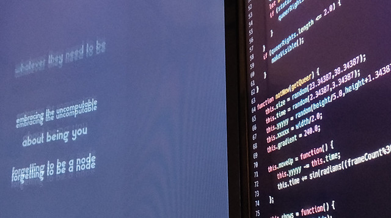

Title: 7. Vocable Code
page_order: 7

## 7. Vocable Code


## setup()

By using the phase *Vocable Code* for the title of this chapter we aim to make explicit the ways in which the act of coding is not reducible to its functional aspects. Rather we stress that code mirrors the instability inherent to human language in terms of how it expresses itself and is interpreted. Code is both script and performance, and in this sense is always ready to do something: it says what it will do and does it at the same time. This analogy to speech, or more specifically to *speech-act theory* has been well rehearsed in software studies (not least in *Speaking Code*) and helps us to demonstrate neatly how we can to do things with words *and* code: to produce an action with effects.[^speech]  

Indeed if coding is somewhat like speaking, it is also like poetry inasmuch as poems operate performatively, explicitly when spoken, and clearly there are similarities between the syntactic qualities of written code and words on the page to be executed. This is made evident when source code is read aloud as if it were a poem such as the example of the philosopher Franco Bifo Berardi reading the *I Love You* virus, literally enacting Florian Cramer's claim that the computer virus *I Love You* might be considered to be a form of poetry.[^language] This also makes larger reference to artists expressing language as found objects, in simultaneous poems from the Dada period for example, where texts in different languages were read aloud at the same time to expose their aesthetic and undermine their authoritative function. Software is constructed in language, and is processed with and via computer code consisting of symbols.[^love] Code is like poetry then inasmuch as it plays with structures of language itself, and sets up a temporal interplay between the *voice* that is, and the *voice* that is to come. Such examples stress the instability of all codes (including human language) and how particular intentions or meanings are open to misinterpretation and reinvention.

Many scholars and artists have explored these connections between speaking and coding, not only to consider programming as an aesthetic tool to produce poetic or literary forms but also to explore the material connections and creative tensions between the two.[^examples] That speech comes from living human bodies further reminds us that coding practices have bodies too (even programmers do, although many are in denial), and this further reminds us that coding can only be understood in terms of wider infrastructures and the context of its making (or *poiesis* if you like). In this chapter we explore this line of thinking, and the ways in which the *voice* of the human subject is implicated in coding practices, and how coding can itself give voice to wider political issues, particularly around sexuality. Thus we focus on the software artwork *Vocable Code*, as a means to engage with these technical and aesthetic aspects of code, and how these issues might be exposed.



*Figure 7.1: An installation view of Vocable Code*

[add literate programming ref by Knuth, 1992 - or the paper in 1984 https://academic.oup.com/comjnl/article/27/2/97/343244]

### start()

Vocable Code is both a work of “software art” (software as artwork, not software to make an artwork) and a “codework” (where the source code and critical writing operate together) to embody “queer code”. Through collecting voices and statements from others that help to complete the sentence that begins “Queer is...”, the work is computationally and poetically composed: texts and voices are repeated and disrupted by mathematical chaos, to create a dynamic artwork (software art or work of electronic literature) and to explore the performativity of code, subjectivity and language. Behind the executed web interface, the code itself is a mixture of a computer programming language and human language, and aims to expose the material and linguistic tensions of writing and reading within the context of (non)binary poetry and queer computer code.

The work is presented in a dual screen format: on one side the source code (codework) is displayed, and on the other the executed version (see figures 7.1 and 7.2). In this particular arrangement, the source code is no longer, as in the convention of most software, hidden away from the user and instead is displayed in full to undermine the hierarchy between the source and its result once executed. The notion of queer code is both the subject and the process of the work, and this operates on multiple levels, *queering* what would be considered to be the normative conventions of software and its use: addressing what a front-end interface is expected to be, and how it normatively performs. Instead what we experience are the performative qualities of code in terms of both its human and nonhuman execution. When code becomes executable, it blends "form and function,"[^execute] a form in which it can be read, interpreted, executed and performed aesthetically. We see the code and we hear the voices of contributor's statements that together allow the program to speak to us.

The core method in structuring the artwork *Vocable Code* is the use of constraints or rules, which can be seen in both the writing of the source code, as well as formulating the rules for voicing the statements that themselves express different rhythms and meanings.[^constraints] For example, below are some of these constraints:
- When writing the source code, do not use binary 0 or 1, either a single X or Y, a single operator of '>' or '<'.
- When writing the source code, be mindful of the naming of the variables, arrays and functions.
- For each specific voice, the sentence starts with the phrase: "Queer is".
- For each specific voice, each sentence contains the minimum of 1 word but no more than 5.

## Exercise in class (Decode)

[RUNME](https://dobbeltdagger.net/VocableCode_Educational/)


*Figure 7.2: The live coding/educational version of Vocable Code*

**Task 1: Text objects**

Focus on the right side with the dynamic text display in which the program operates mainly around text, and some of the features as below:

1. There is always text on the black color screen/canvas.
2. The text moves upwards and then mostly downwards, but also sometimes slowly oscillates between the two.
3. The text fades over time.
4. The text varies in size.
5. Some of the content of the text is overlapping but there are at least 10 different or unique texts in the pool at any time.
6. For each new batch of the text shown on screen, one can hear a voice that speaks one of the texts.
7. It seems there is a maximum limit of the text appearing on screen for each new batch.
8. ...

The program of *Vocable Code* has used the approach of Object-Oriented Programming to construct the class and the text objects. Without looking at the source code and recall what we have learnt in the previous chapter:

1. Can you describe the properties and behaviors of the class on text?
2. Can you decode when and how (new) text objects are being created/removed?

**Task 2 (Speculation and Mapping):**

Based on what you see and hear, what are the other functions/features that have been implemented in the program especially in relation to text and voice, and can you describe them?

Now look at the source code especially the class-object block `function notNew(getQueer){}`. Discuss what you have described before and how these have been coded.

**Task 3: (thinking)**

By reading the source code, you might discover that some of the writing styles are different from what we have learnt e.g the boolean logic of notTrue and notFalse, the use of repeatable decimals, the use of the function `abs`, as well as the use of `loadSound` with a callback instead of the `preload` function, etc. Discuss:

1. Can you spot them?
2. Can you speak that block of code aloud?
3. How does Cox describe "expressive qualities"[^cox2] and performativity in the assigned reading? Can you describe and articulate that by using the example of *Vocable Code*?

## Textuality
Although the artwork *Vocable Code* is about voices, both voices and text are interlinked in the work. The program will pick only one selected text to speak/play at a time. Other selected text will be display dynamically on a screen. In terms of language, one can look into the meaning and semantics of text, but the placement of words and other design attributes also change the way of how one might perceive and interpret the statements. Queer statements are randomly selected, randomly presented and randomly spoken but at the same time they are also orderly combined while randomly disrupted by mathematical chaos.    

Here is the text-related syntax that has been used in the work:

```javascript
let withPride; //font
//new font: line 11
function preload() {
  withPride = loadFont('Gilbert_TypeWithPride.otf');
}
.
.
.
//line 62: the class and constructor
function notNew(getQueer){
  this.size = random(20.34387,35.34387);
  this.time = random(2.34387,4.34387);
  this.yyyyy = random(height/3.0,height+10.3437);
  this.xxxxx = width/2.0;
  this.gradient = 240.0;
}
.
.
.
this.acts = function() {
  textFont(withPride);
  textSize(this.size);
  textAlign(CENTER);
  this.gradient-=0.5;
  noStroke();
  fill(this.gradient);
  text(getQueer, this.xxxxx, this.yyyyy);
}
```
*Sketch 1: Snippets of Vocable Code on Textuality*

### Type
`loadFont` supports opentype font style (.otf and .ttf) and it returns a PFont object through `withPride` in the above sketch 1.

"Gilbert_TypeWithPride.otf" is a free font and is licensed under a Creative Commons Attribution-ShareAlike 4.0 International License. This can be downloaded from the Internet (www.typewithpride.com).[^fonts] It is designed to honor the memory of Gilbert Baker who died in 2017, the creator of the iconic Rainbow Flag.

<!--  -->


*Figure 7.3: The font type with pride, designed by Gilbert Baker*

`textFont()` means to get ready to print out or write the text with the chosen font, and in this case with the `withPride` that is previously defined.

`textSize()` sets the current font size for use. For this sketch it takes a random return between 20.34387 to 35.34387.

`textAlign()` takes the first argument for the horizontal alignment. It contains options such as LEFT, RIGHT and CENTER. Since every sentence contains a different number of words, its length will vary too. In *Vocable Code*, the text is aligned CENTER regardless of the length of the sentence.

`noStroke()` and `fill()` do similiar things for shapes. The former disables drawing the stroke (outline), while the latter sets the color of the text. `fill()` takes RGB values and other different color formats.

`text()` draws the text on the screen with specific words and positions (both horizontal and vertical coordinations of the text). e.g. `text(getQueer, this.xxxxx, this.yyyyy);`

### Conditions
There are five different `if` statements implemented in *Vocable Code*.

```javascript
//line 21
if (queers[WhoIsQueer].myStatement == "null" || makingStatements == int(2.34387)) {
		queerRights.push(new notNew(queers[WhoIsQueer].yourStatement));
		makingStatements = 2.0;
}else{
		queerRights.push(new notNew(queers[WhoIsQueer].myStatement));
}
```
*Figure 7.4: Snippets of Vocable Code on Conditional Structure I*

The first one has used the relational operator called **OR** (||) to check against the two conditions. If anyone is true then the program will execute the next two lines of code. But of course there is a case where two conditions are not met, and in that case the `else` is used for this situation. This block of code is to determine which new text object should be selected for display as each person can only hold two vocal/textual statements, and some might have given one voice only. As such, some checking logics need to implement in order to display the text.

```javascript
//line 28
if (gender == abs(2)) {
  SpeakingCode(queers[WhoIsQueer].iam, makingStatements);
}
```
*Figure 7.5: Snippets of Vocable Code on Conditional Structure II*

The second one has only used the `if` statement and that means it will run the function `SpeakingCode` when the condition is met and it won't have other alternative route, meaning that the program will just exit the conditional structure and continue the execution after the closing curly bracket.

The conditional structure in Figure 7.5 is about picking the third of a new text batch (knowing that an array is started with a [0] index and it points to the third item when the index is [2]) and the selected text will then map to the voice file and play it back. `abs` is a syntax and function from p5 which calculates the absolute value of a number and it only returns a positive one.

Of course the selected line of code is specifically structured around wider political issues about gender and sexuality, attempting to express and open up different thinking about queering code. Technically speaking, it is not necessary to use the `abs` function and secondly, it could be also written to pick other array's index. As we introduced earlier, code is constructed in language but it can also be poetic in the ways in which the programmer can play with structure and experiment with symbols and the syntactic logics of language itself. Since *Vocable Code* is also considered as codework (or code poetry), it invites (even commands) the audience and machine to speak the code aloud (and proud).


```javascript
//line 53
function draw() {
.
.
.
    if (support == "notFalse") {
        queerRights.splice(non_binary, int(1.34387));
	}
.
.
.
    if (queerRights.length <= 2.0)  {
        makeVisible();

    }
}
```
*Figure 7.6: Snippets of Vocable Code on Conditional Structure III*

Figure 7.6 shows two conditional structures in the function `draw`. In general, they are checking for texts that are out of the canvas. This has to be done frequently and continuously because the out-of-screen text instances (objects) will be removed (by using `splice`) to avoid unwanted elements/objects still existing in the program (this is similar to the previous sample game in Chapter 6 "Object Abstraction"). Additionally, the program runs continuously and detects if the screen with less than or equal to two texts on the screen, then it will generate new text via the function `makeVisible()`.

```javascript
//line 86
this.shows = function() {
	let status;
	if (this.yyyyy <= 4.34387 || this.yyyyy >= height+10.34387) {
		status = "notFalse";
	} else {
		status = "notTrue";
	}
	return status;
};
```
*Figure 7.7: Snippets of Vocable Code on Conditional Structure IV*

The last **if-else** conditional structure is set within the class method, which is related to Figure 7.6 on checking if the text is off the canvas especially on the vertical y-axis. Within the method `this.shows=function()`, the conditional statement incorporates the relational operator called **OR** (`||`), in which either one condition is needed to be 'true' (`if (this.yyyyy <= 4.34387 || this.yyyyy >= height+10.34387)`). Additionally, there is also an `else` statement to handle the results of such conditional checking. Therefore, it is read as if either one of the two conditions is met, the variable `status` will be assigned as 'notFalse' (this means the text is out of the screen in terms of the top or the bottom edge), and else if they are still remained on the screen, the variable `status` will be assigned as 'notTrue'. These values of `notFalse` and `notTrue` belong to the variable called `status` with the **String** type. But in usual programming practice, we tend to understand boolean logic (with the **Boolean** type) as an absolute binary reality of 'true' or false'. This at first seems fundamental to computational logic and we can relate this to zeros and ones in which information is reduced into machine code. But, arguably and conceptually, notFalse and notTrue suggest less reductive (more queer) forms that extend beyond simple binary relations.  

### JSON

Beyond the core source code, *Vocable Code* utilizes JSON file to store the data from all voice donors, such as their written statements. By using JSON, all the data can be updated on this JSON file without changing anything at the level of the JavaScript source code.

```
{
  "description": "This file contains the meta data of queer text",
  "condition": "yourStatement cannot be null",
  "copyLeft": "Creative Common Licence BY 4.0",
  "lastUpdate": "Apr, 2019",
  "queers":
  [
  {
    "iam": "WinnieSoon",
    "yourStatement": "not fixed not null",
    "myStatement": "not null not closed"
  },{
    "iam": "GeoffCox",
    "yourStatement": "queer and that means queer",
    "myStatement": "null"
  },{
    "iam": "GoogleAlgorithm",
    "yourStatement": "not a manifesto",
    "myStatement": "here"
  }
}
```
*Figure 7.8: The JSON file in Vocable Code*

Javascript Object Notation (JSON) is an open-standard and independent file format, which is widely used for data storage and as a communication format on the internet and software applications. This format can be read and processed by many programming languages such as Javascript. A piece of software implements computational logic to manipulate data, such as retrieving and displaying data on a screen in any color, size, and at any tempo. This kind of separation of data and computational logic is commonly seen in software development. Google, for example, offers their web or image search results in JSON format via their Application Programming Interfaces (APIs). (We will look into more about APIs in the next chapter.)  

JSON looks similar to Javascript in terms of the use of arrays and objects but they are formatted differently. Some of the rules are:
- Data are stored in name/value pairs, e.g `"copyLeft": "Creative Common Licence BY 4.0"` and the pair is separated by a colon.
- All property name/value pairs have to be surrounded by double quotes.
- Each data item is separated by commas.
- Square brackets `[]` hold arrays.
- Curly braces `{}` hold objects, e.g. as there are many object instances that share the same structure.
- Comments are not allowed.
- No other computational logics like conditional structure or for-loop are possible.

To process the JSON file in Figure 7.8, you need to use the syntax `loadJSON` in p5.js. See how this is put together in a sketch:

**Step 1. loadJSON (to load the specific file and path)**
```javascript
let whatisQueer;

function preload() {
  whatisQueer = loadJSON('voices.json');
}
```
**Step 2. Process the JSON file**
```javascript
function makeVisible() {
//line 16 (queers is the array)
  queers = whatisQueer.queers;
//line 28 (check the JSON file - which are the objects under 'queers' -> to select which voice to play)
  SpeakingCode(queers[WhoIsQueer].iam, makingStatements);
}
```

<!--  -->


*Figure 7.9: Snippets of Vocable Code on Reading JSON*

After loading the JSON file `voices.json` it then points at the `queers` array and looks for the name/value pairs of `iam`, `makingstatements` from the randomly selected statement among `yourStatement` and `myStatement`. Lastly, the function `SpeakingCode` is called. Figure 7.9 is mainly to communicate between the source code and the JSON files, passing the data (selected text) so as to display on a screen.

**Step 3. Locating and loading the sound file**
```javascript
function SpeakingCode(iam, makingStatements) {
	let getVoice = "voices/" + iam + makingStatements + ".wav";
	speak = loadSound(getVoice, speakingNow);
}
```

**Step 4. Play the sound file**
```javascript
function speakingNow() {
	speak.play();
}
```

All the voice files are stored in the wav sound file format. Since the files are named in a specific convention that follow the field `iam` in the JSON file. In this way, we can then concatenate all the bits and pieces by using the operator `+` so as to retrieve the specific voice file to play: `let getVoice = "voices/" + iam + makingStatements + ".wav";` As discussed earlier, the selected voice is synchronized with the text on screen. That is to say the program won't speak at random from all the voices.

To deal with sound, or to play a voice file in this specific case, there is a p5.sound library which extends p5 with Web Audio functionality. Among many sound related functions like capturing/listening from an audio input (as we have demonstrated in Chapter 4, "Data Capture"), analysis and synthesis, the use of the p5.sound library is more to simply load and play the sound files. To do this, we use `loadSound` as a callback to make sure the sound is fully loaded (it takes time as it also involves file size issues, memory and hardware) before the function `speak.play()` is invoked (see Figure 7.9).

 `loadSound` can be used in the `Preload` function where one can load the files in advance by specifying the files' path. However, the idea of *Vocable Code* is more poetic, and keeping the JavaScript source code as the core corpus is part of the concept. Using the callback function[^callback] to load the sound might not be the most efficient way as it incurs buffering problem while loading the files on-the-fly, but this way of working with code opens up thinking about the structures of language, what it means to load and speak the files (voices) in real-time and in repetition, and what forms of instability of expression are invoked.

## Source code
```javascript
// CC BY 4.0 - https://creativecommons.org/licenses/by/4.0/
let withPride;
let whatisQueer;
let queerRights = [];
let makingStatements;
let speak;
let voices = [];
let queers = [];

function preload() {
	withPride = loadFont('Gilbert_TypeWithPride.otf');
	whatisQueer = loadJSON('voices.json');
}

function makeVisible() {
	queers = whatisQueer.queers;
	let addQueers = int(random(2.34387,4.34387));
	for (let gender = int(0.34387); gender <= addQueers; gender++) {
		let WhoIsQueer = int(random(queers.length));
			makingStatements = int(random(2.34387,3.34387));
			if (queers[WhoIsQueer].myStatement == "null" || makingStatements == int(2.34387)) {
				queerRights.push(new notNew(queers[WhoIsQueer].yourStatement));
				makingStatements = 2.0;
			}else{
				queerRights.push(new notNew(queers[WhoIsQueer].myStatement));
			}
	 if (gender == abs(2)) {
			SpeakingCode(queers[WhoIsQueer].iam, makingStatements);
	 }
	}
}

function SpeakingCode(iam, makingStatements) {
	let getVoice = "voices/" + iam + makingStatements + ".wav";
	speak = loadSound(getVoice, speakingNow);
}

function speakingNow() {
	speak.play();
}

function setup() {
	createCanvas(windowWidth,windowHeight);
}

function draw() {
	background(2.34387);
	let non_binary;
	for (non_binary in queerRights) {
		queerRights[non_binary].worldWide();
		queerRights[non_binary].acts();
		let support = queerRights[non_binary].shows();
		if (support == "notFalse") {
			queerRights.splice(non_binary, int(1.34387));
		}
	}
	if (queerRights.length <= 2.0) {
		makeVisible();
	}
}

function notNew(getQueer) {
	this.size = random(20.34387,35.34387);
	this.time = random(2.34387,4.34387);
	this.yyyyy = random(height/3.0,height+10.3437);
	this.xxxxx = width/2.0;
	this.gradient = 240.0;

	this.worldWide = function() {
		this.yyyyy -= this.time;
		this.time += sin(radians((frameCount%360.0)*this.time)) - 0.009;
	};

	this.acts = function() {
		textFont(withPride);
		textSize(this.size);
		textAlign(CENTER);
		this.gradient-=0.5;
		noStroke();
		fill(this.gradient);
		text(getQueer, this.xxxxx, this.yyyyy);
	};

	this.shows = function() {
		let status;
		if (this.yyyyy <= 4.34387 || this.yyyyy >= height+10.34387) {
			status = "notFalse";
		} else {
			status = "notTrue";
		}
		return status;
	};
}
```

## Exercise in class

1. Work as a group.

2. Download the whole *Vocable Code* program (https://github.com/siusoon/VocableCode/), and run it on your own computer.

3. Briefly discuss the various computational structures and syntax to understand how things generally work, and specifically on the relationship between the voice file naming and JSON file structure.

4. Follow the instruction and record your own voice with your computer or mobile phone. (The program takes wav file format only.)
    - Find a blank paper and prepare to write a sentence.
    - Complete the sentence with the starting words: “Queer is ...”
    - Each sentence contains no more than 5 words (the first words - “queer is” - are not included).
    - It is ok to have just one word in a sentence.
    - Maximum two sentences/voices.
    - Download/locate a voice recording app on your smartphone (e.g “Voice Recorder” on Android or "Voice Memos app” on iOS).
    - Try to find a quiet environment and record your voice, and see if the app works (controlling the start and end of the recording button).
    - Prepare to record your voice with your written sentence(s).
    - You may decide the temporality and rhythm of speaking the text.
    - You may either speak the full word or full sentence with different pitch/tempo/rhythm.
    - You may speak on a certain part (phonetics) of the word or sentence. In other words, the word / sentence doesn’t need ot be fully prounced.
    - The first words “queer is” can be omitted.
    - Record your voice, and convert your voice file into wav file format. (The free software audicity could be considered to do the file conversion.)

5. Add your voice/s and update the program with your own voice/s (update the JSON file and put your voice files under the voices folder). Refresh the program and see if you can hear your own voice in connection with other voices.

6. Advanced: Try to change the presentation of the text, e.g. its color and the animated behavior of the text.

7. Discuss the different critical and aesthetic aspects of queer code with others.

## While()

In high-level programming languages like JavaScript, the source code both sends instructions to machines as well as communicates to humans. In this way, writing source code involves the use of signs and symbols, both semantics and syntactics, and operates across both programming and so-called natural languages. Beyond the mentioned poetry, Lingdong Huang has developed the first programming language called *wenyan-lang* based on classical Chinese literature. Although programming language and syntax are not displayed in English, the form of displaying ancient Chinese texts has utitlized both traditional Chinese characters and classical Chinese grammer.[^wenyan] Using signs and symbols as well as combining formal logic and poetic expression are the starting points to understand the double logic of vocable code.

 We have also learnt from the previous chapter (Object Orientation) that abstraction is a fundamental concept to software development, which is different from machine operations, and thus puts focus on building abstractions as objects. The use of class/object structures (text as object instances), conditional structures, procedures and subroutines, such as the for-loop, are some of the ways to present and execute the source code. However, in the context of machine execution, those variable names - the semantic layer - are stripped away and this kind of human-readable information is avoided. This 'secondary notation' does not have any effect on the execution of the program apart from memory size but provides other potential uses. In this way, choosing meaningful identifier names is more for the purpose of expression and communication, and our example above demonstrates this purpose clearly. This is where we hear the voice of the programmer.

Furthermore, in thinking about the importance of source code for understanding the operations of software, this only goes so far. It is important to recognise that source code does not show how a machine operates with physical memory (such as store, load, add and halt actions), and how it interacts with memory, how it translates symbolic actions into real addresses, and discloses operation sequences as low-level programming languages would do. To be specific in the case of *Vocable Code*, by showing the two interfaces side by side - the source code and what happens when it is executed - there is a discrepancy in that what you see is not literally how it operates. This could perhaps be understood in two ways, as follows.

Firstly, the source code is made available but the process of translation of source to machine code is still hidden and not all the lines are being executed. Wendy Chun refers to this as a process of "sourcery" and summarizes the problem: "Higher level programming languages - automatic programming - may have been sold as offering the programmer more and easier control, but they also necessitated blackboxing even more the operations of the machine they supposedly instructed."[^Chun] Accordingly, we would need to nuance the statement that source code actually does what it says in any straightforward manner. When one speaks the source code, it performs differently then how a machine performs; and yet this is no doubt the case with humans too in that there is a further interface and translation between physionomy and action.

Secondly, even though there is an interface with text running on the screen, the two interfaces are translations rather than equivalents of each other, and this points to the veracity of the interface-principle WYSIWYG (what-you-see-is-what-you-get). The interface of the moving text is only ever part of the result of the source code running, and is not able to fully capture the complexity of its operations. In this way, the work perhaps challenges the usual and prominent front-end interface and the transmission of meaning from one source to another by giving voice to both front and back ends, or even queering the boundary distinction between front and back. This undermines any binary relation between states and the hierarchical logic of cause and effect more broadly, and in this respect we would invoke Karen Barad and her assertion that causes and effects work through "intra-actions" (queering causality).[^Barad]

*Vocable Code* has a direct relation to bodily practices, the act of voicing something, and how the voice resonates with political practices. The voices of the program or the programmer, the humans voices, combine with other social bodies in the meaning production that goes beyond simple representation or interpretation. In other words, computation cannot be just reduced to simplistic formal logic of input and output, and nor can speaking machines simply be opposed to speaking humans as clearly they are more deeply entangled. In executing the function `SpeakingCode(iam, makingStatements)`, we question who is speaking, to whom, and under what conditions? We want to make this more queer.

These voices are arranged in particular ways, and there is a technical layer that provides the infrastructure through which voices can be heard. In *Vocable Code* one might assume that it is people that are speaking, but they do not speak alone as there are also nonhuman actants such as variables, arguments, source code and machine code that speak too, and more specifically the sound library with the function `speak.play()` joins the chorus. There is a politics to this as some voices are louder than others and some are marginalized or suppressed altogether.

There are clear power dynamics at work in computing, at a fundamental level even if ones and zeros are considered to be numbers of equivalent status in mathematics. In *Zeros + Ones* (1997), Sadie Plant confirms that all computers translate information into the zeros and ones of machine code and this reflects the underlying "orders of Western reality":

<blockquote>
Whether [...] gathering information, telecommunicating, running washing machines, doing sums, or making videos, all digital computers translate information into zeros and ones of machine code. These binary digits are known as bits and strung together in bytes of eight'. The zeros and ones of machine code seems to offer themselves as perfect symbols of the orders of Western reality, the ancient logical codes which make the difference between on and off, right and left, light and dark, form and matter, mine and body, white and black, good and evil, right and wrong, life and death, something and nothing, this and that, here and there, inside and out, active and passive, true and false, yes and no, sanity and madness, health and sickness, up and down, sense and nonsense, west and east, north and south. And they made a lovely couple when it came to sex. Man and woman, male and female, masculine and feminine: one and zero looked just right, made for each other: 1, the definite, upright line; the 0, the diagram of nothing at all: penis and vagina, thing and hole... hand in glove. A perfect match.[^Plant1]
</blockquote>

Although it takes two to make a binary (and set up the heterosexist paradigm), clearly inequalities of power are expressed in the tendency to privilege one side of pairing (master and slave, human and machine, and so on). As discussed in the previous chapter (referring to chapter 5, "Auto Generator"), and to be further discussed in the final chapter of this book (in terms of machine learning), the Turing Test resonates with these power dynamics. Plant quotes Alan Turing in saying: "the intention in constructing these machines in the first instance is to treat them as slaves, giving them only jobs which have been thought out in detail, jobs such that the user of the machine fully understands in principle what is going on all the time."[^Plant2] Plant's further example is the sci-fi film *Bladerunner* (1984) as an advanced Turing Test where the only indication of artificiality is a tiny flicker in the eye's iris with response to close questioning. In this story too, the worker-slaves have begun to question their conditions. Through such examples it becomes clear that the ability to imagine conditions differently is embedded in the system itself, in the potential failures to carry out prescipted instructions or commands.

The biography of Turing as a gay man at a time when homosexuality was still a criminal offense in the UK adds weight to these claims.[^Hodges] Humans do not necessarily follow or agree with rules as prescribed by society, and although Turing's sexuality was tolerated in the context of the war effort, under 'normal' (peaceful) conditions it was perceived to be a problem and he was found guiltly of gross indecency in 1952.[^Plant3] Here, as Plant describes, the historical facts collapse into bizarre allegory. First of all, he was proscribed oestrogen to reduce his sexual urge, under the dubious logic that to all intensive purposes he was female; this was a reversal of earlier judgements to give gay men testosterone to make them more male, yet ironically making them sex machines. Plant concludes the Turing story: "Two years later he was dead [...] 'By the side of the table was an apple, out of which several bites had been taken.' And this queer tale does not end here. There are rainbow logos with Turing's missing bytes on every Apple Macintosh machine."[^Plant4]

To conclude this chapter, through exploring the making of *Vocable Code* with its strange syntax - such as notFalse and notTrue - and its many repetitive decimals, we would like to emphasise our central point: Queer is... making binaries strange.  

## MiniX[7]: E-lit

**Objective:**
- To understand how JSON works technically, in terms of storing data and how data can be retrieved via code.
- To reflect upon the aesthetics of code and language, as well as the multiple aural dimensions of an e-lit.

**Get some additional inspiration here:**
- [Dial (2020) by Lai-Tze Fan & Nick Montfort](http://thenewriver.us/dial/), with JavaScript [source code](view-source:https://nickm.com/fan_montfort/dial/)
- [mexicans in canada (2020) by Amira Hanafi](http://amiraha.com/mexicansincanada/)
- [A House of Dust, 1967 by Alison Knowles and James Tenney, reimplemented by Nick Montfort](https://nickm.com/memslam/a_house_of_dust.html)
- [Corpora - A repository of JSON files by Darius Kazemi](https://github.com/dariusk/corpora/tree/master/data)
- [e-lit collection1](http://collection.eliterature.org/1/)
- [e-lit collection2](http://collection.eliterature.org/2/)
- [e-lit collection3](http://collection.eliterature.org/3/)
- [Rita library by Daniel Howe](http://rednoise.org/rita/)

**Tasks (RUNME):**

1. To design a piece of electronic literature that utilizes text as the main medium (but in recognition that text can take various forms, including code and voice).
2. To implement JSON file(s) for text organization, storage and retrieval.  

**Questions to think about as README:**
- **Provide** a title of your work and a short description of the work (within 1000 characters).
- **Describe** your program in terms of how it works, and what you have used and learnt?
- **Analyze and articulate** your work:
  - Analyze your own e-lit work by using the text *Vocable Code* and/or *The Aesthetics of Generative Code* (or other texts that address code/voice/language) in relation to code and language.
  - How would you reflect upon various layers of voices and/or the performativity of code in your program?

## Required reading:

- Parrish, Allison. (2019) Text and Type [online] Available at: https://creative-coding.decontextualize.com/text-and-type/
- Shiffman, Daniel. (2017) 10.2: What is JSON? Part I - p5.js Tutorial [online] Available at: https://www.youtube.com/playlist?list=PLRqwX-V7Uu6a-SQiI4RtIwuOrLJGnel0r [Accessed 13 Mar. 2019].
- Shiffman, Daniel. (2017) 10.2: What is JSON? Part II - p5.js Tutorial [online] Available at: https://www.youtube.com/playlist?list=PLRqwX-V7Uu6a-SQiI4RtIwuOrLJGnel0r [Accessed 13 Mar. 2019].
- Cox, Geoff, and Alex McLean. "Vocable Code" in *Speaking Code*. Cambridge, Mass.: MIT Press, 2013. 17-38.

## Notes

[^speech]: Here we make reference to John Langshaw Austin's *How To Do Things With Words*, and in turn to Geoff Cox and Alex McLean's *Speaking Code* (Cambridge, Mass.: MIT Press 2013). The analogy of free software to free speech is made explicit in the definition by the Free Software Foundation: "'Free software' means [...] that the users have the freedom to run, copy, distribute, study, change and improve the software. Thus, 'free software' is a matter of liberty, not price. To understand the concept, you should think of 'free' as in 'free speech,'' not as in 'free beer'." See https://www.gnu.org/philosophy/free-sw.html.  

[^language]: Florian Cramer, *Language in Software Studies*, 2008, 168-173; see also Warren Sack, *The Software Arts* (Cambridge, Mass.: MIT Press, 2019)

[^love]: Florian Cramer's claim was made in the context of the *I Love You* exhibition (2002-4) a work in progress-exhibition developed by digitalcraft.org Kulturbüro, see http://www.digitalcraft.org/iloveyou/.

[^examples]: In various articles, performances and artworks, including those by Mez Breeze (1994), Florian Cramer (2008), John Cayley (2002), Geoff Cox & Alex McLean (2013), Winnie Soon & Geoff Cox (2018), Ian Hatcher (2015, 2016), Graham Harwood (2008), Daniel Temkin (2011), Michael Mateas and Nick Montfort (2005), Zach Blas and Micha Cárdenas (2012, 2013) and Allison Parrish (2015), to name but a few. See: Parrish, A (2015) https://vimeo.com/134734729; Cramer, F (2008) Language in Software Studies; Breeze, Mez (1994-) MEZANGELLE. https://anthology.rhizome.org/mez-breeze; Harwood, G (2008) Class Library in Software Studies; Cayley, J (2002) The Code is not the Text (unless it is the Text). electronic book review; Hatcher, I. (2015) The All-New. Small Press United. http://anomalouspress.org/books/all-new.php; Hatcher, I. (2016) Not not. https://soundcloud.com/ihatch/5-notnot; Temkin, Daniel. (2011) esoteric.codes https://esoteric.codes/; Mateas, M., & Montfort, N. (2005, December). A box, darkly: Obfuscation, weird languages, and code aesthetics. In Proceedings of the 6th Digital Arts and Culture Conference, IT University of Copenhagen (pp. 144-153); Cox, G. (2013) Speaking Code: Coding as Aesthetic and Political Expression. Cambridge, Mass: MIT Press; Soon, W., & Cox, G. (2018). Vocable Code. In Artistic Research Will Eat Itself (pp. 251-258); Blas, Z. & Cárdenas, M. Imaginary computatoinal systems: queer technologies and transreal aesthetics. AI & Soc (2013) 28: 559. https://doi.org/10.1007/s00146-013-0502-y; Blas, Z., & Cárdenas, M. (2013). Imaginary Computational Systems: Queer Technologies and Transreal Aesthetics. *AI and Society*, 28(4), 559-566

[^execute]: Roopika Risam, *The Poetry of Executable Code*, 2015, available at http://jacket2.org/commentary/poetry-executable-code.

[^fonts]: At the same time, you can also find a lot of free and open source fonts to download on the Internet. See, for instance, https://www.1001freefonts.com/.

[^Chun]: Wendy Hui Kyong Chun, *Programmed Visions: Software and Memory* (Cambridge, Mass.: MIT Press, 2011, 45).

[^Barad]: Karen Barad, *Meeting the Universe Halfway: Quantum Physics and the Entanglement of Matter and Meaning* (Durham, North Carolina: Duke University Press, 2007).

[^Plant1]: Sadie Plant, *Zeros + Ones: Digital Women and the New Technoculture* (London: Forth Estate, 1997), 34-35.

[^Plant2]: Plant, *Zeros + Ones*, 88.

[^Hodges]: For a more detailed version of historical events, see Andrew Hodges's *Alan Turing: The Enigma* (London: Burnett Books, 1983).

[^Plant3]: Plant, *Zeros + Ones*, 98-9.

[^Plant4]: Plant, *Zeros + Ones*, 102.

[^wenyan]: The project 文言 wenyan-lang about a programming language for the ancient Chinese https://wy-lang.org/

[^cox2]: Cox, Speaking Code, 24.

[^constraints]: For such a discussion around constraint-based writing of Vocable Code, see Eva Heisler. "Winnie Soon, Time, Code, and Poetry." *Asymptote Journal* Jan 2020 (2020). https://www.asymptotejournal.com/visual/winnie-soon-time-code-and-poetry/

[^callback]: See the `loadSound()` function that can be used in both `preload()` and callback, https://p5js.org/reference/#/p5/loadSound.
