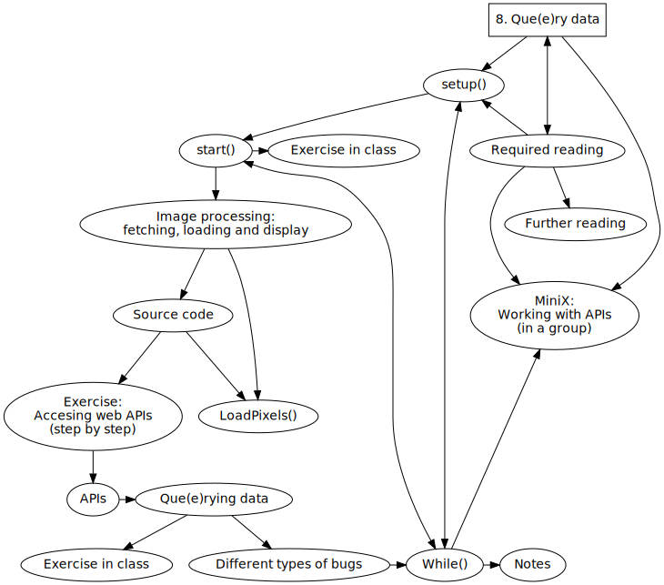
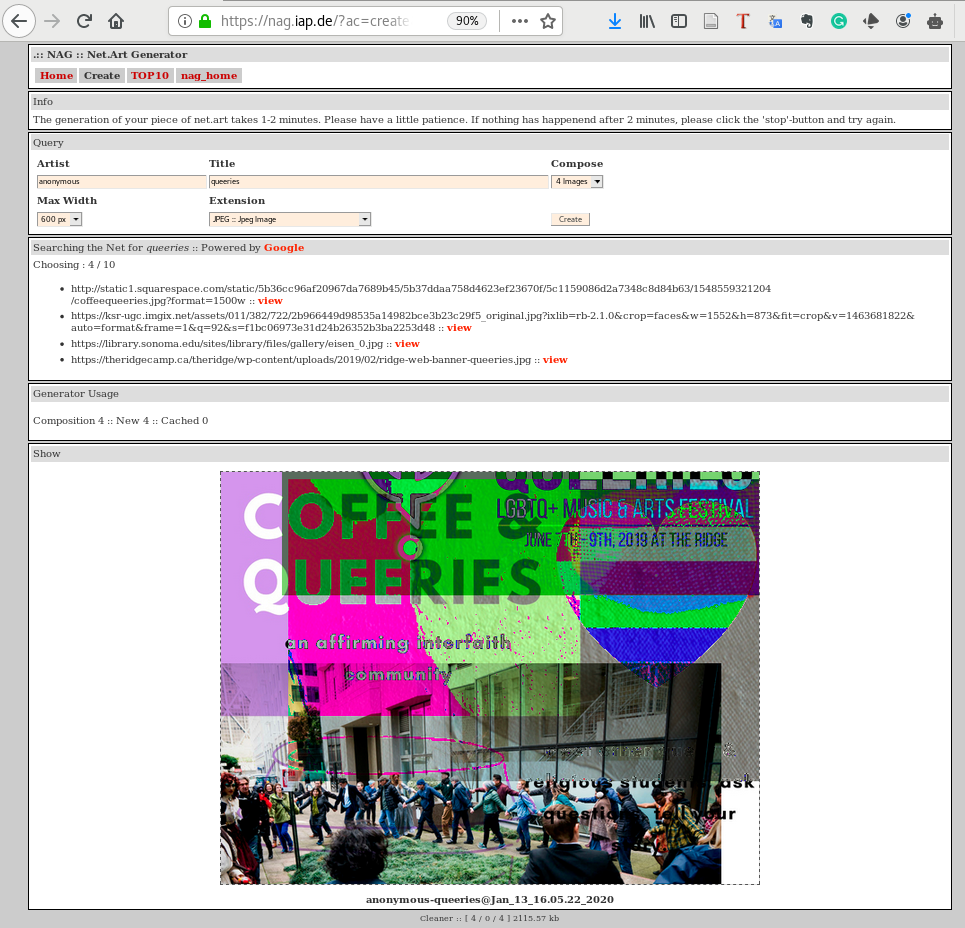
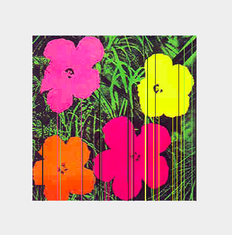
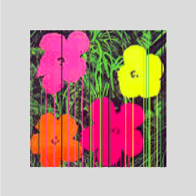
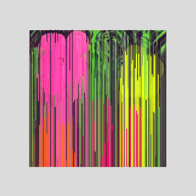
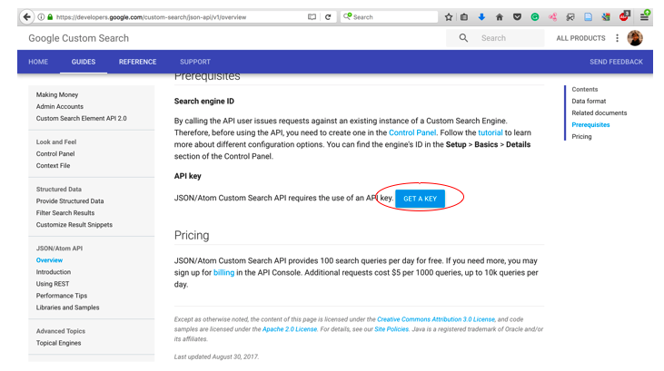
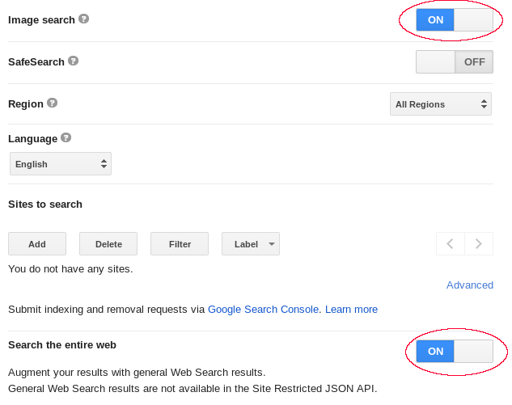
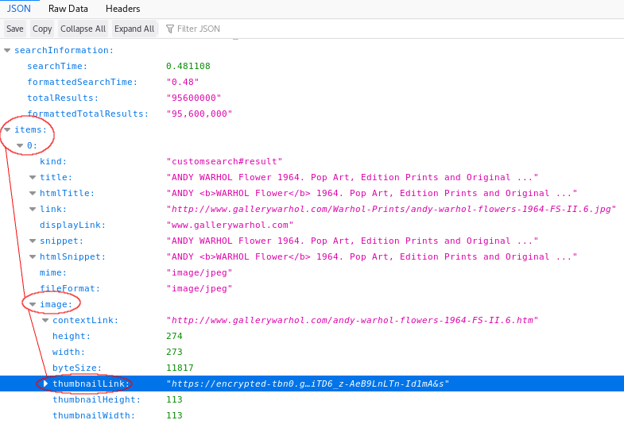
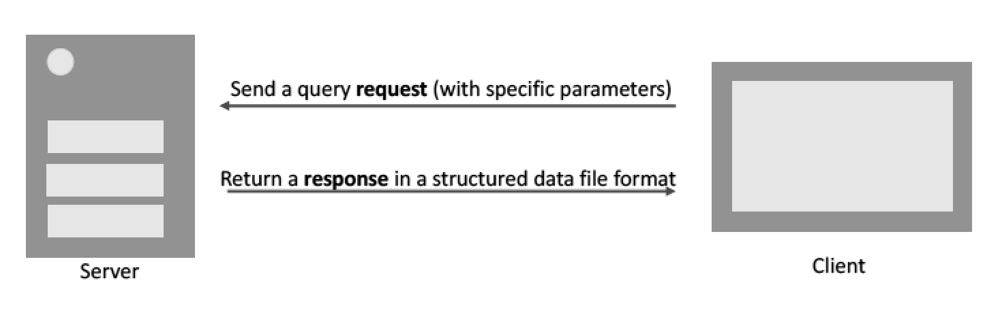
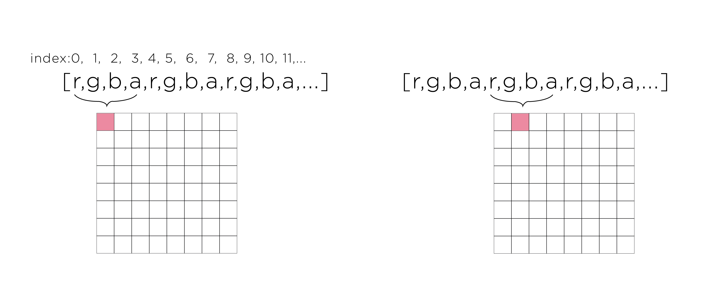

Title: 8. Que(e)ry Data
page_order: 8

## Que(e)ry Data


## setup()
To query something is to ask a question about it, to check its validity, or accuracy. When querying a database, despite the apparent simple request for data that enables selectivity with regard to which and how much data is returned, we should clearly question this operation too. We need to query the query.   

Search engines (like Google and Baidu) are a good example of applications that aggregate content and algorithmically return search results according to a keywords search. They promise to answer all our questions, but do not make the underlying processes (and ideology) visible that prioritize certain answers over others. In a query-driven society, search engines have become powerful mechanisms for truth-making and for our making sense of seemingly endless quantities of data, manifested as streams, and feeds - indicative of the oversaturation of information and the rise of the attention economy. According to Wendy Hui Kyong Chun, user habits provide the formula for big data businesses. She explains: "Through habits users become their machines: they stream, update, capture, upload, share, grind, link, verify, map, save, trash and troll."[^chun] The habit of searching, for instance, is transformed into data that is storable, traceable, and analyzable.

We have already explored some of the processes programs use to capture input data in Chapter 4, "Data Capture," especially %data% that is connected to physical devices, and in this chapter we expand this exponentially to data hosted on online platforms. We scale up from the capture of data to the storage, and analysis of massive amounts of captured data — so-called "Big Data" (or even "Big Dick Data" if we consider this to be a masculinist fantasy)[^bigdick] — which is in turn utilized for user-profiling, targeted marketing, personalized recommendations, and various sorts of predictions and e-commerce, and so on. Subsequently it would seem that: "We're not in control of our search practices – search engines are in control of us and we readily agree, though mostly unconsciously, to this domination."[^netcultures] But arguably it's not quite as deterministic as this, as these operations are part of larger socio-technical assemblages and infrastructures — including data, data structures, and human subjects — that are also constantly evolving and subject to external conditions.

To make some of these interacting entities tangible, and to offer a less-deterministic vision of %datafication%, this chapter focuses on how data can be acquired through the real-time query of an Application Programming Interface (API) — a communication protocol between different parts of a computer program intended to simplify software development. Querying data, in the form of a two-way communication process, is about information processing coupled with data selection, extraction, transmission, and presentation through "the logic of request and response,"[^api] and we will use a structured data file like %JSON% for this (introduced in the preceding chapter). Although there are many ways of addressing these issues, the following introduces a generative artwork that utilizes the Google's image search API and demonstrates querying beyond technical description to further question some of the assumptions surrounding openness and accessibility: to "que(e)ry data" in other words. The play on words indicates our desire to unsettle normative data practices that affirm stable categories of (gender) representation.

## start()

*net.art generator* (nag)[^nag] is an application that runs in a web browser to generate new images, created by artist Cornelia Sollfrank in 1997, and the latest version, 5b, was updated by Winnie Soon in 2017. The interface requires the user to enter a title which then functions as the search term, and to enter a name as the author. Sollfrank's initial idea was to "hack" a net.art competition called *Extension* by generating several hundred submission entries with fake international female artist profiles. The program that generated the entries was called *Female Extension* — an undercover example of net.art in itself — to make ironic feminist comment on the underrepresentation of female artists in the media art scene at that time.[^extension] Sollfrank not only created fictitious names, but also email addresses, phone numbers, and addresses for each applicant, along with an example of original net.art work.

This work challenges preconceptions of geeky male hacker culture, as do her earlier documentaries that interviewed fake female hackers, and the naming of the cyberfeminist group she was part of: "Old Boys Network."[^obn] Sollfrank's ironic claim that "a smart artist makes the machine do the work" (itself a hack of Lewitt's maxim, as referred in Chapter 5) has relevance here too as a clarification of "hacking the art operating system," as she puts it.[^hack]

*Female Extension* was later developed into the web application *nag* and a functional tool for generating images on the fly from available data to further question normative authorship, copyright, and some of the underlying infrastructures of artistic production. The latest version of *nag* generates images by combining the data sent from Google using the web search API. Interestingly there is a daily limit set at one hundred API requests, which means that once exceeded, users will experience a customized error page, and images can no longer be retrieved. The issue of visibility therefore shifts from a politics of representation (data on female artists) to the nonrepresentational realm of APIs, and to what extent we are granted access to hidden layers of software that queries the available data, and generates new arrangements.  



*Figure 8.1: The net.art generator web interface with the input title "queeries"*

## Exercise in class

Go to *net.art generator* (https://nag.iap.de/) and explore the generation of images and previously created images. Pay close attention to the interface and map out the relationship between user input (e.g. a title) and the corresponding output (the image). What are the processes in between the input and output? How are the images composited and generated?

## Image processing: fetching, loading and display

The following source code of this chapter is a snippet from *nag* showing the web API's request and response logic: requested data passes through a Web API and then Google returns the corresponding data using the key syntax `loadJSON()`. The major differences when using JSON between this and the previous chapter is that the JSON file is not located on your computer and created by yourself, but online. As such, the data is generated dynamically in near real-time. The JSON file has a more complex data and organizational structure.  

[RUNME](https://editor.p5js.org/siusoon/present/rhSDlokun)



*Figure 8.2: The manipulation of Warhol flowers*




*Figure 8.3: The process of pixel manipulation*

For this chapter's sample code, we will focus on images from search engine results and we will also demonstrate how to process, and display image and pixel data on screen in a manner similar to *nag*. Here are the key examples of syntax:

- `loadJSON()`:[^json] As discussed in the preceding chapter, this is the function that loads a JSON file (from a file or a URL). In this sample code, the function is used to send the web API (in the form of a URL) request, and receive the response in the JSON format. The callback function is to turn the returned data into an object: `loadJSON(request, gotData);`.

- `loadImage()`[^img1] and `image()`:[^img2] They are both used to load and display images. Data such as sound, files, images, and videos are objects that need to be loaded before they can be processed. For this sample code, we do not know the location of the file in advance, therefore this cannot be loaded by the `preload()` function. This is why the callback function is used to handle the time gap between requesting and receiving the image, e.g. `loadImage(getImg, img=> {}});`.

- `loadPixels()`:[^pixel] If you want to manipulate or analyze the data in an image, this function can extract and manipulate information on each image pixel, loading the data into the built-in `pixels[]` array. We will examine this in more detail below.

- `line()`: This is used to visualize the color extracted from the selected image's pixels.

## Source Code

```javascript
let url = "https://www.googleapis.com/customsearch/v1?";
let apikey = "INPUT YOUR OWN KEY";  //register API key here: <https://developers.google.com/custom-search/json-api/v1/overview>
let engineID = "INPUT YOUR OWN"; //https://cse.google.com/all  | create search engine, then get the searchengine ID - make sure image is on
let query = "warhol+flowers";  //search keywords
let searchType = "image";
let imgSize ="medium"; //check here: <https://developers.google.com/custom-search/json-api/v1/reference/cse/list#parameters>
let request; //full API

let getImg;
let loc;
let img_x, img_y;
let frameBorder = 25;  //each side
let imgLoaded = false;

function setup() {
	createCanvas(windowWidth,windowHeight);
	background(255);
	frameRate(10);
	fetchImage();
}

function fetchImage() {
	request = url + "key=" + apikey + "&cx=" + engineID + "&imgSize=" + imgSize + "&searchType=" + searchType + "&q=" + query;
	console.log(request);
	loadJSON(request, gotData); //this is the key syntax and line of code to make a query request and get a query response
}

function gotData(data) {
	getImg = data.items[0].image.thumbnailLink;
	console.log(getImg);
}

function draw() {
	if (getImg){ //takes time to retrieve the API data
		loadImage(getImg, img=> { //callback function
			//frame + image
			push();
			translate(width/2-img.width-frameBorder, height/2-img.height-frameBorder);
			scale(2);
			if (!imgLoaded) {
				noStroke();
				fill(220);
				rect(0, 0, img.width+frameBorder*2, img.height+frameBorder*2);
				image(img, frameBorder, frameBorder);
				imgLoaded = true;
			}else{
				//draw lines
				img.loadPixels();
				img_x = floor(random(0,img.width));
				img_y = floor(random(0,img.height));
				loc = (img_x+img_y * img.width)*4; //the formula to locate the no: x+y*width, indicating a pixel from the image on a grid (and each pixel array holds red, green, blue, and alpha values, for more see <https://www.youtube.com/watch?v=nMUMZ5YRxHI>
				strokeWeight(0.7);
				stroke(color(img.pixels[loc],img.pixels[loc + 1], img.pixels[loc+2]));  //rgb values
				line(frameBorder+img_x, frameBorder+img_y, frameBorder+img_x, frameBorder+img.height);
			}
			pop();
		});
	}
}
```

## Exercise: accessing web %APIs% (step by step)

The above source code describes how to retrieve a static image from Google's image search API (parsing JSON), and then display it on screen. As is the case with many other web APIs, you need to have an API key so the platforms can identify who is getting the data, and track its usage.[^key]

This exercise is about getting the *key ID* and *Engine ID* from Google so that you can input your own set of IDs and run the program successfully. This is essential information that enables the program to run and fetch an online image on the fly.

1. **Step 1:** Create a p5 sketch, then copy and paste the source code into your code editor (assuming you have the HTML file and the p5 library).

2. **Step 2:** Replace the API key with your own details on the line: `let apikey = "INPUT YOUR OWN KEY";`.


*Figure 8.4: Google Custom Search interface*

- Register a Google account if you don't have one (a Google account is needed in order to use the web API)
- Login to your account
- Go to [Google Custom Search](https://developers.google.com/custom-search/v1/overview)[^google1] and find the section API key
- Click the blue button "Get A Key" and then create a new project by entering your project name (e.g. "nag-test") and press enter
- You should able to see the API key and you just need to copy and paste the key into your sketch

3. **Step 3:** Replace the Search engine ID (cx) with your own, on the line: `let engineID = "INPUT YOUR OWN";`.
- Go to [Custom Search Engine](https://cse.google.com/all)[^google2]
- Click the "Add" button to add a search engine
- You can limit your search area but if you want to search all of Google, simply type "http://www.google.com"
- Enter the name of your search engine, e.g. "nag-test"
- By clicking the blue "Create" button, you agree to the terms of Service offered by Google (and you should know your rights of course)
- Go to the control panel and modify the search engine's settings
- Copy and paste the search engine ID and put it in your sketch

4. **Step 4:** Configuration in the control panel

- Make sure "Image search" is ON — blue indicates it is (see Figure 8.5)
- Make sure the "Search the entire web" is ON — blue indicates it is (see Figure 8.5)

You should now finish modifying the settings. You can now run the sample code with your own API Key and engine ID.



*Figure 8.5: Google Custom Search interface - configuring search settings*

## APIs

```javascript
let url = "https://www.googleapis.com/customsearch/v1?";
let apikey = "INPUT YOUR OWN KEY";  //register API key here: <https://developers.google.com/custom-search/json-api/v1/overview>
let engineID = "INPUT YOUR OWN"; //https://cse.google.com/all  | create search engine, then get the searchengine ID - make sure image is on
let query = "warhol+flowers";  //search keywords
let searchType = "image";
let imgSize ="medium"; //check here: <https://developers.google.com/custom-search/json-api/v1/reference/cse/list#parameters>
let request; //full API

function setup() {
	fetchImage();
}

function fetchImage() {
	request = url + "key=" + apikey + "&cx=" + engineID + "&imgSize=" + imgSize + "&searchType=" + searchType + "&q=" + query;
	console.log(request);
	loadJSON(request, gotData); //this is the key syntax and line of code to make a query request and get a query response
}

function gotData(data) {
	getImg = data.items[0].image.thumbnailLink;
	console.log(getImg);
}
```
To enable easy modification, we have set the search parameters as a global variable, which includes the required URL, API key, search engine ID, search type, image size, and query. These are the parameters used to filter the search results, and more variables can be added if required/desired.

A web API is simply a long URL `request = url + "key=" + apikey + "&cx=" + engineID + "&imgSize=" + imgSize + "&searchType=" + searchType + "&q=" + query;` that includes all the credentials as well as the items you want to search for and the necessary filters (it looks like this: <https://www.googleapis.com/customsearch/v1?key=APIKEY&cx=SEARCHID&imgSize=medium&searchType=image&q=warhol+flowers>).

The key syntax is `%loadJSON()%` (in the function `fetchImage()`) to submit a "request" in the form of a URL to the image provider after which you need to wait for the returned JSON file with a list of results. The callback function `gotData()` is to further process and %que(e)ry% the data returned.

## Que(e)rying data

Figure 8.6 below shows the JSON file format, but it includes a lot of information that you might not need. You therefore need to understand the file structure and locate the data that you want to process. Understanding the returned data file is part of the process of que(e)rying data as different providers and platforms structure their data differently.



*Figure 8.6: Web API data structure*

In the web console, look for a URL (with your own API key and search engine ID) that starts with "https" and ends with "warhol+flowers" (something like this: <https://www.googleapis.com/customsearch/v1?key=APIKEY&cx=SEARCHID&imgSize=medium&searchType=image&q=warhol+flowers>). Then simply click it and you will see how the data is structured in the JSON file format in a web browser (see Figure 8.6). There are more parameters you can set in order to select more specific forms of data such as image size, image color type, image dominant color, and so on. The API that we have used in the sample code demonstrates minimal settings.[^setting]

**Cross-Origin Resource Sharing**

In contrast to text, requesting, receiving, and loading images from a web domain (or multimedia formats such as video as well as fonts) will incur security issues, known in the field as Cross-Origin Resource Sharing (CORS). For this chapter, and in the corresponding example, the sample code is hosted on a local machine with a local server running in the ATOM code editor, but the API request, and the corresponding data is hosted elsewhere. The CORS issue related to network requests is designed to prevent "unsafe HTTP requests."[^w3] In an industry environment, it is usually configured on the web server side setting with server-side programming/scripting languages such as node.js handling the network requests. But for demonstration purposes, we have used the thumbnail images (`data.items[0].image.thumbnailLink;`) generated by the search provider instead of loading original web images hosted on various servers with a variety of settings. We simply load the images by using `createImg()` or `loadImage()`. 

**Data structure**

Figure 8.6 demonstrates how you can indicate specific data in a JSON file. There is the line `data.items[0].image.thumbnailLink;`, which gets the returned object specified (the image URL) from the JSON file. The term "data" refers to all the objects returned using the callback function `function gotData(data){}`. `items[0]` which points to the first data object (using the array concept in which the first position on the index is 0). The dot syntax allows you to navigate to the object `image` and `thumbnailLink` under `items[0]`. Note that this hierarchy is specific to this API because other web APIs might structure their data differently.

To learn more about the JSON file, you can navigate through other data objects such as "queries > request > 0" that would show, for example, how many results are found on the image search, which search terms have been processed, and how many data objects were returned. In the sample code, we start with only the top 10 search items, but you can configure the parameter `startIndex` to get the last 10 images out of 110 million. Furthermore, you can find the data for each specific image returned in the form of an array, such as the title, and the corresponding snippet of the page content under `items` in the JSON file.

We can now summarize the general process of working with web APIs and getting data from an online platform:

- Understanding the web API's workflow.
- Understanding the API specification that indicate which data and parameters are available.
- Understanding the JSON file format returned by the web API.
- Registering and getting the API key(s) and any other, additional configuration needed.

Given our specific example *nag* and the sample code, we want to also reflect on increasingly prevalent API practices. Although Google has provided the API to access the data, it should be remembered that the amount is limited to 100 free API requests for all units from business to non-profit organizations, and the actual data is collected from the public, and people have no access to the specific algorithm which selects, prioritizes, and presents the data. This raises serious questions about the degree of openness, accessibility, and inclusivity of API practices.[^soon]

<div class="exercise" markdown="true">

## Exercise in class


*Figure 8.7: The API request and response logic*

1. Referring to Figure 8.7, can you recap what has been requested and received through the web API? (Or, more conceptually, which forms of control and exchange are performed?)

2. Change your own query strings. The current keywords are "warhol flowers," but note that the program doesn't understand spaces between characters and therefore the keywords need to be written as "warhol+flowers."

3. Refer back to the section on APIs above, add more search filtering rules with [different parameters](https://developers.google.com/custom-search/v1/cse/list#parameters),[^setting] such as adding an image color type. The URL parameters are separated by an "&" symbol as follows: <https://www.googleapis.com/customsearch/v1?key=APIKEY&cx=SEARCHID&imgSize=medium&searchType=image&q=warhol+flowers>.

4. Study the JSON file and modify the sketch to get other data such as the text showing in the web console.

</div>

## LoadPixels()


*Figure 8.8: An illustration of how an image is made up of pixels*

For this sample sketch, only one color in the image will be selected and processed. This means that the program will randomly locate and pick any pixel from the image. The function `pixels` also analyzes and retrieves the color of the selected pixel, specifically the RGB color values that are used to draw the colored line on screen (see Figure 8.8 above as an illustration but in reality the pixel size is much smaller).

The colored lines (see Figures 8.2 and 8.3) are not randomly drawn, but they are based on the x and y coordinates of the pixel selected, and each line is drawn along the whole y axes from that point. Apart from the position, the color of the line is based on the RGB values of the selected pixel as well. Combining both the position and the color leads to something like a color visualization of the image, an abstract painting unfolding over time.

Each pixel selected contains color information that is the R (red), G (green), B (blue) and A (alpha) values. This is how the data is being stored in the pixels' one dimensional array:



*Figure 8.9: An illustration of the breakdown of each pixel by Integrated Digital Media, NYU*[^nyu]

`loc` is a variable for storing pixel information. Each pixel position needs to be clearly located so that a line can be drawn at the right position. Following the function `Pixels()`, each pixel takes up four locations: The first pixel with the four RGBA values, then the second pixel with another four RGBA values, and so on, and so forth:

pixels = [p1, p1, p1, p1, p2, p2, p2, p2, p3, p3, p3, p3...]

Therefore, the pixel consists of four different locations, each one storing a single value relating to a single pixel. The formula for locating a specific pixel is `loc = (img_x+img_y * img.width)*4;`. The use of `img.pixels[loc]`, `img.pixels[loc+1]`, `img.pixels[loc+2]` locates the respective RGB values using the function `pixels[]`.

```javascript
function draw() {
	if (getImg){	//takes time to retrieve the API data
		loadImage(getImg, img=> { //callback function
			//frame + image
			push();
			translate(width/2-img.width-frameBorder, height/2-img.height-frameBorder);
			scale(2);
			if (!imgLoaded) {
				noStroke();
				fill(220);
				rect(0, 0, img.width+frameBorder*2, img.height+frameBorder*2);
				image(img, frameBorder, frameBorder);
				imgLoaded = true;
			}else{
				//draw lines
				img.loadPixels();
				img_x = floor(random(0, img.width));
				img_y = floor(random(0, img.height));
				loc = (img_x+img_y * img.width)*4; // The formula to locate the number: x+y*width, indicating a pixel from the image on a grid (and each pixel array holds red, green, blue, and alpha values, for more see here: <https://www.youtube.com/watch?v=nMUMZ5YRxHI>
				strokeWeight(0.7);
				stroke(color(img.pixels[loc], img.pixels[loc + 1], img.pixels[loc+2]));  //rgb values
				line(frameBorder+img_x,frameBorder+img_y, frameBorder+img_x, frameBorder+img.height);
			}
			pop();
		});
	}
}

```
The logic in the `draw()` function is simply to try to draw the grey outer frame and load the image in the center by using the function `translate()`.

The conditional structure `if (getImg){}` is used to allow sufficient time to load the JSON file and to be able to get the file path. Upon the successful loading of an image (with the function `loadImage()` and the corresponding callback `img`), both the outer frame and the image are drawn on the canvas.

The outer frame and the image are only drawn once with the update of the status `imgLoaded`. For each frame drawn, the program will analyze the image's pixels using the syntax `loadPixels()`, picking the random pixel, and getting the corresponding pixel's x and y coordinates (using the variables `img_x` and `img_y`). It then gets the RGB color values from the pxel selected using `pixels[]`, then draws the colored line with the syntax `strokeWeight()`, `stroke()` and `line()`.

This section with the pixel and color elements shows how a computer processes and stores an image as a piece of data which is fundamentally different from how humans see and perceive it. It is also a way to demonstrate how an image object is being translated into numbers for computation, which is somewhat similar to the example of face tracking in Chapter 4, "Data Capture," in which a pixel can be located at a scale beyond human perception. These examples may help you understand contemporary applications like tracking technology and even computer vision that employs machine learning techniques in which images function as training data (we return to this in Chapter 10).

## Different types of errors

At this stage – as you have developed your programming skills and your programs are becoming more complex – it is important to understand, identify, and locate errors (as part of what is known as the debugging process[^debug]) so that you can build a workable sketch.

Paying close attention to errors is an important part of learning to program. Are you able to identify whether the errors are from your own code, or from parsing the data while it is running, or from other third parties like the image search engine when you debug your sketch? Are they minor errors or critical errors (that stop your program from running)? Are they syntactic, runtime, or logical errors (as explained below)?

Broadly speaking, there are three types of errors:

1. **Syntax errors** are problems with the syntax, also known as parsing errors. These errors — such as spelling errors or missing a closed bracket — tend to be easier to catch, and can be detected by a parser (in this case the browser).

```
SyntaxError: missing ) after argument list
```

2. **Runtime errors** happen during the execution of a program while the syntax is correct.

The web browser console is the place to understand these errors. Below shows two examples of runtime errors:

If we remove the conditional checking `if (getImg){}` within the `draw()` function, the program cannot initially load the image as it takes some time to process the web API request. The error will keep on showing in the web console until the program successfully parses the image URL.

```
p5.js says: loadImage() was expecting String for parameter #0 (zero-based index), received an empty variable instead. If not intentional, this is often a problem with scope: [https://p5js.org/examples/data-variable-scope.html] at about:srcdoc:94:6.[https://github.com/processing/p5.js/wiki/Local-server] 	
```

Wrong API key sent to the server. It is a more critial error because the program cannot extract the image and display it on the screen:

```
> p5.js says: It looks like there was a problem loading your json. Try checking if the file path is correct, or running a local server.
```

3. **Logical errors** are arguably the hardest errors to locate as they deal with logic not syntax. The code may still run perfectly, but the result is not what was expected. This indicates a discrepancy between what we think we asked the computer to do and how it actually processes the instructions.

The web console is a good place to be notified of errors or test whether the code is running as we expected. When solving errors, it is important to identify exactly where they occur, i.e. which block or line of code contains the mistake by using `console.log()`. Test and run the various parts of the program step by step, then try to identify the error types, and fix them accordingly.

## While()

The discussion of errors brings us back to what we mean by query and que(e)ries: asking whether something like data is valid or accurate, but also to questioning how it is deemed to be valid or accurate in the first place. There is a danger of self-fulfilling prophecy here unless further questions are asked about data, and the conditions of its operation. When it comes to big data, for instance, there is a tendency to think of unstructured data as raw and unmediated, whereas in practice there is always some additional information about its composition, not least derived from the means by which it was gathered in the first place. A more "forensic" approach reveals how the data was selected, preprocessed, cleaned, and so on. This is in keeping with the way that Eyal Weizman and Thomas Keenan define "forensis" as more than simply the scientific method of data-gathering or capture:

>"Forensics is, of course, not simply about science but also about the presentation of scientific findings, about science as an art of persuasion. Derived from the Latin *forensis*, the word's root refers to the 'forum,' and thus to the practices and skill of making an argument before a professional, political or legal gathering. In classical rhetoric, one such skill involved having objects address the forum. Because they do not speak for themselves, there is a need for a translation, mediation, or interpretation between the — 'language of things' — and that of people."[^forensis]

Using forensics it is possible not only to detect features or patterns in data, but also to generate new forms, new shapes, or arguments: to allow data to speak for itself — as witness in a court of law for instance — and to uncover aspects of what is not directly apparent in the material. These principles are fundamental to the work of Forensic Architecture not least (which Weizman is part of),[^FA] and the practice of forensics in this case refers to the production and presentation of architectural evidence within legal and political processes, with data offering the ability to bear witness like spoken (human) testimony. In such cases knowledge is produced in very precise ways rather than through the reductive generalizations of typical algorithms that make sense of the big data in distorted ways.

As noted in the introduction, simple operations such as search or feeds order data and reify information in ways that are clearly determined by corporate interests. The politics of this resonates with what Antoinette’s Rouvroy’s phrase "algorithmic governmentality" (the second part of which combines the terms government and rationality) to indicate how our thinking is shaped by various techniques.[^Rouvroy] According to Rouvroy, knowledge is increasingly delivered "without truth" thanks to the increasing use of machines that filter the latter using search engines that have no interest in the content as such or how knowledge is generated. The concern is that algorithms are starting to define what counts as knowledge, a further case of subjectification (the process through which we become subjects). Rouvroy claims: "The new, "truth regime," evolving in real-time, may appear "emancipatory" and "democratic" (with regards to "old" authorities, hierarchies and suspiciously rigid categories and measures), but the "subjects" it produces are "multitudes without alterity."[^Rouvroy2] This produces human subjects in relation to what algorithms understand about our intentions, gestures, behaviors, habits, opinions, or desires, through a process of aggregating massive amounts of data.[^chun] Rouvroy calls this "personalization without subjects" and identifies the mistake of focusing on concerns about personal data when what is at stake are the processes of subjectification by data mining and profiling, by means of algorithmic governmentality.

If you keep these ideas in mind Cornelia Sollfrank's project *Female Extension* (mentioned at the beginning of this chapter) becomes all the more powerful, as it  hacks the process of personalization. The male domination of the "art operating system" is tricked into believing its own liberal agenda of inclusion and yet the whole scenario is fake. When it comes to Google and its operations, we can see that although it provides its API for experimentation, it only does so under restrictions: by limiting requests and by only revealing some of the available parameters. *nag* emphasizes the querying of data, not only the execution of the data request and its response, but also by questioning how data is algorithmically structured into new normalizations. Adrian Mackenzie emphasizes the problem:

>"The more effectively the models operate in the world, the more they tend to normalize the situations in which they are entangled. This normalization can work in very different ways, but it nearly always will stem from the ways in which differences have been measured and approximated within the model."[^Mackenzie]

When working with data there is a danger of simply perpetuating "norms" through the process of generalization. Concerning advanced data-mining processes, Mackenzie speaks of the various kinds of generalization at work that allow for the development of machine learning.[^Mackenzie1] It is important to recognize how all techniques of pattern recognition and statistics "generate statements and prompt actions in relation to instances of individual desire" and they transform, construct, and impose shape on data, in order to then "discover, decide, classify, rank, cluster, recommend, label or predict" something or other.[^Mackenzie2] The assumption, as Mackenzie points out, is that everything that exists is reducible to stable and distinct categorization: "In all cases, prediction depends on classification, and classification itself presumes the existence of classes, and attributes that define membership of classes."[^Mackenzie3] This presumption of stable classes and classifications is one of the main problems that we wish to query here, as if the world was organized that way too. The difficulty lies as to what extent any model is accurate or valid.

To que(e)ry data in this way throws into further question how data is collected, stored, analyzed, recommended, ranked, selected, and curated in order to understand the broader social and political implications, not least how categorizations such as gender are normalized. To query the power structures of materials from a feminist standpoint is to understand "the mechanisms that shape reality"[^feminist] and how they might be reprogrammed.

## MiniX[8]: Working with APIs (in a group)

**Objectives:**
- To design and implement a program that utilizes web APIs.
- To learn to collaboratively code and conceptualize a program.
- To reflect upon the processes of data parsing using an API, paying attention to the registration, availability, selection, and manipulation of data.

**Get additional inspiration:**
- [Open Weather with code example](https://www.youtube.com/watch?v=ecT42O6I_WI)
- [Other weather API example with code example](https://p5js.org/examples/hello-p5-weather.html)
- [New York times with code example](https://www.youtube.com/watch?v=IMne3LY4bks&list=PLRqwX-V7Uu6a-SQiI4RtIwuOrLJGnel0r&index=9)
- [Giphy images with code example](https://www.youtube.com/watch?v=mj8_w11MvH8&index=10&list=PLRqwX-V7Uu6a-SQiI4RtIwuOrLJGnel0r)
- [Wikipedia API](https://www.youtube.com/watch?v=RPz75gcHj18)
- [Twitter API and Twitter Bot with code example](http://shiffman.net/a2z/twitter-bots/) *As far as I know Twitter has tightened the rules a lot and you need to have a solid proposal in order to get API's keys this takes weeks to achieve.*
- [Movie API with code example](https://itp.nyu.edu/classes/cc-s16/movie-api-data/)
- [Global statistic API with code example](https://itp.nyu.edu/classes/cc-s16/inqubu-global-statistics-api/)
- [Google map API](https://developers.google.com/maps/documentation/javascript/)
- [Search many other kinds of API](https://www.programmableweb.com/)

**For those APIs that require the OAuth protocol, you might need [Node.js](https://nodejs.org/en/). See what Node is [here](https://www.youtube.com/watch?v=RF5_MPSNAtU&index=1&list=PLRqwX-V7Uu6atTSxoRiVnSuOn6JHnq2yV), for 15.1 and 15.2.**

**Tasks (RUNME):**
This is a relatively complex exercise that requires you to:
- Design a program that utilizes at least one web API (think about what you want conceptually), including:
    - Finding available web APIs and the data that you want to explore.
    - Understanding the available data: the data file format and the API's specifications.
    - Deciding which data fields you want to choose to explore and experiment with.
    - Utilizing the web API and the corresponding data in your program
    (Please reserve more time if you are getting data from other platforms, as the registration process can take a long time.)

**Questions to think about (README):**
- What is the program about? Which API have you used and why?
- Can you describe and reflect on your process in this miniX in terms of acquiring, processing, using, and representing data? How much do you understand this data or what do you want to know more about? How do platform providers sort the data and give you the requested data? What are the power relations in the chosen APIs? What is the significance of APIs in digital culture?
- Try to formulate a question in relation to web APIs or querying/parsing processes that you would like to investigate further if you had more time.  

## Required reading:
- Daniel Shiffman, "Working with data, The Coding Train", available at <https://www.youtube.com/playlist?list=PLRqwX-V7Uu6a-SQiI4RtIwuOrLJGnel0r> (10.4-10.10).
- David Gauthier, Audrey Samson, Eric Snodgrass, Winnie Soon, and Magda Tyżlik-Carver, "Executing," in *Uncertain Archives*, Nanna Thylstrup, Daniela Agostinho, Annie Ring, Catherine D’Ignazio and Kristin Veel, eds. (Cambridge, MA: MIT Press, 2020).
- Eric Snodgrass and Winnie Soon, "[API practices and paradigms: Exploring the protocological parameters of APIs as key facilitators of sociotechnical forms of exchange](https://firstmonday.org/ojs/index.php/fm/article/view/9553/7721)," *First Monday* 24, no.2 (2019): n. pag. 

## Notes

[^chun]: Wendy Hui Kyong Chun, *Updating to Remain the Same: Habitual New Media* (Cambridge, MA: MIT Press, 2016).

[^bigdick]: Big data is referred to as "Big Dick Data" by Catherine D’Ignazio and Lauren Klein, to mock big data projects that are characterized by "masculinist, totalizing fantasies of world domination as enacted through data capture and analysis," see "The Numbers Don’t Speak for Themselves," in *Data Feminism* (Cambridge, MA, MIT Press 2000), 151.   

[^netcultures]: René König and Miriam Rasch, "Reflect and Act! Introduction to the Society of the Query Reader," in René König and Miriam Rasch, eds. *Society of the Query: Reflections on Web Search* (Amsterdam: The Institute of Network Cultures, 2014), <https://networkcultures.org/query/2014/04/23/reflect-and-act-introduction-to-the-society-of-the-query-reader/>.

[^api]: See Ashok K. Chandra and David Harel, "Computer Queries for Relational Data Bases," *Journal of Computer and System Sciences* 21, no.2 (1980): 156-178; Winnie Soon, *Executing Liveness: An Examination of the Live Dimension of Code Inter-actions in Software (Art) Practice*, PhD dissertation, Aarhus University (2016); Eric Snodgrass and Winnie Soon, "API practices and paradigms: Exploring the protocological parameters of APIs as key facilitators of sociotechnical forms of exchange," *First Monday* 24, no.2 (2019).

[^soon]: Snodgrass and Soon, "API Practices and Paradigms."

[^extension]: *Extension* was sponsored by the Galerie der Gegenwart (Gallery of Contemporary Art) of the Hamburger Kunsthalle (Hamburg Art Museum). Despite the disproportionate number of submissions by female artists, only male artists were selected as finalists. After the decision was announced, Sollfrank went public. Some documentation for *Female Extension* can be found at <http://www.artwarez.org/femext/index.html>.

[^obn]: Old Boys Network (OBN) is widely regarded as the first international Cyberfeminist alliance and was founded in 1997, in Berlin. See <https://www.obn.org/>.

[^hack]: Sollfrank employs Thomas Wulffen's phrase, in Cornelia Sollfrank, "Hacking the Art Operating System," interviewed by Florian Cramer, Chaos Computer Club, Berlin (2001).

[^nag]: Since 1997, there are five different versions of *nag* that have been realized by seven programmers at various stages of the project. In 2003, Version 5 started using images from Google search, but this became broken in 2015. The current version, 5b was updated in 2017 by Winnie Soon, and this is the version that officially utilized Google Image Search API according to the specification. See <http://net.art-generator.com/>.>.

[^pixel]: See the reference guide of `loadPixels()`, <https://p5js.org/reference/#/p5/loadPixels>.

[^google1]: See <https://developers.google.com/custom-search/v1/overview>.

[^google2]: See <https://cse.google.com/all>.

[^json]: See <https://p5js.org/reference/#/p5/loadJSON>.

[^img1]: See <https://p5js.org/reference/#/p5/loadImage>.

[^img2]: See <https://p5js.org/reference/#/p5/image>.

[^setting]: There are other optional parameters, see <https://developers.google.com/custom-search/json-api/v1/reference/cse/list#parameters>.

[^forensis]: Thomas Keenan and Eyal Weizman, *Mengele's Skull: The Advent of a Forensic Aesthetics* (Berlin: Sternberg Press, 2012); see also Matthew Kirschenbaum, *Mechanisms: New Media and the Forensic Imagination* (Cambridge, MA: MIT Press, 2008).

[^FA]: Forensic Architecture, directed by Eyal Weizman, is a research agency based at Goldsmiths, University of London, who undertake advanced spatial and media investigations into cases of human rights violations, with, and on behalf of, communities affected by political violence, human rights organizations, international prosecutors, environmental justice groups, and media organizations. See <https://forensic-architecture.org/>.

[^Rouvroy]: The idea of "governmentality" is derived from the work of Michel Foucault, especially his lectures at the Collège de France 1982-1983. In Rouvroy's lecture "Algorithmic Governmentalities and the End(s) of Critique" at the Institute for Network Cultures (October 2013) she makes the argument that critique is not possible without access to a fuller understanding of how knowledge is being produced.

[^Rouvroy2]: See Antoinette Rouvroy, "Technology, Virtuality and Utopia: Governmentality in an Age of Autonomic Computing," in Mireille Hildebrandt and Antoinette Rouvroy, eds., *Autonomic Computing and Transformations of Human Agency* (London: Routledge, 2011).

[^Mackenzie]: Adrian Mackenzie, "The Production of Prediction: What Does Machine Learning Want?" *European Journal of Cultural Studies* 18, nos.4-5 (2015): 442.

[^Mackenzie1]: Mackenzie, "The Production of Prediction", 431.

[^Mackenzie2]: Mackenzie, "The Production of Prediction", 432.

[^Mackenzie3]: Mackenzie, "The Production of Prediction", 433.

[^feminist]: Cornelia Sollfrank, ed. *Beautiful Warriors: Technofeminist Praxis in the Twenty-First Century* (New York: Autonomedia/Minor Compositions, 2019), 6.

[^wc]: See the recommendation of CORS by W3C, <https://www.w3.org/TR/cors/>.

[^debug]: There is a debugging tutorial was created for the p5.js contributor conference by Jason Alderman, Tega Brain, Taeyoon Choi and Luisa Pereira, see: <https://p5js.org/learn/debugging.html>

[^nyu]: A tutorial on Image Processing in p5.js, see <https://idmnyu.github.io/p5.js-image/>

[^key]: To request an API key from other image-related platforms, such as Giphy and Pexels, see <https://support.giphy.com/hc/en-us/articles/360020283431-Request-A-GIPHY-API-Key> and <https://www.pexels.com/api/>
