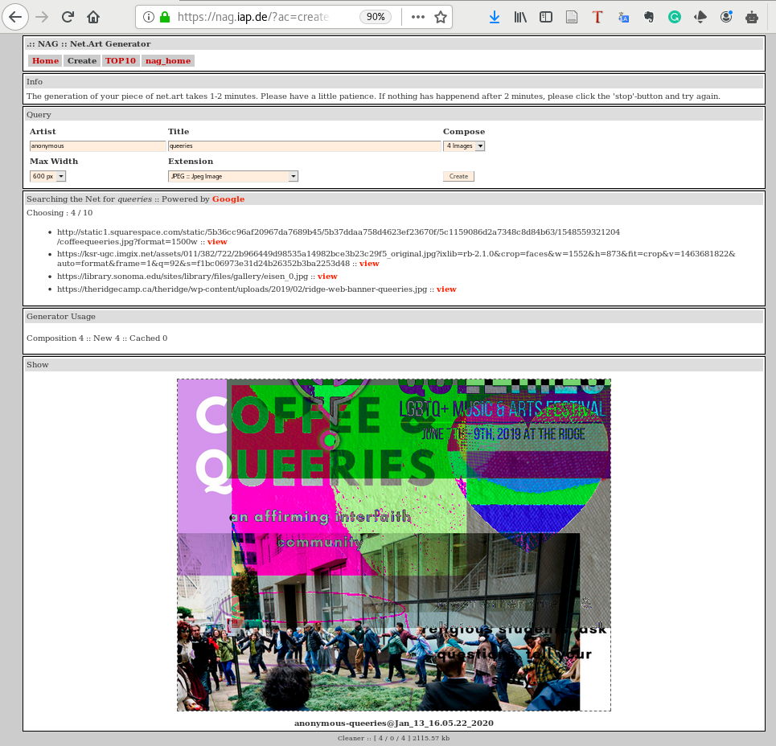

Title: 8. Que(e)ries
page_order: 8

## Que(e)ry Data
[g: how you think about the title? /w]

## setup() 
Following Chapter 4 on Data Capture, we have already explored some of the processes of how a program captures input data, especially data that is connected to physical devices. This chapter is an expansion of data processing with data that is hosted on platforms and in sheer amount in terms of quantity, extending the focus from data 'capture' to data 'accessibility' questioning power relations on data ownership and transparency.

In contemporary culture many user behavioral and user-generated content are algorithmically manifested as data streams or feeds for other people. Beyond social media, search engine is an important application to aggregate content and algorithmically returns search results accordingly to keywords search. Infinite data are stored in databases undergo a never-ending update of records. Databases have a significant impact on computational culture and it is through the storage and analysis of massive amounts of captured data (so-called 'Big Data') in which profiling, targeted marketing, personalised recommendations and various sorts of predictions and e-commerce on platforms become accelerated and perpetuated. According to Chun, user habits formulate big data businesses, and she explains, 'Through habits users become their machines: they stream, update, capture, upload, share, grind, link, verify, map, save, trash and troll' [^chun]. Browsing, searching, posting, for instance, become our habits and they are transformed from actions to data that is storable, tracable and analysable. But these databases do not only enable the storage of data but also the organisation of data and the retrieval of information over networked conditions. 

This chapter focuses on query data, in which some data can be acquired through the real-time query of an Application Programming Interface (API). Querying data, in the form a two-way communication process, is about data selection, extraction and presentation through "the logic of request and response" [^api] and in the format of structured data file like JSON as we have covered in the last chapter. There are many ways of doing it but we will, in this chapter, introduce the artwork NET ART GENERATOR that utilizes Google image search API to generate net art images, which will serve as an example to demonstrate the whole process of que(e)rying data, raising some critical questions particularly in regards to the parameters of openness and accessibility that structure knowledge sharing and production. 

## start()
net.art generator (nag)[^nag] is first conceptualized by artist Cornelia Sollfrank in 1997 and the latest version 5b is updated by Winnie Soon, which is an application runs on a web browser to create images. Back then, the initial idea was to make an intervention to the net art competition by *generating* more than 200 submission entres by international female artists. The program that generates such entries was called Female Extension, which took into the consideration of internet as material and object (that is not traditional art form turning into digital format) and made as an activist response to the art scenes and competitions in which women are always underrepresented. Female Extension was later developed into nag as a web application and a functional tool for generating images on the fly that are based on data that are readily available, questioning notions of authorship, copyright and power structures by means of automated machine generation. The latest version of nag generates images by combining the data that is sent from Google via the web search API. Howver, this is a project made with 100 free limits of API requests and that means users will experience a customized error page and images cannot be retrieved when the program exceeds the image request limit. Although the project shifts the narrative from politics of identity to politics of technology, it still continouously questioning who gets visible in, and how to get access to, the system. 

*Figure 8.1: The web interface of net.art generator with the title 'queeries'*

## Exercise in class
Go to net.art generator (https://nag.iap.de/) and explore the creation of generative images and the previously generated images. Try to base on the interface to map out the relationship between user input of title and the corresonding image out, what are the processes in between the input and output? 

## Image processing: Fetching, Loading and Display

sample code picture 

## Source Code 

## Accessing Web APIs (Step by Step) 

## Different types of errors 

## Exercise in class

## Source code 

## While()

- the brief development of why APIs is at stake
- what's making queries? 
- queer queries? 
- 
- politics of API
- appropriation and copyright
- queer queries (the code and image keyword could be 'queer')
- terms and conditions -> regulation
- operators -> selection, ranking, relevance, curation

- reference:
Sollfrank PhD thesis 

## Mini_Exercise[8]: Working with APIs in a group

**Objectives:**
- To design and implement a program that utilizes web API(s).
- To learn to code and conceptualize a program collaboratively.
- To reflect upon the processes of data parsing via API, paying attention to registration, availability/selection/manipulation of data

**Get some additional inspiration here with different APIs source code:**
- [Open Weather with code example](https://www.youtube.com/watch?v=ecT42O6I_WI)
- [Other weather API by apix with code example](https://p5js.org/examples/hello-p5-weather.html)
- [New York times with code example](https://www.youtube.com/watch?v=IMne3LY4bks&list=PLRqwX-V7Uu6a-SQiI4RtIwuOrLJGnel0r&index=9)
- [Giphy images with code example](https://www.youtube.com/watch?v=mj8_w11MvH8&index=10&list=PLRqwX-V7Uu6a-SQiI4RtIwuOrLJGnel0r)
- [Wikipedia API](https://www.youtube.com/watch?v=RPz75gcHj18)
- [Twitter API and Twitter Bot with code example](http://shiffman.net/a2z/twitter-bots/) ** As far as I know Twitter has tighten the rules a lot and you need to have a solid proposal in order to get API's keys and it will take weeks to do it.
- [Movie API with code example](https://itp.nyu.edu/classes/cc-s16/movie-api-data/)
- [Global statistic API with code example](https://itp.nyu.edu/classes/cc-s16/inqubu-global-statistics-api/)
- [Google map API](https://developers.google.com/maps/documentation/javascript/)
- [Search many other kinds of API](https://www.programmableweb.com/)

**for those APIs require OAuth protocol, you might need [Node.js](https://nodejs.org/en/). See what is Node [here](https://www.youtube.com/watch?v=RF5_MPSNAtU&index=1&list=PLRqwX-V7Uu6atTSxoRiVnSuOn6JHnq2yV) for 15.1 and 15.2**

**Tasks (RUNME):**
This is a relatively complex exercise that requires you to
  - Design a program that utilizes at least one web API (think about what you want to say conceptually), including:
    - Finding available web APIs and the data that you want to explore 
    - Understand what are the available data: the data file format and the API's specification
    - Decide which data fields you want to choose to explore and experiment
    - Utilize the web API and the corresponding data in your suggested program
    - Please reserve more time if you are getting data from other unfamiliar platforms, as the registration process can take a long time to do so.

**Questions to think about as README:**
- What is the program about? which API have you used and why?
- Can you describe and reflect on your process of making this mini exercise in terms of acquiring, processing, using and representing data? How much do you understand this provided data or what do you want to know more? How do platform providers sort the data and give you the selected data? What are the power-relationship in the chosen APIs? What's the significance of APIs in digital culture?
- Try to formulate a question in relation to web APIs or querying/parsing processes that you want to investigate further if you have more time.  

## Required reading:
- Snodgrass, Eric, & Winnie Soon. "[API practices and paradigms: Exploring the protocological parameters of APIs as key facilitators of sociotechnical forms of exchange](https://firstmonday.org/ojs/index.php/fm/article/view/9553/7721)." *First Monday* [Online], 24.2 (2019): n. pag. Web. 13 Jan. 2020 
- Daniel Shiffman, Working with data, The Coding Train, available at https://www.youtube.com/playlist?list=PLRqwX-V7Uu6a-SQiI4RtIwuOrLJGnel0r (watch 10.4-10.10)

## Further reading:
- Kirschenbaum, Matthew G. Mechanisms: New Media and the Forensic Imagination, MIT Press, 2007, 25-71.
Raetzsch, Christoph, et al. “[Weaving Seams with Data: Conceptualizing City APIs as Elements of Infrastructures.](https://journals.sagepub.com/doi/full/10.1177/2053951719827619)” Big Data & Society, Jan. 2019, doi:10.1177/2053951719827619.
- Albright, Jonathan. "[The Graph API: Key Points in the Facebook and Cambridge Analytica Debacle](https://medium.com/tow-center/the-graph-api-key-points-in-the-facebook-and-cambridge-analytica-debacle-b69fe692d747)". Medium, 2018. (check out the recent hot topic around Cambridge Analytica online)
- Bucher, Taina, “Objects of intense feeling: The case of the Twitter API”, in Computational Culture: a journal of software studies. 2013. Web. 27 Nov. 2013. http://computationalculture.net/article/objects-of-intense-feeling-the-case-of-the-twitter-api

## Notes

[^chun]: Wendy Hui Kyong Chun, *Updating to Remain the Same: Habitual New Media*, MIT Press, 2016.

[^api]: CST, Executing uncertaines + Soon (2016) + Snordgrass + Soon (2019) (to be formatted)

[^nag]: There are five different versions of nag that have been realised by seven programmers working at different stages of the project. In 2003, the version 5 has started to use images from Google search but it was broken in 2015. The current version 5b was updated in 2017 and this is the version that has officially utilized Google Image Search API according to the specification. See http://net.art-generator.com/.
