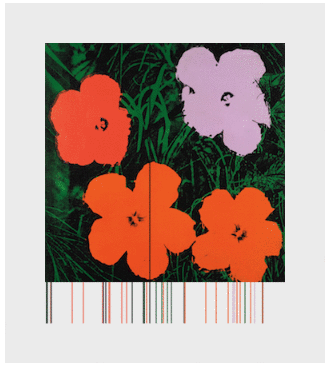
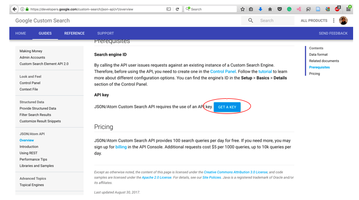
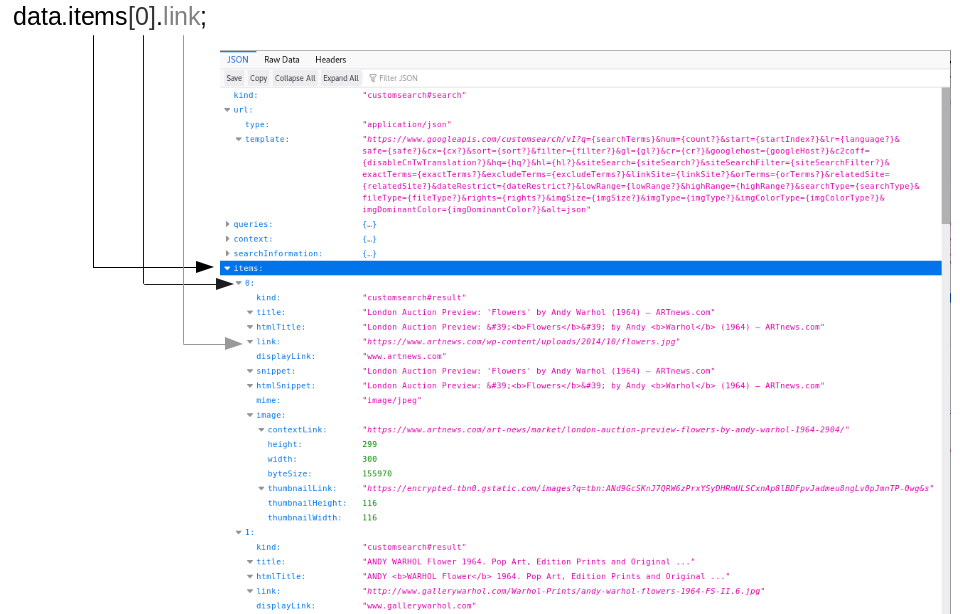
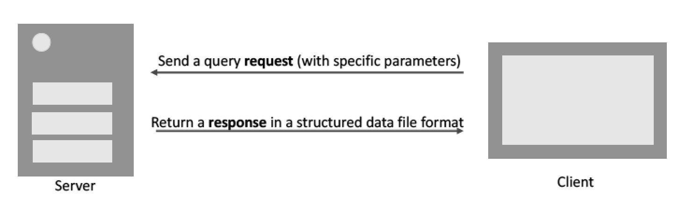

Title: 8. Que(e)ries
page_order: 8

## Que(e)ry Data
[g: how do you think about the title? /w]

## setup() 
Following Chapter 4 on Data Capture, we have already explored some of the processes of how a program captures input data, especially data that is connected to physical devices. This chapter is an expansion of data processing with data that is hosted on platforms and in sheer amount in terms of quantity, extending the focus from data 'capture' to data 'accessibility' questioning power relations on data ownership and transparency.

In contemporary culture many user behavioral and user-generated content are algorithmically manifested as data streams or feeds. Beyond social media, search engine is an important application to aggregate content and algorithmically returns search results accordingly to keywords search. Infinite data are stored in databases undergo a never-ending update of records. Databases have a significant impact on computational culture and it is through the storage and analysis of massive amounts of captured data (so-called 'Big Data') in which profiling, targeted marketing, personalised recommendations and various sorts of predictions and e-commerce on platforms become accelerated and perpetuated. According to Chun, user habits formulate big data businesses, and she explains, 'Through habits users become their machines: they stream, update, capture, upload, share, grind, link, verify, map, save, trash and troll' [^chun]. Browsing, searching, posting, for instance, become our habits and they are transformed from actions to data that is storable, tracable and analysable. But these databases do not only enable the storage of data but also the organisation of data and the retrieval of information over networked conditions. 

This chapter focuses on query data, in which some data can be acquired through the real-time query of an Application Programming Interface (API). Querying data, in the form a two-way communication process, is about information processing with the actions of data selection, extraction, transmission and presentation through "the logic of request and response" [^api] and in the format of structured data file like JSON as we have covered in the last chapter. There are many ways of doing it but we will, in this chapter, introduce the artwork NET ART GENERATOR that utilizes Google image search API to generate net art images, which will serve as an example to demonstrate the whole process of que(e)rying data, raising some critical questions particularly in regards to the parameters of openness and accessibility that structure knowledge sharing and production. 

## start()
*net.art generator* (nag)[^nag] is first conceptualized by artist Cornelia Sollfrank in 1997 and the latest version 5b is updated by Winnie Soon, which is an application runs on a web browser to create images. Back then, the initial idea was to make an intervention to the net art competition called EXTENSION by *generating* more than 200 submission entres by international female artists. The program that generates such entries was called *Female Extension*, which took into the consideration of internet as material and object (that is not traditional art form porting into any digital format) and made as an activist response to the art scenes and competitions in which women are always underrepresented. *Female Extension* was later developed into *nag* as a web application and a functional tool for generating images on the fly that are based on data that are readily available from web platforms, questioning notions of authorship, copyright and power structures by means of automated machine generation. The latest version of *nag* generates images by combining the data that is sent from Google via the web search API. However, this is a project made with 100 free limits of API requests and that means users will experience a customized error page and images cannot be retrieved when the program exceeds the image request daily limit. Although the project shifts the narrative from the politics of identity to the politics of technology, it still continouously questions who gets visible in, and how to get access to, the system. 


*Figure 8.1: The web interface of net.art generator with the title 'queeries'*

## Exercise in class
Go to net.art generator (https://nag.iap.de/) and explore the creation of generative images and the previously generated images. Try to base on the interface and map out the relationship between user input (e.g title) and the corresonding generated output (i.e images). What are the processes in between the input and output? How images are being composited and generated? 

## Image processing: Fetching, Loading and Display

In the following sample code which is a snippet of *nag* with the web API's logic of request and response. Requested data will pass via a Web API and then Google will return the corresponding data. As this sample code is focused on image, we will also demonstrate how to process and display image and pixel data on a screen in a much simplier way than *nag*. This is just the first step to get on with the que(e)y data yet the possibiliy of using the data is unlimited. Here are the key syntaxes: 

* `loadJSON()`[^json]: This is a function to load a JSON file from a file or a URL. In this specific sample code, this is used to send the web API (in the form of a URL) request and receive the response in the format of JSON. The callback function is to turn the returned data into an object. 
* `loadImage()`[^img1] and `image()`[^img2]: They both are used to load and display images. Data such as sound, files, images, videos are objects that need to be loaded before you can process them. 
* `loadPixels()`[^pixel]: If you want to manipulate or analyze the data from an image, this is the function that can extract and manipulate information of each image pixel, loading the pixel data into the pixels[] array.
* `line()`: This is used in the sample code to just visualize the particular color that is extracted from the image's pixel.

## Source Code 

```javascript 
var url = "https://www.googleapis.com/customsearch/v1?";
var apikey = "INPUT YOUR OWN KEY";  //register API key here: https://developers.google.com/custom-search/json-api/v1/overview
var engineID = "INPUT YOUR OWN"; //https://cse.google.com/all  | create search engine, then get the searchengine ID - make sure image is on
var query = "warhol+flowers";  //search keywords
var searchType = "image";
var imgSize ="medium"; //check here: https://developers.google.com/custom-search/json-api/v1/reference/cse/list#parameters
var request; //full API

var img;
var getImg;
var loc;
var img_x, img_y;
var cv;

function setup() {
	cv = createCanvas(500,450);
	centerCanvas();
	background(200,200);
	frameRate(10);
	fetchImage();
}

function centerCanvas() {
	let x = (windowWidth - width) / 2;
    let y = (windowHeight - height) / 2;
    cv.position(x, y);
}

function fetchImage() {
	request = url + "key=" + apikey + "&cx=" + engineID + "&imgSize=" + imgSize + "&q=" + query + "&searchType=" + searchType;
	console.log(request);
	loadJSON(request, gotData); //this is the key syntax and line of code to make a query request and get a query response
}

function gotData(data) {   
	getImg = data.items[0].link;  
	console.log(getImg);
}

function draw() {
  try {	//takes time to load the external image, that's why you see errors in the console.log
 		loadImage(getImg, function(img) {
		push();
		translate(width/2-img.width/2, 0);
		image(img,0,0);
		 //try to uncomment this block if you manage to get the image.
		img.loadPixels();
		img_x = floor(random(0,img.width));
		img_y = floor(random(0,img.height));
		loc = (img_x+img_y * img.width)*4; // The formular to locate the no: x+y*width, indicating which pixel of the image in a grid (and each pixel array holds red, green, blue and alpha values - 4) can see more here: https://www.youtube.com/watch?v=nMUMZ5YRxHI
		stroke(color(img.pixels[loc],img.pixels[loc + 1], img.pixels[loc+2]));  //rgb values
		line(img_x,0,img_x,height);

		pop();
  });
 }catch(error) {
    console.error(error);
 }
}

```

## Accessing Web APIs (Step by Step) 
 <br>
*Figure 8.2: The sample code with Wahol+flowers*

The above sample code is about getting a static image from Google image search API (via parsing JSON), and then displaying it on a screen. Similar to many other web APIs, you need to have an API key which the platforms can identify who is getting the data and track the usage. 
Therefore, the first thing now is to get the key ID and Engine ID from Google by providing necessary information, then the program can run and fetch a networked image on the fly. This requires you to:

* Understand the Google image search API's workflow
* Understand the API specification with what data and parameters are available
* Understand the returned JSON file format from the web API
* Able to register and use the API key and search engine ID from Google with the configuration and settings at the search console
* This is more advanced that relates to the post-production of images, and what you want to do with the data that you got.

1. **Step 1:** Create a p5 sketch, then copy and paste the source code to your code editor. (Don't forget the html file and the p5 library)

2. **Step 2:** Replace the API key with your own on the line: `var apikey = "INPUT YOUR OWN KEY";`. 


*Figure 8.3: Google Custom Search Interface*
    
- Register a Google account if you don't have one 
- Login your account 
- Go to [Google Custom Search](https://developers.google.com/custom-search/v1/overview)[^google1] and find the section API key
- Click the blue botton "Get A Key", then create a new project by entering your project name e.g "nag-test" and press the enter key.
- You should able to see the API key and you just need to copy and paste the key and put in your sketch.
    
3. **Step 3:** Replace the Search engine ID (cx) with your own on the line: `var engineID = "INPUT YOUR OWN";`.
- Go to [Cusom Search Engine](https://cse.google.com/all)[^google2]
- Click the "Add" button in adding a search engine 
- You can limit your search area but if you want to search in entire Google search, just simply type "http://www.google.com"
- Enter a name of your search engine e.g "nag-test"
- By clicking the blue "create" button, you agree to the Terms of Service that is offered by Google and you should know your rights.
- Go to the Control Panel and modify the setting of the search engine
- Copy and paste the Search engine ID and put in your sketch.  
4. **Step 4:** Configuration in the control panel
- Make sure the "Image search" is ON with the blue color 
- Make sure the "Search the entire web" is ON with the blue color

The basic configuration should be done by now. But before you run the program and test if any image display on the screen, you need to install a browser add-on to bypass CORS (Cross-Origin Resource Sharing). For security reasons, data is being restricted when it is requested from other domain (in this case is Google) which is different from the origin (in this case is your local server). In the industry environment, it is usually configured at the web server side setting but for our testing purpose we can simply install a browser add-on to bypass that. 

5. Search for "CORS" in the browser add-on site and install it. At the time of writing this book, we have used:
- [CORS Everywhere](https://addons.mozilla.org/en-US/firefox/addon/cors-everywhere/)[^cors1] on Firefox  or
- [Allow CORS](hhttps://chrome.google.com/webstore/detail/allow-cors-access-control/lhobafahddgcelffkeicbaginigeejlf)[^cors2] on Google Chrome.  

After the installation of the web browser add-on, you can try to run the program and see if any image display on the screen (turn your browser console on to observe if there might be any error messages)

## Que(e)rying data
Although you have set the key and search engine id, there are still things that you need to understand if you want to read and locate the data on your own or try to work on other web APIs to get a different set of data. 



*Figure 4: Data structure in the web API* 

In the web console, look for a URL that starts with "https" and ends with "warhol+flowers" (something like this: https://www.googleapis.com/customsearch/v1?key=APIKEY&cx=SEARCHID&imgSize=medium&q=warhol+flowers&searchType=image). Just simply click it and you will see how data is being structured in the JSON file format on a web browser. Figure 4 above is something similar to what you see on your screen. There are indeed much more parameters that you can set to select more specific forms of data such as image size, image color type and image dominant color, the API that we have used in the sample code is just to demonstrate the minimal settings[^setting].

Figure 4 demonstrates how one could point at a specific data among the whole JSON file. In our source code, we have `getImg = data.items[0].link;`, and the first parameter data is simply the returned object from the function `loadJSON()`. `items[0]` points at the first data object (using the array concept with the first index as 0). The dot syntax allows you to navigate to the `link` under `items[0]`. This is hirechary is specific to this API as other web APIs might structure their data and organization diffferently. 

To learn more about the JSON file, you can go to queries > request > 0 which shows how many results are found on Google image search, what search terms have been processed and how many data are returned. In the sample code, we only start with the top 10 search, but you can configure the field 'startIndex' to get the last 10 images out of 110 million. Furthermore, under `items` you will find the specific image data returned in the form of an array,  such as the title and the snippet of the page content

## Exercise in class


*Figure 8.5: The API's logic of request and response*

1. According to Figure 8.5, can you recap what has been requested and received through the web API? 
2. Change your own query strings: The curent keywords is warhol flowers. The program won't take space between text and therefore it is written as "warhol+flowrers"
3. Add more [different parameters](https://developers.google.com/custom-search/v1/cse/list#parameters)[^setting], such as adding image color type. (The URL parameters are seperated by a "&" sign like this: https://www.googleapis.com/customsearch/v1?key=APIKEY&cx=SEARCHID&imgSize=medium&q=warhol+flowers&searchType=image
4. Study the JSON file and modify the sketch to get other data such as the text by showing that into the web console. 
5. To process the image data and to visualize the pixel's color through lines is mainly done by below snippet of code. Think about and discuss why there is an error message in the console log: TypeError: "path is undefined".

```javascript
function draw() {
  try {	//takes time to load the external image, that's why you see errors in the console.log
 		loadImage(getImg, function(img) {
		push();
		translate(width/2-img.width/2, 0);
		image(img,0,0);
		 //try to uncomment this block if you manage to get the image.
		img.loadPixels();
		img_x = floor(random(0,img.width));
		img_y = floor(random(0,img.height));
		loc = (img_x+img_y * img.width)*4; // The formular to locate the no: x+y*width, indicating which pixel of the image in a grid (and each pixel array holds red, green, blue and alpha values - 4) 
		stroke(color(img.pixels[loc],img.pixels[loc + 1], img.pixels[loc+2]));  //rgb values
		line(img_x,0,img_x,height);

		pop();
  });
  }catch(error) {
    console.error(error);
 }
}
```

## LoadPixels()

For this sample sketch, only one color of the search image will be picked up and processed. This means that the program will randomly pick up any pixel from the image according to the x and y coordinates, and then the function of pixels can analyze and retrieve the color specifically the RGB color values that are further used to draw the line. `loc` is set as a variable to store the pixel information. Imagine an image is 5x5 pixels in terms of the dimension which is the total of 25. Each pixel position of an image needs to be clearly located so that a line can be drawn. The line is not randomly drawn but it draws along the y axes in which the pixel is randomly picked up, and this will lead to something like a pattern visualization of the image in the lines format as shown in Figure 8.2. But each pixel contains further information, that is the R (red), G (green), B (blue) and A (alpha) values:


pixels[0]:  R G B A values  </br>         
pixels[1]:  R G B A values  </br>
pixels[2]:  R G B A values  </br>
...

Therefore each pixel contains 4 values, and in order to locate specifically on the selected pixel, the formula would be: `loc = (img_x+img_y * img.width)*4;`. Then the use of `img.pixels[loc]`, `img.pixels[loc+1]`, `img.pixels[loc+2]` is to locate the RGB values respectively by using the function of pixel array `pixels[]`.

Up to here the colored line visualization is an additional element in this chapter beyond the web APis, which is to show how a computer processes and stores an image as a piece of data which is fundamentally different from how humans see and perceive it. It is also a way to demonstrate how an image object is being translated into numbers for computation, which may be similar to the face tracking in the chapter 4 - Data Capture in which a pixel can be clearly located in a very small scale beyond human reception. These machine ways of seeing may help to understand more contemporary applications like tracking technology and even computer vision with machine learning where images are regarded as training data set for generating similar drawing style of works. 

## Different types of errors 

At this stage, you have better programming skills and your program will be more complex. It is important to understand, identify and locate errors so that on the one hand you can build a workable sketch, but on the other hand, it allows us to experience how a program works at a very logical, computational and accurate manner. 

When you are debugging your sketch, can you able to identity if the errors come from your own code, or the errors from parsing the data while it is running, or the errors from other third party like Google? Are they minor errors or critical errors (that stop your program from running)? Are they belong to syntactic, runtime or logical errors? (see below) For example, if you encounter error 403 in your console with the sample code, this likely means that Google has barred your API as the requests exceed the 100 times limit per day.

In a broad sense, errors can be categorized in three types:

A. **Syntax errors**: problems with the syntax, also known as parsing errors. This kind of errors are easier to catch and can be detected by a parser (i.e the browser in this case) e.g spelling errors or missing a closed bracket
```
SyntaxError: missing ) after argument list
```
B. **Runtime errors**: It happens during the execution of a program and it can cause a program to terminate unexpectedly if an exception is not thrown while the syntax is correct. That is why it is also called exceptions. (e.g TypeError or ReferenceError in Firefox browser)
```
TypeError: Cannot read property 'indexOf' of undefined
    at e.loadImage (p5.min.js:10)
    at draw (sketch09.js:43)
    at e.d.redraw (p5.min.js:9)
    at e.<anonymous> (p5.min.js:8)
```
Exception handling is normally used to do something (or even stop the process) when the program, or more specifically a function, cannot run normally. It has a wide range of use because the syntax of `Try & Catch`[^catch] is simply to try to do something and catch the errors if any. 

In this chapter's sample code, it uses `Try` & `Catch`[^catch] exceptions so as to keep the code running in the function `draw()`. Usually a programmer possibly anticipate errors like in this case but no one knows when exactly will it occur and when will it stop. For this case, it depends on the computer and network speed to handle the API request and image loading. The use of exception handling, then, is to allow the program to "recover from errors and continue execution"[^louden]. The `catch` syntax prevents the program stops from critical errors in this case and so that the `draw()` functions can still continuously run for every frame. 

C. **Logical errors**: Arguably the hardest error to locate as it deals with logics but not syntax. The code may still run perfectly but the result is not what you expected.

The web console is a good place to be notified with errors. When countering errors, try to identify where errors might occur down to which block of code or which line of code. Then try to identify the error types and fix them accordingly. For real-time situation especially dealing with files or other input/output devices, Try/Catch/Finally/Throw exception would be useful to pose more control on the program. Of course in this specific example, if we have known the image URL before the program start we can then even program the link in the `preload()` function. However, the web API only returns the image URL in the form of a JSON file while the program is executed. No pixel information can be extracted when the program hasn't loaded the image fully. In that sense, it is necessarily to find ways to deal with this situation of both getting and then loading the image before extracting the pixel's color values.   

## While()

- the brief development of why APIs is at stake
- what's making queries? 
- queer queries? 
- 
- politics of API
- appropriation and copyright
- queer queries (the code and image keyword could be 'queer')
- terms and conditions -> regulation
- operators -> selection, ranking, relevance, curation

- reference:
Sollfrank PhD thesis 

## Mini_Exercise[8]: Working with APIs in a group

**Objectives:**
- To design and implement a program that utilizes web API(s).
- To learn to code and conceptualize a program collaboratively.
- To reflect upon the processes of data parsing via API, paying attention to registration, availability/selection/manipulation of data

**Get some additional inspiration here with different APIs source code:**
- [Open Weather with code example](https://www.youtube.com/watch?v=ecT42O6I_WI)
- [Other weather API by apix with code example](https://p5js.org/examples/hello-p5-weather.html)
- [New York times with code example](https://www.youtube.com/watch?v=IMne3LY4bks&list=PLRqwX-V7Uu6a-SQiI4RtIwuOrLJGnel0r&index=9)
- [Giphy images with code example](https://www.youtube.com/watch?v=mj8_w11MvH8&index=10&list=PLRqwX-V7Uu6a-SQiI4RtIwuOrLJGnel0r)
- [Wikipedia API](https://www.youtube.com/watch?v=RPz75gcHj18)
- [Twitter API and Twitter Bot with code example](http://shiffman.net/a2z/twitter-bots/) ** As far as I know Twitter has tighten the rules a lot and you need to have a solid proposal in order to get API's keys and it will take weeks to do it.
- [Movie API with code example](https://itp.nyu.edu/classes/cc-s16/movie-api-data/)
- [Global statistic API with code example](https://itp.nyu.edu/classes/cc-s16/inqubu-global-statistics-api/)
- [Google map API](https://developers.google.com/maps/documentation/javascript/)
- [Search many other kinds of API](https://www.programmableweb.com/)

**for those APIs require OAuth protocol, you might need [Node.js](https://nodejs.org/en/). See what is Node [here](https://www.youtube.com/watch?v=RF5_MPSNAtU&index=1&list=PLRqwX-V7Uu6atTSxoRiVnSuOn6JHnq2yV) for 15.1 and 15.2**

**Tasks (RUNME):**
This is a relatively complex exercise that requires you to
  - Design a program that utilizes at least one web API (think about what you want to say conceptually), including:
    - Finding available web APIs and the data that you want to explore 
    - Understand what are the available data: the data file format and the API's specification
    - Decide which data fields you want to choose to explore and experiment
    - Utilize the web API and the corresponding data in your suggested program
    - Please reserve more time if you are getting data from other unfamiliar platforms, as the registration process can take a long time to do so.

**Questions to think about as README:**
- What is the program about? which API have you used and why?
- Can you describe and reflect on your process of making this mini exercise in terms of acquiring, processing, using and representing data? How much do you understand this provided data or what do you want to know more? How do platform providers sort the data and give you the selected data? What are the power-relationship in the chosen APIs? What's the significance of APIs in digital culture?
- Try to formulate a question in relation to web APIs or querying/parsing processes that you want to investigate further if you have more time.  

## Required reading:
- Snodgrass, Eric, & Winnie Soon. "[API practices and paradigms: Exploring the protocological parameters of APIs as key facilitators of sociotechnical forms of exchange](https://firstmonday.org/ojs/index.php/fm/article/view/9553/7721)." *First Monday* [Online], 24.2 (2019): n. pag. Web. 13 Jan. 2020 
- Daniel Shiffman, Working with data, The Coding Train, available at https://www.youtube.com/playlist?list=PLRqwX-V7Uu6a-SQiI4RtIwuOrLJGnel0r (watch 10.4-10.10)

## Further reading:
- Kirschenbaum, Matthew G. Mechanisms: New Media and the Forensic Imagination, MIT Press, 2007, 25-71.
Raetzsch, Christoph, et al. “[Weaving Seams with Data: Conceptualizing City APIs as Elements of Infrastructures.](https://journals.sagepub.com/doi/full/10.1177/2053951719827619)” Big Data & Society, Jan. 2019, doi:10.1177/2053951719827619.
- Albright, Jonathan. "[The Graph API: Key Points in the Facebook and Cambridge Analytica Debacle](https://medium.com/tow-center/the-graph-api-key-points-in-the-facebook-and-cambridge-analytica-debacle-b69fe692d747)". Medium, 2018. (check out the recent hot topic around Cambridge Analytica online)
- Bucher, Taina, “Objects of intense feeling: The case of the Twitter API”, in Computational Culture: a journal of software studies. 2013. Web. 27 Nov. 2013. http://computationalculture.net/article/objects-of-intense-feeling-the-case-of-the-twitter-api

## Notes

[^chun]: Wendy Hui Kyong Chun, *Updating to Remain the Same: Habitual New Media*, MIT Press, 2016.

[^api]: CST, Executing uncertaines + Soon (2016) + Snordgrass + Soon (2019) (to be formatted)

[^nag]: There are five different versions of nag that have been realised by seven programmers working at different stages of the project. In 2003, the version 5 has started to use images from Google search but it was broken in 2015. The current version 5b was updated in 2017 and this is the version that has officially utilized Google Image Search API according to the specification. See http://net.art-generator.com/.

[^pixel]: See the reference guide of `loadPixels()`, https://p5js.org/reference/#/p5/loadPixels.

[^google1]: See https://developers.google.com/custom-search/v1/overview. 

[^google2]: See https://cse.google.com/all.

[^json]: See https://p5js.org/reference/#/p5/loadJSON.

[^img1]: See https://p5js.org/reference/#/p5/loadImage.

[^img2]: See https://p5js.org/reference/#/p5/image.

[^setting]: There are other optional parameters, see https://developers.google.com/custom-search/json-api/v1/reference/cse/list#parameters.

[^cors2]: See hhttps://chrome.google.com/webstore/detail/allow-cors-access-control/lhobafahddgcelffkeicbaginigeejlf. 

[^cors1]: See https://addons.mozilla.org/en-US/firefox/addon/cors-everywhere/.

[^catch]: See https://www.w3schools.com/js/js_errors.asp.

[^louden]: Louden & Lambert, 2012, pp. 432-4  (to be formatted).