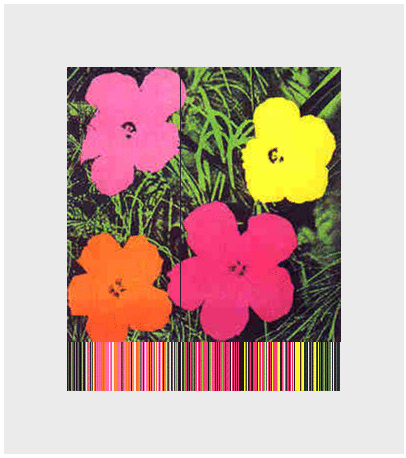

Title: 8. Que(e)ries
page_order: 8

## Que(e)ry Data

## setup()
To query something is to ask a question about it, to check its validity or accuracy. When querying a database, despite the apparent simple request for data in order to be able to be selective about what and how much data is returned, we should clearly question this operation too. We need to query the query.   

Search engines (like Google) make a good example of applications that aggregate content and algorithmically return search results according to a keywords search. They promise to answer all our questions but do not make visible the underlying processes (and ideology) that give prominance to certain answers over others. In a query-driven society, search engines have become powerful mechanisms for truth-making and for our making sense of seemingly endless amounts of data, manifested as streams and feeds - indicative of the over-saturation of information and the rise of the so-called attention-economy. According to Wendy Chun, user habits formulate big data businesses. She explains: "Through habits users become their machines: they stream, update, capture, upload, share, grind, link, verify, map, save, trash and troll".[^chun] The habit of searching, for instance, is transformed into data that is storable, tracable and analysable. 

We have already explored some of the processes by which a program captures input data in Chapter 4 (Data Capture), especially data that is connected to physical devices, and in this chapter we expand this exponentially to data hosted on online platforms. We scale up from the capture of data to the storage and analysis of massive amounts of captured data (so-called 'Big Data'); which is in turn utilized for user-profiling, targeted marketing, personalized recommendations and various sorts of predictions and e-commerce, and so on. Subsequently it would seem that: "We’re not in control of our search practices – search engines are in control of us and we readily agree, though mostly unconsciously, to this domination."[^netcultures] But arguably it's not quite as deterministic as this as these operations are part of larger socio-technical assemblages and infrastructures - including data, data structures and human subjects - that are also constantly evolving and subject to external conditions. 

To make some of these inter-acting entities tangible, and to offer a less-deterministic vision of datafication, this chapter focuses on how data can be acquired through the real-time query of an Application Programming Interface (API) - a communication protocol between different parts of a computer program intended to simplify software development. Querying data, in the form of a two-way communication process, is about information processing with the actions of data selection, extraction, transmission and presentation through "the logic of request and response",[^api] and we use a structured data file like JSON for this (introduced in the last chapter). Although there are many ways of addressing these issues, in what follows we introduce a generative artwork that utilizes the Google image search API and demonstrates querying beyond technical description to further question some of the assumptions of openness and accessibility: to *que(e)ry data* in other words. The play on words here indicates our desire to unsettle normative data practices that affirm stable categories of (gender) representation. 

## start()

*net.art generator* (nag)[^nag] - an application that runs on a web browser to generate new images - was first produced by artist Cornelia Sollfrank in 1997, and the latest version 5b has been updated by Winnie Soon in 2017. The interface requires the user to enter a title which then functions as the search term, and to enter a name as author. Sollfrank's initial idea was to 'hack' a net.art competition called *Extension* by generating several hundred submission entries with fake international female artist profiles. The program that generated the entries was called *Female Extension* - an undercover example of net.art in itself - to make ironic feminist comment on the under-representation of women artists in the media art scene at that time.[^extension] Sollfrank created not only fictitious names, but also email addresses, phone numbers, and addresses for each applicant, along with an example of original net.art work. 

Preconceptions of geeky male hacker culture are challenged in this work, as well as in earlier documentaries where fake female hackers were interviewed, further emphasized in the naming of the cyberfeminist group she was part of: "Old Boys Network".[^obn] Sollfrank's ironic claim that "a smart artist makes the machine do the work" (itself a hack of Lewitt's maxim, as referred in in Chapter ??) has relevance here too as a clarification of "hacking the art operating system", as she puts it.[^hack] 

*Female Extension* was later developed into *nag* as a web application and a functional tool for generating images from available data on the fly to further question normative authorship, copyright and some of the underlying infrastructures of artistic production. The latest version of *nag* generates images by combining the data that is sent from Google via the web search API. Interestingly there is a daily limit set at one hundred API requests, which means that once exceeded users will experience a customized error page and images can no longer be retrieved. The issue of visibility thus shifts from a politics of representation (data on female artists) to the nonrepresentational realm of APIs and to what extent we are allowed access to hidden layers of software that queries the available data and generates new arrangements.  


*Figure 8.1: The web interface of net.art generator with the title 'queeries'*

## Exercise in class

Go to *net.art generator* (https://nag.iap.de/) and explore the generation of images and previous images examples. Pay close attention to the interface and map out the relationship between user input (e.g. a title) and the corresonding output (the image). What are the processes in between the input and output? How are the images being composited and generated?

## Image processing: Fetching, Loading and Display

The following sample code is a snippet from *nag* showing the web API's logic of request and response: requested data passes via a Web API and then Google returns the corresponding data. As this sample code is focused on images, we will also demonstrate how to process and display image and pixel data on the screen in a similar manner to *nag*. This is just the first step before we  proceed with the que(e)y data yet there are many other possibilities for using the data. Here are the key examples of syntax:

* `loadJSON()`[^json]: This is a function to load a JSON file (from a file or a URL). In this specific sample code, the function is used to send the web API (in the form of a URL) request and receive the response in the format of JSON. The callback function is to turn the returned data into an object.
* `loadImage()`[^img1] and `image()`[^img2]: They both are used to load and display images. Data such as sound, files, images, videos are objects that need to be loaded before they can be processed.
* `loadPixels()`[^pixel]: If you want to manipulate or analyze the data from an image, this is a function that can extract and manipulate information of each image pixel, loading the data into the pixels[] array.
* `line()`: This is used in the sample code to visualize the particular color that is extracted from the image's pixels.

## Source Code

```javascript
let url = "https://www.googleapis.com/customsearch/v1?";
let apikey = "INPUT YOUR OWN KEY";  //register API key here to gain access to the data: https://developers.google.com/custom-search/json-api/v1/overview
let engineID = "INPUT YOUR OWN"; //https://cse.google.com/all | create search engine, then get the searchengine ID - make sure image is on
let query = "warhol+flowers";  //search keywords
let searchType = "image";
let imgSize ="medium"; //check here: https://developers.google.com/custom-search/json-api/v1/reference/cse/list#parameters
let request; //full API

let getImg;
let loc;
let img_x, img_y;
let imgCORSproxy = "https://cors-anywhere.herokuapp.com/";
let cv;

function setup() {
	cv = createCanvas(400,450);
	centerCanvas();
	background(235);
	frameRate(10);
	fetchImage();
}

function centerCanvas() {
	let x = (windowWidth - width) / 2;
    let y = (windowHeight - height) / 2;
    cv.position(x, y);
}

function fetchImage() {
	request = url + "key=" + apikey + "&cx=" + engineID + "&imgSize=" + imgSize + "&q=" + query + "&searchType=" + searchType;
	console.log(request);
	loadJSON(request, gotData); //this is the line of code that makes a query request and gets a query response
}

function gotData(data) {
	getImg = imgCORSproxy + data.items[0].link;
	console.log(getImg);
}

function draw() {
  try {	//takes time to get the path of the image from the JSON file via the web API
   loadImage(getImg, img=> { //function(img)
		push();
		let frameBorder = (width-img.width)/2;
		translate(width/2-img.width/2, frameBorder); 
		//tint(255, 0);
		image(img,0,0);
		img.loadPixels();
		img_x = floor(random(0,img.width));
		img_y = floor(random(0,img.height));
		loc = (img_x+img_y * img.width)*4; // The formula to locate the no: x+y*width, indicating which pixel of the image appears in a grid (and each pixel array holds red, green, blue and alpha values - 4). You can see more here: https://www.youtube.com/watch?v=nMUMZ5YRxHI
		stroke(color(img.pixels[loc],img.pixels[loc + 1], img.pixels[loc+2]));  //rgb color values
		line(img_x,1,img_x,height-frameBorder*2);
		pop();
   });
 }catch(error) {
    console.error(error);
 }
}

```

## Accessing Web APIs (Step by Step)

<br>
*Figure 8.2: Two Warhol+flowers with the web APIs*

The above source code describes getting a static image from Google image search API (via parsing JSON), and then displaying it on a screen. Similar to many other web APIs, you need to have an API key so the platforms can identify who is getting the data and track its usage. Hence, the next thing to do is to get the key ID and Engine ID from Google by providing all necessary information, then the program can run and fetch a networked image on the fly. This requires you to:

* Understand the Google image search API's workflow
* Understand the API specification that indicates what data and parameters are available
* Understand the returned JSON file format from the web API
* To use the Google API by first registering the API key and search engine ID, as well as configuring the search setting

1. **Step 1:** Create a p5 sketch, then copy and paste the source code to your code editor (assuming you have the html file and the p5 library).

2. **Step 2:** Replace the API key with your own details on the line: `let apikey = "INPUT YOUR OWN KEY";`.


*Figure 8.3: Google Custom Search Interface*
- Register a Google account if you don't have one
- Login to your account
- Go to [Google Custom Search](https://developers.google.com/custom-search/v1/overview)[^google1] and find the section API key
- Click the blue button "Get A Key" and then create a new project by entering your project name (e.g. "nag-test") and press the enter key
- You should able to see the API key and you just need to copy and paste the key into your sketch.

3. **Step 3:** Replace the Search engine ID (cx) with your own, on the line: `let engineID = "INPUT YOUR OWN";`.
- Go to [Custom Search Engine](https://cse.google.com/all)[^google2]
- Click the "Add" button to add a search engine
- You can limit your search area but if you want to search Google entirely, just simply type "http://www.google.com"
- Enter a name of your search engine, e.g. "nag-test"
- By clicking the blue "create" button, you agree to the Terms of Service that is offered by Google (and you should know your rights of course)
- Go to the Control Panel and modify the settings of the search engine
- Copy and paste the Search engine ID and put it in your sketch

4. **Step 4:** Configuration in the control panel
- Make sure the "Image search" is ON indicated by the blue color
- Make sure the "Search the entire web" is ON indicated by the blue color

## APIs

```javascript
let url = "https://www.googleapis.com/customsearch/v1?";
let apikey = "INPUT YOUR OWN KEY";  //register API key here: https://developers.google.com/custom-search/json-api/v1/overview
let engineID = "INPUT YOUR OWN"; //https://cse.google.com/all  | create search engine, then get the searchengine ID - make sure image is on
let query = "warhol+flowers";  //search keywords
let searchType = "image";
let imgSize ="medium"; //check here: https://developers.google.com/custom-search/json-api/v1/reference/cse/list#parameters
let request; //full API
let imgCORSproxy = "https://cors-anywhere.herokuapp.com/"; //check top comment

function setup() {
	fetchImage();
}

function fetchImage() {
	request = url + "key=" + apikey + "&cx=" + engineID + "&imgSize=" + imgSize + "&q=" + query + "&searchType=" + searchType;
	console.log(request);
	loadJSON(request, gotData); //this is the key syntax and line of code to make a query request and get a query response
}

function gotData(data) {
	getImg = imgCORSproxy + data.items[0].link;
	console.log(getImg);
}
```
In order for easy modification, we have put the search parameters as global variable, such as the required URL, API key, search engine ID, query, search type, image size. By what it means by a web API, it is simply a long URL `request = url + "key=" + apikey + "&cx=" + engineID + "&imgSize=" + imgSize + "&q=" + query + "&searchType=" + searchType;` that includes all the credentials and items that you want to search and filter (it looks like this: https://www.googleapis.com/customsearch/v1?key=APIKEY&cx=SEARCHID&imgSize=medium&q=warhol+flowers&searchType=image). 

The key syntax is `loadJSON()` (within the function `fetchImage()` to submit a `request` in the form of a URL to Google and then wait for the returned JSON file with a list of results. The function `gotData()` is to further process and que(e)ry the data that is recevied from Google.

## Que(e)rying data

Figure 8.4 below shows the JSON file format, but it includes a lot of information that you might not need. Therefore, you need to understand the file structure and locate the data that you want to further process (understanding the returned data file is part of the processing of que(e)rying data as different providers and platforms they structure their data differently).


*Figure 8.4: Data structure in the web API*

In the web console, look for a URL (with your own API key and search engine ID) that starts with "https" and ends with "warhol+flowers" (something like this: https://www.googleapis.com/customsearch/v1?key=APIKEY&cx=SEARCHID&imgSize=medium&q=warhol+flowers&searchType=image). Just simply click it and you will see how data is being structured in the JSON file format on a web browser (see Figure 8.4). You will see that there are more parameters that you can set in order to select more specific forms of data such as image size, image color type, and image dominant color, and so on. The API that we have used in the sample code demonstrates minimal settings.[^setting]

**Cross-Origin Resource Sharing**

Requesting, getting and loading images (and other multimedia forms like video and fonts) from a web domain will incure security issues, known in the field as Cross-Origin Resource Sharing (CORS). For this chapter and the corresponding example, the sample code is hosted on a local machine with a local server to run via the *ATOM* code editor, but the API request and the corresponding data is hosted outside of this. The CORS issue related to network requests is designed to prevent "unsafe HTTP requests" (^w3). In the industry environment, it is usually configured at the web server side setting, specifically with the parameter *Access-Control-Allow-Origin* that specifies how network requests can be made and shared.[^http] But for testing purposes, and convenience, we have used a proxy to bypass the issue of CORS as seen in the use of global variable `let imgCORSproxy`, yet it is important to note that this is not a long term solution because the CORS proxy is not always reliable and usually it comes with a file size limitation.[^add-on]

**Data Structure**

By adding the proxy URL in front of the image URL, it allows us to retrieve the image outside of the local server. Figure 8.4 demonstrates how one can point at specific data in the whole JSON file. Specifically, we have the line `getImg = imgCORSproxy + data.items[0].link;` and the second part of the code gets the specified returned object (the image URL) from the JSON file. The name data refers to all the returned objects via the callback function `loadJSON()`. Then `items[0]` points at the first data object (using the array concept with the first index as 0). The dot syntax allows you to navigate to the object `link` under `items[0]`. Note that this hierarchy is specific to this API as other web APIs might structure their data and its organization differently.

To learn more about the JSON file, you can navigate other data objects such as queries > request > 0 that shows, for example, how many results are found on the image search, what search terms have been processed and how many data objects are returned. In the sample code, we only start with the top 10 search items, but you can configure the parameter 'startIndex' to get the last 10 images out of 110 million. Furthermore, under `items` in the JSON file you will find the specific image data returned in the form of an array, such as the title and the corresponding snippet of the page content. Although Google has provided the API to access the data, it should be remembered that the actual data is collected from the public and people have no access to the specific algorithm by which the data is selected, prioritized and presented.

<div class="exercise" markdown="true">
## Exercise in class


*Figure 8.5: The API's logic of request and response*

You may also uncomment the line `//tint(255, 0);` to set the fill value for displaying images. In this sample code, the `tint()`[^tint] function is used to make the image transparent by including an alpha value.

1. According to Figure 8.5, can you recap what has been requested and received through the web API?
2. Change your own query strings: The current keywords are 'warhol flowers' but note that the program doesn't understand space between text and therefore it needs to be written as "warhol+flowers"
3. Add more parameters in terms of the search filter[different parameters](https://developers.google.com/custom-search/v1/cse/list#parameters)[^setting], such as adding image color type. (The URL parameters are seperated by a "&" sign like this: https://www.googleapis.com/customsearch/v1?key=APIKEY&cx=SEARCHID&imgSize=medium&q=warhol+flowers&searchType=image
4. Study the JSON file and modify the sketch to get other data such as the text by showing that onto the web console.
5. To process the image data and to visualize the pixel's color through lines is mainly done by below snippet of code. Think about and discuss why there is an error message in the web console: `TypeError: "path is undefined"`.

```javascript
function draw() {
  try {	//takes time to get the path of the image from the JSON file via the web API
    loadImage(getImg, img=> { //function(img)
		push();
		let frameBorder = (width-img.width)/2;
		translate(width/2-img.width/2, frameBorder);
		image(img,0,0);
		img.loadPixels();
		img_x = floor(random(0,img.width));
		img_y = floor(random(0,img.height));
		loc = (img_x+img_y * img.width)*4; // The formula to locate the no: x+y*width, indicating which pixel of the image in a grid (and each pixel array holds red, green, blue and alpha values)
		stroke(color(img.pixels[loc],img.pixels[loc + 1], img.pixels[loc+2])); //rgb values
		line(img_x,1,img_x,height-frameBorder*2);
		pop();
   });
 }catch(error) {
    console.error(error);
 }
}
```
</div>
## LoadPixels()


*Figure 8.6: An illustration on how an image is made up of pixels*

For this sample sketch, only one color within the image will be picked and processed. This means that the program will randomly pick any pixel from the image according to the x and y coordinates, and then the function of `pixels` will analyze and retrieve the color, specifically the RGB color values that are further used to draw the line (see Figure 8.6 above as an illustration and in reality the pixel size is much smaller). `loc` is set as a variable to store the pixel information. Imagine an image is 5x5 pixels in terms of the dimension which makes a total of 25 pixels. Each pixel position of an image needs to be clearly located so that a line can be drawn. The line is not randomly drawn but it draws along the y axes in which the pixel is randomly picked up, and this will lead to something like the visualization of the pattern of lines, as shown in Figure 8.2. But each pixel contains further information, that is the R (red), G (green), B (blue) and A (alpha) values. This is how the data is being stored in the pixels' one dimensional array:

Pixel 1: R value(location 1), G value(location 2), B value(location 3), A value(location 4)

Pixel 2: R value(location 5), G value(location 6), B value(location 7), A value(location 8) 

...

The first pixel with the 4 RGBA values, then the second pixel with another 4 RGBA values, and this continues for all the pixels. Therefore, it is understood as 4 different locations and each storing one value. In order to locate a specific pixel, the formula would be: `loc = (img_x+img_y * img.width)*4;`. The use of `img.pixels[loc]`, `img.pixels[loc+1]`, `img.pixels[loc+2]` is to locate the RGB values respectively by using the function of pixel array `pixels[]`.

This section with the pixel and color elements is to show how a computer processes and stores an image as a piece of data which is fundamentally different from how humans see and perceive it. It is also a way to demonstrate how an image object is being translated into numbers for computation, which is somewhat similar to the example of face tracking in Chapter 4 (Data Capture) in which a pixel can be clearly located at a scale beyond human perception. These machine ways of seeing may help to understand more contemporary applications like tracking technology and even computer vision that employs machine learning techniques in which images are regarded as training data.

## Different types of errors

At this stage, when you have developed your programming skills and your programs are becoming more complex, it is important to understand, identify and locate errors so that you can build a workable sketch, and to experience how a program works at a very logical, computational and accurate manner. 

Close attention to errors are an important part of learning to program. When you are debugging your sketch, are you able to identity whether the errors come from your own code, or come from parsing the data while it is running, or from other third party like Google? Are they minor errors or critical errors (that stop your program from running)? Do they belong to syntactic, runtime or logical errors (explained in detail below)? For example, if you encounter error 403 in your console with the sample code, this likely means that Google has barred your API as the requests exceed the limit of 100 times per day.

In a broad sense, errors can be categorized in three types:

A. **Syntax errors** are problems with the syntax, also known as parsing errors. These kind of errors tend to be easier to catch and can be detected by a parser (i.e. the browser in this case) such as spelling errors or missing a closed bracket.

```
SyntaxError: missing ) after argument list
```

B. **Runtime errors** happen during the execution of a program and can cause a program to terminate unexpectedly if an exception is not thrown while the syntax is correct. This is why they are also called exceptions (e.g. TypeError or ReferenceError in the Firefox browser).

```
TypeError: Cannot read property 'indexOf' of undefined
    at e.loadImage (p5.min.js:10)
    at draw (sketch09.js:43)
    at e.d.redraw (p5.min.js:9)
    at e.<anonymous> (p5.min.js:8)
```

Exception handling is normally used to do something (or even stop the process) when the program, or more specifically a function, cannot run as it should. It has a wide range of use because the syntax of `Try & Catch`[^catch] is simply to try to do something and catch the errors if there are any.

In this chapter's sample code, we use `Try` and `Catch`[^catch] exceptions to keep the code running in the function `draw()`. Usually a programmer tries to anticipate possible errors as in this case but no one knows exactly when they will occur and whether it will stop. In this case, it depends on the computer and network speed to handle the API request and image loading. The use of exception handling, then, is to allow the program to "recover from errors and continue execution".[^louden] The `catch` syntax prevents the program from stopping from critical errors in this case, and so that the `draw()` function can  continuously run for every frame.

C. **Logical errors** are arguably the hardest errors to locate as they deal with logic not syntax. The code may still run perfectly but the result is not what was expected.

The web console is a good place to be notified of errors. When countering errors, try to identify exactkly where they might occur down to which block or line of code. Then try to identify the error types and fix them accordingly. For real-time situations, especially when dealing with files or other input/output devices, Try/Catch/Finally/Throw exceptions can be useful to impose more control on the program. Of course in this specific example, if we already know the image URL before the program starts we can even program the link in the `preload()` function. However, the web API only returns the image URL in the form of a JSON file when the program is executed. No pixel information can be extracted if the program hasn't loaded the image fully. In that sense, it is necessary to find ways to deal with this situation: both getting and then loading the image before extracting the pixel's color values.   

## While()

The discussion of errors bring us back to what we mean by query and que(e)ries: asking whether something like data is valid or accurate, but also to question how it is deemed to be valid or accurate in the first place. There is a danger of self-fulfilling prophecy here unless further questions are asked about data and the conditions of its operation. In the case of big data, for instance, there is a tendency of think of unstructured data as raw and unmediated, whereas in practice there is always some additional information about its composition, not least derived from the means by which it was gathered in the first place. A more forensic approach here would reveal insights about how data is selected, preprocessed, cleaned, and so on, in keeping with the way that Eyal Weizman and Thomas Keenan define *forensis* as more than simply the scientific method of data-gathering or capture. 

"Forensics is, of course, not simply about science but also about the presentation of scientific findings, about science as an art of persuasion. Derived from the Latin forensis, the word's root refers to the 'forum', and thus to the practices and skill of making an argument before a professional, political or legal gathering. / In classical rhetoric, one such skill involved having objects address the forum. Because they do not speak for themselves, there is a need for a translation, mediation, or interpretation between the ‘language of things’ and that of people."[^forensis]

In such ways it is possible not only to detect features or patterns in data, but also to generate new forms, new shapes or arguments: to allow data to speak for itself - as witness in a court of law for instance - and to uncover aspects of what is not directly apparent in the material. These principles are foundational of the work of Forensic Architecture not least (of which Weizman is part),[^FA] and the practice of forensics in this case refers to the production and presentation of architectural evidence within legal and political processes, with data offering the ability to bear witness like spoken (human) testimony. In such cases knowledge is produced in very precise ways rather than through the reductive generalizations of typical algorithms that make sense of the big data in distorted ways. 

As already noted in the introduction, simple operations such as search or feeds order data and reify information in ways that are clearly determined by corporate interests. The politics of this resonates with what Antoniette’s Rouvroy’s phrase *algorithmic governmentality* - combining the terms government and rationality - to indicate how our thinking is shaped by various techniques.[^Rouvroy] According to Rouvroy, knowledge is increasingly delivered "without truth" through the increasing use of machines that filter it through the use of search engines that have no interest in the content as such or how knowledge is generated as such. The concern is that algorithms begin to define what counts for knowledge as a further case of subjectification (the process by which we become subjects). She claims: "The new, 'truth regime', evolving in real time, may appear 'emancipatory' and 'democratic' (with regards to 'old' authorities, hierarchies and suspiciously rigid categories and measures), but the 'subjects' it produces are 'multitudes without alterity'".[^Rouvroy2] Through such means subjects are produced in relation to what algorithms understand about our intentions, gestures, behaviours, habits, opinions, or desires to be, through a process of aggregating massive amounts of data.[^chun] She calls this "personalisation without subjects" and identifies the mistake of focussing on concerns over personal data when what is at stake is more crucially the processes of subjectification through data mining and profiling - through algorithmic governmentality. 

The highlighted projects by Cornelia Sollfrank become all the more powerful with these ideas in mind: *Female Extension* purposefully hacks the process of personalization at work, literally without a subject as they are fake; and then *nag* uses algorithmic governmentality against itself. The male domination of the 'art operating system' is tricked into believing its own liberal dogma and is amed at the numbers of female hackers. When it comes of Google, we can see that although it offers its API for experimentation it only does so under restrictions: by limiting requests and by only revealing some of its source code. *nag* emphasizes the querying of data, not only the execution of data request and response but also by questioning how data is being algorithmically structured into new normalizations. 

"The more effectively the models operate in the world, the more they tend to normalize the situations in which they are entangled. This normalization can work in very different ways, but it nearly always will stem from the ways in which differences have been measured and approximated within the model."[^Mackenzie] 

When working with data there is a danger of simply perpetuating 'norms' through the process of generalization. Following advanced data-mining processes, Adrian Mackenzie speaks of the various kinds of generalization at work that allow for the development of machine learning.[^Mackenzie1] We will return to machine learning in Chapter 10 in more detail, but for now it is important to recognize how all techniques of pattern recognition and statistics "generate statements and prompt actions in relation to instances of individual desire" and they transform, construct and impose shape on data, in order to then “discover, decide, classify, rank, cluster, recommend, label or predict” something or other.[^Mackenzie2] The assumption, as Mackenzie points out, is that everything that exists is reducible to stable and distinct categorisation: “In all cases, prediction depends on classification, and classification itself presumes the existence of classes, and attributes that define membership of classes."[^Mackenzie3] This presumption of stable classes and classifications is one of the main problems here that we wish to query - as if the world was organised in such a way. The difficulty lies as to what extent any model is accurate or valid. 

To que(e)ry data in this way throws into further question how data is collected, stored, analyzed, recommended, ranked, selected and curated in order to understand the broader social and political implications, not least how categorizations such as gender are normalized. To query the power structures of materials with a feminist standpoint is to understand "the mechanisms that shape reality"[^feminist] and how they might be recoded. 

## Mini_Exercise[8]: Working with APIs in a group

**Objectives:**
- To design and implement a program that utilizes web API(s).
- To learn to code and conceptualize a program collaboratively.
- To reflect upon the processes of data parsing via an API, paying attention to registration, availability/selection/manipulation of data.

**Get some additional inspiration here with source code from different APIs:**
- [Open Weather with code example](https://www.youtube.com/watch?v=ecT42O6I_WI)
- [Other weather API by apix with code example](https://p5js.org/examples/hello-p5-weather.html)
- [New York times with code example](https://www.youtube.com/watch?v=IMne3LY4bks&list=PLRqwX-V7Uu6a-SQiI4RtIwuOrLJGnel0r&index=9)
- [Giphy images with code example](https://www.youtube.com/watch?v=mj8_w11MvH8&index=10&list=PLRqwX-V7Uu6a-SQiI4RtIwuOrLJGnel0r)
- [Wikipedia API](https://www.youtube.com/watch?v=RPz75gcHj18)
- [Twitter API and Twitter Bot with code example](http://shiffman.net/a2z/twitter-bots/) ** As far as I know Twitter has tighten the rules a lot and you need to have a solid proposal in order to get API's keys and it will take weeks to do it.
- [Movie API with code example](https://itp.nyu.edu/classes/cc-s16/movie-api-data/)
- [Global statistic API with code example](https://itp.nyu.edu/classes/cc-s16/inqubu-global-statistics-api/)
- [Google map API](https://developers.google.com/maps/documentation/javascript/)
- [Search many other kinds of API](https://www.programmableweb.com/)

**For those APIs that require the OAuth protocol, you might need [Node.js](https://nodejs.org/en/). See what Node is [here](https://www.youtube.com/watch?v=RF5_MPSNAtU&index=1&list=PLRqwX-V7Uu6atTSxoRiVnSuOn6JHnq2yV), for 15.1 and 15.2.**

**Tasks (RUNME):**
This is a relatively complex exercise that requires you to:
- Design a program that utilizes at least one web API (think about what you want to say conceptually), including:
    - Finding available web APIs and the data that you want to explore
    - Understanding the available data: the data file format and the API's specification
    - Deciding which data fields you want to choose to explore and experiment with
    - Utilizing the web API and the corresponding data in your suggested program
    (Please reserve more time if you are getting data from other unfamiliar platforms, as the registration process can take a long time.)

**Questions to think about (for the README):**
- What is the program about? which API have you used and why?
- Can you describe and reflect on your process of making this mini exercise in terms of acquiring, processing, using and representing data? How much do you understand this data or what do you want to know more about? How do platform providers sort the data and give you the selected data? What are the power-relations in the chosen APIs? What is the significance of APIs in digital culture?
- Try to formulate a question in relation to web APIs or querying/parsing processes that you want to investigate further if you have more time.  

## Required reading:
- Snodgrass, Eric, & Winnie Soon. "[API practices and paradigms: Exploring the protocological parameters of APIs as key facilitators of sociotechnical forms of exchange](https://firstmonday.org/ojs/index.php/fm/article/view/9553/7721)." *First Monday* [Online], 24.2 (2019): n. pag. Web. 13 Jan. 2020.
- Daniel Shiffman, "Working with data, The Coding Train", available at https://www.youtube.com/playlist?list=PLRqwX-V7Uu6a-SQiI4RtIwuOrLJGnel0r (watch 10.4-10.10).

## Further reading:
- Kirschenbaum, Matthew G. Mechanisms: New Media and the Forensic Imagination, MIT Press, 2007, 25-71.
Raetzsch, Christoph, et al. “[Weaving Seams with Data: Conceptualizing City APIs as Elements of Infrastructures.](https://journals.sagepub.com/doi/full/10.1177/2053951719827619)” Big Data & Society, Jan. 2019, doi:10.1177/2053951719827619.
- Albright, Jonathan. "[The Graph API: Key Points in the Facebook and Cambridge Analytica Debacle](https://medium.com/tow-center/the-graph-api-key-points-in-the-facebook-and-cambridge-analytica-debacle-b69fe692d747)". Medium, 2018. (check out the recent hot topic around Cambridge Analytica online)
- Bucher, Taina, “Objects of intense feeling: The case of the Twitter API”, in Computational Culture: a journal of software studies. 2013. Web. 27 Nov. 2013. http://computationalculture.net/article/objects-of-intense-feeling-the-case-of-the-twitter-api

## Notes

[^chun]: Wendy Hui Kyong Chun, *Updating to Remain the Same: Habitual New Media* (Cambridge, Mass.: MIT Press, 2016).

[^netcultures]: René König and Miriam Rasch, "Reflect and Act! Introduction to the Society of the Query Reader", in René König and Miriam Rasch, eds. *Society of the Query: Reflections on Web Search* (Amsterdam: The Institute of Network Cultures, 2014), https://networkcultures.org/query/2014/04/23/reflect-and-act-introduction-to-the-society-of-the-query-reader/.

[^api]: See Winnie Soon, *Executing Liveness: An Examination of the Live Dimension of Code Inter-actions in Software (Art) Practice*. 2016. Aarhus University, PhD dissertation; Eric Snodgrass & Winnie Soon, "API practices and paradigms: Exploring the protocological parameters of APIs as key facilitators of sociotechnical forms of exchange." *First Monday* [Online], 24.2 (2019).

[^extension]: *Extension* was sponsored by Galerie der Gegenwart (Gallery of Contemporary Art) of the Hamburger Kunsthalle (Hamburg Art Museum). Despite the disproportionate number of submissions by female artists, only male artists were selected as finalists. After the decision was announced, Sollfrank went public. Some documentation of *Female Extension* can be found at http://www.artwarez.org/femext/index.html.

[^obn]: Old Boys Network (OBN) is widely regarded as the first international Cyberfeminist alliance and was founded in 1997 in Berlin. See https://www.obn.org/.

[^hack]: Sollfrank employs Thomas Wulffen's phrase, in Cornelia Sollfrank, "Hacking the Art Operating System", interviewed by Florian Cramer, Chaos Computer Club, Berlin (2001). 

[^nag]: Since 1997, there are five different versions of *nag* that have been realised by seven programmers working at different stages of the project. In 2003, the version 5 has started to use images from Google search but it was broken in 2015. The current version 5b was updated in 2017 and this is the version that has officially utilized Google Image Search API according to the specification. See http://net.art-generator.com/.

[^pixel]: See the reference guide of `loadPixels()`, https://p5js.org/reference/#/p5/loadPixels.

[^google1]: See https://developers.google.com/custom-search/v1/overview.

[^google2]: See https://cse.google.com/all.

[^json]: See https://p5js.org/reference/#/p5/loadJSON.

[^img1]: See https://p5js.org/reference/#/p5/loadImage.

[^img2]: See https://p5js.org/reference/#/p5/image.

[^setting]: There are other optional parameters, see https://developers.google.com/custom-search/json-api/v1/reference/cse/list#parameters.

[^catch]: See https://www.w3schools.com/js/js_errors.asp.

[^louden]: Kenneth C. Louden & Kenneth A. Lambert, *Programming Languages: Principles and Practice* (3rd ed.) (Boston: Cengage Learning, 2012), 432-4.

[^forensis]: Thomas Keenan & Eyal Weizman, *Mengele's Skull: The Advent of a Forensic Aesthetics* (Berlin: Sternberg Press, 2012); see also Matthew Kirschenbaum, *Mechanisms: New Media and the Forensic Imagination* (Cambridge, Mass.: MIT Press, 2008).

[^FA]: Forensic Architecture, directed by Weizman, is a research agency based at Goldsmiths, University of London, who undertake advanced spatial and media investigations into cases of human rights violations, with and on behalf of communities affected by political violence, human rights organisations, international prosecutors, environmental justice groups, and media organisations. See https://forensic-architecture.org/. 

[^Rouvroy]: The idea of governmentality is derived from the work of Michel Foucault, especially in his lectures at the Collège de France 1982-1983. In Rouvroy's lecture "Algorithmic Governmentalities and the End(s) of Critique" at the Institute for Network Cultures (October 2013) she makes the argument that critique is not possible without access to a fuller understanding of how knowledge is being produced. 

[^Rouvroy2]: See Antoinette Rouvroy, "Technology, Virtuality and Utopia: Governmentality in an Age of Autonomic Computing", in Mireille Hildebrandt and Antoinette Rouvroy, eds., *Autonomic Computing and Transformations of Human Agency* (London: Routledge, 2011).

[^Mackenzie]: Adrian Mackenzie, "The Production of Prediction: What Does Machine Learning Want?", in *European Journal of Cultural Studies*, vol 18 (4-5) (2015): 442.

[^Mackenzie1]: Mackenzie, "The Production of Prediction", 431. 

[^Mackenzie2]: Mackenzie, "The Production of Prediction", 432. 

[^Mackenzie3]: Mackenzie, "The Production of Prediction", 433. 

[^feminist]: Cornelia Sollfrank, ed. *Beautiful Warriors: Technofeminist Praxis in the Twenty-First Century* (New York: Autonomedia/Minor Compositions, 2019), 6.

[^http]: HTTP headers let the client and the server pass additional information, such as the Access-Control-Allow-Origin parameter, with an HTTP request or response. Such a configuration is critical to resource security and it is part of how networks, web browsers and code communicate with different parties. See the different values of parameters at  https://developer.mozilla.org/en-US/docs/Web/HTTP/Headers/Access-Control-Allow-Origin.

[^wc]: See the recommendation of CORS by W3C, https://www.w3.org/TR/cors/.

[^add-on]: Other than having a CORS proxy, we can also install browser add-ons to bypass the issue of CORS. Just simply search in the extension/add on site for the specific web browser with the keyword "CORS".

[^tint]: See https://p5js.org/reference/#/p5/tint.
