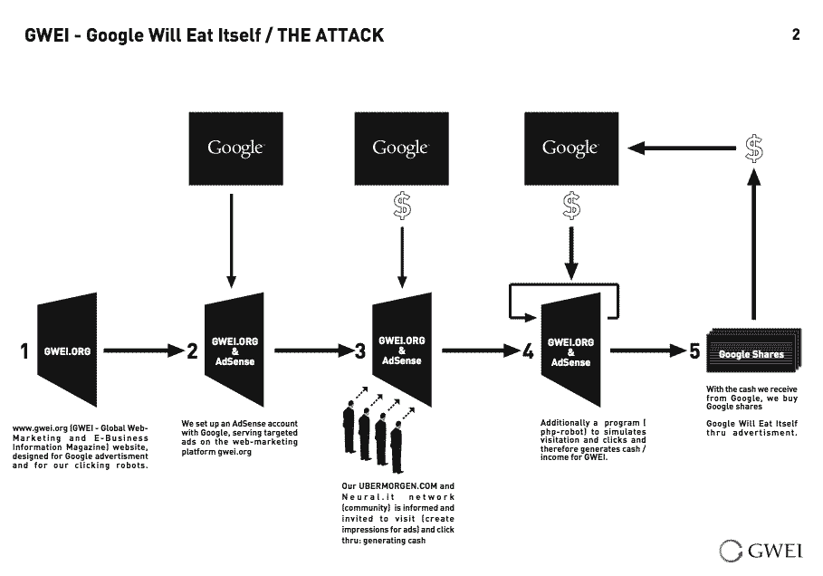
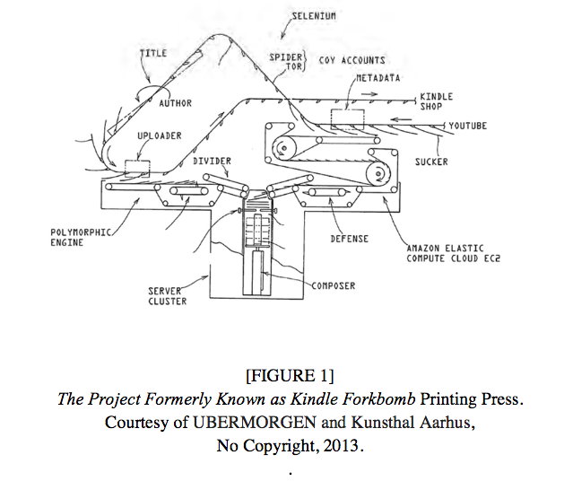

Title: 9. Algorithmic Procedures
page_order: 9

## Algorithmic Procedures

## setup()

An algorithm or recipe can also be written down in a cookbook or codebook so the actions can be shared and repeated. In *The Art of Computer Programming* (1968), Donald Knuth points to the aesthetic dimension of programming and makes an analogy to recipes in a cookbook.[^krysa] Both practices of coding and cooking share common attributes including how ingredients are selected, actions applied, and how transformations take place. Knuth's comments and indeed writing style sets the tone for this chapter in terms of subject matter but also for the way it lays out algorithmic instructions for the reader: the “procedures for reading” as he puts it. The structure of his book is algorithmic in both form and content, and here are some snippets of the playful instructions to the reader: 

> "1. Begin reading this procedure, unless you have already begun to read it. Continue to follow the steps faithfully; [...] 5. Is the subject of the chapter interesting you? If so, go to step 7; if not, go to step 6. 14. Are you tired? If not, go back to step 7; 15. Go to sleep. Then, wake up, and go back to step 7."[^knuth]

The example serves to emphasize that we tend to follow instructions faithfully. But we might also observe that algorithms are more than simply steps and procedural operations as there are wider cultural and political implications, not least in terms of whether we decide to interpret them on our own terms. In this sense, like cooking, algorithms express cultural differences and matters of taste, even aesthetics. Extending his analogy to recipes in a cookbook to other cultural practices, Knuth quotes Ada Lovelace: “The process of preparing computer programs for a digital computer is especially attractive, not only because it can be economically and scientifically rewarding, but also because it can be an aesthetic experience much like composing poetry or music.”[^knuth2] 

In this chapter we discuss some of these recipe-like algorithmic procedures and how they describe the steps and operations of a program, and less about the syntax of code as has mainly been the case in previous chapters. An algorithm is different from lines of code in that it is not dependent on specific software and libraries. It is simply a process or set of rules to be followed in calculations or other problem-solving operations especially by a computer.[^algo] An algorithm is a skeleton of how a program operates and shows the operational steps which, ideally, can be implemented by any Turing-complete programming language (as discussed briefly in chapter ??). In other words, an algorithm demonstrates the systematic breakdown of procedural operations to describe how an operation moves from one step to another progressively. It’s only like a recipe in a general sense in that it is a set of step by step instructions, but the analogy only goes so far as recipes lack the exactness and reproducibility of Turing-completeness.

## start()

In chapter 3 (Infinite Loops) we briefly introduced the computational diagram that was drafted by Ada Lovelace in 1842, often referred to the world's first computer program.[^first] The published diagram and Lovelace's extensive notes demonstrate the sophisticated step by step sequence of operations for solving mathematical problems. The instructions are executed by a machine automatically. As she puts it, "I want to put something about Bernoulli’s numbers, in one of my Notes, as an example of how the implicit function may be worked out by the engine without human head & hands first. Give me the necessary formulae."[^ada2] The formulae are expanded as algorithmic procedures in the diagram. In this chapter we build on ‘diagramming’, especially in the use of flowcharts to elaborate the practical and conceptual aspects of algorithmic procedures.

Flowcharts are considered to be a fundamental explanatory tool since the early days of computer programming. One of the common uses is to illustrate computational operations and data processing for programming by "converting the numerical method into a series of steps".[^Ferranti] But flowcharts can also be considered to be representational diagrams which can be also used for communicating the complex logic between programmers and organizational units. This is good practice of course, especially for beginners in a learning context, and essential for communicating ideas in ways that can be easily understood by others. Indeed programming is not necessarily a solitary activity,[^stereotype] but a social and communicative practice that can expose relations exemplified by diagramming. Moreover most software applications are not developed by a single developer but are organized into tasks that are divided into different components that are shared by others, as for instance in maintaining or debugging a program made by someone else. The collaborative workflow lends itself to a flowchart as well. 

## Discussion in class

- Can you give an everyday example, with details of (computational) logic, about an algorithm that you have used or experienced?

- Can you sketch an algorithic procedure such as how your social media feeds are being organized?

- Based on the assigned reading from Taina Bucher, can you list some of the properties of algorithms? How is it both technical and social?

- We discussed rule-based systems in Chapter 6 (Auto Generator), how is that different from the way we are discussing procedure in this chapter?

## Flow Charts

Conventionally, each step in a flowchart is represented by a symbol and connecting lines that guide the flow of logic progressively towards a certain output. The symbols that are used are shapes and each one carries a different meaning. Below we outline the basic components of drawing a typical flowchart:

- **Oval**: Indicates the start or end point of a program/system. (But this requires further refection on whether all programs have an end.)
- **Rectangle**: Represents the processual steps.
- **Diamond**: Indicates the decision points with yes and no branches.
- **Arrow**: Acts as a connector to show the relationship and sequence, but sometimes an arrow might be returned to a previous process, especially when showing repetition and loops.

As we have studied the program *Vocable Code* in Chapter 7, Figure 9.1 below shows the corresponding flowchart, a different representation of the program. The original idea is to demonstrate the high level logic and sequences, and to elaborate the details of this in plain English. This flowchart uses symbols, lines and text to communicate with a wider audience such as the readers oif this book.


*Figure 9.1: The flow chart of Vocable Code by Winnie Soon, graphic design by Anders Visti*

Indeed flowcharts are used across many disciplines, both technical and in the arts, for example it is relatively common to use them in the business sector to understand and communicate how different processes or workflows are organized for efficiency. In philosophy, diagrams have been used to produce new kinds of thinking, what Deleuze and Guattari refer to as an "abstract machine",[^Guattari] as a material assemblage of relations (and we will return to these issues in more detail at the end of the chapter). Similarly, in our past teaching, we have used flowcharts as a means to deconstruct written texts as well as to break down an argument and structure, as as a way to formulate ideas for new essays. It is a tool, or rather machine, that helps to think through different procedures and processes, and this approach has self-evidently informed our use of a flowchart to introduce each chapter of this book.  

In the chapter's mini exercise, you are asked to produce a flowchart collaboratively for a new project idea. This comes at this stage of the book as you are probably more confident in building a more complex program that incorporates different types of syntax. We have found that one of the difficulties of this is commonly how to combine and link various functions and to break down a task into smaller sequential steps. We think a flowchart can be used as an effective means to formulate ideas, generate discussion, to predict technical challenges, and to set a direction for working together on a project. If tasks need to be divided within a group for instance, flowcharts can be used to identify how a smaller task can be linked to others without losing site of the larger purpose.

To turn an existing program into a flowchart, some challenges might be:
1. To translate programming syntax and functions into understandable plain language.
2. To decide the level of detail to show the important operations that allow other people to understand the logic of your program.

## Exercise in class

Let's start with something that appears to be relatively simple. Draw a flowchart based on the program code below:

```javascript
function setup() {
  var sometext = ['h','e','l','l','o'];
  for (var i=0;i<sometext.length; i++) {
    console.log(sometext[i]);
  }
}

/*output
h
e
l
l
o
*/

```

## Discussion

In our previous experience of this class exercise,[^ex] different results were produced and this becomes an excellent way to begin to discuss the use of flowcharts. We have selected some of Nathan Ensmenger's reflections from his article "The Multiple Meanings of a Flowchart" to spark discussion here: "To view the computer flowchart as having only one purpose is narrow and misleading, [because] every flowchart had multiple meanings and served several purposes simultaneously"; "Flowcharts allow us to 'see' software in ways that are otherwise impossible."[^Ensmenger] 

## Flowcharts as diagramming practice

Beyond the more practical use of flowcharts to help with the development of software and in terms of peadgogy, they can also be artistic objects in their own right, as a "meta-medium for an aesthetics of social complexity" as Paolo Cirio puts it.[^Cirio] An earlier example from 2005, by Cirio in collaboration with Alessandro Ludovico and UBERMORGEN, is *Google Will Eat Itself*,[^GWEI] an artwork to auto-generate revenue by hacking the Google 'AdSense' initiative.[^pold] The project automatically triggers advertising clicks on websites in order to receive micropayments from Google to then buy shares in Google: "We buy Google via their own advertisment! Google eats itself - but in the end 'we' own it!"   



*Figure 9.2: GWEI - Google Will Eat Itself / THE ATTACK (2005)*

The iterative loop can be clearly seen in the diagram and echoes the principle of the 'strange loop': forced "to eat its own tail" in Babbage's words, altering its own stored program and thus offering the potential to generate new technical and aesthetic forms (already mentioned in chapter ??, with reference to the operations of Babbage's Analytical Engine). Taken to its extreme, a 'forkbomb' is a term used in computing to describe a denial-of-service attack in which a computer process continuously replicates itself to deplete available system resources, slowing down or crashing the system due to resource starvation. Reflected in the title of another project, UBERMORGEN's *The Project Formerly Known as Kindle Forkbomb* (2012), used a machine process that stripped comments from YouTube videos: an algorithm compiled the comments and added titles producing an e-book which was then uploaded to the Amazon Kindle e-commerce bookstore.[^pold] This can be seen in the diagram by the re-use of an image of a traditional printing press (Figure 9.3), and further exploited in the combination of diagram and physical books in the installation version (Figure 9.4). What is made apparent in both cases are the algorithmic procedures in operation and both mimics and mocks Amazon's post-Gutengerg e-book production and 'diagrams' their cannibalistic business model, the key principles of which are outlined on the Kindle website: "Get to market fast; Make more money. Keep control."[^kindle] 



*Figure 9.3: The Project Formerly Known as Kindle Forkbomb. Courtesy of UBERMORGEN and Kunsthal Aarhus, No Copyright (2012)*
[do you have a better picture/higher resolution of this? /w Yes I think so and it would be good to use an installation shot too. I will check. /G]

 [place installation shot here /g]

*Figure 9.4: The Project Formerly Known as Kindle Forkbomb, installation view, at Kunsthal Aarhus, as part of the exhibition ?? curated by Joasia Krysa. Courtesy of UBERMORGEN and Kunsthal Aarhus, No Copyright (2013)*

## While()

The shift of critical attention in software studies from source code to the operations of algorithms reflects the broader rise of big data and machine learning (which we will continue with in the next chapter). Algorithms in this sense are there to transform, construct and shape data, in order to then classify, rank, cluster, recommend, label or even predict things. The concern is not in how to build an efficient or optimized algorithm, but to understand these operative dimensions. In *If... Then: Algorithmic Power and Politics*, Taina Bucher stresses that they are “fundamentally productive of new ways of ordering the world".[^bucher] So although the concept of algorithm is associated the disciplines of mathematics and computer science, the wider cultural field has taken an interest in algorithms to explore the political consequences of procedural operations. 

In *What Algorithms Want*, Ed Finn explores the concept of algorithm as a 'culture machine' and argues that an algorithm "operates both within and beyond the reflexive barrier of effective computability, producing culture at a macro-social level at the same time as it produces cultural objects, processes, and experiences."[^fin] It becomes clear that algorithmic procedures play an important role in organizing culture, and subjectivities, and it is not very easy to see through or describe them because they operate beyond what we see and experience directly. They produce wider effects in the ordering of life, more so even than a cooking recipe. Algorithms do things in the world and with real effects for machines and humans.

“Algorithms act, but they do so as part of an ill-defined network of actions upon actions, part of a complex of power-knowledge relations, in which unintended consequences, like the side effects of a program’s behavior, can become critically important. Certainly the formal quality of the algorithm as a logically consistent construction bears with it an enormous power – particularly in a techno-scientific universe – but there is sufficient equivocation about the purely formal nature of this construct to allow us to understand that there is more to the algorithm than logically consistent form.”[^goffey] 

In “Thinking Critically About and Researching Algorithms”, Rob Kitchin explains how Facebook’s EdgeRank works in tandem with each users’ inputs, ordering the results in personalized ways. These operations are not fixed but are contextual and fluid,[^Kitchin] part of larger socio-technical assemblages and infrastructures that are also constantly evolving and subject to variable conditions. As such, although they appear to be act somewhat autonomously, algorithms need to be understood as “relational, contingent and contextual” entities.[^Kitchin2] Diagrams such as the ones above might be used to help understand how algorithms act as part of broader ecologies in order to then understand their sense of agency and power.

The diagrams that we have introduced in this chapter give form to this, and how apparently simple operations such as search or feeds (Facebook’s EdgeRank or Google’s PageRank) order data and reify information in ways that are determined by particular instances of power. Matteo Pasquinelli’s essay "Google’s PageRank Algorithm: A Diagram of the Cognitive Capitalism and the Rentier of the Common Intellect" provides more detail here in its close examination of the politics of PageRank, the hypertextual algorithm that calculates the importance of a given web page and its hierarchical position within the search engine results.[^Pasquinelli] His key point is that the algorithm reverses the centralized panopticon model of surveillance and control, and instead offers a bio-political machine that captures time and living labour through dataveillance. That it is broadly based on citation indexes further emphasizes its relevance for this book (or any academic book) and how value is produced through the quality of links (much like the attention value produced through social media's likes and friends, or through the metrification of research outputs of academics), new forms of surplus value. The algorithm a 'value machine' according to Pasquinelli, and in this sense an 'abstract machine' or diagram. 

But what is a diagram? Leaving aside the uses of diagrams as functional tools, or for didactic purposes that tend to simplify information (infographics is a case in point), they also feature as a form of expanded aesthetic practice as we hope our examples have somewhat demonstrated. In this chapter we have tried to to reflect these practices in our use of flowcharts as an experimental form. We already mentioned the idea of the diagram as an *abstract machine* in the introduction, and this is the phrase that Deleuze and Guattari use to reflect that matter and form is able to transform itself: abstract machines exhibit *morphogenesis* - a term that we also know from Turing (in chapter ?? - auto-generation). Diagrams instantiate future possibilities in this way that are not predetermined but open-ended and speculative fictions.[^deleuze] Such descriptions might sound themselves to be very abstract but the overall point is clear and scientific (following thermodynamics) in that there are morphogenetic possibilities in things, and systems are continuously traversed by flows (vectors) of energy and matter that do not cancel differences but instead maintain *differences*. What we end up with are speculative geometries, self-organizing forms, and diagrammatic processes that reflect dynamic forces. The diagram is an “image of thought”, in which thinking does not consist of problem-solving but on the contrary, *problem-posing*. We want to point to these distinctive qualities in this chapter somewhat at odds to conventional descriptions of algorithmic procedures. 

Figure ??. Dean Kenning - Jackson 5 flowchart.[^jackson5]

But can we really think about flowcharts in similar terms to diagrams and abstract machines? The broad similarity we would claim is the ability to visualize problems and think them through in the process of that very visualization, a “picturing of thought” as Deleuze would have it. In his “On the Diagram (and a Practice of Diagrammatics)”, Simon O’Sullivan provides a summary of this speculative approach:
“The diagram here is a strategy of experimentation that scrambles narrative, figuration - the givens - and allows something else, at last, to step forward. This is the production of the unknown from within the known, the unseen from within the seen. The diagram, we might say, is a strategy for sidestepping intention from within intention; it involves the production of something that then ‘speaks back’ to its progenitor.”[^osullivan]     

Although referring to the practice of drawing rather than programming, we might hope for something similar in the way that abstraction is invoked and the way that previously hidden aspects of programming might be “pictured” in flowcharts. Like diagramming perhaps, programming might be thought of as an abstract machine that does not function to merely represent, but rather constructs a real that is yet to come. As we discussed in previous chapters, programming is a form of abstraction that requires the selection of important details in which the implementation embodies the programmers' thinking and decision-making processes, and in addition algorithms themselves are decision-making machines that are full of emergent and reactive, even predictive potential.[^osullivan2] 

We might follow this line of discussion in relation to the predictive practices of machine learning more specifically, and it is important to note that Adrian Mackenzie too, in his *Machine Learners*, uses diagrams as an experiment in critical thinking to address the operations of machine learning. We propose something similar with flowcharts. Mackenzie explains that when it comes to machine learning, “coding changes from what we might call symbolic logical diagrams to statistical algorithmic diagrams.” (23) He is relying on (and directly quoting) Deleuze’s suggestion that diagrams act "as a display of the relation between forces that constitute power [...] the diagram or abstract machine is the map of relations between forces, a map of destiny, or intensity."[^ML2] We will continue this topic in the next chapter but for now we might stress that analysing algorithms or source code for that matter is not particularly revealing in itself, unless the wider assemblage of relations are exposed. 

## Mini_Exercise[9]

**Objective:**

- To acquire the ability to decompose/break down a computer program into its definable parts and relations
- To organize and structure a computer program through a flowchart
- To understand flowchart as a means for communication and planning, and tool for critical thinking
- To understand the concept of algorithms from both computer science and cultural perspectives

**Tasks:**

Individual:
* Revisit your previous mini exercises and select the most technically complex one
* Draw an individual flowchart to present the program (pay attention to which items you select to present through a flowchart)

Group:
* Brainstorm two ideas for your final project
* Draw two flow charts to visualize the algorithmic processes of this project

**Questions to think about for the README:**
- What are the challenges between simplicity at the level of communication and complexity at the level of algorithmic procedure?
- What are the technical challenges for the two ideas and how are you going to address them?
- What is the value of the individual and the group flowchart that you have produced?

## Required reading

- Ensmenger, Nathan. "The Multiple Meanings of a Flowchart." *Information & Culture: A Journal of History*, vol. 51 no. 3, 2016, pp. 321-351. Project MUSE, doi:10.1353/lac.2016.0013
- Taina Bucher, Taina. "The Multiplicity of Algorithimcs" in *If...Then: Algorithmic Power and Politics* (Oxford: Oxford University Press, 2018), 19-40.
- Marcus du Sautoy, The Secret Rules of Modern Living: Algorithms - Clips, *BBC Four* (2015), https://www.bbc.co.uk/programmes/p030s6b3/clips.

## Further reading

- Ed Finn, “What is an Algorithm,” in *What Algorithms Want* (Cambridge, MA: MIT Press, 2017), 15-56.
- Daniel Shiffman, [Multiple js Files - p5.js Tutorial](https://www.youtube.com/watch?v=Yk18ZKvXBj4), The Coding Train. Web.https://www.youtube.com/watch?v=Yk18ZKvXBj4.
Andrew Goffey, "Algorithm", in Matthew Fuller, ed., *Software Studies: A Lexicon* (Cambridge, MA: MIT Press, 2008), 15-20.

## Notes

[^krysa]: The analogy of algorithms to recipes is developed in Joasia Krysa and Grzesiek Sedek's' "Source Code" entry to *Software Studies: A Lexicon*, 236-243. The analogy can also be found in recent texts, for instance: Ed Finn, *What Algorithms Want: Imagination in the Age of Computing* (Cambridge, MA: MIT Press, 2017), 17; and Taina Bucher, *If...Then: Algorithmic Power and Politics* (Oxford: Oxford University Press, 2018), 21.

[^knuth]: Knuth, *The Art of Computer Programming*, xv-xvi. 

[^bucher]: Bucher, *If...Then: Algorithmic Power and Politics*, 20.

[^algo]: The term 'algorithm' has a historical relation to 'algorism' as the process of doing arithmetic using Arabic numerals (originating from the title of the book Kitab al jabr w'al-muqabala (Rules of restoration and reduction) written by the Persian author Abu Ja'far Mohammed ibn Musa al-Khowarizmi (c. 825).  

[^knuth2]: Knuth, *The Art of Computer Programming*, v.

[^first]: In particular to the complexity of the diagram for calculating Bernoulli numbers that includes the grouping of operations, the invention of the loop concept (repetition and cycle in Lovelace's term), the manipulation of symbols and variables in accordance with rules. Although such an algorithm was designed to be used in mechanical caluclating machines, Babbage Analytical Engine is conceptually close to a modern computer at the time as it was envisioned that it could do other things, such as music, beyond number calculation. See Menabrea, Luigi Federico, and Ada Lovelace. *Sketch of the analytical engine invented by Charles Babbage* (1842), 694. 

[^ada2]: Lovelace Papers, Bodleian Library, Oxford University, 42, folio 12 (6 Feb 1841), as quoted and cited in Dorothy Stein, ed., "This First Child of Mine", in *Ada: A Life and a Legacy* (1985), 106-107.

[^Ferranti]: Ferranti Limited, Ferranti Pegasus Computer,programming manual, Issue 1, List CS 50,September 1955.

[^Guattari]: In Guattari’s terms, “the diagram is conceived as an autopoietic machine which not only gives it a functional and material consistency, but requires it to deploy its diverse registers of alterity, freeing it from an identity locked into simple structural relations.” Félix Guattari, “Machinic Heterogenesis,” in *Chaosmosis: An Ethico-Aesthetic Paradigm* (Bloomington, Indianapolis: Indiana University Press, 1995), 44. “Freeing” here applies to escaping a pre-determined “diagrammatic order” imposed on the machine - algorithmic perhaps.

[^flowcharts2]: See Morris, Stephen, and Orlena Gotel. “The Role of Flow Charts in the Early Automation of Applied Mathematics.” *BSHM Bulletin: Journal of the British Society for the History of Mathematics* 26, no. 1 (March 2011): 44–52. https://doi.org/10.1080/17498430903449207 and Ensmenger, Nathan. “The Multiple Meanings of a Flowchart.” *Information & Culture: A Journal of History* 51, no. 3 (2016): 321–51. https://doi.org/10.1353/lac.2016.0013.

[^stereotypes]: To see programming as a social activity undermines some of the predominant stereotypes associated with programming such as the image of the typical antisocial hacker (male, bearded, unwashed). For more on the benefits of collaborative working, see Chih Wei Ho, et al, "Examining the impact of pair programming on female students", North Carolina State University. Dept. of Computer Science (2004).

[^ex]: You can find one of the many possible ways of illustrating the simple program here: https://gitlab.com/siusoon/Aesthetic_Programming_Book/blob/master/source/9-ProceduralLogics/flow.png.

[^Ensmenger]: Nathan Ensmenger, "The Multiple Meanings of a Flowchart", in *Information & Culture: A Journal of History*, vol. 51 no. 3 (2016), 324 & 346.

[^Cirio]: See Paolo Cirio, *Flowcharts: On Systems of Systems*, Artist Monograph (Lulu, 2019); available at https://www.paolocirio.net/press/archive/?/id/268/t/FLOWCHARTS/. *Open Society Structures - Algorithms Triptych* (2009) would make a good example for our purpose here. 

[^GWEI]: *GWEI* (2005) was part of the *Hacking Monopolism Trilogy* which also included *Amazon Noir* (2006) and *Face to Facebook* (2011). For more on *GWEI* ee http://www.gwei.org/index.php.

[^pold]: For a close reading of this project, see Christian Ulrik Andersen and Søren Bro Pold, *The Metainterface: The Art of Platforms, Cities, and Clouds* (Cambridge, MA: MIT Press, 2018), 57-60.

[^kindle]: A fuller description of the Kindle platform can be found at https://kdp.amazon.com/en_US/.

[^fin]: Finn, *What Algorithms Want: Imagination in the Age of Computing*, 34.

[^recipe]: Although the concept of algorithm is rooted in Computer Science, scholars from other fields like cultural studies and media studies take on the technical concept of algorithm and explore the wider cultural consequences and political implications. The analogy of algorithms as receipes can be also seen here: Finn, Ed. What Algorithms Want: Imagination in the Age of Computing. Cambridge, MA: MIT Press, 2017, p. 17 and
Bucher, Taina. If...Then: Algorithmic Power and Politics. Oxford University Press, 2018, p. 21.

[^goffey]: Andyrew Goffey, “Algorithm”, in Fuller, ed. *Software Studies*, 19.

[^Kitchin]: Rob Kitchin, "Thinking Critically About and Researching Algorithms”, in *Information, Communication & Society* (2016), 16. 

[^Kitchin2]: Kitchin, "Thinking Critically About and Researching Algorithms", 10. 

[^Pasquinelli]: Matteo Pasquinelli, "Google’s PageRank Algorithm: A Diagram of the Cognitive Capitalism and the Rentier of the Common Intellect", in Konrad Becker and Felix Stalder, eds., *Deep Search: The Politics of Search Beyond Google* (London: Transaction Publishers: 2009). The PageRank algorithm was written by Sergey Brin and Lawrence Page in 1990, and seems to exemplify Google’s monopolistic power. 

[^deleuze]: The specific interpretation of diagramming as offered by Deleuze and Guattari is far too complex to go into more detail here. In short, they use the idea of the diagram to model the dynamics of signification and of what escapes signification:  “The diagrammatic or abstract machine does not function to represent, even something real, but rather constructs a real that is yet to come, a new type of reality.” http://frequencies.ssrc.org/2011/12/19/diagrammic-thinking/. For more on these ideas, see Gilles Deleuze and Félix Guattari, *A Thousand Plateaus* (1980).

[jackson5]: The flowchart is based on the lyrics of  … ref. Dean Kenning too. 

[^osullivan]: Simon O’Sullivan, “On the Diagram (and a Practice of Diagrammatics)”, ??????, 17. 

[^osullivan2]: This description furthermore mirrors the way the diagrams operate across time: “Might this diagrammatics also involve a different take on relations among the past, present, and future? This is the “drawing” of lines between different times, the building of circuits and the following of feedback loops; it is to understand time as specific to any given system (or practice) and not as neutral background. This might involve diagramming the way a different kind of future can work back on the present (and determine how we act or make in the here and now). Or, indeed, diagramming how the present itself can involve a re-engineering of the past (understood as resource and living archive) that will then allow a different kind of future to emerge.” O’Sullivan, “On the Diagram (and a Practice of Diagrammatics)”, 24.

[^prediction]: Adrian Mackenzie, “The Production of Prediction: What Does Machine Learning Want?”, in *European Journal of Cultural Studies*, 2015, vol 18 (4-5), 429-445.

[^ML1]: 23.
[^ML2]: 17. 


