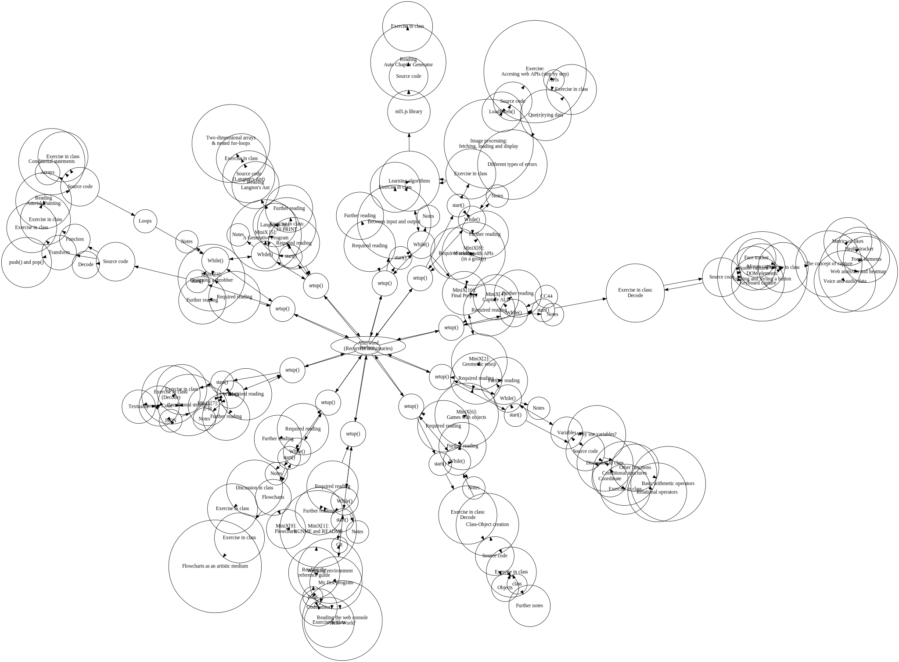

Title: TOC
page_order: -3

**Title:** Aesthetic Programming: A Handbook of Software Studies

**By**: Winnie Soon and Geoff Cox

## Colophon

## Table of Content

## Acknowledgments

## OSP

## Preface
* What kind of book is this?
* So why aesthetic programming?
* And software studies?
* Open publishing
* Flow of contents
* The book object

## Chapter 1: Getting started
* setup() and start()
* Working environment: p5.js, Code editor
* My first program
* Exercise in class
* Reading the web console "Hello World"
* Reading the reference guide
* Git
* While()
* MiniX[1]: RUNME and README
* Required reading & Further reading

## Chapter 2: Variable Geometry
* setup() and start()
* Source code
* Coordinate
* Exercise in class
* Variables
* Why use variables
* Other functions
* Basic arithmetic operators
* Conditional structures
* Relational operators
* Discussion in class
* While()
* MiniX[2]: Geometric emoji
* Required reading & Further reading

## Chapter 3: Infinite Loops
* setup() and start()
* Decode
* Source code
* Function
* Exercise in class
* Transform
* push() and pop()
* Exercise in class  
* Asterisk Painting
* Source code
* Exercise in class
* Arrays
* Conditional statements
* Loops
* While()
* MiniX[3]: Designing a Throbber
* Required reading & Further reading

## Chapter 4: Data Capture
* setup() and start()
* Exercise in class (Decode)
* Source code
* DOM elements: creating and styling a button
* Mouse capture
* Keyboard capture
* Audio capture
* Face tracker
* Exercise in class
* The concept of capture
* Web analytics and heatmap
* Form elements
* Metrics of likes
* Voice and audio data
* Health tracker
* While()
* MiniX[4]: CAPTURE ALL
* Required reading & Further reading

## Chapter 5: Auto Generator
* setup() and start()
* Exercise in class (10 PRINT)
* Langton's Ant
* Source code (Langton's Ant)
* Reading Langton's Ant
* Two-dimensional arrays & nested for-Loops
* Exercise in class
* While()
* MiniX[5]: A generative program
* Required reading & Further reading

## Chapter 6: Object Orientation
* setup() and start()
* Exercise in class (Decode)
* Source code
* class
* Objects
* Class-Object creation
* Exercise in class
* Further notes
* While()
* MiniX[6]: Games with objects
* Required reading & Further reading

## Chapter 7: Vocable Code
* setup() and start()
* Exercise in class (Decode)
* Texuality
* Conditional structure
* JSON
* Source Code
* Exercise in class
* While()
* MiniX[7]: E-lit
* Required reading & Further reading

## Chapter 8: Que(e)ry Data
* setup() and start()
* Exercise in class
* Image processing: fetching, loading and display
* Source code
* Exercise: Accessing web APIs (step by step)
* APIs
* Que(e)rying data
* Exercise in class
* LoadPixels()
* Different types of errors
* While()
* MiniX[8]: Working with APIs (in a group)
* Required reading & Further reading

## Chapter 9: Algorithmic Procedures
* setup() and start()
* Discussion in class
* Exercise in class
* Flowcharts
* Exercise in class
* Flowcharts as an artistic medium
* While()
* MiniX[9]: Flowcharts
* Required reading & Further reading

## Chapter 10: Machine Learning
* setup() and start()
* Between input and output
* Exercise in class
* Learning algorithms
* ml5.js library
* Source code
* Reading Auto Chapter Generator
* Exercise in class
* While()
* MiniX[10]: Final Project
* Required reading & Further reading

## Afterword (Recurrent Imaginaries)

## Bibliography

## Projects

## Showcase
*only available on web version*

## Back cover
- [about page](README.md)

## Index
reference to: <https://monoskop.org/media/text/?> and Linda's work in Exe practice
