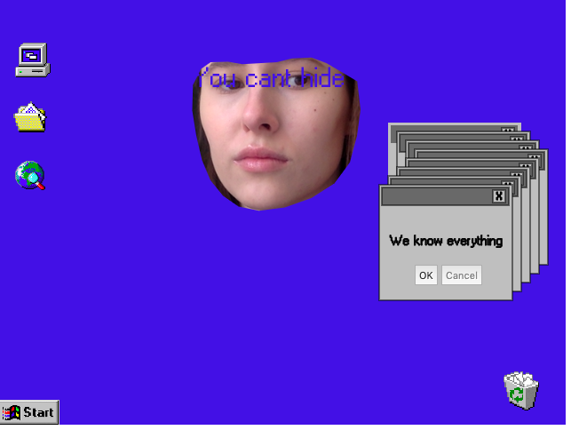

Title: Showcase
page_order: 14

## Selected students work
The list will continuously update on the online version.

### MiniX[1]: RunMe and ReadMe

{: .medium}
:    [Work](https://gitlab.com/JaneCl/ap-2020/-/blob/master/public/MiniEx1/READMEMiniX1.md) by Jane Clausen, 2020

### MiniX[2]: Geometric emoji

{: .medium}
:    [Work](https://gitlab.com/Adeve_/ap2020/-/tree/master/public/MiniEx_2) by Andreas Frederiksen, 2020

<figure class="columns" markdown=true>
{: .medium}
{: .medium}
<figcaption>
[Work](https://gitlab.com/clara.j.lassen/ap-2020/-/blob/master/public/Mini%20Exercises/miniEx2/Readme%20miniEx2.md) by Clara Josefine Jassan Lassen, 2020
</figcaption>
</figure>

### MiniX[3]: Designing a throbber

{: .medium}
:    [Work](https://gitlab.com/amanda.hansen1404/ap2020/-/tree/master/public/MiniX3) by Amanda Hansen, 2020

{: .medium}
:    [Work](https://magnusbak.gitlab.io/ap2020/MiniX3/) by Magnus Bak Nielsen, 2020

{: .medium}
:    [Work](https://gitlab.com/linesdmoller/ap2020/-/tree/master/public/MiniX5) by Line Stampe-Degn Møller, 2020

### MiniX[4]: Capture ALL

{: .medium}
:    [We know everything](https://gitlab.com/SophiaMcCulloch/ap2020/-/tree/master/public%2FMiniex4) by Sophia McCulloch, 2020

### MiniX[5]: A Generative Program

{: .medium}
:    [ANT LIFE](https://gitlab.com/mikkeldahlin/ap-2020/-/tree/master/public/Projects/MiniEX7.1) by Mikkel Dahlin, 2020

{: .medium}
:    [Work](https://gitlab.com/pernwn/ap2020/-/tree/master/public/MX7) by Torvald Pockel and Pernille P.W. Johansen, 2020

### MiniX[6]: Games with objects

{: .medium}
:    [Work](https://gitlab.com/Adeve_/ap2020/-/tree/master/public/MiniEx_6) by Andreas Frederiksen, 2020

{: .medium}
:    [Work](https://gitlab.com/M.Marschall/ap2020/-/tree/master/public/AllMiniEx/MiniEX6) by Mads Marschall, 2020

### MiniX[7]: E-lit

{: .medium}
:    [Recipe](https://gitlab.com/OliviaSP/ap2020/-/blob/master/public/MiniEx8/README_MiniEx8.md) by Olivia Smedegaard Peray and Stine Mygind, 2020

{: .medium}
:    [Words_](https://gitlab.com/SimonVanNguyen/aestetic-programming-2020/-/tree/master/public/miniEx8) by Simon Van Nguyen and Torvald Pockel, 2020

{: .medium}
:    [wordsOfMyFeelings](https://gitlab.com/annika.nh1/ap-2020/-/tree/master/public/MiniEx8) by Annika Hoffmann and Helene Boeriis, 2020

### MiniX[8]: Working with APIs

{: .medium}
:    [Corona bar](https://gitlab.com/pernwn/ap2020/-/tree/master/public/MX9) by Anne Nielsen, Simon Van Nguyen, Pernille P.W. Johansen, and Torvald Pockel, 2020

### MiniX[10]: Final Project

{: .medium}
:    [4-card Monte](https://sophiamcculloch.gitlab.io/ap2020/Eksamen/) by Jonas Paaske Ditlevsen, Sophia McCulloch, Mads Lindgaard, 2020 (Selected work for [Ars Electronia Festival](https://ausstellungen.ufg.at/wildstate/project/card-monte/) 2020)

**Description**

4-Card Monte is an interactive project that finds its aesthetics from the Windows 98 desktop where three windows are open: a game, Instagram, and the Notepad. The participant is invited to play the game. The goal is to locate one of the two red cards out of four cards that face-down. If the participant locates a red card, he/she wins that round and moves onto the next. If not, he/she loses. The first screen in the game is a set of instructions for the participant to follow, where it is stated that the chance to win a round is 50/50. But then, something (or someone) takes over the control of the desktop, as posts, followers, and followings start to disappear from the Instagram window, the cursor moves without interaction from the participant, and messages appear in the Notepad as if something (or someone) is writing.

On the surface it appears to be a simple card game, however it is quickly revealed that something darker is at play and that the card game is ultimately rigged.

This project is a comment on the control that technology has on us and our society. The power relations that are obfuscated in the incorporeal, virtual world become apparent and tangible, and thus the project invites the participant to feel what usually is actively concealed.

